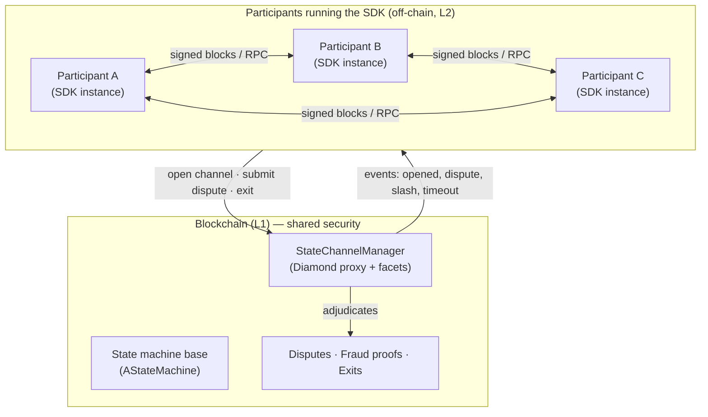
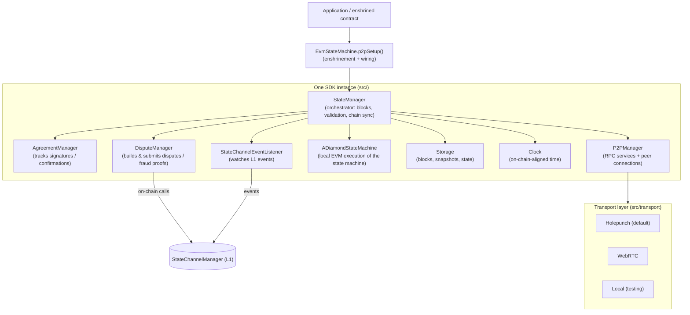
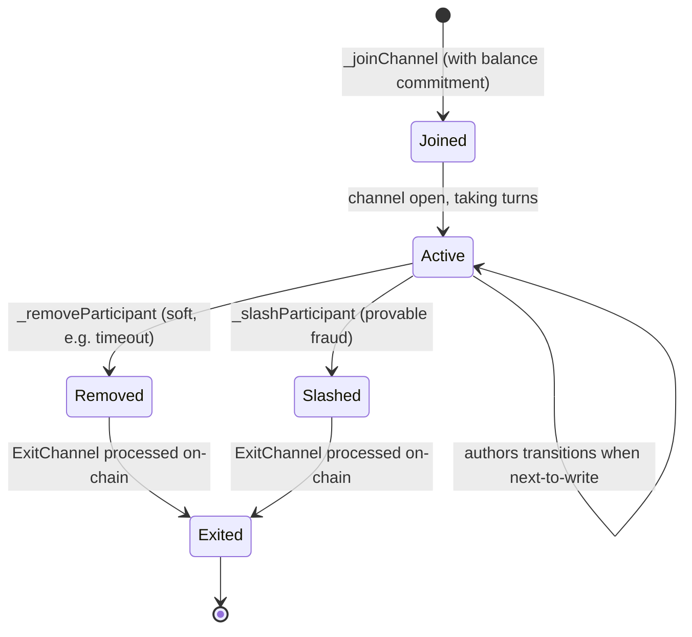
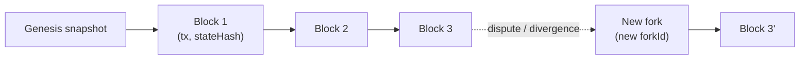
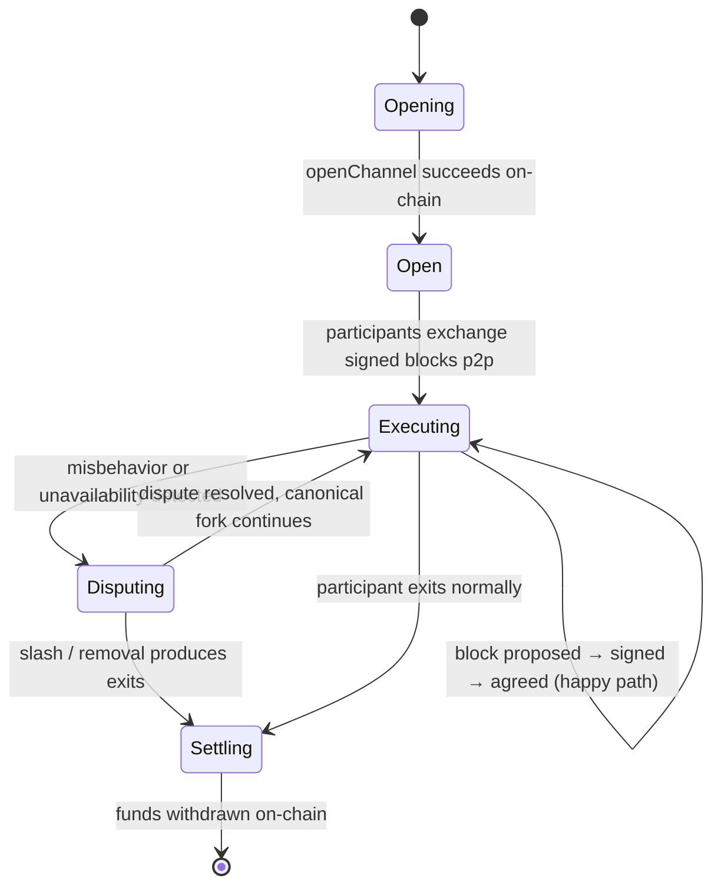
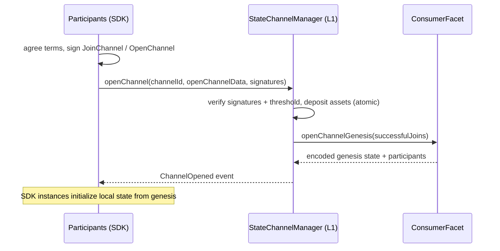
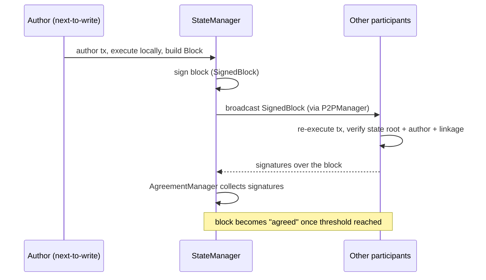
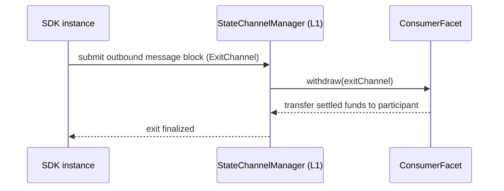
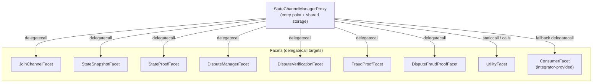
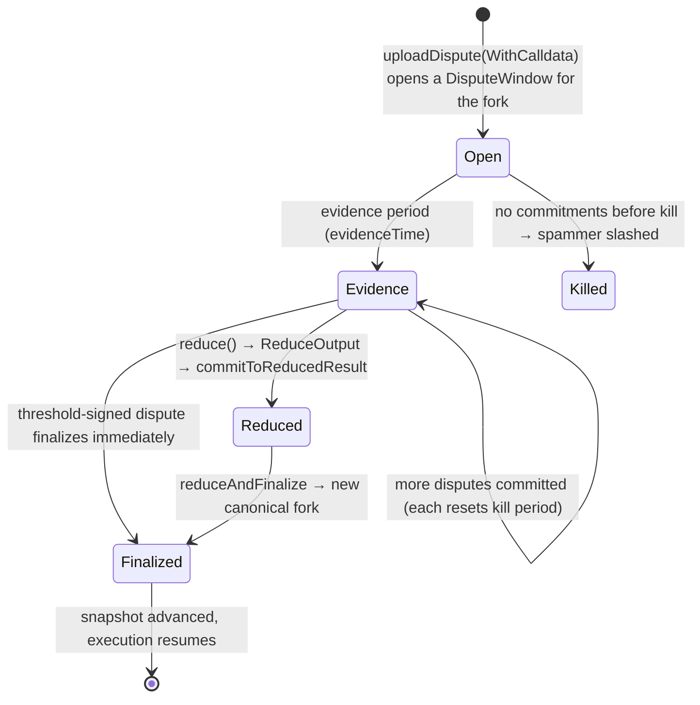

# Peer3 — State Channels Plus: Technical Specification

> **Status:** Draft · Minimal Feature Set (MFS)
> **Audience:** Integrators building state machines on top of the SDK, and contributors working on the SDK internals.
> **Scope:** This document specifies the architecture, protocol, contracts, and TypeScript SDK of the
> `state-channels-plus` repository. It supersedes and expands on [docs/mfsDocs.md](./mfsDocs.md).

This specification is written to be read top-to-bottom. Early sections build the mental model
(**concepts** and **lifecycle**); later sections are **reference material** (contracts, SDK components,
data types). Terms are **bolded** on first definition and collected in the [Glossary](#2-glossary).

Normative requirements use the keywords **MUST**, **MUST NOT**, **SHOULD**, and **MAY** as commonly
understood in technical specifications.

---

## Table of Contents

1. [Introduction](#1-introduction)
    - 1.1 [What this SDK is](#11-what-this-sdk-is)
    - 1.2 [The problem it solves](#12-the-problem-it-solves)
    - 1.3 [Design goals](#13-design-goals)
    - 1.4 [Scope of the Minimal Feature Set](#14-scope-of-the-minimal-feature-set)
2. [Glossary](#2-glossary)
3. [System Overview](#3-system-overview)
    - 3.1 [The two layers](#31-the-two-layers)
    - 3.2 [Architecture at a glance](#32-architecture-at-a-glance)
    - 3.3 [SDK component map](#33-sdk-component-map)
    - 3.4 [Security & trust model](#34-security--trust-model)
    - 3.5 [How to read the rest of this document](#35-how-to-read-the-rest-of-this-document)
4. [Core Concepts](#4-core-concepts)
    - 4.1 [The state machine model](#41-the-state-machine-model)
    - 4.2 [State serialization: `getState` / `_setState`](#42-state-serialization-getstate--_setstate)
    - 4.3 [Turn-taking: `getNextToWrite`](#43-turn-taking-getnexttowrite)
    - 4.4 [Participants and the abstract Balance](#44-participants-and-the-abstract-balance)
    - 4.5 [Participant lifecycle: join, remove, slash, exit](#45-participant-lifecycle-join-remove-slash-exit)
    - 4.6 [The history data model: transactions, blocks, forks, snapshots](#46-the-history-data-model-transactions-blocks-forks-snapshots)
5. [Protocol Lifecycle](#5-protocol-lifecycle)
    - 5.1 [Lifecycle at a glance](#51-lifecycle-at-a-glance)
    - 5.2 [Phase 1 — Open channel (on-chain)](#52-phase-1--open-channel-on-chain)
    - 5.3 [Phase 2 — Off-chain execution (happy path)](#53-phase-2--off-chain-execution-happy-path)
    - 5.4 [Phase 3 — Agreement](#54-phase-3--agreement)
    - 5.5 [Phase 4 — Dispute (unhappy path)](#55-phase-4--dispute-unhappy-path)
    - 5.6 [Phase 5 — Exit and settlement](#56-phase-5--exit-and-settlement)
6. [Smart Contract Specification](#6-smart-contract-specification)
    - 6.1 [Contract topology: the Diamond proxy](#61-contract-topology-the-diamond-proxy)
    - 6.2 [`AStateMachine` (integrator base)](#62-astatemachine-integrator-base)
    - 6.3 [`AConsumerFacet` (integrator base)](#63-aconsumerfacet-integrator-base)
    - 6.4 [`StateChannelManagerProxy` (entry contract)](#64-statechannelmanagerproxy-entry-contract)
    - 6.5 [Facet reference](#65-facet-reference)
    - 6.6 [On-chain storage model](#66-on-chain-storage-model)
    - 6.7 [Events](#67-events)
    - 6.8 [Errors](#68-errors)
7. [Dispute & Fraud-Proof System](#7-dispute--fraud-proof-system)
    - 7.1 [Why disputes exist](#71-why-disputes-exist)
    - 7.2 [On-chain dispute data model](#72-on-chain-dispute-data-model)
    - 7.3 [The dispute window lifecycle](#73-the-dispute-window-lifecycle)
    - 7.4 [State proofs and milestones](#74-state-proofs-and-milestones)
    - 7.5 [Block fraud proofs](#75-block-fraud-proofs)
    - 7.6 [Dispute fraud proofs](#76-dispute-fraud-proofs)
    - 7.7 [Timeouts and removal](#77-timeouts-and-removal)
    - 7.8 [Anti-spam and griefing protection](#78-anti-spam-and-griefing-protection)
    - 7.9 [The SDK side of disputes](#79-the-sdk-side-of-disputes)
8. [TypeScript SDK Specification](#8-typescript-sdk-specification)
    - 8.1 [SDK layering and the entry point](#81-sdk-layering-and-the-entry-point)
    - 8.2 [StateManager](#82-statemanager)
    - 8.3 [AgreementManager](#83-agreementmanager)
    - 8.4 [DisputeManager](#84-disputemanager)
    - 8.5 [P2PManager and the RPC layer](#85-p2pmanager-and-the-rpc-layer)
    - 8.6 [Transport layer](#86-transport-layer)
    - 8.7 [Storage](#87-storage)
    - 8.8 [Supporting components](#88-supporting-components)
9. [Data Types Reference](#9-data-types-reference)
    - 9.1 [Transactions and blocks](#91-transactions-and-blocks)
    - 9.2 [Messages](#92-messages)
    - 9.3 [Channel setup and membership](#93-channel-setup-and-membership)
    - 9.4 [Exits](#94-exits)
    - 9.5 [Balances](#95-balances)
    - 9.6 [Snapshots](#96-snapshots)
    - 9.7 [Dispute and proof types](#97-dispute-and-proof-types)
10. [Configuration & Operations](#10-configuration--operations)
    - 10.1 [The configuration file](#101-the-configuration-file)
    - 10.2 [Configuration precedence](#102-configuration-precedence)
    - 10.3 [Configuration reference](#103-configuration-reference)
    - 10.4 [Choosing a transport](#104-choosing-a-transport)
    - 10.5 [Local vs. networked operation](#105-local-vs-networked-operation)
    - 10.6 [Build, test, and format workflow](#106-build-test-and-format-workflow)
11. [Assumptions, Limitations & Threat Model](#11-assumptions-limitations--threat-model)
    - 11.1 [Assumptions](#111-assumptions)
    - 11.2 [Known limitations (MFS)](#112-known-limitations-mfs)
    - 11.3 [Threat model](#113-threat-model)
    - 11.4 [Open questions for the Full Feature Set](#114-open-questions-for-the-full-feature-set)

---

## 1. Introduction

### 1.1 What this SDK is

**State Channels Plus** is an SDK for building **scalable, resilient, client-side peer-to-peer (p2p)
state channels** for arbitrary state machines, with **shared security inherited from a blockchain**.

In plain terms: it lets a fixed group of participants run a shared program (a **state machine**) directly
between themselves — off-chain, in real time, with no per-action fees — while still being able to fall
back to a blockchain to resolve any disagreement. The blockchain acts as the final, trusted arbiter, but
is only touched when necessary (to open a channel, resolve a **dispute**, or exit).

The SDK is intentionally designed so that the development experience feels almost identical to writing a
normal on-chain contract. You write an EVM (Ethereum Virtual Machine) smart contract for your state
machine, and the SDK
**enshrines** an [ethers](https://github.com/ethers-io/ethers.js) contract instance so that calling it
executes p2p instead of on-chain — while keeping the exact same type and interface as the original
contract (see [`EvmStateMachine.p2pSetup`](../src/evm/EvmDiamondStateMachine.ts#L400)).

### 1.2 The problem it solves

Running every interaction directly on a blockchain is slow and expensive: each action becomes a
transaction that must be gossiped, ordered, executed, and paid for. For interactive, high-frequency
applications (games, real-time markets, negotiations), this is prohibitive.

Classic **state channels** solve part of this: participants exchange signed updates off-chain and only
settle on-chain. But traditional channels are typically limited to simple payment flows or bespoke,
hard-to-generalize logic.

State Channels Plus generalizes this to **arbitrary state machines**: any EVM contract that implements a
small base interface can be run as a channel. Participants execute the contract p2p, exchange signed
**blocks**, and rely on the blockchain only as a court of last resort. This preserves the security of the
underlying ledger while removing its cost and latency from the common path.

### 1.3 Design goals

The system is shaped by the following goals:

- **Arbitrary computation.** Support any EVM state machine, not just payments.
- **Same developer experience as on-chain.** An enshrined contract is a drop-in substitute for the
  original contract and preserves its TypeChain-generated type (the strongly-typed TypeScript bindings
  generated from the Solidity contract).
- **Shared security.** Correctness is ultimately enforced by the blockchain through disputes and
  **fraud proofs**, not by trusting peers.
- **No fees on the happy path.** Normal execution happens entirely p2p, with zero gas cost.
- **Resilience.** Misbehavior (invalid transitions, unavailability) is detectable and punishable via
  **slashing**, **removal**, and **timeouts**.

### 1.4 Scope of the Minimal Feature Set

This repository currently ships a **Minimal Feature Set (MFS)**, delivered as part of a
[Web3 Foundation grant](https://github.com/w3f/Grants-Program/pull/2350). The MFS demonstrates the full
end-to-end lifecycle (open → execute → dispute → exit) for EVM state machines, using the
[Tic-Tac-Toe example](../examples/TicTacToe) as the reference integration.

The MFS is **not recommended for production**. Features beyond the MFS (broader functionality, additional
hardening) are planned for the Full Feature Set. Where behavior is MFS-specific, this document notes it.

---

## 2. Glossary

The system uses a precise vocabulary. Definitions here are authoritative; later sections assume them.

| Term                                  | Definition                                                                                                                                                                                                                                                                              |
| ------------------------------------- | --------------------------------------------------------------------------------------------------------------------------------------------------------------------------------------------------------------------------------------------------------------------------------------- |
| **State machine**                     | The application logic: an EVM contract that extends [`AStateMachine`](../contracts/V1/AStateMachine.sol). Its variables are the channel's state; its functions are the allowed transitions.                                                                                             |
| **State channel**                     | A fixed group of **participants** collectively running one **state machine** off-chain, secured by the blockchain.                                                                                                                                                                      |
| **Participant**                       | An address that is part of a channel and may progress the state machine when it is their turn.                                                                                                                                                                                          |
| **Channel ID**                        | A unique `bytes32` identifier for a channel.                                                                                                                                                                                                                                            |
| **Next-to-write**                     | The participant whose turn it is to produce the next transaction, as reported by `getNextToWrite()`. Turn-taking is defined by the state machine itself.                                                                                                                                |
| **Transaction**                       | A single proposed state transition: a header (channel, author, fork, counter, timestamp) plus a body (the EVM calldata to execute). See [`Transaction`](../contracts/V1/types/DataTypes.sol).                                                                                           |
| **Block**                             | A committed unit of progress: a **transaction**, the resulting state snapshot hash, the previous block hash, and any produced message blocks. Blocks form a hash-linked chain. See [`Block`](../contracts/V1/types/DataTypes.sol).                                                      |
| **Signed block / Block confirmation** | A block signed by its author (`SignedBlock`), and a block plus signatures from the required participants (`BlockConfirmation`). Confirmation is what makes a block **agreed**.                                                                                                          |
| **Agreement**                         | The set of participant signatures over a block. The SDK's `AgreementManager` tracks which blocks have collected sufficient signatures.                                                                                                                                                  |
| **Threshold / Threshold-signed**      | The set of signatures required to make an artifact (block, join, dispute) binding. In the MFS the threshold is **unanimous** — every current participant must sign; the on-chain check requires signatures from _all_ participants.                                                     |
| **Fork / Fork ID**                    | A branch of channel history, identified by a `forkId`. Forks arise when history diverges (e.g. after a dispute); the protocol determines the canonical fork.                                                                                                                            |
| **Snapshot / Snapshot data**          | A compact commitment to channel state at a point in history: the state-machine state root, participants, and the heads/heights of the inbound and outbound message chains, plus deposit/withdrawal totals. See [`StateSnapshot` / `SnapshotData`](../contracts/V1/types/DataTypes.sol). |
| **Message / Message block**           | Cross-boundary communication between the channel (L2) and the chain (L1). **Inbound** messages flow L1 → L2 (e.g. join); **outbound** messages flow L2 → L1 (e.g. exit). Messages are batched into hash-linked message blocks.                                                          |
| **Join channel**                      | The act of a participant entering a channel, carrying a **balance** commitment. See [`JoinChannel`](../contracts/V1/types/DataTypes.sol).                                                                                                                                               |
| **Exit channel**                      | A participant leaving a channel with a resulting balance, produced by a state transition or enforced on-chain via dispute. See [`ExitChannel`](../contracts/V1/types/DataTypes.sol).                                                                                                    |
| **Balance**                           | An abstract value type (`{ amount, data }`) whose arithmetic and comparison are defined by the state machine, allowing custom balance semantics.                                                                                                                                        |
| **Dispute**                           | An on-chain challenge used to resolve disagreement or misbehavior, adjudicated by the blockchain.                                                                                                                                                                                       |
| **Fraud proof**                       | Evidence submitted on-chain that a participant produced an invalid transition or block, enabling **slashing**.                                                                                                                                                                          |
| **Slash**                             | Punishment of a participant for provable fraud; the state machine defines how the slash is applied (via `_slashParticipant`).                                                                                                                                                           |
| **Remove**                            | A softer exit than slashing (e.g. on **timeout**): a participant is removed without necessarily being punished (via `_removeParticipant`).                                                                                                                                              |
| **Timeout**                           | A deadline mechanism that bounds how long the system waits for a participant, enabling liveness.                                                                                                                                                                                        |
| **Enshrined / wrapped contract**      | An ethers contract instance transformed by the SDK so that calling it executes p2p while preserving its original type and interface.                                                                                                                                                    |
| **StateChannelManager**               | The on-chain contract that governs a channel: opening, disputes, fraud proofs, snapshots, and exits. Implemented as a **Diamond proxy** extending [`StateChannelManagerProxy`](../contracts/V1/StateChannelDiamondProxy/StateChannelManagerProxy.sol).                                  |
| **Diamond proxy / Facet**             | The [EIP-2535](https://eips.ethereum.org/EIPS/eip-2535) pattern: one proxy contract delegates to multiple **facets**, each holding a slice of logic (dispute handling, fraud proofs, snapshots, etc.).                                                                                  |
| **SDK**                               | The TypeScript library in [`src/`](../src) that runs the p2p protocol and drives the on-chain contracts.                                                                                                                                                                                |

---

## 3. System Overview

### 3.1 The two layers

The SDK is composed of two cooperating layers:

1. **Smart contracts (Solidity, on-chain, L1).** Base contracts that a project extends for its specific
   use case. They define the state-machine interface, and they adjudicate everything that must be
   trustless: opening channels, verifying disputes and fraud proofs, and processing exits. See
   [`contracts/V1`](../contracts/V1).

2. **TypeScript SDK (off-chain, client-side, L2).** The engine that actually runs the channel p2p. It
   proposes and validates blocks, collects agreement signatures, exchanges messages over a transport,
   watches the chain for relevant events, and escalates to the on-chain contracts when a dispute is
   required. See [`src/`](../src).

The essential idea: **the happy path lives entirely in the TypeScript layer (fast, free, p2p); the
contracts exist to make the happy path safe by standing ready to adjudicate.**

### 3.2 Architecture at a glance



Off-chain, each participant runs its own SDK instance. They exchange **signed blocks** and RPC messages
directly with one another. On-chain, a single **StateChannelManager** governs the channel and is only
invoked for opening, disputes, and exits. Chain **events** flow back to the SDK instances to keep them in
sync.

### 3.3 SDK component map

Inside a single SDK instance, responsibilities are divided among a set of managers coordinated by the
**StateManager**:



- **StateManager** — the central orchestrator: proposes/receives blocks, validates transitions, keeps
  storage and the local state machine in sync, and decides when to escalate to a dispute.
  ([StateManager.ts](../src/stateManager/StateManager.ts))
- **AgreementManager** — tracks which blocks have collected the required participant signatures.
  ([AgreementManager.ts](../src/agreementManager/AgreementManager.ts))
- **DisputeManager** — constructs disputes and fraud proofs and submits them on-chain.
  ([DisputeManager.ts](../src/disputeManager/DisputeManager.ts))
- **P2PManager** — manages peer connections and the RPC layer used to exchange blocks and coordinate.
  ([P2PManager.ts](../src/P2PManager.ts))
- **ADiamondStateMachine** — runs the state machine's EVM logic locally to compute transitions.
  ([ADiamondStateMachine.ts](../src/ADiamondStateMachine.ts))
- **Transport layer** — pluggable connectivity: **Holepunch** (default), **WebRTC**, and a **Local**
  transport for tests. ([src/transport](../src/transport))
- **Clock** — time aligned to on-chain block time, so timeouts are consistent across participants.
  ([Clock.ts](../src/Clock.ts))
- **StateChannelEventListener** — subscribes to L1 events (opened, dispute, slash, timeout) and feeds
  them back into the StateManager. ([StateChannelEventListener.ts](../src/StateChannelEventListener.ts))
- **EventBus** — the unified event surface shared by both realms (the runtime host and the main-thread
  client). It carries p2p hooks, mirrored on-chain events, and raw contract events, bridging worker-side
  emissions to the main thread over the runtime port. ([events/EventBus.ts](../src/events/EventBus.ts))

> **Runtime host/client split (threaded/distributed runtime).** The managers above run inside a **runtime
> host** that is either inline (same thread) or, when `RUN_SDK_IN_THREAD` is enabled, a dedicated **worker
> thread**. The application interacts with the host through a thin **runtime client** over a message port,
> observing events via the [`EventBus`](../src/events/EventBus.ts) and issuing calls via `hostRpc` (§8.1).
> This is what makes an SDK instance relocatable across threads and processes — the basis for the parallel
> and distributed test runners (§10.6).

### 3.4 Security & trust model

The security posture rests on a few principles:

- **The blockchain is the root of trust.** Participants do **not** need to trust each other. Any
  disagreement can be escalated to the on-chain **StateChannelManager**, whose verdict is final.
- **Everything meaningful is signed.** Blocks, join/open requests, and disputes are signed by their
  authors. An SDK instance **MUST NOT** accept a block as agreed without the required signatures.
- **Invalid behavior is provable.** Because transitions are deterministic EVM execution over a known
  prior state, a participant who produces an invalid transition can be caught with a **fraud proof** and
  **slashed**.
- **Liveness is bounded by timeouts.** A participant who stops responding can be **removed** via the
  **timeout** mechanism, so the channel is not held hostage by unavailability.
- **On-chain adjudication is composable and atomic.** Asset movements are **composable** — the manager
  delegates each individual transfer to the integrator's consumer facet rather than hard-coding one asset
  type — and channel opening performs them atomically (all-or-nothing, unless configured otherwise via
  `OpenChannel.isAtomic`).

> **Note (MFS):** These properties describe the intended model of the system as implemented in the MFS.
> Production hardening is part of the Full Feature Set. Do not rely on this SDK for production security.

### 3.5 How to read the rest of this document

- If you are **integrating** (building your own state machine), focus on
  [Core Concepts](#4-core-concepts), [Protocol Lifecycle](#5-protocol-lifecycle), the
  [Smart Contract Specification](#6-smart-contract-specification), and
  [Configuration & Operations](#10-configuration--operations).
- If you are **contributing** to the SDK internals, focus on the
  [Dispute & Fraud-Proof System](#7-dispute--fraud-proof-system),
  [TypeScript SDK Specification](#8-typescript-sdk-specification), and the
  [Data Types Reference](#9-data-types-reference).

---

## 4. Core Concepts

This section builds the mental model needed for everything that follows. It uses the
[Tic-Tac-Toe example](../examples/TicTacToe) — a two-player game with a wager — as a running
illustration, referencing
[`TicTacToeStateMachine.sol`](../examples/TicTacToe/contracts/TicTacToe/TicTacToeStateMachine.sol).

### 4.1 The state machine model

A **state machine** is an ordinary EVM contract that extends
[`AStateMachine`](../contracts/V1/AStateMachine.sol). Two ideas define it:

- **Its storage variables _are_ the channel state.** In Tic-Tac-Toe, that is the `TicTacToeState`
  struct — the board, current player, move count, participants, and balances.
- **Its functions _are_ the allowed transitions.** `makeMove(row, col)` is the only way a player can
  progress the game.

A transition is applied through the base contract's
[`stateTransition`](../contracts/V1/AStateMachine.sol) function, which executes the transaction's
calldata against the contract itself under a fixed `gasLimit`:

```solidity
(bool success, bytes memory result) = address(this).call{gas: gasLimit}(transaction.body.data);
```

Because the same calldata applied to the same prior state must always yield the same result,
**transitions are deterministic**. Determinism is not a convenience — it is the foundation of the
security model: it is precisely what lets any participant (or the blockchain) _re-execute_ a transition
and prove that a claimed result was invalid (see [Dispute & Fraud-Proof System](#7-dispute--fraud-proof-system)).

> **Author identity uses `_tx`, not `msg.sender`.** Because a transition may be executed p2p by any
> participant (and, during a dispute, re-executed on-chain by someone else), the _author_ of a
> transaction is carried explicitly in the transaction header. A state machine **MUST** identify the
> acting participant via `_tx.header.participant`, **not** `msg.sender`. Tic-Tac-Toe enforces turns
> exactly this way:
>
> ```solidity
> modifier onlyCurrentPlayer() {
>     require(_tx.header.participant == state.currentPlayer, "Not your turn");
>     _;
> }
> ```

### 4.2 State serialization: `getState` / `_setState`

The protocol frequently needs to **snapshot** the entire state and later **restore** it (to fork,
dispute, or re-execute history). Two functions provide this:

```solidity
function getState() public view virtual returns (bytes memory);   // serialize
function _setState(bytes memory encodedState) internal virtual;    // restore
```

They **MUST** be exact inverses: `_setState(getState())` **MUST** leave the state unchanged. Tic-Tac-Toe
implements them with a single ABI encode/decode of its state struct:

```solidity
function getState() public view override returns (bytes memory) { return abi.encode(state); }
function _setState(bytes memory encodedState) internal override { state = abi.decode(encodedState, (TicTacToeState)); }
```

The hash of the serialized state (the **state root**) is what a block commits to, so any divergence in
serialization would break agreement and dispute verification.

### 4.3 Turn-taking: `getNextToWrite`

At any point, exactly one participant is authorized to author the next transaction — the
**next-to-write**:

```solidity
function getNextToWrite() public view virtual returns (address);
```

The _state machine itself_ decides turn order; the protocol simply trusts this function to say who is
allowed to move. In Tic-Tac-Toe it returns `state.currentPlayer`. The SDK uses this to decide whether a
received block came from the legitimate author, and whether it is this instance's turn to produce one.

### 4.4 Participants and the abstract Balance

`getParticipants()` returns the channel's current participant set. Value is represented by an **abstract
`Balance`** type rather than a raw integer:

```solidity
struct Balance { uint256 amount; bytes data; }
```

The state machine defines what a balance _means_ by implementing its arithmetic and comparisons —
`addBalance`, `subtractBalance`, `areBalancesEqual`, `isBalanceLesserThan`, `getTotalStateBalance`, and
`getZeroBalance`. This lets a channel model simple token amounts (as Tic-Tac-Toe does, using only
`amount`) or richer, multi-asset semantics (by using the `data` field). The `subtractBalance`
implementation **MUST** reject underflow (a participant cannot spend more than they hold), preserving the
channel's value-conservation invariant.

### 4.5 Participant lifecycle: join, remove, slash, exit

A participant moves through a small lifecycle, each stage backed by an `AStateMachine` hook:



- **Join** — `_joinChannel(JoinChannel)` incorporates a new participant, carrying their **balance**
  commitment. Tic-Tac-Toe pushes the participant and their stake into state.
- **Remove** — `_removeParticipant(address)` is the _soft_ exit, currently triggered on **timeout**. The
  participant leaves without being treated as a fraudster.
- **Slash** — `_slashParticipant(address)` is the _punitive_ exit for provable fraud; the state machine
  decides how the penalty is applied. (Tic-Tac-Toe treats a slash like a removal.)
- **Exit** — removal and slashing both yield an **`ExitChannel`** (a participant + resulting balance).
  The base contract records it as an **outbound message** (`_addExitChannel`), which is later processed
  L2 → L1 so funds can be withdrawn (see [Phase 5](#56-phase-5--exit-and-settlement)).

> **Outbound messages** are the channel's way of instructing the chain to act (e.g. release funds). They
> are produced as a byproduct of a transition and accumulated during `stateTransition`, then settled
> on-chain.

### 4.6 The history data model: transactions, blocks, forks, snapshots

Off-chain progress is recorded as a hash-linked history. The key types (fully detailed in the
[Data Types Reference](#9-data-types-reference)) are:

- **Transaction** — a proposed transition: a header (`channelId`, `participant`, `forkId`,
  `transactionCnt`, `timestamp`) plus a body (the EVM calldata).
- **Block** — a committed transition: the transaction, the resulting `stateSnapshotHash`, the
  `previousBlockHash`, and any produced `messageBlocks`. Blocks chain together via `previousBlockHash`.
- **Fork / `forkId`** — a branch of history. Divergence (e.g. after a dispute) creates a new fork; the
  protocol determines the canonical one.
- **Snapshot** — a compact commitment to state at a point in history: the state root, participants, and
  the heads/heights of the **inbound** (L1 → L2) and **outbound** (L2 → L1) message chains, plus deposit
  and withdrawal totals.



With these concepts in place, the next section shows how they come together across the life of a channel.

## 5. Protocol Lifecycle

This section walks a channel from creation to settlement. Each phase names the responsible **contracts**
(on-chain) and **SDK components** (off-chain). Timing is governed by four protocol windows configured on
the manager at deployment — `p2pTime`, `agreementTime`, `chainFallbackTime`, and `evidenceTime` (see
[`StateChannelManagerProxy`](../contracts/V1/StateChannelDiamondProxy/StateChannelManagerProxy.sol)) —
and measured with an on-chain-aligned [`Clock`](../src/Clock.ts) so all participants agree on deadlines.

### 5.1 Lifecycle at a glance



### 5.2 Phase 1 — Open channel (on-chain)

Opening is the one unavoidable on-chain step. Participants agree off-chain on the channel's terms
(participants, balances/stakes, deadline) and sign them; the channel is then opened atomically on the
**StateChannelManager**.

- **Commitments are signed.** Each participant signs their [`JoinChannel`](../contracts/V1/types/DataTypes.sol)
  (channel id, participant, deadline, balance). The
  [`JoinChannelFacet`](../contracts/V1/StateChannelDiamondProxy/JoinChannelFacet.sol) verifies each
  signature _and_ that a valid **threshold** of the participant set signed — in the MFS, **all**
  participants (signatures are unanimous) — then deposits the committed assets composably (§3.4).
- **Genesis state is produced by the consumer facet.** The project's
  [`AConsumerFacet`](../contracts/V1/StateChannelDiamondProxy/AConsumerFacet.sol) implementation defines
  `openChannelGenesis(...)`, which turns the successful joins into the channel's initial serialized
  state and participant list.
- **Atomicity.** `OpenChannel.isAtomic` selects all-or-nothing opening versus opening only with the
  deposits that succeeded.



### 5.3 Phase 2 — Off-chain execution (happy path)

Once open, the channel runs entirely p2p — no gas, no chain. This is where the SDK does its work.

1. The **next-to-write** (`getNextToWrite`) authors a **transaction** and executes it locally against its
   [`ADiamondStateMachine`](../src/ADiamondStateMachine.ts), producing a new **block** (the transaction,
   the resulting state root, and the previous block hash).
2. The author signs the block (`SignedBlock`) and broadcasts it to peers via the
   [`P2PManager`](../src/P2PManager.ts) RPC layer over the active [transport](../src/transport).
3. Each peer's [`StateManager`](../src/stateManager/StateManager.ts) **re-executes** the transaction
   against its own copy of the state and checks the result matches the claimed state root, that the
   author was the legitimate next-to-write, and that the block links correctly to prior history.
4. If valid, each peer signs the block and returns its signature.



### 5.4 Phase 3 — Agreement

A block is **agreed** once it has collected the required threshold of participant signatures, forming a
`BlockConfirmation`. The [`AgreementManager`](../src/agreementManager/AgreementManager.ts) tracks this.

- An SDK instance **MUST NOT** treat a block as final (build the next block on top of it) until it is
  agreed.
- Agreement is time-bounded: the `p2pTime` and `agreementTime` windows bound how long the happy path
  waits before a participant may escalate. Failure to reach agreement in time is what moves the channel
  into a **dispute**.

### 5.5 Phase 4 — Dispute (unhappy path)

When agreement stalls — because a participant produced an **invalid** block, or simply went
**unavailable** — any participant can escalate to the blockchain, which acts as the final arbiter. This
is coordinated by the [`DisputeManager`](../src/disputeManager/DisputeManager.ts) and adjudicated by the
Diamond's dispute/fraud-proof facets.

- **Invalid transition → fraud proof → slash.** Because transitions are deterministic, an incorrect
  block can be disproven: the challenger submits the prior state and the offending transaction, the
  chain re-executes it, observes the mismatch, and **slashes** the author (`_slashParticipant`).
- **Unavailability → timeout → removal.** If a participant simply stops responding, the **timeout**
  mechanism (bounded by `chainFallbackTime` / `evidenceTime`) lets the channel **remove** them
  (`_removeParticipant`) so it can make progress.
- **Fork resolution.** A dispute may create a new **fork**; the protocol resolves history to a single
  canonical fork, after which off-chain execution resumes.

```mermaid
sequenceDiagram
    participant C as Challenger (SDK)
    participant DM as DisputeManager
    participant M as StateChannelManager (L1)
    C->>DM: detect invalid block or timeout
    DM->>M: submit dispute (+ fraud proof / state proof)
    M->>M: verify against snapshots; re-execute if fraud proof
    alt provable fraud
        M-->>C: slash offender → ExitChannel
    else timeout / unavailability
        M-->>C: remove participant → ExitChannel
    end
    Note over C,M: canonical fork established; execution resumes
```

The internal mechanics — fraud-proof construction, state proofs, and validation strategies — are detailed
in [Dispute & Fraud-Proof System](#7-dispute--fraud-proof-system).

### 5.6 Phase 5 — Exit and settlement

Exits (whether from a normal departure, a removal, or a slash) surface as **outbound messages** carrying
an [`ExitChannel`](../contracts/V1/types/DataTypes.sol). These are processed L2 → L1, and funds are
released via the consumer facet's `withdraw(...)`. Settlement conserves value: the sum of withdrawals
**MUST NOT** exceed the deposits and the channel's accounted balances.



## 6. Smart Contract Specification

This section is the on-chain reference. It describes the contract topology, the two base contracts an
integrator extends, the entry contract's public surface, and the events/errors/storage that make up the
contract ABI. All paths are under [`contracts/V1`](../contracts/V1).

### 6.1 Contract topology: the Diamond proxy

The on-chain **StateChannelManager** is implemented with the [EIP-2535](https://eips.ethereum.org/EIPS/eip-2535)
**Diamond** pattern: a single proxy holds all storage and delegates logic to a set of **facets**. This
keeps one shared storage layout while splitting the (large) logic across contracts under the EVM code-size
limit.



The mechanics that tie this together:

- **Shared storage.** Every facet inherits
  [`StateChannelManagerStorage`](../contracts/V1/StateChannelDiamondProxy/StateChannelManagerStorage.sol),
  so they all read/write the _same_ storage slots when reached via `delegatecall`. The proxy records each
  facet's address at construction.
- **Common base.** [`StateChannelCommon`](../contracts/V1/StateChannelDiamondProxy/StateChannelCommon.sol)
  layers shared view/helpers (participants, snapshots, inbound-message handling, timing getters) on top
  of storage; the proxy and every facet extend it.
- **`onlySelf` guard.** Sensitive functions (e.g. deposits/withdrawals) are marked `onlySelf`, meaning
  they may only be entered when `msg.sender == address(this)` — i.e. through an internal delegatecall
  path, never directly by an external caller.
- **Consumer fallback.** The proxy's `fallback()` delegatecalls the **consumer facet**, so an integrator
  can expose custom methods (`deposit`, `withdraw`, genesis construction) through the same address.

### 6.2 `AStateMachine` (integrator base)

**Purpose.** The base every application state machine extends
([`AStateMachine.sol`](../contracts/V1/AStateMachine.sol)). It is executed both off-chain (by the SDK)
and, during disputes, on-chain (by the manager), so its behavior **MUST** be deterministic.

**Interface (integrator implements the `virtual` hooks):**

| Function                                                                                                        | Kind                | Purpose                                                                     |
| --------------------------------------------------------------------------------------------------------------- | ------------------- | --------------------------------------------------------------------------- |
| `_setState(bytes) / getState()`                                                                                 | override            | Restore / serialize full state. **MUST** be exact inverses.                 |
| `getParticipants()`                                                                                             | override            | Current participant set.                                                    |
| `getNextToWrite()`                                                                                              | override            | Address authorized to author the next transaction.                          |
| `_joinChannel(JoinChannel)`                                                                                     | override            | Incorporate a new participant + balance.                                    |
| `_slashParticipant(address)`                                                                                    | override            | Punitive removal for provable fraud → `ExitChannel`.                        |
| `_removeParticipant(address)`                                                                                   | override            | Soft removal (timeout) → `ExitChannel`.                                     |
| `addBalance / subtractBalance / areBalancesEqual / isBalanceLesserThan / getTotalStateBalance / getZeroBalance` | override            | Define **Balance** arithmetic. `subtractBalance` **MUST** reject underflow. |
| `_processCustomInboundMessage(Message)`                                                                         | override (optional) | Handle custom L1 → L2 messages beyond `JOIN`.                               |

**System-invoked entry points (provided by the base, called by the manager/SDK):**

| Function                                                        | Purpose                                                                                                                                                   |
| --------------------------------------------------------------- | --------------------------------------------------------------------------------------------------------------------------------------------------------- |
| `stateTransition(Transaction)`                                  | Clears outbound messages, sets `_tx`, and executes `transaction.body.data` against `this` under `gasLimit`. Returns success + recorded outbound messages. |
| `processInboundMessage(Message)`                                | Applies an inbound message (dispatches `JOIN` to `_joinChannel`, else custom handler).                                                                    |
| `setState / joinChannel / slashParticipant / removeParticipant` | Reentrancy-guarded external wrappers used during dispute re-execution.                                                                                    |
| `getOutboundMessages()`                                         | Returns messages (e.g. `EXIT`) produced by the last transition.                                                                                           |

**Invariants.**

- `_setState(getState())` leaves state unchanged.
- Author identity is `_tx.header.participant`, never `msg.sender`.
- Transitions are deterministic (identical prior state + calldata ⇒ identical result and outbound
  messages).

### 6.3 `AConsumerFacet` (integrator base)

**Purpose.** The integrator-provided facet reached through the proxy fallback
([`AConsumerFacet.sol`](../contracts/V1/StateChannelDiamondProxy/AConsumerFacet.sol)). It defines how the
channel interacts with the _world_ state (tokens, external contracts).

| Function                                                                | Purpose                                                                                    |
| ----------------------------------------------------------------------- | ------------------------------------------------------------------------------------------ |
| `openChannelGenesis(JoinChannel[] successfulJoins, bytes optionalData)` | Build the channel's initial serialized state + participant list from the successful joins. |
| `deposit(JoinChannel)`                                                  | Pull the committed assets for a join (composed atomically at open).                        |
| `withdraw(ExitChannel)`                                                 | Release settled assets on exit.                                                            |

### 6.4 `StateChannelManagerProxy` (entry contract)

**Purpose.** The channel's on-chain governor and the address integrators deploy (by extending it, as the
[Tic-Tac-Toe manager](../examples/TicTacToe/contracts/TicTacToe/TicTacToeStateChannelManagerProxy.sol)
does). See [`StateChannelManagerProxy.sol`](../contracts/V1/StateChannelDiamondProxy/StateChannelManagerProxy.sol).

**Key external functions:**

| Function                                                              | Delegates to                                 | Purpose                                                                                                                                                               |
| --------------------------------------------------------------------- | -------------------------------------------- | --------------------------------------------------------------------------------------------------------------------------------------------------------------------- |
| `open(OpenChannelConfirmation)`                                       | (self) + consumer                            | Verify threshold signatures, deposit composably, build genesis snapshot, emit `ChannelOpened`.                                                                        |
| `joinChannel(JoinChannelConfirmation)`                                | `JoinChannelFacet`                           | Add a participant to an open channel.                                                                                                                                 |
| `postBlockCalldata(SignedBlock, maxTimestamp)`                        | (self)                                       | Persist a lightweight commitment `hash(signedBlock, timestamp)` to a block, so its author can later be held to it. Does **not** verify the block (junk is slashable). |
| `uploadDispute(DisputeConfirmation)`                                  | `DisputeManagerFacet`                        | Open/extend a dispute window (no calldata).                                                                                                                           |
| `uploadDisputeWithCalldata(DisputeConfirmation, DisputeAuditingData)` | `DisputeManagerFacet`                        | Same, carrying auditing data whose hash must match the dispute.                                                                                                       |
| `challengeDisputeReduction(...)`                                      | `DisputeVerificationFacet`                   | Challenge an incorrect dispute reduction.                                                                                                                             |
| `applyFraudProofs(...)` / `applyDisputeFraudProofs(...)`              | `FraudProofFacet` / `DisputeFraudProofFacet` | Verify fraud proofs and slash the offender (or the spammer).                                                                                                          |
| `updateStateSnapshotFork(...)` / `updateStateSnapshotSameFork(...)`   | `StateSnapshotFacet`                         | Advance the on-chain snapshot after a resolved dispute.                                                                                                               |
| `depositAssetsComposable(...)` / `withdrawAssetsComposable(...)`      | (self, `onlySelf`)                           | Composable, atomic asset movement.                                                                                                                                    |
| `executeStateTransition(channelId, encodedState, Transaction)`        | (self)                                       | Re-execute a transition on-chain for fraud verification.                                                                                                              |
| `verifyStateProof(...)`                                               | `StateProofFacet`                            | Verify a fork's state proof.                                                                                                                                          |

**Timing configuration** (constructor args; default in parentheses): `p2pTime` (15), `agreementTime` (5),
`chainFallbackTime` (30), `evidenceTime` (30). `gasLimit` for on-chain transition re-execution defaults to
3,000,000.

### 6.5 Facet reference

| Facet                                                                                               | Responsibility                                               | Key functions                                                                       |
| --------------------------------------------------------------------------------------------------- | ------------------------------------------------------------ | ----------------------------------------------------------------------------------- |
| [`JoinChannelFacet`](../contracts/V1/StateChannelDiamondProxy/JoinChannelFacet.sol)                 | Admit participants to an open channel                        | `joinChannel` (verifies signature + threshold, then deposits)                       |
| [`StateSnapshotFacet`](../contracts/V1/StateChannelDiamondProxy/StateSnapshotFacet.sol)             | Advance the canonical on-chain snapshot                      | `updateStateSnapshotFork`, `updateStateSnapshotSameFork`, `_verifyMilestones`       |
| [`StateProofFacet`](../contracts/V1/StateChannelDiamondProxy/StateProofFacet.sol)                   | Verify that a claimed latest state is proven within a fork   | `isCorrectLatestState`, `verifyStateProof`, milestone linkage checks                |
| [`DisputeManagerFacet`](../contracts/V1/StateChannelDiamondProxy/DisputeManagerFacet.sol)           | Open/extend dispute windows and commit reduced results       | `uploadDispute`, `uploadDisputeWithCalldata`, `commitToReducedResult`               |
| [`DisputeVerificationFacet`](../contracts/V1/StateChannelDiamondProxy/DisputeVerificationFacet.sol) | Reduce a set of disputes to a canonical outcome and finalize | `reduce`, `reduceAndFinalize`, `challengeDisputeReduction`, `computeDisputeOutput*` |
| [`FraudProofFacet`](../contracts/V1/StateChannelDiamondProxy/FraudProofFacet.sol)                   | Verify block-level fraud and slash                           | `applyFraudProofs`, `runFraudProof`                                                 |
| [`DisputeFraudProofFacet`](../contracts/V1/StateChannelDiamondProxy/DisputeFraudProofFacet.sol)     | Verify that a _dispute_ was fraudulent and slash             | `verifyDisputeFraudProofs`                                                          |
| [`UtilityFacet`](../contracts/V1/StateChannelDiamondProxy/UtilityFacet.sol)                         | Stateless helpers                                            | `verifyThresholdSigned`, `retrieveSignerAddress`, address/bytes set ops             |

### 6.6 On-chain storage model

All channel state on L1 is minimized to commitments (hashes), keyed by `channelId`
([`StateChannelManagerStorage.sol`](../contracts/V1/StateChannelDiamondProxy/StateChannelManagerStorage.sol)):

| Storage                    | Shape                                         | Holds                                                                                                      |
| -------------------------- | --------------------------------------------- | ---------------------------------------------------------------------------------------------------------- |
| `stateSnapshots`           | `channelId → StateSnapshot`                   | The current canonical snapshot (state root, participants, message-chain heads, deposit/withdrawal totals). |
| `channelBalances`          | `channelId → ChannelBalance`                  | Deposit/withdrawal totals and inbound/outbound message-block heads.                                        |
| `inboundMessageBlockMap`   | `channelId → (hash → MessageBlock)`           | Persisted inbound (L1 → L2) message blocks.                                                                |
| `blockCalldataCommitments` | `channelId → signer → forkId → height → hash` | Commitments posted via `postBlockCalldata`.                                                                |
| `disputeData`              | `channelId → DisputeData`                     | On-chain slashes, per-fork dispute windows, and the list of disputed forks.                                |

### 6.7 Events

Defined in [`StateChannelManagerEvents.sol`](../contracts/V1/StateChannelManagerEvents.sol). The SDK's
[`StateChannelEventListener`](../src/StateChannelEventListener.ts) subscribes to these to stay in sync.

| Event                                                    | Emitted when                                                |
| -------------------------------------------------------- | ----------------------------------------------------------- |
| `ChannelOpened`                                          | A channel is opened; carries the genesis snapshot + state.  |
| `StateSnapshotUpdated`                                   | The canonical snapshot advances.                            |
| `BlockCalldataPosted`                                    | A block-calldata commitment is posted.                      |
| `DisputeCommitted` / `DisputeCommittedWithAuditingData`  | A dispute is uploaded (optionally with auditing data).      |
| `DisputeReducedResultCommitted`                          | A dispute window commits to a reduced (canonical) result.   |
| `DisputeKilled`                                          | A dispute window is killed (e.g. spam with no commitments). |
| `ChainSlashed`                                           | A participant is slashed on-chain.                          |
| `InboundMessagesProcessed` / `OutboundMessagesProcessed` | Message blocks cross the L1/L2 boundary.                    |
| `WithdrawalsUpdated`                                     | Total withdrawals change (exit settlement).                 |
| `ChannelStorageCleared`                                  | Per-channel storage is cleared/reset.                       |

### 6.8 Errors

[`Errors.sol`](../contracts/V1/StateChannelDiamondProxy/Errors.sol) defines custom errors grouped by
concern. Two families are worth distinguishing:

- **Validation errors** (`Error*`) — a submitted argument is invalid (bad signature, invalid state
  proof, insufficient participants, withdrawal exceeds deposits, invalid fraud proof, …).
- **Race-condition guards** (`RaceCondition*`) — a state-dependent precondition failed due to timing or
  ordering (channel already open, calldata timestamp too late, evidence period expired, dispute already
  reduced, …). These are the on-chain guards that make the optimistic, time-boxed protocol safe.

## 7. Dispute & Fraud-Proof System

This is the heart of the security model and the most intricate subsystem. It explains how disagreement is
adjudicated on-chain, what can be proven fraudulent, and how the SDK drives it. The on-chain types live in
[`DisputeTypes.sol`](../contracts/V1/types/DisputeTypes.sol) and
[`ProofTypes.sol`](../contracts/V1/types/ProofTypes.sol); the SDK logic lives under
[`src/disputeManager`](../src/disputeManager) and [`src/stateManager`](../src/stateManager).

### 7.1 Why disputes exist

On the happy path, nothing touches the chain. Disputes exist for exactly the two ways the happy path can
break:

1. **Provable misbehavior** — a participant produced an _invalid_ block (bad transition, forged data,
   double-sign, bad timestamp). This is disproven with a **fraud proof** and punished by **slashing**.
2. **Unavailability** — a participant simply stops responding, stalling agreement. This is resolved with
   a **timeout**, which **removes** the participant so the channel can continue.

The design is **optimistic** (claims are assumed valid unless someone challenges them) and
**time-boxed**: a dispute opens a bounded _window_ during which evidence is
collected, the outcome is _reduced_ to a canonical result, and incorrect claims can themselves be
disproven.

### 7.2 On-chain dispute data model

The key structures (in [`DisputeTypes.sol`](../contracts/V1/types/DisputeTypes.sol)):

| Type                                      | Role                                                                                                                                                                                                                                                    |
| ----------------------------------------- | ------------------------------------------------------------------------------------------------------------------------------------------------------------------------------------------------------------------------------------------------------- |
| `Dispute` / `DisputeInput`                | The dispute claim: channel, `forkId`, the claimed latest state snapshot hash, inbound-message head, a `StateProof`, on-chain slashes, an optional `Timeout`, and the `disputer`.                                                                        |
| `SignedDispute` / `DisputeConfirmation`   | A dispute signed by its author, plus threshold signatures. Full-threshold confirmation lets a window finalize immediately.                                                                                                                              |
| `DisputeWindow` / `DisputeWindowEvidence` | Per-fork window state: creation timestamp, last-evidence timestamp, the list of dispute commitments, and who has posted.                                                                                                                                |
| `DisputeAuditingData`                     | The heavy data backing a dispute (genesis + latest snapshots, milestone snapshots, inbound/outbound message blocks). Referenced by hash from the dispute so uploads stay cheap.                                                                         |
| `ReduceOutput`                            | The canonical result of reducing a fork's disputes: the latest block, slashed participants, inbound-message head, `Timeout`, and self-removals (participants who, via a dispute, elected to remove _themselves_ — e.g. to exit when agreement stalled). |
| `DisputeData`                             | Per-channel dispute storage: on-chain slashes, the per-fork `DisputeWindow` map, and the list of disputed forks.                                                                                                                                        |

### 7.3 The dispute window lifecycle

A dispute progresses through a bounded window governed by `evidenceTime` (evidence period) and a
subsequent _kill period_ (a follow-on interval in which a window that gathered no honest evidence can be
cancelled and its opener slashed — see §7.8):



1. **Upload.** `uploadDispute` (or `uploadDisputeWithCalldata`) opens a `DisputeWindow` for the disputed
   `forkId`, starting the evidence period. Only participants eligible to dispute may post, and a disputer
   **MUST** be `msg.sender`.
2. **Evidence.** Within `evidenceTime`, additional disputes can be committed; each submission resets the
   kill period. A dispute confirmed by the full threshold finalizes the window immediately.
3. **Reduce.** [`DisputeVerificationFacet.reduce`](../contracts/V1/StateChannelDiamondProxy/DisputeVerificationFacet.sol)
   deterministically folds the collected disputes into a single `ReduceOutput` (the canonical latest
   block, the set of slashed participants, any timeout, and self-removals).
4. **Finalize.** `commitToReducedResult` / `reduceAndFinalize` commits the reduced fork and advances the
   on-chain snapshot, producing a new canonical `forkId` from which execution resumes.

### 7.4 State proofs and milestones

A dispute must prove _which_ state is actually the latest agreed one. That evidence is a **state proof**
([`ProofTypes.sol`](../contracts/V1/types/ProofTypes.sol)):

- A **`MilestoneProof`** is a set of `BlockConfirmation`s — blocks that carry threshold signatures and
  are therefore _finalized_ points in history.
- A **`StateProof`** is a chain of milestones plus a trailing list of `signedBlocks` that
  cryptographically link the last milestone to the claimed latest block.
- [`StateProofFacet`](../contracts/V1/StateChannelDiamondProxy/StateProofFacet.sol) verifies that the
  milestones are correctly signed and linked (`_areSignedBlocksLinkedAndVerified`) and derives the union
  of participants who attested along the way.

This is what makes an invalid dispute detectable: if the claimed latest state is not actually proven by a
valid milestone chain, a **dispute fraud proof** (§7.6) can slash the disputer.

### 7.5 Block fraud proofs

Block-level fraud proves that a _block_ was invalid. Each type is dispatched by
[`FraudProofFacet.runFraudProof`](../contracts/V1/StateChannelDiamondProxy/FraudProofFacet.sol) to a
handler that returns the address to slash.

| `FraudProofType`              | Proves                                                                           |
| ----------------------------- | -------------------------------------------------------------------------------- |
| `BlockDoubleSign`             | The author signed two conflicting blocks at the same height/fork.                |
| `BlockInvalidStateTransition` | Re-executing the transaction does not yield the claimed state root.              |
| `WrongGenesis`                | The block chains from an incorrect genesis.                                      |
| `InvalidTimestamp`            | The block's timestamp violates ordering rules.                                   |
| `ForgedInboundMessageBlock`   | The block references an inbound message block that was never persisted on-chain. |

> **Self-slashing guard.** In `applyFraudProofs`, if a submitted proof does **not** validly slash the
> claimed participant (it returns `address(0)` or a different address), the **submitter** (`msg.sender`)
> is slashed instead. This makes submitting bogus fraud proofs costly.

### 7.6 Dispute fraud proofs

A second family proves that a _dispute itself_ was fraudulent, adjudicated by
[`DisputeFraudProofFacet.verifyDisputeFraudProofs`](../contracts/V1/StateChannelDiamondProxy/DisputeFraudProofFacet.sol).

| `DisputeFraudProofType`                                                                                                                   | Proves the dispute …                                                                       |
| ----------------------------------------------------------------------------------------------------------------------------------------- | ------------------------------------------------------------------------------------------ |
| `DisputeNotLatestState`                                                                                                                   | claimed a latest state that is not actually the latest.                                    |
| `DisputeInvalidOutputState`                                                                                                               | computed an incorrect output/reduced state.                                                |
| `DisputeInvalidStateProof`                                                                                                                | carried a malformed or unverifiable state proof.                                           |
| `DisputeInvalidBalanceInvariant`                                                                                                          | violated value conservation (balances/withdrawals).                                        |
| `DisputeOnChainSlashesNotSubset`                                                                                                          | listed on-chain slashes that are not a valid subset.                                       |
| `Timeout*` (`TimeoutThreshold`, `TimeoutCalldataPosted`, `TimeoutNotLinkedToLatestState`, `TimeoutParticipantNotNext`, `TimeoutTooEarly`) | asserted an invalid timeout (wrong target, premature, contradicted by posted calldata, …). |
| `DisputeLastMilestoneNotFinalAndNoAuditingData` / `InvalidDisputeReason`                                                                  | is structurally invalid or unjustified.                                                    |

### 7.7 Timeouts and removal

Unavailability is handled by the `Timeout` struct rather than a fraud proof. A timeout names the
`participant` to remove, the `blockHeight` at which removal takes effect, and a `minTimeStamp` before
which it is invalid. The `isForced` flag covers the subtle case where a participant committed to a block
that is _not_ linked to the latest state but deviation cannot be directly proven. A validated timeout
feeds `_removeParticipant` on the state machine, producing an `ExitChannel`. Timeout claims are themselves
falsifiable via the `Timeout*` dispute fraud proofs above, closing the loop.

### 7.8 Anti-spam and griefing protection

Because anyone with a stake can post to the chain, the protocol defends against griefing:

- **Block-calldata commitments** are cheap (`postBlockCalldata` stores a single hash) and cannot be
  overwritten; posting junk is itself slashable against the poster.
- **Kill period.** A dispute window opened with no honest commitments can be _killed_, and the spammer is
  slashed. The facet resets the window's `creationTimestamp` on a killed-then-reopened window so the
  subsequent `OnChainSlashesNotSubset` check accepts the slash.
- **Self-slashing** on invalid fraud proofs (§7.5) removes the incentive to spam bogus proofs.

### 7.9 The SDK side of disputes

Off-chain, the SDK decides _when_ and _how_ to dispute:

- [`DisputeManager`](../src/disputeManager/DisputeManager.ts) constructs disputes and fraud proofs. Its
  `ConstructDisputeResult` bundles the `Dispute`, its `DisputeConfirmation`, the `DisputeAuditingData`,
  and any `FraudProof`s to apply.
- [`DisputeValidationService`](../src/disputeManager/DisputeValidationService.ts) validates disputes seen
  from peers or the chain.
- **Validation strategies** in
  [`src/stateManager/validationStrategy`](../src/stateManager/validationStrategy) select behavior by
  situation: `BlockValidationStrategy` (normal execution), `DisputeValidationStrategy` (during a
  dispute), `CalldataCommittedStrategy` (when calldata was posted on-chain), and
  `SpectatingValidationStrategy` (non-participant observers).
- **Fraud-proof builders**
  [`FraudProofService`](../src/stateManager/utils/FraudProofService.ts) and
  [`DisputeFraudProofService`](../src/stateManager/utils/DisputeFraudProofService.ts) assemble the
  encoded proofs the facets expect.

> **Reference diagram.** A visual of the dispute/validation flow is maintained in
> [`diagrams/disputeValidation.drawio`](../diagrams).

## 8. TypeScript SDK Specification

This section is the off-chain reference. It documents the SDK components a contributor works with, each
following a **Purpose → Responsibilities → Interface → Interactions** shape. All paths are under
[`src/`](../src).

### 8.1 SDK layering and the entry point

The SDK is entered through a single call that turns an ordinary ethers contract instance into an
**enshrined** p2p contract:
[`EvmStateMachine.p2pSetup`](../src/evm/EvmDiamondStateMachine.ts#L447)
(the class is `EvmDiamondStateMachine`, exported as `EvmStateMachine`).

```ts
P2pInstance<T, TCustomRpc> = await EvmStateMachine.p2pSetup<T, TCustomRpc>(
    deployedStateChannelContractInstance, // the on-chain StateChannelManager proxy
    stateMachineContractInstance, // typed state-machine instance (for its interface)
    deployStateMachine, // deployer that creates local state-machine instances
    {
        // options (all optional)
        peerId,
        peerLogger,
        config, // Partial<Config> overrides
        signerSecret, // private key / mnemonic; a random key is generated if omitted
        customRpcManifest, // integrator-defined RPC services
        customPrecompiles, // integrator EVM precompiles
        handlerExecutionContext // inline-host handler context (ignored in threaded mode)
    }
);
```

> **The signer is owned by the runtime, not passed in.** Unlike earlier revisions, `p2pSetup` no longer
> takes an ethers `Signer`. The runtime derives its signer from `signerSecret` (or generates a random key
> when omitted); injected signers are intentionally unsupported.

**The runtime host/client split.** `p2pSetup` starts a **p2p runtime host** — the realm that actually runs
the managers, the local EVM, and the transports — and connects a thin **runtime client**
([`P2pRuntimeClient`](../src/evm/p2pRuntime/P2pRuntimeClient.ts)) to it over a message port (`RuntimePort`).
By default the host runs **inline** (same thread); when `RUN_SDK_IN_THREAD` is set it runs in a dedicated
**worker thread** and all interaction crosses the port. This is why direct state-manager access is
disabled: the application talks to the host only through port-boundary RPC and the
[`EventBus`](../src/events/EventBus.ts).

**What it does:** initializes runtime config (`createConfig`), resolves the runtime signer, starts the
runtime host (inline or in a worker), connects the runtime client over the port, deploys **two** local
state-machine instances via `deployStateMachine` (one drives the live replicated channel state; the other
is embedded in the `LocalDiamond` for dispute re-execution), waits for the client to become ready, and —
on the main thread — wires up the WebRTC bridge.

**What it returns:** a [`P2pInstance`](../src/evm/P2pInstance.ts) exposing:

| Member                                | Purpose                                                                                                                                                                              |
| ------------------------------------- | ------------------------------------------------------------------------------------------------------------------------------------------------------------------------------------ |
| `p2pContractInstance: T`              | The **enshrined** contract — same type/interface as the original, but calls execute p2p.                                                                                             |
| `p2pSigner: ClientP2pSigner`          | The client-side p2p signer (signs blocks and artifacts over the port).                                                                                                               |
| `chainSigner: ClientChainSigner`      | The client-side signer for on-chain transactions.                                                                                                                                    |
| `stateChannelManagerContract`         | The connected `StateChannelManager` proxy instance.                                                                                                                                  |
| `events: EventBus`                    | The unified event surface: `events.on(kind, name, listener)` for p2p hooks, mirrored on-chain `EventHandler` events, and raw contract events (§8.8). Replaces the former `setHooks`. |
| `hostRpc`                             | Typed mirror of the host's `remoteRpc`; calls are forwarded over the port (loopback to self, or relayed to a peer).                                                                  |
| `dispose()`                           | Tear down listeners, release the runtime, and (in threaded mode) terminate the worker.                                                                                               |
| `onHostError(listener)` / `quiesce()` | Observe autonomous host-side errors; drain host-side detached async work.                                                                                                            |

### 8.2 StateManager

**Purpose.** The central orchestrator of an SDK instance
([`StateManager.ts`](../src/stateManager/StateManager.ts)).

**Responsibilities.** Proposes and receives blocks; validates transitions via the active
[validation strategy](../src/stateManager/validationStrategy); keeps [`Storage`](../src/storage) and the
local [`ADiamondStateMachine`](../src/ADiamondStateMachine.ts) in sync; reacts to L1 events from the
[`StateChannelEventListener`](../src/StateChannelEventListener.ts); and decides when to escalate to the
[`DisputeManager`](../src/disputeManager/DisputeManager.ts).

**Interactions.** Owns/coordinates the `AgreementManager`, `DisputeManager`, `P2PManager`, `Storage`,
`Clock`, and the state machine; it is the hub every other component connects through.

### 8.3 AgreementManager

**Purpose.** A higher-logic layer over `Storage` that interprets stored blocks and signatures
([`AgreementManager.ts`](../src/agreementManager/AgreementManager.ts)).

**Interface (representative).**

| Method                                                   | Purpose                                                                  |
| -------------------------------------------------------- | ------------------------------------------------------------------------ |
| `getLatestSignedBlockByParticipant(forkId, participant)` | Most recent block a participant signed on a fork.                        |
| `didEveryoneSignBlock(block)`                            | Whether a block reached the participant threshold (is **agreed**).       |
| `tryGetStateProof(forkId, ...)`                          | Assemble a `StateProof` (milestones + linking signed blocks) for a fork. |

**Interactions.** Reads from the per-domain stores in `Storage`; provides the agreement/state-proof
primitives the `StateManager` and `DisputeManager` rely on.

### 8.4 DisputeManager

**Purpose.** Builds and submits disputes and fraud proofs
([`DisputeManager.ts`](../src/disputeManager/DisputeManager.ts)); see §7.9 for the on-chain counterpart.

**Interface (representative).** Produces a `ConstructDisputeResult` bundling the `Dispute`, its
`DisputeConfirmation`, the `DisputeAuditingData`, and any `FraudProof`s to apply; submits them to the
manager's dispute/fraud-proof facets.

**Interactions.** Uses `AgreementManager` for state proofs, `Storage` for history, the
[`DisputeValidationService`](../src/disputeManager/DisputeValidationService.ts) to validate incoming
disputes, and the fraud-proof builders in [`src/stateManager/utils`](../src/stateManager/utils).

### 8.5 P2PManager and the RPC layer

**Purpose.** Manages peer connections and the request/response RPC used to exchange blocks and coordinate
([`P2PManager.ts`](../src/P2PManager.ts)).

**RPC model.** [`MainRpcService`](../src/rpc/MainRpcService.ts) hosts the built-in services, and
integrators can add their own via a `customRpcManifest` passed to `p2pSetup` (typed through
[`registry.ts`](../src/rpc/registry.ts)). Calls are made against a `remoteRpc` proxy and dispatched to a
peer's `localRpc`; on the main thread the client mirrors this as `hostRpc` (§8.1).

| Built-in service         | Role                                                             |
| ------------------------ | ---------------------------------------------------------------- |
| `InitHandshakeService`   | Establish and authenticate a peer session.                       |
| `WebRTCSetupService`     | Negotiate a WebRTC connection.                                   |
| `StateTransitionService` | Exchange proposed / signed blocks (the core happy-path channel). |
| `JoinChannelService`     | Coordinate a participant joining an open channel.                |
| `SpectateService`        | Serve state to non-participant observers.                        |
| `IsForkDisputedService`  | Query whether a fork is under dispute.                           |

**Interactions.** Tracks peers via [`ProfileManager`](../src/ProfileManager.ts), uses
[`Holepunch`](../src/Holepunch.ts) for discovery, and sends over the active [transport](../src/transport).

### 8.6 Transport layer

**Purpose.** Pluggable peer connectivity behind a single abstraction
([`ATransport.ts`](../src/transport/ATransport.ts)). Every transport implements `_send`, `onMessage`, and
`_close`; the base class handles serialization and disconnect callbacks. The active transport is selected
by `TransportType` (`HOLEPUNCH`, `WEBRTC`, `LOOPBACK`).

| Transport                                                      | When used                                                                                                                            |
| -------------------------------------------------------------- | ------------------------------------------------------------------------------------------------------------------------------------ |
| [`HolepunchTransport`](../src/transport/HolepunchTransport.ts) | Default (`TransportType.HOLEPUNCH`) — p2p that traverses NATs/firewalls.                                                             |
| [`WebRTCTransport`](../src/transport/WebRTCTransport.ts)       | `TransportType.WEBRTC` — browser-to-browser connectivity.                                                                            |
| [`LoopbackTransport`](../src/transport/LoopbackTransport.ts)   | `TransportType.LOOPBACK` — trusted in-process "send to self" delivery (a node calling its own RPC methods); never tracked as a peer. |
| [`LocalTransport`](../src/transport/LocalTransport.ts)         | WebSocket-based transport for local/test runs between processes on one machine.                                                      |

### 8.7 Storage

**Purpose.** The instance's local database of channel history
([`src/storage`](../src/storage)), partitioned into per-domain stores that `AgreementManager` and
`DisputeManager` read through.

| Store                                                                   | Holds                                         |
| ----------------------------------------------------------------------- | --------------------------------------------- |
| `BlockStorage` / `BlockCalldataStorage`                                 | Blocks and posted block-calldata commitments. |
| `StateSnapshotStorage` / `StateMachineStateStorage`                     | Snapshots and serialized state.               |
| `MessageBlockStorage`                                                   | Inbound/outbound message blocks.              |
| `DisputeStorage` / `FraudProofStorage` / `DisputeFraudProofStorage`     | Dispute and fraud-proof records.              |
| `TimeoutStorage`                                                        | Pending/active timeouts.                      |
| `ForceJoinStorage` / `ForceExitStorage` / `ParticipantSetChangeStorage` | Membership changes.                           |
| `QueueStorage`                                                          | Ordered processing queues.                    |

### 8.8 Supporting components

| Component                                                  | Purpose                                                                                                                                                                                                                         |
| ---------------------------------------------------------- | ------------------------------------------------------------------------------------------------------------------------------------------------------------------------------------------------------------------------------- |
| [`Clock`](../src/Clock.ts)                                 | Time aligned to on-chain block time, so all peers agree on deadlines.                                                                                                                                                           |
| [`ADiamondStateMachine`](../src/ADiamondStateMachine.ts)   | Runs the state machine's EVM logic locally to compute transitions.                                                                                                                                                              |
| [`EventBus`](../src/events/EventBus.ts)                    | The unified event surface on both sides of the runtime port. Carries three **kinds** — `p2pEventHooks`, `eventHandler` (mirrored on-chain events), and `contractEvents` — and bridges worker-side emissions to the main thread. |
| [`EventHandler`](../src/eventHandlers/EventHandler.ts)     | Turns L1 contract events (`onChannelOpened`, `onStateSnapshotUpdated`, `onChainSlashed`, …) into typed hooks published on the bus.                                                                                              |
| [`models`](../src/models)                                  | Rich `Block` and `StateSnapshot` wrappers over the on-chain structs.                                                                                                                                                            |
| [`P2pEventHooks`](../src/P2pEventHooks.ts)                 | Application callbacks for connection/lifecycle events, delivered via the `EventBus`.                                                                                                                                            |
| [`utils/config`](../src/utils/config.ts) + `utils/logging` | Runtime config (`DEBUG_*`, `PROVIDER_URL`) and structured logging.                                                                                                                                                              |

## 9. Data Types Reference

This is a field-level reference for the shared structs exchanged between the contracts and the SDK. Solidity
definitions live in [`DataTypes.sol`](../contracts/V1/types/DataTypes.sol),
[`DisputeTypes.sol`](../contracts/V1/types/DisputeTypes.sol), and
[`ProofTypes.sol`](../contracts/V1/types/ProofTypes.sol); TypeChain generates matching `*Struct` types for
the SDK.

### 9.1 Transactions and blocks

| Struct              | Fields                                                                     | Role                                                                             |
| ------------------- | -------------------------------------------------------------------------- | -------------------------------------------------------------------------------- |
| `TransactionHeader` | `channelId`, `participant`, `forkId`, `transactionCnt`, `timestamp`        | Identifies who authored what, on which fork, and when.                           |
| `TransactionBody`   | `encodedData`, `data` (EVM calldata)                                       | The transition to execute.                                                       |
| `Transaction`       | `header`, `body`                                                           | A single proposed state transition.                                              |
| `Block`             | `transaction`, `stateSnapshotHash`, `previousBlockHash`, `messageBlocks[]` | A committed transition, hash-linked to its predecessor.                          |
| `SignedBlock`       | `encodedBlock`, `signature`                                                | A block signed by its author.                                                    |
| `BlockConfirmation` | `signedBlock`, `signatures[]`                                              | A block with threshold signatures — an **agreed** (finalized) block / milestone. |

### 9.2 Messages

Messages cross the L1/L2 boundary; their `messageType` is a hashed constant from
[`MessageTypeHashes.sol`](../contracts/V1/types/MessageTypeHashes.sol) (`MESSAGE_TYPE_JOIN`,
`MESSAGE_TYPE_EXIT`).

| Struct         | Fields                                                                        | Role                                                               |
| -------------- | ----------------------------------------------------------------------------- | ------------------------------------------------------------------ |
| `Message`      | `messageType`, `participant`, `balance`, `data`                               | A single cross-boundary instruction (join, exit, custom).          |
| `MessageBlock` | `previousBlockHash`, `blockHeight`, `messages[]`, `totalBalance`, `timestamp` | A hash-linked batch of messages (inbound L1→L2 or outbound L2→L1). |

### 9.3 Channel setup and membership

| Struct                    | Fields                                                                               | Role                                           |
| ------------------------- | ------------------------------------------------------------------------------------ | ---------------------------------------------- |
| `OpenChannel`             | `channelId`, `participants[]`, `balances[]`, `deadlineTimestamp`, `isAtomic`, `data` | Terms for opening a channel.                   |
| `OpenChannelConfirmation` | `encodedOpenChannel`, `signatures[]`                                                 | Open terms plus all participants' signatures.  |
| `JoinChannel`             | `channelId`, `participant`, `deadlineTimestamp`, `balance`                           | One participant's join + balance commitment.   |
| `JoinChannelBlock`        | `previousBlockHash`, `joinChannels[]`                                                | A batch of joins.                              |
| `SignedJoinChannel`       | `encodedJoinChannel`, `signature`                                                    | A join signed by the joining participant.      |
| `JoinChannelConfirmation` | `signedJoinChannel`, `signatures[]`                                                  | A join with the required threshold signatures. |

### 9.4 Exits

| Struct             | Fields                                | Role                                                                                     |
| ------------------ | ------------------------------------- | ---------------------------------------------------------------------------------------- |
| `ExitChannel`      | `participant`, `balance`              | A participant leaving with a resulting balance (from a transition or enforced on-chain). |
| `ExitChannelBlock` | `exitChannels[]`, `previousBlockHash` | A batch of exits.                                                                        |

### 9.5 Balances

| Struct    | Fields           | Role                                                                                  |
| --------- | ---------------- | ------------------------------------------------------------------------------------- |
| `Balance` | `amount`, `data` | Abstract value; semantics defined by the state machine's `Balance` arithmetic (§4.4). |

### 9.6 Snapshots

| Struct           | Fields                                                                                                                                    | Role                                                    |
| ---------------- | ----------------------------------------------------------------------------------------------------------------------------------------- | ------------------------------------------------------- |
| `SnapshotData`   | `originForkId`, `stateMachineStateHash`, `participants[]`, inbound head/height, outbound head/height, `totalDeposits`, `totalWithdrawals` | The committed state of a channel at a point in history. |
| `StateSnapshot`  | `snapshotData`, `forkId` = `hash(genesisSnapshotData)`, `blockHeight`, `timestamp`                                                        | A `SnapshotData` bound to a fork and height.            |
| `ChannelBalance` | inbound head/height, outbound height, `totalDeposits`, `totalWithdrawals`                                                                 | On-chain deposit/withdrawal accounting per channel.     |

### 9.7 Dispute and proof types

Summarized here; see §7 for how they are used.

| Struct / enum                                                            | Role                                                                                                        |
| ------------------------------------------------------------------------ | ----------------------------------------------------------------------------------------------------------- |
| `Dispute` / `DisputeInput`                                               | A dispute claim over a fork (latest-state hash, state proof, on-chain slashes, optional timeout, disputer). |
| `SignedDispute` / `DisputeConfirmation`                                  | Signed dispute + threshold signatures.                                                                      |
| `Timeout`                                                                | Claim to remove an unavailable participant at a block height.                                               |
| `DisputeWindow` / `DisputeWindowEvidence` / `DisputeWindowReducedResult` | Per-fork evidence window and its committed reduced result.                                                  |
| `ReduceOutput`                                                           | Canonical outcome of reducing a fork's disputes.                                                            |
| `DisputeAuditingData`                                                    | Heavy backing data (snapshots, milestone snapshots, message blocks), referenced by hash.                    |
| `DisputeData` / `OnChainSlash`                                           | Per-channel dispute storage and recorded on-chain slashes.                                                  |
| `MilestoneProof` / `StateProof`                                          | A finalized-block set and the milestone chain proving a fork's latest state.                                |
| `FraudProof` / `FraudProofType`                                          | A block-level fraud claim and its kind (§7.5).                                                              |
| `DisputeFraudProof` / `DisputeFraudProofType`                            | A dispute-level fraud claim and its kind (§7.6).                                                            |

## 10. Configuration & Operations

This section covers how to configure and run the system. Configuration is resolved once, during
[`p2pSetup`](#81-sdk-layering-and-the-entry-point), by `createConfig` in
[`utils/config.ts`](../src/utils/config.ts); the resulting object is a read-only, process-lifespan
singleton (`config`) that every component reads from.

### 10.1 The configuration file

Create a `peer3.config.json` (or `peer3.config.ts`) in the root of your project, next to `package.json`.
The SDK imports it at [`utils/config.ts`](../src/utils/config.ts) (`import peer3Config from "../../peer3.config"`).
A minimal file only needs the provider URL; every other field falls back to a built-in default:

```json
{
    "PROVIDER_URL": "http://localhost:8545",
    "DEBUG_STATE_MANAGER": false,
    "DEBUG_DISPUTE_HANDLER": false,
    "DEBUG_P2P_MANAGER": false,
    "DEBUG_RPC": false,
    "DEBUG_CHANNEL_CONTRACT": false,
    "DEBUG_LOCAL_TRANSPORT": false
}
```

### 10.2 Configuration precedence

`createConfig` merges configuration from four sources. Later sources override earlier ones:

$$
\text{defaults} \;\prec\; \texttt{peer3.config}\;\prec\; \texttt{process.env}\;\prec\; \text{explicit overrides}
$$

1. **Defaults** — the `DEFAULT_CONFIG` baked into [`utils/config.ts`](../src/utils/config.ts).
2. **`peer3.config.json` / `.ts`** — the project's config file.
3. **Environment variables** — only applied in a Node runtime (`isNodeRuntime()`); ignored in the
   browser. Values are coerced by type: booleans accept `true/1/yes/y/on` and `false/0/no/n/off`; arrays
   accept a JSON array or a comma/space-separated list; numbers must parse finitely.
4. **Explicit overrides** — the `config` object passed in the `p2pSetup` options argument.

### 10.3 Configuration reference

All fields, their defaults, and their meaning ([`Config` type](../src/utils/config.ts)):

| Field                                      | Type       | Default                 | Purpose                                                                                                                                     |
| ------------------------------------------ | ---------- | ----------------------- | ------------------------------------------------------------------------------------------------------------------------------------------- |
| `PROVIDER_URL`                             | `string`   | `http://localhost:8545` | JSON-RPC endpoint of the chain hosting the `StateChannelManager`.                                                                           |
| `DEBUG_STATE_MANAGER`                      | `boolean`  | `false`                 | Verbose logging for the [`StateManager`](../src/stateManager/StateManager.ts).                                                              |
| `DEBUG_DISPUTE_HANDLER`                    | `boolean`  | `false`                 | Verbose logging for the dispute/fraud-proof path.                                                                                           |
| `DEBUG_P2P_MANAGER`                        | `boolean`  | `false`                 | Verbose logging for the [`P2PManager`](../src/P2PManager.ts) and peer connections.                                                          |
| `DEBUG_RPC`                                | `boolean`  | `false`                 | Verbose logging for the [RPC layer](../src/rpc).                                                                                            |
| `DEBUG_CHANNEL_CONTRACT`                   | `boolean`  | `false`                 | Verbose logging for on-chain contract interactions.                                                                                         |
| `DEBUG_LOCAL_TRANSPORT`                    | `boolean`  | `false`                 | Verbose logging for the [`LocalTransport`](../src/transport/LocalTransport.ts).                                                             |
| `LOG_LEVEL`                                | `string`   | `info`                  | Global log verbosity (`warn`, `info`, `debug`, `verbose`).                                                                                  |
| `LOG_SKIP_WRITING`                         | `boolean`  | `false`                 | Suppress writing logs to disk.                                                                                                              |
| `LOG_EXCLUDE_TAGS` / `EXCLUDE_LOG_TAGS`    | `string`   | `""`                    | Comma-separated log tags to exclude.                                                                                                        |
| `HOLEPUNCH_RELAYER_URLS`                   | `string[]` | `[]`                    | Relayer endpoints for the [Holepunch transport](../src/transport/HolepunchTransport.ts).                                                    |
| `LOCAL_DISCOVERY_REGISTRY_URL`             | `string`   | `""`                    | URL of a local peer-discovery registry, used for local/test discovery instead of Holepunch.                                                 |
| `RUN_SDK_IN_THREAD`                        | `boolean`  | `false`                 | Run the entire SDK runtime host in a dedicated worker thread (§8.1).                                                                        |
| `VM_DEDICATED_THREAD`                      | `boolean`  | `false`                 | Run the local EVM in a dedicated thread.                                                                                                    |
| `EVENT_LOOP_DELAY_ERROR_THRESHOLD_SECONDS` | `number`   | `0`                     | `>0` enables the event-loop monitor (throws past this many seconds) and the timing diagnostics the parallel runner parses; `0` disables it. |
| `SIGNER_RECOVERY_CACHE_MAX`                | `number`   | `100000`                | Max entries in the per-thread signer-recovery cache (message + signature → address).                                                        |
| `CRASH_LOG_UPLOAD_ENDPOINT`                | `string`   | `""`                    | If set, enables crash-log upload to this endpoint.                                                                                          |
| `CRASH_LOG_API_TOKEN`                      | `string`   | `""`                    | Auth token for crash-log upload.                                                                                                            |
| `CRASH_LOG_MAX_SIZE_MB`                    | `number`   | `10`                    | Cap on crash-log upload size.                                                                                                               |

> **Secrets.** `CRASH_LOG_API_TOKEN` and any provider credentials embedded in `PROVIDER_URL` are secrets.
> Supply them via environment variables (§10.2), and **MUST NOT** commit them to a checked-in
> `peer3.config.json`.

### 10.4 Choosing a transport

Connectivity is pluggable behind [`ATransport`](../src/transport/ATransport.ts) (see §8.6). The
[`P2PManager`](../src/P2PManager.ts) defaults to `preferredTransport = TransportType.HOLEPUNCH`; during
the handshake, peers negotiate a common transport (e.g. upgrading to WebRTC when both prefer it).

| Transport               | Select for                                                                                     |
| ----------------------- | ---------------------------------------------------------------------------------------------- |
| **Holepunch** (default) | NAT-traversing p2p between independent hosts. Configure relayers via `HOLEPUNCH_RELAYER_URLS`. |
| **WebRTC**              | Browser-to-browser connectivity.                                                               |
| **Local**               | In-process runs and the test suite; no real networking.                                        |

### 10.5 Local vs. networked operation

- **Local / test.** Point `PROVIDER_URL` at a local chain (e.g. the Hardhat node on
  `http://localhost:8545`) and use the [`LocalTransport`](../src/transport/LocalTransport.ts). This is
  the mode the test suite runs in and the fastest way to exercise the full lifecycle on one machine.
- **Networked.** Point `PROVIDER_URL` at the chain hosting your deployed `StateChannelManager` and use a
  real transport (Holepunch or WebRTC). Each participant runs its own SDK instance; only opening,
  disputes, and exits touch the chain.

### 10.6 Build, test, and format workflow

The canonical scripts are defined in [`package.json`](../package.json):

| Command                             | Does                                                                                                                                                          |
| ----------------------------------- | ------------------------------------------------------------------------------------------------------------------------------------------------------------- |
| `yarn && yarn build`                | Install dependencies, then compile contracts + TypeChain and build the SDK and browser bundle (`compile` → `tsc` → `tsc-alias` → browser build → `npm pack`). |
| `yarn compile`                      | Clean and compile contracts, generate TypeChain types, enums, and artifacts.                                                                                  |
| `yarn test`                         | Run the unit/integration test suite against already-compiled contracts (excludes e2e).                                                                        |
| `yarn test:compile`                 | Compile the contracts and then run the tests.                                                                                                                 |
| `yarn test:e2e`                     | Run the end-to-end tests (drives the full p2p lifecycle).                                                                                                     |
| `yarn test:parallel`                | Run the e2e suite across multiple local worker processes in parallel.                                                                                         |
| `yarn test:parallel:distributed`    | Run the e2e suite across **distributed** workers coordinated by a test server.                                                                                |
| `yarn test:parallel:server`         | Start the distributed parallel-test coordination server.                                                                                                      |
| `yarn test:parallel:prepare`        | Compile and build everything needed for a parallel/distributed run.                                                                                           |
| `yarn format` / `yarn format:check` | Apply / verify Prettier formatting (also enforced by a Husky pre-commit hook).                                                                                |
| `yarn lint:fix`                     | Run ESLint with autofix over `src` and `test`.                                                                                                                |

> **First run.** Because the examples use this repository's local build (not the npm package), you
> **MUST** run `yarn && yarn build` before running an example or the test suite. See the
> [README](../README.md) for the quick-start.

> **Parallel & distributed testing.** The `test:parallel*` scripts exercise the same lifecycle as the e2e
> suite but fan peers out across worker processes (and, with `--distributed`, across machines coordinated
> by `test:parallel:server`). They rely on the runtime host/client split (§8.1) and a local discovery
> registry (`LOCAL_DISCOVERY_REGISTRY_URL`, started via `yarn infra:local-discovery`); a local chain is
> provided by `yarn infra:hardhat-node`.

## 11. Assumptions, Limitations & Threat Model

This final section makes the system's boundaries explicit: what it assumes, what it does not yet do, and
what it defends against. It is the reference for deciding whether the current **MFS** fits a given use
case.

### 11.1 Assumptions

The security and liveness properties in §3.4 hold only under these assumptions:

- **A live, honest, final blockchain.** The chain hosting the `StateChannelManager` is available,
  censorship-resistant, and provides settlement finality. It is the **root of trust** and the final
  arbiter of every dispute; if it is unavailable, disputes cannot be adjudicated.
- **Signature security.** Participants keep their signing keys private. Because every meaningful
  artifact (blocks, joins, disputes) is signed, a compromised key is equivalent to a compromised
  participant.
- **Deterministic state machines.** The integrator's [`AStateMachine`](../contracts/V1/AStateMachine.sol)
  is deterministic and its `getState`/`_setState` are exact inverses (§4.1–4.2). Non-determinism breaks
  agreement and fraud verification.
- **Correct threshold signing.** A block is treated as final only with the required threshold of
  signatures; participants do not sign states they have not validated.
- **Bounded clock skew.** Timing windows (`p2pTime`, `agreementTime`, `chainFallbackTime`,
  `evidenceTime`) are measured against on-chain-aligned time via the [`Clock`](../src/Clock.ts);
  participants are assumed to stay within the tolerance these windows imply.
- **Economic stake.** Slashing is a deterrent only insofar as participants have stake at risk that
  exceeds the value of misbehaving.

### 11.2 Known limitations (MFS)

The repository ships a **Minimal Feature Set** and is **not recommended for production** (§1.4):

- **Reference scope.** The end-to-end lifecycle is demonstrated with the two-player
  [Tic-Tac-Toe example](../examples/TicTacToe); broader application shapes are not yet hardened.
- **Not production-hardened.** Additional robustness, performance, and security work is deferred to the
  Full Feature Set.
- **EVM state machines only.** The SDK currently runs EVM contracts as state machines.
- **Data availability is participant-side.** Auditing data backing disputes
  ([`DisputeAuditingData`](#72-on-chain-dispute-data-model)) is held and supplied by participants;
  there is no external availability guarantee.
- **Liveness depends on chain access.** Escalation requires the ability to transact on L1; a participant
  fully censored from the chain cannot defend itself within the evidence window.

### 11.3 Threat model

The dispute and fraud-proof system (§7) is designed to defend against the following, without requiring
participants to trust one another:

| Threat                                   | Defense                                                                                                                                                                                              |
| ---------------------------------------- | ---------------------------------------------------------------------------------------------------------------------------------------------------------------------------------------------------- |
| **Invalid state transition**             | Deterministic on-chain re-execution via a `BlockInvalidStateTransition` fraud proof → author slashed (§7.5).                                                                                         |
| **Equivocation / double-signing**        | `BlockDoubleSign` fraud proof over two conflicting blocks at the same height/fork → slash.                                                                                                           |
| **Forged history**                       | `WrongGenesis`, `InvalidTimestamp`, and `ForgedInboundMessageBlock` fraud proofs reject blocks that chain from bad genesis, violate ordering, or cite non-persisted inbound messages.                |
| **Unavailability / griefing by silence** | `Timeout` → `_removeParticipant`, bounded by `chainFallbackTime` / `evidenceTime`, so the channel keeps progressing (§7.7).                                                                          |
| **Fraudulent disputes**                  | The `DisputeFraudProofType` family (§7.6) disproves disputes that claim a non-latest state, bad output, invalid state proof, broken balance invariant, or an unjustified timeout.                    |
| **Spam / bogus proofs**                  | Cheap, non-overwritable block-calldata commitments; the dispute-window **kill period**; and **self-slashing** of submitters whose fraud proofs do not validly slash the claimed target (§7.5, §7.8). |
| **Value creation / theft**               | Value-conservation invariants: `subtractBalance` rejects underflow (§4.4), settlement caps withdrawals at deposits (§5.6), and `DisputeInvalidBalanceInvariant` catches violations on-chain.         |

Out of scope for the protocol layer: key compromise, provider/RPC compromise feeding a participant false
chain data, application-logic bugs in the integrator's state machine, and total blockchain failure.

### 11.4 Open questions for the Full Feature Set

- Broadening beyond the reference example and formalizing supported application shapes.
- Production hardening: fuzzing/formal analysis of the dispute reduction and fraud-proof facets.
- Data-availability guarantees for auditing data beyond participant-held storage.
- Non-EVM state-machine execution environments.
- Operational tooling: monitoring, key management, and deployment guidance for networked runs.
