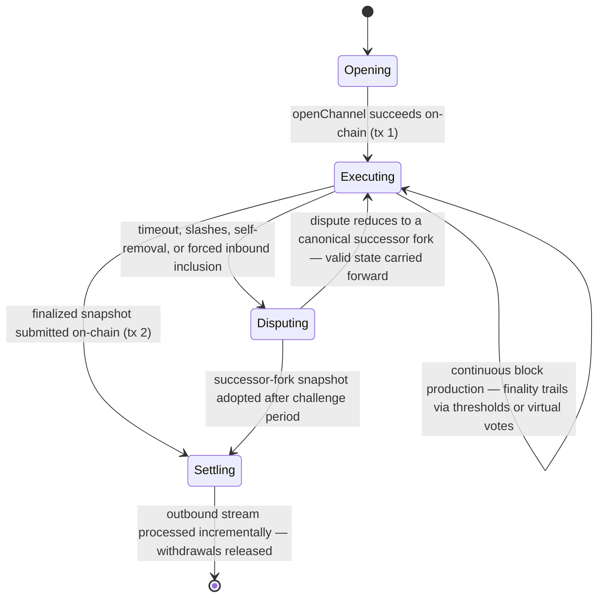

# State Channels Plus — System Specification

> **Status:** Draft, reverse-engineered baseline. Pending engineer review section by section.
> **Audience:** Engineers designing and evolving the system, integrators building state machines
> on the SDK, and implementation agents that need precise, cross-referenced guidance.
> **Authority:** Once a section is approved, this specification is the source of truth for design
> intent. Code implements it; tests provide evidence for it. See [governance.md](./governance.md).

This is the root of the specification tree. It gives the mental model, the lifecycle at a glance,
and navigation into the focused documents. Read this file top to bottom for onboarding; use the
document map to go deeper.

---

## 1. What the system is

**State Channels Plus** is an SDK for building scalable, resilient, client-side peer-to-peer
state channels for arbitrary state machines, with shared security inherited from a blockchain.

A fixed, small group of participants runs a shared program — an EVM **state machine** — directly
between themselves: off-chain, in real time, with no per-action fees. The blockchain is the
arbiter *and enforcer* of the state-machine agreement: participants prefer off-chain cooperation
because it is cheaper and faster, but when peers cannot cooperate, safety and correctness rest on
the chain's ability to objectively adjudicate disputes and enforce their outcomes.

The system has two cooperating layers:

1. **Smart contracts (Solidity, on-chain).** Base contracts an integrator extends. They define the
   state-machine interface and adjudicate everything that must be trustless: opening channels,
   verifying fraud proofs, running the dispute game, and processing exits.
   Code: [contracts/V1](../../../contracts/V1).
2. **TypeScript SDK (off-chain, client-side).** The engine that runs the channel p2p: proposes and
   validates blocks, collects signatures, exchanges messages over a transport, watches the chain,
   and escalates on-chain when needed. Code: [src/](../../../src).

The developer experience is deliberately close to writing an ordinary on-chain contract: you write
an EVM contract for your state machine, and the SDK **enshrines** an ethers contract instance so
that calling it executes p2p instead of on-chain, preserving the original TypeChain type
([EvmStateMachine.p2pSetup](../../../src/evm/EvmDiamondStateMachine.ts)).

## 2. Mental model in six statements

1. **The state machine's storage is the channel state; its functions are the allowed transitions.**
   Transitions are deterministic EVM execution, so any participant — or the chain — can re-execute
   one and prove a claimed result wrong. → [concepts/state-machines.md](./concepts/state-machines.md)
2. **Progress is a hash-linked chain of blocks with a deterministic author schedule.** Participants
   do not wait for explicit finality before building the next block; signatures accumulate across
   ancestry (**virtual voting**), and finality arrives by threshold, by virtual votes, or by dispute
   resolution. → [protocol/finality.md](./protocol/finality.md)
3. **Every state, economic, and on-chain-enforceable commitment is signed, and signing is a
   non-equivocating commitment.** Provable equivocation, invalid transitions, and other objective
   violations are punished by fraud proofs and slashing. Some operational RPC exchanges (for
   example dispute acknowledgments) are *unsigned local observations*: they may drive a local
   disconnect, never a slash or a portable proof. Subjective judgments (reputation, perceived
   cooperation) are never slashable.
   → [protocol/fraud-proofs.md](./protocol/fraud-proofs.md), [security/trust-model.md](./security/trust-model.md)
4. **Disputes are the on-chain fallback, and every dispute produces a canonical successor fork.**
   The dispute game consumes a fixed set of objective inputs, reduces them deterministically
   (order-independently), and execution resumes from the successor fork with valid transitions
   carried forward. → [protocol/disputes.md](./protocol/disputes.md)
5. **The channel and the chain talk through two mirror-image ordered message streams.** Inbound
   (chain → channel) carries joins and other instructions; outbound (channel → chain) carries exits,
   withdrawals, and other instructions. Snapshots commit to stream tips; the chain processes streams
   incrementally when snapshots advance. → [protocol/cross-layer-messages.md](./protocol/cross-layer-messages.md)
6. **A participant's full lifecycle needs at least two on-chain transactions**: one to open/deposit
   and one to settle via a snapshot update that processes the outbound stream. Everything between
   is free and off-chain in the happy path. → [protocol/lifecycle.md](./protocol/lifecycle.md)

## 3. Lifecycle at a glance



Fraud proofs run on a separate, immediate path beside this lifecycle: an objective violation
observed at any point can be proven on-chain at once, adding the offender to the on-chain slash
set that later disputes consume as input.

## 4. Document map

Read order for onboarding: concepts → protocol → security. Contracts, SDK, and reference documents
are consulted as needed.

| Area | Document | Covers |
| --- | --- | --- |
| Governance | [governance.md](./governance.md) | Spec-as-source-of-truth workflow, engineer authority, traceability, verification model, section template. |
| Concepts | [concepts/state-machines.md](./concepts/state-machines.md) | State-machine model, deterministic execution context, canonical serialization, participants vs. balances, membership hooks. |
| Concepts | [concepts/history-and-commitments.md](./concepts/history-and-commitments.md) | Transactions, blocks, forks, snapshots, and the exact commitment hierarchy. |
| Protocol | [protocol/lifecycle.md](./protocol/lifecycle.md) | End-to-end lifecycle, on-chain transaction count, per-phase responsibilities. |
| Protocol | [protocol/finality.md](./protocol/finality.md) | Continuous execution, leader election, virtual voting, the three finality routes. |
| Protocol | [protocol/state-proofs.md](./protocol/state-proofs.md) | Milestones as finality anchors, membership-threshold hops, non-final suffixes. |
| Protocol | [protocol/disputes.md](./protocol/disputes.md) | Dispute inputs, window lifecycle, order-independent reduction, timeout precedence, successor forks. |
| Protocol | [protocol/fraud-proofs.md](./protocol/fraud-proofs.md) | Block and dispute fraud proofs, the on-chain slash set, separation from dispute reduction. |
| Protocol | [protocol/cross-layer-messages.md](./protocol/cross-layer-messages.md) | Inbound/outbound streams, incremental processing, joins, spectating, exits, the channel-balance invariant. |
| Protocol | [protocol/time.md](./protocol/time.md) | Chain-time model, clock skew bounds, timestamp validation rules. |
| Security | [security/trust-model.md](./security/trust-model.md) | Trust boundaries, assumptions (chain, RPC, honest peer, watchtower), objective vs. subjective violations, topology limits, threat model. |
| Security | [security/data-availability.md](./security/data-availability.md) | Chain-backed data availability, calldata posting costs, griefing exposure. |
| Security | [security/open-security-review.md](./security/open-security-review.md) | The pending fraud-proof completeness review and known unanalyzed surfaces. |
| Contracts | [contracts/architecture.md](./contracts/architecture.md) | Diamond topology, storage model, deployment size budget, required refactor. |
| Contracts | [contracts/state-machine-base.md](./contracts/state-machine-base.md) | `AStateMachine` integration contract: hooks, invariants, allowed execution context. |
| Contracts | [contracts/manager-and-facets.md](./contracts/manager-and-facets.md) | `StateChannelManagerProxy`, facet reference, events, errors, on-chain storage. |
| SDK | [sdk/architecture.md](./sdk/architecture.md) | SDK layering, runtime host/client split, entry point, component map. |
| SDK | [sdk/block-confirmation-pipeline.md](./sdk/block-confirmation-pipeline.md) | The block intake → validation → signing → finality pipeline, end to end. |
| SDK | [sdk/dispute-pipeline.md](./sdk/dispute-pipeline.md) | The dispute construction/validation pipeline and its contract interactions. |
| SDK | [sdk/components.md](./sdk/components.md) | Managers, storage domains, transports, clock, events, RPC services. |
| SDK | [sdk/rpc/](./sdk/rpc/README.md) | RPC subtree: the protocol-boundary model plus one document per exported service (algorithms + Byzantine assessment). |
| SDK | [sdk/runtime-and-concurrency.md](./sdk/runtime-and-concurrency.md) | Transport-neutral worker/port architecture: inline-vs-worker equivalence, cross-boundary ownership/ordering/lifecycle/disposal/serialization rules. |
| Reference | [reference/data-types.md](./reference/data-types.md) | Field-level reference for shared structs. |
| Reference | [reference/configuration.md](./reference/configuration.md) | Configuration, precedence, operations, build/test workflow. |
| Generated | [generated/traceability-index.md](./generated/traceability-index.md) | Generated index of every `INV-*`/`REQ-*` ID: lifecycle state, defining document, and reverse references. |
| Generated | [generated/traceability-audit.md](./generated/traceability-audit.md) | Generated static audit of lifecycle, implementation, unit/e2e evidence, broken links, and repository source. |
| Generated | [generated/source-coverage.md](./generated/source-coverage.md) | Synchronized review queue for every source file not directly referenced by the specification. |
| Generated | [generated/test-coverage.md](./generated/test-coverage.md) | Generated accounting of every automated test declaration and the specification verification that owns it. |
| Examples | [examples.md](./examples.md) | Example integrations and their status (legacy vs. current-capability). |
| Register | [open-questions.md](./open-questions.md) | Consolidated register of unresolved design decisions awaiting engineer resolution. |

## 5. Conventions used throughout

- **Normative keywords.** **MUST**, **MUST NOT**, **SHOULD**, and **MAY** are used as commonly
  understood in technical specifications. Only normative sections bind the implementation.
- **Current vs. Intended.** Where the implemented behavior and the intended design differ, sections
  say so explicitly with `Current:` and `Intended:` labels. A discrepancy is a decision for an
  engineer, not an implicit license to change either side.
- **Open questions.** Unresolved decisions are marked `**Open question:**` in place and mirrored in
  [open-questions.md](./open-questions.md). Agents and engineers must not silently pick an
  interpretation.
- **Future Work.** Every technical document ends with a **Future Work** section. Its content is
  non-normative: ideas, extensions, and questions that are not approved requirements.
- **Section template.** Every subsystem section states its assumptions, constraints, limitations,
  dependencies, and in-depth verification specification. The template is defined in
  [governance.md](./governance.md#section-template).
- **Traceability.** Important invariants and requirements carry stable IDs (e.g. `INV-FIN-2`,
  `REQ-MSG-4`) that link specification → implementation → verification evidence. The scheme is
  defined in [governance.md](./governance.md#traceability); all IDs are collected with reverse
  references in the generated [traceability index](./generated/traceability-index.md).
- **Code links.** Links into the repository point at the areas that implement a concept. The tree
  mirrors stable architectural boundaries, not individual source files, so routine refactors do not
  churn the documentation.

## 6. Maintaining this specification

Agents editing this tree MUST follow [AGENTS.md](./AGENTS.md). The full governance model remains in
[governance.md](./governance.md); `AGENTS.md` turns it into an operational maintenance checklist.

All durable references must resolve inside the Git repository: this specification tree, source,
contracts, scripts, tests, and other tracked project files. Do not cite ignored/private generation
artifacts or unavailable external inputs. Preserve their useful conclusions directly in the owning
specification or open-question register so a fresh clone is self-contained.

### 6.1 Required traceability for every specification

Every normative requirement or invariant has one owning traceability row. That row must make five
things explicit:

1. **Lifecycle state.** Record the next unresolved gate: `Design pending`, `Specified`,
   `Implementation missing`, `Verification gap`, `Audit pending`, or `Audited`. The generated audit
   derives every structurally provable state from the remaining columns, owning-document approval,
   and verification matrices, then reports mismatches. Only substantive review can distinguish
   `Audit pending` from `Audited`.
2. **Specified behavior.** The stable `REQ-*` / `INV-*` ID and its normative statement.
3. **Implementation disposition.** Use `Current implementation:` with links to the implementing source,
   `Pending implementation:` when no conforming implementation exists, or `Not applicable:` for a
   process/design-only requirement with an explanation. When current and intended behavior differ,
   record both, link the owning open question, and state the future work needed to converge them.
4. **Unit verification.** Under `Unit:`, map every existing unit/component/contract test declaration
   needed as evidence using `[test](path/to/file#L<declaration-line>)`, or write
   `Pending implementation:`, `none — gap`, or `Not applicable:` with a reason.
5. **End-to-end verification.** Do the same under `E2E:`. A file or directory link does not map any
   individual test declaration.

Each technical document also contains a dedicated `## Verification specification` with two
machine-checked case matrices: `### Unit / component black-box cases` and
`### Integration and end-to-end scenarios`. These matrices define the theoretical tests independently
of current implementation: preconditions, public stimulus/trigger, exact observable oracle, required
normal/boundary/failure/recovery/race/adversarial variations, and evidence or an explicit gap. Every
owned ID appears in both matrices or has a reasoned `Not applicable:` row. See
[governance.md §3](./governance.md#3-verification-model) for the required tables and depth.

The links are claims to audit, not proof by themselves. An agent must inspect the linked code and
tests to determine whether they actually satisfy the normative statement. Additional implementation-
specific tests may be added without changing the specification, but the owning row must continue to
list the complete evidence set required by the specification.

The current lifecycle state is read from these records:

| Stage | Authoritative record |
| --- | --- |
| Design / review | The row's lifecycle `State`, the owning document's `Status:` (`Draft`, `In review`, or `Approved`), plus any linked open question or decision record. |
| Implementation | The owning traceability row's `Current implementation:`, `Intended implementation:`, or `Pending implementation:` disposition. |
| Verification | The same row's explicit `Unit:` and `E2E:` evidence or gap dispositions. |
| Audit | The owning row's current lifecycle state; Git and the PR retain historical review context. |

### 6.2 Change and review workflow

For every design, source-code, contract, or test change that affects specified behavior:

1. Identify the affected `REQ-*` / `INV-*` IDs before implementation. Add a requirement or open
   question when no existing ID owns the behavior.
2. Update and obtain approval for the specified/intended behavior. Resolve every affected open
   question with its decision, provenance, rejected alternative, consequences, and affected layers
   recorded in both owning locations. If it cannot be resolved, the implementation change remains
   blocked rather than selecting an interpretation.
3. Implement the approved behavior and update the implementation disposition and source links.
4. Add or update the necessary unit and e2e tests, update both evidence dispositions, and rerun all
   tests related to the affected IDs using the repository's canonical commands.
5. Audit the implementation and evidence against the specification and regenerate the artifacts
   below. PR descriptions and review findings cite the affected IDs. The review contains a dedicated
   verification assessment covering the black-box case matrix, implementation-specific
   integration/e2e levels, exact reruns, remaining gaps, and concrete rename suggestions for tests
   whose names do not state their behavior and oracle.

An implementation PR is accepted only as an atomic specification-to-code-to-test change. Its review
must establish that the documentation remains complete, no new traceability or source-coverage gaps
were introduced, the implementation conforms to every affected normative requirement and
theoretical case, and the documented unit/e2e evidence actually tests the current implementation.
All findings, open questions, links, lifecycle states, and generated artifacts are resolved in the
same PR. Git and the PR provide history; this tree stores only current specification truth, not a
duplicate review ledger.

### 6.3 Generated traceability artifacts

The [traceability index](./generated/traceability-index.md),
[traceability audit](./generated/traceability-audit.md), and synchronized
[source-coverage review](./generated/source-coverage.md), together with the generated
[test-coverage review](./generated/test-coverage.md), all live under `generated/`:

```bash
yarn spec:refresh
```

Refresh all generated review artifacts whenever a change:

- adds, removes, renames, moves, or changes a traceability-table definition for an `INV-*` or
  `REQ-*` ID;
- adds or removes an `INV-*` or `REQ-*` reference anywhere in this specification tree;
- moves or renames a document containing an ID definition or reference; or
- changes a traceability table, including its implementation or verification evidence;
- adds, removes, renames, or moves an automated test; or
- adds, removes, renames, or moves a file under `src/` or `contracts/`; or
- changes source or tests in a way that affects a specified requirement or its evidence.

The refresh command owns both reports and the source-coverage file list; commit all updated artifacts
with the documentation change. Do not edit or format the index or audit by hand because `--check`
compares deterministic output. In `source-coverage.md`, agents edit only the `Classification` and
`Rationale` cells; refresh preserves those decisions while synchronizing the file list.
Resolve every duplicate
definition and every ID reported as mentioned but not defined. The audit report lists incomplete
implementation dispositions, missing unit/e2e dispositions, absent or incomplete in-depth
verification matrices, broken/ignored/external documentation references, automated test declarations
that no traceability row or verification specification maps, and repository source files not directly referenced anywhere in
the maintained specification. Its lifecycle dashboard shows how many requirements remain at each
gate and validates every declared row state against the available structural evidence. It also flags
potentially vague linked-test names and
supplies a requirement-derived rename form for review; an engineer/agent replaces that heuristic
with a concrete name based on the real setup and oracle. Its generated matrix links every ID to its
claimed source and test evidence.
Existing debt remains visible in that generated report;
every change must fix the affected rows and must not introduce new gaps.
`yarn spec:refresh:strict` regenerates everything and fails while any reported issue remains; it is
the eventual clean-tree gate.

The command chains these tools; do not invoke them through another wrapper:

| Tool | Responsibility |
| --- | --- |
| `tools/gen-traceability-index.js` | Indexes every `REQ-*` / `INV-*` definition and reverse reference, and rejects duplicate definitions or undefined mentions. |
| `tools/audit-test-coverage.js` | Extracts individual automated test declarations, maps their exact source lines to specification verification evidence, and writes the unaccounted-test queue. |
| `tools/audit-traceability.js` | Validates lifecycle/evidence structure and links, audits source coverage, and writes the overall audit and source-review queue. |
| `tools/shared/traceability-utils.js` | Provides the shared Markdown, path, table, ID, and file-walking primitives used by the three tools; it is not run directly. |

For source coverage, a direct file link is required; a directory link does not silently cover every
descendant. An unreferenced `src/` TypeScript/JavaScript or `contracts/` Solidity file is a
specification gap until it is inspected. If it contains protocol behavior, add or update its owning
specification and link the file. If it is genuinely generated, non-protocol, or mechanically trivial
support code, classify it and explain the decision in
[source-coverage.md](./generated/source-coverage.md). Static analysis adds every new unreferenced file
as `Missing review`, which is an unresolved review finding, and removes entries only when the file is
referenced by the specification or no longer exists.

Every test declaration in a conventionally named test/spec file under `test/`, plus test entrypoints
invoked directly by a `test` package script, must map from an owning traceability row's verification
evidence or a dedicated `## Verification specification` section. Use an exact declaration anchor:
`[test](path/to/file#L<declaration-line>)`. Use `[test family](...#L...)` for dynamic/fuzz declarations
and enumerate the generated permutations and expected oracles in the verification plan. File-only
links map no tests. The generated [test-coverage.md](./generated/test-coverage.md) lists every mapping
and every unaccounted declaration. Only an entire file containing no specification verification may
opt out, using `// @spec-test-coverage-ignore: <reason>` within its first ten lines. The reason is
mandatory, and an ignore becomes stale once any case in the file is mapped.

A successful generation only proves structural consistency. It does not prove that linked code
implements a requirement or that linked tests provide sufficient evidence. Those checks remain part
of the human/agent audit described in [governance.md](./governance.md#traceability).

## 7. Scope and maturity

This specification describes the near-production version of State Channels Plus. The initial
content was reverse-engineered from the repository implementation; each
document distinguishes settled behavior from open questions. The system is not yet recommended for
production use: the [open security review](./security/open-security-review.md) and the
[open questions register](./open-questions.md) list the work that gates that recommendation.

### Production gates

The design cannot be called production-ready until at least the following are closed (each links
to where it is tracked):

1. State proofs accept the intended mixed shape — milestones plus a non-final suffix — in both
   the contracts and the SDK ([OQ-13](./open-questions.md)).
2. Every opened dispute window reaches a deterministic successor, including when all commitments
   are killed ([OQ-1](./open-questions.md)).
3. Kill-period economics and invalid-proof penalties are engineer-approved
   ([OQ-1](./open-questions.md), [OQ-2](./open-questions.md)).
4. The channel-balance invariant is enforced at its decided check sites
   ([OQ-19](./open-questions.md), [OQ-11](./open-questions.md)).
5. Wrong-turn behavior is enforceable on-chain, or proven unnecessary
   ([OQ-26](./open-questions.md)).
6. Clock skew, bias, and window values are decided and empirically validated
   ([OQ-8](./open-questions.md)).
7. SDK storage and restart/recovery are durable and reorg-aware — the current stores are
   in-memory and the event cursor cannot detect reorgs ([OQ-23](./open-questions.md),
   [OQ-30](./open-questions.md)).
8. Gossip/RPC resource limits and proof-size bounds exist ([OQ-6](./open-questions.md),
   [OQ-32](./open-questions.md)).
9. Every deployable contract fits the mainnet code-size limit, with a build gate — three
   currently exceed it ([contracts/architecture.md](./contracts/architecture.md)).
10. The fraud-proof completeness review has run and its findings are dispositioned
    ([security/open-security-review.md](./security/open-security-review.md)).
11. Protocol signatures carry a domain (protocol version, chain, deployment, object type), or
    cross-deployment replay is explicitly accepted ([OQ-29](./open-questions.md)).
12. The handshake binds session and both peer identities, removing trust assumption A9's
    no-on-path-adversary caveat ([OQ-35](./open-questions.md),
    [security/trust-model.md](./security/trust-model.md)).
13. Peer-failure classification separates unavailability and local faults from Byzantine behavior,
    so honest peers are not blacklisted for either ([OQ-34](./open-questions.md); DEF-5, DEF-9,
    DEF-10 in [open-questions.md](./open-questions.md)).
14. Runtime budgets are derived from the decided mid-range-phone envelope, and worker placement is
    measurement-justified — targets and budgets are currently absent
    ([OQ-38](./open-questions.md), [sdk/runtime-and-concurrency.md](./sdk/runtime-and-concurrency.md)).
15. The harness-control RPC root is unreachable by network peers and excluded from the published
    package ([OQ-37](./open-questions.md)).
