# State Channels Plus — System Specification

> **Status:** Draft, reverse-engineered baseline. Pending engineer review section by section.
> **Audience:** Engineers designing and evolving the system, integrators building state machines
> on the SDK, and implementation agents that need precise, cross-referenced guidance.
> **Authority:** Once a section is approved, this specification is the source of truth for design
> intent. Code implements it; tests provide evidence for it. See [governance.md](./governance.md).

This is the root of the specification tree. It gives the mental model, the lifecycle at a glance,
and navigation into the focused documents. Read this file top to bottom for onboarding; use the
document map to go deeper.

---

## 1. What the system is

**State Channels Plus** is an SDK for building scalable, resilient, client-side peer-to-peer
state channels for arbitrary state machines, with shared security inherited from a blockchain.

A fixed, small group of participants runs a shared program — an EVM **state machine** — directly
between themselves: off-chain, in real time, with no per-action fees. The blockchain is the
arbiter *and enforcer* of the state-machine agreement: participants prefer off-chain cooperation
because it is cheaper and faster, but when peers cannot cooperate, safety and correctness rest on
the chain's ability to objectively adjudicate disputes and enforce their outcomes.

The system has two cooperating layers:

1. **Smart contracts (Solidity, on-chain).** Base contracts an integrator extends. They define the
   state-machine interface and adjudicate everything that must be trustless: opening channels,
   verifying fraud proofs, running the dispute game, and processing exits.
   Code: [contracts/V1](../../../contracts/V1).
2. **TypeScript SDK (off-chain, client-side).** The engine that runs the channel p2p: proposes and
   validates blocks, collects signatures, exchanges messages over a transport, watches the chain,
   and escalates on-chain when needed. Code: [src/](../../../src).

The developer experience is deliberately close to writing an ordinary on-chain contract: you write
an EVM contract for your state machine, and the SDK **enshrines** an ethers contract instance so
that calling it executes p2p instead of on-chain, preserving the original TypeChain type
([EvmStateMachine.p2pSetup](../../../src/evm/EvmDiamondStateMachine.ts)).

## 2. Mental model in six statements

1. **The state machine's storage is the channel state; its functions are the allowed transitions.**
   Transitions are deterministic EVM execution, so any participant — or the chain — can re-execute
   one and prove a claimed result wrong. → [concepts/state-machines.md](./concepts/state-machines.md)
2. **Progress is a hash-linked chain of blocks with a deterministic author schedule.** Participants
   do not wait for explicit finality before building the next block; signatures accumulate across
   ancestry (**virtual voting**), and finality arrives by threshold, by virtual votes, or by dispute
   resolution. → [protocol/finality.md](./protocol/finality.md)
3. **Every state, economic, and on-chain-enforceable commitment is signed, and signing is a
   non-equivocating commitment.** Provable equivocation, invalid transitions, and other objective
   violations are punished by fraud proofs and slashing. Some operational RPC exchanges (for
   example dispute acknowledgments) are *unsigned local observations*: they may drive a local
   disconnect, never a slash or a portable proof. Subjective judgments (reputation, perceived
   cooperation) are never slashable.
   → [protocol/fraud-proofs.md](./protocol/fraud-proofs.md), [security/trust-model.md](./security/trust-model.md)
4. **Disputes are the on-chain fallback, and every dispute produces a canonical successor fork.**
   The dispute game consumes a fixed set of objective inputs, reduces them deterministically
   (order-independently), and execution resumes from the successor fork with valid transitions
   carried forward. → [protocol/disputes.md](./protocol/disputes.md)
5. **The channel and the chain talk through two mirror-image ordered message streams.** Inbound
   (chain → channel) carries joins and other instructions; outbound (channel → chain) carries exits,
   withdrawals, and other instructions. Snapshots commit to stream tips; the chain processes streams
   incrementally when snapshots advance. → [protocol/cross-layer-messages.md](./protocol/cross-layer-messages.md)
6. **A participant's full lifecycle needs at least two on-chain transactions**: one to open/deposit
   and one to settle via a snapshot update that processes the outbound stream. Everything between
   is free and off-chain in the happy path. → [protocol/lifecycle.md](./protocol/lifecycle.md)

## 3. Lifecycle at a glance

```mermaid
stateDiagram-v2
    [*] --> Opening
    Opening --> Executing: openChannel succeeds on-chain (tx 1)
    Executing --> Executing: continuous block production; finality trails via thresholds / virtual votes
    Executing --> Disputing: timeout, slashes, self-removal, or forced inbound inclusion
    Disputing --> Executing: dispute reduces to a canonical successor fork; valid state carried forward
    Executing --> Settling: finalized snapshot submitted on-chain (tx 2)
    Disputing --> Settling: successor-fork snapshot adopted after challenge period
    Settling --> [*]: outbound stream processed incrementally; withdrawals released
```

Fraud proofs run on a separate, immediate path beside this lifecycle: an objective violation
observed at any point can be proven on-chain at once, adding the offender to the on-chain slash
set that later disputes consume as input.

## 4. Document map

Read order for onboarding: concepts → protocol → security. Contracts, SDK, and reference documents
are consulted as needed.

| Area | Document | Covers |
| --- | --- | --- |
| Governance | [governance.md](./governance.md) | Spec-as-source-of-truth workflow, engineer authority, traceability, verification model, section template. |
| Concepts | [concepts/state-machines.md](./concepts/state-machines.md) | State-machine model, deterministic execution context, canonical serialization, participants vs. balances, membership hooks. |
| Concepts | [concepts/history-and-commitments.md](./concepts/history-and-commitments.md) | Transactions, blocks, forks, snapshots, and the exact commitment hierarchy. |
| Protocol | [protocol/lifecycle.md](./protocol/lifecycle.md) | End-to-end lifecycle, on-chain transaction count, per-phase responsibilities. |
| Protocol | [protocol/finality.md](./protocol/finality.md) | Continuous execution, leader election, virtual voting, the three finality routes. |
| Protocol | [protocol/state-proofs.md](./protocol/state-proofs.md) | Milestones as finality anchors, membership-threshold hops, non-final suffixes. |
| Protocol | [protocol/disputes.md](./protocol/disputes.md) | Dispute inputs, window lifecycle, order-independent reduction, timeout precedence, successor forks. |
| Protocol | [protocol/fraud-proofs.md](./protocol/fraud-proofs.md) | Block and dispute fraud proofs, the on-chain slash set, separation from dispute reduction. |
| Protocol | [protocol/cross-layer-messages.md](./protocol/cross-layer-messages.md) | Inbound/outbound streams, incremental processing, joins, spectating, exits, the channel-balance invariant. |
| Protocol | [protocol/time.md](./protocol/time.md) | Chain-time model, clock skew bounds, timestamp validation rules. |
| Security | [security/trust-model.md](./security/trust-model.md) | Trust boundaries, assumptions (chain, RPC, honest peer, watchtower), objective vs. subjective violations, topology limits, threat model. |
| Security | [security/data-availability.md](./security/data-availability.md) | Chain-backed data availability, calldata posting costs, griefing exposure. |
| Security | [security/open-security-review.md](./security/open-security-review.md) | The pending fraud-proof completeness review and known unanalyzed surfaces. |
| Contracts | [contracts/architecture.md](./contracts/architecture.md) | Diamond topology, storage model, deployment size budget, required refactor. |
| Contracts | [contracts/state-machine-base.md](./contracts/state-machine-base.md) | `AStateMachine` integration contract: hooks, invariants, allowed execution context. |
| Contracts | [contracts/manager-and-facets.md](./contracts/manager-and-facets.md) | `StateChannelManagerProxy`, facet reference, events, errors, on-chain storage. |
| SDK | [sdk/architecture.md](./sdk/architecture.md) | SDK layering, runtime host/client split, entry point, component map. |
| SDK | [sdk/block-confirmation-pipeline.md](./sdk/block-confirmation-pipeline.md) | The block intake → validation → signing → finality pipeline, end to end. |
| SDK | [sdk/dispute-pipeline.md](./sdk/dispute-pipeline.md) | The dispute construction/validation pipeline and its contract interactions. |
| SDK | [sdk/components.md](./sdk/components.md) | Managers, storage domains, transports, clock, events, RPC services. |
| SDK | [sdk/rpc/](./sdk/rpc/README.md) | RPC subtree: the protocol-boundary model plus one document per exported service (algorithms + Byzantine assessment). |
| SDK | [sdk/runtime-and-concurrency.md](./sdk/runtime-and-concurrency.md) | Transport-neutral worker/port architecture: inline-vs-worker equivalence, cross-boundary ownership/ordering/lifecycle/disposal/serialization rules. |
| Reference | [reference/data-types.md](./reference/data-types.md) | Field-level reference for shared structs. |
| Reference | [reference/configuration.md](./reference/configuration.md) | Configuration, precedence, operations, build/test workflow. |
| Reference | [reference/traceability-index.md](./reference/traceability-index.md) | Generated index of every `INV-*`/`REQ-*` ID: defining document and reverse references. |
| Examples | [examples.md](./examples.md) | Example integrations and their status (legacy vs. current-capability). |
| Register | [open-questions.md](./open-questions.md) | Consolidated register of unresolved design decisions awaiting engineer resolution. |
| Register | [traceability/review-coverage.md](./traceability/review-coverage.md) | Per-note map of every review section to its owning documents and dispositions. |

## 5. Conventions used throughout

- **Normative keywords.** **MUST**, **MUST NOT**, **SHOULD**, and **MAY** are used as commonly
  understood in technical specifications. Only normative sections bind the implementation.
- **Current vs. Intended.** Where the implemented behavior and the intended design differ, sections
  say so explicitly with `Current:` and `Intended:` labels. A discrepancy is a decision for an
  engineer, not an implicit license to change either side.
- **Open questions.** Unresolved decisions are marked `**Open question:**` in place and mirrored in
  [open-questions.md](./open-questions.md). Agents and engineers must not silently pick an
  interpretation.
- **Future Work.** Every technical document ends with a **Future Work** section. Its content is
  non-normative: ideas, extensions, and questions that are not approved requirements.
- **Section template.** Every subsystem section states its assumptions, constraints, limitations,
  dependencies, and verification strategy. The template is defined in
  [governance.md](./governance.md#section-template).
- **Traceability.** Important invariants and requirements carry stable IDs (e.g. `INV-FIN-2`,
  `REQ-MSG-4`) that link specification → implementation → verification evidence. The scheme is
  defined in [governance.md](./governance.md#traceability); all IDs are collected with reverse
  references in the generated [traceability index](./reference/traceability-index.md).
- **Code links.** Links into the repository point at the areas that implement a concept. The tree
  mirrors stable architectural boundaries, not individual source files, so routine refactors do not
  churn the documentation.

## 6. Scope and maturity

This specification describes the near-production version of State Channels Plus. The initial
content was reverse-engineered from the implementation and from engineering review notes; each
document distinguishes settled behavior from open questions. The system is not yet recommended for
production use: the [open security review](./security/open-security-review.md) and the
[open questions register](./open-questions.md) list the work that gates that recommendation.

### Production gates

The design cannot be called production-ready until at least the following are closed (each links
to where it is tracked):

1. State proofs accept the intended mixed shape — milestones plus a non-final suffix — in both
   the contracts and the SDK ([OQ-13](./open-questions.md)).
2. Every opened dispute window reaches a deterministic successor, including when all commitments
   are killed ([OQ-1](./open-questions.md)).
3. Kill-period economics and invalid-proof penalties are engineer-approved
   ([OQ-1](./open-questions.md), [OQ-2](./open-questions.md)).
4. The channel-balance invariant is enforced at its decided check sites
   ([OQ-19](./open-questions.md), [OQ-11](./open-questions.md)).
5. Wrong-turn behavior is enforceable on-chain, or proven unnecessary
   ([OQ-26](./open-questions.md)).
6. Clock skew, bias, and window values are decided and empirically validated
   ([OQ-8](./open-questions.md)).
7. SDK storage and restart/recovery are durable and reorg-aware — the current stores are
   in-memory and the event cursor cannot detect reorgs ([OQ-23](./open-questions.md),
   [OQ-30](./open-questions.md)).
8. Gossip/RPC resource limits and proof-size bounds exist ([OQ-6](./open-questions.md),
   [OQ-32](./open-questions.md)).
9. Every deployable contract fits the mainnet code-size limit, with a build gate — three
   currently exceed it ([contracts/architecture.md](./contracts/architecture.md)).
10. The fraud-proof completeness review has run and its findings are dispositioned
    ([security/open-security-review.md](./security/open-security-review.md)).
11. Protocol signatures carry a domain (protocol version, chain, deployment, object type), or
    cross-deployment replay is explicitly accepted ([OQ-29](./open-questions.md)).
12. The handshake binds session and both peer identities, removing trust assumption A9's
    no-on-path-adversary caveat ([OQ-35](./open-questions.md),
    [security/trust-model.md](./security/trust-model.md)).
13. Peer-failure classification separates unavailability and local faults from Byzantine behavior,
    so honest peers are not blacklisted for either ([OQ-34](./open-questions.md); DEF-5, DEF-9,
    DEF-10 in [open-questions.md](./open-questions.md)).
14. Runtime budgets are derived from the decided mid-range-phone envelope, and worker placement is
    measurement-justified — targets and budgets are currently absent
    ([OQ-38](./open-questions.md), [sdk/runtime-and-concurrency.md](./sdk/runtime-and-concurrency.md)).
15. The harness-control RPC root is unreachable by network peers and excluded from the published
    package ([OQ-37](./open-questions.md)).
