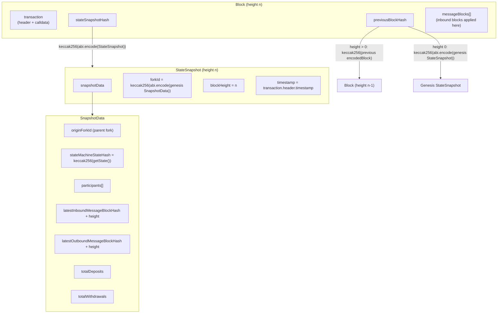

# History and Commitments

> **Status:** Draft, reverse-engineered baseline. Pending engineer review.
> **Scope:** The off-chain history data model — transactions, blocks, forks, snapshots — and the
> exact commitment fields and hashing hierarchy that agreement, state proofs, and dispute
> verification operate on. Struct definitions:
> [contracts/V1/types/DataTypes.sol](../../../../contracts/V1/types/DataTypes.sol); SDK wrappers:
> [src/models](../../../../src/models); block/snapshot construction:
> [src/stateManager/StateManager.ts](../../../../src/stateManager/StateManager.ts).
> **Related:** [state-machines.md](./state-machines.md) (what `stateMachineStateHash` covers),
> [../protocol/finality.md](../protocol/finality.md) (how signatures over this history finalize),
> [../protocol/state-proofs.md](../protocol/state-proofs.md) (how the history is proven),
> [../protocol/cross-layer-messages.md](../protocol/cross-layer-messages.md) (the message streams
> the snapshot commits to), [../protocol/time.md](../protocol/time.md) (timestamp rules).

## 1. Purpose & observable contract

Off-chain progress is a hash-linked chain of **blocks**, each committing to the complete channel
state after its transition through a **state snapshot**. The design goal is that any point in
history can be (a) referenced by a single 32-byte hash, (b) reconstructed from the data behind
that hash, and (c) adjudicated on-chain without the chain storing the history itself — the chain
stores only the current canonical snapshot and compact commitments.

What this model guarantees: given a valid hash-linked path from a trusted anchor (fork genesis or
a proven milestone), every field of every committed state along that path is bound by collision
resistance of keccak256. What it does not guarantee: availability of the pre-image data — that is
a separate concern (see [../security/data-availability.md](../security/data-availability.md)).

## 2. Transactions

A **transaction** is a single proposed state transition
([DataTypes.sol](../../../../contracts/V1/types/DataTypes.sol)):

| Struct              | Field                 | Meaning                                                                                                                             |
| ------------------- | --------------------- | ----------------------------------------------------------------------------------------------------------------------------------- |
| `TransactionHeader` | `channelId`           | The channel this transition belongs to.                                                                                             |
|                     | `participant`         | The logical author (see [state-machines.md](./state-machines.md) §2).                                                               |
|                     | `forkId`              | The fork this transition extends (§4).                                                                                              |
|                     | `transactionCnt`      | The height on that fork. Current: one transaction per block, so this is also the block height (the SDK reads it as `Block.height`). |
|                     | `timestamp`           | Protocol time of authorship; validated per [../protocol/time.md](../protocol/time.md).                                              |
| `TransactionBody`   | `encodedData`, `data` | The EVM calldata to execute. Current: both fields carry the same calldata; the split is a placeholder for a polymorphic encoding.   |
| `Transaction`       | `header`, `body`      | The proposed transition.                                                                                                            |

## 3. Blocks and the commitment hierarchy

A **block** is a committed transition:

```solidity
struct Block {
    Transaction transaction;
    bytes32 stateSnapshotHash;   // commitment to the post-state SNAPSHOT (not the raw state)
    bytes32 previousBlockHash;   // hash link to the predecessor
    MessageBlock[] messageBlocks; // inbound (chain -> channel) message blocks applied by this block
}
```

### 3.1 What a block commits to

A block does **not** commit directly to the serialized state-machine state. It commits to a
**state snapshot hash**, and the snapshot contains the state-machine state hash among other
required fields. The full hierarchy, as implemented:



- **INV-HIST-1** — A block's `stateSnapshotHash` MUST equal
  `keccak256(abi.encode(StateSnapshot))` of the snapshot describing the channel immediately after
  this block's transition and inbound messages are applied. The serialized state-machine state is
  committed indirectly: `SnapshotData.stateMachineStateHash = keccak256(getState())`. Agreement
  and dispute verification MUST compare states at the snapshot level, never by re-hashing raw
  state alone, because participants, stream tips, and deposit/withdrawal totals are part of what
  is agreed.

The snapshot's non-state fields exist because state bytes alone are not enough to adjudicate:
`participants` fixes the signer set the next block needs, the inbound/outbound tips fix which
cross-layer messages are already accounted for, and `totalDeposits`/`totalWithdrawals` carry the
aggregate accounting the channel-balance invariant checks
([../protocol/cross-layer-messages.md](../protocol/cross-layer-messages.md)).

Construction lives in
[StateManager.createStateSnapshot](../../../../src/stateManager/StateManager.ts) (builds
`SnapshotData` from the previous snapshot plus this block's effects) and
[StateManager.createBlock](../../../../src/stateManager/StateManager.ts) (assembles the block).
The hash implementations are
[StateSnapshot.hash](../../../../src/models/StateSnapshot.ts) (`keccak256` of the ABI-encoded
struct) and, on-chain, `keccak256(abi.encode(...))` of the same struct
(e.g. [FraudProofFacet](../../../../contracts/V1/StateChannelDiamondProxy/FraudProofFacet.sol)).

### 3.2 Hash-linking

- **INV-HIST-2** — Blocks MUST be hash-linked: for height > 0, `previousBlockHash` is
  `keccak256(encodedBlock)` of the predecessor block; for height 0 (the first block of a fork),
  `previousBlockHash` is `keccak256(abi.encode(StateSnapshot))` of the fork's genesis snapshot.
  A block whose link does not verify is not part of the history.

Verified in code: [StateManager.createBlock](../../../../src/stateManager/StateManager.ts) uses
the previous block's hash or, when none exists on the fork, the previous snapshot's hash; the
on-chain check for height 0 compares against `keccak256(abi.encode(proof.previousStateSnapshot))`
([FraudProofFacet.\_hasInvalidTimestamp](../../../../contracts/V1/StateChannelDiamondProxy/FraudProofFacet.sol)).

### 3.3 Signatures over blocks

The block identity is `blockHash = keccak256(encodedBlock)` (ABI encoding of the `Block` struct).
Signing is an EIP-191 personal-message signature over the 32 raw bytes of `blockHash`
([Block.sign](../../../../src/models/Block.ts)).

| Struct              | Meaning                                                                      |
| ------------------- | ---------------------------------------------------------------------------- |
| `SignedBlock`       | `encodedBlock` + the author's signature.                                     |
| `BlockConfirmation` | A `SignedBlock` plus additional participants' signatures over the same hash. |

Signing a block is a non-equivocating commitment to the block **and its entire ancestry** (the
hash links make the ancestry part of what is signed). How signatures accumulate into finality —
thresholds and virtual voting — is specified in
[../protocol/finality.md](../protocol/finality.md); provable double-signing is handled in
[../protocol/fraud-proofs.md](../protocol/fraud-proofs.md).

### 3.4 Message blocks inside blocks

`Block.messageBlocks` carries the **inbound** message blocks (chain → channel batches, e.g.
joins) that this block's author packaged and applied. Applying them advances
`SnapshotData.latestInboundMessageBlockHash/Height` and `totalDeposits` in the committed
snapshot. Referencing an inbound message block that was never persisted on-chain is fraud
(`ForgedInboundMessageBlock`; detection in
[StateManager.detectForgedInboundMessageBlock](../../../../src/stateManager/StateManager.ts)).

**Outbound** message blocks are not embedded in the block struct. When a transition produces
outbound messages (exits, withdrawals), the SDK builds the next block of the hash-linked outbound
stream (`MessageBlock { previousBlockHash, blockHeight, messages, totalBalance, timestamp }`) and
commits to its tip in the snapshot
([StateManager.createStateSnapshot](../../../../src/stateManager/StateManager.ts)). Both streams
and their incremental on-chain processing are specified in
[../protocol/cross-layer-messages.md](../protocol/cross-layer-messages.md).

- **INV-HIST-3** — Each snapshot MUST commit to the tips (hash and height) of both message streams as
  they stand after the block's effects; stream contents are bound through the streams' own
  hash-linking, mirroring HIST-2.

## 4. Forks

A **fork** is one branch of channel history.

- **INV-HIST-4** — `forkId = keccak256(abi.encode(genesisSnapshotData))`: the fork identifier is the
  hash of the fork's genesis `SnapshotData`. Verified:
  [StateChannelManagerProxy](../../../../contracts/V1/StateChannelDiamondProxy/StateChannelManagerProxy.sol)
  computes it exactly this way when building a genesis, and the SDK's genesis test is
  `forkId == keccak256(abi.encode(snapshotData))`
  ([StateSnapshot.isGenesis](../../../../src/models/StateSnapshot.ts)).

Note the level: the hash is over the genesis `SnapshotData` (the inner struct), not the full
`StateSnapshot`. Since `SnapshotData.originForkId` names the parent fork, a fork's identity
transitively commits to its entire fork ancestry back to the channel-opening genesis.

Forks arise at channel opening (the first fork's genesis is produced by `openChannelGenesis`) and
at dispute resolution: every completed dispute produces a canonical successor fork whose genesis
snapshot is derived from the dispute's reduced result, with `originForkId` pointing at the
disputed fork ([../protocol/disputes.md](../protocol/disputes.md)). Execution resumes from the
successor fork at height 0. Within one fork, height and hash-linking make history linear;
conflicting blocks at the same `(forkId, height)` are equivocation or invalid-transition
evidence, not a fork.

## 5. Snapshots as the on-chain interface

The chain stores one canonical `StateSnapshot` per channel and advances it when shown either
finality on the same fork or a finished dispute's successor fork
([../protocol/lifecycle.md](../protocol/lifecycle.md),
[../protocol/disputes.md](../protocol/disputes.md)). On every advance, the chain compares its
processed outbound-stream tip with the new snapshot's committed tip and processes the proven
difference incrementally — this is how ordinary withdrawals and exits happen
([../protocol/cross-layer-messages.md](../protocol/cross-layer-messages.md)).

Related chain-side commitment: `postBlockCalldata` persists
`keccak256(abi.encode(signedBlock, block.timestamp))` keyed by channel, signer, fork, and height
([StateChannelManagerProxy](../../../../contracts/V1/StateChannelDiamondProxy/StateChannelManagerProxy.sol)).
It binds a block's author to the block data and to an on-chain observation time without storing
the block; the timestamp half of that commitment feeds the time rules in
[../protocol/time.md](../protocol/time.md), and the data-availability role is covered in
[../security/data-availability.md](../security/data-availability.md).

## 6. Assumptions, constraints & failure behavior

- **Hash function.** All commitments assume collision-resistant keccak256 over canonical ABI
  encodings. Any non-canonical encoding at any level (see
  [state-machines.md](./state-machines.md) REQ-SM-2) breaks hash equality between honest peers.
- **Availability.** A hash commitment proves integrity, not availability. Whoever must verify a
  path needs the pre-images; the current design makes the chain the fallback availability layer
  via posted calldata, at real cost
  ([../security/data-availability.md](../security/data-availability.md)).
- **Failure behavior.** A block that fails any commitment check (bad link, wrong snapshot hash,
  forged inbound reference) is rejected by validation and, where the failure is objectively
  provable, becomes fraud-proof material rather than merely being dropped
  ([../protocol/fraud-proofs.md](../protocol/fraud-proofs.md)).

## 7. Verification

- **Model round-trips and hashing.** Encode/decode round-trips and hash consistency for blocks
  and snapshots: [test/models/Block.test.ts](../../../../test/models/Block.test.ts),
  [test/models/StateSnapshot.test.ts](../../../../test/models/StateSnapshot.test.ts).
- **Linkage and conflict handling.** Wrong `previousBlockHash`, non-linked conflicts, wrong
  genesis, double-signs at a taken height:
  [test/unit/ValidationService.test.ts](../../../../test/unit/ValidationService.test.ts).
- **On-chain commitment checks.** Fraud-proof facet tests exercising block authenticity, genesis
  linkage, and forged-inbound detection:
  [test/V1/StateChannelDiamondProxy/FraudProofFacet.t.sol](../../../../test/V1/StateChannelDiamondProxy/FraudProofFacet.t.sol).
- **Snapshot advancement end to end.**
  [test/e2e/E2E-StateSnapshots.test.ts](../../../../test/e2e/E2E-StateSnapshots.test.ts),
  [test/e2e/E2E-MaliciousUpdateSnapshot.test.ts](../../../../test/e2e/E2E-MaliciousUpdateSnapshot.test.ts).
- Gap: no test asserts cross-implementation hash equality (SDK `StateSnapshot.hash` vs. on-chain
  `keccak256(abi.encode(...))`) over a corpus of randomized snapshots; equality is currently
  demonstrated only implicitly by e2e flows succeeding.

## Future Work

_Non-normative._

- A property test that fuzzes `StateSnapshot`/`Block` structs and asserts SDK and Solidity
  hashing agree byte for byte.
- Multi-transaction blocks: `transactionCnt` doubling as block height and the one-transaction
  invariant are load-bearing in several places (leader checks, timestamp rules); if block
  contents evolve, this document and [state-machines.md](./state-machines.md) REQ-SM-5 define the
  block-level rules that must survive.
- Consider committing an explicit encoding-version marker inside `SnapshotData` so future struct
  evolution can coexist with old snapshots.

## Traceability

| ID         | State          | Statement                                                                                                                | Implementation                                                                                                                                                                                           | Verification evidence                                                                                                                                                                                                                        |
| ---------- | -------------- | ------------------------------------------------------------------------------------------------------------------------ | -------------------------------------------------------------------------------------------------------------------------------------------------------------------------------------------------------- | -------------------------------------------------------------------------------------------------------------------------------------------------------------------------------------------------------------------------------------------- |
| INV-HIST-1 | Design pending | Block commits to the state snapshot hash; serialized state committed indirectly via `SnapshotData.stateMachineStateHash` | [DataTypes.sol](../../../../contracts/V1/types/DataTypes.sol) (`Block`, `StateSnapshot`, `SnapshotData`); [StateManager.createStateSnapshot / createBlock](../../../../src/stateManager/StateManager.ts) | [test/models/StateSnapshot.test.ts](../../../../test/models/StateSnapshot.test.ts) (hash/round-trip); e2e snapshot flows: [test/e2e/E2E-StateSnapshots.test.ts](../../../../test/e2e/E2E-StateSnapshots.test.ts)                             |
| INV-HIST-2 | Design pending | Hash-linking: height>0 links to previous block hash; height 0 links to genesis snapshot hash                             | [StateManager.createBlock](../../../../src/stateManager/StateManager.ts); [FraudProofFacet](../../../../contracts/V1/StateChannelDiamondProxy/FraudProofFacet.sol) (height-0 check)                      | [test/unit/ValidationService.test.ts](../../../../test/unit/ValidationService.test.ts) (linkage/genesis cases); [test/V1/StateChannelDiamondProxy/FraudProofFacet.t.sol](../../../../test/V1/StateChannelDiamondProxy/FraudProofFacet.t.sol) |
| INV-HIST-3 | Design pending | Snapshots commit to inbound and outbound message-stream tips (hash + height)                                             | [StateManager.createStateSnapshot](../../../../src/stateManager/StateManager.ts); [DataTypes.sol](../../../../contracts/V1/types/DataTypes.sol) (`SnapshotData`, `MessageBlock`)                         | [test/e2e/E2E-StateSnapshots.test.ts](../../../../test/e2e/E2E-StateSnapshots.test.ts); stream-processing detail: see [../protocol/cross-layer-messages.md](../protocol/cross-layer-messages.md)                                             |
| INV-HIST-4 | Design pending | `forkId = keccak256(abi.encode(genesis SnapshotData))`; `originForkId` chains fork ancestry                              | [StateChannelManagerProxy](../../../../contracts/V1/StateChannelDiamondProxy/StateChannelManagerProxy.sol); [StateSnapshot.isGenesis](../../../../src/models/StateSnapshot.ts)                           | [test/models/StateSnapshot.test.ts](../../../../test/models/StateSnapshot.test.ts); dispute successor-fork e2e: [test/e2e/E2E-FinalDispute.test.ts](../../../../test/e2e/E2E-FinalDispute.test.ts)                                           |
