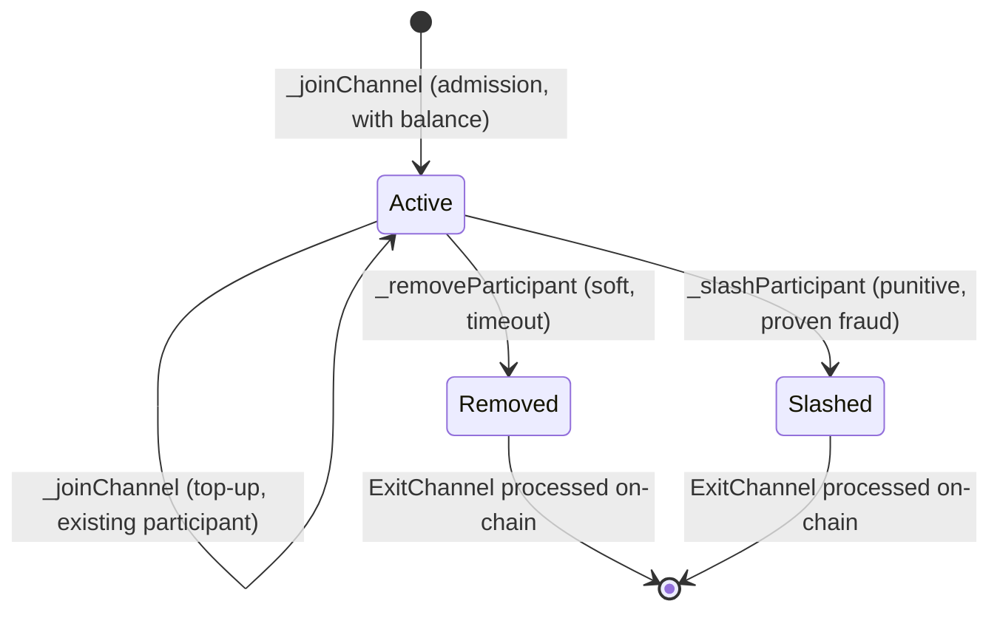

# State Machines

> **Status:** Draft, reverse-engineered baseline. Pending engineer review.
> **Scope:** The state-machine model integrators build on: deterministic execution, the allowed
> execution context, canonical serialization, participants and balances, turn-taking, and the
> membership lifecycle hooks. The on-chain base contract is
> [contracts/V1/AStateMachine.sol](../../../../contracts/V1/AStateMachine.sol); the SDK-side
> execution boundary is
> [src/ADiamondStateMachine.ts](../../../../src/ADiamondStateMachine.ts).
> **Related:** [history-and-commitments.md](./history-and-commitments.md) (what a block commits
> to), [../protocol/time.md](../protocol/time.md) (where `_tx.header.timestamp` comes from),
> [../contracts/state-machine-base.md](../contracts/state-machine-base.md) (full hook reference),
> [../protocol/fraud-proofs.md](../protocol/fraud-proofs.md) (why determinism is load-bearing).

## 1. The model

**Purpose & observable contract.** A state machine is an EVM contract that extends
[`AStateMachine`](../../../../contracts/V1/AStateMachine.sol). Two ideas define it:

- **Its storage variables are the channel state.**
- **Its functions are the allowed transitions.**

A transition is applied through the base contract's `stateTransition(Transaction)`, which injects
the transaction header into the `_tx` storage variable and executes the transaction's calldata
against the contract itself under a fixed `gasLimit`:

```solidity
_clearOutboundMessages();
_tx.header = transaction.header;
(bool success, bytes memory result) = address(this).call{gas: gasLimit}(transaction.body.data);
```

The same contract runs in two places:

1. **Off-chain**, inside each participant's SDK instance, behind the
   [`ADiamondStateMachine`](../../../../src/ADiamondStateMachine.ts) boundary
   (`stateTransition`, `runView`, `getParticipants`, `getNextToWrite`, `peekNextToWrite`,
   `getState`/`setState`, the balance operations, `processInboundMessage`).
2. **On-chain**, when a dispute or fraud proof re-executes a transition
   (`executeStateTransition` on the manager).

- **INV-SM-1** — Transitions MUST be deterministic: identical prior state (as restored by
  `_setState`) plus identical transaction MUST yield an identical resulting state and identical
  outbound messages, both off-chain and under on-chain replay.

Determinism is not a convenience. It is what lets any participant, or the chain, re-execute a
transition and prove that a claimed result was invalid
(see [../protocol/fraud-proofs.md](../protocol/fraud-proofs.md)).

**Assumptions & dependencies.** The state machine's correctness claims hold only over the state
that `getState()` serializes. Logic that reads anything else (other contracts, ambient EVM
context) is outside the model and breaks INV-SM-1.

## 2. Execution context: allowed and prohibited

**Purpose.** Because a transition is executed by whoever replays it (a peer's local EVM, or the
manager contract during a dispute), the ambient EVM context differs on every execution. The
protocol therefore injects the context a state machine is allowed to read, and everything else is
prohibited.

### 2.1 Allowed context (the complete API)

| Value                                                                    | Source                                                                        | Meaning                                                                         |
| ------------------------------------------------------------------------ | ----------------------------------------------------------------------------- | ------------------------------------------------------------------------------- |
| `_tx.header.participant`                                                 | injected by `stateTransition`                                                 | The logical author of this transition. The **only** valid author identity.      |
| `_tx.header.timestamp`                                                   | injected; protocol-validated (see [../protocol/time.md](../protocol/time.md)) | The protocol time of this transition. The **only** valid time source.           |
| `_tx.header.channelId`, `_tx.header.forkId`, `_tx.header.transactionCnt` | injected                                                                      | Channel, fork, and block-height coordinates of the transition.                  |
| Function arguments                                                       | `transaction.body.data` (the dispatched calldata)                             | The transition's input data, supplied by the protocol and replayed identically. |
| Contract storage                                                         | restored via `_setState` before replay                                        | The channel state itself.                                                       |
| `gasLimit`                                                               | constructor argument                                                          | The fixed gas budget every execution uses.                                      |

Current: `stateTransition` assigns only `_tx.header`; `_tx.body` is never populated. A state
machine MUST NOT read `_tx.body`. **Open question:** should `_tx.body` be populated (making the
raw transition input available), or should the field be removed from the injected struct?

### 2.2 Prohibited ambient context

A state machine MUST NOT read ambient EVM values whose content depends on _where_ or _when_ the
transition executes rather than on the injected transaction and restored state. In particular:

| Prohibited                                                                                                             | Why it breaks replay                                                                                                                                                                                                                                           |
| ---------------------------------------------------------------------------------------------------------------------- | -------------------------------------------------------------------------------------------------------------------------------------------------------------------------------------------------------------------------------------------------------------- |
| `msg.sender`, `tx.origin`                                                                                              | Inside the self-call, `msg.sender` is the state-machine address itself; at the outer level it is whichever runner invoked `stateTransition` (SDK-local account off-chain, the manager on-chain). It never identifies the author. Use `_tx.header.participant`. |
| `block.timestamp`, `block.number`, `blockhash`, `block.prevrandao`, `block.coinbase`, `block.basefee`, `block.chainid` | These come from the executing EVM (a local in-process chain off-chain, the real chain during replay) and differ across executions. Use `_tx.header.timestamp` for time.                                                                                        |
| `msg.data` at the `stateTransition` level                                                                              | It is the wrapper's calldata, not the transition input. Use the function arguments dispatched from `transaction.body.data`.                                                                                                                                    |
| `msg.value`, `address(this).balance`, external calls to other contracts, precompile-dependent randomness               | State outside `getState()` cannot be restored for replay.                                                                                                                                                                                                      |
| `gasleft()`                                                                                                            | Differs between execution environments even under the same `gasLimit`.                                                                                                                                                                                         |

- **REQ-SM-1** — Author identity MUST be read from `_tx.header.participant` and time from
  `_tx.header.timestamp`; any use of the prohibited ambient context in transition logic is a
  correctness and fraud-proof vulnerability, and MUST be treated as a defect, not a style issue.

Why "vulnerability" and not "bug": a state machine that branches on ambient context can produce
one result off-chain and a different result during on-chain replay. That lets an attacker either
(a) get an honest participant slashed for a transition that was valid when they executed it, or
(b) escape a fraud proof for a transition that was invalid.

**Correct example** (turn enforcement in the legacy
[Tic-Tac-Toe example](../../../../examples/TicTacToe/contracts/TicTacToe/TicTacToeStateMachine.sol) —
legacy illustration only, see §7):

```solidity
modifier onlyCurrentPlayer() {
    require(_tx.header.participant == state.currentPlayer, "Not your turn");
    _;
}
```

The same file also shows a harmless-looking violation: `emit MoveMade(msg.sender, ...)` logs
`msg.sender` instead of `_tx.header.participant`. Events do not feed the state hash, so this does
not break replay today, but it is exactly the pattern a static check should flag.

**Verification.** For every integrator state machine: execute each transition off-chain and
replay it on-chain from the same serialized state, and assert identical resulting `getState()`
bytes and identical outbound messages. No generic replay-equivalence harness exists yet for
integrator contracts (`none — gap` below); the protocol-level equivalent is exercised indirectly
by the fraud-proof suites
([test/e2e/E2E-FraudProofsBlockConfirmation.test.ts](../../../../test/e2e/E2E-FraudProofsBlockConfirmation.test.ts),
[test/V1/StateChannelDiamondProxy/FraudProofFacet.t.sol](../../../../test/V1/StateChannelDiamondProxy/FraudProofFacet.t.sol)).

## 3. Canonical serialization: `getState` / `_setState`

**Purpose & observable contract.** The protocol snapshots and restores the entire state to fork,
dispute, sync a late joiner, and re-execute history:

```solidity
function getState() public view virtual returns (bytes memory);   // serialize
function _setState(bytes memory encodedState) internal virtual;    // restore
```

- **INV-SM-2** — `getState`/`_setState` MUST be exact inverses: `_setState(getState())` leaves
  the state unchanged, and `getState()` after `_setState(b)` returns bytes whose decoded logical
  state equals the state encoded in `b`.
- **REQ-SM-2** — Serialization MUST be deterministic and lossless: one logical state maps to one
  canonical byte encoding, and every field that transition logic can read is included. Equivalent
  logical states MUST serialize to identical bytes, because the protocol compares state by hash
  (`keccak256(getState())` becomes `SnapshotData.stateMachineStateHash`; see
  [history-and-commitments.md](./history-and-commitments.md)).
- **REQ-SM-3** — Solidity `mapping`s MAY be used only when the state also maintains a complete,
  deterministic key enumeration, the serialization walks that enumeration in a defined order, and
  `_setState` restores both the mapping and its enumeration consistently. State that cannot be
  enumerated deterministically MUST NOT be part of channel state.
- **REQ-SM-4** — The integrator MUST define ordering (field and collection order), encoding
  (`abi.encode` of a single state struct is the reference pattern), and round-trip behavior
  explicitly. The state machine and its state encoding are **immutable for the lifetime of a
  channel**: upgrades to state-machine logic, if any, apply only to newly opened channels. No
  state-encoding version marker is therefore required, and an existing channel MUST NOT change
  its encoding. _(Decided 2026-08-10, resolving the versioning half of
  [OQ-21](../open-questions.md#oq-21--_txbody-population-and-state-encoding-versioning).)_

The reference implementation is a single ABI encode/decode of one state struct:

```solidity
function getState() public view override returns (bytes memory) { return abi.encode(state); }
function _setState(bytes memory encodedState) internal override { state = abi.decode(encodedState, (TicTacToeState)); }
```

**Failure behavior.** A serialization divergence is indistinguishable from an invalid transition:
peers computing different bytes for the same logical state will disagree on
`stateMachineStateHash`, blocks will fail validation, and the disagreement escalates to a dispute
neither side can win honestly.

**Verification.** Round-trip tests (`_setState(getState())` idempotence, encode/decode equality)
per integrator state machine, plus replay-from-serialized-state tests off-chain and on-chain.
The SDK's own struct codecs are round-trip tested in
[test/models/Block.test.ts](../../../../test/models/Block.test.ts) and
[test/models/StateSnapshot.test.ts](../../../../test/models/StateSnapshot.test.ts); integrator
state round-trip coverage is a gap.

## 4. Participants and balances are separate concerns

**Purpose.** Membership and value are distinct concepts and MUST NOT be conflated.

### 4.1 Membership

`getParticipants()` returns the channel's current participant **identities**, as addresses.
Membership answers "who may act and who must sign"; it says nothing about value. The SDK reads it
after every transition to detect joins and removals
([StateManager.computeParticipantChanges](../../../../src/stateManager/StateManager.ts)), and the
snapshot commits to it (`SnapshotData.participants`).

### 4.2 The abstract Balance

Value is represented by an abstract type
([DataTypes.sol](../../../../contracts/V1/types/DataTypes.sol)):

```solidity
struct Balance {
    uint256 amount; // the common simple-amount representation
    bytes data;     // application-defined extension
}
```

The shape is intentionally more general than a raw integer. `amount` keeps the common
single-currency case trivial; `data` carries application-defined structure so one channel
protocol supports single currencies, multiple or composite assets, fungible tokens, and NFTs
without restricting the protocol to one asset type. `data` is opaque to the protocol; only the
state machine's balance operations interpret it. Serialization is ABI encoding of the struct;
`data`'s internal encoding is application-defined and MUST itself be canonical (REQ-SM-2 applies).

The state machine defines the balance **algebra** by implementing:

| Operation                     | Required semantics                                                                                      |
| ----------------------------- | ------------------------------------------------------------------------------------------------------- |
| `addBalance(b1, b2)`          | Associative and commutative over valid balances; MUST reject overflow rather than wrap (**REQ-BAL-3**). |
| `subtractBalance(b1, b2)`     | Partial function: MUST revert when `b2` is not covered by `b1` (**REQ-BAL-1**, underflow rejection).    |
| `areBalancesEqual(b1, b2)`    | Equivalence over logical value (not raw bytes).                                                         |
| `isBalanceLesserThan(b1, b2)` | The order used by protocol comparisons.                                                                 |
| `getTotalStateBalance()`      | Sum of all value the current state accounts for.                                                        |
| `getZeroBalance()`            | Identity element of `addBalance`.                                                                       |

- **REQ-BAL-1** — `subtractBalance` MUST reject underflow: a participant cannot spend or exit
  more than they hold. This operation is the local enforcement point of the channel's
  value-conservation invariant; the aggregate form (deposits vs. withdrawals vs.
  `getTotalStateBalance`) is specified in
  [../protocol/cross-layer-messages.md](../protocol/cross-layer-messages.md) (channel-balance
  invariant).
- **REQ-BAL-2** — All balance operations MUST be pure/deterministic functions of their inputs
  (they are declared `pure`/`view` in the base and are called during replay).
- **REQ-BAL-3** — `addBalance` and every balance aggregation (`getTotalStateBalance`, join
  top-ups, deposit/withdrawal totals) MUST reject overflow rather than wrap: wrapped addition
  silently mints or destroys value, breaking the same value-conservation invariant that
  underflow rejection (REQ-BAL-1) protects on the spending side. Rejection MUST be
  deterministic — an operation that overflows fails identically in off-chain execution and
  on-chain replay, so the offending transition is simply invalid. Current: the contracts compile
  with Solidity `^0.8.8` checked arithmetic and contain no `unchecked` blocks, so the reference
  pattern reverts on overflow by compiler default; this requirement makes that behavior binding.
  Integrators using `unchecked` blocks, custom `data` encodings, or arithmetic outside native
  `uint256` MUST preserve the rejection behavior themselves. _(Added 2026-08-10 on engineer
  review.)_

**Association model.** The protocol does not dictate how balances attach to participants. The
state machine owns the association (typically a parallel array or enumerable mapping keyed by
participant, inside the serialized state). The protocol only sees balances at the boundary:
`JoinChannel.balance` in, `ExitChannel.balance` out, and the aggregate totals in the snapshot.

**Integer example** (single currency; from the legacy example):

```solidity
function subtractBalance(Balance memory b1, Balance memory b2) public pure override returns (Balance memory diff) {
    require(b1.amount >= b2.amount, "balance1 < balance2");
    diff.amount = b1.amount - b2.amount;
}
```

**Composite / NFT sketch** (illustrative, not implemented in this repository):

```solidity
// data = abi.encode(uint256[] tokenIds) sorted ascending, canonical (no duplicates)
function addBalance(Balance memory b1, Balance memory b2) public pure override returns (Balance memory sum) {
    sum.amount = b1.amount + b2.amount;                    // fungible part
    sum.data = _mergeSortedIds(b1.data, b2.data);          // set union; revert on duplicate id
}
function subtractBalance(Balance memory b1, Balance memory b2) public pure override returns (Balance memory diff) {
    require(b1.amount >= b2.amount, "underflow");
    diff.amount = b1.amount - b2.amount;
    diff.data = _removeIds(b1.data, b2.data);              // revert if any id of b2 not present in b1
}
```

The sketch shows the two rules every custom algebra must keep: a canonical `data` encoding
(sorted, deduplicated) so equal values hash equal, and a `subtractBalance` that rejects removing
what is not held.

**Verification.** Property tests per algebra: add/subtract inverses, underflow rejection,
zero-balance identity, determinism of `data` canonicalization, and `getTotalStateBalance`
conservation across transitions. `none — gap` for dedicated algebra unit tests; conservation is
exercised indirectly by snapshot assertions in the e2e harness
([test/harness/actions/assert/AssertSnapshotActions.ts](../../../../test/harness/actions/assert/AssertSnapshotActions.ts)).

## 5. Turn-taking: `getNextToWrite` selects the next block author

```solidity
function getNextToWrite() public view virtual returns (address);
```

- **REQ-SM-5** — `getNextToWrite()` returns the address authorized to author the next **block**.
  The authorization rule is block-level: it constrains who may produce and sign the next block on
  the fork, not who may author an individual transaction inside it.

Current: the implementation places exactly one transaction in each block, so "next block author"
and "next transaction author" coincide (`transactionCnt` doubles as block height; see
[history-and-commitments.md](./history-and-commitments.md)). The block-level rule is the
normative one and MUST remain the interpretation if block contents evolve.

The state machine itself defines the schedule as a function of channel state; the protocol trusts
it. The recommended policy is round-robin
(see [../protocol/finality.md](../protocol/finality.md); safety of the dispute carry-forward
argument currently depends on it). The SDK uses `getNextToWrite` to decide whether a received
block came from the legitimate author and whether it is this instance's turn
([StateManager.isMyTurn](../../../../src/stateManager/StateManager.ts)); `peekNextToWrite(serializedState)`
answers the same question against a supplied state without mutating the live one.

- **REQ-SM-6** — Turn authorization is a protocol-layer responsibility, enforced generically for
  every state machine: the validation pipeline checks `block.author == getNextToWrite()` on the
  pre-state before any execution
  ([ValidationService](../../../../src/stateManager/ValidationService.ts) leader check — a
  wrong-author block never reaches `stateTransition`), and dispute replay repositions the machine
  and applies the same check. State machines MAY additionally reject wrong-turn authors
  in-contract as defense in depth, but the protocol MUST NOT depend on in-contract checks.
  _(Corrected 2026-08-10 on engineer review; this requirement previously mandated in-contract
  rejection.)_ Current: the on-chain `BlockInvalidStateTransition` handler re-executes and
  compares snapshots without an author check of its own, so on-chain wrong-turn slashing today
  succeeds only against machines that do guard in-contract — see
  [OQ-26](../open-questions.md).

**Verification.** Wrong-leader rejection is covered at the validation layer
([test/unit/ValidationService.test.ts](../../../../test/unit/ValidationService.test.ts), "linked
next block by the wrong leader"). A generic on-chain wrong-turn proof path has no coverage and no
implementation (`none — gap`, [OQ-26](../open-questions.md)).

## 6. Participant lifecycle hooks

**Purpose.** Membership changes are state transitions with protocol-defined entry points. Each
hook is `internal virtual` (the integrator implements it) with a reentrancy-guarded external
wrapper the protocol calls during replay.



### 6.1 `_joinChannel(JoinChannel)` — admission and top-up

- **REQ-SM-7** — `_joinChannel` MUST handle both cases:
    - **New address:** incorporate the participant and its initial balance into state.
    - **Existing participant:** increase that participant's balance without changing membership
      (a top-up on a repeated join).

The base contract states this contract explicitly
([AStateMachine.sol](../../../../contracts/V1/AStateMachine.sol): "Adds a new participant, or
tops up an existing participant on a repeated join"). Joins arrive as inbound messages: the base
`_processInboundMessage` dispatches `MESSAGE_TYPE_JOIN`
([MessageTypeHashes.sol](../../../../contracts/V1/types/MessageTypeHashes.sol)) to
`_joinChannel`, and everything else to the optional `_processCustomInboundMessage`.

Current: the legacy Tic-Tac-Toe example does **not** implement the top-up case — its
`_joinChannel` unconditionally pushes, so a repeated join would duplicate the participant. This
is one of the reasons the example is legacy illustration only (§7).

### 6.2 `_removeParticipant(address)` — soft removal

The non-punitive exit, currently triggered by a validated **timeout** (unavailability). The
participant leaves with their balance; they are not treated as a fraudster. Returns
`(bool success, ExitChannel)`.

### 6.3 `_slashParticipant(address)` — punitive removal

The punitive exit for objectively proven fraud. The state machine decides how the penalty is
applied to the offender's balance. Returns `(bool success, ExitChannel)`.

### 6.4 Exits are outbound messages

An `ExitChannel` (participant + resulting balance) does not leave the channel by itself. The base
contract wraps it into a `MESSAGE_TYPE_EXIT` outbound message (`_addExitChannel`), outbound
messages accumulate during the transition, `stateTransition` returns them, and the SDK batches
them into the hash-linked outbound message-block stream committed by the next snapshot
(see [history-and-commitments.md](./history-and-commitments.md) §5 and
[../protocol/cross-layer-messages.md](../protocol/cross-layer-messages.md)). A normal transition
MAY also produce an exit; exits are not limited to removal and slashing.

- **REQ-SM-8** — `slashParticipant` and `removeParticipant` MUST record their resulting
  `ExitChannel` identically: both produce the `MESSAGE_TYPE_EXIT` outbound message through the
  same path (`_addExitChannel`). The only permitted difference between the two is balance
  semantics inside the hooks: `_removeParticipant` is the soft path and MAY return the
  participant's full held balance, while `_slashParticipant` applies the application-defined
  penalty. _(Decided 2026-08-10, resolving [OQ-18](../open-questions.md).)_

Current: the external wrappers are asymmetric — `slashParticipant`
([AStateMachine.sol:116](../../../../contracts/V1/AStateMachine.sol#L116)) calls
`_addExitChannel` on success, but `removeParticipant`
([AStateMachine.sol:124](../../../../contracts/V1/AStateMachine.sol#L124)) returns the
`ExitChannel` without recording it. The divergence is inert in the dispute path (the facet
builds the outbound block from return values in both cases) but violates REQ-SM-8; the
implementation fix is pending.

**Verification.** Lifecycle flows are exercised end to end in
[test/e2e/E2E-ParticipantLifecycle.test.ts](../../../../test/e2e/E2E-ParticipantLifecycle.test.ts)
and the timeout path in
[test/e2e/E2E-Timeouts.test.ts](../../../../test/e2e/E2E-Timeouts.test.ts). Top-up joins
(REQ-SM-7, existing-participant case): `none — gap`.

## 7. The legacy example

The [Tic-Tac-Toe integration](../../../../examples/TicTacToe/contracts/TicTacToe) is an outdated
one-versus-one teaching example. It illustrates the hook shapes and is quoted above where its
code is correct, but it is **not** normative reference material: it lacks join top-up handling
(§6.1), logs `msg.sender` (§2.2), and models balances as a raw `uint256[]` rather than exercising
the `Balance` algebra beyond `amount`. See [../examples.md](../examples.md) for example status.

## Future Work

_Non-normative._

- Replace the legacy example with one that demonstrates current multiparty capabilities:
  multi-participant turn schedules, join top-ups, a non-trivial `Balance.data` algebra, and
  dispute interaction.
- Static checks for prohibited ambient context: a lint pass over integrator contracts flagging
  `msg.sender`, `block.timestamp`, `block.number`, `tx.origin`, `blockhash`, `gasleft` (and the
  rest of §2.2) inside `AStateMachine` subclasses, plus review guidance for the cases a linter
  cannot see (external calls, precompiles). Consider failing the build on violations.
- A shared replay-equivalence harness: execute a transition off-chain, replay on-chain from the
  same serialized state, and diff `getState()` bytes and outbound messages automatically for any
  integrator contract.
- A round-trip test template (`_setState(getState())` and encode/decode property tests)
  integrators inherit instead of rewriting.
- Reduce on-chain replay storage cost: explore stateless/transient verification where the proof
  supplies prior state and input, execution computes the result in memory, and only the
  commitment is compared. Not a current defect; any design must preserve deterministic replay and
  ordinary Solidity ergonomics.

## Traceability

| ID        | State          | Statement                                                                                                                             | Implementation                                                                                                                                                                                                        | Verification evidence                                                                                                                                                                                                                                                                                                               |
| --------- | -------------- | ------------------------------------------------------------------------------------------------------------------------------------- | --------------------------------------------------------------------------------------------------------------------------------------------------------------------------------------------------------------------- | ----------------------------------------------------------------------------------------------------------------------------------------------------------------------------------------------------------------------------------------------------------------------------------------------------------------------------------- |
| INV-SM-1  | Design pending | Transitions deterministic; identical state + transaction ⇒ identical result and outbound messages, off-chain and on-chain             | [AStateMachine.stateTransition](../../../../contracts/V1/AStateMachine.sol), [src/ADiamondStateMachine.ts](../../../../src/ADiamondStateMachine.ts)                                                                   | Indirect via fraud-proof suites: [test/e2e/E2E-FraudProofsBlockConfirmation.test.ts](../../../../test/e2e/E2E-FraudProofsBlockConfirmation.test.ts), [test/V1/StateChannelDiamondProxy/FraudProofFacet.t.sol](../../../../test/V1/StateChannelDiamondProxy/FraudProofFacet.t.sol); dedicated replay-equivalence harness: none — gap |
| REQ-SM-1  | Design pending | Author = `_tx.header.participant`, time = `_tx.header.timestamp`; ambient EVM context prohibited                                      | [AStateMachine.sol](../../../../contracts/V1/AStateMachine.sol) (`_tx` injection)                                                                                                                                     | none — gap (no static check or dedicated test)                                                                                                                                                                                                                                                                                      |
| INV-SM-2  | Design pending | `getState`/`_setState` exact inverses                                                                                                 | integrator contracts; reference: [TicTacToeStateMachine.sol](../../../../examples/TicTacToe/contracts/TicTacToe/TicTacToeStateMachine.sol)                                                                            | none — gap (SDK struct codecs covered by [test/models](../../../../test/models), integrator state not)                                                                                                                                                                                                                              |
| REQ-SM-2  | Design pending | Canonical, deterministic, lossless serialization; equal states ⇒ equal bytes                                                          | integrator contracts                                                                                                                                                                                                  | none — gap                                                                                                                                                                                                                                                                                                                          |
| REQ-SM-3  | Design pending | Mappings only with complete deterministic key enumeration                                                                             | integrator contracts                                                                                                                                                                                                  | none — gap                                                                                                                                                                                                                                                                                                                          |
| REQ-SM-4  | Design pending | Ordering/encoding/round-trip defined explicitly; state machine and encoding immutable per channel (upgrades affect new channels only) | integrator contracts                                                                                                                                                                                                  | none — gap                                                                                                                                                                                                                                                                                                                          |
| REQ-BAL-1 | Design pending | `subtractBalance` rejects underflow                                                                                                   | integrator contracts; reference: [TicTacToeStateMachine.subtractBalance](../../../../examples/TicTacToe/contracts/TicTacToe/TicTacToeStateMachine.sol)                                                                | none — gap (indirect via snapshot assertions in [test/harness/actions/assert/AssertSnapshotActions.ts](../../../../test/harness/actions/assert/AssertSnapshotActions.ts))                                                                                                                                                           |
| REQ-BAL-2 | Design pending | Balance operations pure/deterministic                                                                                                 | [AStateMachine.sol](../../../../contracts/V1/AStateMachine.sol) (`pure`/`view` declarations)                                                                                                                          | compiler-enforced mutability; algebra property tests: none — gap                                                                                                                                                                                                                                                                    |
| REQ-BAL-3 | Design pending | `addBalance` and aggregations reject overflow (no wrapping)                                                                           | solc ≥0.8 checked arithmetic; no `unchecked` in [contracts/V1](../../../../contracts/V1); reference: [TicTacToeStateMachine.addBalance](../../../../examples/TicTacToe/contracts/TicTacToe/TicTacToeStateMachine.sol) | none — gap (no overflow-boundary test; compiler default unpinned by tests)                                                                                                                                                                                                                                                          |
| REQ-SM-5  | Design pending | `getNextToWrite` authorizes the next block author (block-level rule)                                                                  | integrator contracts; consumed by [StateManager](../../../../src/stateManager/StateManager.ts), [ValidationService](../../../../src/stateManager/ValidationService.ts)                                                | [test/unit/ValidationService.test.ts](../../../../test/unit/ValidationService.test.ts) (wrong-leader rejection)                                                                                                                                                                                                                     |
| REQ-SM-6  | Design pending | Turn authorization enforced generically at the protocol layer (pre-execution leader check); in-contract checks optional               | [ValidationService.ts](../../../../src/stateManager/ValidationService.ts)                                                                                                                                             | [test/unit/ValidationService.test.ts](../../../../test/unit/ValidationService.test.ts) (wrong-leader rejection); on-chain generic check: none — gap ([OQ-26](../open-questions.md))                                                                                                                                                 |
| REQ-SM-7  | Design pending | `_joinChannel` handles admission and top-up                                                                                           | [AStateMachine.sol](../../../../contracts/V1/AStateMachine.sol) (contract comment); integrator implementations                                                                                                        | admission: [test/e2e/E2E-ParticipantLifecycle.test.ts](../../../../test/e2e/E2E-ParticipantLifecycle.test.ts); top-up: none — gap                                                                                                                                                                                                   |
| REQ-SM-8  | Design pending | Slash and remove record their `ExitChannel` identically via `_addExitChannel`; hooks differ only in balance semantics                 | [AStateMachine.sol](../../../../contracts/V1/AStateMachine.sol) wrappers — Current: asymmetric, fix pending ([OQ-18](../open-questions.md))                                                                           | none — gap (no symmetry test; add when the fix lands)                                                                                                                                                                                                                                                                               |
