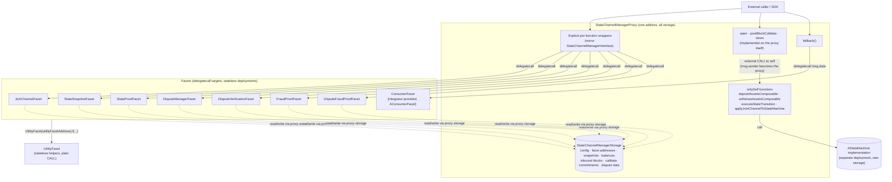

# Contract Architecture: Diamond-Style Proxy, Facets & Deployment Constraints

> **Status:** Draft, reverse-engineered baseline. Pending engineer review.
> **Scope:** The on-chain contract topology under [contracts/V1](../../../../contracts/V1): how the
> `StateChannelManagerProxy`, its facets, and shared storage fit together; the deployment size
> budget; and the intended refactor toward genuine Diamond compatibility.
> **Siblings:** [state-machine-base.md](./state-machine-base.md) (the integrator contract),
> [manager-and-facets.md](./manager-and-facets.md) (ABI-level reference). Protocol behavior lives in
> [../protocol/disputes.md](../protocol/disputes.md),
> [../protocol/fraud-proofs.md](../protocol/fraud-proofs.md),
> [../protocol/state-proofs.md](../protocol/state-proofs.md), and
> [../protocol/cross-layer-messages.md](../protocol/cross-layer-messages.md).

## 1. Purpose & observable contract

The on-chain manager is one deployed entry contract —
[`StateChannelManagerProxy`](../../../../contracts/V1/StateChannelDiamondProxy/StateChannelManagerProxy.sol) —
that presents the full
[`StateChannelManagerInterface`](../../../../contracts/V1/StateChannelManagerInterface.sol) at a
single address while the logic is split across separately deployed **facets** reached by
`delegatecall`. All state lives in the proxy's storage; facets execute in that storage context.

What the architecture guarantees:

- One address for the whole manager ABI, including integrator-defined consumer functions.
- One storage context: every facet reads and writes the proxy's slots, never its own.
- Facet code that is not reachable except through the proxy (facets hold no state of their own and
  are never called with their own storage in a meaningful way).

What it explicitly does not guarantee (Current):

- **No upgradeability.** Facet addresses are set once in the constructor and there is no setter and
  no selector table — facets cannot be replaced or added after deployment.
- **No EIP-2535 compliance.** There is no `diamondCut`, no loupe, no selector→facet routing. The
  Diamond resemblance is structural (proxy + facets + shared storage), not standard-conformant.

## 2. Current topology

`Current:` the implemented wiring, verified against source.

The mechanics, each verified in code:

- **Shared storage by inheritance.** Every facet inherits
  [`StateChannelManagerStorage`](../../../../contracts/V1/StateChannelDiamondProxy/StateChannelManagerStorage.sol)
  (via [`StateChannelCommon`](../../../../contracts/V1/StateChannelDiamondProxy/StateChannelCommon.sol)),
  so proxy and facets agree on one slot layout. No production facet declares additional state
  variables; the layout is defined in exactly one place. Storage is at the default root (slot 0),
  not under namespaced Diamond-storage slots.
- **Explicit interface mirroring.** The proxy implements
  `StateChannelManagerInterface` and forwards each function to its facet with a hand-written
  wrapper: `_delegatecall(facetAddress, abi.encodeCall(Facet.fn, (...)))` (see
  [`GeneralUtils._delegatecall`](../../../../contracts/V1/StateChannelDiamondProxy/utils/GeneralUtils.sol),
  which bubbles revert data). There is no selector-based routing; every routed function costs proxy
  code size.
- **Functions implemented on the proxy itself.** `open`, `postBlockCalldata`, `multicall`,
  `isChannelOpen`, `isForkDisputed`, and a set of dispute-window view helpers are not delegated —
  they live in the proxy contract body, which further inflates its size.
- **`onlySelf` guard.** `depositAssetsComposable`, `withdrawAssetsComposable`,
  `executeStateTransition` (proxy) and `applyJoinChannelToStateMachine` (`StateChannelCommon`)
  require `msg.sender == address(this)`. They are reached by an **external CALL from the proxy to
  itself** (`StateChannelManagerProxy(address(this)).fn(...)`), which makes `msg.sender` the proxy
  address. A facet running under delegatecall shares the proxy's `address(this)`, so the same
  pattern works from inside facets. External callers can never satisfy the guard.
- **Consumer fallback.** `fallback()` delegatecalls the integrator's consumer facet with raw
  `msg.data`, exposing `openChannelGenesis`, `deposit`, `withdraw`, and any custom consumer
  functions at the proxy address. Note the fallback forwards **every** unmatched selector — see the
  reachability concern in [state-machine-base.md §7](./state-machine-base.md#7-aconsumerfacet-the-integrator-consumer-contract).
- **UtilityFacet is called, not delegatecalled.** Pure/stateless helpers on
  [`UtilityFacet`](../../../../contracts/V1/StateChannelDiamondProxy/UtilityFacet.sol) are reached
  with a plain external call (`UtilityFacet(utilityFacetAddress).f(...)`); they need no storage
  context.
- **The state machine is a separate deployment.** `stateMachineImplementation` is an
  [`AStateMachine`](../../../../contracts/V1/AStateMachine.sol) instance with its own storage; the
  manager drives it with plain calls (`setState` → execute → `getState`) during dispute
  re-execution. All channels currently share the single implementation instance
  (`executeStateTransition` ignores `channelId` for machine selection — noted in code).
- **Test-only variant.**
  [`LocalDiamond`](../../../../contracts/V1/StateChannelDiamondProxy/LocalDiamond.sol) extends the
  proxy with storage-sync event handlers and a zero consumer facet for local testing. It is not a
  production deployable.

### Assumptions, constraints & dependencies

- The constructor wiring is trusted: whoever deploys chooses the facet addresses and there is no
  later verification that a facet matches its expected code.
- Facets MUST NOT declare state variables; a facet that did would silently alias the proxy layout.
  `Current:` upheld by convention only — there is no automated layout check (`none — gap`).
- The proxy inherits OpenZeppelin `ECDSA` transitively; external dependencies are limited to
  OpenZeppelin utils and (see below) `hardhat/console.sol`.

## 3. Deployment size constraint

Every deployable contract MUST stay below Ethereum mainnet's contract-code size limit of
**24,576 bytes (EIP-170)**. Initcode is additionally bounded by **49,152 bytes (EIP-3860)**; that
limit is not currently the binding one, but a contract whose runtime code already exceeds EIP-170
trends toward it too.

`Current:` the implementation **violates the budget**. Measured deployed-bytecode sizes from the
Hardhat artifacts (`solc 0.8.34`, optimizer `runs: 100`, `viaIR: true`):

| Contract                   | Deployed bytes | vs. 24,576 budget                                       |
| -------------------------- | -------------: | ------------------------------------------------------- |
| `StateChannelManagerProxy` |         30,959 | **over by 6,383**                                       |
| `DisputeFraudProofFacet`   |         26,436 | **over by 1,860**                                       |
| `DisputeVerificationFacet` |         24,783 | **over by 207**                                         |
| `StateProofFacet`          |         19,721 | under (80% of budget)                                   |
| `StateSnapshotFacet`       |         18,204 | under                                                   |
| `FraudProofFacet`          |         16,821 | under                                                   |
| `DisputeManagerFacet`      |         15,144 | under                                                   |
| `JoinChannelFacet`         |         12,981 | under                                                   |
| `UtilityFacet`             |          7,822 | under                                                   |
| `LocalDiamond` (test-only) |         41,552 | over — acceptable only because it never targets mainnet |

Contributing factors observed in source:

- `StateProofFacet`, `DisputeVerificationFacet`, and `LocalDiamond` import `hardhat/console.sol`
  and contain live `console.log` calls — development tooling compiled into would-be production
  bytecode.
- The proxy carries every interface wrapper plus `open`/`postBlockCalldata`/view logic in one
  contract (see §2).
- Every facet inherits the full `StateChannelCommon` body, duplicating its `public` functions into
  each facet's code (see the placement rule in [AGENTS.md](../../../../AGENTS.md): `public` base
  functions compile into every facet's ABI).

**Size budget (normative):**

- **REQ-CON-1.** Every contract intended for mainnet deployment (the proxy, all facets, and any
  integrator consumer facet or state machine) MUST have deployed bytecode ≤ 24,576 bytes and
  initcode ≤ 49,152 bytes. `Current:` violated (table above). The contracts REQUIRE refactoring
  (§4) to comply.
- **REQ-CON-2.** The build or deployment pipeline MUST verify REQ-CON-1 automatically and fail on
  violation (e.g. `hardhat-contract-sizer`, `forge build --sizes` in CI).
  `Current:` **none — gap.** Neither [hardhat.config.ts](../../../../hardhat.config.ts) nor
  [foundry.toml](../../../../foundry.toml) contains any contract-size check; worse, the Hardhat test
  network sets `allowUnlimitedContractSize: true`, so the local toolchain actively suppresses the
  signal that would otherwise catch the oversized proxy.
- **SHOULD:** production builds SHOULD reject any `hardhat/console.sol` import (a cheap grep-level
  gate) since it is both dead weight and a non-production dependency.

## 4. Intended refactor

`Intended:` design direction, agreed at review level. Except where marked, the items below are
**non-normative direction, not implemented behavior** — see also Future Work.

1. **Smaller, focused facets.** Split logic so every deployable stays inside REQ-CON-1 with
   headroom. The oversized proxy is the priority: routed wrappers and inline logic must move out.
2. **Shrink `StateChannelCommon`.** The shared base (612 source lines; 9,729 bytes compiled on its
   own, and repeated inside every facet) is too large. Reduce it to strictly necessary shared
   primitives. Favor composition over broad inheritance: shared behavior that does not need
   inherited storage access moves into focused components or free-function libraries
   (the pattern already started in
   [utils/](../../../../contracts/V1/StateChannelDiamondProxy/utils) — `GeneralUtils`,
   `BlockUtils`, `DisputeUtils` are free functions inlined only where used).
3. **Selector-based routing.** Replace the explicit interface mirroring and per-function wrappers
   with a selector→facet mapping in the fallback, consistent with the Diamond pattern. The mapping
   MUST support controlled facet replacement when a facet is upgraded (governance rules for who may
   cut are a separate, undecided concern).
4. **Diamond storage with versioned namespaces.** Move from inherited slot-0 layout to fixed root
   slots per versioned storage namespace (`keccak`-derived slot per namespace, struct accessed
   through that slot). A migration must be able to keep reading an old namespace while introducing
   a new one, so upgrades can read, migrate, and safely coexist with prior layouts.

**Open question:** whether the current self-call (`onlySelf`) guard remains necessary under the
improved architecture. To be resolved from first principles, not carried forward by habit. Inputs
to that decision, from the current code: today the guard exists because
`depositAssetsComposable` / `withdrawAssetsComposable` / `executeStateTransition` /
`applyJoinChannelToStateMachine` are `public` on the proxy or common base (so externally visible)
yet must only run as internal steps of a larger operation; the self-CALL also creates a fresh call
frame (memory/returndata isolation) that a delegatecall would not. Under selector routing these
functions could instead be internal to their facet, be routed-but-guarded, or keep the self-call
for frame isolation. The refactor must pick one and state why.

## 5. Verification

- **Current evidence.** Deployment wiring is exercised by
  [test/V1/UniversalDeployment.test.ts](../../../../test/V1/UniversalDeployment.test.ts)
  (LocalDiamond and consumer-facet deployment) and by every e2e suite under
  [test/e2e](../../../../test/e2e), all of which deploy the full proxy+facet set through the
  harness. Facet behavior at the unit level is covered by the Foundry suites in
  [test/V1/StateChannelDiamondProxy](../../../../test/V1/StateChannelDiamondProxy)
  (via [DiamondHarness.sol](../../../../test/V1/harness/DiamondHarness.sol)).
- **Required, missing.** Size-budget enforcement (REQ-CON-2): none — gap. Storage-layout
  compatibility checks between proxy and facets: none — gap (currently guaranteed only by the
  single-inheritance convention). `onlySelf` negative tests (direct external call to each guarded
  function must revert): not found at unit level — gap; the guard is only implicitly exercised.
- **After the refactor.** Selector routing and facet replacement need dedicated tests: route
  coverage for every selector, replacement of a facet mid-lifecycle, and storage-namespace
  migration round trips.

## Future Work

_Non-normative._

- Execute the refactor in §4 (focused facets, slim common base, selector routing, namespaced
  storage) and re-measure against REQ-CON-1 with headroom for future growth.
- Decide the `onlySelf` question (§4) and record the rationale here.
- Strip `hardhat/console.sol` from production contracts; consider a lint/CI gate.
- Facet upgrade governance: who may replace a facet, with what delay/announcement, and how open
  channels are protected from mid-dispute logic changes.
- Consider EIP-2535 loupe compatibility for tooling interoperability once routing exists.
- Automated storage-layout diffing (e.g. `forge inspect storage-layout`) wired into CI.

## Traceability

| ID        | Statement                                                                                                                                                                                                                                                          | Implementation                                                                                                                                                                                                                                                                                                                                                                                                                                                       | Verification evidence                                                                                                                                                                                                                   |
| --------- | ------------------------------------------------------------------------------------------------------------------------------------------------------------------------------------------------------------------------------------------------------------------ | -------------------------------------------------------------------------------------------------------------------------------------------------------------------------------------------------------------------------------------------------------------------------------------------------------------------------------------------------------------------------------------------------------------------------------------------------------------------- | --------------------------------------------------------------------------------------------------------------------------------------------------------------------------------------------------------------------------------------- |
| REQ-CON-1 | Every mainnet-deployable contract MUST have deployed bytecode ≤ 24,576 bytes (EIP-170) and initcode ≤ 49,152 bytes (EIP-3860). `Current:` violated by `StateChannelManagerProxy` (30,959), `DisputeFraudProofFacet` (26,436), `DisputeVerificationFacet` (24,783). | [contracts/V1/StateChannelDiamondProxy](../../../../contracts/V1/StateChannelDiamondProxy) (all deployables)                                                                                                                                                                                                                                                                                                                                                         | none — gap (measured manually from Hardhat artifacts for this document; no automated check)                                                                                                                                             |
| REQ-CON-2 | Build/deployment MUST verify REQ-CON-1 automatically and fail on violation.                                                                                                                                                                                        | none — gap ([hardhat.config.ts](../../../../hardhat.config.ts) sets `allowUnlimitedContractSize: true`; [foundry.toml](../../../../foundry.toml) has no size gate)                                                                                                                                                                                                                                                                                                   | none — gap                                                                                                                                                                                                                              |
| INV-CON-3 | Proxy and all facets share exactly one storage layout: facets inherit `StateChannelManagerStorage` and declare no state variables of their own.                                                                                                                    | [StateChannelManagerStorage.sol](../../../../contracts/V1/StateChannelDiamondProxy/StateChannelManagerStorage.sol); all facets via [StateChannelCommon.sol](../../../../contracts/V1/StateChannelDiamondProxy/StateChannelCommon.sol)                                                                                                                                                                                                                                | none — gap (convention upheld by review; exercised implicitly by all e2e suites in [test/e2e](../../../../test/e2e), no explicit layout check)                                                                                          |
| REQ-CON-4 | `onlySelf` functions (`depositAssetsComposable`, `withdrawAssetsComposable`, `executeStateTransition`, `applyJoinChannelToStateMachine`) MUST revert for any external caller; they are reachable only through the proxy's self-CALL.                               | [StateChannelManagerStorage.sol](../../../../contracts/V1/StateChannelDiamondProxy/StateChannelManagerStorage.sol) (`onlySelf` modifier); call sites in [StateChannelManagerProxy.sol](../../../../contracts/V1/StateChannelDiamondProxy/StateChannelManagerProxy.sol), [JoinChannelFacet.sol](../../../../contracts/V1/StateChannelDiamondProxy/JoinChannelFacet.sol), [FraudProofFacet.sol](../../../../contracts/V1/StateChannelDiamondProxy/FraudProofFacet.sol) | none — gap (no direct negative test found; positive path covered indirectly by [test/V1/DiamondProxy/StateChannelManager/OpenChannel.test.ts](../../../../test/V1/DiamondProxy/StateChannelManager/OpenChannel.test.ts) and e2e suites) |
