# Peer-RPC Model — The Client-Node Protocol Boundary

> **Specification subject:** [specification/architecture/rpc.md](../../../../../specification/peer-communication/rpc.md)

> **Status:** Draft, reverse-engineered baseline. Pending engineer review.
> **Scope:** The peer-RPC system as the protocol's peer-to-peer entry-point surface: service
> registration, typed proxy derivation, wire envelope, guards, delivery modes,
> correlation/timeout/error semantics, failure outcomes, and rate limiting. This is the deep
> reference behind the component summary in [components.md](../components.md) §2. Layering context:
> [architecture.md](../architecture.md); flow-level behavior of the main consumer:
> [block-confirmation-pipeline.md](../block-confirmation-pipeline.md).

## Service documents

This README owns the shared model — dispatch, guards, wire contract, outcome classes. Each
exported service has its own document in this directory that owns that service's algorithm,
Byzantine assessment, invariants, and verification:

| Service | Document |
| --- | --- |
| `InitHandshakeService` | [handshake.md](./handshake.md) |
| `WebRTCSetupService` | [webrtc-setup.md](./webrtc-setup.md) |
| `StateTransitionService` | [state-transition.md](./state-transition.md) |
| `JoinChannelService` | [join-channel.md](./join-channel.md) |
| `SpectateService` | [spectate.md](./spectate.md) |
| `IsForkDisputedService` | [is-fork-disputed.md](./is-fork-disputed.md) |
| `OpenChannelNegotiationService` (unwired) | [open-channel-negotiation.md](./open-channel-negotiation.md) |

## 1. Purpose & observable contract

The SDK is blockchain-node software that runs on every client rather than on a central server.
Establishing a peer transport ([`src/transport/`](../../../../../../../../src/transport)) is only the
connectivity layer: it moves opaque frames between processes and guarantees nothing about their
content. The RPC system defines the protocol's actual peer-to-peer entry points — which messages
one node may send to another, how they are routed to handlers, and where untrusted remote input
enters the local node.

This makes the RPC layer a **security boundary, not a code-organization preference**. Every public
RPC method is an adversarial ingress point: any connected peer (and, before the handshake guard,
any transport-level counterparty) can invoke it with arbitrary JSON-decodable arguments. The
boundary's contract is therefore twofold:

- **What it guarantees.** A frame reaching a handler has passed the frame-size cap, envelope-shape
  verification, service and method existence checks, and the service's guards
  ([`P2PManager.onRpc`](../../../../../../../../src/P2PManager.ts#L200),
  [`ARpcService.runRPC`](../../../../../../../../src/rpc/ARpcService.ts#L25)). Request/response replies are
  correlated, time-bounded, and only settled by the addressed peer.
- **What it does not guarantee.** Nothing about the *semantic* validity of parameters. The
  envelope is untrusted JSON; every handler remains responsible for decoding and validating its
  own payload before any state effect (§4, REQ-RPC-2).

Delivery is best-effort: no ordering across peers, no retries, no delivery receipts for
fire-and-forget sends, and — currently — no rate limiting beyond the frame-size cap (§9).

## 2. Design decision: service-oriented, type-safe extensibility

The extensibility model is deliberate: protocol functionality is packaged as **services**, and the
remotely callable surface of each service is a separate, deliberately small class.

### 2.1 The service / RpcMethods pair

A service (a subclass of [`ARpcService`](../../../../../../../../src/rpc/ARpcService.ts#L10)) owns shared state,
internal helpers, and business logic — e.g.
[`IsForkDisputedService`](../../../../../../../../src/rpc/services/isForkDisputedService/IsForkDisputedService.ts#L8)
owns the per-peer acknowledgment maps, and
[`SpectateService`](../../../../../../../../src/rpc/services/spectate/SpectateService.ts#L34) owns the in-flight
sync set and the whole payload-generation/verification machinery. It pairs with an **RpcMethods**
class (a subclass of [`ARpcMethods`](../../../../../../../../src/rpc/ARpcMethods.ts#L4)) that exposes *only* the
deliberately public, remotely callable methods. The dispatcher instantiates the RpcMethods class
per incoming frame via `service.createRPCMethods(transport)`, binding `senderTransport` so a
handler knows which peer called it.

**REQ-RPC-1 (normative).** Private helpers and mutable service state MUST NOT be exposed through
an `RpcMethods` class. Only methods whose remote invocation is an intended protocol entry point
belong there; everything else stays on the service. A method on an RpcMethods class is public to
every connected peer — putting it there *is* the act of opening a protocol entry point, and it
then carries the full ingress obligations of §4.

**Open question:** the dispatcher's method-existence check
([`hasMethod`](../../../../../../../../src/utils/ObjectChecks.ts#L14)) uses `prop in obj` plus a `typeof
"function"` test, which walks the prototype chain. Inherited functions — `Object.prototype`
members such as `toString`, `hasOwnProperty`, `constructor`, and the `ARpcMethods` base surface —
are therefore remotely dispatchable: a peer can send `method: "hasOwnProperty"` and have it
invoked with attacker-chosen parameters (and, for request-style frames, its return value
serialized back). No concrete exploit is identified, but this contradicts the "only
deliberately-public methods" rule; the dispatch check should probably be restricted to methods
declared on the RpcMethods class itself. Engineer decision needed (divergence class: decision
pending; observed in [`ARpcService.runRPC`](../../../../../../../../src/rpc/ARpcService.ts#L25) +
[`ObjectChecks.ts`](../../../../../../../../src/utils/ObjectChecks.ts#L1)).

### 2.2 MainRpcService — the root

[`MainRpcService`](../../../../../../../../src/rpc/MainRpcService.ts#L14) is the dispatch root. Its constructor
instantiates the six built-in services as public properties (`initHandshakeService`,
`webRTCSetupService`, `stateTransitionService`, `spectateService`, `isForkDisputedService`,
`joinChannelService`); the property name is the wire-visible service name (`rpc.service`).
Registration is purely structural: [`P2PManager.onRpc`](../../../../../../../../src/P2PManager.ts#L200) resolves
`rpc.service` with [`isInstanceOfRpcService`](../../../../../../../../src/utils/ObjectChecks.ts#L24), which
accepts any root property that is an object exposing a `runRPC` function. There is no explicit
service registry or allowlist — a property of the root either is a service (dispatchable) or is
not (frame rejected, sender disconnected).

[`OpenChannelNegotiationService`](../../../../../../../../src/rpc/services/openChannelNegotiation/OpenChannelNegotiationService.ts#L44)
is exported but **not** instantiated by `MainRpcService`; it only becomes reachable when an
integrator's custom root wires it in (§2.5). Until wired, its name resolves to nothing and frames
addressed to it disconnect the sender like any unknown service.

`MainRpcService.dispose()` is the runtime-shutdown hook: `StateManager.dispose()` awaits it before
tearing down the p2p manager, timeout manager, and EVM, so a custom root can settle waits and
drain async work. The base implementation is a no-op.

### 2.3 Typed remote proxy derivation

[`RemoteRpcProxy.createProxy(localRpcRoot)`](../../../../../../../../src/rpc/RemoteRpcProxy.ts#L1) derives the
**sending** surface (`p2pManager.remoteRpc`) from the **receiving** root. The type
`RemoteRpcProxyType<T>` maps every service property of the root to the `RpcHandleMethods` of its
paired RpcMethods class, with each method's return type rewritten into a delivery handle
([`RpcHandleProxy.ts`](../../../../../../../../src/rpc/RpcHandleProxy.ts#L1)). At runtime the proxy fabricates,
for `remoteRpc.<service>.<method>(...params)`, an envelope `{service, method, params}` wrapped in
an [`RpcHandler`](../../../../../../../../src/rpc/RpcHandler.ts#L35); no code generation and no per-service
sending stubs exist. Accessing a non-service property of the root through `remoteRpc` throws
(`"RemoteRpcProxy can only access services"`).

The effect is that local TypeScript callers cannot construct a wrong call — method names,
parameter types, and result types are all checked against the RpcMethods class — and the
receiving and sending surfaces cannot drift apart, because both are derived from the same class.
This is a *local-developer* safety property only; see §4 for what it does not protect.

### 2.4 Delivery modes — chosen by the caller, constrained by the method's type

The delivery handle exposed for a method depends on its declared return type
([`RpcHandleProxy.ts`](../../../../../../../../src/rpc/RpcHandleProxy.ts#L1)):

| Method returns | Handle | Operations |
| --- | --- | --- |
| `void` / `Promise<void>` | `FireAndForgetRpcHandler` | `.broadcast()`, `.sendOne(target?)`, `.sendMultiple(targets)` |
| any value | `RequestRpcHandler<T>` | `.request(target?, {timeoutMs?})` → `Promise<T>` |

- **Broadcast** ([`P2PManager.broadcastRpc`](../../../../../../../../src/P2PManager.ts#L102)) sends the envelope to
  every open connection. No `requestId` — no replies.
- **One-way send** (`sendOne`/`sendMultiple`, [`RpcHandler`](../../../../../../../../src/rpc/RpcHandler.ts#L35))
  targets a transport or an EVM address (resolved via `ProfileManager`). A target with no open
  transport is a silent no-op — fire-and-forget delivery never reports failure.
- **Request/response** (`.request`) adds a `requestId` and returns a promise settled by the peer's
  reply (§6.4). An unresolvable target rejects locally.
- **Loopback:** omitting the target on `sendOne`/`request` delivers to self through
  [`LoopbackTransport`](../../../../../../../../src/transport/LoopbackTransport.ts#L13) — the node invokes its own
  RPC methods through the normal plumbing (used by `hostRpc`, §3).

The mode is the caller's choice per call site; the method's implementation must therefore be safe
under every mode its type admits (e.g. a `void` method must tolerate being broadcast).

### 2.5 Custom roots — manifest + registry

Integrators extend the boundary by subclassing `MainRpcService` and shipping the subclass as a
[`CustomRpcManifest`](../../../../../../../../src/rpc/registry.ts#L12) (`{module, exportName?, options?}`) via
`p2pSetup(options.customRpcManifest)` ([architecture.md](../architecture.md) §1.1). The host side
resolves the manifest with
[`resolveCustomRpcConstructor`](../../../../../../../../src/rpc/resolveCustomRpcManifest.ts#L5) (dynamic module
load; throws unless the export is a constructor) and passes the constructor into
[`P2PManager`](../../../../../../../../src/P2PManager.ts#L26), which instantiates it in place of the base root and
derives `remoteRpc` from it. Typing flows through the `TCustomRpc extends MainRpcService`
parameter, so custom services get the same typed sending surface as built-ins
(`RemoteRpcProxyType<TCustomRpc>`), including through `hostRpc` (§3). `customRpcOptions` without a
`customRpc` constructor is rejected.

**REQ-RPC-3 (normative).** A custom root MUST follow the same pairing discipline as the built-ins:
each added entry point lives on an RpcMethods class behind a service, carries applicable guards,
and validates its own payload (§4). The registry deliberately provides no way to expose a bare
function — the service/RpcMethods shape is the only extension mechanism.

## 3. The `hostRpc` back-channel

The application never holds the internal managers ([architecture.md](../architecture.md) §1). Its
one path into node services is `P2pInstance.hostRpc`
([`ClientHostRpc.ts`](../../../../../../../../src/evm/p2pRuntime/ClientHostRpc.ts#L1)): a client-realm proxy that
mirrors the host's `remoteRpc` surface exactly (`RemoteRpcProxyType<TCustomRpc>`). A chained call
`hostRpc.<service>.<method>(...params).<delivery>(...args)` is captured verbatim, forwarded over
the runtime port as a `hostRpc` request, and replayed by the host on its live `remoteRpc`
([`dispatchHostRpc`](../../../../../../../../src/evm/p2pRuntime/P2pRuntimeHost.ts#L579)); for `request` the host
awaits and returns the result.

Target semantics are those of §2.4, evaluated on the host: **no target → loopback to the local
host's own RPC surface; a peer address → typed relay of the same call to that remote peer.** Only
addresses can be targets from the client — transports are not serializable across the port. The
port is a pure proxy: new delivery methods on `RpcHandler` work through it with no protocol
change.

This design is intentional. The application can interact with local node services (e.g. drive a
custom negotiation service) and explicitly address another peer, all **through** the RPC boundary
— without receiving internal service objects, and without a second, unguarded path into the node.
A loopback delivery enters `P2PManager.onRpc` like any frame; the only privilege it carries is
`LoopbackTransport.isTrusted`, which skips peer-session guards (§5.3) — appropriate because the
caller is the local application, not a peer.

## 4. Type safety vs. Byzantine safety

These are two different properties and the specification states them plainly, because conflating
them is how ingress bugs happen:

- **Type safety protects local callers.** The typed proxy (§2.3) prevents ordinary local
  TypeScript code from constructing a wrong call. It constrains *senders compiled against this
  codebase* and nothing else.
- **Wire data is untrusted JSON.** A Byzantine peer does not use the proxy; it sends arbitrary
  frames. At receipt the dispatcher verifies exactly: frame size, envelope shape (`service` and
  `method` strings, `params` an array — [`deserializeRpc`](../../../../../../../../src/rpc/Rpc.ts#L41)), service
  existence, guards, method existence, and (for replies) response shape and request correlation.
  It does **not** verify parameter arity, parameter types, or semantic validity — `params` is
  spread raw into the handler (`method(...rpc.params)`).

**REQ-RPC-2 (normative).** Every RPC endpoint is an adversarial ingress point and MUST, before any
state effect: authenticate the caller or rely on an explicit applicable guard; decode its payload
(encoded protocol structs through [`Codec`](../../../../../../../../src/utils/Codec.ts#L175), §6.3) treating decode
failure as a handled protocol failure, never an escaping exception; validate semantic constraints
(shape, ranges, protocol preconditions, authorization); and bound its resource use. Equivalent
input arriving from another ingress path (chain events, local recovery) must receive comparably
explicit validation before it affects the internal system
([block-confirmation-pipeline.md](../block-confirmation-pipeline.md) §2).

**REQ-RPC-4 (normative).** Bigint-bearing values MUST cross the RPC boundary as canonical
`Codec.encode` strings, never raw JSON. [`serializeRpc`](../../../../../../../../src/rpc/Rpc.ts#L38) enforces this
mechanically: `JSON.stringify` throws on a raw `BigInt`, surfacing the offending method instead of
silently coercing to a lossy number, and the test harness deliberately installs no
`BigInt.prototype.toJSON` shim.

Type safety at the caller and Byzantine safety at the receiver are complementary requirements, not
substitutes. Examples of the split done right:
[`InitHandshakeRpcMethods.onInitHandshakeRequest`](../../../../../../../../src/rpc/services/initHandshake/InitHandshakeRpcMethods.ts#L25)
rejects a non-32-byte challenge and a non-finite time *before signing anything* (a NaN would slip
past the skew comparison);
[`SpectateService.applySyncResponse`](../../../../../../../../src/rpc/services/spectate/SpectateService.ts#L96)
decodes the peer's payload inside its failure handling so undecodable bytes become an aborted
sync, not an unhandled rejection;
[`JoinChannelService.signJoinRequest`](../../../../../../../../src/rpc/services/joinChannel/JoinChannelService.ts#L137)
recovers and cross-checks the embedded signature, channel, deadline, fork, and snapshot before
producing its own signature.

## 5. Guards — first-class session gating

Guards gate a service's entire public surface on objective preconditions about the *caller*,
before any method logic runs. They are the boundary's authentication/admission layer, distinct
from the per-endpoint payload validation of §4.

### 5.1 Mechanism

A guard subclasses [`AGuard`](../../../../../../../../src/rpc/guards/AGuard.ts#L15): `check(rpc, transport)`
returns pass/fail; `onFailure(rpc, transport)` runs on the first failing guard and owns the
consequence (it may disconnect, blacklist, queue-and-retry via `service.runRPC`, or delegate to an
injected callback). Services declare `this.guards = [...]` in their constructors;
[`runGuards`](../../../../../../../../src/rpc/guards/runGuards.ts#L10) evaluates them **sequentially in
declaration order**, short-circuiting on the first failure. Ordering is therefore meaningful and
part of a service's contract (cheap/structural guards should precede expensive ones).

Placement in the dispatch path ([`ARpcService.runRPC`](../../../../../../../../src/rpc/ARpcService.ts#L25)):
guards run **before the method-existence check** — an unauthenticated peer probing a guarded
service hits the guard consequence even for nonexistent methods, and learns nothing about the
service's method names.

**Trusted-transport exception.** Guards are skipped entirely when `transport.isTrusted` — true
only for [`LoopbackTransport`](../../../../../../../../src/transport/LoopbackTransport.ts#L13) (self-delivery,
§2.4/§3); every network transport reports `false`
([`ATransport.isTrusted`](../../../../../../../../src/transport/ATransport.ts#L46)).

**Rejection behavior.** On guard failure the RPC is consumed (never dispatched). For
request-style frames the dispatcher additionally sends `{ok: false, error: "RPC request rejected
by guard"}` so the remote caller's promise rejects instead of timing out.

### 5.2 HandshakeCompletedGuard

[`HandshakeCompletedGuard`](../../../../../../../../src/rpc/guards/HandshakeCompletedGuard.ts#L41) is the one
built-in guard. `check` passes iff the sender transport maps to a `PeerProfile` with
`isHandshakeCompleted` — i.e. the peer's EVM identity was proven by the challenge/response
handshake (§7, `initHandshakeService`). All built-in services except `InitHandshakeService` use it
(`StateTransitionService`, `SpectateService`, `IsForkDisputedService`, `JoinChannelService`,
`WebRTCSetupService`, plus the unwired `OpenChannelNegotiationService`). `InitHandshakeService`
is deliberately unguarded — it *is* the authentication mechanism and must accept pre-session
traffic.

`onFailure` distinguishes two cases:

1. **Handshake in progress** (`initHandshakeService.isNegotiating(transport)`): the RPC is
   enqueued per-transport and a single waiter per transport waits up to `2 × agreementTime` for
   completion; on success queued RPCs are replayed in arrival order through `service.runRPC`; on
   timeout the queue is cleared and the peer is disconnected and blacklisted (by EVM address when
   known, else by transport).
2. **No negotiation in progress**: a guarded RPC over an unverified transport is treated as
   malicious — disconnect + blacklist immediately.

**Open question:** the guard's retry queue and the request/response path interact badly. On guard
failure `runRPC` *always* sends the `"rejected by guard"` error response when a `requestId` is
present — including in the queue-and-wait case — so a request-style RPC arriving during handshake
negotiation is rejected immediately at the caller, and when the queued copy is later replayed its
(second) response carries an already-settled `requestId` and is silently dropped by the caller's
[`handleRpcResponse`](../../../../../../../../src/P2PManager.ts#L167). The retry queue therefore only benefits
fire-and-forget RPCs; whether request-style RPCs should instead be held without an early error
(or never queued) is undecided. A secondary wrinkle: in the non-negotiating branch `onFailure`
disconnects the transport *before* `runRPC` attempts to send that error response on it.
(Divergence class: decision pending; observed in
[`ARpcService.runRPC`](../../../../../../../../src/rpc/ARpcService.ts#L25) +
[`HandshakeCompletedGuard`](../../../../../../../../src/rpc/guards/HandshakeCompletedGuard.ts#L41).)

### 5.3 Requirements for future guards

**REQ-RPC-5 (normative).** The guard mechanism is the designated place for caller-scoped
admission decisions, and new pre-conditions of that kind MUST be expressed as explicit guards
rather than ad-hoc checks duplicated across endpoints: authorization (is this peer allowed to
invoke this service — e.g. participant vs. spectator), admission state (channel status, join
progress), and other objective preconditions. Guards MUST be side-effect-free in `check` (pure
predicate) with all consequences in `onFailure`; each guard MUST document its ordering
constraints, trusted-transport applicability, and rejection behavior. Endpoint-level validation
(§4) remains mandatory regardless of guards — a guard authenticates or admits the *caller*, never
the *payload*.

## 6. The wire contract, stage by stage

### 6.1 Envelope and response schema

One JSON object per frame ([`Rpc.ts`](../../../../../../../../src/rpc/Rpc.ts#L1)):

```
Rpc          = { service: string, method: string, params: any[], requestId?: string }
RpcResponse  = { rpcResponse: true, requestId: string, ok: boolean, result?: any, error?: string }
```

`requestId` present ⇔ the sender expects exactly one `RpcResponse` with the same `requestId`.
`deserializeRpc` accepts a frame only if `service` and `method` are strings and `params` is an
array (the dispatcher spreads it); `deserializeRpcResponse` requires the `rpcResponse: true`
marker, a string `requestId`, and a boolean `ok`. Anything else is undecodable → sender
disconnected. Incoming frames are classified response-first: a frame matching the response shape
is routed to correlation handling and never to service dispatch.

There is **no protocol-version field** in the envelope — see §6.9.

### 6.2 Send path

`remoteRpc.<service>.<method>(...params)` builds the envelope (§2.3) → delivery handle (§2.4) →
[`ATransport.send`](../../../../../../../../src/transport/ATransport.ts#L43) serializes with `serializeRpc` and
hands the string to the concrete transport's `_send`. Responses use `sendRpcResponse` /
`serializeRpcResponse` on the transport the request arrived on.

### 6.3 Encoding and decoding rules

The envelope itself is plain JSON; params and results MUST be JSON-serializable values.
Bigint-bearing ethers structs cross as `Codec.encode`d strings — ABI encoding against the
canonical ethers type strings ([`Codec`](../../../../../../../../src/utils/Codec.ts#L175), `Type` enum covering
blocks, confirmations, joins, proofs, sync payloads, …) — and are `Codec.decode`d inside the
receiving endpoint (REQ-RPC-2/4). One serialization mechanism (Codec) for all protocol structs;
raw `BigInt` in an envelope throws at the sender (§4). Examples on the wire:
`encodedSignedJoinChannel` (join), `encodedSyncPayload` (spectate);
`BlockConfirmationStruct` crosses as a JSON object whose numeric fields are strings/hex by ethers
struct convention and is authenticated and re-validated in the pipeline.

### 6.4 Receive path — the complete dispatch algorithm

[`P2PManager.onRpc(serializedRpc, transport)`](../../../../../../../../src/P2PManager.ts#L1) is the single entry
point for every frame from every transport (network and loopback):

1. **Frame-size cap.** `serializedRpc.length > MAX_RPC_FRAME_BYTES` (16 MiB,
   [`Rpc.ts`](../../../../../../../../src/rpc/Rpc.ts#L1)) → log, disconnect, stop — *before* any `JSON.parse`, so
   an oversized frame cannot force unbounded parse work. (Note: the check counts UTF-16 code
   units, not bytes; for the ASCII JSON the protocol produces these coincide, but a peer sending
   multi-byte characters gets up to ~4× the nominal byte budget. Documentation debt — the
   constant's name overstates precision.)
2. **Response classification.** If the frame decodes as an `RpcResponse` → correlation handling
   (§6.5), stop.
3. **Envelope verification.** `deserializeRpc` failure → disconnect.
4. **Service existence.** `rpc.service` must resolve on the local root to an object exposing
   `runRPC` (`isInstanceOfRpcService`) → else disconnect.
5. **Guards** (inside `runRPC`, skipped for trusted transports): first failure → consequence per
   guard + error response if `requestId` (§5.1); frame consumed.
6. **Method existence.** `hasMethod` failure → `runRPC` returns `false` → disconnect (see the §2.1
   open question on prototype-inherited methods).
7. **Invocation.** `createRPCMethods(transport)` binds the sender; the method runs with `params`
   spread raw.
   - **Request path** (`requestId` present): the handler's awaited return value is sent as
     `{ok: true, result}`; a thrown/rejected error is caught, logged, and sent as
     `{ok: false, error}` — the connection is **kept** (deliberate: handler errors report to the
     caller instead of dropping the session).
   - **Fire-and-forget path:** an async rejection is logged and the sender is **disconnected**
     (no blacklist); a synchronous throw returns `false` → disconnect via `onRpc`.
8. **Dispatcher backstop.** Any exception escaping the above disconnects the transport.

```mermaid
flowchart TD
    F[transport frame] --> S{size ≤ 16 MiB?}
    S -- no --> D1[disconnect]
    S -- yes --> R{RpcResponse shape?}
    R -- yes --> C[correlation: requestId + addressed-peer check]
    R -- no --> E{valid Rpc envelope?}
    E -- no --> D2[disconnect]
    E -- yes --> SV{service exists on root?}
    SV -- no --> D3[disconnect]
    SV -- yes --> G{guards pass? &#40;skipped if trusted&#41;}
    G -- no --> GF[guard onFailure + error response if requestId]
    G -- yes --> M{method exists?}
    M -- no --> D4[disconnect]
    M -- yes --> H[RpcMethods handler: decode + validate + service call]
    H -- request path --> RESP[ok/error response to sender]
    H -- fire-and-forget error --> D5[disconnect]
```



**Open question:** on the request path, the success and error responses are sent from inside the
same try/catch — if `sendRpcResponse` itself throws (e.g. the transport closed between handler
start and reply), the catch block re-attempts a send on the same dead transport and that second
throw escapes the voided async closure as an unhandled rejection. Whether transports are required
to swallow sends on closed connections, or the dispatcher should guard the reply send, is
undecided. (Divergence class: decision pending; observed in
[`ARpcService.runRPC`](../../../../../../../../src/rpc/ARpcService.ts#L25).)

### 6.5 Correlation, timeout, cancellation, disconnect, and error semantics

[`P2PManager.sendRpcRequest`](../../../../../../../../src/P2PManager.ts#L123):

- **Correlation.** `requestId` is a node-local monotonically increasing counter rendered as a
  string; the pending-request table maps it to `{resolve, reject, transport, timeout}`.
  Uniqueness is per sender per process; unpredictability is *not* relied on — response
  authenticity rests entirely on transport binding (below), not on guessing resistance.
- **Timeout.** Default `timeConfig.agreementTime` seconds (converted to ms), overridable per call
  via `{timeoutMs}`; scheduled on the `TimeoutManager`. Expiry removes the entry and rejects with
  a descriptive error. There is no cancellation API beyond the timeout — a caller cannot abort an
  in-flight request, and the remote handler is never cancelled (its late response is silently
  dropped, below).
- **Addressed-peer rule (INV-RPC-2).** Only the peer the request was sent to may settle it.
  [`handleRpcResponse`](../../../../../../../../src/P2PManager.ts#L167) compares peer *identity*
  ([`ATransport.isSamePeer`](../../../../../../../../src/transport/ATransport.ts#L28), checksum-address based) —
  not transport object identity — so a WebRTC upgrade still settles pending requests; a response
  from any other peer **blacklists and disconnects the responder**.
- **Unknown/late responses.** A response whose `requestId` has no pending entry (already settled,
  timed out, or never issued) is silently ignored — no disconnect. Unsolicited response spam is
  thus penalty-free (bounded only by frame handling; see §9).
- **Error propagation.** `{ok: false}` rejects the caller's promise with `Error(response.error)`.
  Remote error strings are attacker-controlled text; callers MUST NOT parse or branch on them for
  protocol decisions.
- **Disconnect.** `disconnectConnection` rejects every pending request bound to that transport
  object ("Peer disconnected before RPC response arrived") and cancels their timers. After a
  transport upgrade, requests issued on the *old* transport are rejected when it is retired
  (object-identity match in `rejectPendingRpcRequestsForTransport`), even though the peer remains
  connected — callers are expected to retry against the address, which resolves to the live
  transport.
- **Send failure.** A synchronous `transport.send` throw settles the request immediately and
  cancels its timer.

### 6.6 Scheduling and mutex boundaries

RPC handlers run as ordinary tasks on the single-threaded host runtime; nothing in the RPC layer
acquires the `StateManager` mutex. This is deliberate and load-bearing: peer ingest is the
cheap, mergeable, out-of-order regime, and only the downstream dequeue-and-execute path takes the
mutex ([block-confirmation-pipeline.md](../block-confirmation-pipeline.md) §3.1, REQ-BCP-3/4).
Consequently an RPC endpoint MUST NOT assume exclusive access to live state — it hands validated
input to the owning manager, which enforces its own concurrency discipline. The block-queue
boundedness argument also lands here: the queue deliberately has no cap of its own because the
*RPC layer* is the intended admission-control point (§9).

Inline-host deployments can wrap every incoming-RPC handler invocation in the integrator's
`handlerExecutionContext` ([architecture.md](../architecture.md) §1.1) — a scheduling hook, not a
security control.

### 6.7 Replay and idempotence expectations

The RPC layer itself has **no replay protection**: no nonces on requests, no dedup of identical
frames. Idempotence is an endpoint responsibility, and the built-ins illustrate the accepted
patterns:

- **Idempotent-by-merge.** Block confirmations: re-delivery merges signatures (set union); a
  duplicate is a no-op (`DUPLICATE`) — replay is harmless by construction
  ([block-confirmation-pipeline.md](../block-confirmation-pipeline.md) §3.1).
- **Replay-as-violation.** A duplicate handshake ack and a duplicate dispute-acknowledgment
  request are protocol violations → disconnect + blacklist
  ([`InitHandshakeRpcMethods.onInitHandshakeAck`](../../../../../../../../src/rpc/services/initHandshake/InitHandshakeRpcMethods.ts#L114),
  [`IsForkDisputedRpcMethods`](../../../../../../../../src/rpc/services/isForkDisputedService/IsForkDisputedRpcMethods.ts#L6)).
- **Concurrency-limited.** Spectate allows one in-flight sync per peer (`inFlightByPeerAddress`).

**REQ-RPC-6 (normative).** Every endpoint MUST be explicitly one of: idempotent under re-delivery,
or replay-rejecting with a defined consequence. An endpoint whose replay silently double-applies a
state effect is a defect.

### 6.8 Service lifecycle, disposal, transport replacement

- **Construction.** Root and services are built once per `P2PManager` (per runtime); services are
  long-lived singletons; RpcMethods instances are per-dispatch and stateless beyond
  `senderTransport`.
- **Disposal.** `StateManager.dispose()` awaits `localRpc.dispose()` (custom-root drain hook,
  §2.2), then `P2PManager.dispose()` disconnects all transports — rejecting all pending requests —
  and disposes discovery. Handlers already in flight are not cancelled; long-running service work
  checks `stateManager.isDisposed` at its own checkpoints (e.g.
  [`InitHandshakeService.maybeFinalizeHandshakeOnceFromTransport`](../../../../../../../../src/rpc/services/initHandshake/InitHandshakeService.ts#L238)).
- **Transport replacement.** Peer identity is the EVM address; profiles (and blacklist state)
  survive transport churn ([`ProfileManager`](../../../../../../../../src/ProfileManager.ts#L7), INV-SDK-6). The
  WebRTC upgrade retires the old transport after an `agreementTime` grace; address-targeted
  delivery always resolves the current transport, and response correlation tolerates the upgrade
  (§6.5). Services that must survive churn key their state by address, not transport
  (IsForkDisputed acks, spectate in-flight set); handshake negotiation state is deliberately
  transport-keyed (`WeakMap`/`WeakSet`) because it *is* per-connection.

### 6.9 Versioning and compatibility

**Current:** there is no protocol-version negotiation anywhere in the RPC layer. The envelope has
no version field; no version is exchanged in the handshake; the only versioned identifier on the
wire is the handshake domain string `peer3:init-handshake:v1` (REQ-SDK-3), which scopes exactly
one message type. Two peers running incompatible SDK revisions discover it only through
downstream failures (unknown service/method → disconnect; undecodable Codec payloads → endpoint
failure).

**Intended:** an explicit compatibility policy is required before production — at minimum a
protocol version established at handshake time with a defined mismatch outcome (refuse the
session cleanly rather than blacklist), and its relationship to the signature-domain decision in
[OQ-29](../../../../../specification/open-questions.md) (which must bind protocol version into signed domains). Divergence
class: **missing**. **Open question:** the concrete versioning scheme (wire-envelope field vs.
handshake exchange, compatibility ranges, coupling to OQ-29's domain tags) is undesigned.

## 7. Built-in services — summaries

The per-endpoint deep content — algorithm, endpoint validation, Byzantine assessment, invariants,
verification — lives in the per-service documents ([Service documents](#service-documents) above).
This section keeps only the one-line ingress summary. All services except `initHandshakeService`
are behind `HandshakeCompletedGuard`; component-level summary table in
[components.md](../components.md) §2.

- **`initHandshakeService`** ([handshake.md](./handshake.md)) — unguarded challenge/response
  authenticator; completion marks the session authenticated (opening every guarded service) and
  may start the WebRTC upgrade and post-handshake sync. Malformed requests and duplicate acks
  carry disconnect/blacklist consequences (§8).
- **`stateTransitionService`** ([state-transition.md](./state-transition.md)) — one-way
  block-confirmation gossip; the **sole peer entry** into the block-confirmation pipeline
  ([block-confirmation-pipeline.md](../block-confirmation-pipeline.md) §4).
- **`spectateService`** ([spectate.md](./spectate.md)) — request/response proof-backed sync under
  the mutual-cooperation rule; outgoing failure handling over-blacklists (**DEF-5**,
  [../../open-questions.md](../../../../../specification/open-questions.md)).
- **`isForkDisputedService`** ([is-fork-disputed.md](./is-fork-disputed.md)) — one
  dispute-acknowledgment round per disputed fork per peer; violations → disconnect + blacklist
  (dispute context: [dispute-pipeline.md](../dispute-pipeline.md)).
- **`joinChannelService`** ([join-channel.md](./join-channel.md)) — request/response
  join-signature collection with the full REQ-RPC-2 validation chain; validation failures are
  penalty-free request errors.
- **`webRTCSetupService`** ([webrtc-setup.md](./webrtc-setup.md)) — one-way WebRTC signaling;
  every failure is caught and logged only — silent ignore.
- **`openChannelNegotiationService`**
  ([open-channel-negotiation.md](./open-channel-negotiation.md)) — open-terms negotiation;
  exported but **unwired** by default. Invalid or out-of-sequence input returns early — silent
  ignore. Wiring decision tracked in [components.md](../components.md) Future Work.

## 8. Outcome classification — what each failure does

Verified consequences per failure class. "Blacklist" is by EVM address on the `PeerProfile`
(survives transport churn); blacklisting a transport with **no profile yet is a disconnect only**
(the optional-chained `profile?.blacklist()` in
[`disconnectAndBlacklistPeer`](../../../../../../../../src/P2PManager.ts#L174) is a no-op) — pre-handshake
"blacklist" outcomes are therefore weaker than they read. **Open question:** whether pre-profile
blacklisting should pin the transport-level address (when present) so a rejected peer cannot
simply reconnect; today only `disconnectAndBlacklistPeerByEvmAddress` paths persist the ban.
(Divergence class: decision pending.)

| Failure | Where | Consequence |
| --- | --- | --- |
| Oversized frame | `onRpc` step 1 | Disconnect |
| Undecodable frame / bad envelope | `onRpc` step 3 | Disconnect |
| Unknown service | `onRpc` step 4 | Disconnect |
| Unknown method | `runRPC` | Disconnect |
| Guard failure — unverified transport | `HandshakeCompletedGuard` | Disconnect + blacklist (+ error response if request) |
| Guard failure — handshake in progress | `HandshakeCompletedGuard` | Queue + retry after handshake; timeout → disconnect + blacklist; request-style additionally gets an immediate error (see §5.2 open question) |
| Request handler throws | `runRPC` request path | Error response; connection kept |
| Fire-and-forget handler rejects/throws | `runRPC` | Disconnect (no blacklist) |
| Malformed handshake request / skew violation | `initHandshakeService` | Disconnect + request error |
| Duplicate handshake ack | `initHandshakeService` | Disconnect + blacklist |
| Handshake response invalid/timeout (outgoing) | `initHandshakeService` | Disconnect |
| Handshake ack timeout | `initHandshakeService` | Blacklist by verified address, else disconnect |
| Block confirmation judged Byzantine (strategy verdict `false`) | `stateTransitionService` → pipeline | Disconnect + blacklist |
| Block confirmation invalid but tolerated (duplicate, wrong fork, unknown sender…) | pipeline strategies | Ignore (entry dropped or queued; connection kept) — see [block-confirmation-pipeline.md](../block-confirmation-pipeline.md) §9 |
| Provable equivocation / invalid transition in ingested blocks | pipeline, not RPC layer | Fraud-proof / dispute work ([dispute-pipeline.md](../dispute-pipeline.md)); the RPC layer itself never constructs proofs |
| Unprovable spectate request | `spectateService` responder | Disconnect + blacklist requester + request error |
| Spectate sync failure (outgoing, any cause) | `spectateService` caller | Disconnect + blacklist responder — **DEF-5**, over-broad |
| Fork-not-disputed / duplicate dispute-ack request | `isForkDisputedService` responder | Disconnect + blacklist + request error |
| Dispute-ack rejection/error/timeout (outgoing) | `isForkDisputedService` caller | Disconnect + blacklist |
| Join-signature validation failure | `joinChannelService` | Request error only; connection kept |
| WebRTC signaling failure (any) | `webRTCSetupService` | Silent ignore |
| Response from non-addressed peer | `handleRpcResponse` | Disconnect + blacklist responder |
| Response with unknown/expired `requestId` | `handleRpcResponse` | Silent ignore |

**Open question:** the classification is inconsistent across services in ways no recorded decision
explains: join-signature abuse is penalty-free (error only) while an unprovable spectate request
is an immediate permanent blacklist; fire-and-forget handler errors disconnect but request handler
errors keep the connection (letting a peer probe guarded request endpoints with invalid payloads
indefinitely at zero cost); WebRTC signaling swallows everything. Each choice is individually
defensible (join requests can be honestly stale; request errors are the documented contract;
signaling is best-effort), but the intended per-class policy — *which* failures are Byzantine
evidence vs. honest-failure tolerable — has never been stated and should be decided once,
centrally, rather than per endpoint. (Divergence class: decision pending.)

## 9. Rate limiting

**Current:** the only resource bound at this boundary is the 16 MiB frame cap (§6.4) plus
per-entry structural caps downstream in the block queue. Nothing prevents a peer from sending an
unbounded *number* of individually valid RPCs — handshake attempts, spectate requests (each
triggering proof generation, which is expensive), join-signature requests (penalty-free errors,
§8), block confirmations (each scheduling ingest work), or unsolicited responses (silently
ignored but parsed). Remote peers can therefore consume unbounded CPU, memory, bandwidth, and
scheduled-task capacity. Divergence class: **missing** (accepted direction, not implemented).

**Intended (engineer direction, 2026-08-10 — [OQ-6](../../../../../specification/open-questions.md)):** enforcement lives in
a **single, central rate limiter at the RPC level**, shared across all RPC services (possibly
scoped per peer) — deliberately *not* per-service limits — so one clean mechanism protects
everything, including custom-root services that would otherwise each reinvent (or forget)
limiting. The natural seat is the common dispatch path (`P2PManager.onRpc`), upstream of parse
and dispatch. This limiter is also what bounds the pre-execution block queue: a finite admission
rate times the fixed entry lifetime gives a bounded queue, so the queue needs no cap of its own
([block-confirmation-pipeline.md](../block-confirmation-pipeline.md) §3.1).

Open design content within OQ-6 (required before production):

- **Rate and burst** — the unit of limiting (frames, bytes, admission cost) and steady-state vs.
  burst allowances.
- **Queue/backpressure** — whether over-limit frames are dropped, delayed, or answered with an
  explicit throttle error, and how that interacts with request timeouts.
- **Prioritization** — the node MUST remain responsive to protocol-critical recovery and dispute
  messages under load; a priority scheme (e.g. dispute/handshake traffic above bulk sync) is part
  of the design.
- **Identity scope** — per-peer (EVM address) vs. per-transport vs. global, and pre-handshake
  attribution when no address is proven yet.
- **Resource accounting** — whether expensive endpoints (spectate proof generation) carry a
  higher cost than cheap ones under the single limiter.
- **Penalties** — whether exceeding limits is throttled (honest-burst tolerant) or escalates to
  disconnect/blacklist, and the thresholds between those.
- **Sub-question (within OQ-6):** whether an additional fixed per-peer limit — or any per-service
  granularity on top of the central limiter — is wanted at all. The decided direction is the
  single shared limiter; per-service granularity is open only as this narrower refinement.

## 10. Assumptions, constraints & dependencies

- Single JS realm per host; handlers interleave via the scheduler, never preemptively
  ([components.md](../components.md) §11). The RPC layer holds no locks (§6.6).
- Peer identity and blacklist state depend on `ProfileManager` and the handshake service;
  transport-level addresses are untrusted until handshake verification writes the checksummed
  address onto the transport.
- Timeouts are denominated in `timeConfig.agreementTime`, read from the chain
  ([../protocol/time.md](../../../../../specification/protocol-model/time.md)); clock quality per
  [`Clock`](../../../../../../../../src/Clock.ts#L3).
- Trust context: peers are Byzantine; the transport provides no authentication or delivery
  guarantees ([../security/trust-model.md](../../../../../specification/security/trust-model.md), RPC observation
  assumptions in [../security/open-security-review.md](../../../../../audit/security-assessment.md)).
- Full-mesh topology: broadcast cost is O(peers); design target is small partitions.

## 11. Invariants

| ID | Invariant |
| --- | --- |
| INV-RPC-1 | No frame reaches a service handler without passing, in order: frame-size cap, envelope verification, service existence, guards (untrusted transports), method existence. |
| INV-RPC-2 | A pending request is settled only by the addressed peer (checksum identity, transport upgrades tolerated); any other responder is disconnected and blacklisted. |
| INV-RPC-3 | Guards are bypassed only for `isTrusted` transports, and the only trusted transport is the in-process loopback (never a network peer). |
| INV-RPC-4 | Raw `BigInt` values never cross the wire: serialization throws at the sender; protocol structs cross as canonical Codec encodings. |
| INV-RPC-5 | RPC dispatch and handlers never hold the `StateManager` mutex; live-state mutation happens only through the pipeline's mutex-acquiring entry points. |

## 12. Verification


Concrete test evidence is owned by the downstream verification layer. This section defines implementation-specific obligations only.
### Implementation test plan

These are concrete component-level tests required by the implementation obligations in this document. Exercise public boundaries with real domain values and collaborators. Every listed permutation is required unless an engineer records why it is not applicable.

| Plan item | Requirement / invariant | Setup and stimulus | Expected result | Required permutations |
| --- | --- | --- | --- | --- |
| `REQ-RPC-1.T1` | `REQ-RPC-1` | Exercise the real public component or contract boundary, including rejection and failure paths without partial effects. | Only deliberately public endpoint functions are remotely dispatchable; helpers and mutable service state are unreachable. | `REQ-RPC-1.T1.P1` — Own/prototype/private/helper names<br>`REQ-RPC-1.T1.P2` — missing/existing service and method<br>`REQ-RPC-1.T1.P3` — crafted method names<br>`REQ-RPC-1.T1.P4` — every service class. |
| `REQ-RPC-2.T1` | `REQ-RPC-2` | Exercise the real public component or contract boundary, including rejection and failure paths without partial effects. | Decode and semantic validation complete before the first state or external effect; malformed input follows the documented protocol-failure path. | `REQ-RPC-2.T1.P1` — Valid value<br>`REQ-RPC-2.T1.P2` — wrong type/tag/domain<br>`REQ-RPC-2.T1.P3` — truncated/trailing data<br>`REQ-RPC-2.T1.P4` — boundary values<br>`REQ-RPC-2.T1.P5` — adversarial fuzz<br>`REQ-RPC-2.T1.P6` — handler side-effect sentinel. |
| `REQ-RPC-3.T1` | `REQ-RPC-3` | Exercise the real public component or contract boundary, including rejection and failure paths without partial effects. | A custom root is reachable only when manifest resolution and registry construction install its service/RpcMethods pair. | `REQ-RPC-3.T1.P1` — Absent/present/duplicate root<br>`REQ-RPC-3.T1.P2` — malformed manifest<br>`REQ-RPC-3.T1.P3` — inline and worker runtime<br>`REQ-RPC-3.T1.P4` — production and test-harness roots. |
| `REQ-RPC-4.T1` | `REQ-RPC-4` | Exercise the real public component or contract boundary, including rejection and failure paths without partial effects. | Canonically encoded bigint-bearing values round-trip; a raw `BigInt` fails serialization at the sender. | `REQ-RPC-4.T1.P1` — Zero/max/safe-limit+1 bigint<br>`REQ-RPC-4.T1.P2` — nested structs and arrays<br>`REQ-RPC-4.T1.P3` — Codec string<br>`REQ-RPC-4.T1.P4` — raw bigint<br>`REQ-RPC-4.T1.P5` — worker and network port. |
| `INV-RPC-4.T1` | `INV-RPC-4` | Exercise the real public component or contract boundary, including rejection and failure paths without partial effects. | No successfully serialized RPC envelope contains a raw bigint or corrupted byte representation. | `INV-RPC-4.T1.P1` — Request/response/error envelopes<br>`INV-RPC-4.T1.P2` — nested arrays/objects<br>`INV-RPC-4.T1.P3` — `Uint8Array`<br>`INV-RPC-4.T1.P4` — every encoded struct endpoint. |
| `REQ-RPC-5.T1` | `REQ-RPC-5` | Exercise the real public component or contract boundary, including rejection and failure paths without partial effects. | Guards run in documented order for untrusted transports; only the loopback bypasses them; rejection has the specified consequence. | `REQ-RPC-5.T1.P1` — Each guard pass/fail<br>`REQ-RPC-5.T1.P2` — ordering interactions<br>`REQ-RPC-5.T1.P3` — pre/post-handshake<br>`REQ-RPC-5.T1.P4` — loopback versus every network transport<br>`REQ-RPC-5.T1.P5` — retry queue. |
| `REQ-RPC-6.T1` | `REQ-RPC-6` | Exercise the real public component or contract boundary, including rejection and failure paths without partial effects. | Redelivery either converges to the same result without duplicate effects or is rejected with the documented consequence. | `REQ-RPC-6.T1.P1` — Duplicate in-flight/completed request<br>`REQ-RPC-6.T1.P2` — late response<br>`REQ-RPC-6.T1.P3` — retry after transport loss<br>`REQ-RPC-6.T1.P4` — reordered concurrent requests<br>`REQ-RPC-6.T1.P5` — every mutating endpoint. |
| `INV-RPC-1.T1` | `INV-RPC-1` | Exercise the real public component or contract boundary, including rejection and failure paths without partial effects. | Frame-size, envelope, service, guard, and method checks occur in that order and no failed stage reaches the next stage or handler. | `INV-RPC-1.T1.P1` — Failure and boundary at every stage<br>`INV-RPC-1.T1.P2` — malformed and oversized frame<br>`INV-RPC-1.T1.P3` — absent service/method<br>`INV-RPC-1.T1.P4` — guard rejection/bypass. |
| `INV-RPC-2.T1` | `INV-RPC-2` | Exercise the real public component or contract boundary, including rejection and failure paths without partial effects. | Only the handshake-identified addressed peer settles a request; any other responder cannot settle it and is disconnected/blacklisted. | `INV-RPC-2.T1.P1` — Correct/wrong peer<br>`INV-RPC-2.T1.P2` — transport replacement for same identity<br>`INV-RPC-2.T1.P3` — concurrent/late/duplicate response<br>`INV-RPC-2.T1.P4` — requestId collision. |
| `INV-RPC-3.T1` | `INV-RPC-3` | Exercise the real public component or contract boundary, including rejection and failure paths without partial effects. | Guard bypass occurs only for the in-process loopback; no network transport can claim trusted status. | `INV-RPC-3.T1.P1` — Loopback and every network transport<br>`INV-RPC-3.T1.P2` — forged trust metadata<br>`INV-RPC-3.T1.P3` — transport upgrade/replacement<br>`INV-RPC-3.T1.P4` — pre-handshake request. |
| `INV-RPC-5.T1` | `INV-RPC-5` | Exercise the real public component or contract boundary, including rejection and failure paths without partial effects. | RPC dispatch never owns the state mutex; state mutation enters only through the pipeline's mutex-acquiring public boundary. | `INV-RPC-5.T1.P1` — Read-only/mutating endpoints<br>`INV-RPC-5.T1.P2` — concurrent intake<br>`INV-RPC-5.T1.P3` — handler error<br>`INV-RPC-5.T1.P4` — retry<br>`INV-RPC-5.T1.P5` — inline and worker runtime. |
| `REQ-RPC-7.T1` | `REQ-RPC-7` | Exercise the real public component or contract boundary, including rejection and failure paths without partial effects. | The central limiter bounds aggregate peer-driven RPC work without starving required control traffic. | `REQ-RPC-7.T1.P1` — Per-peer/global saturation<br>`REQ-RPC-7.T1.P2` — cheap/expensive endpoints<br>`REQ-RPC-7.T1.P3` — reconnect and identity rotation<br>`REQ-RPC-7.T1.P4` — burst/sustained load<br>`REQ-RPC-7.T1.P5` — recovery after refill. |
## Future Work

*Non-normative.*

- The central RPC rate limiter (OQ-6) and its prioritization scheme (§9).
- Protocol-version negotiation at handshake time (§6.9), coordinated with the signature-domain
  decision (OQ-29).
- Restrict dispatch to declared own methods of the RpcMethods class (§2.1).
- A uniform failure-outcome policy (which failure classes are Byzantine evidence vs. tolerable),
  replacing today's per-endpoint choices (§8), including revisiting DEF-5.
- Guard library growth per §5.3: participant-authorization and admission-state guards, so
  services like `spectateService`/`joinChannelService` stop re-deriving caller status inline.
- Persist pre-profile bans by transport-level address (§8 open question).
- Wire `OpenChannelNegotiationService` or document integrator wiring as the supported path
  ([open-channel-negotiation.md](./open-channel-negotiation.md);
  [components.md](../components.md) Future Work).

## Implementation traceability

| Requirement / invariant | Statement | Implementation status | Implementation evidence | Gap / divergence |
| --- | --- | --- | --- | --- |
| `REQ-RPC-1` | Only deliberately public methods live on `RpcMethods` classes; private helpers and mutable service state are never exposed through them. | Covered | [src/rpc/ARpcMethods.ts](../../../../../../../../src/rpc/ARpcMethods.ts#L1), [src/rpc/services](../../../../../../../../src/rpc/services) | None. |
| `REQ-RPC-2` | Every endpoint decodes and semantically validates its payload before any state effect; decode failure is a handled protocol failure. | Covered | [src/rpc/services](../../../../../../../../src/rpc/services) (per-endpoint) | None. |
| `REQ-RPC-3` | Custom roots extend the boundary only through the service/RpcMethods pattern via manifest + registry. | Covered | [src/rpc/registry.ts](../../../../../../../../src/rpc/registry.ts#L2), [src/rpc/resolveCustomRpcManifest.ts](../../../../../../../../src/rpc/resolveCustomRpcManifest.ts#L1), [src/P2PManager.ts](../../../../../../../../src/P2PManager.ts#L1) | None. |
| `REQ-RPC-4` | Bigints cross the boundary only as canonical Codec encodings; raw `BigInt` throws at the sender. | Covered | [src/rpc/Rpc.ts](../../../../../../../../src/rpc/Rpc.ts#L38) (`serializeRpc`), [src/utils/Codec.ts](../../../../../../../../src/utils/Codec.ts#L1) | None. |
| `INV-RPC-4` | Same mechanism, stated as an invariant of the wire: no raw `BigInt` ever appears in an envelope. | Covered | [src/rpc/Rpc.ts](../../../../../../../../src/rpc/Rpc.ts#L38) | None. |
| `REQ-RPC-5` | Caller-scoped admission preconditions are expressed as explicit guards with documented ordering, trusted-transport behavior, and rejection consequence. | Covered | [src/rpc/guards](../../../../../../../../src/rpc/guards) | None. |
| `REQ-RPC-6` | Every endpoint is idempotent under re-delivery or replay-rejecting with a defined consequence. | Covered | [src/rpc/services](../../../../../../../../src/rpc/services), [src/stateManager/BlockQueueManager.ts](../../../../../../../../src/stateManager/BlockQueueManager.ts#L48) | None. |
| `INV-RPC-1` | Dispatch order: size cap → envelope → service → guards → method, before any handler runs. | Covered | [src/P2PManager.ts](../../../../../../../../src/P2PManager.ts#L1) (`onRpc`), [src/rpc/ARpcService.ts](../../../../../../../../src/rpc/ARpcService.ts#L7) (`runRPC`) | None. |
| `INV-RPC-2` | Only the addressed peer settles a request; other responders are blacklisted. | Covered | [src/P2PManager.ts](../../../../../../../../src/P2PManager.ts#L1) (`handleRpcResponse`) | None. |
| `INV-RPC-3` | Guard bypass only for the trusted in-process loopback. | Covered | [src/transport/ATransport.ts](../../../../../../../../src/transport/ATransport.ts#L23), [src/transport/LoopbackTransport.ts](../../../../../../../../src/transport/LoopbackTransport.ts#L6), [src/rpc/ARpcService.ts](../../../../../../../../src/rpc/ARpcService.ts#L7) | None. |
| `INV-RPC-5` | RPC handlers never hold the state mutex; mutation goes through the pipeline's entry points. | Covered | [src/rpc](../../../../../../../../src/rpc), [src/stateManager/StateManager.ts](../../../../../../../../src/stateManager/StateManager.ts#L1) | None. |
| `REQ-RPC-7` | A single central RPC-level rate limiter (shared across services, possibly per-peer) bounds peer-driven resource use. | Missing | none — not implemented ([OQ-6](../../../../../specification/open-questions.md)) | Engineer audit pending; any divergence named in the evidence remains open. |
