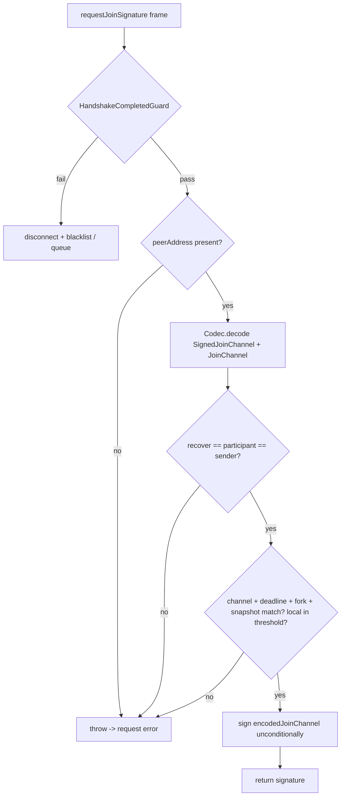

# JoinChannelService — Unanimous Off-Chain Join Authorization

> **Specification subject:** [specification/architecture/rpc.md](../../../../../specification/peer-communication/rpc.md)

> **Status:** Draft, reverse-engineered baseline. Pending engineer review.
> **Scope:** The `joinChannelService` RPC surface: the `requestJoinSignature` ingress endpoint and
> the `collectJoinChannelConfirmation` collector that drives it. This document owns the **RPC
> ingress contract and Byzantine surface** of channel admission signature collection. It does not
> restate the shared peer-RPC model ([./README.md](./README.md)) or the protocol-level admission
> flow ([../../protocol/cross-layer-messages.md](../../../../../specification/settlement/cross-layer-messages.md) §4) — it
> references them and goes deep on the service.
> **ID prefix:** `JCS` (`INV-JCS-n`, `REQ-JCS-n`).

Related: [./README.md](./README.md) (peer-RPC model: dispatch, guards, delivery modes, failure
outcomes), [../../protocol/cross-layer-messages.md](../../../../../specification/settlement/cross-layer-messages.md) §4
(join/admission as an inbound-stream consumer; REQ-MSG-10/11), §3 (spectate-before-join),
[../../open-questions.md](../../../../../specification/open-questions.md) (OQ-10, OQ-19, OQ-34, DEF-6).

---

## 1. Purpose & position in the admission flow

Joining a channel expands the on-chain participant set and requires **unanimous authorization**:
the joiner signs a `JoinChannel` and the entire current threshold set — snapshot participants ∪
pending participants — must countersign before the joiner can submit `joinChannel(...)` on-chain
([../../protocol/cross-layer-messages.md](../../../../../specification/settlement/cross-layer-messages.md) §4, REQ-MSG-10).
`joinChannelService` is the off-chain machinery that gathers those countersignatures.

The service is one half of a client/responder pair over the RPC boundary:

- **Collector side (`collectJoinChannelConfirmation`).** Run locally by the joiner. Pins the
  expected on-chain snapshot and fork, self-signs the `JoinChannel`, and fans out a
  `requestJoinSignature` request to every threshold participant, assembling a
  `JoinChannelConfirmation` (the joiner's `SignedJoinChannel` plus one threshold signature per
  participant).
- **Responder side (`requestJoinSignature` → `signJoinRequest`).** The one **public RPC endpoint**
  ([`JoinChannelRpcMethods`](../../../../../../../../src/rpc/services/joinChannel/JoinChannelRpcMethods.ts#L6)).
  Every threshold participant runs it when asked. It re-derives and cross-checks the request, then
  returns its own signature over the encoded join.

Position in the end-to-end flow (owned by the protocol doc; here for orientation only): spectate
sync (§3) → **collect signatures (this service)** → on-chain `joinChannel` submit + deposit →
off-chain inbound inclusion → forced inclusion via dispute if ignored. This service owns exactly
the "collect signatures" hop. The on-chain submission, deposit, inclusion, and force-join dispute
live in [`StateManager`](../../../../../../../../src/stateManager/StateManager.ts#L107) and the contracts, not
here.

**Observable contract.** `collectJoinChannelConfirmation(joinChannel)` returns a
`PreparedJoinChannelConfirmation` (`confirmation`, `expectedSnapshotHash`, `expectedForkId`) with
each returned signature already verified to recover to its claimed threshold participant, or
throws. `requestJoinSignature(...)` returns `{ signature }` over the exact encoded join, or throws
a request error. What it does **not** guarantee: it does not decide _whether_ a peer should be
admitted — every structurally valid request is signed (§4, the auto-sign behavior, OQ-10).

## 2. Owned state

`joinChannelService` is **stateless across calls**. It holds no per-peer maps, no in-flight set,
no admission ledger. Both methods derive everything they need from their arguments plus live reads
of chain/state-manager state at call time:

- **Reads:** `stateManager.signer` / `signerAddress`, `getChannelId()`,
  `getOnChainParticipantUnion(channelId)` (snapshot ∪ pending participants, minus none — see the
  note below), `stateChannelManagerContract.getStateSnapshot(channelId)`,
  `Clock.getBlockchainTime()`, and `profileManager.getTransportByEvmAddress(...)` for transport
  resolution.
- **Writes:** none to service or state-manager storage. The only side effect is producing
  signatures and issuing outbound RPC requests. The collector's result is handed back to the
  caller (`StateManager.joinChannel`), which owns the on-chain submission and
  [`ForceJoinStorage`](../../../../../../../../src/storage/ForceJoinStorage.ts#L3) — not this service.

Lifetime/cleanup: nothing to clean up. The service is a long-lived singleton constructed once per
`P2PManager` ([./README.md](./README.md) §6.8); each dispatch instantiates a fresh stateless
`JoinChannelRpcMethods` bound to `senderTransport`.

**Note (participant union).** `getOnChainParticipantUnion` returns snapshot ∪ pending participants
but does **not** subtract on-chain-slashed addresses, while the contract's threshold set in
`_processJoinChannel` uses `concatAddressArraysNoDuplicates(snapshotParticipants, pending)`
([`JoinChannelFacet`](../../../../../../../../contracts/V1/StateChannelDiamondProxy/JoinChannelFacet.sol#L8)).
The protocol doc describes the threshold as "minus on-chain-slashed"
([../../protocol/cross-layer-messages.md](../../../../../specification/settlement/cross-layer-messages.md) §4). **Open
question:** whether the SDK-side union and the contract-side threshold must be made identical
(including slashed-set handling) so the collector never gathers a signature set the contract then
rejects, or a missing signature it could have collected. (Divergence class: documentation debt —
verify the two derivations agree; observed in
[`StateManager.getOnChainParticipantUnion`](../../../../../../../../src/stateManager/StateManager.ts#L418) vs.
`JoinChannelFacet._processJoinChannel`.)

## 3. Algorithm per method

### 3.1 `collectJoinChannelConfirmation(joinChannel)` — collector (local)

Runs on the joiner. Not an RPC endpoint; invoked through the signer facade
([`LocalP2pSigner`](../../../../../../../../src/evm/signer/LocalP2pSigner.ts#L22) /
[`ClientP2pSigner`](../../../../../../../../src/evm/signer/ClientP2pSigner.ts#L31) → `hostRpc`, §3 of
[./README.md](./README.md)). Ordered stages
([`JoinChannelService`](../../../../../../../../src/rpc/services/joinChannel/JoinChannelService.ts#L28)):

1. **Self-authorization guard.** `joinChannel.participant` must equal the local signer address;
   else throw. The collector only ever collects for the local node's own join.
2. **Pin the target.** Read the current on-chain snapshot (`getStateSnapshot`); record
   `expectedSnapshotHash = snapshot.hash` and `expectedForkId = snapshot.forkID`. These pin the
   admission to a specific chain state — the same values the contract re-checks at submit
   (`RaceConditionSnapshotForkMismatch` / `RaceConditionJoinChannelSnapshotMismatch`).
3. **Derive the threshold set.** `getOnChainParticipantUnion(channelId)` (§2 note).
4. **Self-sign the join.** `SignatureUtils.signJoinChannel(joinChannel, signer)` produces the
   `encoded` join and the joiner's `signature`; package as `SignedJoinChannel` and Codec-encode it
   (`encodedSignedJoinChannel`) — the wire form sent to peers (bigint-safe per REQ-RPC-4).
5. **Transport preflight.** For every threshold participant that is not the local address, require
   a resolvable transport (`getTransportByEvmAddress`); else throw
   `no transport for threshold participant`. Fail-fast so a missing peer aborts before any request
   is sent.
6. **Compute per-request timeout.**
   `min(agreementTime, max(1, (deadlineTimestamp − chainTime) )) × 1000` ms — never wait past the
   join deadline, never below 1 s.
7. **Fan out and verify.** For each threshold participant, in parallel: the local address self-signs
   directly (`signMsg(encoded, signer)`); a remote participant is asked via
   `remoteRpc.joinChannelService.requestJoinSignature(encodedSignedJoinChannel,
expectedSnapshotHash, expectedForkId).request(participant, { timeoutMs })`. Each returned
   signature is recovered (`getSignerAddress(encoded, response.signature)`) and must equal the
   addressed participant; else throw `invalid signature from <participant>`.
8. **Assemble.** Return `{ confirmation: { signedJoinChannel, signatures }, expectedSnapshotHash,
expectedForkId }`.

Any single peer's failure (timeout, error, wrong signer) rejects the whole `Promise.all` and the
collection throws — admission is all-or-nothing, matching the unanimity requirement.

### 3.2 `requestJoinSignature(...)` — responder (RPC endpoint)

The adversarial ingress point. `JoinChannelRpcMethods.requestJoinSignature` forwards to
`JoinChannelService.signJoinRequest(senderTransport, encodedSignedJoinChannel,
expectedSnapshotHash, expectedForkId)`. Delivery mode: **request/response** (returns a value).
Guard: `HandshakeCompletedGuard` ([./README.md](./README.md) §5.2) — the caller's EVM identity is
proven before any method logic runs. Ordered stages (full REQ-RPC-2 chain):

1. **Sender identity present.** `transport.peerAddress` must exist; else throw. (Behind the
   handshake guard this should always hold.)
2. **Decode.** Codec-decode `encodedSignedJoinChannel` → `SignedJoinChannel`; decode its
   `encodedJoinChannel` → `JoinChannel`. Decode failure surfaces as a thrown error → request-error
   response (connection kept, §5).
3. **Signature recovery = participant = sender.** Recover the signer of `encodedJoinChannel` from
   the embedded signature. Require `signer == joinChannel.participant` **and** `peerAddress ==
joinChannel.participant`. This binds three identities: the ECDSA signer, the declared joiner,
   and the authenticated transport peer. A peer cannot collect a signature for a join it did not
   author, nor relay someone else's join.
4. **Channel match.** `joinChannel.channelId == stateManager.getChannelId()`; else throw.
5. **Deadline.** `joinChannel.deadlineTimestamp ≥ Clock.getBlockchainTime()`; else throw
   `join expired`.
6. **Fork match.** Read current on-chain snapshot; `snapshot.forkID == expectedForkId`; else throw
   `fork mismatch`.
7. **Snapshot match.** `snapshot.hash == expectedSnapshotHash`; else throw `snapshot mismatch`.
   Stages 6–7 ensure the signer only authorizes a join pinned to the same chain state it currently
   observes.
8. **Local-signer-in-threshold.** The local signer must be a member of
   `getOnChainParticipantUnion(channelId)`; else throw `local signer not in threshold`. A node that
   is not part of the threshold has no authority to countersign.
9. **Sign (the auto-sign step).** `signMsg(encodedJoinChannel, signer)` and return `{ signature }`.
   A code TODO here marks the missing admission filter:
   `// TODO: add a configurable admission filter, including optional snapshot-scoped consent.`
   Every structurally valid request that passes stages 1–8 is signed unconditionally (§4, OQ-10).

## 4. Byzantine assessment

The core of this document. Vectors classified **handled** (mechanism + code), **accepted residual**
(why tolerated), or **unhandled** (open question / defect candidate).

### 4.1 Forged / malformed join requests — handled

### 4.2 Auto-sign-any-structurally-valid-request — unhandled (OQ-10, decision pending)

**Observed fact.** Stage 9 signs unconditionally once stages 1–8 pass. There is no consent hook,
no per-peer policy, no rate of admission. Unanimity is therefore **mechanical signature collection,
not consent** ([../../protocol/cross-layer-messages.md](../../../../../specification/settlement/cross-layer-messages.md)
§4.2; OQ-10).

**Byzantine consequences — what can an attacker get signed?** The auto-sign is bounded by what
stages 1–8 admit, so precisely:

- The attacker can only get a signature over a join **where it is itself the participant/signer/
  authenticated peer** (stage 3). It cannot get a join signed for a _third party_ it does not
  control — the sender-binding forbids relaying.
- The join is pinned to the _current_ snapshot/fork (stages 6–7); the attacker cannot get a
  signature for a stale or future chain state.
- The join is confined to _this_ channel (stage 4) and must be live (stage 5).

So the auto-sign does not let an attacker mint arbitrary authorizations. Its danger is different:
**an honest threshold node cannot refuse an unwanted member.** Any peer that has completed the
handshake and is willing to deposit obtains unanimous authorization automatically — admission is
effectively permissionless up to the handshake, and the "unanimous authorization" property is
downgraded to "unanimous availability." A colluding/griefing joiner can also obtain a signature and
then _not_ submit on-chain (no obligation is created responder-side by signing), so signing is a
free favor with no accounting. Residual risk severity depends on whether the deployment intends
join to be permissioned; the protocol's own language ("participants may decline") says it should
be. **Classified: OQ-10, decision pending** — the admission-policy hook and whether a decline is
protocol-visible or indistinguishable from unavailability are both unresolved. This service is the
enforcement seat for that decision (a future admission guard per REQ-RPC-5 / [./README.md](./README.md)
§5.3, or the inline filter the TODO anticipates).

### 4.3 Replaying join signatures — accepted residual (bounded by pinning)

A signature returned by `signJoinRequest` is over the encoded join, which embeds `channelId`,
`participant`, `deadlineTimestamp`, and `balance` — but **no snapshot/fork/nonce**. The
snapshot/fork pinning lives in the _contract's_ submit path
(`RaceConditionSnapshotForkMismatch` / `...SnapshotMismatch`) and the collector's
`expectedSnapshotHash`/`expectedForkId`, not inside the signed bytes. Consequences:

- **Cross-deployment / cross-chain replay.** The signed message carries no domain separation
  ([../../open-questions.md](../../../../../specification/open-questions.md) OQ-29). A join signature is in principle
  replayable against another deployment where the same `(channelId, participant, deadline, balance)`
  is meaningful. Accepted residual **only** insofar as OQ-29 tracks domain separation globally;
  flagged here as an instance.
- **Same-channel replay.** Re-submitting the same confirmation is blocked on-chain: after inclusion
  the participant exists, so a second `joinChannel` reverts `ErrorJoinChannelParticipantAlreadyExists`
  and a `topUpBalance` path is the only re-entry. Within the deadline window, replay merely
  re-authorizes a join that already carries the joiner's own signature and `msg.sender` binding, so
  it grants the attacker nothing new. Accepted residual.

**Open question:** whether join signatures should bind snapshot/fork and a domain tag directly (so
the signed artifact is self-pinning and not replayable), coupled to OQ-29. (Divergence class:
decision pending.)

### 4.4 Racing concurrent joins — unhandled (decision pending)

**Observed fact.** Joins pin `expectedSnapshotHash`; a second join invalidates the first only once
the snapshot advances. Two simultaneous joiners each collect against the current snapshot; whichever
submits first advances the chain, and the other's pinned snapshot goes stale → its on-chain submit
reverts `RaceCondition*` and `StateManager.joinChannel` aborts
([`StateManager`](../../../../../../../../src/stateManager/StateManager.ts#L107), lines ~512-528; SDK TODO:
"support concurrent joins by collecting safe extra signatures before submission"). At the RPC layer,
a responder signing two concurrent requests is not itself a fault — it signs both; the contention is
resolved on-chain. Consequence: concurrent admissions are serialized by chain races, not
coordinated; honest concurrent joiners can waste a full signature-collection round.
**Classified: OQ-10 (concurrent-join semantics undefined), decision pending.**

### 4.5 Probing via penalty-free request errors — unhandled (OQ-34, decision pending)

**Observed fact.** A `requestJoinSignature` that fails validation throws, and the request path
returns `{ok: false, error}` with the **connection kept, no blacklist** ([./README.md](./README.md)
§6.4/§8). A peer can therefore invoke this endpoint repeatedly with invalid payloads at zero cost —
free probing of a guarded request endpoint. The error strings are descriptive
(`fork mismatch`, `snapshot mismatch`, `join expired`, `local signer not in threshold`), which also
leaks the responder's view of chain state and threshold membership to any handshake-completed peer.

This is the join-side instance of OQ-34's failure-outcome-policy inconsistency: join-signature abuse
is penalty-free while an unprovable spectate request is an immediate permanent blacklist
([./spectate.md](./spectate.md) §4). Each choice is individually defensible — an honest joiner can
race a stale snapshot and legitimately get `snapshot mismatch` — but the intended per-class policy
is unstated. **Classified: OQ-34, decision pending.** Mitigation depends on the future central rate
limiter (OQ-6): unbounded invalid requests each run chain reads (`getStateSnapshot`,
`getOnChainParticipantUnion`), so this endpoint carries real per-request cost (§4.7).

### 4.6 Deadline / top-up abuse — accepted residual + open question

- **Free deadline choice.** The joiner picks `deadlineTimestamp` freely; the contract only checks
  `deadline ≥ block.timestamp` at submit, and `signJoinRequest` only checks `deadline ≥ chainTime`
  at sign. There is no bound tying the deadline to protocol windows. A far-future deadline keeps a
  collected authorization valid for a long time. Accepted residual today. **Open question (OQ-10):**
  required deadline bounds. (Divergence class: decision pending.)
- **Top-up path.** `topUpBalance` reuses the same confirmation shape and the same
  `signJoinRequest` responder (the RPC endpoint does not distinguish join vs. top-up — the
  `isTopUp` branch is contract-side). A signature collected "for a join" is equally valid for a
  top-up submit and vice versa, since the signed bytes are identical. The contract enforces the
  existing-participant precondition for top-up and the not-already-participant precondition for
  join, so misuse reverts on-chain rather than corrupting state. Accepted residual; noted because
  the RPC endpoint is shared and unaware of the intent.

### 4.7 Resource cost per request — unhandled (OQ-6)

Each `requestJoinSignature` performs at least two chain/provider reads (`getStateSnapshot`,
`getOnChainParticipantUnion` = two contract calls) plus a Codec decode and an ECDSA recover, then a
sign. None is bounded per peer. Combined with §4.5 (penalty-free errors), a peer can drive
unbounded provider load. **Classified: OQ-6** — the intended single central RPC-level rate limiter
([./README.md](./README.md) §9) is the designated fix; not implemented. (Divergence class: missing.)

### 4.8 Information disclosure / access control

There is no access control on _who_ may request a join signature beyond `HandshakeCompletedGuard`:
any handshake-completed peer may call it. Because it signs only for the caller's own participant
identity (§4.2), it does not disclose other participants' authorizations. It does leak, via error
strings, the responder's current snapshot/fork/threshold view (§4.5). No separate participant-vs-
outsider authorization guard exists — REQ-RPC-5 / [./README.md](./README.md) §5.3 names this as the
future guard-library work.

## 5. Failure outcomes

Per method, consistent with the model doc's outcome table ([./README.md](./README.md) §8).

| Method / stage                                    | Failure                                            | Consequence                                                                                 |
| ------------------------------------------------- | -------------------------------------------------- | ------------------------------------------------------------------------------------------- |
| `requestJoinSignature` (any validation stage 1–8) | throw                                              | Request-error response `{ok:false,error}`; **connection kept, no blacklist** (§8, join row) |
| `requestJoinSignature`                            | undecodable payload (stage 2)                      | throw → request error; connection kept                                                      |
| `requestJoinSignature`                            | guard failure (unverified transport)               | Disconnect + blacklist (+ error if request) — `HandshakeCompletedGuard`                     |
| `collectJoinChannelConfirmation`                  | participant ≠ local signer                         | throw locally (no RPC issued)                                                               |
| `collectJoinChannelConfirmation`                  | missing transport for a threshold participant      | throw locally, fail-fast (no partial fan-out completes the join)                            |
| `collectJoinChannelConfirmation`                  | any peer times out / errors / returns wrong signer | whole `Promise.all` rejects → collection throws                                             |

No mismatch with the model table identified: the join row is "Request error only; connection kept,"
which matches every responder-side failure above. The **policy** question of whether that is the
right consequence is OQ-34 (§4.5), not a table mismatch.

## 6. Invariants

| ID        | Invariant                                                                                                                                                                                                           |
| --------- | ------------------------------------------------------------------------------------------------------------------------------------------------------------------------------------------------------------------- |
| INV-JCS-1 | A responder signs a join only if the ECDSA signer, the declared `participant`, and the authenticated transport peer are the same address (`signJoinRequest` stage 3).                                               |
| INV-JCS-2 | A responder signs only a join pinned to its own current on-chain snapshot and fork (`expectedForkId`/`expectedSnapshotHash` equality, stages 6–7) and only when the local signer is in the threshold set (stage 8). |
| INV-JCS-3 | The collector accepts a returned signature only if it recovers to the addressed threshold participant; one mismatched or missing signature fails the entire collection (unanimity).                                 |
| INV-JCS-4 | The collector only ever collects for the local node's own participant identity (stage 1).                                                                                                                           |
| INV-JCS-5 | `joinChannelService` holds no state between calls; every decision is derived from arguments plus live chain/state-manager reads at call time.                                                                       |

## 7. Verification

Concrete test evidence is owned by the downstream verification layer. This section defines implementation-specific obligations only.

### Implementation test plan

These are concrete component-level tests required by the implementation obligations in this document. Exercise public boundaries with real domain values and collaborators. Every listed permutation is required unless an engineer records why it is not applicable.

| Plan item      | Requirement / invariant | Setup and stimulus                                                                                                      | Expected result                                                                                                                                          | Required permutations                                                                                                                                                                                                                                                                                                                                                                                                                                                                                                                                                                                                                                                                                                                                                                                                                                                                                                                                                                                                                                                                                                                                                                                                                                                                                                                                                                                                                                                                                                                                                                                                                                                                                               |
| -------------- | ----------------------- | ----------------------------------------------------------------------------------------------------------------------- | -------------------------------------------------------------------------------------------------------------------------------------------------------- | ------------------------------------------------------------------------------------------------------------------------------------------------------------------------------------------------------------------------------------------------------------------------------------------------------------------------------------------------------------------------------------------------------------------------------------------------------------------------------------------------------------------------------------------------------------------------------------------------------------------------------------------------------------------------------------------------------------------------------------------------------------------------------------------------------------------------------------------------------------------------------------------------------------------------------------------------------------------------------------------------------------------------------------------------------------------------------------------------------------------------------------------------------------------------------------------------------------------------------------------------------------------------------------------------------------------------------------------------------------------------------------------------------------------------------------------------------------------------------------------------------------------------------------------------------------------------------------------------------------------------------------------------------------------------------------------------------------------- |
| `INV-JCS-1.T1` | `INV-JCS-1`             | Exercise the real public component or contract boundary, including rejection and failure paths without partial effects. | Responder signs only when signer == participant == authenticated peer.                                                                                   | `INV-JCS-1.T1.P1` — valid case `INV-JCS-1.T1.P2` — correct identity/signature `INV-JCS-1.T1.P3` — direct invalid/opposite `INV-JCS-1.T1.P4` — wrong identity/signature `INV-JCS-1.T1.P5` — missing identity/signature `INV-JCS-1.T1.P6` — duplicate identity/signature `INV-JCS-1.T1.P7` — forged identity/signature `INV-JCS-1.T1.P8` — membership boundary                                                                                                                                                                                                                                                                                                                                                                                                                                                                                                                                                                                                                                                                                                                                                                                                                                                                                                                                                                                                                                                                                                   |
| `INV-JCS-2.T1` | `INV-JCS-2`             | Exercise the real public component or contract boundary, including rejection and failure paths without partial effects. | Responder signs only a join pinned to its current snapshot/fork with local signer in threshold.                                                          | `INV-JCS-2.T1.P1` — valid case `INV-JCS-2.T1.P2` — matching commitment `INV-JCS-2.T1.P3` — correct identity/signature `INV-JCS-2.T1.P4` — new participant `INV-JCS-2.T1.P5` — direct invalid/opposite `INV-JCS-2.T1.P6` — mismatched commitment `INV-JCS-2.T1.P7` — predecessor case `INV-JCS-2.T1.P8` — genesis case `INV-JCS-2.T1.P9` — stale fork `INV-JCS-2.T1.P10` — foreign fork `INV-JCS-2.T1.P11` — wrong identity/signature `INV-JCS-2.T1.P12` — missing identity/signature `INV-JCS-2.T1.P13` — duplicate identity/signature `INV-JCS-2.T1.P14` — forged identity/signature `INV-JCS-2.T1.P15` — membership boundary `INV-JCS-2.T1.P16` — existing participant `INV-JCS-2.T1.P17` — removed participant `INV-JCS-2.T1.P18` — slashed participant `INV-JCS-2.T1.P19` — concurrent membership change                                                                                                                                                                                                                                                                                    |
| `INV-JCS-3.T1` | `INV-JCS-3`             | Exercise the real public component or contract boundary, including rejection and failure paths without partial effects. | Collector requires each signature to recover to its addressed participant; one failure fails unanimity.                                                  | `INV-JCS-3.T1.P1` — valid case `INV-JCS-3.T1.P2` — correct identity/signature `INV-JCS-3.T1.P3` — malformed input `INV-JCS-3.T1.P4` — direct invalid/opposite `INV-JCS-3.T1.P5` — wrong identity/signature `INV-JCS-3.T1.P6` — missing identity/signature `INV-JCS-3.T1.P7` — duplicate identity/signature `INV-JCS-3.T1.P8` — forged identity/signature `INV-JCS-3.T1.P9` — membership boundary `INV-JCS-3.T1.P10` — adversarial input `INV-JCS-3.T1.P11` — partial failure `INV-JCS-3.T1.P12` — retry and recovery                                                                                                                                                                                                                                                                                                                                                                                                                                                                                                                                                                                                                                                                                                                                                                                                            |
| `INV-JCS-4.T1` | `INV-JCS-4`             | Exercise the real public component or contract boundary, including rejection and failure paths without partial effects. | Collector runs only for the local node's own participant identity.                                                                                       | `INV-JCS-4.T1.P1` — valid case `INV-JCS-4.T1.P2` — correct identity/signature `INV-JCS-4.T1.P3` — direct invalid/opposite `INV-JCS-4.T1.P4` — wrong identity/signature `INV-JCS-4.T1.P5` — missing identity/signature `INV-JCS-4.T1.P6` — duplicate identity/signature `INV-JCS-4.T1.P7` — forged identity/signature `INV-JCS-4.T1.P8` — membership boundary                                                                                                                                                                                                                                                                                                                                                                                                                                                                                                                                                                                                                                                                                                                                                                                                                                                                                                                                                                                                                                                                                                   |
| `INV-JCS-5.T1` | `INV-JCS-5`             | Exercise the real public component or contract boundary, including rejection and failure paths without partial effects. | Service is stateless across calls; decisions from args + live reads.                                                                                     | `INV-JCS-5.T1.P1` — valid case `INV-JCS-5.T1.P2` — zero/empty/no-op where meaningful `INV-JCS-5.T1.P3` — direct invalid/opposite `INV-JCS-5.T1.P4` — exact boundary `INV-JCS-5.T1.P5` — failure/recovery `INV-JCS-5.T1.P6` — relevant race                                                                                                                                                                                                                                                                                                                                                                                                                                                                                                                                                                                                                                                                                                                                                                                                                                                                                                                                                                                                                                                                                                                                                                                                                                                                                   |
| `REQ-JCS-1.T1` | `REQ-JCS-1`             | Exercise the real public component or contract boundary, including rejection and failure paths without partial effects. | `requestJoinSignature` MUST run the full decode + identity + channel + deadline + fork + snapshot + threshold chain before signing (REQ-RPC-2 instance). | `REQ-JCS-1.T1.P1` — valid case `REQ-JCS-1.T1.P2` — matching commitment `REQ-JCS-1.T1.P3` — correct identity/signature `REQ-JCS-1.T1.P4` — before deadline `REQ-JCS-1.T1.P5` — new participant `REQ-JCS-1.T1.P6` — direct invalid/opposite `REQ-JCS-1.T1.P7` — mismatched commitment `REQ-JCS-1.T1.P8` — predecessor case `REQ-JCS-1.T1.P9` — genesis case `REQ-JCS-1.T1.P10` — stale fork `REQ-JCS-1.T1.P11` — foreign fork `REQ-JCS-1.T1.P12` — wrong identity/signature `REQ-JCS-1.T1.P13` — missing identity/signature `REQ-JCS-1.T1.P14` — duplicate identity/signature `REQ-JCS-1.T1.P15` — forged identity/signature `REQ-JCS-1.T1.P16` — membership boundary `REQ-JCS-1.T1.P17` — at deadline `REQ-JCS-1.T1.P18` — after deadline `REQ-JCS-1.T1.P19` — maximum honest skew `REQ-JCS-1.T1.P20` — existing participant `REQ-JCS-1.T1.P21` — removed participant `REQ-JCS-1.T1.P22` — slashed participant `REQ-JCS-1.T1.P23` — concurrent membership change |
| `REQ-JCS-2.T1` | `REQ-JCS-2`             | Exercise the real public component or contract boundary, including rejection and failure paths without partial effects. | Admission MUST be gated by an explicit consent/authorization decision, not auto-sign.                                                                    | `REQ-JCS-2.T1.P1` — valid case `REQ-JCS-2.T1.P2` — correct identity/signature `REQ-JCS-2.T1.P3` — direct invalid/opposite `REQ-JCS-2.T1.P4` — wrong identity/signature `REQ-JCS-2.T1.P5` — missing identity/signature `REQ-JCS-2.T1.P6` — duplicate identity/signature `REQ-JCS-2.T1.P7` — forged identity/signature `REQ-JCS-2.T1.P8` — membership boundary                                                                                                                                                                                                                                                                                                                                                                                                                                                                                                                                                                                                                                                                                                                                                                                                                                                                                                                                                                                                                                                                                                   |
| `REQ-JCS-3.T1` | `REQ-JCS-3`             | Exercise the real public component or contract boundary, including rejection and failure paths without partial effects. | `requestJoinSignature` failure outcomes MUST conform to a decided failure-outcome policy and be resource-bounded per peer.                               | `REQ-JCS-3.T1.P1` — valid case `REQ-JCS-3.T1.P2` — correct identity/signature `REQ-JCS-3.T1.P3` — new participant `REQ-JCS-3.T1.P4` — malformed input `REQ-JCS-3.T1.P5` — direct invalid/opposite `REQ-JCS-3.T1.P6` — wrong identity/signature `REQ-JCS-3.T1.P7` — missing identity/signature `REQ-JCS-3.T1.P8` — duplicate identity/signature `REQ-JCS-3.T1.P9` — forged identity/signature `REQ-JCS-3.T1.P10` — membership boundary `REQ-JCS-3.T1.P11` — existing participant `REQ-JCS-3.T1.P12` — removed participant `REQ-JCS-3.T1.P13` — slashed participant `REQ-JCS-3.T1.P14` — concurrent membership change `REQ-JCS-3.T1.P15` — adversarial input `REQ-JCS-3.T1.P16` — partial failure `REQ-JCS-3.T1.P17` — retry and recovery                                                                                                                                                                                                                                                                                                                                                                                                                         |

## 8. Future Work

_Non-normative._

- Admission-policy hook / consent filter for `signJoinRequest` — the code TODO and OQ-10; likely a
  participant-admission guard per REQ-RPC-5.
- Bind snapshot/fork and a domain tag into the signed join artifact so authorizations are
  self-pinning and non-replayable (couples to OQ-29).
- Deadline bounds tied to protocol windows (OQ-10).
- Concurrent-join coordination: collect safe extra signatures before submission (SDK TODO, OQ-10).
- Reconcile the join-signature failure outcome with a uniform failure-outcome policy (OQ-34) and the
  central RPC rate limiter (OQ-6), given the per-request chain-read cost.
- Verify SDK participant-union derivation matches the contract threshold set including slashed-set
  handling (§2).

## Implementation traceability

| Requirement / invariant | Statement                                                                                                                                                | Implementation status | Implementation evidence                                                                                                                                                                                                          | Gap / divergence                                                           |
| ----------------------- | -------------------------------------------------------------------------------------------------------------------------------------------------------- | --------------------- | -------------------------------------------------------------------------------------------------------------------------------------------------------------------------------------------------------------------------------- | -------------------------------------------------------------------------- |
| `INV-JCS-1`             | Responder signs only when signer == participant == authenticated peer.                                                                                   | Covered               | [JoinChannelService.signJoinRequest](../../../../../../../../src/rpc/services/joinChannel/JoinChannelService.ts#L137)                                                                                                            | None.                                                                      |
| `INV-JCS-2`             | Responder signs only a join pinned to its current snapshot/fork with local signer in threshold.                                                          | Covered               | [JoinChannelService.signJoinRequest](../../../../../../../../src/rpc/services/joinChannel/JoinChannelService.ts#L137); [JoinChannelFacet](../../../../../../../../contracts/V1/StateChannelDiamondProxy/JoinChannelFacet.sol#L8) | None.                                                                      |
| `INV-JCS-3`             | Collector requires each signature to recover to its addressed participant; one failure fails unanimity.                                                  | Covered               | [JoinChannelService.collectJoinChannelConfirmation](../../../../../../../../src/rpc/services/joinChannel/JoinChannelService.ts#L43)                                                                                              | None.                                                                      |
| `INV-JCS-4`             | Collector runs only for the local node's own participant identity.                                                                                       | Covered               | [JoinChannelService.collectJoinChannelConfirmation](../../../../../../../../src/rpc/services/joinChannel/JoinChannelService.ts#L43)                                                                                              | None.                                                                      |
| `INV-JCS-5`             | Service is stateless across calls; decisions from args + live reads.                                                                                     | Covered               | [JoinChannelService](../../../../../../../../src/rpc/services/joinChannel/JoinChannelService.ts#L28)                                                                                                                             | None.                                                                      |
| `REQ-JCS-1`             | `requestJoinSignature` MUST run the full decode + identity + channel + deadline + fork + snapshot + threshold chain before signing (REQ-RPC-2 instance). | Covered               | [JoinChannelService.signJoinRequest](../../../../../../../../src/rpc/services/joinChannel/JoinChannelService.ts#L137)                                                                                                            | None.                                                                      |
| `REQ-JCS-2`             | Admission MUST be gated by an explicit consent/authorization decision, not auto-sign.                                                                    | Missing               | none — not implemented (code TODO; [OQ-10](../../../../../specification/open-questions.md))                                                                                                                                      | Engineer audit pending; any divergence named in the evidence remains open. |
| `REQ-JCS-3`             | `requestJoinSignature` failure outcomes MUST conform to a decided failure-outcome policy and be resource-bounded per peer.                               | Partial               | penalty-free error today ([./README.md](./README.md) §8); no rate limit                                                                                                                                                          | Partial or divergent — divergence detail pending re-audit.                 |
