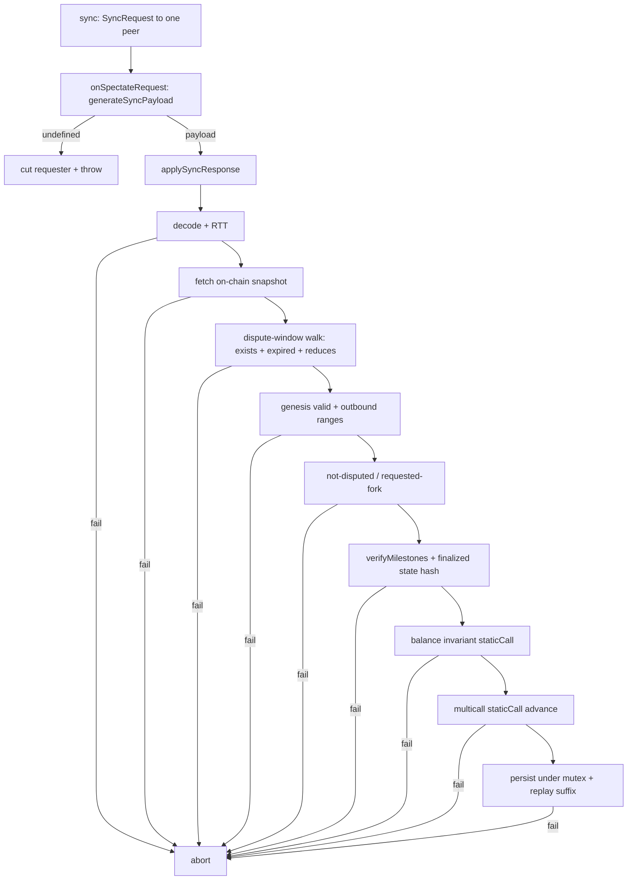

# SpectateService — Trustless Pre-Commit State Synchronization

> **Specification subject:** [specification/architecture/rpc.md](../../../../../specification/peer-communication/rpc.md)

> **Status:** Draft, reverse-engineered baseline. Pending engineer review.
> **Scope:** The `spectateService` RPC surface: the `onSpectateRequest` responder endpoint, the
> `sync` / `applySyncResponse` requester path, and the proof-generation
> (`generateSyncPayload`) / proof-verification machinery. This document owns the **RPC ingress
> contract and Byzantine surface** of spectate synchronization. It references the shared peer-RPC
> model ([./README.md](./README.md)) and the protocol-level spectate flow
> ([../../protocol/cross-layer-messages.md](../../../../../specification/settlement/cross-layer-messages.md) §3) rather than
> restating them.
> **ID prefix:** `SPC` (`INV-SPC-n`, `REQ-SPC-n`).

Related: [./README.md](./README.md) (dispatch, guards, delivery modes, failure outcomes,
one-in-flight-per-peer replay rule), [../../protocol/cross-layer-messages.md](../../../../../specification/settlement/cross-layer-messages.md)
§3 (spectate-before-join, the enumerated abort conditions REQ-MSG-9), §6 (the channel-balance
invariant INV-MSG-6), [../../open-questions.md](../../../../../specification/open-questions.md) (OQ-6, OQ-10, OQ-19, DEF-5).

---

## 1. Purpose & position in the sync flow

Spectating is a **pre-commit synchronization mode, not an on-chain transaction**
([../../protocol/cross-layer-messages.md](../../../../../specification/settlement/cross-layer-messages.md) §3.1). A
prospective participant (or any observer, or a participant recovering) queries chain data, asks a
channel peer to prove the channel's latest provable state, verifies that proof against the on-chain
source of truth, and replicates state — all without committing funds or incurring any channel
obligation (REQ-MSG-9). It is the mandatory first step before joining
([./join-channel.md](./join-channel.md) §1).

`spectateService` is a **mutual-cooperation** request/response pair over the RPC boundary:

- **Requester side (`sync` → `applySyncResponse`).** Fire-and-forget local entry point. Sends one
  `SyncRequest` to one peer, then verifies the returned `SyncPayload` end-to-end and either
  persists the proven state or aborts.
- **Responder side (`onSpectateRequest` → `generateSyncPayload`).** The one **public RPC endpoint**
  ([`SpectateRpcMethods`](../../../../../../../../src/rpc/services/spectate/SpectateRpcMethods.ts#L1)). Generates
  a proof of the latest provable snapshot for the requested `(channel, fork?, height?)` and returns
  it encoded; if it cannot prove the target it cuts the requester.

The **mutual-cooperation rule**: a sync request must be answerable with a valid proof. A responder
that cannot prove the requested target treats the request as misbehavior and blacklists the
requester; a requester whose request is rejected (or whose returned payload fails verification)
blacklists the responder. Both sides can therefore cut each other — the asymmetry of that rule is
the source of DEF-5 (§4.3).

Two trigger sites drive `sync` (both loopback, [./README.md](./README.md) §2.4/§3):
post-handshake sync against a participant peer
([`InitHandshakeService`](../../../../../../../../src/rpc/services/initHandshake/InitHandshakeService.ts#L29),
when the local node is in `OPENED` status and the peer is a dispute-eligible participant), and the
block queue's `requestSync` when a queued block cannot be linked
([`BlockQueueManager`](../../../../../../../../src/stateManager/BlockQueueManager.ts#L31)), which pins the
block's `forkId` and `height`.

**Observable contract.** A successful `sync` teleports local state to the peer's latest provable
finalized snapshot and replays the unfinalized suffix through the standard block-confirmation
pipeline under
[`SpectatingValidationStrategy`](../../../../../../../../src/stateManager/validationStrategy/SpectatingValidationStrategy.ts#L21).
Any failure aborts (§3.4) with nothing at risk. What it does **not** guarantee: liveness — a
responder may honestly be unable to prove the target, or maliciously withhold (§4.3).

## 2. Owned state

`spectateService` owns exactly one piece of mutable state:

- **`inFlightByPeerAddress: Set<string>`** — normalized (checksum) peer addresses with a sync
  request currently in flight. Written by `sync` (add before dispatch, delete in `finally`); read
  by `sync` to reject a second concurrent sync to the same peer. This is the endpoint's replay/
  concurrency control (REQ-RPC-6 / [./README.md](./README.md) §6.7): **one in-flight sync per peer**.
  Lifetime is a single sync round; cleanup is guaranteed by the `finally` block even on throw.

The `SyncRequest` payload itself is **not** stored in a per-peer map — it lives in the `sync`
closure and is passed into `applySyncResponse`, so the channel/fork/height a payload is validated
against always come from the requester's own request, never the peer's echo (this is why the old
channel-binding check is moot; see the code comment on `applySyncResponse`).

Everything else the service reads/writes goes through `stateManager` (storage, local EVM /
`localDiamondContract`, `agreementManager`, `reductionManager`, `eventSyncService`) and the
on-chain `stateChannelManagerContract`. Persistence of a verified payload
(`persistSyncPayload`) happens **under the state-manager mutex** and only after all verification
succeeds (§3.3) — the RPC layer itself holds no mutex (INV-RPC-5, [./README.md](./README.md) §6.6).
The service is a long-lived singleton; RpcMethods instances are per-dispatch and stateless.

## 3. Algorithm per method

### 3.1 `onSpectateRequest(syncRequest)` — responder (RPC endpoint)

Delivery: request/response. Guard: `HandshakeCompletedGuard`. Ordered stages
([`SpectateRpcMethods`](../../../../../../../../src/rpc/services/spectate/SpectateRpcMethods.ts#L1) +
[`SpectateService.generateSyncPayload`](../../../../../../../../src/rpc/services/spectate/SpectateService.ts#L448)):

1. **Sender identity present.** `senderTransport.peerAddress` must exist; else disconnect +
   blacklist the transport and throw. (Behind the guard this should hold.)
2. **Generate proof.** `generateSyncPayload(channelId, forkId?, blockHeight?)`:
    - Reject malformed heights up front (`!Number.isSafeInteger || < 0`) → return `undefined`
      _before any chain read_, so a bad height cannot walk dispute windows and hang the event loop.
    - Resolve the target fork (requested `forkId` or local tip). Read the current on-chain snapshot.
    - Walk the local dispute-window chain from the on-chain fork to the derived tip fork, recovering
      any committed-but-unprocessed disputes first
      (`eventSyncService.loadSynchronizedWindowCommitments` /
      `isForkDisputedOnChain`), computing each reduction locally. Each hop becomes a
      `DisputeWindowVerification`.
    - If the derived tip fork ≠ the requested fork, return `undefined` (cannot prove it).
    - Collect the tip fork's genesis snapshot + encoded state, the outbound message-block range from
      the on-chain tip to that genesis, the `StateProof` (milestones + trailing signed blocks) for
      the target height, the milestone snapshots, the latest finalized encoded state, and the
      outbound range from genesis to latest finalized snapshot. Reject an above-latest requested
      height → `undefined` (never silently downgraded to a different height); a requested height of 0
      is pinned via `??`, not treated as falsy.
    - Assemble the `SyncPayload` ([`src/types/spectate.ts`](../../../../../../../../src/types/spectate.ts#L1)).
3. **Cut on unprovable.** If `generateSyncPayload` returned `undefined`, disconnect + blacklist the
   requester and throw `no sync payload to prove` — the mutual-cooperation rule (§1). Otherwise
   return `{ encodedSyncPayload: Codec.encode(payload, Type.SyncPayload) }`.

**What is proven in a served snapshot + suffix.** The payload is a self-contained chain of evidence
from the on-chain snapshot to a claimed latest finalized state: (a) the reduced dispute-window chain
(disputes + reduction inputs) proving each fork transition; (b) the tip fork's genesis snapshot and
its encoded state; (c) a `StateProof` (milestone finality anchors + trailing signed suffix); (d) the
outbound message-block ranges linking on-chain tip → fork genesis → latest finalized snapshot. None
of it is trusted on receipt — the responder cannot forge it past §3.3 because every piece is checked
against the requester's own on-chain reads and contract logic.

### 3.2 `sync(peerAddress, channelId, forkId?, blockHeight?)` — requester entry

Fire-and-forget ([./README.md](./README.md) §2.4). Ordered stages:

1. Normalize the peer address; if already in `inFlightByPeerAddress`, ignore (one-in-flight rule).
2. Build the `SyncRequest` (`channelId`, `initTime = now`, optional `forkId`/`blockHeight`); add
   the peer to the in-flight set; timeout = `agreementTime × 1000` ms.
3. In a background async task: `onSpectateRequest(syncRequest).request(peerAddress, {timeoutMs})`,
   then `applySyncResponse(peerAddress, syncRequest, encodedSyncPayload)`.
4. On any thrown error from the request path — timeout, transport error, or the responder cutting
   us — `disconnectAndBlacklistPeerByEvmAddress(peerAddress)` (the DEF-5 over-broad blacklist, §4.3).
5. `finally`: remove the peer from the in-flight set.

### 3.3 `applySyncResponse(...)` — requester verification & persist

The requester-side verification chain — what re-establishes trust before any state effect. Runs
inside a `try/catch`; any throw or explicit `abort` ends the sync. Ordered stages (matching the
enumerated abort conditions in
[../../protocol/cross-layer-messages.md](../../../../../specification/settlement/cross-layer-messages.md) §3.2):

1. **Decode inside try.** `Codec.decode(encodedSyncPayload, SyncPayload)`; a decode throw becomes a
   handled abort, never an unhandled rejection (REQ-RPC-2).
2. **RTT bound.** `now − initTime ≤ agreementTime`; else abort.
3. **Fetch on-chain truth.** `fetchAndPersistOnChainSnapshot(channelId)` syncs the local EVM to the
   real on-chain snapshot — the anchor everything is checked against.
4. **Dispute-window walk.** Fetch/persist the claimed dispute windows; for each: it must exist
   on-chain and its kill period be expired (`isKillPeriodExpired`); reduce it locally if not already
   reduced, aborting if **more than one** window needs reducing; verify each reduces to the payload's
   claimed successor fork. `finalForkId` walks forward.
5. **Genesis validity.** The tip fork's genesis must satisfy: `finalForkId == payload genesis forkId`,
   `isGenesisSnapshotWithoutTimeCheck`, and `stateMachineStateHash == hash(encoded genesis state)`.
6. **Stale-proof short-circuit.** If the on-chain snapshot is on the same fork but already past the
   proved height, abort (nothing to teleport to).
7. **Outbound range #1.** `verifyOutboundMessageBlocks` from on-chain tip → fork genesis.
8. **Disputed / requested-fork check.** Latest mode (no requested fork): the tip fork must **not** be
   disputed on-chain (`getDisputeWindowCreationTimestamp == 0`). Pinned mode: `finalForkId ==
requested forkId`.
9. **Milestone proof.** `verifyMilestones.staticCall(...)` proves the state proof; latest finalized
   state hash must match `hash(latestFinalizedEncodedState)`.
10. **Outbound range #2.** `verifyOutboundMessageBlocks` from fork genesis → latest finalized
    snapshot.
11. **Channel-balance invariant.** `verifyBalanceInvariantCheckSnapshot.staticCall(...)` on the
    latest finalized snapshot (INV-MSG-6 / §6 of the protocol doc); abort on failure. This is the
    check that stops an economically unsound (undercollateralized) but internally consistent
    snapshot — §4.1.
12. **Simulated advance.** `tryMulticallSnapshotUpdate` `staticCall`s the pending
    `reduceAndFinalize` + `updateStateSnapshotFork` + `updateStateSnapshotSameFork` multicall; a
    revert aborts. Proves the teleport would actually succeed on-chain without sending a tx.
13. **Persist.** `persistSyncPayload` under the state-manager mutex: skipped if local storage is
    already ahead; aborts on any finalized-block conflict with local storage; otherwise stores
    disputes, snapshots, states, inbound/outbound blocks and sets latest state.
14. **Replay suffix.** Feed the unfinalized block confirmations from the state proof through
    `stateManager.onBlockConfirmationStruct` (the standard pipeline under
    `SpectatingValidationStrategy`); any failure aborts.
15. **Pinned-height check.** In pinned mode, the proof's latest block must reach the requested
    height; else abort.

### 3.4 `abort(peerAddress)` — fail-closed semantics

[`SpectateService.abort`](../../../../../../../../src/rpc/services/spectate/SpectateService.ts#L97): if the node
is **not** `PARTICIPATING`/`PENDING_PARTICIPANT` (i.e. a fresh spectator), the whole state manager
aborts — a full local stop with no residue. If it is already a participant using spectate-sync for
recovery, only the offending peer is disconnected + blacklisted. This is the fail-closed split of
REQ-MSG-9 ([../../protocol/cross-layer-messages.md](../../../../../specification/settlement/cross-layer-messages.md) §3.2).

## 4. Byzantine assessment

The core of this document. Classification: **handled** / **accepted residual** / **unhandled**.

### 4.1 Serving a poisoned snapshot — handled (the whole point of §3.3)

**Threat.** A Byzantine responder returns a `SyncPayload` claiming a false latest state — inflated
balances, a fork it did not actually reach, a finalized state the participants never signed, or an
undercollateralized snapshot designed to lure the spectator into depositing.

**What stops it.** The requester re-verifies every claim against the on-chain source of truth and
contract logic, trusting nothing in the payload (§3.3):

- A forged fork transition fails the dispute-window walk (must exist on-chain, kill period expired,
  locally recomputed reduction must match the claimed successor — steps 4).
- A forged finality claim fails `verifyMilestones` (step 9) and the finalized-state-hash check.
- A forged outbound history fails `verifyOutboundMessageBlocks` (steps 7, 10).
- A snapshot whose in-channel balances exceed deposits minus withdrawals fails
  `verifyBalanceInvariantCheckSnapshot` (step 11, INV-MSG-6) — this is the specific defense against
  the collusion-undercollateralization attack in
  [../../protocol/cross-layer-messages.md](../../../../../specification/settlement/cross-layer-messages.md) §6.1 and
  [../../open-questions.md](../../../../../specification/open-questions.md) OQ-19: even a _unanimous_ colluding participant
  set cannot get a newcomer to trust an unbacked snapshot, because agreement is not economic
  soundness and the invariant is checked against chain-anchored deposits/withdrawals.
- A claim that would not actually apply on-chain fails the `multicall` `staticCall` (step 12).
- A finalized block conflicting with local storage aborts persistence (step 13).

**Residual — OQ-19 dependency.** The balance-invariant check is trustworthy here _only because_ the
spectator runs it client-side against chain data. It is **not** enforced on on-chain snapshot update
([../../protocol/cross-layer-messages.md](../../../../../specification/settlement/cross-layer-messages.md) §2.3/§6.3, OQ-19):
the on-chain snapshot can be poisonous-but-detectable. A spectator that _skips_ spectating (e.g. a
future direct-join path) would have no protection. Accepted residual, tracked by OQ-19; not a defect
of this service, which does run the check.

### 4.2 Unprovable-request blacklisting as griefing — unhandled (defect candidate)

**Observed fact.** `onSpectateRequest` disconnects + blacklists the requester whenever
`generateSyncPayload` returns `undefined` (§3.1 step 3). But `generateSyncPayload` returns
`undefined` for **honest** reasons too: the responder simply cannot prove the requested fork/height
because _its own_ local state has not caught up (e.g. it has not processed the dispute window the
requester pins, or the requested tip is newer than the responder knows). The mutual-cooperation
rationale in the code ("a sync requester only ever asks peers expected to prove the target") assumes
the requester's targeting is always correct — but the block-queue trigger pins a _block's_ fork and
height from a block the requester received from _other_ peers, so a lagging (honest) responder that
was not the block's supplier can be asked to prove a target it legitimately lacks.

**Consequence.** A griefer can drive honest spectators to blacklist honest responders, or an honest
lagging responder blacklists an honest requester — both permanent (by EVM address, survives churn).
This is the responder-side mirror of DEF-5 (§4.3): unavailability is conflated with Byzantine
behavior. **Classified: defect candidate, decision pending** — the same fault taxonomy DEF-5
addresses (separate invalid-evidence from can't-prove-yet before permanent exclusion) applies to the
responder direction. **Open question:** should an "I cannot prove this yet" response be a distinct,
penalty-free outcome (retry later) rather than an immediate blacklist? (Divergence class: decision
pending; related to DEF-5, [../../open-questions.md](../../../../../specification/open-questions.md).)

### 4.3 Withholding — unhandled (DEF-5, over-broad blacklist)

**Observed fact.** `sync` blacklists the responder on **any** failure of the request path — RPC
timeout, transport error, _or_ the responder cutting us (§3.2 step 4). This conflates:

- **Honest-unavailable:** the responder is offline, slow, or genuinely cannot prove the target yet.
- **Malicious-withholding:** the responder deliberately refuses to help sync.

Both produce a permanent blacklist of the responder by EVM address. **Classified: DEF-5** — the
canonical known defect ([../../open-questions.md](../../../../../specification/open-questions.md) DEF-5 / OQ-10 addendum):
separate invalid-evidence from transport/availability failure before permanent exclusion. Not
re-litigated here; this service is where the fix lands (distinguish payload-invalid abort, which is
Byzantine evidence, from request-path timeout/refusal, which is not). Payload-_validation_ failures
(`applySyncResponse` abort) are already handled by `abort` itself, so the over-broad blacklist in
the `catch` is specifically the request-path conflation.

### 4.4 Flooding expensive proof-serving requests — unhandled (OQ-6)

**Observed fact.** `onSpectateRequest` → `generateSyncPayload` is **expensive per request**: it
reads the on-chain snapshot, walks the dispute-window chain (one `isForkDisputedOnChain` chain read
and a local reduction _per fork hop_), recovers committed-but-unprocessed disputes, builds a state
proof, and collects milestone snapshots and outbound ranges. There is no per-peer rate limit; the
one-in-flight-per-peer set (§2) bounds _concurrency_ to 1 per peer but not _frequency_ — a peer can
issue serial requests as fast as each completes, and a Sybil set multiplies it. The malformed-height
early return mitigates one cheap DoS (a bad height would otherwise walk windows), but a _valid_
request that forces a long dispute-window walk is the expensive case.

**Consequence.** Remote peers can consume unbounded CPU/provider/bandwidth via proof generation.
**Classified: OQ-6** — the intended single central RPC-level rate limiter is the designated fix, and
the model doc explicitly calls out that expensive endpoints like spectate proof generation should
carry a higher admission cost under that limiter ([./README.md](./README.md) §9). This service is a
prime example motivating the resource-accounting sub-question of OQ-6. (Divergence class: missing.)

### 4.5 Information disclosure / access control — accepted residual + open question

Any handshake-completed peer may spectate — there is **no participant-vs-observer access control**
beyond `HandshakeCompletedGuard`. This is by design: spectating is meant to be open to any observer
([../../protocol/cross-layer-messages.md](../../../../../specification/settlement/cross-layer-messages.md) §3.1). The payload
discloses the full provable channel history (disputes, snapshots, state) to whoever asks. For a
public channel this is intended; whether some deployments want to restrict _who_ may sync (a
future admission guard per REQ-RPC-5 / [./README.md](./README.md) §5.3) is unstated. **Open
question:** is spectate access-control ever wanted, and what proves eligibility? (Divergence class:
decision pending.) Accepted residual under the open-observer model today.

### 4.6 Abort-DoS via repeated aborts — handled

## 5. Failure outcomes

Consistent with the model doc's outcome table ([./README.md](./README.md) §8).

| Method / path                  | Failure                                                                                                                | Consequence                                                                                      |
| ------------------------------ | ---------------------------------------------------------------------------------------------------------------------- | ------------------------------------------------------------------------------------------------ |
| `onSpectateRequest`            | missing peer address                                                                                                   | Disconnect + blacklist + throw                                                                   |
| `onSpectateRequest`            | `generateSyncPayload` returns `undefined` (unprovable/invalid/above-latest/unknown-fork)                               | Disconnect + blacklist requester + request error (§4.2 defect candidate)                         |
| `sync` (request path)          | RPC timeout / transport error / responder cut                                                                          | Disconnect + blacklist responder — **DEF-5**, over-broad (§4.3)                                  |
| `applySyncResponse`            | decode failure / any verification step / balance invariant / multicall revert / block conflict / suffix replay failure | `abort`: fresh spectator → full state-manager stop; participant → cut + blacklist offending peer |
| `applySyncResponse`            | local storage already ahead                                                                                            | Skip persistence, no abort                                                                       |
| `SpectatingValidationStrategy` | provable participant fraud (double-sign, invalid transition, forged inbound, bad timestamp)                            | `abort` + stop following (DISPUTE)                                                               |
| `SpectatingValidationStrategy` | non-provable junk (outsider author, malformed linkage, stray sigs, missing genesis)                                    | Drop + blacklist sender, keep spectating (DISCONNECT)                                            |

**Flagged mismatch with the model table.** [./README.md](./README.md) §8 lists the outgoing spectate
failure as "Disconnect + blacklist responder — DEF-5, over-broad" and the unprovable request as
"Disconnect + blacklist requester." Both match. The unstated policy question — whether can't-prove-yet
should be penalty-free on _both_ directions — is OQ-34's failure-outcome consistency point plus the
DEF-5 / §4.2 defect candidate, not a table mismatch.

## 6. Invariants

| ID        | Invariant                                                                                                                                                                                                                                                    |
| --------- | ------------------------------------------------------------------------------------------------------------------------------------------------------------------------------------------------------------------------------------------------------------ |
| INV-SPC-1 | A returned `SyncPayload` is validated against the requester's own on-chain reads and contract logic (dispute walk, milestones, outbound ranges, balance invariant, simulated advance) before any state effect; nothing in the payload is trusted on receipt. |
| INV-SPC-2 | A payload is always verified against the requester's own `SyncRequest` (channel/fork/height from the `sync` closure), never the responder's echo.                                                                                                            |
| INV-SPC-3 | At most one in-flight sync per peer (`inFlightByPeerAddress`); the set is cleaned up in `finally` on every path.                                                                                                                                             |
| INV-SPC-4 | Spectating is fail-closed: any verification failure aborts (fresh spectator → full stop; participant → cut peer) with no partial local commitment (REQ-MSG-9).                                                                                               |
| INV-SPC-5 | The latest finalized snapshot a spectator adopts satisfies the channel-balance invariant (INV-MSG-6) checked client-side against chain-anchored deposits/withdrawals.                                                                                        |
| INV-SPC-6 | No step of a sync sends an on-chain transaction; all contract verification runs against the local EVM or as `staticCall`.                                                                                                                                    |

## 7. Verification

Concrete test evidence is owned by the downstream verification layer. This section defines implementation-specific obligations only.

### Implementation test plan

These are concrete component-level tests required by the implementation obligations in this document. Exercise public boundaries with real domain values and collaborators. Every listed permutation is required unless an engineer records why it is not applicable.

| Plan item      | Requirement / invariant | Setup and stimulus                                                                                                      | Expected result                                                                                                                           | Required permutations                                                                                                                                                                                                                                         |
| -------------- | ----------------------- | ----------------------------------------------------------------------------------------------------------------------- | ----------------------------------------------------------------------------------------------------------------------------------------- | ------------------------------------------------------------------------------------------------------------------------------------------------------------------------------------------------------------------------------------------------------------- |
| `INV-SPC-1.T1` | `INV-SPC-1`             | Exercise the real public component or contract boundary, including rejection and failure paths without partial effects. | Served payload re-verified against on-chain truth + contract logic before any state effect.                                               | `INV-SPC-1.T1.P1` — valid case and direct invalid/opposite `INV-SPC-1.T1.P2` — zero/empty/no-op where meaningful, exact boundary, failure/recovery and relevant race                                                                                       |
| `INV-SPC-2.T1` | `INV-SPC-2`             | Exercise the real public component or contract boundary, including rejection and failure paths without partial effects. | Payload validated against the requester's own request, not the peer's echo.                                                               | `INV-SPC-2.T1.P1` — valid case and direct invalid/opposite `INV-SPC-2.T1.P2` — correct/wrong/missing/duplicate/forged identity or signature and membership boundary                                                                                        |
| `INV-SPC-3.T1` | `INV-SPC-3`             | Exercise the real public component or contract boundary, including rejection and failure paths without partial effects. | One in-flight sync per peer, cleaned in `finally`.                                                                                        | `INV-SPC-3.T1.P1` — valid case and direct invalid/opposite `INV-SPC-3.T1.P2` — correct/wrong/missing/duplicate/forged identity or signature and membership boundary                                                                                        |
| `INV-SPC-4.T1` | `INV-SPC-4`             | Exercise the real public component or contract boundary, including rejection and failure paths without partial effects. | Fail-closed: any failure aborts with no partial commitment (REQ-MSG-9).                                                                   | `INV-SPC-4.T1.P1` — valid case and direct invalid/opposite `INV-SPC-4.T1.P2` — matching/mismatched commitment, predecessor/genesis, stale and foreign fork `INV-SPC-4.T1.P3` — malformed and adversarial input, partial failure, retry and recovery     |
| `INV-SPC-5.T1` | `INV-SPC-5`             | Exercise the real public component or contract boundary, including rejection and failure paths without partial effects. | Adopted finalized snapshot satisfies the balance invariant (INV-MSG-6) client-side.                                                       | `INV-SPC-5.T1.P1` — valid case and direct invalid/opposite `INV-SPC-5.T1.P2` — matching/mismatched commitment, predecessor/genesis, stale and foreign fork `INV-SPC-5.T1.P3` — zero, exact balance/boundary, one beyond, maximum value and conservation |
| `INV-SPC-6.T1` | `INV-SPC-6`             | Exercise the real public component or contract boundary, including rejection and failure paths without partial effects. | No sync step sends a transaction; verification via local EVM / `staticCall`.                                                              | `INV-SPC-6.T1.P1` — valid case and direct invalid/opposite `INV-SPC-6.T1.P2` — zero/empty/no-op where meaningful, exact boundary, failure/recovery and relevant race                                                                                       |
| `REQ-SPC-1.T1` | `REQ-SPC-1`             | Exercise the real public component or contract boundary, including rejection and failure paths without partial effects. | The responder MUST return `undefined` (not a substituted proof) for any target it cannot prove exactly, including an above-latest height. | `REQ-SPC-1.T1.P1` — valid case and direct invalid/opposite `REQ-SPC-1.T1.P2` — zero/empty/no-op where meaningful, exact boundary, failure/recovery and relevant race                                                                                       |
| `REQ-SPC-2.T1` | `REQ-SPC-2`             | Exercise the real public component or contract boundary, including rejection and failure paths without partial effects. | Request-path failures MUST distinguish availability/transport failure from Byzantine evidence before permanent exclusion.                 | `REQ-SPC-2.T1.P1` — valid case and direct invalid/opposite `REQ-SPC-2.T1.P2` — malformed and adversarial input, partial failure, retry and recovery                                                                                                        |
| `REQ-SPC-3.T1` | `REQ-SPC-3`             | Exercise the real public component or contract boundary, including rejection and failure paths without partial effects. | An honest can't-prove-yet request MUST NOT permanently blacklist the requester.                                                           | `REQ-SPC-3.T1.P1` — valid case and direct invalid/opposite `REQ-SPC-3.T1.P2` — zero/empty/no-op where meaningful, exact boundary, failure/recovery and relevant race                                                                                       |
| `REQ-SPC-4.T1` | `REQ-SPC-4`             | Exercise the real public component or contract boundary, including rejection and failure paths without partial effects. | Proof-serving MUST be resource-bounded per peer.                                                                                          | `REQ-SPC-4.T1.P1` — valid case and direct invalid/opposite `REQ-SPC-4.T1.P2` — correct/wrong/missing/duplicate/forged identity or signature and membership boundary                                                                                        |

## 8. Future Work

_Non-normative._

- Split request-path failure attribution so timeouts/transport errors and can't-prove-yet responses
  are not treated as Byzantine (DEF-5, §4.3) — and mirror it on the responder's unprovable-request
  path (§4.2).
- Bring spectate proof generation under the central RPC rate limiter with a higher per-request cost
  weight (OQ-6, §4.4).
- Decide whether spectate access control is ever wanted (participant-vs-observer guard, REQ-RPC-5;
  §4.5).
- Track the on-chain-snapshot-update invariant enforcement (OQ-19) so protection does not depend on
  the client always spectating (§4.1).
- Resolve the spectate-simulation consumer-side-effect stubbing so the step-12 multicall simulation
  is feasible when `withdraw` touches external assets
  ([../../protocol/cross-layer-messages.md](../../../../../specification/settlement/cross-layer-messages.md) §3.2 TODO).

## Implementation traceability

| Requirement / invariant | Statement                                                                                                                                 | Implementation status | Implementation evidence                                                                                                                                                                                                                                                                  | Gap / divergence                                                           |
| ----------------------- | ----------------------------------------------------------------------------------------------------------------------------------------- | --------------------- | ---------------------------------------------------------------------------------------------------------------------------------------------------------------------------------------------------------------------------------------------------------------------------------------- | -------------------------------------------------------------------------- |
| `INV-SPC-1`             | Served payload re-verified against on-chain truth + contract logic before any state effect.                                               | Covered               | [SpectateService.applySyncResponse](../../../../../../../../src/rpc/services/spectate/SpectateService.ts#L96)                                                                                                                                                                            | None.                                                                      |
| `INV-SPC-2`             | Payload validated against the requester's own request, not the peer's echo.                                                               | Covered               | [SpectateService.sync / applySyncResponse](../../../../../../../../src/rpc/services/spectate/SpectateService.ts#L35)                                                                                                                                                                     | None.                                                                      |
| `INV-SPC-3`             | One in-flight sync per peer, cleaned in `finally`.                                                                                        | Covered               | [SpectateService.sync](../../../../../../../../src/rpc/services/spectate/SpectateService.ts#L35)                                                                                                                                                                                         | None.                                                                      |
| `INV-SPC-4`             | Fail-closed: any failure aborts with no partial commitment (REQ-MSG-9).                                                                   | Covered               | [SpectateService.abort](../../../../../../../../src/rpc/services/spectate/SpectateService.ts#L97); [SpectatingValidationStrategy](../../../../../../../../src/stateManager/validationStrategy/SpectatingValidationStrategy.ts#L21)                                                       | None.                                                                      |
| `INV-SPC-5`             | Adopted finalized snapshot satisfies the balance invariant (INV-MSG-6) client-side.                                                       | Covered               | [SpectateService.applySyncResponse](../../../../../../../../src/rpc/services/spectate/SpectateService.ts#L96) (step 11); [DisputeVerificationFacet.verifyBalanceInvariantCheckSnapshot](../../../../../../../../contracts/V1/StateChannelDiamondProxy/DisputeVerificationFacet.sol#L464) | None.                                                                      |
| `INV-SPC-6`             | No sync step sends a transaction; verification via local EVM / `staticCall`.                                                              | Covered               | [SpectateService](../../../../../../../../src/rpc/services/spectate/SpectateService.ts#L34)                                                                                                                                                                                              | None.                                                                      |
| `REQ-SPC-1`             | The responder MUST return `undefined` (not a substituted proof) for any target it cannot prove exactly, including an above-latest height. | Covered               | [SpectateService.generateSyncPayload](../../../../../../../../src/rpc/services/spectate/SpectateService.ts#L448)                                                                                                                                                                         | None.                                                                      |
| `REQ-SPC-2`             | Request-path failures MUST distinguish availability/transport failure from Byzantine evidence before permanent exclusion.                 | Missing               | none — DEF-5 (over-broad blacklist)                                                                                                                                                                                                                                                      | Engineer audit pending; any divergence named in the evidence remains open. |
| `REQ-SPC-3`             | An honest can't-prove-yet request MUST NOT permanently blacklist the requester.                                                           | Missing               | none — current code blacklists (§4.2)                                                                                                                                                                                                                                                    | Engineer audit pending; any divergence named in the evidence remains open. |
| `REQ-SPC-4`             | Proof-serving MUST be resource-bounded per peer.                                                                                          | Missing               | none — one-in-flight only; no rate limit                                                                                                                                                                                                                                                 | Engineer audit pending; any divergence named in the evidence remains open. |
