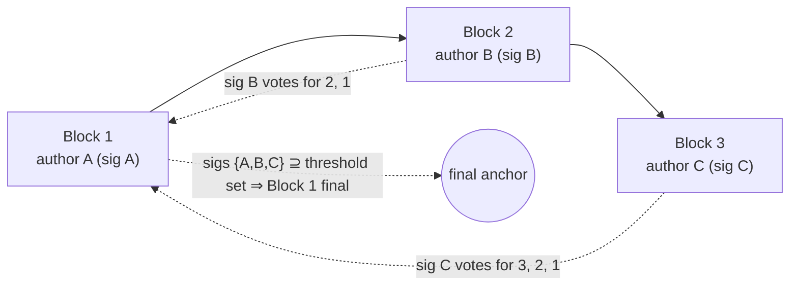

# Finality

> **Status:** Draft, reverse-engineered baseline. Pending engineer review.
> **Scope:** How progress is made (continuous execution), what a signature means (non-equivocating
> vote), how finality is reached (explicit threshold, virtual voting, dispute resolution), leader
> election, and the on-chain fallback when the threshold is not reached. Proof encoding lives in
> [state-proofs.md](./state-proofs.md); the dispute game in [disputes.md](./disputes.md).

## 1. Purpose & observable contract

A block is **final** when the protocol can prove to the chain that no competing history over that
block can win. Finality is what a snapshot update needs ([lifecycle.md §5](./lifecycle.md)); it is
deliberately **decoupled from progress** — execution never stops to wait for it.

## 2. Continuous execution

**REQ-FIN-1.** Participants MUST NOT be required to wait for explicit threshold finality before
building the next block. The scheduled author builds on the latest valid state immediately, even
when that state's block has not yet collected all signatures. Requiring agreement before progress
contradicts the liveness model: one slow or absent signer would stall the channel even though the
dispute path can already prove and carry the unagreed suffix forward.

This corrects the old specification's §5.4, which required an instance not to build on unagreed
blocks. The correction is the intended design, and it is also what the code does.

Current: [`StateManager.playTransaction`](../../../../src/stateManager/StateManager.ts) gates
authoring only on the channel being open, it being the author's turn (`isMyTurn`), and linkage to
the latest stored block — there is no agreement check. Signature collection runs asynchronously
via the [`AgreementManager`](../../../../src/agreementManager/AgreementManager.ts); the author
schedules the calldata fallback (§8) `agreementTime` after producing the block and keeps going.

## 3. Signing is a non-equivocating vote

**INV-FIN-2.** Signing a block is a binding, non-equivocating vote for that block **and the
history it links to**. A participant MUST NOT sign two different blocks at the same
`(forkId, height)` or otherwise commit to conflicting histories. Provable equivocation is fraud:
the `BlockDoubleSign` fraud proof slashes the signer
([fraud-proofs.md](./fraud-proofs.md), [`FraudProofFacet`](../../../../contracts/V1/StateChannelDiamondProxy/FraudProofFacet.sol)).

Current: peers detect conflicts at intake —
[`ValidationService.checkConflictingBlock`](../../../../src/stateManager/ValidationService.ts)
compares an incoming block against the stored block at the same coordinates and routes a same-author
conflict to the double-sign handler of the active validation strategy.

This invariant is what makes the rest of this document safe: votes can be counted across blocks
(§4) because no participant can validly vote for two competing histories, and a non-final suffix
can be carried forward (§7, [state-proofs.md §6](./state-proofs.md)) because extending it never
requires trusting an unbacked claim.

## 4. Virtual voting

**REQ-FIN-3.** A signature on block _B_ is also an indirect vote for every ancestor of _B_ on the
same hash-linked chain. Signatures are therefore **cumulative across ancestry**: votes for a block
are the union of direct signatures on it and signatures on its linked descendants.

**REQ-FIN-4.** Consequently, in a channel with _N_ participants, _N_ consecutive blocks authored
by the complete participant set finalize the **first** block of the sequence, even if no
participant other than its author ever signed that first block directly: each author's signature
on their own block is a vote for all its ancestors, and the _N_ authors together cover the
threshold set.

Current, off-chain:
[`AgreementManager.tryBuildMilestone`](../../../../src/agreementManager/AgreementManager.ts) walks
consecutive blocks and accumulates _all_ signer addresses (author + confirmation signatures) into
one set; when the accumulated set covers the threshold set, the walked blocks form a milestone
whose **first** block is thereby finalized.
Current, on-chain:
[`StateProofFacet._isMilestoneFinalWithExpectedParticipants`](../../../../contracts/V1/StateChannelDiamondProxy/StateProofFacet.sol)
verifies the same rule — hash-linked confirmations, valid author signatures, signatures counted
across the whole sequence into a threshold set — and returns the first block's snapshot hash as
the finalized anchor. The precise conditions for a signature to count (same fork, hash linkage,
authentic author signature) are the linkage checks listed in
[state-proofs.md §7](./state-proofs.md).

## 5. Leader election

**REQ-FIN-5.** Block authoring is deterministic: `getNextToWrite()` — a pure function of the
current channel state defined by the integrator's state machine
([`AStateMachine.getNextToWrite`](../../../../contracts/V1/AStateMachine.sol)) — names the address
authorized to author the next **block** (block-level, not per-transaction, even though the current
implementation packs one transaction per block). Every peer validates incoming blocks against it
([`ValidationService`](../../../../src/stateManager/ValidationService.ts) leader check; this
protocol-layer check is the enforcement point — in-contract wrong-turn checks are optional
defense in depth, see [OQ-26](../open-questions.md) for the on-chain proof gap), and the dispute
path re-derives it on-chain to validate timeout targets
([`DisputeFraudProofFacet`](../../../../contracts/V1/StateChannelDiamondProxy/DisputeFraudProofFacet.sol)).

**REQ-FIN-6 (SHOULD).** The recommended policy is **round-robin** over the participant set, as a
function of channel state (e.g.
[`MathStateMachine.getNextToWrite`](../../../../contracts/V1/examples/MathStateMachine/MathStateMachine.sol):
`participants[currentTurnIndex % participants.length]`). The safety argument for carrying
non-final suffixes forward (§7) currently **depends on** round-robin; see the open question below.

Authoring is time-slotted: the author has `p2pTime` from the previous relevant timestamp to
produce the block ([lifecycle.md §8](./lifecycle.md), [time.md](./time.md)). A missed slot is
objectively disputable: peers schedule a timeout check for
`p2pTime + agreementTime + chainFallbackTime` (+ first-block grace)
([`StateManager.getTimeoutWaitTimeSeconds`](../../../../src/stateManager/StateManager.ts)) and
then open a timeout dispute against the scheduled author
([disputes.md](./disputes.md)).

**Open question (leader election beyond round-robin):** under a different leader-election policy a
valid non-final suffix may become revertible, changing the safety, liveness, and accountability
analysis. Any objectively provable violation that a revert implies should have a clearly
attributable, slashable party, but the attribution and penalty rules are unresolved. Long-lived
channels and long-range milestone chains also need an argument that proofs stay bounded and that
long-range conflicting histories are prevented or recoverable. Before another policy is supported,
its schedule, its interaction with virtual voting and longest-valid-chain reduction, the exact
revert conditions, and the accountable party for each violation must be specified. Mirrored in
[open-questions.md](../open-questions.md) and cross-referenced from
[state-proofs.md](./state-proofs.md).

## 6. The three finality routes and the exact threshold

Finality arrives by exactly one of three routes:

1. **Explicit threshold finality.** Every required participant signed the block directly
   (`BlockConfirmation` with a full signature set).
2. **Virtual finality.** Later cryptographically linked blocks supply the missing votes (§4).
3. **Dispute resolution.** No threshold was reached in time; a participant submits the latest
   available (possibly non-final) proved state to the dispute game, and after reduction and the
   challenge period the result is canonical ([disputes.md](./disputes.md)).

**REQ-FIN-7.** The threshold is currently **unanimous** over the _relevant participant set_:

- Off-chain: [`AgreementManager.didEveryoneSignBlock`](../../../../src/agreementManager/AgreementManager.ts)
  requires signatures from the union of the block's previous and resulting participant sets, so a
  membership-changing block needs both the old set and the joiner/leaver where applicable
  ([state-proofs.md §5](./state-proofs.md)).
- On-chain (milestones): `_isMilestoneFinalWithExpectedParticipants` requires
  `thresholdCount == expectedParticipants.length`, where the expected set is the union of the
  previous snapshot's participants, the resulting snapshot's participants, and pending joiners
  derived from the inbound stream
  ([`StateProofFacet._deriveMilestoneUnionParticipants`](../../../../contracts/V1/StateChannelDiamondProxy/StateProofFacet.sol)).
- On-chain (disputes): a threshold-final dispute confirmation requires signatures from
  `getOnChainThresholdSet` = (snapshot participants ∪ pending participants) − on-chain-slashed
  ([`StateChannelCommon`](../../../../contracts/V1/StateChannelDiamondProxy/StateChannelCommon.sol)),
  and finalizes the dispute window immediately
  ([`DisputeManagerFacet._isDisputeThresholdFinal`](../../../../contracts/V1/StateChannelDiamondProxy/DisputeManagerFacet.sol)).

Sub-unanimous thresholds are not supported anywhere in the current code.

**Implicit attestation — exact conditions.** A signature counts as an implicit vote for an earlier
block if and only if: both blocks are on the same `forkId`; the chain between them is hash-linked
(`previousBlockHash == keccak256(previous encodedBlock)` at every step); the author signature on
each carrying block is authentic and matches the block's declared author; and the signer counts at
most once per threshold set. These are exactly the checks the milestone verifier applies
([state-proofs.md §7](./state-proofs.md)).

## 7. Non-final transitions are carried forward

**INV-FIN-8.** Valid transitions that lacked finality when a dispute began are **not reverted**.
The dispute reduction selects the _longest valid proved history_ among the presented views —
[`DisputeVerificationFacet.reduce`](../../../../contracts/V1/StateChannelDiamondProxy/DisputeVerificationFacet.sol)
keeps the candidate latest block with the highest `transactionCnt` (ties broken deterministically
by lower block hash) — and the successor fork's genesis state is derived from that latest state.
The carried suffix is safe because of INV-FIN-2: presenting a conflicting suffix requires a
slashable double-sign. (With the round-robin caveat of §5's open question.)

## 8. On-chain fallback when threshold finality is not reached

When the author does not see the full threshold within `agreementTime`, it posts the signed block
as calldata on-chain
([`StateManager.maybePostBlockOnChain`](../../../../src/stateManager/StateManager.ts) →
[`StateChannelManagerProxy.postBlockCalldata`](../../../../contracts/V1/StateChannelDiamondProxy/StateChannelManagerProxy.sol)):

- **Data availability.** The chain itself becomes the guarantor that the block data is available:
  peers ingest `BlockCalldataPosted` events, so an uncooperative peer cannot claim it never saw
  the block. No separate data-availability trust assumption is added. Costs and griefing exposure:
  [security/data-availability.md](../security/data-availability.md).
- **Cheap commitment, slashable junk.** The contract stores a single hash
  `keccak256(signedBlock, block.timestamp)`, never overwritable, and requires
  `msg.sender == block author`. It does **not** validate the block; posting junk is provable
  against the commitment and slashable against the poster.
- **Race-condition guard.** The post carries `maxTimestamp` = previous relevant timestamp +
  `p2pTime + agreementTime + chainFallbackTime` (+ grace); the chain rejects later posts, which
  bounds how late a block can be forced into the record.
- **Extra time granted.** A posted commitment changes the timing rules: the acceptable
  block-timestamp window extends by `evidenceTime` for calldata-committed blocks
  ([`ValidationService`](../../../../src/stateManager/ValidationService.ts),
  [`CalldataCommittedStrategy`](../../../../src/stateManager/validationStrategy/CalldataCommittedStrategy.ts)),
  and a timeout dispute against an author who posted calldata for the claimed height is rejected
  on-chain (`RaceConditionDisputeTimeoutCalldataPosted`,
  [`DisputeManagerFacet._disputeRaceConditionCheck`](../../../../contracts/V1/StateChannelDiamondProxy/DisputeManagerFacet.sol)).
  When peers do not cooperate, this extra on-chain time is a deliberate UX and fee cost of the
  current design.

If the threshold still never arrives, route 3 applies: any eligible participant disputes with the
latest proved state ([state-proofs.md](./state-proofs.md)), and the reduction carries the valid
suffix forward (§7).

## 9. Current vs. intended divergences

- **Proof shape limits virtual finality's reach in disputes.** Intended: a state proof may extend
  a proved milestone with a trailing non-final signed-block suffix. Current: milestones and
  trailing signed blocks are mutually exclusive in both the SDK proof builder and the on-chain
  verifier, so when any milestone exists the provable latest state stops at the last milestone.
  Recorded in full, with its consequences, in [state-proofs.md §8](./state-proofs.md).
- **Refusing to sign posted blocks when next-to-write.** Current:
  [`StateManager.shouldSignBlock`](../../../../src/stateManager/StateManager.ts) declines to sign
  a block that was posted on-chain when the local participant is the next author. This is not
  stated anywhere as intended protocol behavior. **Open question:** confirm the rule's intent
  (presumably avoiding attesting to a block that arrived via the fallback path while the local
  node is about to build on a competing view) and specify it, or remove it.
- Otherwise, the continuous-execution model of this document matches the implementation.

## 10. Verification

- **Virtual voting / milestone construction:**
  [test/unit/AgreementManager.test.ts](../../../../test/unit/AgreementManager.test.ts) — proofs
  with fully-signed latest block (milestones-only), missing-signature fallback, membership-change
  hops, and on-chain verification of sampled proofs.
- **On-chain threshold rules:**
  [test/V1/DiamondProxy/StateChannelManager/StateProofVerification.test.ts](../../../../test/V1/DiamondProxy/StateChannelManager/StateProofVerification.test.ts).
- **Equivocation:** double-sign detection in
  [test/unit/ValidationService.test.ts](../../../../test/unit/ValidationService.test.ts); fraud
  proof application in
  [test/e2e/E2E-FraudProofsBlockConfirmation.test.ts](../../../../test/e2e/E2E-FraudProofsBlockConfirmation.test.ts).
- **Missed slots and fallback:** [test/e2e/E2E-Timeouts.test.ts](../../../../test/e2e/E2E-Timeouts.test.ts),
  [test/stateManager/StateManagerTimeout.test.ts](../../../../test/stateManager/StateManagerTimeout.test.ts).
- **Dispute route / carry-forward:**
  [test/e2e/E2E-FinalDispute.test.ts](../../../../test/e2e/E2E-FinalDispute.test.ts),
  [test/e2e/E2E-ReductionManager.test.ts](../../../../test/e2e/E2E-ReductionManager.test.ts),
  [test/e2e/E2E-Fuzz-Dispute-MVP.test.ts](../../../../test/e2e/E2E-Fuzz-Dispute-MVP.test.ts).
- Gaps: no test currently isolates REQ-FIN-4's exact _N-consecutive-authors_ finalization bound,
  and partitioned-network adversarial scenarios for the fallback path are limited.

## Future Work

_Non-normative._

- Sub-unanimous or weighted thresholds: would change every union-set computation, the milestone
  verifier, and the dispute threshold; requires a fresh safety analysis against INV-FIN-2.
- Alternative leader-election policies (see the open question in §5) — including
  availability-aware schedules that skip repeatedly absent authors without a dispute.
- Signature aggregation (e.g. BLS) to shrink `BlockConfirmation`s and milestone proofs.
- Explicit finality gadgets/checkpointing for very long-lived channels so proofs stay bounded
  without trusting the whole suffix chain.

## Traceability

| ID        | Statement                                                                                                                                   | Implementation                                                                                                                                                                                                                                                                                                 | Verification evidence                                                                                                                                                                             |
| --------- | ------------------------------------------------------------------------------------------------------------------------------------------- | -------------------------------------------------------------------------------------------------------------------------------------------------------------------------------------------------------------------------------------------------------------------------------------------------------------- | ------------------------------------------------------------------------------------------------------------------------------------------------------------------------------------------------- |
| REQ-FIN-1 | Participants build on the latest valid state immediately; explicit threshold finality is never a precondition for producing the next block. | [StateManager.playTransaction](../../../../src/stateManager/StateManager.ts)                                                                                                                                                                                                                                   | happy-path e2e suites ([E2E-StateTransition.test.ts](../../../../test/e2e/E2E-StateTransition.test.ts)); delayed-signature scenario: none — gap                                                   |
| INV-FIN-2 | Signing is a non-equivocating vote; provable equivocation is slashable.                                                                     | [ValidationService.checkConflictingBlock](../../../../src/stateManager/ValidationService.ts); [FraudProofFacet](../../../../contracts/V1/StateChannelDiamondProxy/FraudProofFacet.sol) (`BlockDoubleSign`)                                                                                                     | [ValidationService.test.ts](../../../../test/unit/ValidationService.test.ts), [E2E-FraudProofsBlockConfirmation.test.ts](../../../../test/e2e/E2E-FraudProofsBlockConfirmation.test.ts)           |
| REQ-FIN-3 | Signatures accumulate across hash-linked ancestry (virtual voting).                                                                         | [AgreementManager.tryBuildMilestone](../../../../src/agreementManager/AgreementManager.ts); [StateProofFacet.\_isMilestoneFinalWithExpectedParticipants](../../../../contracts/V1/StateChannelDiamondProxy/StateProofFacet.sol)                                                                                | [AgreementManager.test.ts](../../../../test/unit/AgreementManager.test.ts), [StateProofVerification.test.ts](../../../../test/V1/DiamondProxy/StateChannelManager/StateProofVerification.test.ts) |
| REQ-FIN-4 | N consecutive blocks authored by the complete participant set finalize the sequence's first block.                                          | same as REQ-FIN-3                                                                                                                                                                                                                                                                                              | none — gap (implied by milestone tests, not isolated)                                                                                                                                             |
| REQ-FIN-5 | Deterministic block-level authoring via `getNextToWrite`; a missed slot is timeout-disputable.                                              | [AStateMachine.getNextToWrite](../../../../contracts/V1/AStateMachine.sol); [ValidationService](../../../../src/stateManager/ValidationService.ts); [StateManager.getTimeoutWaitTimeSeconds](../../../../src/stateManager/StateManager.ts)                                                                     | [E2E-Timeouts.test.ts](../../../../test/e2e/E2E-Timeouts.test.ts)                                                                                                                                 |
| REQ-FIN-6 | Recommended leader-election policy is round-robin as a function of channel state.                                                           | [MathStateMachine.getNextToWrite](../../../../contracts/V1/examples/MathStateMachine/MathStateMachine.sol)                                                                                                                                                                                                     | exercised implicitly by all e2e suites                                                                                                                                                            |
| REQ-FIN-7 | The finality threshold is unanimous over the relevant union participant set (minus on-chain-slashed, for disputes).                         | [AgreementManager.didEveryoneSignBlock](../../../../src/agreementManager/AgreementManager.ts); [StateProofFacet](../../../../contracts/V1/StateChannelDiamondProxy/StateProofFacet.sol); [StateChannelCommon.getOnChainThresholdSet](../../../../contracts/V1/StateChannelDiamondProxy/StateChannelCommon.sol) | [AgreementManager.test.ts](../../../../test/unit/AgreementManager.test.ts), [StateProofVerification.test.ts](../../../../test/V1/DiamondProxy/StateChannelManager/StateProofVerification.test.ts) |
| INV-FIN-8 | Valid non-final transitions are carried into the canonical successor fork, not reverted (longest valid proved history wins).                | [DisputeVerificationFacet.reduce](../../../../contracts/V1/StateChannelDiamondProxy/DisputeVerificationFacet.sol)                                                                                                                                                                                              | [E2E-FinalDispute.test.ts](../../../../test/e2e/E2E-FinalDispute.test.ts), [E2E-Fuzz-Dispute-MVP.test.ts](../../../../test/e2e/E2E-Fuzz-Dispute-MVP.test.ts)                                      |
