# Protocol Lifecycle

> **Status:** Draft, reverse-engineered baseline. Pending engineer review.
> **Scope:** The end-to-end life of a channel — open, continuous execution, disputes, settlement —
> the on-chain transaction count, the four timing windows, and which contracts and SDK components
> own each phase. Details of each phase live in the sibling documents:
> [finality.md](./finality.md), [state-proofs.md](./state-proofs.md), [disputes.md](./disputes.md),
> [fraud-proofs.md](./fraud-proofs.md), [cross-layer-messages.md](./cross-layer-messages.md),
> [time.md](./time.md).

## 1. Purpose & observable contract

The lifecycle defines when a channel touches the base layer and what each touch accomplishes.
The design goal is that everything between opening and settlement is off-chain, free, and
real-time; the chain is touched to move value across the layer boundary and to adjudicate when
peers cannot cooperate.

**REQ-LIF-1.** The best-case complete lifecycle needs **at least two** base-layer transactions:

1. **Open/deposit** — [`StateChannelManagerProxy.open`](../../../../contracts/V1/StateChannelDiamondProxy/StateChannelManagerProxy.sol)
   verifies the unanimously signed terms, deposits the committed assets, and records the genesis
   snapshot.
2. **Settlement** — a snapshot update
   ([`StateSnapshotFacet.updateStateSnapshotSameFork` / `updateStateSnapshotFork`](../../../../contracts/V1/StateChannelDiamondProxy/StateSnapshotFacet.sol))
   that advances the on-chain snapshot and processes the outbound message stream, releasing
   withdrawals. This is the **normal** deposits-and-withdrawals path, not a dispute-only
   exceptional path.

The earlier claim that "opening is the one unavoidable on-chain step" is wrong: a participant who
wants their value back always needs the settlement transaction too. The real lifecycle can require
more transactions — joins and top-ups
([`JoinChannelFacet`](../../../../contracts/V1/StateChannelDiamondProxy/JoinChannelFacet.sol)),
block-calldata posts (`postBlockCalldata`), dispute uploads, reductions, challenges, fraud proofs,
and forced inbound inclusion.

## 2. Lifecycle at a glance

```mermaid
stateDiagram-v2
    [*] --> Opening
    Opening --> Executing: open() succeeds on-chain (tx 1)
    Executing --> Executing: continuous block production;\nfinality trails via thresholds / virtual votes
    Executing --> Executing: joins, top-ups, deposits\n(extra on-chain txs → inbound stream)
    Executing --> Disputing: timeout, on-chain slashes,\nself-removal, forced inbound inclusion
    Disputing --> Executing: reduction produces the canonical successor fork;\nvalid state carried forward
    Executing --> Settling: finalized snapshot submitted on-chain (tx 2)
    Disputing --> Settling: successor-fork snapshot adopted\nafter the reduce challenge period
    Settling --> [*]: outbound stream processed incrementally;\nwithdrawals released; storage cleared at 0 participants
```



Fraud proofs run on a separate, immediate path beside this lifecycle: an objective violation seen
at any point can be proven on-chain at once and adds the offender to the on-chain slash set that
later dispute reductions consume. See [fraud-proofs.md](./fraud-proofs.md).

### Assumptions, constraints & dependencies

- The chain hosting the manager is live, honest, and final, and every participant can reach it
  through at least one honest RPC endpoint ([security/trust-model.md](../security/trust-model.md)).
- All deadlines are measured against chain-aligned time
  ([`Clock`](../../../../src/Clock.ts), [time.md](./time.md)).
- The integrator state machine is deterministic and its state serializes canonically
  ([concepts/state-machines.md](../concepts/state-machines.md)).

## 3. Phase 1 — Opening (on-chain, tx 1)

**Contracts:** [`StateChannelManagerProxy.open`](../../../../contracts/V1/StateChannelDiamondProxy/StateChannelManagerProxy.sol),
[`UtilityFacet.verifyThresholdSigned`](../../../../contracts/V1/StateChannelDiamondProxy/UtilityFacet.sol),
the integrator's [`AConsumerFacet`](../../../../contracts/V1/StateChannelDiamondProxy/AConsumerFacet.sol)
(`deposit`, `openChannelGenesis`).
**SDK:** [`EvmStateMachine.p2pSetup`](../../../../src/evm/EvmDiamondStateMachine.ts) wiring, the
chain signer, and [`EventHandler`](../../../../src/eventHandlers/EventHandler.ts) →
[`StateManager.unsafeSetGenesisState`](../../../../src/stateManager/StateManager.ts) on
`ChannelOpened`.

`open()` requires a non-zero channel id, no duplicate participants, a signature from **every**
listed participant over the encoded `OpenChannel`, and at least two successful deposits. Deposits
run composably through the consumer facet (`depositAssetsComposable`), atomically when
`OpenChannel.isAtomic` is set. The successful joins become the first inbound message block; the
consumer facet builds the genesis state; the genesis `SnapshotData` commits to the state hash,
participants, stream tips, and deposit totals; and `forkId = keccak256(abi.encode(genesisSnapshotData))`
becomes the root fork identity ([concepts/history-and-commitments.md](../concepts/history-and-commitments.md)).

Later joins and top-ups are additional on-chain transactions that append to the **inbound** stream
and enter channel state when a block author packages them; see
[cross-layer-messages.md](./cross-layer-messages.md).

## 4. Phase 2 — Continuous execution (off-chain)

**SDK:** [`StateManager`](../../../../src/stateManager/StateManager.ts) (authoring:
`playTransaction`; intake: [`BlockQueueManager`](../../../../src/stateManager/BlockQueueManager.ts),
[`ValidationService`](../../../../src/stateManager/ValidationService.ts) with the
[validation strategies](../../../../src/stateManager/validationStrategy)),
[`AgreementManager`](../../../../src/agreementManager/AgreementManager.ts) (signature tracking),
[`P2PManager`](../../../../src/P2PManager.ts) and the transports.
**Contracts:** none in the happy path; `postBlockCalldata` as the data-availability fallback.

The deterministically scheduled author (`getNextToWrite()`) executes a transaction locally, builds
the block, signs it, and broadcasts it. Peers re-execute, verify author, linkage, and timing, then
sign and return signatures. Participants **do not wait** for a block to reach threshold finality
before building the next one — finality trails behind production. The full model, including the
three finality routes and the calldata fallback, is specified in [finality.md](./finality.md).

**REQ-LIF-3.** A normal state transition MAY produce an outbound message — including an
`ExitChannel` — as an ordinary transition result. Exits are **not** limited to removal or
slashing, and **producing the message requires no finality**. Finality is required only when a
snapshot carrying that outbound tip is submitted on-chain.

Current: [`MathStateMachine.leaveChannel`](../../../../contracts/V1/examples/MathStateMachine/MathStateMachine.sol)
is exactly this — a normal transition that removes the caller and records an `ExitChannel`
outbound message. After a transition in which the local participant left, the SDK waits
`agreementTime` and then either posts the finalized snapshot (everyone signed) or opens a
self-removal dispute (`StateManager.startMaybeExitOnChain`).

## 5. Two paths to a snapshot-updating state

**REQ-LIF-2.** Exactly two paths lead to a state that can update the on-chain snapshot and support
withdrawals:

1. **Same-fork finality.** Every required participant signed (directly or via virtual votes —
   [finality.md](./finality.md)); the proof of finality (milestone proofs + milestone snapshots —
   [state-proofs.md](./state-proofs.md)) is submitted with the snapshot via
   `updateStateSnapshotSameFork`. The facet checks the snapshot is newer, the milestones verify
   against the current on-chain snapshot's threshold set, and all pending inbound messages were
   consumed.
2. **Dispute resolution.** A dispute window reduces deterministically to a successor fork
   ([disputes.md](./disputes.md)); after the reduce challenge period (`evidenceTime`) expires,
   `updateStateSnapshotFork` adopts the successor fork's genesis snapshot. The facet walks the
   `reducedResult` chain from the current on-chain fork, so several dispute generations can be
   adopted in one call.

Both paths converge on `_updateStateSnapshot`, which processes the outbound stream (below).

## 6. Phase 3 — Disputes (on-chain fallback)

**SDK:** [`DisputeManager`](../../../../src/disputeManager/DisputeManager.ts),
[`DisputeValidationService`](../../../../src/stateManager/DisputeValidationService.ts), the
[reduction services](../../../../src/stateManager/reduction).
**Contracts:** [`DisputeManagerFacet`](../../../../contracts/V1/StateChannelDiamondProxy/DisputeManagerFacet.sol)
(windows), [`DisputeVerificationFacet`](../../../../contracts/V1/StateChannelDiamondProxy/DisputeVerificationFacet.sol)
(reduce, finalize, challenge, kill),
[`FraudProofFacet`](../../../../contracts/V1/StateChannelDiamondProxy/FraudProofFacet.sol) /
[`DisputeFraudProofFacet`](../../../../contracts/V1/StateChannelDiamondProxy/DisputeFraudProofFacet.sol).

The valid dispute inputs are participant timeout, accumulated on-chain slashes, voluntary
self-removal, and forced inclusion of newer inbound messages ([disputes.md](./disputes.md)).
Uploading a dispute opens (or joins) a `DisputeWindow` for the disputed fork and records the
disputer's commitment immediately.

**REQ-LIF-4.** Every initiated dispute runs through the dispute game and produces a **canonical
successor fork** — whether the submitted claim is ultimately accepted, rejected, or reduced away.
The reduction (`reduce` → `reduceOutputToSnapshotData`) deterministically folds the committed
disputes into a new genesis `SnapshotData`; its hash is the successor `forkId`; off-chain
execution resumes from that fork with valid non-final transitions carried forward
([finality.md §7](./finality.md)). An invalid committed dispute can be killed during the kill
period and its opener slashed, but the window it opened still resolves to a canonical outcome for
the fork; the exact kill semantics are specified (with their open questions) in
[disputes.md](./disputes.md).

## 7. Phase 4 — Settlement (on-chain, tx 2)

**SDK:** [`SnapshotUpdateService.postStateSnapshot`](../../../../src/stateManager/snapshotUpdate/SnapshotUpdateService.ts)
selects the path, assembles milestone proofs from `AgreementManager`, and handles benign races
(another peer's snapshot landing first).
**Contracts:** [`StateSnapshotFacet`](../../../../contracts/V1/StateChannelDiamondProxy/StateSnapshotFacet.sol),
consumer facet `withdraw`.

Settlement is **incremental outbound-stream processing** during a snapshot update, not a
standalone withdrawal call. `_updateStateSnapshot`:

1. prunes outbound message blocks the chain already processed (comparing against the stored
   outbound tip),
2. verifies the supplied range links the old tip to the new snapshot's committed tip,
3. processes each message (an `EXIT` message runs `withdrawAssetsComposable` → consumer facet
   `withdraw`), accumulating `totalWithdrawals`,
4. **INV-LIF-5:** requires `totalWithdrawals <= totalDeposits` after every message
   (`CantWithdrawMoreThanDeposits`) — settlement conserves value,
5. stores the new snapshot and advances the outbound accounting; at 0 remaining participants the
   channel's storage is cleared.

```mermaid
sequenceDiagram
    participant SDK as SDK (SnapshotUpdateService)
    participant SS as StateSnapshotFacet
    participant CF as ConsumerFacet
    SDK->>SS: updateStateSnapshotSameFork(milestoneProofs, milestoneSnapshots, outboundBlocks)
    SS->>SS: verify milestones vs current snapshot's threshold set
    SS->>SS: prune already-processed outbound blocks, verify linkage old tip → new tip
    loop each new outbound message
        SS->>CF: withdraw(ExitChannel)
        SS->>SS: totalWithdrawals += balance; require ≤ totalDeposits
    end
    SS->>SS: store new snapshot, advance outbound marker
    SS-->>SDK: StateSnapshotUpdated / WithdrawalsUpdated
```

The same mechanism serves normal exits, dispute-derived exits, and arbitrary outbound messages;
the stream model is specified in [cross-layer-messages.md](./cross-layer-messages.md).

## 8. The four timing windows

**REQ-LIF-6.** Four protocol windows are configured on the manager at deployment
([`StateChannelManagerProxy`](../../../../contracts/V1/StateChannelDiamondProxy/StateChannelManagerProxy.sol)
constructor; defaults in seconds in parentheses) and mirrored into the SDK's
[`timeConfig`](../../../../src/types/time.ts). Each bounds a specific phase:

| Window              | Default | Bounds                                                                                                                                                                                                                                                                                                                                                                                                           |
| ------------------- | ------- | ---------------------------------------------------------------------------------------------------------------------------------------------------------------------------------------------------------------------------------------------------------------------------------------------------------------------------------------------------------------------------------------------------------------- |
| `p2pTime`           | 15      | The author's slot: the maximum block timestamp is the previous relevant timestamp + `p2pTime` (+ first-block grace). Producing later makes the slot objectively missed.                                                                                                                                                                                                                                          |
| `agreementTime`     | 5       | Signature collection: how long the author waits for the full threshold before falling back to posting block calldata on-chain (`StateManager.maybePostBlockOnChain`); also the peer RPC timeout and the wait before an exiting participant escalates.                                                                                                                                                            |
| `chainFallbackTime` | 30      | Extra time to land the calldata post on-chain: the timeout clock for the next author runs for `p2pTime + agreementTime + chainFallbackTime` (+ grace) before a timeout dispute is opened (`StateManager.getTimeoutWaitTimeSeconds`), and `postBlockCalldata`'s `maxTimestamp` guard uses the same bound.                                                                                                         |
| `evidenceTime`      | 30      | Every on-chain dispute period: the evidence period (window creation + `evidenceTime`), the kill period (last evidence submission + `evidenceTime`), the reduce challenge period (reduction + `evidenceTime`), and the per-disputer throttle. A posted calldata commitment also extends the acceptable block-timestamp window by `evidenceTime` — the extra time the protocol grants when peers do not cooperate. |

The calldata fallback's cost and griefing exposure are a deliberate, known weakness of the current
design — see [security/data-availability.md](../security/data-availability.md). Chain-time
tracking, skew bounds, and timestamp validation rules are in [time.md](./time.md).

## 9. Verification

- **Lifecycle end-to-end:** [test/e2e/E2E-ParticipantLifecycle.test.ts](../../../../test/e2e/E2E-ParticipantLifecycle.test.ts)
  drives open → execute → membership change → exit; the two-transaction happy path (open, then
  settlement snapshot) is the scenario skeleton of the e2e suites.
- **Settlement paths:** [test/e2e/E2E-StateSnapshots.test.ts](../../../../test/e2e/E2E-StateSnapshots.test.ts),
  [test/stateManager/SnapshotUpdateService.test.ts](../../../../test/stateManager/SnapshotUpdateService.test.ts)
  (same-fork), [test/e2e/E2E-FinalDispute.test.ts](../../../../test/e2e/E2E-FinalDispute.test.ts)
  and [test/e2e/E2E-ReductionManager.test.ts](../../../../test/e2e/E2E-ReductionManager.test.ts)
  (successor-fork). Adversarial snapshot submissions:
  [test/e2e/E2E-MaliciousUpdateSnapshot.test.ts](../../../../test/e2e/E2E-MaliciousUpdateSnapshot.test.ts).
- **Timing windows:** [test/e2e/E2E-Timeouts.test.ts](../../../../test/e2e/E2E-Timeouts.test.ts),
  [test/e2e/E2E-FirstBlockTimestampGrace.test.ts](../../../../test/e2e/E2E-FirstBlockTimestampGrace.test.ts),
  [test/stateManager/StateManagerTimeout.test.ts](../../../../test/stateManager/StateManagerTimeout.test.ts).
- Gap: no test asserts the _minimality_ claim of REQ-LIF-1 directly (that exactly two
  transactions suffice in the best case); it is implied by the happy-path e2e flows.

## Future Work

_Non-normative._

- Reduce settlement latency and cost: optimistic reduction commitments and fast-path finalization
  ideas are collected in [disputes.md](./disputes.md) Future Work.
- Alternative data-availability designs to cut the calldata fallback's fees and recovery latency;
  every candidate must state its new trust assumptions
  ([security/data-availability.md](../security/data-availability.md)).
- A treasury path for funds stranded in a channel that closes with zero participants (the code
  marks this `TODO` in `StateSnapshotFacet._updateStateSnapshot`).
- Batch settlement UX: `multicall` on the proxy already allows combining snapshot updates with
  other calls; document recommended patterns for integrators.

## Traceability

| ID        | State          | Statement                                                                                                                                             | Implementation                                                                                                                                                                                                                                                                                           | Verification evidence                                                                                                                                                                                                                                                    |
| --------- | -------------- | ----------------------------------------------------------------------------------------------------------------------------------------------------- | -------------------------------------------------------------------------------------------------------------------------------------------------------------------------------------------------------------------------------------------------------------------------------------------------------- | ------------------------------------------------------------------------------------------------------------------------------------------------------------------------------------------------------------------------------------------------------------------------ |
| REQ-LIF-1 | Design pending | Best-case complete lifecycle needs at least two base-layer txs: open/deposit and settlement via a snapshot update that processes the outbound stream. | [StateChannelManagerProxy.open](../../../../contracts/V1/StateChannelDiamondProxy/StateChannelManagerProxy.sol); [StateSnapshotFacet](../../../../contracts/V1/StateChannelDiamondProxy/StateSnapshotFacet.sol)                                                                                          | [E2E-ParticipantLifecycle.test.ts](../../../../test/e2e/E2E-ParticipantLifecycle.test.ts), [E2E-StateSnapshots.test.ts](../../../../test/e2e/E2E-StateSnapshots.test.ts); minimality itself: none — gap                                                                  |
| REQ-LIF-2 | Design pending | Only two paths yield a snapshot-updating state: same-fork finality proof, or dispute reduction after the challenge window.                            | [StateSnapshotFacet.updateStateSnapshotSameFork / updateStateSnapshotFork](../../../../contracts/V1/StateChannelDiamondProxy/StateSnapshotFacet.sol)                                                                                                                                                     | [SnapshotUpdateService.test.ts](../../../../test/stateManager/SnapshotUpdateService.test.ts), [E2E-FinalDispute.test.ts](../../../../test/e2e/E2E-FinalDispute.test.ts), [E2E-MaliciousUpdateSnapshot.test.ts](../../../../test/e2e/E2E-MaliciousUpdateSnapshot.test.ts) |
| REQ-LIF-3 | Design pending | A normal transition may produce an outbound exit message; producing it needs no finality — finality is needed only at on-chain snapshot submission.   | [AStateMachine.getOutboundMessages / \_addExitChannel](../../../../contracts/V1/AStateMachine.sol); [StateManager.startMaybeExitOnChain](../../../../src/stateManager/StateManager.ts)                                                                                                                   | [E2E-ParticipantLifecycle.test.ts](../../../../test/e2e/E2E-ParticipantLifecycle.test.ts)                                                                                                                                                                                |
| REQ-LIF-4 | Design pending | Every initiated dispute produces a canonical successor fork; execution resumes from it.                                                               | [DisputeManagerFacet.\_uploadDispute](../../../../contracts/V1/StateChannelDiamondProxy/DisputeManagerFacet.sol); [DisputeVerificationFacet.reduce / reduceAndFinalize](../../../../contracts/V1/StateChannelDiamondProxy/DisputeVerificationFacet.sol)                                                  | [E2E-DisputeManager.test.ts](../../../../test/e2e/E2E-DisputeManager.test.ts), [E2E-ReductionManager.test.ts](../../../../test/e2e/E2E-ReductionManager.test.ts)                                                                                                         |
| INV-LIF-5 | Design pending | Settlement conserves value: processed withdrawals never exceed deposits.                                                                              | [StateSnapshotFacet.\_applyOutboundMessageBlocks](../../../../contracts/V1/StateChannelDiamondProxy/StateSnapshotFacet.sol) (`CantWithdrawMoreThanDeposits`)                                                                                                                                             | [E2E-MaliciousUpdateSnapshot.test.ts](../../../../test/e2e/E2E-MaliciousUpdateSnapshot.test.ts)                                                                                                                                                                          |
| REQ-LIF-6 | Design pending | Four deployment-configured windows (`p2pTime`, `agreementTime`, `chainFallbackTime`, `evidenceTime`) bound the phases as specified in §8.             | [StateChannelManagerProxy](../../../../contracts/V1/StateChannelDiamondProxy/StateChannelManagerProxy.sol) constructor; [StateManager.getTimeoutWaitTimeSeconds](../../../../src/stateManager/StateManager.ts); [DisputeUtils](../../../../contracts/V1/StateChannelDiamondProxy/utils/DisputeUtils.sol) | [E2E-Timeouts.test.ts](../../../../test/e2e/E2E-Timeouts.test.ts), [StateManagerTimeout.test.ts](../../../../test/stateManager/StateManagerTimeout.test.ts)                                                                                                              |
