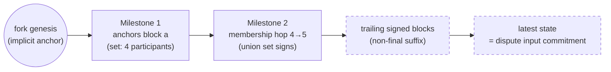

# State Proofs & Milestones

> **Status:** Draft, reverse-engineered baseline. Pending engineer review.
> **Scope:** How a fork's latest state is proven to the chain: milestones as finality anchors,
> membership-threshold hops, genesis anchoring, the permitted non-final suffix, and the exact
> linkage checks. The vote semantics behind finality are in [finality.md](./finality.md); the
> consumers are the dispute game ([disputes.md](./disputes.md)) and snapshot updates
> ([lifecycle.md §5](./lifecycle.md)).

## 1. Purpose & observable contract

A **state proof** convinces the chain — which stores only the current snapshot — that a claimed
state belongs to a fork's canonical history. It is the evidence a dispute submits with its claim
and the core of a same-fork snapshot update.

Data model ([`ProofTypes.sol`](../../../../contracts/V1/types/ProofTypes.sol)):

```solidity
struct MilestoneProof { BlockConfirmation[] blockConfirmations; }
struct StateProof {
    MilestoneProof[] milestones;   // proves the last finalized block in the fork
    SignedBlock[] signedBlocks;    // links the last milestone to the claimed latest block
}
```

The heavy backing data (genesis and latest snapshots, per-milestone snapshots, message blocks) is
carried in [`DisputeAuditingData`](../../../../contracts/V1/types/DisputeTypes.sol) and referenced
from the dispute by hash.

**What the proof guarantees:** a path of finality anchors from the fork's genesis to the last
provable anchor, and a cryptographic link from that anchor to the claimed latest state. **What it
does not guarantee:** that the latest state is final, or that its transitions were semantically
valid — invalid transitions inside a proof are handled by the dispute fraud proofs
([fraud-proofs.md](./fraud-proofs.md)), and non-finality is resolved by reduction (§6).

## 2. A milestone is a finality anchor

**REQ-SP-1.** A milestone is not merely a list of independently threshold-signed blocks. It is a
**finality anchor**: a consecutive, hash-linked run of block confirmations whose accumulated
signatures finalize the run's **first** block. That first block's confirmation is final either
directly — it carries the required threshold signatures itself — or **virtually**, because later,
cryptographically linked confirmations inside the milestone carry their signatures back through
the ancestry ([finality.md §4](./finality.md)).

Current: [`StateProofFacet._isMilestoneFinalWithExpectedParticipants`](../../../../contracts/V1/StateChannelDiamondProxy/StateProofFacet.sol)
implements exactly this — it walks the confirmations, enforces fork identity and hash linkage,
accumulates every authentic signer (author signatures and confirmation signatures) into one
threshold set, requires the set to cover all expected participants, and returns the **first**
block's `stateSnapshotHash` as the finalized snapshot of the anchor.
[`AgreementManager.tryBuildMilestone`](../../../../src/agreementManager/AgreementManager.ts) is
the off-chain constructor of the same object.

## 3. Anchors chain to the latest state

**REQ-SP-2.** A state proof establishes a path from one final anchor to the next, and finally to
the **latest state** the dispute transition operates on. The latest state itself need **not** be
final; it MUST be a cryptographically linked descendant of the last proved final anchor. That
linkage is what places it on the canonical chain before the dispute game applies its transition.

**REQ-SP-5.** The final block of the proved path supplies the state commitment
(`stateSnapshotHash` → `latestStateSnapshotHash`) that the dispute game and the reduction operate
on ([`StateProofFacet.isCorrectLatestState`](../../../../contracts/V1/StateChannelDiamondProxy/StateProofFacet.sol)).



_(The dashed suffix is the intended shape; the current code restricts it — see §8.)_

## 4. Membership hops are required at participant-set changes

**REQ-SP-3.** A join or removal changes the threshold set, so a proof crossing a membership change
MUST establish the old-set → new-set transition at the relevant block with a milestone hop; it
cannot simply assert the new membership. The hop's threshold is the **union** of the sets involved:
a 4→5 join is final only when the four original participants _and_ the joiner have (directly or
virtually) signed — proof that both the original set and the joiner authorized the change. A
removal requires the corresponding proof in the other direction (the pre-removal set covers the
leaving member).

Current, on-chain: [`StateProofFacet.verifyMilestones`](../../../../contracts/V1/StateChannelDiamondProxy/StateProofFacet.sol)
verifies K milestones against K milestone snapshots, rolling the threshold context forward: each
milestone's expected participants are
`previousSnapshot.participants ∪ resultingSnapshot.participants ∪ pendingJoiners`, where pending
joiners are derived from the inbound message blocks between the two snapshots' inbound tips
(`_deriveMilestoneUnionParticipants`). Each milestone snapshot must hash-match the anchor's
`stateSnapshotHash`, and then becomes the threshold context for the next hop.
Current, off-chain: [`AgreementManager.getStateProof`](../../../../src/agreementManager/AgreementManager.ts)
builds one milestone per participant-set change point
(`storage.participantSetChanges.getChangePointsInRange`) plus a final milestone for the latest
provable state, with the threshold signers of each milestone taken as previous-snapshot
participants ∪ resulting-snapshot participants.

Milestones entirely below the chain's current snapshot height are skipped by the verifier (they
are already settled); the last skipped milestone is still checked to link through the current
on-chain snapshot.

## 5. Genesis anchoring

**REQ-SP-4.** When a proof starts at fork genesis, genesis is the **implicit final anchor** for
that fork; no milestone is needed for it. Concretely:

- An **empty** proof (no milestones, no signed blocks) claims the fork's genesis snapshot itself
  as the latest state: `isCorrectLatestState` reconstructs the genesis `StateSnapshot` — fork id
  must equal `keccak256(abi.encode(genesisSnapshotData))` (`_isGenesisSnapshotDataLinkedToFork`),
  with the genesis timestamp derived on-chain (`getGenesisTimestamp`: the origin fork's dispute
  window kill-period end, or the stored snapshot's timestamp for the root fork) — and compares its
  hash to the claim.
- A **signed-blocks** proof provides the linked path from genesis: the first block MUST have
  `transactionCnt == 0` and each subsequent block MUST link by `previousBlockHash`
  (`_areSignedBlocksLinkedAndVerified`).
- Where milestones exist, their anchors provide the base; trailing signed blocks extend from the
  last proved milestone to the latest non-final state _(intended — restricted in the current
  code, §8)_.

## 6. Why the non-final suffix is safe

**INV-SP-6.** Extending the proved anchor with unfinalized blocks is safe because signing is a
non-equivocating commitment ([finality.md §3](./finality.md)): a participant cannot commit to
conflicting histories without exposing a slashable double-sign. Different participants MAY still
present different valid latest states during a dispute (they saw different suffix lengths). The
reduction MUST consider all validly proved views and choose the **longest valid proved history**
as canonical — this is how the latest non-final state joins canonical reality instead of being
discarded.

Current: [`DisputeVerificationFacet.reduce`](../../../../contracts/V1/StateChannelDiamondProxy/DisputeVerificationFacet.sol)
selects the candidate latest block with the highest `transactionCnt` across committed disputes,
breaking exact-height ties deterministically by lower block hash; invalid claims are removed via
dispute fraud proofs before/while they matter ([disputes.md](./disputes.md),
[fraud-proofs.md](./fraud-proofs.md)).

**Open question (shared with [finality.md §5](./finality.md)):** this safety argument currently
depends on round-robin leader election. Other policies may allow a valid suffix to be reverted and
need explicit attribution and penalty rules; long-lived channels and long-range milestone chains
need bounded proofs. Mirrored in [open-questions.md](../open-questions.md).

## 7. Exact verification pipeline (current)

[`StateProofFacet.verifyStateProof(dispute, auditingData)`](../../../../contracts/V1/StateChannelDiamondProxy/StateProofFacet.sol)
— reachable via [`StateChannelManagerProxy.verifyStateProof`](../../../../contracts/V1/StateChannelDiamondProxy/StateChannelManagerProxy.sol) —
accepts iff all of the following hold:

1. **Auditing reference:** `dispute.input.disputeAuditingDataHash == keccak256(abi.encode(auditingData))`.
2. **Fork identity:** `forkId == keccak256(abi.encode(auditingData.genesisStateSnapshotData))`.
3. **Shape:** not both `milestones` and `signedBlocks` non-empty (see §8).
4. **Milestones** (`verifyMilestones`): K proofs ↔ K snapshots; skip already-settled milestones;
   per milestone — non-empty, decodable blocks, fork id match, hash-linked confirmations,
   authentic author signature on every confirmation (`signer == header.participant`), signatures
   accumulated into the union threshold set of §4, full coverage required, and
   `keccak256(abi.encode(milestoneSnapshots[i]))` equal to the anchor block's
   `stateSnapshotHash`.
5. **Signed blocks** (`_areSignedBlocksLinkedAndVerified`): each block decodes; the first has
   `transactionCnt == 0`; each later block's `previousBlockHash` equals the keccak of the
   previous encoded block; each carries a valid author signature matching its declared author.
   _Not_ checked here: that the signer is a channel participant — a non-participant block fails
   the on-chain state transition instead, and the dispute is then slashable; block-structure
   contiguity (`transactionCnt` strictly +1) is enforced on the fraud-proof side
   (`isInvalidBlockStructureInStateProof`, `DisputeInvalidBlockStructure`).
6. **Latest-state claim** (`isCorrectLatestState`): the last block of the proof (or the
   reconstructed genesis snapshot for an empty proof) must hash-match
   `dispute.input.latestStateSnapshotHash`.
7. **Commitment:** `dispute.input.latestStateSnapshotHash == keccak256(abi.encode(auditingData.latestStateSnapshot))`.

A dispute whose proof fails these checks is subject to the `DisputeInvalidStateProof` /
`DisputeNotLatestState` / structure-related dispute fraud proofs
([fraud-proofs.md](./fraud-proofs.md)).

## 8. Current vs. intended divergences

- **Milestones and trailing signed blocks are mutually exclusive.**
    - Intended: `StateProof` = milestone anchors **plus** a trailing signed-block suffix from the
      last anchor to the latest non-final state (§3, §5).
    - Current: `verifyStateProof` and `isCorrectLatestState` reject a proof where both arrays are
      non-empty, and `_areSignedBlocksLinkedAndVerified` forces a signed-block suffix to start at
      fork genesis (`transactionCnt == 0`). The SDK mirrors this:
      [`AgreementManager.getStateProof`](../../../../src/agreementManager/AgreementManager.ts)
      emits either milestones-only (comment: "signedBlocks are empty since the milestone already
      accounted the latest state") or a genesis-anchored signed-block chain when no milestone can
      be built at all.
    - Consequence (inferred): once any milestone exists, the provable latest state is the last
      block _inside_ the last milestone — a newer non-final suffix beyond the last anchor cannot be
      presented, so the dispute may operate on an older state than the intended model allows. The
      `ProofTypes.sol` comment ("signed blocks that cryptographically connect the last milestone")
      and the fraud-proof-side structure walker
      (`_getUnfinalizedBlockConfirmationsFromStateProof` treats the last milestone's tail _or_ the
      signed blocks as the unfinalized region) both describe the intended mixed shape, so the
      restriction looks like an implementation cut, not a design decision.
    - **Open question:** confirm the intended mixed shape and extend
      `_areSignedBlocksLinkedAndVerified` / `isCorrectLatestState` / the SDK builder to anchor a
      suffix at the last milestone (first suffix block linking to the anchor's last confirmation,
      `transactionCnt` continuing from it), or explicitly ratify the current milestones-XOR-suffix
      design and its staleness consequence.
- **Milestone-snapshot cardinality comment mismatch.** `DisputeAuditingData.milestoneSnapshots`
  is documented as "for K milestones there will be K−1 snapshots, since the first milestone is
  the genesisSnapshot", but `verifyMilestones` requires exactly K snapshots for K milestone
  proofs. Observed fact; the code is self-consistent, the comment is stale. **Open question:**
  fix the comment or the convention.
- **Unbounded verification gas.** The milestone verifier notes its own gap
  (`TODO - need a gas limit on verifyMilestone and on verifyStateProof, so large proofs that
can't be verified won't be spammed`). Inferred concern: oversized proofs as a griefing vector.
  Tracked as an open question in [security/data-availability.md](../security/data-availability.md)
  context.
- **Debug logging in production contract.** `StateProofFacet` imports `hardhat/console.sol` and
  logs during verification. Observed fact; must be removed for deployment (contract size and gas)
  — belongs to the contracts cleanup in
  [contracts/architecture.md](../contracts/architecture.md).

## 9. Verification

- **On-chain acceptance/rejection:**
  [test/V1/DiamondProxy/StateChannelManager/StateProofVerification.test.ts](../../../../test/V1/DiamondProxy/StateChannelManager/StateProofVerification.test.ts)
  exercises `verifyStateProof` on real SDK-built proofs.
- **Proof construction, including membership hops and height ceilings:**
  [test/unit/AgreementManager.test.ts](../../../../test/unit/AgreementManager.test.ts) — proofs
  below/at join and leave heights, raised-threshold cases, signed-block fallback linkage verified
  on-chain, and proofs sampled across 10 produced blocks.
- **Membership-change disputes:**
  [test/e2e/E2E-StaleMembershipDispute.test.ts](../../../../test/e2e/E2E-StaleMembershipDispute.test.ts),
  [test/e2e/E2E-ForceJoinDispute.test.ts](../../../../test/e2e/E2E-ForceJoinDispute.test.ts).
- **Proof-consuming sync paths:**
  [test/e2e/E2E-Spectate.test.ts](../../../../test/e2e/E2E-Spectate.test.ts),
  [test/e2e/E2E-SpectateStaleProofGuard.test.ts](../../../../test/e2e/E2E-SpectateStaleProofGuard.test.ts),
  [test/e2e/E2E-SpectatorStateProofPersistence.test.ts](../../../../test/e2e/E2E-SpectatorStateProofPersistence.test.ts).
- Gaps: no test for the intended (currently rejected) milestones+suffix shape; no adversarial
  test for oversized-proof gas exhaustion; removal-direction membership hops are covered more
  thinly than joins.

## Future Work

_Non-normative._

- Implement the milestone+suffix proof shape (§8) and add permutation tests over anchor/suffix
  boundaries.
- Bound proof size and verification gas: per-call gas ceilings, proof-size limits as a function
  of participant count, or incremental verification across transactions.
- Long-range proofs for long-lived channels: checkpointing the last settled anchor on-chain so
  proofs only ever span since-last-settlement history (interacts with `verifyMilestones`'s
  skip-below-snapshot logic, which already prunes settled prefixes).
- Signature aggregation inside `MilestoneProof` to compress hops in large channels.

## Traceability

| ID       | Statement                                                                                                                                                          | Implementation                                                                                                                                                                                                                                       | Verification evidence                                                                                                                                                                                              |
| -------- | ------------------------------------------------------------------------------------------------------------------------------------------------------------------ | ---------------------------------------------------------------------------------------------------------------------------------------------------------------------------------------------------------------------------------------------------- | ------------------------------------------------------------------------------------------------------------------------------------------------------------------------------------------------------------------ |
| REQ-SP-1 | A milestone is a finality anchor: its first block is final directly or via virtual votes from later linked confirmations within the milestone.                     | [StateProofFacet.\_isMilestoneFinalWithExpectedParticipants](../../../../contracts/V1/StateChannelDiamondProxy/StateProofFacet.sol); [AgreementManager.tryBuildMilestone](../../../../src/agreementManager/AgreementManager.ts)                      | [StateProofVerification.test.ts](../../../../test/V1/DiamondProxy/StateChannelManager/StateProofVerification.test.ts), [AgreementManager.test.ts](../../../../test/unit/AgreementManager.test.ts)                  |
| REQ-SP-2 | Proofs chain anchor→anchor→latest state; the latest state need not be final but must be a cryptographically linked descendant of the last proved anchor.           | [StateProofFacet.verifyStateProof / isCorrectLatestState](../../../../contracts/V1/StateChannelDiamondProxy/StateProofFacet.sol)                                                                                                                     | [StateProofVerification.test.ts](../../../../test/V1/DiamondProxy/StateChannelManager/StateProofVerification.test.ts); mixed shape: none — gap (rejected by current code, §8)                                      |
| REQ-SP-3 | Membership changes require milestone hops proven under the old∪new (plus pending joiners) union threshold.                                                         | [StateProofFacet.verifyMilestones / \_deriveMilestoneUnionParticipants](../../../../contracts/V1/StateChannelDiamondProxy/StateProofFacet.sol); [AgreementManager.getStateProof](../../../../src/agreementManager/AgreementManager.ts)               | [AgreementManager.test.ts](../../../../test/unit/AgreementManager.test.ts) join/leave cases, [E2E-StaleMembershipDispute.test.ts](../../../../test/e2e/E2E-StaleMembershipDispute.test.ts)                         |
| REQ-SP-4 | Fork genesis is the implicit final anchor: empty proofs claim the genesis snapshot; signed-block proofs must start at `transactionCnt == 0` and hash-link forward. | [StateProofFacet.isCorrectLatestState / \_areSignedBlocksLinkedAndVerified](../../../../contracts/V1/StateChannelDiamondProxy/StateProofFacet.sol)                                                                                                   | [StateProofVerification.test.ts](../../../../test/V1/DiamondProxy/StateChannelManager/StateProofVerification.test.ts), [AgreementManager.test.ts](../../../../test/unit/AgreementManager.test.ts) fallback case    |
| REQ-SP-5 | The final block of the proved path supplies the state commitment the dispute game operates on.                                                                     | [StateProofFacet.isCorrectLatestState](../../../../contracts/V1/StateChannelDiamondProxy/StateProofFacet.sol); [DisputeVerificationFacet.reduceOutputToSnapshotData](../../../../contracts/V1/StateChannelDiamondProxy/DisputeVerificationFacet.sol) | [E2E-FinalDispute.test.ts](../../../../test/e2e/E2E-FinalDispute.test.ts)                                                                                                                                          |
| INV-SP-6 | Non-final suffixes are safe: conflicting commitments expose slashable double-signs, and reduction selects the longest valid proved history.                        | [DisputeVerificationFacet.reduce](../../../../contracts/V1/StateChannelDiamondProxy/DisputeVerificationFacet.sol); [FraudProofFacet](../../../../contracts/V1/StateChannelDiamondProxy/FraudProofFacet.sol) (`BlockDoubleSign`)                      | [E2E-Fuzz-Dispute-MVP.test.ts](../../../../test/e2e/E2E-Fuzz-Dispute-MVP.test.ts), [E2E-FraudProofsBlockConfirmation.test.ts](../../../../test/e2e/E2E-FraudProofsBlockConfirmation.test.ts)                       |
| REQ-SP-7 | Linkage checks: hash linkage, fork identity, authentic author signatures, threshold coverage, and latest-state commitment, exactly as listed in §7.                | [StateProofFacet](../../../../contracts/V1/StateChannelDiamondProxy/StateProofFacet.sol)                                                                                                                                                             | [StateProofVerification.test.ts](../../../../test/V1/DiamondProxy/StateChannelManager/StateProofVerification.test.ts), [DisputeUtils.t.sol](../../../../test/V1/StateChannelDiamondProxy/utils/DisputeUtils.t.sol) |
