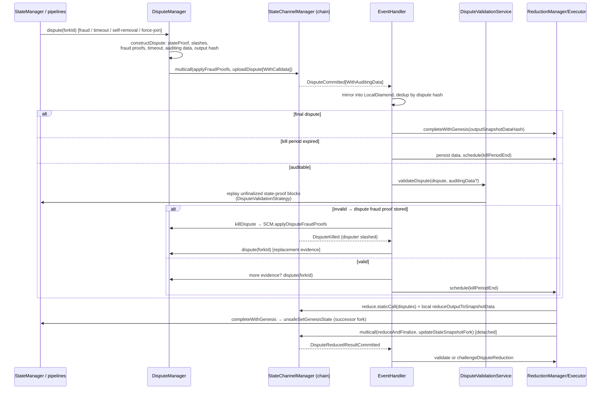

# Dispute Pipeline

> **Status:** Draft, reverse-engineered baseline. Pending engineer review.
> **Scope:** The SDK side of disputes: intake from local escalation and chain
> events, dispute construction, audit (validity/authorization checks, state
> proofs, replay), dispute fraud proofs and kills, timeout and forced-inclusion
> handling, slash-set updates, reduction and successor-fork creation,
> persistence, and return to normal execution — including the algorithmic
> relationship between each SDK step and the contract facets. Protocol model:
> [../protocol/disputes.md](../protocol/disputes.md),
> [../protocol/fraud-proofs.md](../protocol/fraud-proofs.md),
> [../protocol/state-proofs.md](../protocol/state-proofs.md); contract side:
> [../contracts/manager-and-facets.md](../contracts/manager-and-facets.md).

## 1. Purpose & observable contract

The pipeline has three roles, all embodied by every honest participant:

- **Disputer** — constructs and uploads a dispute when off-chain cooperation
  broke (timeout, observed fraud, self-removal, forced join inclusion).
- **Auditor** — validates every dispute committed on-chain by others; an
  invalid dispute is _killed_ with a dispute fraud proof during its kill
  period; a valid one is persisted and, if the auditor holds more evidence, is
  answered with the auditor's own dispute.
- **Reducer** — after the window's kill period, deterministically reduces the
  window's disputes to one successor fork, installs its genesis locally, and
  submits `reduceAndFinalize` + the fork snapshot update on-chain.

Guarantee: every dispute path ends in a canonical successor fork adopted by
`unsafeSetGenesisState` (mandatory successor fork, review §24), with valid
carried-forward state; the reduction result is order-independent so concurrent
reducers converge (INV-DVP-4).

## 2. Overview

## 3. Intake

### 3.1 Local escalation (disputer role)

Every trigger calls [`DisputeManager.dispute(forkId)`](../../../../src/disputeManager/DisputeManager.ts),
which is mutexed and idempotent per fork (`didIDispute` flag):

| Trigger                                                                                                         | Site                                                                                              | Dispute input it contributes                                                                                                                     |
| --------------------------------------------------------------------------------------------------------------- | ------------------------------------------------------------------------------------------------- | ------------------------------------------------------------------------------------------------------------------------------------------------ |
| Objective block fraud (double sign, invalid transition, wrong genesis, forged inbound block, invalid timestamp) | Block pipeline strategies ([block-confirmation-pipeline.md](./block-confirmation-pipeline.md) §9) | Fraud proof stored in [`FraudProofStorage`](../../../../src/storage/FraudProofStorage.ts); applied in the dispute multicall → on-chain slash set |
| Participant timeout                                                                                             | [`StateManager.tryTimeoutParticipant`](../../../../src/stateManager/StateManager.ts) (§3.2)       | `TimeoutStruct` stored in [`TimeoutStorage`](../../../../src/storage/TimeoutStorage.ts)                                                          |
| Voluntary self-removal (exit without N/N signatures)                                                            | `startMaybeExitOnChain` slow path                                                                 | `selfRemoval = true` via [`ForceExitStorage`](../../../../src/storage/ForceExitStorage.ts)                                                       |
| Forced inbound inclusion (join ignored for N+1 blocks)                                                          | `maybeInitiateForceJoinDispute`                                                                   | `latestInboundMessageBlockHash/Height` newer than the fork's applied tip                                                                         |
| On-chain slash observed on an undisputed fork                                                                   | `EventHandler.onChainSlashed`                                                                     | `onChainSlashes`                                                                                                                                 |
| Dispute killed, window empty                                                                                    | `EventHandler.onDisputeKilled`                                                                    | replacement evidence (first upload wins; `RaceConditionDisputeEvidencePeriodExpired` tolerated)                                                  |
| Reduction found an empty window                                                                                 | `ReductionExecutor.tryReduceLocked`                                                               | own view of the fork                                                                                                                             |
| Auditor holds more evidence than a valid observed dispute                                                       | `EventHandler.canConstructMoreEvidence`                                                           | merged evidence                                                                                                                                  |

### 3.2 Timeout detection detail

`tryTimeoutParticipant(forkId, height, participant)` (scheduled after every
committed block and after `setLatestState`):

1. Skip if the target is us, we are not a participant, or the block exists.
2. Compute `timeoutMinTimestamp = previousRelevantTimestamp + p2pTime + agreementTime + chainFallbackTime (+ height-0 grace)`;
   reschedule if not yet due.
3. If a dispute window already exists and opened **before** the timeout became
   valid, do not submit (the on-chain
   `RaceConditionDisputeTimeoutWindowCreatedTooEarly` guard repeats this
   authoritatively).
4. Race checks against calldata: recover the _previous_ block's on-chain post
   (it may grant the target extra time → reschedule), then check the _target_
   slot's commitment via `getBlockCallDataCommitment` (LocalDiamond, then chain
   recovery). A commitment that exists while the block pipeline did not accept
   the block yields a **forced** timeout (`isForced = true`); no commitment
   yields a normal timeout.
5. Build the `TimeoutStruct` (participant, height, `minTimeStamp`, `isForced`,
   previous producer, whether the previous producer posted calldata, and the
   target's signature on the previous block — signing it forfeits the extra
   time), persist it, and call `dispute(forkId)`.

### 3.3 Chain intake (auditor role)

Disputes never arrive over peer RPC; the chain is the source of truth. The
listener pipeline ([components.md](./components.md) §6) delivers
`DisputeCommitted` / `DisputeCommittedWithAuditingData` to
[`EventHandler.onDisputeCommitted`](../../../../src/eventHandlers/EventHandler.ts),
deduplicated per dispute hash by an in-flight promise map. The handler first
mirrors the event into the `LocalDiamond`, then applies a relevance gate: the
dispute's fork must be the current fork, or (for final disputes) a fork with an
in-progress reduction operation — late non-final events for resolved forks are
ignored. Relevant disputes clear the fork's block queue and trigger a one-time
`IsForkDisputedService.requestDisputeAcknowledgment` round (peers that refuse
or ignore the acknowledgment are disconnected; peers later caught building on
the acknowledged dead fork are blacklisted).

## 4. Dispute construction

[`DisputeManager.constructDispute(forkId)`](../../../../src/disputeManager/DisputeManager.ts)
assembles `ConstructDisputeResult = { dispute, disputeConfirmation, auditingData, fraudProofsToApply }`:

1. **State proof.** [`AgreementManager.getStateProof`](../../../../src/agreementManager/AgreementManager.ts)
   for the fork's latest stored height: milestones at every participant-set
   change point plus a latest-state milestone when threshold coverage exists;
   otherwise the linked `signedBlocks` suffix back to the last finality anchor
   ([../protocol/state-proofs.md](../protocol/state-proofs.md)).
2. **Slash set.** `LocalDiamond.getOnChainSlashedParticipants ∩ participants`;
   for every participant not yet slashed on-chain that we hold a local fraud
   proof for, the proof joins `fraudProofsToApply` and the participant joins
   the dispute's `onChainSlashes` — the multicall applies the proofs first, so
   the dispute's claimed set is a subset of the on-chain set when it executes
   (separation of fraud-proof enforcement from reduction, review §25).
3. **Timeout** from storage, or the empty struct.
4. **Auditing data** (`getAuditingData`): genesis `SnapshotData`, one snapshot
   per milestone, the latest state snapshot, the latest _finalized_ state's
   encoded machine state, and the inbound/outbound message-block ranges linking
   snapshot tips. `isPartial` (anything missing locally) aborts construction.
5. **Output commitment.** `LocalDiamond.computeDisputeOutputSnapshotData.staticCall(input, latestSnapshot, latestState, inboundBlocks)`
   computes the successor-fork genesis `SnapshotData`; its hash becomes
   `outputSnapshotDataHash`. The dispute thereby pre-commits to its own
   reduction outcome.
6. **`postedAuditingData` = `!SCM.isLastMilestoneFinalByEveryone(dispute)`** —
   auditing data is posted as calldata only when the proof's final anchor is
   not already known-final to everyone (data availability for auditors).
   A code TODO flags re-evaluating this under early finalization.
7. Sign the encoded dispute (`SignatureUtils.signDispute`) →
   `DisputeConfirmation` with an empty co-signature list.

**Submission.** With fraud proofs: `SCM.multicall([applyFraudProofs, uploadDispute[WithCalldata]])`;
without: the plain upload (gas limit 2.5M). Race reverts are classified:
`ErrorCantParticipateInDispute` (we are slashed — warn),
`RaceConditionDisputeTimeoutWindowCreatedTooEarly` (no-op),
`RaceConditionDisputeEvidencePeriodExpired` (rethrown — evidence window
closed). On failure the `didIDispute` flag is rolled back so a later attempt
can retry.

## 5. Audit: validity and authorization checks

[`DisputeValidationService.validateDispute`](../../../../src/stateManager/DisputeValidationService.ts)
returns `false` iff a [`DisputeFraudProof`](../../../../src/stateManager/utils/DisputeFraudProofService.ts)
was stored — the caller then kills the dispute. Checks run in order; every
predicate that also exists in Solidity is evaluated by `staticCall` against the
canonical implementation so the off-chain auditor can never disagree with the
on-chain apply-handler (INV-DVP-2):

| #   | Check                                                                    | Canonical predicate                                                                                                                                                                                                                                            | Fraud proof on failure                          |
| --- | ------------------------------------------------------------------------ | -------------------------------------------------------------------------------------------------------------------------------------------------------------------------------------------------------------------------------------------------------------- | ----------------------------------------------- |
| 1   | Inbound hash is a real on-chain inbound tip                              | `isDisputeInboundHashValid` (LocalDiamond, then chain re-check)                                                                                                                                                                                                | `DisputeInboundHashNotInChain`                  |
| 2   | State proof decodes                                                      | `StateProof.tryFrom` (undecodable + posted data → invalid state proof; undecodable + no posted data → **no fireable proof**, audit skipped as valid)                                                                                                           | `DisputeInvalidStateProof`                      |
| 3   | Proof header matches input                                               | `SCM.hasStateProofHeaderMismatch`                                                                                                                                                                                                                              | `DisputeStateProofHeaderMismatch`               |
| 4   | Block structure in proof                                                 | `LocalDiamond.findFirstInvalidBlockStructureInStateProof`                                                                                                                                                                                                      | `DisputeInvalidBlockStructure(blockIndex)`      |
| 5a  | Posted auditing data: proof verifies                                     | `SCM.verifyStateProof(dispute, auditingData)` (revert = false)                                                                                                                                                                                                 | `DisputeInvalidStateProof`                      |
| 5b  | No posted data: last milestone final by everyone                         | `SCM.isLastMilestoneFinalByEveryone`                                                                                                                                                                                                                           | `DisputeLastMilestoneNotFinalAndNoAuditingData` |
| 5c  | No posted data: anchor available locally                                 | `isLastMilestoneStoredLocally` — if not, audit is skipped as valid (cannot judge without the baseline)                                                                                                                                                         | —                                               |
| 6   | Replay                                                                   | §5.1                                                                                                                                                                                                                                                           | per-block proofs                                |
| 7   | Latest state consistent with replayed proof (no posted data)             | `SCM.isCorrectLatestState`                                                                                                                                                                                                                                     | `DisputeInvalidStateProof`                      |
| 8   | Claimed slashes ⊆ on-chain slash set                                     | `LocalDiamond.getOnChainSlashedParticipants`, re-checked against the chain before proving                                                                                                                                                                      | `DisputeOnChainSlashesNotSubset`                |
| 9   | Balance invariant on the latest snapshot                                 | `SCM.verifyBalanceInvariantCheckSnapshot` ([../protocol/cross-layer-messages.md](../protocol/cross-layer-messages.md))                                                                                                                                         | `DisputeInvalidBalanceInvariant`                |
| 10  | Disputer used its latest state                                           | disputer's latest signed block (local storage) vs claimed height                                                                                                                                                                                               | `DisputeNotLatestState(block, signature)`       |
| 11  | Timeout block: linked to proof tip                                       | `LocalDiamond.getLatestBlockFromStateProof` height + 1                                                                                                                                                                                                         | `TimeoutNotLinkedToLatestState`                 |
| 12  | Timeout: target is next leader                                           | `peekNextToWrite(latestState)` on the dispute state machine                                                                                                                                                                                                    | `TimeoutParticipantNotNext`                     |
| 13  | Timeout: not too early                                                   | window creation timestamp `<` previous relevant timestamp + wait time (strict `<`, mirroring `DisputeFraudProofFacet._handleTimeoutTooEarly`; equality accepts) — extra time is forfeited only if the target's posted signature on the previous block verifies | `TimeoutTooEarly`                               |
| 14  | Timeout: target not already N/N-signed                                   | `block.didEveryoneSign(participantsUnion)`                                                                                                                                                                                                                     | `TimeoutThreshold`                              |
| 15  | Timeout: target posted the block as calldata                             | build `TimeoutCalldataPosted` and **preflight** with `SCM.validateTimeoutCalldataPostedProof` — an auditor must never submit a proof that would slash itself                                                                                                   | `TimeoutCalldataPosted`                         |
| 16  | Dispute states a reason (timeout, slashes, self-removal, forced inbound) | `LocalDiamond.hasDisputeReason` (review §30's complete input set)                                                                                                                                                                                              | `InvalidDisputeReason`                          |
| 17  | Output correct                                                           | `isDataLinkedToDisputeInput` sanity (snapshot hash, state hash, proof tip, inbound chain), then `LocalDiamond.isDisputeOutputCorrect`                                                                                                                          | `DisputeInvalidOutputState`                     |

### 5.1 Replay of the unfinalized proof suffix

`LocalDiamond.getUnfinalizedBlockConfirmationsFromStateProof` yields the blocks
past the last final anchor. Each runs through the **block-confirmation
pipeline** with a per-block
[`DisputeValidationStrategy`](../../../../src/stateManager/validationStrategy/DisputeValidationStrategy.ts)
(`blockIndexInUnfinalizedPartOfStateProof` recorded for the proof): live
fork/ordering gates are off, the state machine is repositioned to each block's
previous snapshot before the leader check, and deviations map to dispute fraud
proofs — `DisputeInvalidBlockInStateProofApplyFraudProof` (wrapping the
ordinary block fraud proof for invalid transitions, wrong genesis, forged
inbound blocks, invalid timestamps), `DisputeInvalidBlockStructure`
(authentication/linkage deviations, but only when the canonical Solidity
structure predicate also fails — a local linkage gap alone must not kill an
honest dispute), `DisputeBlockAuthorNotParticipant`. A double sign discovered
during replay stores an ordinary fraud proof and **continues** (the dispute may
still be honest; a code TODO notes the proof should be applied without opening
a new dispute). A replay returning `false` without a stored dispute fraud proof
is an internal error (throws).

## 6. Audit outcome handling

In [`EventHandler.handleDisputeCommitted`](../../../../src/eventHandlers/EventHandler.ts):

- **Final dispute** (`isFinal`, i.e. the contract marked the window decided):
  no audit — persist the confirmation, derive auditing data locally if not
  posted, compute the successor genesis via
  `computeDisputeOutputSnapshotData` + `computeDisputeOutputState`
  (staticCalls), and complete the fork's reduction operation with
  `reducedForkId = dispute.outputSnapshotDataHash`. Non-participants that
  cannot assemble the data abort (spectators fail closed).
- **Kill period expired** (window exists, `isKillPeriodExpired`): challenging
  is forbidden, so persist everything available
  (`persistDisputeDataWithoutAudit` with unfinalized blocks) and schedule
  reduction at `killPeriodEnd`.
- **Auditable**: run §5. Invalid → the stored dispute fraud proof is submitted
  by [`DisputeManager.killDispute`](../../../../src/disputeManager/DisputeManager.ts)
  via `SCM.applyDisputeFraudProofs([proof])`, guarded by a fresh
  `isKillPeriodExpired` read and tolerant of the kill races
  (`RaceConditionDisputeKillPeriodExpired`, `RaceConditionOnChainSlashes`,
  `RaceConditionGenesisTimestampNotAvailable`,
  `RaceConditionUnexpectedBlockCalldataPosted`). The kill is deliberately
  sequential: it must mine before any counter-dispute so the killed disputer
  appears in `onChainSlashes` and the counter-dispute has a stated reason
  (code TODO: fold into one multicall). **Open question:** the counter-dispute
  after a kill is currently disabled in code (commented out) in favor of
  reacting to the `DisputeKilled` event; whether kill+re-dispute should be one
  atomic multicall is unresolved.
  Valid → persist the confirmation, notify (`notifyDisputeUpdate`), then
  `canConstructMoreEvidence`: construct our own dispute and compare
  `reduce([theirs])` with `reduce([ours, theirs])` on the `LocalDiamond`; a
  difference means our evidence changes the outcome → upload our dispute
  (evidence accumulation). Otherwise schedule reduction at `killPeriodEnd`.

**`DisputeKilled` event** ([`onDisputeKilled`](../../../../src/eventHandlers/EventHandler.ts)):
record the killed disputer in the local slash mirror
(`onOnChainSlashAdded` — the kill _is_ the slash), mirror `onDisputeKilled`,
disconnect/blacklist the disputer, and if the window is now empty and the fork
is current, upload replacement evidence (first honest peer wins).

**`ChainSlashed` event**: mirror the slash, blacklist the peer, and open a
dispute on the current fork if it is not yet disputed and the slashed address
is still a participant.

## 7. Reduction and successor-fork creation

[`ReductionManager`](../../../../src/stateManager/reduction/ReductionManager.ts) /
[`ReductionExecutor`](../../../../src/stateManager/reduction/ReductionExecutor.ts) /
[`ReductionComputationService`](../../../../src/stateManager/reduction/ReductionComputationService.ts):

1. **Trigger.** Scheduled at `killPeriodEnd` per §6; also from the block
   pipeline's fork-recovery gate, from `onStateSnapshotUpdated` convergence,
   and from `onDisputeReducedResultCommitted`. All attempts serialize on the
   executor's attempt mutex; per fork there is exactly one shared completion
   promise (single successor-fork installation).
2. **Preconditions** (re-checked at run time): fork still current; window
   exists on-chain; kill period expired (memoized per `(channel, fork)` —
   "not expired until `killPeriodEnd`" is reused, "expired" is terminal).
3. **Dispute set.** [`EventSyncService.loadSynchronizedWindowCommitments`](../../../../src/stateManager/EventSyncService.ts):
   the window's commitments from the chain, with any dispute whose event never
   reached us recovered by targeted log queries (3 attempts, widening span)
   — a reducer never reads a window its storage cannot back. Empty window →
   upload our own dispute instead.
4. **Compute.** `SCM.reduce.staticCall(disputes)` (order-independent
   deterministic reduction, [../protocol/disputes.md](../protocol/disputes.md))
   → `ReduceOutput`; `AgreementManager.getReduceData` resolves the reduced
   latest snapshot, machine state, and the inbound range consumed by the
   reduction; `LocalDiamond.reduceOutputToSnapshotData.staticCall` turns it
   into the successor genesis `SnapshotData`, encoded state, and terminal
   outbound message block. `reducedForkId = keccak(encode(reducedSnapshotData))`.
5. **Simulate then install then submit.**
   `multicall.staticCall([reduceAndFinalize, updateStateSnapshotFork])` first;
   races classify as `already-reduced` (`RaceConditionDisputeAlreadyReduced`,
   `RaceConditionBlockHeightTooOld` — deterministic reduction means another
   reducer installed the same result) or `superseded` (a final dispute's
   output won; stand down). Then
   `completeWithGenesis` installs the successor genesis under the
   `StateManager` mutex via `unsafeSetGenesisState` — the point where the fork
   transitions, queues drain, status and timeout scheduling restart — and only
   then is the transaction submitted **detached**. A completion that resolves
   to a different `reducedForkId` than expected is fatal (`abort`).
6. **Final-dispute fast path.** A final dispute completes the same per-fork
   operation directly with its pre-committed output (§6), skipping compute and
   submit.

**Reduction challenge.** On `DisputeReducedResultCommitted`
([`onDisputeReducedResultCommitted`](../../../../src/eventHandlers/EventHandler.ts)):
mirror into the LocalDiamond; if relevant and the challenge period expired →
`tryReduce` (adopt). Otherwise recompute locally; a mismatching
`reducedForkId` → `SCM.challengeDisputeReduction(disputes, latestSnapshot, state, inboundBlocks)`
(detached; tolerant of `ErrorCantParticipateInDispute`) and the dishonest
reducer is blacklisted. A locally unavailable dispute set means the reduction
was already consumed — treated as processed.

**Snapshot advancement.** After the successor fork is uncontestable,
[`SnapshotUpdateService`](../../../../src/stateManager/snapshotUpdate/SnapshotUpdateService.ts)
walks the on-chain snapshot's fork through `getReducedResult` /
`isReduceChallengePeriodExpired` hops to the first undisputed fork, builds
`updateStateSnapshotFork` calldata (with the outbound message-block range the
chain has not yet processed — incremental withdrawal processing, review §26),
chains an `updateStateSnapshotSameFork` for newer finalized milestones, and
multicalls both. This is also the N/N exit path of the block pipeline.

## 8. Persistence and return to normal execution

- [`DisputeStorage`](../../../../src/storage/DisputeStorage.ts): confirmations
  by commitment, the per-fork `didIDispute` flag.
- [`DisputeFraudProofStorage`](../../../../src/storage/DisputeFraudProofStorage.ts):
  one dispute fraud proof per dispute (the audit stops at the first).
- `persistDisputeDataWithoutAudit` imports proof-carried snapshots, machine
  states, message blocks, and (optionally) unfinalized blocks with
  `justPersist` — persistence without advancing the fork's max height, so
  imported history never masquerades as live progress.
- Return to execution: `unsafeSetGenesisState` → `setLatestState` sets the new
  `forkId` (clearing queue-recovery gates), recomputes status from the new
  participant set (a removed/slashed participant drops to `SYNCED`; a snapshot
  that excludes us entirely triggers `abort` via `onStateSnapshotUpdated`),
  fires `onSetState`/`onTurn`, schedules the next author timeout, and drains
  queued blocks. Valid non-final transitions from the old fork are carried
  forward inside the reduction output, not replayed by the SDK.

## 9. Assumptions, constraints & dependencies

- Chain events are observed through the single configured provider; dispute
  audit deadlines (kill period) therefore inherit the RPC availability
  assumption ([../security/trust-model.md](../security/trust-model.md)). The
  executor code marks provider failure during reduction as fatal.
- The auditor can only audit what it can anchor: a dispute over data the
  auditor never held (no posted auditing data, anchor not in storage) is
  skipped as valid rather than killed — honest-peer coverage relies on at
  least one peer holding the data (review §10).
- Time windows (`evidenceTime`, kill period, challenge period) come from the
  contracts; the SDK never computes its own authority over them, it reads
  `isKillPeriodExpired` / `isReduceChallengePeriodExpired`.
- All dispute-path staticCall predicates run against the `LocalDiamond`
  mirror, whose freshness depends on processed events; checks where staleness
  could cause a wrong slash re-verify against the chain (slash subset, inbound
  hash, kill-period reads).

## 10. Invariants & failure behavior

- **INV-DVP-1** — `dispute(forkId)` is idempotent per fork per instance
  (`didIDispute`), and a failed upload rolls the flag back.
- **INV-DVP-2** — The auditor never submits a proof the contracts would
  reject: every kill decision is grounded in the canonical Solidity predicate
  (staticCall), and self-slashing proof types are preflighted
  (`validateTimeoutCalldataPostedProof`).
- **INV-DVP-3** — An audit that returns "invalid" has stored exactly one
  dispute fraud proof; returning invalid without one is an internal error
  (throws), never a silent kill attempt.
- **INV-DVP-4** — Reduction is deterministic and order-independent over the
  window's dispute set; concurrent reducers converge on one `reducedForkId`,
  and race reverts are classified as convergence, not failure.
- **INV-DVP-5** — Every initiated dispute path terminates in a successor fork
  installed via `unsafeSetGenesisState` (final dispute, own reduction, or
  adoption of another's finalized reduction).
- **INV-DVP-6** — Fraud-proof enforcement is separate from reduction: proofs
  slash into the on-chain set (multicall before upload, or immediate kill);
  the dispute consumes the set, it does not re-execute proofs (review §25).
- **Failure behavior.** Fatal reduction errors, unpreparable final-dispute
  genesis as a participant, or a completed reduction that mismatches the
  expected fork call `stateManager.abort()`. Non-participants abort instead of
  throwing. Unclassified submission reverts are logged with the candidate's
  inbound chain and rethrown.

## 11. Verification

Unit/component: [test/unit/DisputeManager.test.ts](../../../../test/unit/DisputeManager.test.ts),
[test/unit/ReductionExecutor.test.ts](../../../../test/unit/ReductionExecutor.test.ts),
[test/stateManager/ReductionManager.test.ts](../../../../test/stateManager/ReductionManager.test.ts),
[test/stateManager/DisputeValidationStrategy.test.ts](../../../../test/stateManager/DisputeValidationStrategy.test.ts),
[test/stateManager/DisputeReductionStaleEvent.test.ts](../../../../test/stateManager/DisputeReductionStaleEvent.test.ts),
[test/stateManager/SnapshotUpdateService.test.ts](../../../../test/stateManager/SnapshotUpdateService.test.ts),
[test/storage/DisputeStorage.test.ts](../../../../test/storage/DisputeStorage.test.ts).
End-to-end: [E2E-DisputeManager](../../../../test/e2e/E2E-DisputeManager.test.ts),
[E2E-FinalDispute](../../../../test/e2e/E2E-FinalDispute.test.ts),
[E2E-ReductionManager](../../../../test/e2e/E2E-ReductionManager.test.ts),
[E2E-Timeouts](../../../../test/e2e/E2E-Timeouts.test.ts),
[E2E-ForceJoinDispute](../../../../test/e2e/E2E-ForceJoinDispute.test.ts),
[E2E-StaleMembershipDispute](../../../../test/e2e/E2E-StaleMembershipDispute.test.ts),
the per-proof-type kill suites under
[test/e2e/disputeValidation](../../../../test/e2e/disputeValidation)
(balance invariant, inbound hash, not-latest-state, output state, state-proof
structure/genesis linkage, future block, upload reverts), and permutation
fuzzing in [E2E-Fuzz-Dispute-MVP](../../../../test/e2e/E2E-Fuzz-Dispute-MVP.test.ts)
plus [test/e2e/fuzz](../../../../test/e2e/fuzz) (order-independence evidence
for INV-DVP-4).
Gaps: no test for the audit-skip paths (undecodable proof without posted data;
anchor unavailable locally); no adversarial RPC test for kill-deadline misses.

## Future Work

_Non-normative._

- Atomic kill + replacement dispute in one multicall, carrying the expected
  slash so the counter-dispute cannot be constructed empty (code TODOs in
  `EventHandler.handleDisputeCommitted`).
- Apply fraud proofs discovered during replay without opening a new dispute
  (`DisputeValidationStrategy.doubleSignDetected` TODO).
- Optimistic reduction: commit only the reduced-result hash and finalize after
  a challenge period, and a fast path with threshold peer attestation
  (review §32).
- Re-evaluate `postedAuditingData` under early finalization, and the
  cross-audit race where calldata is posted after a kill decision (code TODOs).
- Resolve the penalty model for submitting an invalid _fraud proof_ (as
  opposed to an invalid dispute) — open per review §25.

## Traceability

| ID        | Statement                                                                                                   | Implementation                                                                                                                                                                                                                        | Verification evidence                                                                                                                                                                                                                                                    |
| --------- | ----------------------------------------------------------------------------------------------------------- | ------------------------------------------------------------------------------------------------------------------------------------------------------------------------------------------------------------------------------------- | ------------------------------------------------------------------------------------------------------------------------------------------------------------------------------------------------------------------------------------------------------------------------ |
| INV-DVP-1 | Per-fork dispute idempotence with rollback on failed upload.                                                | [src/disputeManager/DisputeManager.ts](../../../../src/disputeManager/DisputeManager.ts) (`dispute`)                                                                                                                                  | [test/e2e/E2E-DisputeManager.test.ts](../../../../test/e2e/E2E-DisputeManager.test.ts)                                                                                                                                                                                   |
| INV-DVP-2 | Kill decisions are grounded in canonical Solidity predicates; self-slashing proofs are preflighted.         | [src/stateManager/DisputeValidationService.ts](../../../../src/stateManager/DisputeValidationService.ts) (staticCalls, `validateTimeoutCalldataPostedProof`)                                                                          | [test/e2e/disputeValidation](../../../../test/e2e/disputeValidation) suites                                                                                                                                                                                              |
| INV-DVP-3 | Invalid audit ⇔ exactly one stored dispute fraud proof.                                                     | `validateDispute` + `hasStoredDisputeFraudProof` throw paths                                                                                                                                                                          | [test/stateManager/DisputeValidationStrategy.test.ts](../../../../test/stateManager/DisputeValidationStrategy.test.ts)                                                                                                                                                   |
| INV-DVP-4 | Deterministic, order-independent reduction; races classified as convergence.                                | [src/stateManager/reduction](../../../../src/stateManager/reduction) (`classifyReductionRace`, `compute`)                                                                                                                             | [test/e2e/E2E-Fuzz-Dispute-MVP.test.ts](../../../../test/e2e/E2E-Fuzz-Dispute-MVP.test.ts), [test/unit/ReductionExecutor.test.ts](../../../../test/unit/ReductionExecutor.test.ts)                                                                                       |
| INV-DVP-5 | Every dispute path installs a successor fork via `unsafeSetGenesisState`.                                   | [src/stateManager/reduction/ReductionManager.ts](../../../../src/stateManager/reduction/ReductionManager.ts) (`completeWithGenesis`), [src/eventHandlers/EventHandler.ts](../../../../src/eventHandlers/EventHandler.ts) (final path) | [test/e2e/E2E-FinalDispute.test.ts](../../../../test/e2e/E2E-FinalDispute.test.ts), [test/e2e/E2E-ReductionManager.test.ts](../../../../test/e2e/E2E-ReductionManager.test.ts)                                                                                           |
| INV-DVP-6 | Fraud proofs slash before/independently of the dispute that consumes the slash set.                         | `constructDispute` multicall ordering; `killDispute`                                                                                                                                                                                  | [test/e2e/E2E-FraudProofsBlockConfirmation.test.ts](../../../../test/e2e/E2E-FraudProofsBlockConfirmation.test.ts)                                                                                                                                                       |
| REQ-DVP-1 | Timeout submission respects precedence/race guards (existing window age, calldata grants, forced timeouts). | [src/stateManager/StateManager.ts](../../../../src/stateManager/StateManager.ts) (`tryTimeoutParticipant`)                                                                                                                            | [test/e2e/E2E-Timeouts.test.ts](../../../../test/e2e/E2E-Timeouts.test.ts)                                                                                                                                                                                               |
| REQ-DVP-2 | The reducer reads the dispute window through event-synchronized storage (never a window it cannot back).    | [src/stateManager/EventSyncService.ts](../../../../src/stateManager/EventSyncService.ts) (`loadSynchronizedWindowCommitments`, `ensureDisputesProcessed`)                                                                             | [test/stateManager/EventSyncService.test.ts](../../../../test/stateManager/EventSyncService.test.ts)                                                                                                                                                                     |
| REQ-DVP-3 | An incorrect committed reduction is challenged within the challenge period.                                 | [src/eventHandlers/EventHandler.ts](../../../../src/eventHandlers/EventHandler.ts) (`validateDisputeReductionAndChallenge`)                                                                                                           | [test/e2e/disputeValidation/reducedForkTimestampMismatch.test.ts](../../../../test/e2e/disputeValidation/reducedForkTimestampMismatch.test.ts), [test/stateManager/DisputeReductionStaleEvent.test.ts](../../../../test/stateManager/DisputeReductionStaleEvent.test.ts) |
