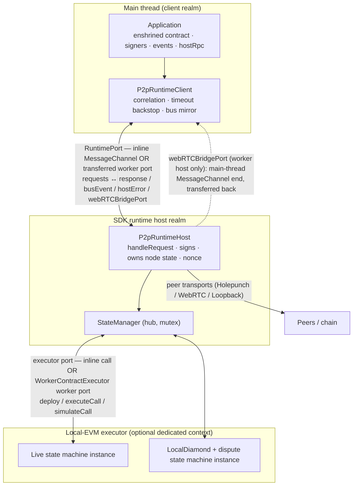

# Runtime & Concurrency — Transport-Neutral Workers

> **Status:** Draft, reverse-engineered baseline. Pending engineer review.
> **Scope:** The design decision behind the SDK's execution architecture:
> **transport neutrality between inline and worker deployment**. Communication
> between the main thread, the SDK runtime host, and the optional local-EVM
> executor is defined as serialized bidirectional messages over paired ports;
> the same protocol and observable behavior hold whether both endpoints share
> one context or one is transferred to a worker. This document owns the
> port/worker abstractions, the normative cross-boundary correctness rules, the
> concurrency model _between_ contexts, and the client-performance strategy.
> The request-type enumeration and the host/client startup sequence are
> summarized in [architecture.md](./architecture.md) §2.1 and are **not**
> repeated here — this is the deep treatment of the boundary those requests
> cross. The concurrency model _inside_ the host (the `StateManager` mutex) is
> owned by [block-confirmation-pipeline.md](./block-confirmation-pipeline.md)
> §3.1 and only related to here.

## 1. Purpose & observable contract

The SDK is client-side blockchain-node software running in TypeScript/V8
environments (Node.js or a browser). Real parallelism there comes from
**workers** plus **message passing**. V8 _can_ expose shared mutable memory
across contexts (`SharedArrayBuffer` + `Atomics`, under each platform's
conditions), but this is a deliberate **SDK design constraint, not a platform
limitation**: the protocol MUST NOT depend on shared mutable memory between the
main thread, the SDK runtime host, or the local-EVM executor. Every
inter-context interaction is a serialized message. This keeps a component's
communication contract identical whether it runs inline or in a worker
(REQ-RUN-1), which is the property the whole architecture rests on.

### 1.1 The core design decision (REQ-RUN-1)

**Transport neutrality between inline and worker deployment.** Communication
across a context boundary is defined once, as serialized bidirectional messages
over a **paired port** ([`RuntimePort`](../../../../src/evm/p2pRuntime/types.ts)
/ [`RuntimeChannel`](../../../../src/evm/p2pRuntime/types.ts)). The two
endpoints of a pair may:

- both live in one execution context — an **in-process** `MessageChannel` pair
  ([`createRuntimeChannel`](../../../../src/evm/p2pRuntime/node/P2pRuntimeChannel.ts)),
  or
- have one endpoint **transferred to a worker** — a transferable port
  ([`createTransferableChannel`](../../../../src/evm/p2pRuntime/node/P2pRuntimeChannel.ts)
  plus [`createP2pRuntimeWorker`](../../../../src/evm/p2pRuntime/node/P2pRuntimeWorkerRuntime.ts)).

The message protocol and the observable behavior are **identical in both
cases**. The consequences are the whole point of the design:

- Callers keep **no separate inline and worker implementations**. The same
  [`P2pRuntimeClient`](../../../../src/evm/p2pRuntime/P2pRuntimeClient.ts) drives
  the host over whichever port it is handed; the same
  [`startP2pRuntimeHost`](../../../../src/evm/p2pRuntime/P2pRuntimeHost.ts) runs
  the graph regardless of which side of the boundary it is on.
- A component **can move into a worker when profiling shows a real limit**,
  without changing its higher-level communication contract. The move is a
  configuration flag (§5), not a rewrite.

This is a **normative design decision**, not an incidental factoring. The
rationale is the SDK's no-shared-mutable-memory constraint (REQ-RUN-2): because
the design forgoes shared memory, isolation is _free of aliasing hazards_ but
_costs a serialization hop_; defining the boundary as message passing from the start
means the isolation decision can be deferred to where measurement justifies its
cost, instead of being baked into the type graph.

### 1.2 Observable contract of a port

[`RuntimePort`](../../../../src/evm/p2pRuntime/types.ts) is the minimal surface
that both a Node `worker_threads` `MessagePort` and a browser `MessagePort`
satisfy through a thin adapter (`adaptPort`):

| Member                     | Contract                                                                                                                              |
| -------------------------- | ------------------------------------------------------------------------------------------------------------------------------------- |
| `post(message, transfer?)` | Send one structured-clone-serializable message; optionally transfer ownership of transferables (a nested port).                       |
| `onMessage(handler)`       | Register the **single** inbound-message handler and begin dispatch.                                                                   |
| `start()`                  | Begin dispatching (no-op where implicit).                                                                                             |
| `onClose(handler)`         | Fire when the other end goes away. **Reliable on Node; best-effort in the browser** — callers keep a request timeout as the backstop. |
| `close()`                  | Tear down the port.                                                                                                                   |

`RuntimeChannel` is a linked pair `{port1, port2}`: `port1` stays local, `port2`
may be transferred. What each endpoint means is fixed by role, not by whether a
transfer happened — that invariance is exactly transport neutrality.

## 2. The three contexts and who owns what

Three execution contexts, connected only by serialized ports:

1. **Main thread (client realm).** Holds the application and
   [`P2pRuntimeClient`](../../../../src/evm/p2pRuntime/P2pRuntimeClient.ts). It
   **sends requests** (enshrined-contract calls, signer calls, channel
   lifecycle, `hostRpc`, `quiesce`, `dispose`) and **receives** responses, bus
   events, host errors, and — in worker mode — the WebRTC bridge port. It owns
   only client-realm proxy objects: the two client signers, a main-thread
   contract mirror, and the client `EventBus`. It owns **no node state**.
2. **SDK runtime host.** Built by
   [`startP2pRuntimeHost`](../../../../src/evm/p2pRuntime/P2pRuntimeHost.ts). It
   **owns the node state** (`StateManager` and everything it owns — managers,
   storage, RPC services, transports, event listener), **owns the signing key**,
   and **owns the chain nonce** (built on its own provider/wallet in
   [`RuntimeChainContext`](../../../../src/evm/p2pRuntime/RuntimeChainContext.ts),
   wrapped in `HostNonceManager`; cross-ref [architecture.md](./architecture.md)
   REQ-SDK-1 / INV-SDK-2). The client realm holds only proxy signers that forward
   over the port — **the private key never crosses a boundary** (INV-RUN-4).
3. **Local-EVM executor (optional dedicated context).** A contract executor
   ([`AContractExecutor`](../../../../src/evm/contractExecutor/AContractExecutor.ts))
   that isolates EVM execution behind its own request/response boundary. When
   `VM_DEDICATED_THREAD` is set it is a
   [`WorkerContractExecutor`](../../../../src/evm/contractExecutor/WorkerContractExecutor.ts)
   over a second worker port; otherwise it is an inline
   [`ContractExecutor`](../../../../src/evm/contractExecutor/ContractExecutor.ts)
   in the host context. It owns the EVM and **both** deployed state-machine
   instances plus the `LocalDiamond` (§2.2).

**Ownership rule (REQ-RUN-3).** Internal state is owned by the component that
**receives** the message defining it. The main thread cannot reach node state
except by sending a request; the host cannot reach EVM state except by calling
the executor; neither can observe the other's internals directly.
`P2pInstance.getStateManager()` throws in every mode precisely to keep this
boundary honest ([architecture.md](./architecture.md) INV-SDK-1).

Both worker boundaries are independent flags, so all four combinations exist and
are exercised together (§6): inline-host/inline-vm, inline-host/dedicated-vm,
worker-host/inline-vm, worker-host/dedicated-vm.

### 2.2 The two state-machine instances vs. the executor boundary

[architecture.md](./architecture.md) §4 (INV-SDK-3) defines two deployed
state-machine instances: the **live** instance driving replicated channel state,
and the **diamond** instance embedded in the `LocalDiamond` for dispute replay.
That split is a _logical_ separation to keep dispute replay from corrupting live
state. It is **orthogonal to the thread boundary**: both instances and the
`LocalDiamond` live behind the _same_ contract executor
([`buildRuntime`](../../../../src/evm/p2pRuntime/P2pRuntimeHost.ts) passes one
`contractExecutor` and both addresses to
`createStandaloneFromLocalStateMachineWithExecutor`). `VM_DEDICATED_THREAD` moves
the **whole EVM** — both instances — behind the executor worker; it never moves
one instance and leaves the other. Inside the host, the live instance is driven
under the `StateManager` mutex and the diamond instance during dispute replay;
to the executor these are just `executeCall`/`simulateCall` requests
distinguished by contract address.

## 3. Cross-boundary correctness rules (normative core)

§44 requires these rules to be **explicit before any component is moved into a
worker** (REQ-RUN-4): a boundary that is correct inline but underspecified is a
latent bug the day it becomes a real thread. For each dimension below, the
**current, as-implemented rule** is stated; unresolved points are marked
`**Open question:**` rather than guessed.

### 3.1 Ownership

State is owned by the receiving component (REQ-RUN-3, §2). The private key and
nonce counter never leave the host (INV-RUN-4). Config is **snapshotted and
shipped**, not re-derived across the boundary: `p2pSetup` resolves the config
once (precedence: overrides > `process.env` > `peer3.config.ts` > defaults,
[../reference/configuration.md](../reference/configuration.md)) into the
`SetupPayload`, and the worker re-establishes the identical singleton via
`createConfig(payload.config)`
([`startP2pRuntimeWorker`](../../../../src/evm/p2pRuntime/worker/startP2pRuntimeWorker.ts)).
A worker that re-read `process.env` could diverge from the main thread; it
deliberately does not.

### 3.2 Ordering & correlation (INV-RUN-2, REQ-RUN-5)

- **One handler per port.** `onMessage` registers a single dispatch function
  ([`P2pRuntimeHost`](../../../../src/evm/p2pRuntime/P2pRuntimeHost.ts)
  `onPortMessage`, [`P2pRuntimeClient`](../../../../src/evm/p2pRuntime/P2pRuntimeClient.ts)
  `handleMessage`). There is no second listener that could race it.
- **Correlation ids.** Every client→host request carries a `requestId` — a
  client-local monotonically increasing counter (`nextRequestId`), stamped in
  `P2pRuntimeClient.request`. The host echoes it in the `response` message; the
  pending-request map resolves/rejects exactly that entry. The executor boundary
  uses the same scheme with its own counter
  ([`WorkerContractExecutor`](../../../../src/evm/contractExecutor/WorkerContractExecutor.ts)).
- **Paired endpoints only.** Because the port pair is 1:1 and never a network,
  correlation needs no authenticity check — the only writer to the other end is
  the paired context. This is the **trusted-loopback** property (§7); contrast
  the peer-RPC `requestId` which additionally binds a peer identity
  ([rpc/README.md](./rpc/README.md) §6.5, INV-RPC-2).
- **Message order.** A `MessagePort` delivers messages to its single handler in
  send order (FIFO per port). The protocol relies on this for bus events, which
  are forwarded in emission order through the single bridge tap
  (`stateManager.events.setBridgeTap`, [architecture.md](./architecture.md) §5).
  **Open question:** no rule states the _relative_ ordering guarantee between a
  request's `response` and interleaved `busEvent`/`hostError` messages beyond
  per-port FIFO; consumers today do not depend on cross-kind ordering, but the
  guarantee is not written down. (Divergence class: documentation debt.)

### 3.3 Lifecycle

Startup is a fixed handshake, summarized in [architecture.md](./architecture.md)
§2.1: config → resolve signer → start host (inline or worker) → client connects
→ `deployStateMachine` runs **twice** through the deployment-bridge signer →
`deployComplete` triggers `buildRuntime` → host posts `ready` → `P2pInstance`
returned. The client's `ready` promise is the single readiness signal; a host
construction failure settles it rejected (§3.4). In worker mode a single
`WorkerBootstrapMessage {type:"connect", payload, port}` transfers the port into
the worker before the request protocol begins
([`onWorkerBootstrap`](../../../../src/evm/p2pRuntime/node/P2pRuntimeWorkerRuntime.ts)).

### 3.4 Error semantics (INV-RUN-3)

- **Request failures** return `{type:"response", ok:false, error}`. Errors are
  serialized by `serializeError` — `message`/`name`/`stack`, a contract revert's
  ABI `data` (recovered by `extractRevertData` so custom errors decode
  client-side), ethers metadata (`code`, `shortMessage`, `reason`,
  `transaction`, `receipt`, `info`), and an originating-peer stamp — and
  restored to a real `Error` by `deserializeError` on the client. The
  in-process peer-address stamp is carried explicitly because the non-enumerable
  property does not survive structured clone.
- **Host construction failure** posts a `hostError` and closes the port; the
  client's unsettled `ready` rejects and all pending requests reject
  (`dispatchHostError`). A provider-creation failure before the graph exists is
  handled the same way ([`startP2pRuntimeHost`](../../../../src/evm/p2pRuntime/P2pRuntimeHost.ts)
  early `catch`).
- **Autonomous host errors** (a worker `unhandledRejection`/`uncaughtException`
  not tied to a request) are funnelled over the port as `hostError`
  ([`onUnhandledWorkerError`](../../../../src/evm/p2pRuntime/node/P2pRuntimeWorkerRuntime.ts)).
  After `ready`, they go to `onHostError` listeners; with **no** listener they
  re-throw as a main-thread unhandled rejection, so a worker fault surfaces the
  same way an inline host's would.
- **Dead client port** triggers host self-disposal via `port.onClose`.

### 3.5 Disposal

- **Graceful:** `P2pInstance.dispose()` → `client.dispose()` sends a `dispose`
  request with **no timeout** (`timeoutMs: null`), lets the host tear down its
  graph and reply, then closes the port and (worker mode) awaits
  `worker.shutdown()`. Disposal owns its own bounds because the generic 30 s
  request timeout could otherwise force shutdown while provider/transport
  handles are still closing.
- **Worker drain, never force-stop.** A worker is _never_ terminated: after
  replying to `dispose` it closes its remaining handles
  ([`closeWorkerBootstrapPort`](../../../../src/evm/p2pRuntime/node/P2pRuntimeWorkerRuntime.ts))
  and the thread ends when the loop drains
  ([`createWorkerShutdown`](../../../../src/evm/node/workerShutdown.ts) waits on
  `exit` with no timeout). The recorded reason: `terminate()`,
  worker-side `process.exit()`, or exiting the process with a live worker all
  abort the whole process with `uv_loop_close() while having open handles` when
  close callbacks are pending (observed on Node 22.12/22.17 under parallel-test
  load). A stuck drain is deliberately surfaced as a visible hang that names the
  leaking teardown rather than converted into a process abort.
- **`StateManager.abort()`** disposes the manager graph but does **not** close
  the runtime control port, so a disposed peer can still answer host-RPC
  queries. **Open question:** whether abort must also close the port
  ([architecture.md](./architecture.md) §7; tracked in
  [OQ-25](../open-questions.md)).

### 3.6 Serialization limits

Messages cross by **structured clone** (`postMessage`), with two protocol-level
encodings layered on top for values structured clone handles poorly or that must
be canonical:

- **Bigints.** ethers transaction fields cross as decimal/quantity strings
  ([`chainSignerSerialization`](../../../../src/evm/p2pRuntime/chainSignerSerialization.ts):
  `toQuantity`/`getBigInt` over the `BIGINT_FIELDS` set). Protocol structs cross
  as canonical `Codec.encode` strings and are decoded inside the host endpoint
  (`joinChannel`/`topUpBalance`/`collectJoinChannelConfirmation` use
  `Codec.decode`/`encode` with `Type.*`), the same discipline the peer-RPC
  boundary enforces ([rpc/README.md](./rpc/README.md) §6.3, REQ-RPC-4).
- **What cannot cross.** Custom transaction data (`tx.customData`) and KZG
  functions (`tx.kzg`) are rejected with an explicit
  `UNSUPPORTED_OPERATION` assert before the hop. Class instances cannot be
  transferred, which is why the **custom RPC root** and **custom precompiles**
  cross as _manifests_ (module specifier + export name), resolved inside the
  host realm ([rpc/README.md](./rpc/README.md) §2.5), not as constructed
  objects. `ethers.Signer` objects are intentionally unsupported for the same
  reason ([architecture.md](./architecture.md) REQ-SDK-1).
- **Transferables.** Only two things are transferred (ownership moved, not
  cloned): the runtime port itself at bootstrap, and the **WebRTC bridge port**
  (§4).
- **Best-effort clone with silent loss.** Bus-event handler `args` are a
  best-effort clone and arrive **empty when not serializable**
  ([`worker/protocol.ts`](../../../../src/evm/p2pRuntime/worker/protocol.ts)
  `RuntimeBusEventMessage`); and a main-thread contract subscription that filters
  on an _indexed_ argument (`contract.filters.X(indexedValue)`) will **not**
  match, because only `{name, args}` are forwarded, not the original ethers
  topics ([`P2pRuntimeClient`](../../../../src/evm/p2pRuntime/P2pRuntimeClient.ts)
  `attachContractEvents` comment). **Open question:** whether silent arg-loss and
  the indexed-filter gap are acceptable or need an explicit contract; today they
  are documented-in-code behaviors, not decided ones. (Divergence class:
  documentation debt.)

### 3.7 Trust of the boundary itself

The client↔host and host↔executor ports carry **no guards and no
authentication**: they are the same user's own contexts, a **trusted local
loopback**. This is the deliberate counterpart to the peer boundary, where every
frame is adversarial ([rpc/README.md](./rpc/README.md) §1). The
[`LoopbackTransport`](../../../../src/transport/LoopbackTransport.ts)
(`isTrusted = true`) is the existing seed of this distinction inside the RPC
layer and the model §44's future work builds on (§7).

## 4. Browser vs. Node divergence: the WebRTC bridge

The port abstraction is uniform, but one host capability is not portable: an
`RTCPeerConnection` cannot be driven from inside a worker. When the host runs in
a worker that cannot negotiate WebRTC itself
([`doesWorkerNeedMainThreadBridge`](../../../../src/rpc/services/WebRTCSetup/connection/WebRTCProvider.ts)),
the host mints a second `MessageChannel`, **transfers its main-thread end back to
the client** as a `webRTCBridgePort` message, and registers the worker end with
[`WorkerBridgeWebRTCConnectionFactory`](../../../../src/rpc/services/WebRTCSetup/connection/WorkerBridgeWebRTCConnectionFactory.ts).
The client surfaces it on `P2pInstance.webRTCBridgePort`;
`installMainThreadBridgeIfOnMainThread()` (called automatically by `p2pSetup`)
wires it to the real `RTCPeerConnection`
([`WebRTCMainThreadBridge`](../../../../src/rpc/services/WebRTCSetup/connection/WebRTCMainThreadBridge.ts)),
or, under further worker nesting, leaves it for the consumer to bubble up. This
is the one place the "identical observable behavior" contract needs a
platform-specific side channel, and it is handled by adding _another_ transferred
port rather than by branching the request protocol — transport neutrality all
the way down.

The `Node` adapter (`onClose` on a real `close` event) and the `browser` adapter
(`onClose` best-effort, since `close` is not universally supported) differ only
in `onClose` reliability, which is why the client keeps the request timeout as a
backstop (§3.5, §5).

## 5. Concurrency model

Two orthogonal mechanisms, and the specification is precise about which does
what:

- **Ports parallelize across contexts.** Message passing over the runtime and
  executor ports is how independent contexts run concurrently. Requests are
  async and correlated; nothing blocks a context while another works. This is
  the _only_ source of true parallelism (no shared memory).
- **The mutex serializes state mutation within the host.** Inside the host
  realm — which is single-threaded JS, concurrency being task interleaving — the
  `StateManager` mutex gives **total-order state application**: at most the next
  eligible block enters state-machine execution at a time, on the current fork,
  by `(forkId, height)`. This boundary is owned by
  [block-confirmation-pipeline.md](./block-confirmation-pipeline.md) §3.1
  (INV-BCP-1, REQ-BCP-3/4) and **not restated here**.

**How they relate (INV-RUN-1).** Ports move work _between_ contexts in parallel;
the mutex serializes the one operation that mutates live state _within_ the host.
Peer-RPC ingest and port requests are the cheap, mergeable, out-of-order regime
and hold **no** lock ([rpc/README.md](./rpc/README.md) §6.6, INV-RPC-5); only the
downstream dequeue-and-execute path takes the mutex. Moving the EVM into a
dedicated worker does not change this: `executeCall`/`simulateCall` are awaited
_under_ the host mutex, so total order is preserved across the executor boundary
— the worker adds latency and isolation, not concurrency of state mutation.

## 6. Performance strategy & device assumptions

§44 is emphatic that this is a **client** performance strategy, **not** server
vertical scaling (REQ-RUN-7). The SDK must remain usable on constrained laptops,
phones, and tablets as well as powerful devices; correctness comes first, and
components are isolated or parallelized **incrementally, where measurement
justifies the cost**.

### 6.1 Decision record — worker placement and device floor

> **Provenance.** REQ-RUN-13, REQ-RUN-14, and REQ-RUN-15 are **engineer decisions taken on
> 2026-08-10** in response to explicit questions raised by this specification; they are not
> inferred from code or from review §44, which deliberately left them open. The
> parallel-runner defaults are _corroborating evidence_, never the basis. Recorded per
> [governance.md §1.3](../governance.md). Anything below marked `Open question:` remains
> undecided.

| Field                     | Content                                                                                                                                                                                                                                                                                                                                 |
| ------------------------- | --------------------------------------------------------------------------------------------------------------------------------------------------------------------------------------------------------------------------------------------------------------------------------------------------------------------------------------- |
| **Decision**              | Both worker boundaries (runtime host, EVM executor) are the intended defaults, uniformly, with **no per-environment profile branching**. The supported device floor is a mid-range mobile browser, and that envelope is a **hard budget the implementation must meet** — not a reason to vary placement.                                |
| **Status**                | Accepted (engineer, 2026-08-10)                                                                                                                                                                                                                                                                                                         |
| **Rejected alternatives** | _Per-environment profiles_ (capable environments default both on, mobile decides by measurement) — rejected: profile branching multiplies the configuration matrix the equivalence criterion must cover. _Inline stays default until measured_ — rejected: it treats the target architecture as speculative when the intent is settled. |
| **Consequence**           | Three V8 contexts per peer on a few-hundred-MB heap. The 1024 MB per-worker cap, the import-graph load cost, and the aggregate footprint must all come **down** to fit the floor; that work is a prerequisite for flipping the defaults, not an afterthought.                                                                           |
| **Affected layers**       | SDK runtime, configuration defaults, build/bundle size, tests (equivalence matrix), operations                                                                                                                                                                                                                                          |

- **Worker boundaries: both default-on, uniformly (REQ-RUN-13).** The target architecture
  places the runtime host **and** the local EVM executor each in their own worker, leaving
  the application thread free. _Current:_ `VM_DEDICATED_THREAD` and `RUN_SDK_IN_THREAD` both
  default to `false` ([`config.ts`](../../../../src/utils/config.ts);
  [../reference/configuration.md](../reference/configuration.md)), so the inline path is what
  ships. Divergence class: **missing** — the intent is settled; flipping the defaults is
  unfinished work, gated on the budgets of §6.2 and on the equivalence criterion (§11.6)
  holding across the matrix. Corroborating signal: the canonical parallel gate already runs
  with both flags on (`resolveThreadModes` defaults both true), so worker mode is the
  better-exercised configuration.
  Inline remains the **fallback for runtimes without usable workers** — but it is a _static
  config choice_, not feature detection: nothing probes for worker availability and
  auto-falls-back. **Open question:** flipping the defaults requires runtime capability
  detection with automatic inline fallback (browsers that deny workers, restrictive CSP);
  the detection mechanism and its failure behavior are undesigned. This is a fallback path,
  not a profile — placement itself does not vary by environment.
- **Worker startup/transfer cost is instrumented but unquantified in-tree.**
  [`workerStartupTiming.ts`](../../../../src/evm/node/workerStartupTiming.ts)
  measures each worker's boot as `online` (Node init + `execArgv` preload) +
  `load` (the SDK import-graph transpile+load) and emits an `##E2E_TIMING##`
  marker, but only under the test-only `EVENT_LOOP_DELAY_ERROR_THRESHOLD_SECONDS`
  guard; production worker creation is silent and no target numbers are recorded.
  Workers are spawned transpile-only (swc) precisely because full ts-node
  type-checking cost seconds per worker
  ([`P2pRuntimeWorkerRuntime`](../../../../src/evm/p2pRuntime/node/P2pRuntimeWorkerRuntime.ts)
  comment).
- **Memory limits are set, with a stated purpose.** Each Node worker gets
  `maxOldGenerationSizeMb` = **1024 MB** by default
  ([`workerResourceLimits.ts`](../../../../src/evm/node/workerResourceLimits.ts)),
  overridable per role via `SCP_SDK_WORKER_MAX_OLD_SPACE_MB` /
  `SCP_VM_WORKER_MAX_OLD_SPACE_MB` / `SCP_WORKER_MAX_OLD_SPACE_MB`, disabled by a
  value ≤ 0. The documented rationale is **OOM containment under parallel test
  load** (each of N test processes spawns an SDK and a VM worker; uncapped V8
  old-space auto-sizes off total system RAM), turning a runaway worker into a
  clean per-worker crash. This is a CI-safety cap, **not** a device-support
  budget.
- **Supported-device envelope: a mid-range phone (REQ-RUN-14).** _Decided
  2026-08-10._ The SDK MUST run a typical channel (about six participants,
  [../security/trust-model.md](../security/trust-model.md) REQ-TRUST-5) on a
  **mid-range mobile browser** — on the order of 4 GB device RAM, a few hundred
  MB of usable JS heap for the whole application, and a mobile-class CPU.
  Anything more capable (laptop, desktop, server-side Node) is above the floor.
  This envelope, not a laptop's, is what any optimization or added worker
  boundary must fit within.

    **The envelope is a hard budget, not a placement variable (REQ-RUN-13 ×
    REQ-RUN-14).** Default-on workers mean **three execution contexts per peer**
    (application thread, runtime host, EVM executor), each with its own V8 heap and
    import-graph load cost, on a device whose _total_ usable heap is a few hundred
    MB. The engineer decision (§6.1) is that placement does **not** bend to fit the
    device — the implementation does: per-worker heap caps, the SDK import graph
    crossing into each worker, and the aggregate per-peer footprint must all be
    reduced until three contexts fit the floor. The current 1024 MB
    `maxOldGenerationSizeMb` is explicitly a CI OOM-containment value and **MUST
    NOT** be read as a device budget; under this envelope it is far too high and
    needs re-deriving downward. **Open question (OQ-38):** the concrete per-context
    budget and the aggregate per-peer ceiling, and the measurement showing three
    contexts fit. Until those exist, flipping the defaults (REQ-RUN-13) is blocked —
    the decision is settled, its precondition is not.

- **Throughput/latency targets: `none — gap`.** The repo states no target and
  none was set with the device decision. **Open question:** the concrete
  client-visible targets (block-confirmation round-trip, dispute-path latency,
  sustained blocks/second at six participants) that the envelope above must be
  measured against. Without them REQ-RUN-14 is a memory envelope only, and the
  measurement §44 asks for cannot be defined.

## 7. Future Work

_Non-normative._

- **Replace bespoke port request types with a trusted-loopback RPC router.** The
  client→host protocol is a growing hand-written set of request cases (the
  enumeration in [architecture.md](./architecture.md) §2.1). §44's direction is
  to carry these over the **same type-safe custom-RPC abstraction used for peer
  RPC**: a minimal **trusted loopback transport** plus a router service over the
  port, so ordinary typed services handle local cross-context calls and new
  local operations stop minting bespoke messages. `hostRpc` already proves the
  shape is proxyable across the port with no per-method stubs
  ([`ClientHostRpc`](../../../../src/evm/p2pRuntime/ClientHostRpc.ts)), and
  [`LoopbackTransport`](../../../../src/transport/LoopbackTransport.ts)
  (`isTrusted`) is the seed. Any such design MUST preserve the
  **trusted-local-loopback vs. untrusted-peer** distinction (§3.7): the router
  skips peer guards because the caller is the local app, exactly as loopback does
  today ([rpc/README.md](./rpc/README.md) §3). This couples to the RPC subtree
  ([sdk/rpc/](./rpc/README.md)); a shared versioning decision would also cover
  the local boundary ([rpc/README.md](./rpc/README.md) §6.9).
- **Runtime worker feature-detection and auto-fallback**, so worker mode
  degrades to inline where workers are unavailable instead of requiring a static
  flag (§6).
- **A measurement harness that gates each worker boundary** (§6): turn the
  existing startup/timing instrumentation into a benchmark that justifies
  `RUN_SDK_IN_THREAD` / `VM_DEDICATED_THREAD` per target device, and record the
  performance target and device envelope the gaps in §6 flag.
- **A written cross-kind ordering guarantee** for responses vs. bus events over
  the port (§3.2), and an explicit contract for bus-event arg serialization loss
  and indexed-filter matching (§3.6).
- **A trusted-transport guard for the harness-control root** and exclusion of the
  fixture tree from the published build (§11.4), so a privileged test surface
  cannot be dispatched from a network transport or shipped to consumers by
  default.
- **An equivalence oracle rather than an equivalence matrix** (§11.6): record a
  scenario's observable outputs in one mode and diff them against the other
  three, over the observation set REQ-RUN-12 settles on, including at least one
  multi-peer protocol scenario.
- **A cross-peer scheduling mechanism** if deterministic multi-peer interleaving
  is wanted (§11.5) — today only the per-peer cooperative hold/release stubs
  exist, and coordination is polling-based.

## 8. Assumptions, constraints & dependencies

- Single-threaded JS realm per context; parallelism is inter-context message
  passing only. No shared mutable memory is assumed anywhere (REQ-RUN-2).
- One runtime host per signer identity; `createConfig` is process-global and
  called once per runtime, and the same resolved config is shipped to the worker
  ([architecture.md](./architecture.md) §3, §3.1 here).
- `onClose` is reliable on Node, best-effort in the browser; correctness under a
  missed close depends on the request timeout backstop (default 30 s;
  `dispose`/`quiesce` opt out with `timeoutMs: null`).
- The chain provider, signer ownership, and nonce discipline are the host's
  ([architecture.md](./architecture.md) REQ-SDK-1/2, INV-SDK-2); this document
  assumes them and does not restate them.
- Depends on: [architecture.md](./architecture.md) (host/client split, two SM
  instances), [block-confirmation-pipeline.md](./block-confirmation-pipeline.md)
  §3.1 (host-internal mutex), [rpc/README.md](./rpc/README.md) (peer boundary and
  loopback), [../reference/configuration.md](../reference/configuration.md)
  (flags, worker env vars, test runners).

## 9. Invariants

- **INV-RUN-1** — Ports parallelize work across contexts; the host-internal
  `StateManager` mutex serializes live-state mutation. Moving the EVM behind a
  worker preserves total-order application because executor calls are awaited
  under that mutex.
- **INV-RUN-2** — A runtime channel is a 1:1 pair; a transferred port is owned by
  exactly one context; each port has exactly one message handler. Correlation by
  `requestId` needs no authenticity check because the paired context is the only
  writer.
- **INV-RUN-3** — A host construction failure posts `hostError` and closes the
  port so the client's `ready` rejects and pending requests reject; a dead client
  port triggers host self-disposal.
- **INV-RUN-4** — The signing key and chain nonce never cross a boundary; only
  the host signs, and the client realm holds proxy signers that forward requests
  (cross-ref [architecture.md](./architecture.md) INV-SDK-2).
- **INV-RUN-5** — A harness-control operation executes in the host realm on the
  live objects and returns only serializable projections; no live `Block`,
  transport, profile, or `StateManager` reference crosses the port (§11.2).
- **INV-RUN-6** — Harness stub state is scoped to one peer's host service
  instance, so co-located inline hosts do not leak an installed fault between
  peers (§11.4).

## 10. Verification

- **Inline/worker equivalence across all four combos:**
  [test/e2e/E2E-RuntimeTransportModes.test.ts](../../../../test/e2e/E2E-RuntimeTransportModes.test.ts)
  runs `{RUN_SDK_IN_THREAD} × {VM_DEDICATED_THREAD}` and round-trips contract
  calls in each — the direct evidence that observable behavior is transport
  neutral (REQ-RUN-1). It also covers the host-owned random signer path
  (REQ-RUN-3 / INV-RUN-4).
- **Event surface across the port:**
  [test/e2e/E2E-RuntimeContractEvents.test.ts](../../../../test/e2e/E2E-RuntimeContractEvents.test.ts)
  (bus events and contract events crossing the boundary).
- **Worker lifecycle/disposal:**
  [test/e2e/E2E-WorkerShutdown.test.ts](../../../../test/e2e/E2E-WorkerShutdown.test.ts)
  (drain-to-exit teardown, INV-RUN-3 / §3.5).
- **Custom root across the boundary (manifest-not-instance serialization):**
  [test/e2e/E2E-CustomRpcRequestResponse.test.ts](../../../../test/e2e/E2E-CustomRpcRequestResponse.test.ts).
- **Runner context.** The serializable-port design is what lets the parallel and
  distributed runners drive many peers per machine (§11);
  [../reference/configuration.md](../reference/configuration.md) documents
  `yarn test:parallel` (canonical gate), `test:parallel:distributed`,
  `:server`, `:prepare`.
- **Gaps.** No test pins the cross-kind message-ordering guarantee (§3.2); none
  asserts bus-event arg-loss or indexed-filter behavior as a contract (§3.6);
  none benchmarks worker startup/transfer cost as a gate (§6); no
  performance-target or device-envelope test exists (there is no target to
  assert — §6 open question).

## 11. Harness control — the test-control contract

### 11.1 Purpose

The serializable-port design is also a **test-control** capability, not only a
deployment one. Because a peer is driven entirely through serialized interfaces,
one controller can operate peers the same way whether they run **inline, in local
workers, or on another machine**, and can control **many peers without coupling to
their internal memory** — `P2pInstance.getStateManager()` throws precisely to
forbid that coupling ([architecture.md](./architecture.md) INV-SDK-1). The
consequence for testing is concrete: when the SDK moved behind the runtime port,
a harness could no longer reach `peer.stateManager` by reference, so every
white-box operation a test needs had to become a _message_
([`HarnessControlRpc`](../../../../test/fixtures/customRpc/harnessControl/HarnessControlRpc.ts)
header comment).

**REQ-RUN-8 (normative).** Harness control is expressed as an ordinary
**custom-RPC root** over the same surfaces peers and applications use
([rpc/README.md](./rpc/README.md) §2.5, REQ-RPC-3), not as a side channel. A
controller drives a peer only through `hostRpc` — loopback into that peer's own
host, or a typed relay addressed to another peer
([rpc/README.md](./rpc/README.md) §3) — and never by in-process reference. Two
port-level primitives complete the surface: `quiesce()` settles a host's
detached async work uniformly in every deployment mode
([`P2pRuntimeClient`](../../../../src/evm/p2pRuntime/P2pRuntimeClient.ts)), and
`onHostError` delivers autonomous host faults to the controller (§3.4).

### 11.2 Registration and addressing

- **Registration.** The harness ships the root as a `customRpcManifest` into
  `p2pSetup` like any integrator would:
  [`PeerTestHarness.resolveHarnessRpcManifest`](../../../../test/fixtures/PeerTestHarness.ts)
  resolves the module specifier
  (`customRpc/harnessControl/HarnessControlRpc.{ts|js}`, extension chosen from
  `__filename` so `dist` consumers work) and passes it to
  `EvmStateMachine.p2pSetup`. A test that needs its own services supplies a
  manifest whose class **extends** `HarnessControlRpc`, so every peer keeps the
  full control surface (e.g.
  [`PingPongRpc`](../../../../test/fixtures/customRpc/PingPongRpcManifest.ts)).
  The manifest-not-instance rule is the §3.6 serialization constraint, not a
  harness choice.
- **Addressing.**
  [`PeerTestHarness.control(peer)`](../../../../test/fixtures/PeerTestHarness.ts)
  returns `peer.p2pInstance.hostRpc` typed as
  `RemoteRpcProxyType<HarnessControlRpc>`; a call is written
  `harness.control(peer).<service>.<method>(...).request()`. **No target means
  loopback** — the call executes on that peer's own host through
  [`LoopbackTransport`](../../../../src/transport/LoopbackTransport.ts). Passing
  an EVM address relays the same typed call to that peer over its network
  transport, which is how a test drives peer→peer traffic
  ([test/e2e/E2E-CustomRpcRequestResponse.test.ts](../../../../test/e2e/E2E-CustomRpcRequestResponse.test.ts)
  exercises both forms in one run).
- **Serialization discipline.** Every operation returns structured-clone-safe
  projections — status, hash, height, address, plain struct — never a live
  `Block`, transport, or profile; bigint-bearing protocol structs cross
  `Codec.encode`d and are decoded inside the host endpoint, exactly as the peer
  boundary requires ([rpc/README.md](./rpc/README.md) §6.3, REQ-RPC-4). This is
  **REQ-RUN-9** and **INV-RUN-5**, and it is why endpoints are named
  `encodedSyncPayload` / `encodedBalanceDelta` / `encodedSnapshot` rather than
  returning the objects.

### 11.3 The control services

Eleven services on one root
([`HarnessControlRpc`](../../../../test/fixtures/customRpc/harnessControl/HarnessControlRpc.ts)),
each a `Service` + `RpcMethods` pair under
[`test/fixtures/customRpc/harnessControl/services/`](../../../../test/fixtures/customRpc/harnessControl/services),
**207 public endpoints** in total. Only endpoints live on the `RpcMethods` class;
accessors and mutable state live on the service, because every `RpcMethods`
member is routable by name at runtime (REQ-RPC-1).

| Service                                                                                                                                     | Endpoints | What it does                                                                                                                                                                                                                                                                                                                                                                                                              | State it touches                                                                                                                                                                             | Return                                                                |
| ------------------------------------------------------------------------------------------------------------------------------------------- | --------- | ------------------------------------------------------------------------------------------------------------------------------------------------------------------------------------------------------------------------------------------------------------------------------------------------------------------------------------------------------------------------------------------------------------------------- | -------------------------------------------------------------------------------------------------------------------------------------------------------------------------------------------- | --------------------------------------------------------------------- |
| `query` ([QueryRpcMethods](../../../../test/fixtures/customRpc/harnessControl/services/query/QueryRpcMethods.ts))                           | 55        | Read-only peer state: status, channel/fork id, participants, sync tip, block/snapshot/state lookups, dispute + fraud-proof reads, connection and blacklist state, on-chain reads (`getStateProofVerification`, `getDisputeWindowCommitments`), block-building context, protocol clock.                                                                                                                                    | Reads `StateManager`, storage, `ProfileManager`, chain. No mutation.                                                                                                                         | Serializable projections; encoded structs where bigints are involved. |
| `stub` ([StubRpcMethods](../../../../test/fixtures/customRpc/harnessControl/services/stub/StubRpcMethods.ts))                               | 103       | Fault injection and instrumentation: install a test double at a named site (`stubBroadcast`, `stubCalldataPosting`, `stubHandshakeResponse`, `stubSuppressDisputeKill`, …), hold/release/replay events and reduction tasks, record call counts, run white-box `probe*` scenarios. Each `stubX` saves the live original once in a per-service registry; `restoreX` reinstalls it (returns `false` if nothing was stubbed). | Reassigns **instance** members of the live host graph (`localRpc.*`, `eventHandler`, managers). Sites are concrete methods, not free-form path strings, so an SDK rename breaks compilation. | `boolean` / recorded counters / probe results.                        |
| `dispute` ([DisputeRpcMethods](../../../../test/fixtures/customRpc/harnessControl/services/dispute/DisputeRpcMethods.ts))                   | 13        | Drive and inspect disputes: `startReduction`/`awaitReduction`, `recoverCommittedDisputes`, `constructDispute`, `getAuditingData`, `getKillPeriod`, plus **tampering** (`stubConstructDispute` with a strategy or a shipped `(dispute,args)=>void` body, `restoreConstructDispute`, `setForceExit`, `plantFreshTimeout`).                                                                                                  | `reductionManager`, `disputeManager`, timeout state; re-signs via `signer`.                                                                                                                  | Encoded `Dispute` / `DisputeConfirmation` / `DisputeAuditingData`.    |
| `handshake` ([HandshakeRpcMethods](../../../../test/fixtures/customRpc/harnessControl/services/handshake/HandshakeRpcMethods.ts))           | 13        | White-box driver for authentication and dispute-acknowledgment: initiate a handshake, deliver a crafted request/ack over a chosen transport, sign an arbitrary message hash, query completion, count disputed forks.                                                                                                                                                                                                      | `initHandshakeService`, `isForkDisputedService`, `ProfileManager`, **the host signing key**.                                                                                                 | Booleans, signatures, counts.                                         |
| `byzantine` ([ByzantineRpcMethods](../../../../test/fixtures/customRpc/harnessControl/services/byzantine/ByzantineRpcMethods.ts))           | 5         | Block-level faults: sign and broadcast a harness-assembled block, send a crafted confirmation to one peer, apply a transaction to get a real snapshot hash for a forged block, `submitDoubleSignBlock`, `postJunkCalldataOnChain`. Assembly stays client-side; only signing/broadcast needs the host.                                                                                                                     | Signer, storage head, `stateTransitionService` broadcast path, chain.                                                                                                                        | Hashes/heights.                                                       |
| `transition` ([TransitionRpcMethods](../../../../test/fixtures/customRpc/harnessControl/services/transition/TransitionRpcMethods.ts))       | 5         | Snapshot posting (`postStateSnapshot`, `…Wait`, `prepareUpdateSnapshotSameFork`), `ingestBlockConfirmation`, and `storeBlock` (persist straight to storage, bypassing the pipeline).                                                                                                                                                                                                                                      | `snapshotUpdateService`, `BlockQueueManager`, block storage, chain.                                                                                                                          | Encoded snapshots / booleans.                                         |
| `spectate` ([SpectateControlRpcMethods](../../../../test/fixtures/customRpc/harnessControl/services/spectate/SpectateControlRpcMethods.ts)) | 5         | Spectator flow: generate / apply / persist a sync payload, start a real sync toward a peer, `storeBlockJustPersist`.                                                                                                                                                                                                                                                                                                      | `spectateService`, block storage.                                                                                                                                                            | Encoded `SyncPayload`, hashes, `{shouldAbort}`.                       |
| `network` ([NetworkRpcMethods](../../../../test/fixtures/customRpc/harnessControl/services/network/NetworkRpcMethods.ts))                   | 3         | Connectivity control: `connectToChannel` (starts local discovery and wires peers host-side, idempotent), `disconnectAllConnections`, `disconnectPeerByAddress` — partition simulation.                                                                                                                                                                                                                                    | `p2pSigner`, `LocalDiscoveryServer`, open transports.                                                                                                                                        | Booleans / counts.                                                    |
| `balance` ([BalanceRpcMethods](../../../../test/fixtures/customRpc/harnessControl/services/balance/BalanceRpcMethods.ts))                   | 3         | Balance math on the peer's diamond state machine: withdrawal delta over a block range, subtract, compare.                                                                                                                                                                                                                                                                                                                 | Outbound-message storage, diamond state machine.                                                                                                                                             | Encoded `Balance` / boolean.                                          |
| `signer` ([SignerRpcMethods](../../../../test/fixtures/customRpc/harnessControl/services/signer/SignerRpcMethods.ts))                       | 1         | `registerPeerSigners(secrets)` — push **other peers' private keys** into this host so tamper callbacks can re-sign blocks authored by any participant.                                                                                                                                                                                                                                                                    | Adds `Wallet`s to a host-side registry keyed by address.                                                                                                                                     | `boolean`.                                                            |
| `scenario` ([ScenarioRpcMethods](../../../../test/fixtures/customRpc/harnessControl/services/scenario/ScenarioRpcMethods.ts))               | 1         | `exec(fnBody, args)` — rebuild a caller-supplied `(sm, args, modules) => result` source string with `new Function` and run it **with the live `StateManager` injected**. The escape hatch for in-process internals (mutex, validation strategies, local RPC services) that have no endpoint.                                                                                                                              | Anything reachable from `stateManager`.                                                                                                                                                      | Whatever the body returns (must be serializable).                     |

The controller-side wrappers over these endpoints live in
[`test/harness/actions/`](../../../../test/harness/actions) and
[`PeerTestHarness.execOnHost`](../../../../test/fixtures/PeerTestHarness.ts)
(which is just `scenario.exec(fn.toString(), args).request(options)`).

### 11.4 Trust and isolation

Harness control is a **privileged surface**: it signs with the host key, mutates
storage, installs faults, imports other peers' private keys, and executes
arbitrary supplied code in the host realm. The specification states plainly what
protects it today.

**Current — nothing does.** Verified in code:

- **No guards.** `ARpcService.guards` defaults to `[]`
  ([`ARpcService`](../../../../src/rpc/ARpcService.ts)) and **not one** harness
  service sets it. `runRPC` only runs guards when `this.guards.length`, so every
  harness endpoint is dispatched to any caller that reaches `onRpc`. The
  root's own header comment records this as intentional ("no guards — the
  harness must be able to query a peer before any handshake").
- **Reachable from the network, not just loopback.** Service resolution is
  structural — any root property exposing `runRPC` is dispatchable, from **any**
  transport ([rpc/README.md](./rpc/README.md) §6.4). The trusted-loopback
  bypass (INV-RPC-3) is what lets an _unguarded_ service skip guards, but an
  unguarded service needs no bypass at all. Any peer connected to a
  harness-built peer can therefore send `{service:"scenario", method:"exec",
params:[…]}` and obtain arbitrary code execution in that peer's host realm,
  or `{service:"handshake", method:"signMessage"}` to use it as a signing
  oracle. The same custom-root peer→peer dispatch path is demonstrated working
  in [test/e2e/E2E-CustomRpcRequestResponse.test.ts](../../../../test/e2e/E2E-CustomRpcRequestResponse.test.ts).
- **Not excluded from the published build.** `tsc` compiles the fixture tree
  into `dist/test/fixtures/customRpc/harnessControl/`, `package.json` `files`
  ships `dist`, and `exports["./test-harness"]` publishes
  [`test-harness.ts`](../../../../test-harness.ts), which re-exports
  `HarnessControlRpc` and `PeerTestHarness`. The root is therefore present in
  the npm package and is the **default** manifest for every peer any downstream
  consumer builds with `PeerTestHarness`.

What limits the blast radius is only that production `p2pSetup` does not
register it: a peer built without a `customRpcManifest` runs `MainRpcService`
and has no harness services. Nothing else — no build flag, no `NODE_ENV` check,
no guard, no transport restriction — stands between a connected peer and this
surface once it _is_ registered.

**Intended (REQ-RUN-10).** The harness-control root MUST NOT be reachable by a
network peer, and MUST NOT be present in a production artifact. Two mechanisms
would express this within the existing model: a guard that fails for every
non-`isTrusted` transport (so harness endpoints are loopback/controller-only —
the guard mechanism is already the designated seat for caller-scoped admission,
[rpc/README.md](./rpc/README.md) REQ-RPC-5), and exclusion of the fixture tree
from the published build. Divergence class: **decision pending** —
security-relevant, and the "no guards" comment shows the current state is a
deliberate convenience whose consequence has not been decided.

**Open question:** should harness-control services be restricted to the trusted
loopback (and the harness's own controller path) and excluded from the shipped
package, or is "test peers only ever run on a closed local network" an accepted
assumption? As written today, `scenario.exec`, `signer.registerPeerSigners`,
`handshake.signMessage`, and the whole `stub`/`byzantine` surface are open to any
peer that completes a transport connection to a harness-built node — including a
Byzantine peer inside a test scenario, which is exactly the population these
tests deliberately create.

**Isolation that does hold (INV-RUN-6).** Harness state is per-peer, not global:
each service instance belongs to one `P2PManager`, the stub registry
(`stubOriginals`) and the peer-key map live on those instances, and every stub
assigns to an **instance** member — no `prototype` assignment exists anywhere in
the fixture tree. Co-locating N inline hosts in one process therefore does not
leak a fault installed on peer A into peer B. This is a convention held by
construction, not an enforced one; nothing prevents a future stub from patching a
prototype or a module-level singleton, and `Clock`/`config` are process-global by
design (§8).

### 11.5 Lifecycle, runners, and scheduling

**Per-test lifecycle.** `PeerTestHarness.setup(n)` resolves config once, boots or
adopts infrastructure, deploys contracts, then creates all peers **concurrently**
(`Promise.all` over `createPeer`, each a full `p2pSetup`) and indexes them by peer
index so ordering is stable regardless of completion order. `cleanup()` calls
`dispose()` on every peer concurrently (`Promise.allSettled`), then tears down
discovery, provider, and any node it started;
[`TestSession`](../../../../test/harness/session/TestSession.ts) owns the
per-test reset and the detached-error accounting. Peers are stopped by the
normal port-level `dispose` handshake — the harness has no separate kill path
(§3.5).

**Runner topology.** Three levels of concurrency, and only the first two exist
for peers:

1. **Peers inside one test process.** All peers of a test share a process; each
   peer's host is inline or a `worker_thread` per `RUN_SDK_IN_THREAD`, and each
   host's EVM is inline or a second worker per `VM_DEDICATED_THREAD`
   ([`PeerTestHarness`](../../../../test/fixtures/PeerTestHarness.ts)).
2. **Test processes on one machine.** `yarn test:parallel`
   ([`scripts/test-e2e-parallel.js`](../../../../scripts/test-e2e-parallel.js))
   shards at **one Mocha `it()` per detached OS process** — `taskDiscovery`
   parses `it`/`describe` titles with ts-morph (falling back to loading the file
   when a title is not a literal) and each task runs
   `hardhat test --no-compile <file> --grep "^<title>$"`.
3. **Machines.** `--distributed` adds remote _test processes_, not remote peers:
   an orchestrator and one or more `test:parallel:server` hosts meet over a
   Hyperswarm DHT (topics and an HMAC challenge/response derived from
   `SCP_TEST_POOL_SECRET`,
   [`distributed/authentication.js`](../../../../scripts/e2e-parallel/distributed/authentication.js)),
   the orchestrator ships a source bundle, and workers **pull** task assignments
   ([`distributed/orchestrator.js`](../../../../scripts/e2e-parallel/distributed/orchestrator.js),
   [`server.js`](../../../../scripts/e2e-parallel/distributed/server.js)).

**Scheduling model.** Admission, not interleaving. The local scheduler
([`local/scheduler.js`](../../../../scripts/e2e-parallel/local/scheduler.js))
ticks once a second and admits a queued task only if a CPU/memory
gate allows it
([`shared/resourceGate.js`](../../../../scripts/e2e-parallel/shared/resourceGate.js):
CPU utilization against a target load, RSS of live children against a memory
bound, with a running per-test mean), always admitting when nothing is running so
progress is guaranteed. The queue is FIFO with monotonic attempt ids
([`shared/taskCoordinator.js`](../../../../scripts/e2e-parallel/shared/taskCoordinator.js));
the distributed coordinator additionally runs **speculative** duplicates of the
newest in-flight task for straggler mitigation and drops redundant results. Two
bounded retry classes exist — one event-loop-starvation retry and one
infrastructure retry. **No component orders events across peers**: within a test,
coordination is client-side polling
([`waitFor`](../../../../test/utils/waitFor.ts)), event barriers over mirrored
bus events, tip convergence checks
([`SyncCoordinator`](../../../../test/utils/SyncCoordinator.ts)), and
`quiesceHosts()` over the port. The only _deterministic_ interleaving control is
per-peer and cooperative: the `stub` service's hold/release/replay pairs
(reduction tasks, `SnapshotUpdated` / `DisputeCommitted` / `CalldataPosted`
events, paused reduction and paused `constructDispute`) let a test freeze one
peer at a named point and release it. **Open question:** there is no
cross-peer deterministic scheduler and no specified determinism guarantee; tests
are wall-clock/polling based and rely on generous timeouts. Whether the
specification should commit to a deterministic multi-peer interleaving mechanism
(virtual time, a step-scheduler over the ports) or accept the current
polling model is undecided. (Divergence class: decision pending.)

**Per-run isolation (REQ-RUN-11).** Isolation is by partitioning, not by
sandboxing. A "slot" is one hardhat node plus one local-discovery registry plus a
wiped manager-cache directory on OS-assigned free ports
([`test/utils/nodeInfra.js`](../../../../test/utils/nodeInfra.js)); the default is
**one slot shared by all concurrent test processes**, and concurrent processes
are kept apart by disjoint account ranges — `E2E_SLOT_INDEX × SLOT_STRIDE`
([`slotAccounts.ts`](../../../../test/harness/core/slotAccounts.ts), stride 10,
deployer at the top of each stride, against a 400-account pool) — plus a channel
id stamped with time, pid, and randomness
([`PeerTestHarness`](../../../../test/fixtures/PeerTestHarness.ts)). Remote
workers additionally get a per-lease temp workspace and an allowlisted
environment rather than an inherited one
([`distributed/remoteEnvironment.js`](../../../../scripts/e2e-parallel/distributed/remoteEnvironment.js)).
_Current:_ two concurrent tests share a chain and a discovery registry and are
isolated only by account range and channel id; a test that touches global chain
state (mining mode, block timestamps) is not isolated from its neighbours.
**Open question:** whether shared-slot execution is an accepted constraint or
whether the isolation guarantee should be "one chain per test process". Divergence
class: **decision pending**.

**Remote _peers_ are a capability, not a runner.** §11.1's claim that the design
allows peers on remote machines is a property of the port abstraction; **no
in-repo runner spreads a single test's peers across machines** — distribution is
per whole test. Evidence for the remote-peer claim is therefore structural, and
that gap is recorded rather than papered over.

### 11.6 The inline-vs-worker equivalence criterion

**What the code gives.**
[test/e2e/E2E-RuntimeTransportModes.test.ts](../../../../test/e2e/E2E-RuntimeTransportModes.test.ts)
runs the same test body once per combination of
`RUN_SDK_IN_THREAD × VM_DEDICATED_THREAD` (all four), building a real peer
against a hardhat node and asserting, in each mode: the chain and p2p signer
report the same address; `getAllTimes()` returns four entries; contract reads
return well-formed data; `resolveName` fails with `UNSUPPORTED_OPERATION`;
`call`/`estimateGas`/`populateCall`/`populateTransaction` produce the expected
values; message, byte-message, and typed-data signatures recover to the host
address; a `from`-mismatch send fails with `INVALID_ARGUMENT` and the expected
`shortMessage`; and two concurrent sends receive consecutive nonces with
successful receipts. Every peer is disposed in a `finally`.

That is a **matrix of identical assertions**, not a comparison. Each mode is
checked against fixed expectations independently; no recorded output, event
sequence, or final state from one mode is diffed against another. Nothing
asserts equal _event ordering_, equal _bus-event content_, or equal _final
storage state_ across modes, and no multi-peer protocol scenario is run in more
than one mode. Coverage from the runners does not close this either: the parallel
runner resolves both thread flags to **true** by default and applies them
uniformly to a whole run
([`local/scheduler.js`](../../../../scripts/e2e-parallel/local/scheduler.js)
`resolveThreadModes`,
[`test-e2e-parallel.js`](../../../../scripts/test-e2e-parallel.js) `buildBaseEnv`),
so the canonical gate exercises worker-host/dedicated-VM and the inline path is
covered only by this matrix test and by non-parallel runs. (This is a runner
default; the SDK's own defaults in §6 are unaffected.)

**REQ-RUN-12 (intended).** An equivalence criterion must state _which
observations are required to be identical_ across the four combinations, and the
matrix test must be the oracle for that statement rather than four independent
smoke tests. The candidate observation set, from what already crosses the port:
the sequence and payload of `busEvent` messages for a fixed scenario; the
response value of every request kind; the error identity of a failing request
(name, code, revert data) per §3.4; and the peer's final observable state
(sync tip, stored block chain, snapshot set) read back through the harness-control
`query` service. Timing, log output, and worker-startup instrumentation are
explicitly **not** part of the criterion.

**REQ-RUN-15 — the normative criterion (engineer decision, 2026-08-10; provenance and
rejected alternatives in [§6.1](#61-decision-record--worker-placement-and-device-floor)).**
Inline and worker
mode are equivalent when **observable protocol behavior** is identical. In scope:

- the blocks, signatures, and state roots the peer produces and accepts;
- the on-chain actions it takes (calls, their arguments, and their ordering
  relative to protocol events);
- the events it emits to the application — same set, same payloads;
- the error identity of a failing request (name, code, revert data) per §3.4.

Explicitly **out of scope**: timing, wall-clock latency, worker-startup
instrumentation, log output, and the internal interleaving of tasks on either
side of the port. The serialization hop MAY reorder internal work as long as the
observations above are unchanged.

_Current:_ the matrix test asserts the same fixed expectations per mode rather
than diffing recorded observations between modes, and no multi-peer protocol
scenario runs in more than one mode. Divergence class: **missing** — the
criterion is now stated; the oracle that enforces it is not built.

**Open question (narrowed):** whether _event ordering_ must match exactly or only
the emitted multiset. The decision above says "same set, same payloads"; strict
ordering across the port would additionally constrain host-side scheduling, so it
is left for the engineer who builds the oracle. Multi-peer protocol scenarios are
in scope for the criterion but currently unexercised.

### 11.7 Verification

- **Equivalence matrix (REQ-RUN-1, REQ-RUN-12 partial):**
  [test/e2e/E2E-RuntimeTransportModes.test.ts](../../../../test/e2e/E2E-RuntimeTransportModes.test.ts)
  — all four flag combinations, per §11.6.
- **Control-surface addressing (REQ-RUN-8):**
  [test/e2e/E2E-CustomRpcRequestResponse.test.ts](../../../../test/e2e/E2E-CustomRpcRequestResponse.test.ts)
  drives `hostRpc.network.connectToChannel` (a harness-control service) and both
  loopback and peer-addressed custom-RPC calls, including remote error
  propagation back across the port;
  [test/e2e/E2E-PingService.test.ts](../../../../test/e2e/E2E-PingService.test.ts)
  covers fire-and-forget peer targeting.
- **The surface in use (REQ-RUN-9, INV-RUN-5):** the `test/e2e` and `test/unit`
  suites are the standing evidence — every white-box assertion in them is a
  serialized harness-control call
  ([`test/harness/actions/`](../../../../test/harness/actions),
  [`SyncCoordinator`](../../../../test/utils/SyncCoordinator.ts)).
- **Runner machinery:**
  [test/scripts/](../../../../test/scripts) covers task discovery, the
  coordinator, the worker scheduler, leases, the distributed protocol and
  lifecycle, workspace caching/preparation, and log-directory handling.
- **Gaps.** No test asserts that a harness endpoint is (or is not) reachable
  from a network transport, so REQ-RUN-10 has no evidence in either direction.
  No test pins per-peer stub isolation (INV-RUN-6) — it is structural. No test
  compares any observation _across_ transport modes (REQ-RUN-12). No multi-peer
  protocol scenario runs in more than one mode. No test asserts the per-slot
  isolation properties of REQ-RUN-11 (account disjointness, channel-id
  uniqueness).

## Traceability

| ID         | Statement                                                                                                                                                                                                                                                                                                                                   | Implementation                                                                                                                                                                                                                                                                                                                                                                                    | Verification evidence                                                                                                                                                                                                                                                                                               |
| ---------- | ------------------------------------------------------------------------------------------------------------------------------------------------------------------------------------------------------------------------------------------------------------------------------------------------------------------------------------------- | ------------------------------------------------------------------------------------------------------------------------------------------------------------------------------------------------------------------------------------------------------------------------------------------------------------------------------------------------------------------------------------------------- | ------------------------------------------------------------------------------------------------------------------------------------------------------------------------------------------------------------------------------------------------------------------------------------------------------------------- |
| REQ-RUN-1  | Communication is serialized messages over paired ports; the protocol and observable behavior are identical inline or worker, so callers keep no separate implementations and a component can move to a worker without changing its contract.                                                                                                | [src/evm/p2pRuntime/types.ts](../../../../src/evm/p2pRuntime/types.ts), [node/P2pRuntimeChannel.ts](../../../../src/evm/p2pRuntime/node/P2pRuntimeChannel.ts), [P2pRuntimeClient.ts](../../../../src/evm/p2pRuntime/P2pRuntimeClient.ts), [P2pRuntimeHost.ts](../../../../src/evm/p2pRuntime/P2pRuntimeHost.ts), [EvmDiamondStateMachine.p2pSetup](../../../../src/evm/EvmDiamondStateMachine.ts) | [test/e2e/E2E-RuntimeTransportModes.test.ts](../../../../test/e2e/E2E-RuntimeTransportModes.test.ts) (all 4 combos)                                                                                                                                                                                                 |
| REQ-RUN-2  | No shared mutable memory between main thread, host, and executor; all inter-context interaction is a serialized message.                                                                                                                                                                                                                    | [src/evm/p2pRuntime](../../../../src/evm/p2pRuntime), [src/evm/contractExecutor](../../../../src/evm/contractExecutor)                                                                                                                                                                                                                                                                            | [test/e2e/E2E-RuntimeTransportModes.test.ts](../../../../test/e2e/E2E-RuntimeTransportModes.test.ts) (worker mode) — no shared-memory negative test possible; structural                                                                                                                                            |
| REQ-RUN-3  | Internal state is owned by the receiving component; the app cannot reach node state, the host cannot reach EVM state, except by a request.                                                                                                                                                                                                  | [src/evm/P2pInstance.ts](../../../../src/evm/P2pInstance.ts) (`getStateManager` throws), [P2pRuntimeHost.ts](../../../../src/evm/p2pRuntime/P2pRuntimeHost.ts), [contractExecutor/WorkerContractExecutor.ts](../../../../src/evm/contractExecutor/WorkerContractExecutor.ts)                                                                                                                      | [test/e2e/E2E-RuntimeTransportModes.test.ts](../../../../test/e2e/E2E-RuntimeTransportModes.test.ts)                                                                                                                                                                                                                |
| REQ-RUN-4  | Ownership, ordering, lifecycle, error, disposal, and serialization rules for a cross-boundary message are explicit before a component moves to a worker.                                                                                                                                                                                    | this document §3; [P2pRuntimeHost.ts](../../../../src/evm/p2pRuntime/P2pRuntimeHost.ts), [P2pRuntimeClient.ts](../../../../src/evm/p2pRuntime/P2pRuntimeClient.ts), [chainSignerSerialization.ts](../../../../src/evm/p2pRuntime/chainSignerSerialization.ts)                                                                                                                                     | partial — [test/e2e/E2E-RuntimeContractEvents.test.ts](../../../../test/e2e/E2E-RuntimeContractEvents.test.ts), [test/e2e/E2E-WorkerShutdown.test.ts](../../../../test/e2e/E2E-WorkerShutdown.test.ts); ordering/serialization-loss contracts: none — gap (§3.2, §3.6 open questions)                               |
| REQ-RUN-5  | Every client→host request carries a client-local `requestId`; a single handler per port correlates the one matching response; only the paired context can settle it.                                                                                                                                                                        | [P2pRuntimeClient.ts](../../../../src/evm/p2pRuntime/P2pRuntimeClient.ts) (`request`, `handleResponse`), [P2pRuntimeHost.ts](../../../../src/evm/p2pRuntime/P2pRuntimeHost.ts) (`handleRequest`), [worker/protocol.ts](../../../../src/evm/p2pRuntime/worker/protocol.ts)                                                                                                                         | [test/e2e/E2E-RuntimeTransportModes.test.ts](../../../../test/e2e/E2E-RuntimeTransportModes.test.ts)                                                                                                                                                                                                                |
| REQ-RUN-6  | Cross-boundary values obey structured-clone limits: bigints as quantity/Codec strings, manifests not class instances, only ports transferred; `customData`/`kzg` rejected; non-serializable bus args drop.                                                                                                                                  | [chainSignerSerialization.ts](../../../../src/evm/p2pRuntime/chainSignerSerialization.ts), [worker/protocol.ts](../../../../src/evm/p2pRuntime/worker/protocol.ts), [rpc/registry.ts](../../../../src/rpc/registry.ts)                                                                                                                                                                            | [test/e2e/E2E-CustomRpcRequestResponse.test.ts](../../../../test/e2e/E2E-CustomRpcRequestResponse.test.ts); bigint-cross tests via [test/rpc/Rpc.test.ts](../../../../test/rpc/Rpc.test.ts) (REQ-RPC-4); serialization-loss contract: none — gap                                                                    |
| REQ-RUN-7  | Worker isolation is a client performance strategy (not server scaling), applied incrementally where measurement justifies it; each boundary should be measurement-justified.                                                                                                                                                                | [src/utils/config.ts](../../../../src/utils/config.ts) (`RUN_SDK_IN_THREAD`, `VM_DEDICATED_THREAD` default false), [node/workerResourceLimits.ts](../../../../src/evm/node/workerResourceLimits.ts), [node/workerStartupTiming.ts](../../../../src/evm/node/workerStartupTiming.ts)                                                                                                               | none — gap (flags off by default; no benchmark gates them; no performance target — §6 open question)                                                                                                                                                                                                                |
| INV-RUN-1  | Ports parallelize across contexts; the host mutex serializes live-state mutation, preserved across the executor worker because executor calls are awaited under the mutex.                                                                                                                                                                  | [src/stateManager/StateManager.ts](../../../../src/stateManager/StateManager.ts), [contractExecutor/WorkerContractExecutor.ts](../../../../src/evm/contractExecutor/WorkerContractExecutor.ts); relation owned by [block-confirmation-pipeline.md](./block-confirmation-pipeline.md) §3.1                                                                                                         | [block-confirmation-pipeline.md](./block-confirmation-pipeline.md) §12 (REQ-BCP-3/4); executor-under-mutex race test: none — gap                                                                                                                                                                                    |
| INV-RUN-2  | 1:1 port pair; one transfer owner; one handler per port; correlation trusts the paired writer.                                                                                                                                                                                                                                              | [node/P2pRuntimeChannel.ts](../../../../src/evm/p2pRuntime/node/P2pRuntimeChannel.ts), [P2pRuntimeClient.ts](../../../../src/evm/p2pRuntime/P2pRuntimeClient.ts), [P2pRuntimeHost.ts](../../../../src/evm/p2pRuntime/P2pRuntimeHost.ts)                                                                                                                                                           | [test/e2e/E2E-RuntimeTransportModes.test.ts](../../../../test/e2e/E2E-RuntimeTransportModes.test.ts)                                                                                                                                                                                                                |
| INV-RUN-3  | Host construction failure posts `hostError` + closes the port (client `ready` rejects, pending reject); dead client port self-disposes the host.                                                                                                                                                                                            | [P2pRuntimeHost.ts](../../../../src/evm/p2pRuntime/P2pRuntimeHost.ts) (early `catch`, `port.onClose`), [P2pRuntimeClient.ts](../../../../src/evm/p2pRuntime/P2pRuntimeClient.ts) (`dispatchHostError`, `handlePortClosed`)                                                                                                                                                                        | [test/e2e/E2E-WorkerShutdown.test.ts](../../../../test/e2e/E2E-WorkerShutdown.test.ts); host-construction-failure rejection: none — gap                                                                                                                                                                             |
| INV-RUN-4  | The signing key and nonce never cross a boundary; only the host signs; the client holds proxy signers.                                                                                                                                                                                                                                      | [P2pRuntimeHost.ts](../../../../src/evm/p2pRuntime/P2pRuntimeHost.ts), [RuntimeChainContext.ts](../../../../src/evm/p2pRuntime/RuntimeChainContext.ts), [signer/HostNonceManager.ts](../../../../src/evm/signer/HostNonceManager.ts)                                                                                                                                                              | [test/e2e/E2E-RuntimeTransportModes.test.ts](../../../../test/e2e/E2E-RuntimeTransportModes.test.ts) (host-owned random signer); cross-ref [architecture.md](./architecture.md) INV-SDK-2                                                                                                                           |
| REQ-RUN-8  | Harness control is a custom-RPC root over the same serialized surfaces; a controller drives a peer only through `hostRpc` (loopback to that peer's host, or a typed relay to a peer address), never by in-process reference.                                                                                                                | [test/fixtures/customRpc/harnessControl/HarnessControlRpc.ts](../../../../test/fixtures/customRpc/harnessControl/HarnessControlRpc.ts), [test/fixtures/PeerTestHarness.ts](../../../../test/fixtures/PeerTestHarness.ts) (`control`, `resolveHarnessRpcManifest`), [ClientHostRpc.ts](../../../../src/evm/p2pRuntime/ClientHostRpc.ts)                                                            | [test/e2e/E2E-CustomRpcRequestResponse.test.ts](../../../../test/e2e/E2E-CustomRpcRequestResponse.test.ts) (loopback + peer-addressed), [test/e2e/E2E-PingService.test.ts](../../../../test/e2e/E2E-PingService.test.ts); standing use across [test/e2e](../../../../test/e2e) / [test/unit](../../../../test/unit) |
| REQ-RUN-9  | Every harness-control operation returns structured-clone-serializable projections; bigint-bearing structs cross `Codec.encode`d and are decoded in the host endpoint.                                                                                                                                                                       | [harnessControl/services](../../../../test/fixtures/customRpc/harnessControl/services) (`encoded*` endpoints), [src/utils/Codec.ts](../../../../src/utils/Codec.ts)                                                                                                                                                                                                                               | implicit across the suite (a non-serializable return fails the request); no dedicated test — partial                                                                                                                                                                                                                |
| REQ-RUN-10 | The harness-control root is not reachable by a network peer and is not present in a production artifact.                                                                                                                                                                                                                                    | _Current:_ no guard on any harness service ([src/rpc/ARpcService.ts](../../../../src/rpc/ARpcService.ts) `guards = []`), root compiled into `dist/test/...` and re-exported by [test-harness.ts](../../../../test-harness.ts) via `exports["./test-harness"]` ([package.json](../../../../package.json)). _Intended:_ trusted-transport guard + build exclusion                                   | none — gap (no test asserts network reachability either way; §11.4 open question, security-relevant, divergence class decision pending)                                                                                                                                                                             |
| REQ-RUN-11 | Concurrently executing peers and test processes are isolated: per-peer host realm and service state, disjoint account partitions per process, per-test channel id, per-slot chain/discovery/cache.                                                                                                                                          | [test/harness/core/slotAccounts.ts](../../../../test/harness/core/slotAccounts.ts), [test/utils/nodeInfra.js](../../../../test/utils/nodeInfra.js), [scripts/e2e-parallel/shared/scheduling.js](../../../../scripts/e2e-parallel/shared/scheduling.js), [test/fixtures/PeerTestHarness.ts](../../../../test/fixtures/PeerTestHarness.ts)                                                          | [test/scripts](../../../../test/scripts) (runner machinery); isolation properties themselves: none — gap (default is one shared chain per machine — §11.5 open question)                                                                                                                                            |
| REQ-RUN-12 | The inline-vs-worker equivalence criterion states which observations must be identical across `RUN_SDK_IN_THREAD × VM_DEDICATED_THREAD`, and the matrix test is that criterion's oracle.                                                                                                                                                    | criterion now stated (REQ-RUN-15); oracle not built                                                                                                                                                                                                                                                                                                                                               | [test/e2e/E2E-RuntimeTransportModes.test.ts](../../../../test/e2e/E2E-RuntimeTransportModes.test.ts) (same assertions per mode, no cross-mode comparison); cross-mode diff and multi-peer scenarios: none — gap                                                                                                     |
| REQ-RUN-13 | Both worker boundaries (runtime host, EVM executor) are the intended defaults, uniformly — no per-environment profile branching; today's off-by-default state is a maturity gap. Engineer decision 2026-08-10 (§6.1).                                                                                                                       | _Current:_ `RUN_SDK_IN_THREAD` / `VM_DEDICATED_THREAD` default `false` ([config.ts](../../../../src/utils/config.ts)); parallel gate runs both on ([scripts/e2e-parallel/local/scheduler.js](../../../../scripts/e2e-parallel/local/scheduler.js))                                                                                                                                                | [test/e2e/E2E-RuntimeTransportModes.test.ts](../../../../test/e2e/E2E-RuntimeTransportModes.test.ts) (all four combinations); default-flip readiness and worker-capability fallback: none — gap                                                                                                                     |
| REQ-RUN-14 | A ~6-participant channel must run within a mid-range mobile browser envelope (~4 GB device RAM, few-hundred-MB usable heap, mobile CPU). The envelope is a hard implementation budget: three contexts must be made to fit it. The 1024 MB worker cap is CI containment and is too high for this floor. Engineer decision 2026-08-10 (§6.1). | none — gap (no budget derived from this envelope; [workerResourceLimits.ts](../../../../src/evm/node/workerResourceLimits.ts) is CI-scoped)                                                                                                                                                                                                                                                       | none — gap (no device-envelope or memory-ceiling benchmark; blocks REQ-RUN-13)                                                                                                                                                                                                                                      |
| REQ-RUN-15 | Inline and worker mode are equivalent when observable protocol behavior matches: blocks/signatures/state roots, on-chain actions, emitted events and payloads, and error identity. Timing and internal interleaving are out of scope.                                                                                                       | none — gap (oracle not built)                                                                                                                                                                                                                                                                                                                                                                     | [test/e2e/E2E-RuntimeTransportModes.test.ts](../../../../test/e2e/E2E-RuntimeTransportModes.test.ts) (partial: per-mode assertions only)                                                                                                                                                                            |
| INV-RUN-5  | A harness-control operation executes in the host realm on live objects and returns only serializable projections; no live `Block`, transport, profile, or `StateManager` reference crosses the port.                                                                                                                                        | [harnessControl/services](../../../../test/fixtures/customRpc/harnessControl/services), [src/evm/P2pInstance.ts](../../../../src/evm/P2pInstance.ts) (`getStateManager` throws)                                                                                                                                                                                                                   | the suite's white-box assertions; structural — no dedicated test                                                                                                                                                                                                                                                    |
| INV-RUN-6  | Harness stub state (installed doubles, saved originals, registered peer keys) is scoped to one peer's host service instance, so co-located inline hosts do not leak faults between peers.                                                                                                                                                   | [harnessControl/services/stub/StubService.ts](../../../../test/fixtures/customRpc/harnessControl/services/stub/StubService.ts), [StubRpcMethods.ts](../../../../test/fixtures/customRpc/harnessControl/services/stub/StubRpcMethods.ts) (instance-level assignment only; no prototype patching in the fixture tree)                                                                               | none — gap (structural convention, unenforced)                                                                                                                                                                                                                                                                      |
