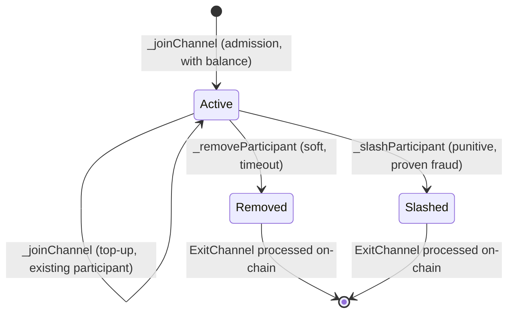

# State Machines

> **Agent status:** Maintained reverse-engineered draft.
> **Engineer verification:** Pending.
> **Status:** Draft; pending engineer verification.
> **Scope:** Defines the implementation-neutral state machines behavior, assumptions, constraints, security properties, and black-box test plan.
> **Related:** [history-and-commitments.md](./history-and-commitments.md) (what a block commits
> to), [../protocol/time.md](./time.md) (where `_tx.header.timestamp` comes from),
> [../protocol/fraud-proofs.md](../disputes/fraud-proofs.md) (why determinism is load-bearing).

## Contents

- [Purpose and observable model](#1-purpose-and-observable-model)
- [State-machine interface](#state-machine-interface)
- [Execution context: allowed and prohibited](#2-execution-context-allowed-and-prohibited)
- [Canonical serialization: `getState` / `_setState`](#3-canonical-serialization-getstate--_setstate)
- [Participants and balances are separate concerns](#4-participants-and-balances-are-separate-concerns)
- [Turn-taking: `getNextToWrite` selects the next block author](#5-turn-taking-getnexttowrite-selects-the-next-block-author)
- [Participant lifecycle hooks](#6-participant-lifecycle-hooks)
- [Assumptions and constraints](#assumptions-and-constraints)
- [Security considerations](#security-considerations)
- [Requirements and invariants](#requirements-and-invariants)
- [Verification and test plan](#verification-and-test-plan)
- [Future Work](#future-work)

## 1. Purpose and observable model

**Purpose & observable contract.** A state machine is a deterministic program that conforms to the
[state-machine interface](#state-machine-interface). Two ideas define it:

- **Its storage variables are the channel state.**
- **Its functions are the allowed transitions.**

A transition is applied through the base contract's `stateTransition(Transaction)`, which injects
the transaction header into the `_tx` storage variable and executes the transaction's calldata
against the contract itself under a fixed `gasLimit`:

```solidity
_clearOutboundMessages();
_tx.header = transaction.header;
(bool success, bytes memory result) = address(this).call{gas: gasLimit}(transaction.body.data);
```

The same contract runs in two places:

1. **Off-chain**, inside each participant's off-chain participant instance, behind the
   `local state-machine adapter` boundary
   (`stateTransition`, `runView`, `getParticipants`, `getNextToWrite`, `peekNextToWrite`,
   `getState`/`setState`, the balance operations, `processInboundMessage`).
2. **On-chain**, when a dispute or fraud proof re-executes a transition
   (`executeStateTransition` on the manager).

- **[`INV-SM-1-J7BP6D`](state-machines.md#inv-sm-1-j7bp6d)** — Transitions MUST be deterministic: identical prior state (as restored by
  `_setState`) plus identical transaction MUST yield an identical resulting state and identical
  outbound messages, both off-chain and under on-chain replay.

Determinism is not a convenience. It is what lets any participant, or the chain, re-execute a
transition and prove that a claimed result was invalid
(see [../protocol/fraud-proofs.md](../disputes/fraud-proofs.md)).

**Assumptions & dependencies.** The state machine's correctness claims hold only over the state
that `getState()` serializes. Logic that reads anything else (other contracts, ambient EVM
context) is outside the model and breaks [`INV-SM-1-J7BP6D`](state-machines.md#inv-sm-1-j7bp6d).

## State-machine interface

The **state-machine interface** is the complete logical boundary between the protocol and an
application-defined state machine. It specifies capabilities and observable behavior, not a
programming language, ABI, class hierarchy, or source layout. An implementation MAY name or group
the operations differently, but it MUST expose behavior equivalent to every required operation
below.

| Capability                        | Logical input                                                        | Observable output and required behavior                                                                                                                                                    |
| --------------------------------- | -------------------------------------------------------------------- | ------------------------------------------------------------------------------------------------------------------------------------------------------------------------------------------ |
| Apply transition                  | Serialized current state, transaction, and fixed execution budget    | Deterministic success or rejection, the resulting serialized state, and the ordered outbound messages produced by that transition. Rejection MUST NOT expose partial state or messages.    |
| Execute read-only query           | Serialized current state and application-defined query               | Deterministic encoded result or rejection, with no state or outbound-message mutation.                                                                                                     |
| Serialize state                   | Current logical application state                                    | One canonical byte representation containing every value transition logic can observe.                                                                                                     |
| Restore state                     | Canonical serialized state                                           | Exact restoration of the encoded logical state, or rejection without partial mutation.                                                                                                     |
| Enumerate participants            | Current logical application state                                    | The complete, deterministically ordered participant identities used by authorization and threshold rules.                                                                                  |
| Select next author                | Current state, or supplied serialized state for a non-mutating query | The single identity authorized to author the next block, without mutating live state when a supplied state is inspected.                                                                   |
| Evaluate balances                 | Two balances, or the current logical state for aggregation           | Deterministic addition, subtraction, equality, ordering, zero value, and total-state balance according to the algebra in §4.2.                                                             |
| Process inbound message           | One canonical inbound message                                        | Deterministic success or rejection and the resulting state change; standard membership messages and supported application-defined messages follow the same atomicity rules as transitions. |
| Apply membership lifecycle action | Join/top-up request, soft-removal identity, or slashing identity     | Deterministic success or rejection, the resulting membership/balance state, and any canonical exit message required by §6.                                                                 |

<a id="req-sm-9-qk86sj"></a>`REQ-SM-9-QK86SJ` — A conforming state machine MUST provide the complete interface above. Every operation
MUST use the same canonical state, identity, balance, message, and transaction meanings defined by
this specification. An unsupported required operation, a hidden mutable input, or a different
result between equivalent execution environments is non-conforming.

This interface does not require ordinary callers to invoke every capability directly. The
protocol may mediate access, perform a non-mutating query against a temporary restored state, or
combine several capabilities into one call, provided the externally observable semantics remain
identical.

## 2. Execution context: allowed and prohibited

**Purpose.** Because a transition is executed by whoever replays it (a peer's local EVM, or the
manager contract during a dispute), the ambient EVM context differs on every execution. The
protocol therefore injects the context a state machine is allowed to read, and everything else is
prohibited.

### 2.1 Allowed context (the complete API)

| Value                                                                    | Source                                                              | Meaning                                                                         |
| ------------------------------------------------------------------------ | ------------------------------------------------------------------- | ------------------------------------------------------------------------------- |
| `_tx.header.participant`                                                 | injected by `stateTransition`                                       | The logical author of this transition. The **only** valid author identity.      |
| `_tx.header.timestamp`                                                   | injected; protocol-validated (see [../protocol/time.md](./time.md)) | The protocol time of this transition. The **only** valid time source.           |
| `_tx.header.channelId`, `_tx.header.forkId`, `_tx.header.transactionCnt` | injected                                                            | Channel, fork, and block-height coordinates of the transition.                  |
| Function arguments                                                       | `transaction.body.data` (the dispatched calldata)                   | The transition's input data, supplied by the protocol and replayed identically. |
| Contract storage                                                         | restored via `_setState` before replay                              | The channel state itself.                                                       |
| `gasLimit`                                                               | deployment configuration argument                                   | The fixed gas budget every execution uses.                                      |

### 2.2 Prohibited ambient context

A state machine MUST NOT read ambient EVM values whose content depends on _where_ or _when_ the
transition executes rather than on the injected transaction and restored state. In particular:

| Prohibited                                                                                                             | Why it breaks replay                                                                                                                                                                                                                                                             |
| ---------------------------------------------------------------------------------------------------------------------- | -------------------------------------------------------------------------------------------------------------------------------------------------------------------------------------------------------------------------------------------------------------------------------- |
| `msg.sender`, `tx.origin`                                                                                              | Inside the self-call, `msg.sender` is the state-machine address itself; at the outer level it is whichever runner invoked `stateTransition` (off-chain participant-local account off-chain, the manager on-chain). It never identifies the author. Use `_tx.header.participant`. |
| `block.timestamp`, `block.number`, `blockhash`, `block.prevrandao`, `block.coinbase`, `block.basefee`, `block.chainid` | These come from the executing EVM (a local in-process chain off-chain, the real chain during replay) and differ across executions. Use `_tx.header.timestamp` for time.                                                                                                          |
| `msg.data` at the `stateTransition` level                                                                              | It is the wrapper's calldata, not the transition input. Use the function arguments dispatched from `transaction.body.data`.                                                                                                                                                      |
| `msg.value`, `address(this).balance`, external calls to other contracts, precompile-dependent randomness               | State outside `getState()` cannot be restored for replay.                                                                                                                                                                                                                        |
| `gasleft()`                                                                                                            | Differs between execution environments even under the same `gasLimit`.                                                                                                                                                                                                           |

- **[`REQ-SM-1-Y72CKX`](state-machines.md#req-sm-1-y72ckx)** — Author identity MUST be read from `_tx.header.participant` and time from
  `_tx.header.timestamp`; any use of the prohibited ambient context in transition logic is a
  correctness and fraud-proof vulnerability, and MUST be treated as a defect, not a style issue.

Why "vulnerability" and not "bug": a state machine that branches on ambient context can produce
one result off-chain and a different result during on-chain replay. That lets an attacker either
(a) get an honest participant slashed for a transition that was valid when they executed it, or
(b) escape a fraud proof for a transition that was invalid.

**Illustrative turn-enforcement rule:**

```solidity
modifier onlyCurrentPlayer() {
    require(_tx.header.participant == state.currentPlayer, "Not your turn");
    _;
}
```

The same file also shows a harmless-looking violation: `emit MoveMade(msg.sender, ...)` logs
`msg.sender` instead of `_tx.header.participant`. Events do not feed the state hash, so this does
not break replay today, but it is exactly the pattern a static check should flag.

## 3. Canonical serialization: `getState` / `_setState`

**Purpose & observable contract.** The protocol snapshots and restores the entire state to fork,
dispute, sync a late joiner, and re-execute history:

```solidity
function getState() public view virtual returns (bytes memory);   // serialize
function _setState(bytes memory encodedState) internal virtual;    // restore
```

- **[`INV-SM-2-0FTJ2T`](state-machines.md#inv-sm-2-0ftj2t)** — `getState`/`_setState` MUST be exact inverses: `_setState(getState())` leaves
  the state unchanged, and `getState()` after `_setState(b)` returns bytes whose decoded logical
  state equals the state encoded in `b`.

- **[`REQ-SM-2-PHCRFR`](state-machines.md#req-sm-2-phcrfr)** — Serialization MUST be deterministic and lossless: one logical state maps to one
  canonical byte encoding, and every field that transition logic can read is included. Equivalent
  logical states MUST serialize to identical bytes, because the protocol compares state by hash
  (`keccak256(getState())` becomes `SnapshotData.stateMachineStateHash`; see
  [history-and-commitments.md](./history-and-commitments.md)).

- **[`REQ-SM-3-88RFP2`](state-machines.md#req-sm-3-88rfp2)** — contract runtime `mapping`s MAY be used only when the state also maintains a complete,
  deterministic key enumeration, the serialization walks that enumeration in a defined order, and
  `_setState` restores both the mapping and its enumeration consistently. State that cannot be
  enumerated deterministically MUST NOT be part of channel state.

- **[`REQ-SM-4-Z32M0W`](state-machines.md#req-sm-4-z32m0w)** — The integrator MUST define ordering (field and collection order), encoding
  (`abi.encode` of a single state struct is the reference pattern), and round-trip behavior
  explicitly. The state machine and its state encoding are **immutable for the lifetime of a
  channel**: upgrades to state-machine logic, if any, apply only to newly opened channels. No
  state-encoding version marker is therefore required, and an existing channel MUST NOT change
  its encoding. _(Decided 2026-08-10, resolving the versioning half of
  [`OQ-21-PEZK9X`](../../implementation/open-questions.md#oq-21-pezk9x).)_

The illustrative encoding is a single ABI encode/decode of one state struct:

```solidity
function getState() public view override returns (bytes memory) { return abi.encode(state); }
function _setState(bytes memory encodedState) internal override { state = abi.decode(encodedState, (TicTacToeState)); }
```

**Failure behavior.** A serialization divergence is indistinguishable from an invalid transition:
peers computing different bytes for the same logical state will disagree on
`stateMachineStateHash`, blocks will fail validation, and the disagreement escalates to a dispute
neither side can win honestly.

## 4. Participants and balances are separate concerns

**Purpose.** Membership and value are distinct concepts and MUST NOT be conflated.

### 4.1 Membership

`getParticipants()` returns the channel's current participant **identities**, as addresses.
Membership answers "who may act and who must sign"; it says nothing about value. The off-chain participant reads it
after every transition to detect joins and removals
(the corresponding participant-state operation), and the
snapshot commits to it (`SnapshotData.participants`).

### 4.2 The abstract Balance

Value is represented by an abstract balance type:

```solidity
struct Balance {
    uint256 amount; // the common simple-amount representation
    bytes data;     // application-defined extension
}
```

The shape is intentionally more general than a raw integer. `amount` keeps the common
single-currency case trivial; `data` carries application-defined structure so one channel
protocol supports single currencies, multiple or composite assets, fungible tokens, and NFTs
without restricting the protocol to one asset type. `data` is opaque to the protocol; only the
state machine's balance operations interpret it. Serialization is ABI encoding of the struct;
`data`'s internal encoding is application-defined and MUST itself be canonical ([`REQ-SM-2-PHCRFR`](state-machines.md#req-sm-2-phcrfr) applies).

The state machine defines the balance **algebra** by implementing:

| Operation                     | Required semantics                                                                                                                                     |
| ----------------------------- | ------------------------------------------------------------------------------------------------------------------------------------------------------ |
| `addBalance(b1, b2)`          | Associative and commutative over valid balances; MUST reject overflow rather than wrap (**[`REQ-BAL-3-P7Q83F`](state-machines.md#req-bal-3-p7q83f)**). |
| `subtractBalance(b1, b2)`     | Partial function: MUST revert when `b2` is not covered by `b1` (**[`REQ-BAL-1-Z8RH4V`](state-machines.md#req-bal-1-z8rh4v)**, underflow rejection).    |
| `areBalancesEqual(b1, b2)`    | Equivalence over logical value (not raw bytes).                                                                                                        |
| `isBalanceLesserThan(b1, b2)` | The order used by protocol comparisons.                                                                                                                |
| `getTotalStateBalance()`      | Sum of all value the current state accounts for.                                                                                                       |
| `getZeroBalance()`            | Identity element of `addBalance`.                                                                                                                      |

- **[`REQ-BAL-1-Z8RH4V`](state-machines.md#req-bal-1-z8rh4v)** — `subtractBalance` MUST reject underflow: a participant cannot spend or exit
  more than they hold. This operation is the local enforcement point of the channel's
  value-conservation invariant; the aggregate form (deposits vs. withdrawals vs.
  `getTotalStateBalance`) is specified in
  [../protocol/cross-layer-messages.md](../settlement/cross-layer-messages.md) (channel-balance
  invariant).

- **[`REQ-BAL-2-KTSW9B`](state-machines.md#req-bal-2-ktsw9b)** — All balance operations MUST be pure/deterministic functions of their inputs
  (they are declared `pure`/`view` in the base and are called during replay).

- **[`REQ-BAL-3-P7Q83F`](state-machines.md#req-bal-3-p7q83f)** — `addBalance` and every balance aggregation (`getTotalStateBalance`, join
  top-ups, deposit/withdrawal totals) MUST reject overflow rather than wrap: wrapped addition
  silently mints or destroys value, breaking the same value-conservation invariant that
  underflow rejection ([`REQ-BAL-1-Z8RH4V`](state-machines.md#req-bal-1-z8rh4v)) protects on the spending side. Rejection MUST be
  deterministic — an operation that overflows fails identically in off-chain execution and
  on-chain replay, so the offending transition is simply invalid. Implementations using unchecked
  arithmetic, custom `data` encodings, or arithmetic outside the protocol's numeric domain MUST
  preserve the rejection behavior themselves. _(Added 2026-08-10 on engineer
  review.)_

**Association model.** The protocol does not dictate how balances attach to participants. The
state machine owns the association (typically a parallel array or enumerable mapping keyed by
participant, inside the serialized state). The protocol only sees balances at the boundary:
`JoinChannel.balance` in, `ExitChannel.balance` out, and the aggregate totals in the snapshot.

**Integer example** (single currency):

```solidity
function subtractBalance(Balance memory b1, Balance memory b2) public pure override returns (Balance memory diff) {
    require(b1.amount >= b2.amount, "balance1 < balance2");
    diff.amount = b1.amount - b2.amount;
}
```

**Composite / NFT sketch** (illustrative, not implemented in a concrete implementation):

```solidity
// data = abi.encode(uint256[] tokenIds) sorted ascending, canonical (no duplicates)
function addBalance(Balance memory b1, Balance memory b2) public pure override returns (Balance memory sum) {
    sum.amount = b1.amount + b2.amount;                    // fungible part
    sum.data = _mergeSortedIds(b1.data, b2.data);          // set union; revert on duplicate id
}
function subtractBalance(Balance memory b1, Balance memory b2) public pure override returns (Balance memory diff) {
    require(b1.amount >= b2.amount, "underflow");
    diff.amount = b1.amount - b2.amount;
    diff.data = _removeIds(b1.data, b2.data);              // revert if any id of b2 not present in b1
}
```

The sketch shows the two rules every custom algebra must keep: a canonical `data` encoding
(sorted, deduplicated) so equal values hash equal, and a `subtractBalance` that rejects removing
what is not held.

## 5. Turn-taking: `getNextToWrite` selects the next block author

```solidity
function getNextToWrite() public view virtual returns (address);
```

- **[`REQ-SM-5-3GS7A7`](state-machines.md#req-sm-5-3gs7a7)** — `getNextToWrite()` returns the address authorized to author the next **block**.
  The authorization rule is block-level: it constrains who may produce and sign the next block on
  the fork, not who may author an individual transaction inside it.

The state machine itself defines the schedule as a function of channel state; the protocol trusts
it. The recommended policy is round-robin
(see [../protocol/finality.md](./finality.md); safety of the dispute carry-forward
argument depends on it). A participant uses `getNextToWrite` to decide whether a received
block came from the legitimate author and whether it is this instance's turn
(the corresponding participant-state operation); `peekNextToWrite(serializedState)`
answers the same question against a supplied state without mutating the live one.

- **[`REQ-SM-6-BJZVQ5`](state-machines.md#req-sm-6-bjzvq5)** — Turn authorization is a protocol-layer responsibility, enforced generically for
  every state machine: the validation pipeline checks `block.author == getNextToWrite()` on the
  pre-state before any execution
  (block-validation service leader check — a
  wrong-author block never reaches `stateTransition`), and dispute replay repositions the machine
  and applies the same check. State machines MAY additionally reject wrong-turn authors
  in-contract as defense in depth, but the protocol MUST NOT depend on in-contract checks.
  _(Corrected 2026-08-10 on engineer review; this requirement previously mandated in-contract
  rejection.)_ For this protocol version: the on-chain `BlockInvalidStateTransition` handler re-executes and
  compares snapshots without an author check of its own, so on-chain wrong-turn slashing today
  succeeds only against machines that do guard in-contract — see
  [`OQ-26-XH59SP`](../open-questions.md#oq-26-xh59sp).

## 6. Participant lifecycle hooks

**Purpose.** Membership changes are state transitions with protocol-defined entry points. Each
hook is `internal virtual` (the integrator implements it) with a reentrancy-guarded external
wrapper the protocol calls during replay.



### 6.1 `_joinChannel(JoinChannel)` — admission and top-up

- **[`REQ-SM-7-Y38NTY`](state-machines.md#req-sm-7-y38nty)** — `_joinChannel` MUST handle both cases:
    - **New address:** incorporate the participant and its initial balance into state.
    - **Existing participant:** increase that participant's balance without changing membership
      (a top-up on a repeated join).

Joins arrive as inbound messages. The state machine dispatches the standard join message to the
join operation and MAY dispatch other message types to application-defined handlers.

### 6.2 `_removeParticipant(address)` — soft removal

The non-punitive exit is triggered by a validated **timeout** (unavailability). The
participant leaves with their balance; they are not treated as a fraudster. Returns
`(bool success, ExitChannel)`.

### 6.3 `_slashParticipant(address)` — punitive removal

The punitive exit for objectively proven fraud. The state machine decides how the penalty is
applied to the offender's balance. Returns `(bool success, ExitChannel)`.

### 6.4 Exits are outbound messages

An `ExitChannel` (participant + resulting balance) does not leave the channel by itself. The base
contract wraps it into a `MESSAGE_TYPE_EXIT` outbound message (`_addExitChannel`), outbound
messages accumulate during the transition, `stateTransition` returns them, and the off-chain participant batches
them into the hash-linked outbound message-block stream committed by the next snapshot
(see [history-and-commitments.md](./history-and-commitments.md) §5 and
[../protocol/cross-layer-messages.md](../settlement/cross-layer-messages.md)). A normal transition
MAY also produce an exit; exits are not limited to removal and slashing.

- **[`REQ-SM-8-8CHSQ8`](state-machines.md#req-sm-8-8chsq8)** — `slashParticipant` and `removeParticipant` MUST record their resulting
  `ExitChannel` identically: both produce the `MESSAGE_TYPE_EXIT` outbound message through the
  same path (`_addExitChannel`). The only permitted difference between the two is balance
  semantics inside the hooks: `_removeParticipant` is the soft path and MAY return the
  participant's full held balance, while `_slashParticipant` applies the application-defined
  penalty. _(Decided 2026-08-10, resolving [`OQ-18-2NK97T`](../open-questions.md#oq-18-2nk97t).)_

## Assumptions and constraints

- All behavior that affects transition results is contained in the serialized state, injected transaction,
  function arguments, and fixed gas budget. External contract state and ambient EVM context are outside the
  deterministic model.
- `getState()` is a complete, canonical representation of every storage value transition logic can observe;
  `_setState` can restore that representation exactly.
- State-machine bytecode and state encoding remain fixed for the lifetime of a channel. A different version
  opens a different channel rather than upgrading an existing one in place.
- Balance arithmetic and custom `Balance.data` encodings are deterministic, bounded by the EVM execution/gas
  model, and reject invalid arithmetic or malformed encodings identically off-chain and on-chain.
- Participant identity is an address and author/time authority comes only from `_tx.header`. The protocol's
  generic leader check runs before transition execution.
- The current model has one transaction per block. Requirements phrased in terms of block authorship remain
  binding if block contents later expand.

If any assumption is false, deterministic replay and therefore fraud-proof soundness are not guaranteed. Such
an integration is non-conforming rather than a weaker supported mode.

## Security considerations

**Protected assets and properties:** channel funds, canonical state, participant authorization, replay
equivalence, balance conservation, and correct removal/slashing outcomes.

**Trust boundaries:** integrator-written state-machine code crosses from application policy into protocol
consensus; serialized bytes cross between local execution, peers, persistence, and on-chain replay; transaction
headers supply the only trusted author and time context.

**Primary threats and required defenses:**

- Ambient-context reads can make honest off-chain execution disagree with on-chain replay. [`REQ-SM-1-Y72CKX`](state-machines.md#req-sm-1-y72ckx) prohibits
  them and implementations must treat detection as a security failure.
- Incomplete or non-canonical serialization can hide state or create different hashes for equivalent states.
  [`INV-SM-2-0FTJ2T`](state-machines.md#inv-sm-2-0ftj2t) and [`REQ-SM-2-PHCRFR`](state-machines.md#req-sm-2-phcrfr) through [`REQ-SM-4-Z32M0W`](state-machines.md#req-sm-4-z32m0w) require exact, stable round trips.
- Arithmetic overflow/underflow or ambiguous custom balance encodings can mint, destroy, duplicate, or trap
  value. [`REQ-BAL-1-Z8RH4V`](state-machines.md#req-bal-1-z8rh4v) through [`REQ-BAL-3-P7Q83F`](state-machines.md#req-bal-3-p7q83f) require deterministic rejection and canonical value semantics.
- Incorrect turn or membership handling can authorize the wrong participant, duplicate members, or produce an
  invalid exit. [`REQ-SM-5-3GS7A7`](state-machines.md#req-sm-5-3gs7a7) through [`REQ-SM-8-8CHSQ8`](state-machines.md#req-sm-8-8chsq8) define the protocol and hook boundaries.
- Unbounded transition work can exhaust the fixed gas budget and make otherwise valid history unreplayable.
  Integrators must define bounded state and collection sizes compatible with the configured gas limit.

**Residual gaps:** there is no generic static ambient-context checker, replay-equivalence harness, integrator
serialization property suite, top-up test, generic on-chain wrong-turn proof, or slash/remove symmetry test.
Until those gaps close, engineer review of an integrator contract remains a security-critical control.

## Requirements and invariants

This table is the normative requirement index. Detailed rules and rationale are defined in the sections above.

| Requirement / invariant                                | Statement                                                                                                                             |
| ------------------------------------------------------ | ------------------------------------------------------------------------------------------------------------------------------------- |
| <a id="inv-sm-1-j7bp6d"></a>`INV-SM-1-J7BP6D`          | Transitions deterministic; identical state + transaction ⇒ identical result and outbound messages, off-chain and on-chain             |
| <a id="req-sm-1-y72ckx"></a>`REQ-SM-1-Y72CKX`          | Author = `_tx.header.participant`, time = `_tx.header.timestamp`; ambient EVM context prohibited                                      |
| <a id="inv-sm-2-0ftj2t"></a>`INV-SM-2-0FTJ2T`          | `getState`/`_setState` exact inverses                                                                                                 |
| <a id="req-sm-2-phcrfr"></a>`REQ-SM-2-PHCRFR`          | Canonical, deterministic, lossless serialization; equal states ⇒ equal bytes                                                          |
| <a id="req-sm-3-88rfp2"></a>`REQ-SM-3-88RFP2`          | Mappings only with complete deterministic key enumeration                                                                             |
| <a id="req-sm-4-z32m0w"></a>`REQ-SM-4-Z32M0W`          | Ordering/encoding/round-trip defined explicitly; state machine and encoding immutable per channel (upgrades affect new channels only) |
| <a id="req-bal-1-z8rh4v"></a>`REQ-BAL-1-Z8RH4V`        | `subtractBalance` rejects underflow                                                                                                   |
| <a id="req-bal-2-ktsw9b"></a>`REQ-BAL-2-KTSW9B`        | Balance operations pure/deterministic                                                                                                 |
| <a id="req-bal-3-p7q83f"></a>`REQ-BAL-3-P7Q83F`        | `addBalance` and aggregations reject overflow (no wrapping)                                                                           |
| <a id="req-sm-5-3gs7a7"></a>`REQ-SM-5-3GS7A7`          | `getNextToWrite` authorizes the next block author (block-level rule)                                                                  |
| <a id="req-sm-6-bjzvq5"></a>`REQ-SM-6-BJZVQ5`          | Turn authorization enforced generically at the protocol layer (pre-execution leader check); in-contract checks optional               |
| <a id="req-sm-7-y38nty"></a>`REQ-SM-7-Y38NTY`          | `_joinChannel` handles admission and top-up                                                                                           |
| <a id="req-sm-8-8chsq8"></a>`REQ-SM-8-8CHSQ8`          | Slash and remove record their `ExitChannel` identically via `_addExitChannel`; hooks differ only in balance semantics                 |
| [`REQ-SM-9-QK86SJ`](state-machines.md#req-sm-9-qk86sj) | Complete logical state-machine interface is exposed with canonical inputs, outputs, atomic failure, and cross-runtime equivalence     |

## Verification and test plan

The required tests treat an integrator state machine as a black box and repeat observable behavior across
local and on-chain execution where the requirement crosses that boundary. Passing one representative
transition is insufficient: every row below states its setup, observable result, and required permutations.
Implementation documents may add component-specific unit tests, and verification documents may add shared
cross-system methods, but neither creates a second hierarchy of specification tests.

### Requirement test matrix

Each row is a planned black-box test obligation, not an additional specification requirement. The requirement remains the authority. Execute the row through public protocol inputs from every applicable pre-state defined by this document. Every required permutation has a stable `P1`…`PN` suffix under its plan item. The list is exhaustive unless it explicitly says that boundary or pairwise representatives are sufficient; an omitted permutation needs an engineer-approved rationale.

| Plan item                                             | Requirements / invariants                                | Setup and stimulus                                                                                                                                                                                           | Expected result                                                                                                                                      | Required permutations                                                                                                                                                                                                                                                                                                                                                                                                                                                                                                                                                                                                                                                                                                                                                                                                                                                                                                                                                                                                                                                                                                                                                                                                                                                                                                                                                                                                                                                                                                                                                                                                                                                                                                                                                                                                                                                                                                                                                                                   |
| ----------------------------------------------------- | -------------------------------------------------------- | ------------------------------------------------------------------------------------------------------------------------------------------------------------------------------------------------------------ | ---------------------------------------------------------------------------------------------------------------------------------------------------- | ------------------------------------------------------------------------------------------------------------------------------------------------------------------------------------------------------------------------------------------------------------------------------------------------------------------------------------------------------------------------------------------------------------------------------------------------------------------------------------------------------------------------------------------------------------------------------------------------------------------------------------------------------------------------------------------------------------------------------------------------------------------------------------------------------------------------------------------------------------------------------------------------------------------------------------------------------------------------------------------------------------------------------------------------------------------------------------------------------------------------------------------------------------------------------------------------------------------------------------------------------------------------------------------------------------------------------------------------------------------------------------------------------------------------------------------------------------------------------------------------------------------------------------------------------------------------------------------------------------------------------------------------------------------------------------------------------------------------------------------------------------------------------------------------------------------------------------------------------------------------------------------------------------------------------------------------------------------------------------------------------- |
| <a id="inv-sm-1-j7bp6d.t1"></a>`INV-SM-1-J7BP6D.T1`   | [`INV-SM-1-J7BP6D`](state-machines.md#inv-sm-1-j7bp6d)   | Restore the same serialized pre-state in independent local runners and the on-chain replay path, then submit the identical transition and gas limit.                                                         | Success/revert classification, resulting state bytes, and ordered outbound messages are identical in every runtime.                                  | <a id="inv-sm-1-j7bp6d.t1.p1"></a>`INV-SM-1-J7BP6D.T1.P1` — Every public transition<br><a id="inv-sm-1-j7bp6d.t1.p2"></a>`INV-SM-1-J7BP6D.T1.P2` — successful transition<br><a id="inv-sm-1-j7bp6d.t1.p3"></a>`INV-SM-1-J7BP6D.T1.P3` — empty state<br><a id="inv-sm-1-j7bp6d.t1.p4"></a>`INV-SM-1-J7BP6D.T1.P4` — no outbound message<br><a id="inv-sm-1-j7bp6d.t1.p5"></a>`INV-SM-1-J7BP6D.T1.P5` — repeated execution<br><a id="inv-sm-1-j7bp6d.t1.p6"></a>`INV-SM-1-J7BP6D.T1.P6` — reverting transition<br><a id="inv-sm-1-j7bp6d.t1.p7"></a>`INV-SM-1-J7BP6D.T1.P7` — minimum state<br><a id="inv-sm-1-j7bp6d.t1.p8"></a>`INV-SM-1-J7BP6D.T1.P8` — typical state<br><a id="inv-sm-1-j7bp6d.t1.p9"></a>`INV-SM-1-J7BP6D.T1.P9` — maximum supported state<br><a id="inv-sm-1-j7bp6d.t1.p10"></a>`INV-SM-1-J7BP6D.T1.P10` — one outbound message<br><a id="inv-sm-1-j7bp6d.t1.p11"></a>`INV-SM-1-J7BP6D.T1.P11` — many outbound messages.                                                                                                                                                                                                                                                                                                                                                                                                                                                                                                                                                                                                                                                                                                                                                                                                                                                                                                                                                                                                                                                            |
| <a id="req-sm-1-y72ckx.t1"></a>`REQ-SM-1-Y72CKX.T1`   | [`REQ-SM-1-Y72CKX`](state-machines.md#req-sm-1-y72ckx)   | Hold the injected header fixed while varying ambient sender, timestamp, block data, chain ID, balance, and gas context; then vary only the header.                                                           | Ambient changes cannot affect the result; changing the injected participant or timestamp affects only behavior that explicitly uses it.              | <a id="req-sm-1-y72ckx.t1.p1"></a>`REQ-SM-1-Y72CKX.T1.P1` — `msg.sender` varied<br><a id="req-sm-1-y72ckx.t1.p2"></a>`REQ-SM-1-Y72CKX.T1.P2` — valid participant<br><a id="req-sm-1-y72ckx.t1.p3"></a>`REQ-SM-1-Y72CKX.T1.P3` — timestamps before each application boundary<br><a id="req-sm-1-y72ckx.t1.p4"></a>`REQ-SM-1-Y72CKX.T1.P4` — `tx.origin` varied<br><a id="req-sm-1-y72ckx.t1.p5"></a>`REQ-SM-1-Y72CKX.T1.P5` — `block.timestamp` varied<br><a id="req-sm-1-y72ckx.t1.p6"></a>`REQ-SM-1-Y72CKX.T1.P6` — `block.number` varied<br><a id="req-sm-1-y72ckx.t1.p7"></a>`REQ-SM-1-Y72CKX.T1.P7` — `blockhash` varied<br><a id="req-sm-1-y72ckx.t1.p8"></a>`REQ-SM-1-Y72CKX.T1.P8` — `block.prevrandao` varied<br><a id="req-sm-1-y72ckx.t1.p9"></a>`REQ-SM-1-Y72CKX.T1.P9` — `block.coinbase` varied<br><a id="req-sm-1-y72ckx.t1.p10"></a>`REQ-SM-1-Y72CKX.T1.P10` — `block.basefee` varied<br><a id="req-sm-1-y72ckx.t1.p11"></a>`REQ-SM-1-Y72CKX.T1.P11` — `block.chainid` varied<br><a id="req-sm-1-y72ckx.t1.p12"></a>`REQ-SM-1-Y72CKX.T1.P12` — wrapper-level `msg.data` varied<br><a id="req-sm-1-y72ckx.t1.p13"></a>`REQ-SM-1-Y72CKX.T1.P13` — `msg.value` varied<br><a id="req-sm-1-y72ckx.t1.p14"></a>`REQ-SM-1-Y72CKX.T1.P14` — `address(this).balance` varied<br><a id="req-sm-1-y72ckx.t1.p15"></a>`REQ-SM-1-Y72CKX.T1.P15` — external contract state varied<br><a id="req-sm-1-y72ckx.t1.p16"></a>`REQ-SM-1-Y72CKX.T1.P16` — precompile-dependent randomness varied<br><a id="req-sm-1-y72ckx.t1.p17"></a>`REQ-SM-1-Y72CKX.T1.P17` — `gasleft()` varied<br><a id="req-sm-1-y72ckx.t1.p18"></a>`REQ-SM-1-Y72CKX.T1.P18` — representative combination of prohibited values<br><a id="req-sm-1-y72ckx.t1.p19"></a>`REQ-SM-1-Y72CKX.T1.P19` — wrong participant<br><a id="req-sm-1-y72ckx.t1.p20"></a>`REQ-SM-1-Y72CKX.T1.P20` — timestamps at each application boundary<br><a id="req-sm-1-y72ckx.t1.p21"></a>`REQ-SM-1-Y72CKX.T1.P21` — timestamps after each application boundary. |
| <a id="inv-sm-2-0ftj2t.t1"></a>`INV-SM-2-0FTJ2T.T1`   | [`INV-SM-2-0FTJ2T`](state-machines.md#inv-sm-2-0ftj2t)   | Serialize state, restore those bytes into a fresh instance, serialize again, and execute the same next transition on original and restored instances.                                                        | Bytes and logical state round-trip exactly, and both instances produce the same next result.                                                         | <a id="inv-sm-2-0ftj2t.t1.p1"></a>`INV-SM-2-0FTJ2T.T1.P1` — Empty state<br><a id="inv-sm-2-0ftj2t.t1.p2"></a>`INV-SM-2-0FTJ2T.T1.P2` — every collection shape<br><a id="inv-sm-2-0ftj2t.t1.p3"></a>`INV-SM-2-0FTJ2T.T1.P3` — repeated round trips<br><a id="inv-sm-2-0ftj2t.t1.p4"></a>`INV-SM-2-0FTJ2T.T1.P4` — malformed bytes reject without partial mutation<br><a id="inv-sm-2-0ftj2t.t1.p5"></a>`INV-SM-2-0FTJ2T.T1.P5` — minimum state<br><a id="inv-sm-2-0ftj2t.t1.p6"></a>`INV-SM-2-0FTJ2T.T1.P6` — typical state<br><a id="inv-sm-2-0ftj2t.t1.p7"></a>`INV-SM-2-0FTJ2T.T1.P7` — maximum state.                                                                                                                                                                                                                                                                                                                                                                                                                                                                                                                                                                                                                                                                                                                                                                                                                                                                                                                                                                                                                                                                                                                                                                                                                                                                                                                                                                                                |
| <a id="req-sm-2-phcrfr.t1"></a>`REQ-SM-2-PHCRFR.T1`   | [`REQ-SM-2-PHCRFR`](state-machines.md#req-sm-2-phcrfr)   | Construct logically equal states through different valid operation orders and compare their encodings and hashes.                                                                                            | Equal logical states produce identical canonical bytes; every transition-readable field survives encode/decode.                                      | <a id="req-sm-2-phcrfr.t1.p1"></a>`REQ-SM-2-PHCRFR.T1.P1` — Reordered construction<br><a id="req-sm-2-phcrfr.t1.p2"></a>`REQ-SM-2-PHCRFR.T1.P2` — zero/default fields<br><a id="req-sm-2-phcrfr.t1.p3"></a>`REQ-SM-2-PHCRFR.T1.P3` — every collection ordering<br><a id="req-sm-2-phcrfr.t1.p4"></a>`REQ-SM-2-PHCRFR.T1.P4` — minimum values<br><a id="req-sm-2-phcrfr.t1.p5"></a>`REQ-SM-2-PHCRFR.T1.P5` — omitted encoding rejects<br><a id="req-sm-2-phcrfr.t1.p6"></a>`REQ-SM-2-PHCRFR.T1.P6` — reordered insertion<br><a id="req-sm-2-phcrfr.t1.p7"></a>`REQ-SM-2-PHCRFR.T1.P7` — maximum values<br><a id="req-sm-2-phcrfr.t1.p8"></a>`REQ-SM-2-PHCRFR.T1.P8` — duplicate encoding rejects<br><a id="req-sm-2-phcrfr.t1.p9"></a>`REQ-SM-2-PHCRFR.T1.P9` — malformed encoding rejects.                                                                                                                                                                                                                                                                                                                                                                                                                                                                                                                                                                                                                                                                                                                                                                                                                                                                                                                                                                                                                                                                                                                                                                                                              |
| <a id="req-sm-3-88rfp2.t1"></a>`REQ-SM-3-88RFP2.T1`   | [`REQ-SM-3-88RFP2`](state-machines.md#req-sm-3-88rfp2)   | Populate every mapping-backed state shape, serialize and restore it, then enumerate and compare all keys and values.                                                                                         | Enumeration is complete, uniquely ordered, deterministic, and restores the exact mapping.                                                            | <a id="req-sm-3-88rfp2.t1.p1"></a>`REQ-SM-3-88RFP2.T1.P1` — Empty mapping<br><a id="req-sm-3-88rfp2.t1.p2"></a>`REQ-SM-3-88RFP2.T1.P2` — different insertion orders<br><a id="req-sm-3-88rfp2.t1.p3"></a>`REQ-SM-3-88RFP2.T1.P3` — duplicate keys<br><a id="req-sm-3-88rfp2.t1.p4"></a>`REQ-SM-3-88RFP2.T1.P4` — minimum key and value<br><a id="req-sm-3-88rfp2.t1.p5"></a>`REQ-SM-3-88RFP2.T1.P5` — missing enumeration entry<br><a id="req-sm-3-88rfp2.t1.p6"></a>`REQ-SM-3-88RFP2.T1.P6` — one key<br><a id="req-sm-3-88rfp2.t1.p7"></a>`REQ-SM-3-88RFP2.T1.P7` — many keys<br><a id="req-sm-3-88rfp2.t1.p8"></a>`REQ-SM-3-88RFP2.T1.P8` — removed keys<br><a id="req-sm-3-88rfp2.t1.p9"></a>`REQ-SM-3-88RFP2.T1.P9` — maximum key and value<br><a id="req-sm-3-88rfp2.t1.p10"></a>`REQ-SM-3-88RFP2.T1.P10` — stale enumeration entry.                                                                                                                                                                                                                                                                                                                                                                                                                                                                                                                                                                                                                                                                                                                                                                                                                                                                                                                                                                                                                                                                                                                                                              |
| <a id="req-sm-4-z32m0w.t1"></a>`REQ-SM-4-Z32M0W.T1`   | [`REQ-SM-4-Z32M0W`](state-machines.md#req-sm-4-z32m0w)   | Open a channel with one encoding, then attempt to replay its history with changed field order, encoding, or state-machine logic.                                                                             | The original encoding remains stable for that channel; incompatible changes cannot silently reinterpret existing state.                              | <a id="req-sm-4-z32m0w.t1.p1"></a>`REQ-SM-4-Z32M0W.T1.P1` — Unchanged implementation<br><a id="req-sm-4-z32m0w.t1.p2"></a>`REQ-SM-4-Z32M0W.T1.P2` — field reorder<br><a id="req-sm-4-z32m0w.t1.p3"></a>`REQ-SM-4-Z32M0W.T1.P3` — logic-only change<br><a id="req-sm-4-z32m0w.t1.p4"></a>`REQ-SM-4-Z32M0W.T1.P4` — old channel<br><a id="req-sm-4-z32m0w.t1.p5"></a>`REQ-SM-4-Z32M0W.T1.P5` — field add<br><a id="req-sm-4-z32m0w.t1.p6"></a>`REQ-SM-4-Z32M0W.T1.P6` — field remove<br><a id="req-sm-4-z32m0w.t1.p7"></a>`REQ-SM-4-Z32M0W.T1.P7` — field type change<br><a id="req-sm-4-z32m0w.t1.p8"></a>`REQ-SM-4-Z32M0W.T1.P8` — newly opened channel.                                                                                                                                                                                                                                                                                                                                                                                                                                                                                                                                                                                                                                                                                                                                                                                                                                                                                                                                                                                                                                                                                                                                                                                                                                                                                                                                                |
| <a id="req-bal-1-z8rh4v.t1"></a>`REQ-BAL-1-Z8RH4V.T1` | [`REQ-BAL-1-Z8RH4V`](state-machines.md#req-bal-1-z8rh4v) | Subtract through the public balance boundary and observe the returned balance or deterministic rejection.                                                                                                    | Amounts up to the held value subtract exactly; any uncovered fungible or custom value rejects without mutation.                                      | <a id="req-bal-1-z8rh4v.t1.p1"></a>`REQ-BAL-1-Z8RH4V.T1.P1` — Zero from zero<br><a id="req-bal-1-z8rh4v.t1.p2"></a>`REQ-BAL-1-Z8RH4V.T1.P2` — less than held value<br><a id="req-bal-1-z8rh4v.t1.p3"></a>`REQ-BAL-1-Z8RH4V.T1.P3` — maximum value<br><a id="req-bal-1-z8rh4v.t1.p4"></a>`REQ-BAL-1-Z8RH4V.T1.P4` — missing custom asset<br><a id="req-bal-1-z8rh4v.t1.p5"></a>`REQ-BAL-1-Z8RH4V.T1.P5` — repeated failure and retry<br><a id="req-bal-1-z8rh4v.t1.p6"></a>`REQ-BAL-1-Z8RH4V.T1.P6` — zero from nonzero<br><a id="req-bal-1-z8rh4v.t1.p7"></a>`REQ-BAL-1-Z8RH4V.T1.P7` — equal to held value<br><a id="req-bal-1-z8rh4v.t1.p8"></a>`REQ-BAL-1-Z8RH4V.T1.P8` — one over held value<br><a id="req-bal-1-z8rh4v.t1.p9"></a>`REQ-BAL-1-Z8RH4V.T1.P9` — duplicate custom asset.                                                                                                                                                                                                                                                                                                                                                                                                                                                                                                                                                                                                                                                                                                                                                                                                                                                                                                                                                                                                                                                                                                                                                                                                               |
| <a id="req-bal-2-ktsw9b.t1"></a>`REQ-BAL-2-KTSW9B.T1` | [`REQ-BAL-2-KTSW9B`](state-machines.md#req-bal-2-ktsw9b) | Run each balance operation repeatedly with identical encoded inputs in independent instances and replay contexts.                                                                                            | Each operation returns or reverts identically and has no hidden state or ambient-context dependency.                                                 | <a id="req-bal-2-ktsw9b.t1.p1"></a>`REQ-BAL-2-KTSW9B.T1.P1` — `addBalance`<br><a id="req-bal-2-ktsw9b.t1.p2"></a>`REQ-BAL-2-KTSW9B.T1.P2` — zero values<br><a id="req-bal-2-ktsw9b.t1.p3"></a>`REQ-BAL-2-KTSW9B.T1.P3` — canonical custom data<br><a id="req-bal-2-ktsw9b.t1.p4"></a>`REQ-BAL-2-KTSW9B.T1.P4` — success<br><a id="req-bal-2-ktsw9b.t1.p5"></a>`REQ-BAL-2-KTSW9B.T1.P5` — changed ambient context<br><a id="req-bal-2-ktsw9b.t1.p6"></a>`REQ-BAL-2-KTSW9B.T1.P6` — `subtractBalance`<br><a id="req-bal-2-ktsw9b.t1.p7"></a>`REQ-BAL-2-KTSW9B.T1.P7` — `areBalancesEqual`<br><a id="req-bal-2-ktsw9b.t1.p8"></a>`REQ-BAL-2-KTSW9B.T1.P8` — `isBalanceLesserThan`<br><a id="req-bal-2-ktsw9b.t1.p9"></a>`REQ-BAL-2-KTSW9B.T1.P9` — `getTotalStateBalance`<br><a id="req-bal-2-ktsw9b.t1.p10"></a>`REQ-BAL-2-KTSW9B.T1.P10` — `getZeroBalance`<br><a id="req-bal-2-ktsw9b.t1.p11"></a>`REQ-BAL-2-KTSW9B.T1.P11` — minimum values<br><a id="req-bal-2-ktsw9b.t1.p12"></a>`REQ-BAL-2-KTSW9B.T1.P12` — typical values<br><a id="req-bal-2-ktsw9b.t1.p13"></a>`REQ-BAL-2-KTSW9B.T1.P13` — maximum values<br><a id="req-bal-2-ktsw9b.t1.p14"></a>`REQ-BAL-2-KTSW9B.T1.P14` — rejection.                                                                                                                                                                                                                                                                                                                                                                                                                                                                                                                                                                                                                                                                                                                                                                                                          |
| <a id="req-bal-3-p7q83f.t1"></a>`REQ-BAL-3-P7Q83F.T1` | [`REQ-BAL-3-P7Q83F`](state-machines.md#req-bal-3-p7q83f) | Add balances directly and through every aggregate path at and around the numeric and application-defined limits.                                                                                             | Valid sums are exact; overflow or duplicate custom value rejects rather than wrapping or partially updating state.                                   | <a id="req-bal-3-p7q83f.t1.p1"></a>`REQ-BAL-3-P7Q83F.T1.P1` — Zero<br><a id="req-bal-3-p7q83f.t1.p2"></a>`REQ-BAL-3-P7Q83F.T1.P2` — maximum minus one plus one<br><a id="req-bal-3-p7q83f.t1.p3"></a>`REQ-BAL-3-P7Q83F.T1.P3` — maximum plus one<br><a id="req-bal-3-p7q83f.t1.p4"></a>`REQ-BAL-3-P7Q83F.T1.P4` — multi-term aggregation where only the final term overflows<br><a id="req-bal-3-p7q83f.t1.p5"></a>`REQ-BAL-3-P7Q83F.T1.P5` — duplicate NFT/custom asset<br><a id="req-bal-3-p7q83f.t1.p6"></a>`REQ-BAL-3-P7Q83F.T1.P6` — retry after rejection.                                                                                                                                                                                                                                                                                                                                                                                                                                                                                                                                                                                                                                                                                                                                                                                                                                                                                                                                                                                                                                                                                                                                                                                                                                                                                                                                                                                                                                        |
| <a id="req-sm-5-3gs7a7.t1"></a>`REQ-SM-5-3GS7A7.T1`   | [`REQ-SM-5-3GS7A7`](state-machines.md#req-sm-5-3gs7a7)   | Query the next writer from each reachable state, then attempt to author the next block as every participant and a non-participant.                                                                           | Exactly the returned address is authorized to author the next block.                                                                                 | <a id="req-sm-5-3gs7a7.t1.p1"></a>`REQ-SM-5-3GS7A7.T1.P1` — Every participant position<br><a id="req-sm-5-3gs7a7.t1.p2"></a>`REQ-SM-5-3GS7A7.T1.P2` — one participant<br><a id="req-sm-5-3gs7a7.t1.p3"></a>`REQ-SM-5-3GS7A7.T1.P3` — membership before join<br><a id="req-sm-5-3gs7a7.t1.p4"></a>`REQ-SM-5-3GS7A7.T1.P4` — correct author<br><a id="req-sm-5-3gs7a7.t1.p5"></a>`REQ-SM-5-3GS7A7.T1.P5` — many participants<br><a id="req-sm-5-3gs7a7.t1.p6"></a>`REQ-SM-5-3GS7A7.T1.P6` — membership after join<br><a id="req-sm-5-3gs7a7.t1.p7"></a>`REQ-SM-5-3GS7A7.T1.P7` — membership before removal<br><a id="req-sm-5-3gs7a7.t1.p8"></a>`REQ-SM-5-3GS7A7.T1.P8` — membership after removal<br><a id="req-sm-5-3gs7a7.t1.p9"></a>`REQ-SM-5-3GS7A7.T1.P9` — wrong author<br><a id="req-sm-5-3gs7a7.t1.p10"></a>`REQ-SM-5-3GS7A7.T1.P10` — missing author<br><a id="req-sm-5-3gs7a7.t1.p11"></a>`REQ-SM-5-3GS7A7.T1.P11` — duplicate author<br><a id="req-sm-5-3gs7a7.t1.p12"></a>`REQ-SM-5-3GS7A7.T1.P12` — non-member author.                                                                                                                                                                                                                                                                                                                                                                                                                                                                                                                                                                                                                                                                                                                                                                                                                                                                                                                                                                      |
| <a id="req-sm-6-bjzvq5.t1"></a>`REQ-SM-6-BJZVQ5.T1`   | [`REQ-SM-6-BJZVQ5`](state-machines.md#req-sm-6-bjzvq5)   | Submit correct- and wrong-author blocks through local validation and the on-chain dispute replay path using a state machine with no in-contract guard.                                                       | Correct blocks proceed; wrong-author blocks are rejected before execution in every required protocol path.                                           | <a id="req-sm-6-bjzvq5.t1.p1"></a>`REQ-SM-6-BJZVQ5.T1.P1` — Live receipt<br><a id="req-sm-6-bjzvq5.t1.p2"></a>`REQ-SM-6-BJZVQ5.T1.P2` — every participant position<br><a id="req-sm-6-bjzvq5.t1.p3"></a>`REQ-SM-6-BJZVQ5.T1.P3` — forged signatures<br><a id="req-sm-6-bjzvq5.t1.p4"></a>`REQ-SM-6-BJZVQ5.T1.P4` — stored-block merge<br><a id="req-sm-6-bjzvq5.t1.p5"></a>`REQ-SM-6-BJZVQ5.T1.P5` — spectating<br><a id="req-sm-6-bjzvq5.t1.p6"></a>`REQ-SM-6-BJZVQ5.T1.P6` — calldata dispute<br><a id="req-sm-6-bjzvq5.t1.p7"></a>`REQ-SM-6-BJZVQ5.T1.P7` — non-calldata dispute<br><a id="req-sm-6-bjzvq5.t1.p8"></a>`REQ-SM-6-BJZVQ5.T1.P8` — duplicate signatures.                                                                                                                                                                                                                                                                                                                                                                                                                                                                                                                                                                                                                                                                                                                                                                                                                                                                                                                                                                                                                                                                                                                                                                                                                                                                                                                                |
| <a id="req-sm-7-y38nty.t1"></a>`REQ-SM-7-Y38NTY.T1`   | [`REQ-SM-7-Y38NTY`](state-machines.md#req-sm-7-y38nty)   | Deliver a join through the public inbound-message path for a new participant and again for the same participant.                                                                                             | First delivery adds membership and value once; subsequent valid delivery tops up value without duplicating membership.                               | <a id="req-sm-7-y38nty.t1.p1"></a>`REQ-SM-7-Y38NTY.T1.P1` — New participant<br><a id="req-sm-7-y38nty.t1.p2"></a>`REQ-SM-7-Y38NTY.T1.P2` — zero balance<br><a id="req-sm-7-y38nty.t1.p3"></a>`REQ-SM-7-Y38NTY.T1.P3` — duplicate delivery<br><a id="req-sm-7-y38nty.t1.p4"></a>`REQ-SM-7-Y38NTY.T1.P4` — hook rejection without partial state<br><a id="req-sm-7-y38nty.t1.p5"></a>`REQ-SM-7-Y38NTY.T1.P5` — existing participant<br><a id="req-sm-7-y38nty.t1.p6"></a>`REQ-SM-7-Y38NTY.T1.P6` — removed participant<br><a id="req-sm-7-y38nty.t1.p7"></a>`REQ-SM-7-Y38NTY.T1.P7` — slashed participant<br><a id="req-sm-7-y38nty.t1.p8"></a>`REQ-SM-7-Y38NTY.T1.P8` — nonzero balance<br><a id="req-sm-7-y38nty.t1.p9"></a>`REQ-SM-7-Y38NTY.T1.P9` — reordered delivery<br><a id="req-sm-7-y38nty.t1.p10"></a>`REQ-SM-7-Y38NTY.T1.P10` — concurrent delivery<br><a id="req-sm-7-y38nty.t1.p11"></a>`REQ-SM-7-Y38NTY.T1.P11` — retried delivery.                                                                                                                                                                                                                                                                                                                                                                                                                                                                                                                                                                                                                                                                                                                                                                                                                                                                                                                                                                                                                                                        |
| <a id="req-sm-8-8chsq8.t1"></a>`REQ-SM-8-8CHSQ8.T1`   | [`REQ-SM-8-8CHSQ8`](state-machines.md#req-sm-8-8chsq8)   | Execute successful and failing soft-removal and slashing paths for equivalent participant states, then inspect state and outbound messages.                                                                  | Successful paths emit the same canonical exit shape; only penalty balance differs; failures leave no partial state or message.                       | <a id="req-sm-8-8chsq8.t1.p1"></a>`REQ-SM-8-8CHSQ8.T1.P1` — Zero balance<br><a id="req-sm-8-8chsq8.t1.p2"></a>`REQ-SM-8-8CHSQ8.T1.P2` — existing participant<br><a id="req-sm-8-8chsq8.t1.p3"></a>`REQ-SM-8-8CHSQ8.T1.P3` — hook success<br><a id="req-sm-8-8chsq8.t1.p4"></a>`REQ-SM-8-8CHSQ8.T1.P4` — duplicate invocation<br><a id="req-sm-8-8chsq8.t1.p5"></a>`REQ-SM-8-8CHSQ8.T1.P5` — concurrent membership change<br><a id="req-sm-8-8chsq8.t1.p6"></a>`REQ-SM-8-8CHSQ8.T1.P6` — outbound processing success<br><a id="req-sm-8-8chsq8.t1.p7"></a>`REQ-SM-8-8CHSQ8.T1.P7` — nonzero balance<br><a id="req-sm-8-8chsq8.t1.p8"></a>`REQ-SM-8-8CHSQ8.T1.P8` — maximum balance<br><a id="req-sm-8-8chsq8.t1.p9"></a>`REQ-SM-8-8CHSQ8.T1.P9` — removed participant<br><a id="req-sm-8-8chsq8.t1.p10"></a>`REQ-SM-8-8CHSQ8.T1.P10` — slashed participant<br><a id="req-sm-8-8chsq8.t1.p11"></a>`REQ-SM-8-8CHSQ8.T1.P11` — non-member participant<br><a id="req-sm-8-8chsq8.t1.p12"></a>`REQ-SM-8-8CHSQ8.T1.P12` — hook failure<br><a id="req-sm-8-8chsq8.t1.p13"></a>`REQ-SM-8-8CHSQ8.T1.P13` — retried invocation<br><a id="req-sm-8-8chsq8.t1.p14"></a>`REQ-SM-8-8CHSQ8.T1.P14` — outbound processing failure.                                                                                                                                                                                                                                                                                                                                                                                                                                                                                                                                                                                                                                                                                                                                                                                       |
| <a id="req-sm-9-qk86sj.t1"></a>`REQ-SM-9-QK86SJ.T1`   | [`REQ-SM-9-QK86SJ`](state-machines.md#req-sm-9-qk86sj)   | Exercise every interface capability through the public protocol boundary, snapshot state and outbound messages before and after, and repeat equivalent operations in every applicable execution environment. | Every required capability is reachable and has the specified canonical result; read-only and rejected operations leave state and messages unchanged. | <a id="req-sm-9-qk86sj.t1.p1"></a>`REQ-SM-9-QK86SJ.T1.P1` — apply-transition capability<br><a id="req-sm-9-qk86sj.t1.p2"></a>`REQ-SM-9-QK86SJ.T1.P2` — valid input<br><a id="req-sm-9-qk86sj.t1.p3"></a>`REQ-SM-9-QK86SJ.T1.P3` — local execution<br><a id="req-sm-9-qk86sj.t1.p4"></a>`REQ-SM-9-QK86SJ.T1.P4` — read-only non-mutation<br><a id="req-sm-9-qk86sj.t1.p5"></a>`REQ-SM-9-QK86SJ.T1.P5` — rejection without partial state or outbound messages<br><a id="req-sm-9-qk86sj.t1.p6"></a>`REQ-SM-9-QK86SJ.T1.P6` — read-only-query capability<br><a id="req-sm-9-qk86sj.t1.p7"></a>`REQ-SM-9-QK86SJ.T1.P7` — serialize-state capability<br><a id="req-sm-9-qk86sj.t1.p8"></a>`REQ-SM-9-QK86SJ.T1.P8` — restore-state capability<br><a id="req-sm-9-qk86sj.t1.p9"></a>`REQ-SM-9-QK86SJ.T1.P9` — enumerate-participants capability<br><a id="req-sm-9-qk86sj.t1.p10"></a>`REQ-SM-9-QK86SJ.T1.P10` — select-next-author capability<br><a id="req-sm-9-qk86sj.t1.p11"></a>`REQ-SM-9-QK86SJ.T1.P11` — balance-evaluation capability<br><a id="req-sm-9-qk86sj.t1.p12"></a>`REQ-SM-9-QK86SJ.T1.P12` — inbound-message capability<br><a id="req-sm-9-qk86sj.t1.p13"></a>`REQ-SM-9-QK86SJ.T1.P13` — membership-lifecycle capability<br><a id="req-sm-9-qk86sj.t1.p14"></a>`REQ-SM-9-QK86SJ.T1.P14` — boundary input<br><a id="req-sm-9-qk86sj.t1.p15"></a>`REQ-SM-9-QK86SJ.T1.P15` — malformed input<br><a id="req-sm-9-qk86sj.t1.p16"></a>`REQ-SM-9-QK86SJ.T1.P16` — unsupported input<br><a id="req-sm-9-qk86sj.t1.p17"></a>`REQ-SM-9-QK86SJ.T1.P17` — on-chain execution.                                                                                                                                                                                                                                                                                                                                                                                                                            |

## Future Work

_Non-normative._

- Reduce on-chain replay storage cost: explore stateless/transient verification where the proof
  supplies prior state and input, execution computes the result in memory, and only the
  commitment is compared. Not a current defect; any design must preserve deterministic replay and
  ordinary state-machine ergonomics.
