# Disputes

> **Agent status:** Maintained reverse-engineered draft.
> **Engineer verification:** Pending.
> **Status:** Draft; pending engineer verification.
> **Scope:** Defines the implementation-neutral disputes behavior, assumptions, constraints, security properties, and black-box test plan.

---

## Contents

- [Purpose & observable contract](#1-purpose--observable-contract)
- [Valid dispute inputs](#2-valid-dispute-inputs)
- [On-chain data model](#3-on-chain-data-model)
- [Dispute-window lifecycle](#4-dispute-window-lifecycle)
- [Reduction rules and order-independence](#5-reduction-rules-and-order-independence)
- [Timeout precedence, ordering, and information disclosure](#6-timeout-precedence-ordering-and-information-disclosure)
- [Anti-griefing](#7-anti-griefing)
- [Assumptions and constraints](#assumptions-and-constraints)
- [Security considerations](#security-considerations)
- [Requirements and invariants](#requirements-and-invariants)
- [Verification and test plan](#verification-and-test-plan)
- [Future Work](#future-work)

## 1. Purpose & observable contract

The dispute game is the on-chain fallback when off-chain cooperation stops. It consumes a fixed
set of objective inputs, reduces them deterministically to a single canonical result, and produces
a **successor fork** from which off-chain execution resumes. Its observable contract:

- **Input.** One or more signed `Dispute` claims for a fork, each carrying a
  [state proof](./state-proofs.md) of the claimed latest state plus the dispute inputs of §2.
- **Output.** Exactly one reduced result per disputed fork: a new fork id (the hash of the
  successor fork's genesis `SnapshotData`) recorded in the fork's `DisputeWindow`. Every initiated
  dispute window MUST end in such a result — whether the individual claims were accepted, killed,
  or superseded (`REQ-DIS-6`).
- **Guarantee.** Valid transitions proven by the winning state proof are carried forward into the
  successor fork; they are not reverted because they lacked finality when the dispute began (see
  [finality.md](./finality.md) and [state-proofs.md](./state-proofs.md)).
- **Not guaranteed.** The game does not adjudicate subjective behavior, does not execute block
  fraud proofs as part of reduction (see [fraud-proofs.md](./fraud-proofs.md)), and does not bound
  wall-clock latency below the configured evidence/kill periods.

## 2. Valid dispute inputs

The complete set of valid dispute inputs is exactly:

1. **Participant timeout** — the deterministically scheduled next author failed to produce its
   block in time (`DisputeInput.timeout`, §6).
2. **Accumulated valid on-chain slashes** — participants already recorded in the on-chain slash
   set (`DisputeInput.onChainSlashes`). The dispute _references_ recorded slashes; it does not
   prove violations itself.
3. **Voluntary self-removal** — the disputer elects to exit through the dispute path
   (`DisputeInput.selfRemoval`).
4. **Forced inclusion of a newer inbound message** — the on-chain inbound stream has advanced past
   the channel's applied inbound tip and peers did not include it
   (`DisputeInput.latestInboundMessageBlockHash` / `lastInboundMessageBlockHeight` newer than the
   latest state's inbound tip; see [cross-layer-messages.md](./cross-layer-messages.md)).

Fraud proofs are **not** a dispute input mechanism. An objective violation is proven on the
separate immediate path in [fraud-proofs.md](./fraud-proofs.md); a successful proof adds the
offender to the on-chain slash set, and the slash set is what disputes consume (input 2). The
dispute game never re-executes the underlying violation evidence.

A dispute stating none of the four inputs is itself objectively invalid. The
`InvalidDisputeReason` dispute fraud proof kills such a
dispute and slashes its disputer (`REQ-DIS-1`). A listed on-chain slash counts as a reason only
while every listed participant is still in the latest state's participant set — already-removed
participants cannot justify a new dispute.

**Assumptions & dependencies.** Chain liveness and at least one honest, chain-connected
participant or watchtower per [trust-model.md](../security/trust-model.md); correct
[chain-time tracking](./time.md) for all period arithmetic; the state-proof verification rules of
[state-proofs.md](./state-proofs.md).

## 3. On-chain data model

Field-level detail: [../reference/data-types.md](../reference/data-types.md).

| Type                                                                         | Role                                                                                                                                                                                                                                                                                                       |
| ---------------------------------------------------------------------------- | ---------------------------------------------------------------------------------------------------------------------------------------------------------------------------------------------------------------------------------------------------------------------------------------------------------- |
| `Dispute` = `DisputeInput` + `postedAuditingData` + `outputSnapshotDataHash` | The claim: channel, `forkId` (hash of the disputed fork's genesis `SnapshotData`), latest state snapshot hash, inbound tip, `StateProof`, listed on-chain slashes, auditing-data hash, disputer, optional `Timeout`, optional `selfRemoval`, plus the disputer-computed hash of the output `SnapshotData`. |
| `SignedDispute` / `DisputeConfirmation`                                      | The encoded dispute signed by the disputer, plus co-signatures. A full-threshold confirmation finalizes immediately (§4.3).                                                                                                                                                                                |
| `DisputeWindow`                                                              | Per-fork window: `evidence` (creation timestamp, last-evidence timestamp, dispute commitments, who has posted) and `reducedResult` (successor `forkId`, reduction timestamp, reducer).                                                                                                                     |
| `DisputeAuditingData`                                                        | The heavy audit payload (genesis snapshot data, latest and milestone snapshots, latest finalized state-machine state, inbound/outbound message blocks). Committed by hash in the dispute; posted as calldata only when required (§4.1).                                                                    |
| `ReduceOutput`                                                               | The folded result of all committed disputes: latest block, slashed participants, inbound tip, the single surviving `Timeout`, self-removals.                                                                                                                                                               |
| `DisputeData`                                                                | Per-channel storage: the on-chain slash set (owned by the fraud-proof path — see [fraud-proofs.md §4](./fraud-proofs.md)), the per-fork `DisputeWindow` map, and the disputed-fork list.                                                                                                                   |

## 4. Dispute-window lifecycle

An uploaded dispute records the opener's commitment **immediately**, and the kill period is the
interval in which an invalid _committed_ dispute can be challenged with a dispute fraud proof and
killed.

```mermaid
stateDiagram-v2
    state "Off-chain execution on fork F" as Idle
    state "Window open (evidence + kill period running)" as Open
    state "Reduced: successor fork G committed" as Reduced
    state "On-chain snapshot advanced to G" as Advanced

    [*] --> Idle
    Idle --> Idle: objective violation → immediate fraud proof → on-chain slash set (separate path)
    Idle --> Open: uploadDispute[WithCalldata] with any of the 4 inputs — opener commitment recorded immediately
    Open --> Open: further disputes committed (≤1 per participant, each resets the kill period)
    Open --> Open: applyDisputeFraudProofs kills an invalid committed dispute; its disputer is slashed
    Open --> Reduced: kill period expired → reduceAndFinalize (deterministic on-chain reduce; finalizes immediately)
    Open --> Reduced: full-threshold-signed dispute → periods force-expired, immediate finalization
    Reduced --> Advanced: updateStateSnapshotFork walks reducedResult links once the result is uncontestable
    Advanced --> [*]: execution resumes from successor fork G (valid state carried forward)
```

The fraud-proof path (top self-loop) runs beside the game at all times: a slash recorded before a
window's expiry becomes reduction input for that window; a slash recorded later feeds the next
dispute.

### 4.1 Upload

`uploadDispute` / `uploadDisputeWithCalldata`
(`DisputeManagerFacet`):

- The disputer MUST be `msg.sender` and MUST be dispute-eligible (`canParticipateInDisputes`:
  in the snapshot-or-pending participant union and not in the on-chain slash set).
- If the dispute's last milestone is not provably final on its own, the full
  `DisputeAuditingData` MUST be posted as calldata (`postedAuditingData = true`,
  hash-checked against `disputeAuditingDataHash`); otherwise the cheap no-calldata variant is
  allowed. The off-chain deployment configuration decides this via `isLastMilestoneFinalByEveryone`
  (`the corresponding dispute-coordination operation`).
- Timeout race-condition checks run before acceptance (§6.3).
- **Throttle:** a sender may upload at most one dispute per `evidenceTime` per channel
  (`disputerThrottle`), and at most one dispute per window (`hasPosted`) (`REQ-DIS-2`).
- The first upload for a fork creates the `DisputeWindow`: `creationTimestamp = now` starts the
  **evidence period**; `lastEvidenceSubmissionTimestamp = now` starts the **kill period**. The
  opener's dispute commitment (`keccak256(abi.encode(dispute))`) is pushed immediately.
- Later uploads are accepted while the evidence period (`creationTimestamp + evidenceTime`) has
  not expired — or, as a special case, whenever the window has zero commitments (every prior
  commitment was killed), so a fully-killed window reopens for new evidence. Each accepted upload
  resets the kill period.

### 4.3 Reduction and finalization

Reduction requires the kill period to be expired (enforced in `_commitToDisputeReducedResult`)
and consumes **the exact committed dispute set** (`areDisputesCommitted` matches the provided
array one-to-one against the stored commitments, in commitment order) (`REQ-DIS-4`). Entry points
on `dispute reducer/verifier`:

- `reduce(disputes)` — pure fold to a `ReduceOutput` (§5).
- `reduceOutputToSnapshotData(...)` — verifies the claimed latest snapshot, state-machine state,
  and inbound message blocks against the reduce output, applies slashes/removals/inbound messages
  through the state machine, and produces the successor fork's genesis `SnapshotData`
  (`computeDisputeOutputSnapshotData` / `generateDisputeOutputState` are the per-dispute
  equivalents used to forge and audit `outputSnapshotDataHash`).
- `reduceAndFinalize(disputes, ..., expectedReducedForkId)` — recomputes the reduction, requires
  it to match the caller's expectation, and commits `winningForkId =
keccak256(abi.encode(outputSnapshotData))` as the window's `reducedResult`. Idempotent: if a
  result is already committed it succeeds only when the expectation matches.
- Threshold shortcut: a dispute confirmed by the full on-chain threshold set finalizes at upload —
  both window timestamps are back-dated by `evidenceTime` (forcing evidence and kill periods
  expired), prior commitments are deleted, and the dispute's own `outputSnapshotDataHash` is
  committed as the reduced result.

`For this protocol version:` every commit path passes `reductionTimestamp = now − evidenceTime`, so the
reduce-challenge period (`_isReduceChallengePeriodExpired`:
`now >= reducedResult.timestamp + evidenceTime`) is already expired at commit time. Because the
reduction is recomputed on-chain from the committed set, the result is objectively correct at
commit and finalization is immediate — gas is traded for latency. Consequently
`challengeDisputeReduction` (which requires a _non-expired_ challenge period, and on a successful
challenge slashes the previous reducer and re-commits, or slashes the challenger on a failed one)
is unreachable from any current commit path.

**Open question:** whether `challengeDisputeReduction` is intentionally dormant scaffolding for
the optimistic-reduction design (Future Work, review item on optimistic commitment) or dead code
to remove. `Intended:` under the optimistic design the reduced result would be committed as a bare
hash with a real challenge period; the current immediate-finalization behavior would become the
fast path.

### 4.4 Successor fork and snapshot advancement

Every reduction produces the canonical successor fork (`REQ-DIS-6`):

- The successor fork's identity is the hash of its genesis `SnapshotData` — the reduced output
  snapshot. Its genesis timestamp is defined as the origin window's kill-period end
  (`getGenesisTimestamp` in
  `common adjudication logic`).
- The output carries forward the latest valid proved state: the winning latest block's state, plus
  deterministically applied slashes, removals (timeout/self-removal), and pending inbound
  messages. Rejected claims do not prevent the fork — a killed dispute simply contributes nothing
  except its disputer's slash, which the reduction then consumes.
- Off-chain execution resumes from the successor fork's genesis
  (`ReductionManager` schedules the
  reduction attempt at kill-period end and restarts the channel on the reduced fork).
- The on-chain snapshot advances by `updateStateSnapshotFork`
  (`StateSnapshotFacet`):
  starting at the current snapshot's fork, it follows the chain of `reducedResult.forkId` links,
  requiring each link's reduce-challenge period to be expired (i.e. the result is no longer
  contestable), verifies the target genesis snapshot and its genesis timestamp, then processes the
  proven outbound message-block range incrementally (withdrawals released; see
  [cross-layer-messages.md](./cross-layer-messages.md)) (`REQ-DIS-9`). Multiple dispute
  generations can therefore be crossed in one snapshot update.

## 5. Reduction rules and order-independence

`reduce(disputes)` folds the committed set into one `ReduceOutput`. Exact per-field rules
(`For this protocol version:`):

| Field                                  | Rule                                                                                                                                                                                                                                                                                                                                                                                                           |
| -------------------------------------- | -------------------------------------------------------------------------------------------------------------------------------------------------------------------------------------------------------------------------------------------------------------------------------------------------------------------------------------------------------------------------------------------------------------- |
| `latestBlock`                          | The block with the highest `transactionCnt` among each dispute's state-proof latest block; ties broken by the smaller block hash. Disputes with empty state proofs (genesis claims) contribute no block. This selects the longest valid proved history — the mechanism that carries non-final valid transitions into canonical reality (see [state-proofs.md](./state-proofs.md)).                             |
| `slashedParticipants`                  | Set union (deduplicated, capacity = snapshot ∪ pending participant count) of: (a) the channel's on-chain slash set filtered to entries with `timestamp ≤` window expiry and to members of the snapshot ∪ pending union; (b) every dispute's listed `onChainSlashes`. Subset-listing per dispute is safe because (a) independently injects the authoritative set (see [fraud-proofs.md §4](./fraud-proofs.md)). |
| `latestInboundMessageBlockHash/Height` | Taken from the chain itself, not from any dispute: the on-chain inbound tip walked back until its timestamp `≤` window expiry. This is what makes forced inbound inclusion effective.                                                                                                                                                                                                                          |
| `timeout`                              | The single timeout with the lowest `blockHeight` across disputes (§6.1).                                                                                                                                                                                                                                                                                                                                       |
| `selfRemovals`                         | The disputers of all disputes with `selfRemoval` set.                                                                                                                                                                                                                                                                                                                                                          |

`reduceOutputToSnapshotData` then applies, in order: pending inbound messages (joins etc.),
slashes, removals — where the timeout target is added to removals **only if the slash set is
empty** (§6.1) — and emits one outbound message block containing the resulting `ExitChannel`s
with a zero timestamp for determinism.

**Convergence requirement (`INV-DIS-5`).** `Intended:` the dispute process MUST converge to the
same successor fork regardless of the order in which valid dispute inputs are applied, even though
the chain serializes transactions. The implemented fold is built from operators that are
order-insensitive in isolation — max-with-deterministic-tie-break, set union, min, and a
chain-derived inbound tip — but the committed set's order is **not** fixed: killing a commitment
removes it by swapping the last entry into its slot
(`_killDispute`),
and `DisputeUtils.areDisputesCommitted`
matches the reducer's input array positionally against that post-kill order. Order-sensitive
consumers exist: slash entries are appended and applied to the state machine in array order
(`_applySlashesToStateMachine`), so application order can change the serialized output state and
therefore the successor `forkId`; and the timeout fold's empty-timeout divergence (below) makes
the _last_ alternation win. So the ordering freedom is not limited to which disputes are
committed before the window closes — kills perturb the canonical order itself. Candidate
directions: canonicalize (sort) the survivor set before reduction, or prove and permutation-test
order independence including slash-application order. This specification does not call the
mechanism CRDT-like: that label would require stating and proving the convergence properties.
Neither a proof nor permutation tests exist. Verification: required downstream coverage (permutation,
adversarial-interleaving with kills, and on-chain integration tests required before this
invariant can be marked verified). Tracked as [OQ-4](../open-questions.md).

**Observed divergence (inferred concern).** In `reduce`, the timeout fold replaces the current
candidate whenever `dispute.input.timeout.blockHeight < reducedOutput.timeout.blockHeight`
without checking that the candidate's `participant` is set. An empty timeout has
`blockHeight = 0`, so any committed dispute _without_ a timeout resets the fold's timeout to
empty, suppressing a real timeout carried by another dispute (except at genesis height 0).
**Open question:** whether "any non-timeout dispute cancels the proposed timeout" is intended
(e.g. as a conservative rule: the timed-out participant's own counter-dispute proves liveness) or
a bug; the lowest-real-height rule of §6.1 says a real timeout at the lowest height should
survive. Engineer decision required; do not rely on either behavior.

## 6. Timeout precedence, ordering, and information disclosure

A timeout removes the scheduled author that failed to act — deterministic authoring means the
schedule identifies exactly one accountable party per height (see [finality.md](./finality.md)).
`Timeout` fields: target `participant`, `blockHeight` (the missed slot; removal takes effect
there), `minTimeStamp`, `isForced`, and optional previous-block-producer context.

### 6.1 Precedence rules

- **Slashes suppress timeouts (`INV-DIS-7`).** In a fork whose reduction contains any slashes,
  timeout removal is not applied, even if the target really missed its slot
  (`reduceOutputToSnapshotData`: timeout added to removals only when
  `slashedParticipants.length == 0`; mirrored per-dispute in `_calculateRemovals`).
- **At most one timeout per fork, at the lowest timed-out height (`INV-DIS-8`).** The protocol is
  totally ordered: a later author may be unable to act only because an earlier author never
  produced its block, so a timeout may not skip ahead and penalize the later participant. Multiple
  apparent missed slots reduce to the earliest one. `For this protocol version:` implemented as the min-`blockHeight`
  fold of §5, subject to the empty-timeout divergence flagged there.
- Self-removals always apply; they are independent of timeout precedence.

### 6.2 Information-disclosure safety

Submitting a timeout dispute forces the submitter to make its view available on-chain (the
dispute, its state proof, and — when the last milestone is not self-evidently final — the full
auditing data as calldata; the target's watchtower reads it from chain events). This converts
incomplete-information attacks into evidence against the attacker:

- If the revealed data exposes a double-sign or another objective violation by the submitting
  group, the resulting fraud proof produces a slash — and by `INV-DIS-7` the slash suppresses the
  proposed timeout.
- If the revealed data shows an earlier missed slot on the canonical history, the reduction
  selects that earlier timeout instead (`INV-DIS-8`).
- If the "timed-out" block actually exists — signed by threshold, or posted as calldata in time —
  the dispute is killed and its disputer slashed via the `Timeout*` dispute fraud proofs
  ([fraud-proofs.md §3](./fraud-proofs.md)).

**Open question:** the precise cross-view semantics are under-specified and need engineer
definition: what counts as "the same fork" when disputes carry different proved histories of one
`forkId`; how block heights are compared across conflicting proven histories (the current fold
compares raw `transactionCnt`/`blockHeight` values without proving the candidates lie on one
chain); the exact moment evidence is considered "available to the target" (upload-transaction
inclusion vs. event observation); and how a fraud proof that lands _after_ a timeout dispute was
committed changes the already-proposed timeout (currently: only by suppressing it through the
slash set at reduction time, or by killing the dispute during the kill period).

### 6.3 Timeout validity conditions

A timeout claim is objectively falsifiable; the checks live at upload
(`_disputeRaceConditionCheck`) and in the `Timeout*` dispute fraud proofs
(`DisputeFraudProofFacet`):

- **Upload-time race checks** (skipped when `isForced` — used when the target committed to a
  block not linked to the latest state but deviation cannot be directly proven): reverts if the
  target already posted calldata for the timed-out height, if the stated previous-producer
  calldata expectation mismatches chain state, if `now < minTimeStamp`, or if the dispute window
  was created before `minTimeStamp` (`REQ-DIS-10`).
- **Deadline (`TimeoutTooEarly`):** the window creation timestamp MUST be `≥ previousTimestamp +
firstBlockGrace + p2pTime + agreementTime + chainFallbackTime`, where `previousTimestamp` is
  the latest proved block's timestamp (or the fork's genesis timestamp, adding
  `firstBlockGrace = evidenceTime` for the first block), replaced by the on-chain posting
  timestamp when the previous block was posted as calldata — unless the target itself signed the
  previous block, which forfeits the extra on-chain time. See [time.md](./time.md) for the time
  model.
- **Linkage (`TimeoutNotLinkedToLatestState`):** the timeout height MUST be exactly the latest
  proved block's height + 1 (or 0 at genesis).
- **Schedule (`TimeoutParticipantNotNext`):** the target MUST be `getNextToWrite` of the latest
  proved state.
- **Existence (`TimeoutThreshold`, `TimeoutCalldataPosted`):** the block MUST NOT exist as a
  threshold-signed block, nor as timely-posted, valid on-chain calldata by the target.

A validated timeout feeds `removeParticipant` on the state machine during output generation,
producing an `ExitChannel` on the outbound stream.

## 7. Anti-griefing

Objectively invalid dispute behavior is deterred by the kill period plus slashing: an invalid
committed dispute loses its opener's stake (§4.2), an invalid dispute fraud proof self-slashes an
eligible submitter, and the upload throttle (`disputerThrottle`, one dispute per `evidenceTime`
per sender per channel) plus the one-dispute-per-window rule bound spam from any single identity
(`REQ-DIS-2`). The off-chain auditor preflights every dispute fraud proof (e.g.
`validateTimeoutCalldataPostedProof.staticCall` in
`DisputeValidationService`) so an
honest node never submits a self-slashing proof.

What slashing cannot deter is the _cost_ of the honest response: forcing peers to post block
calldata and dispute data on-chain has an intrinsic fee and latency price even when every actor is
punished correctly. That griefing exposure is quantified in
[../security/data-availability.md](../security/data-availability.md) and is not restated here.

## Assumptions and constraints

Dispute safety assumes an honest final chain view, available and correctly encoded proof/auditing data,
unforgeable signatures, deterministic state-machine replay, and timing windows long enough for observation and
submission. Reduction inputs are finite and bounded by deployable gas and storage limits. All participants must
derive the same validity, precedence, and canonical-successor result from the same submitted inputs regardless
of upload or processing order. Outside those assumptions the protocol cannot promise liveness, and it must fail
closed rather than advance an ambiguous snapshot.

## Security considerations

Disputes protect funds and canonical history when cooperation fails. Threats include forged or incomplete
claims, withheld auditing data, conflicting windows, timeout races, order-dependent reduction, invalid proof
submissions, griefing through large inputs, and information disclosure that changes later eligibility. Tests
must show that invalid inputs cannot mutate canonical state, a failed/aborted window leaves recoverable state,
and every accepted outcome is deterministic. Unresolved size bounds, timeout edges, and reducer eligibility are
security gaps tracked by the linked questions and audit findings.

## Requirements and invariants

This table is the normative requirement index. Detailed rules and rationale are defined in the sections above.

| Requirement / invariant | Statement                                                                                                                                                                                                                                   |
| ----------------------- | ------------------------------------------------------------------------------------------------------------------------------------------------------------------------------------------------------------------------------------------- |
| `REQ-DIS-1`             | A dispute MUST state at least one of the four valid inputs (timeout, valid on-chain slashes, self-removal, forced inbound inclusion); fraud proofs are not a dispute input.                                                                 |
| `REQ-DIS-2`             | Upload is limited to eligible disputers: `disputer == msg.sender`, dispute-eligible, ≤1 dispute per window per participant, throttled to one upload per `evidenceTime` per sender.                                                          |
| `REQ-DIS-3`             | An uploaded dispute records its commitment immediately; while the kill period runs, an invalid committed dispute can be killed via dispute fraud proof, slashing its disputer. (Intended rule: open question §4.2.)                         |
| `REQ-DIS-4`             | Reduction runs only after the kill period expires and consumes exactly the committed dispute set.                                                                                                                                           |
| `INV-DIS-5`             | The reduced result is independent of the order in which valid dispute inputs are applied.                                                                                                                                                   |
| `REQ-DIS-6`             | Every initiated dispute window MUST end in a canonical successor fork (`forkId = keccak256(output SnapshotData)`, genesis timestamp = kill-period end), whether individual claims are accepted or rejected; valid state is carried forward. |
| `INV-DIS-7`             | In a fork whose reduction contains any on-chain slashes, timeout removal is not applied — slashes take precedence.                                                                                                                          |
| `INV-DIS-8`             | A fork applies at most one timeout, targeting the participant at the lowest timed-out block height; no skipping ahead past an earlier missed slot.                                                                                          |
| `REQ-DIS-9`             | The on-chain snapshot advances to a successor fork only along committed `reducedResult` links whose challenge periods have expired, verifying genesis identity/timestamp and processing the proven outbound range incrementally.            |
| `REQ-DIS-10`            | Timeout claims MUST satisfy the deadline, linkage, schedule, and existence conditions of §6.3; violations are falsifiable via the `Timeout*` dispute fraud proofs and upload race checks.                                                   |

## Verification and test plan

Strategy per the [governance verification model](../../governance.md): the facets are exercised as
black boxes at their external entry points, the off-chain participant auditor against a live chain, and the whole
game end-to-end including adversarial cases.

### Requirement test matrix

Each row is a planned black-box test obligation, not an additional specification requirement. The requirement remains the authority. Execute the row through public protocol inputs from every applicable pre-state defined by this document. Every required permutation has a stable `P1`…`PN` suffix under its plan item. The list is exhaustive unless it explicitly says that boundary or pairwise representatives are sufficient; an omitted permutation needs an engineer-approved rationale.

| Plan item       | Requirements / invariants | Setup and stimulus                                                                                                                                    | Expected result                                                                                                                                                                                                                             | Required permutations                                                                                                                                                                                                                                                                                                                                                                                                                                  |
| --------------- | ------------------------- | ----------------------------------------------------------------------------------------------------------------------------------------------------- | ------------------------------------------------------------------------------------------------------------------------------------------------------------------------------------------------------------------------------------------- | ------------------------------------------------------------------------------------------------------------------------------------------------------------------------------------------------------------------------------------------------------------------------------------------------------------------------------------------------------------------------------------------------------------------------------------------------------ |
| `REQ-DIS-1.T1`  | `REQ-DIS-1`               | Use the applicable black-box method in the verification strategy above; exercise the behavior through public inputs without implementation internals. | A dispute MUST state at least one of the four valid inputs (timeout, valid on-chain slashes, self-removal, forced inbound inclusion); fraud proofs are not a dispute input.                                                                 | `REQ-DIS-1.T1.P1` — valid case and direct invalid/opposite `REQ-DIS-1.T1.P2` — before/at/after deadline and maximum honest skew `REQ-DIS-1.T1.P3` — new/existing/removed/slashed participant and concurrent membership change `REQ-DIS-1.T1.P4` — malformed and adversarial input, partial failure, retry and recovery                                                                                                                        |
| `REQ-DIS-2.T1`  | `REQ-DIS-2`               | Use the applicable black-box method in the verification strategy above; exercise the behavior through public inputs without implementation internals. | Upload is limited to eligible disputers: `disputer == msg.sender`, dispute-eligible, ≤1 dispute per window per participant, throttled to one upload per `evidenceTime` per sender.                                                          | `REQ-DIS-2.T1.P1` — valid case and direct invalid/opposite `REQ-DIS-2.T1.P2` — correct/wrong/missing/duplicate/forged identity or signature and membership boundary `REQ-DIS-2.T1.P3` — before/at/after deadline and maximum honest skew `REQ-DIS-2.T1.P4` — malformed and adversarial input, partial failure, retry and recovery                                                                                                             |
| `REQ-DIS-3.T1`  | `REQ-DIS-3`               | Use the applicable black-box method in the verification strategy above; exercise the behavior through public inputs without implementation internals. | An uploaded dispute records its commitment immediately; while the kill period runs, an invalid committed dispute can be killed via dispute fraud proof, slashing its disputer. (Intended rule: open question §4.2.)                         | `REQ-DIS-3.T1.P1` — valid case and direct invalid/opposite `REQ-DIS-3.T1.P2` — matching/mismatched commitment, predecessor/genesis, stale and foreign fork `REQ-DIS-3.T1.P3` — before/at/after deadline and maximum honest skew `REQ-DIS-3.T1.P4` — new/existing/removed/slashed participant and concurrent membership change `REQ-DIS-3.T1.P5` — malformed and adversarial input, partial failure, retry and recovery                     |
| `REQ-DIS-4.T1`  | `REQ-DIS-4`               | Use the applicable black-box method in the verification strategy above; exercise the behavior through public inputs without implementation internals. | Reduction runs only after the kill period expires and consumes exactly the committed dispute set.                                                                                                                                           | `REQ-DIS-4.T1.P1` — valid case and direct invalid/opposite `REQ-DIS-4.T1.P2` — matching/mismatched commitment, predecessor/genesis, stale and foreign fork `REQ-DIS-4.T1.P3` — before/at/after deadline and maximum honest skew `REQ-DIS-4.T1.P4` — malformed and adversarial input, partial failure, retry and recovery                                                                                                                      |
| `INV-DIS-5.T1`  | `INV-DIS-5`               | Use the applicable black-box method in the verification strategy above; exercise the behavior through public inputs without implementation internals. | The reduced result is independent of the order in which valid dispute inputs are applied.                                                                                                                                                   | `INV-DIS-5.T1.P1` — valid case and direct invalid/opposite `INV-DIS-5.T1.P2` — matching/mismatched commitment, predecessor/genesis, stale and foreign fork `INV-DIS-5.T1.P3` — new/existing/removed/slashed participant and concurrent membership change `INV-DIS-5.T1.P4` — duplicate/replay, every relevant permutation and concurrent delivery `INV-DIS-5.T1.P5` — malformed and adversarial input, partial failure, retry and recovery |
| `REQ-DIS-6.T1`  | `REQ-DIS-6`               | Use the applicable black-box method in the verification strategy above; exercise the behavior through public inputs without implementation internals. | Every initiated dispute window MUST end in a canonical successor fork (`forkId = keccak256(output SnapshotData)`, genesis timestamp = kill-period end), whether individual claims are accepted or rejected; valid state is carried forward. | `REQ-DIS-6.T1.P1` — valid case and direct invalid/opposite `REQ-DIS-6.T1.P2` — matching/mismatched commitment, predecessor/genesis, stale and foreign fork `REQ-DIS-6.T1.P3` — before/at/after deadline and maximum honest skew `REQ-DIS-6.T1.P4` — malformed and adversarial input, partial failure, retry and recovery                                                                                                                      |
| `INV-DIS-7.T1`  | `INV-DIS-7`               | Use the applicable black-box method in the verification strategy above; exercise the behavior through public inputs without implementation internals. | In a fork whose reduction contains any on-chain slashes, timeout removal is not applied — slashes take precedence.                                                                                                                          | `INV-DIS-7.T1.P1` — valid case and direct invalid/opposite `INV-DIS-7.T1.P2` — matching/mismatched commitment, predecessor/genesis, stale and foreign fork `INV-DIS-7.T1.P3` — before/at/after deadline and maximum honest skew `INV-DIS-7.T1.P4` — new/existing/removed/slashed participant and concurrent membership change                                                                                                                 |
| `INV-DIS-8.T1`  | `INV-DIS-8`               | Use the applicable black-box method in the verification strategy above; exercise the behavior through public inputs without implementation internals. | A fork applies at most one timeout, targeting the participant at the lowest timed-out block height; no skipping ahead past an earlier missed slot.                                                                                          | `INV-DIS-8.T1.P1` — valid case and direct invalid/opposite `INV-DIS-8.T1.P2` — matching/mismatched commitment, predecessor/genesis, stale and foreign fork `INV-DIS-8.T1.P3` — correct/wrong/missing/duplicate/forged identity or signature and membership boundary `INV-DIS-8.T1.P4` — before/at/after deadline and maximum honest skew                                                                                                      |
| `REQ-DIS-9.T1`  | `REQ-DIS-9`               | Use the applicable black-box method in the verification strategy above; exercise the behavior through public inputs without implementation internals. | The on-chain snapshot advances to a successor fork only along committed `reducedResult` links whose challenge periods have expired, verifying genesis identity/timestamp and processing the proven outbound range incrementally.            | `REQ-DIS-9.T1.P1` — valid case and direct invalid/opposite `REQ-DIS-9.T1.P2` — matching/mismatched commitment, predecessor/genesis, stale and foreign fork `REQ-DIS-9.T1.P3` — correct/wrong/missing/duplicate/forged identity or signature and membership boundary `REQ-DIS-9.T1.P4` — before/at/after deadline and maximum honest skew `REQ-DIS-9.T1.P5` — duplicate/replay, every relevant permutation and concurrent delivery          |
| `REQ-DIS-10.T1` | `REQ-DIS-10`              | Use the applicable black-box method in the verification strategy above; exercise the behavior through public inputs without implementation internals. | Timeout claims MUST satisfy the deadline, linkage, schedule, and existence conditions of §6.3; violations are falsifiable via the `Timeout*` dispute fraud proofs and upload race checks.                                                   | `REQ-DIS-10.T1.P1` — valid case and direct invalid/opposite `REQ-DIS-10.T1.P2` — matching/mismatched commitment, predecessor/genesis, stale and foreign fork `REQ-DIS-10.T1.P3` — before/at/after deadline and maximum honest skew `REQ-DIS-10.T1.P4` — malformed and adversarial input, partial failure, retry and recovery                                                                                                                  |

## Future Work

_Non-normative._

- **Optimistic dispute reduction.** When the snapshot does not need to advance immediately, commit
  only a hash of the proposed reduced result, let available participants audit it off-chain, and
  finalize after a real challenge period if unchallenged. Persisting a commitment is far cheaper
  than computing the full reduction on-chain; the trade is time for gas. The dormant
  `challengeDisputeReduction` path (§4.3) would become live in this design.
- **Fast-path finalization with threshold evidence.** Available peers exchange the needed data
  over RPC, agree on the dispute result, and supply threshold signatures to finalize without
  waiting out the challenge periods — most straightforward when a slashable violation supplies
  decisive evidence (the on-chain threshold shortcut of §4.3 is the seed of this path).
- **Cheaper ordinary-unavailability handling.** The common dispute cause is a peer disconnecting,
  not Byzantine behavior. Avoid uploading the full dispute data when available honest participants
  can attest to the result, while preserving a challenge route for the absent participant — in
  particular, let a timed-out participant defeat and slash an invalid timeout dispute by proving
  from canonical-chain calldata it had posted that the timeout claim was invalid, keeping full
  data off-chain unless a challenge forces publication.
- **The wider optimistic-commitment model.** Exchange and validate data asynchronously off-chain,
  use small on-chain commitments as the normal path, and publish full data only to resolve a
  challenge. Any such design must define its required signatures, commitment contents, challenge
  evidence, data-availability guarantees, timing rules, and trust assumptions; it must stay safe
  with offline participants and must not assume all faults are Byzantine.
