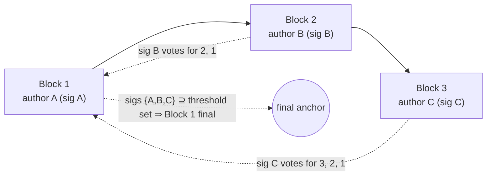

# Finality

> **Agent status:** Maintained reverse-engineered draft.
> **Engineer verification:** Pending.
> **Status:** Draft; pending engineer verification.
> **Scope:** Defines the implementation-neutral finality behavior, assumptions, constraints, security properties, and black-box test plan.

## Contents

- [Purpose & observable contract](#1-purpose--observable-contract)
- [Continuous execution](#2-continuous-execution)
- [Signing is a non-equivocating vote](#3-signing-is-a-non-equivocating-vote)
- [Virtual voting](#4-virtual-voting)
- [Leader election](#5-leader-election)
- [The three finality routes and the exact threshold](#6-the-three-finality-routes-and-the-exact-threshold)
- [Non-final transitions are carried forward](#7-non-final-transitions-are-carried-forward)
- [On-chain fallback when threshold finality is not reached](#8-on-chain-fallback-when-threshold-finality-is-not-reached)
- [Assumptions and constraints](#assumptions-and-constraints)
- [Security considerations](#security-considerations)
- [Requirements and invariants](#requirements-and-invariants)
- [Verification and test plan](#verification-and-test-plan)
- [Future Work](#future-work)

## 1. Purpose & observable contract

A block is **final** when the protocol can prove to the chain that no competing history over that
block can win. Finality is what a snapshot update needs ([lifecycle.md §5](./lifecycle.md)); it is
deliberately **decoupled from progress** — execution never stops to wait for it.

## 2. Continuous execution

**REQ-FIN-1.** Participants MUST NOT be required to wait for explicit threshold finality before
building the next block. The scheduled author builds on the latest valid state immediately, even
when that state's block has not yet collected all signatures. Requiring agreement before progress
contradicts the liveness model: one slow or absent signer would stall the channel even though the
dispute path can already prove and carry the unagreed suffix forward.

This corrects the old specification's §5.4, which required an instance not to build on unagreed
blocks. The correction is the intended design, and it is also what the required behavior provides.

## 3. Signing is a non-equivocating vote

**INV-FIN-2.** Signing a block is a binding, non-equivocating vote for that block **and the
history it links to**. A participant MUST NOT sign two different blocks at the same
`(forkId, height)` or otherwise commit to conflicting histories. Provable equivocation is fraud:
the `BlockDoubleSign` fraud proof slashes the signer
([fraud-proofs.md](./fraud-proofs.md), `fraud-proof verifier`).

This invariant is what makes the rest of this document safe: votes can be counted across blocks
(§4) because no participant can validly vote for two competing histories, and a non-final suffix
can be carried forward (§7, [state-proofs.md §6](./state-proofs.md)) because extending it never
requires trusting an unbacked claim.

## 4. Virtual voting

**REQ-FIN-3.** A signature on block _B_ is also an indirect vote for every ancestor of _B_ on the
same hash-linked chain. Signatures are therefore **cumulative across ancestry**: votes for a block
are the union of direct signatures on it and signatures on its linked descendants.

**REQ-FIN-4.** Consequently, in a channel with _N_ participants, _N_ consecutive blocks authored
by the complete participant set finalize the **first** block of the sequence, even if no
participant other than its author ever signed that first block directly: each author's signature
on their own block is a vote for all its ancestors, and the _N_ authors together cover the
threshold set.

## 5. Leader election

**REQ-FIN-5.** Block authoring is deterministic: `getNextToWrite()` — a pure function of the

**REQ-FIN-6 (SHOULD).** The recommended policy is **round-robin** over the participant set, as a
function of channel state (e.g.
`the illustrative round-robin rule`:
`participants[currentTurnIndex % participants.length]`). The safety argument for carrying
non-final suffixes forward (§7) **depends on** round-robin; see the open question below.

Authoring is time-slotted: the author has `p2pTime` from the previous relevant timestamp to
produce the block ([lifecycle.md §8](./lifecycle.md), [time.md](./time.md)). A missed slot is
objectively disputable: peers schedule a timeout check for
`p2pTime + agreementTime + chainFallbackTime` (+ first-block grace)
(`the corresponding participant-state operation`) and
then open a timeout dispute against the scheduled author
([disputes.md](./disputes.md)).

**Open question (leader election beyond round-robin):** under a different leader-election policy a
valid non-final suffix may become revertible, changing the safety, liveness, and accountability
analysis. Any objectively provable violation that a revert implies should have a clearly
attributable, slashable party, but the attribution and penalty rules are unresolved. Long-lived
channels and long-range milestone chains also need an argument that proofs stay bounded and that
long-range conflicting histories are prevented or recoverable. Before another policy is supported,
its schedule, its interaction with virtual voting and longest-valid-chain reduction, the exact
revert conditions, and the accountable party for each violation must be specified. Mirrored in
[open-questions.md](../open-questions.md) and cross-referenced from
[state-proofs.md](./state-proofs.md).

## 6. The three finality routes and the exact threshold

Finality arrives by exactly one of three routes:

1. **Explicit threshold finality.** Every required participant signed the block directly
   (`BlockConfirmation` with a full signature set).
2. **Virtual finality.** Later cryptographically linked blocks supply the missing votes (§4).
3. **Dispute resolution.** No threshold was reached in time; a participant submits the latest
   available (possibly non-final) proved state to the dispute game, and after reduction and the
   challenge period the result is canonical ([disputes.md](./disputes.md)).

**REQ-FIN-7.** The threshold is **unanimous** over the _relevant participant set_:

- Off-chain: `the corresponding agreement-tracking operation`
  requires signatures from the union of the block's previous and resulting participant sets, so a
  membership-changing block needs both the old set and the joiner/leaver where applicable
  ([state-proofs.md §5](./state-proofs.md)).
- On-chain (milestones): `_isMilestoneFinalWithExpectedParticipants` requires
  `thresholdCount == expectedParticipants.length`, where the expected set is the union of the
  previous snapshot's participants, the resulting snapshot's participants, and pending joiners
  derived from the inbound stream
  (`the corresponding state-proof verification operation`).
- On-chain (disputes): a threshold-final dispute confirmation requires signatures from
  `getOnChainThresholdSet` = (snapshot participants ∪ pending participants) − on-chain-slashed
  (`common adjudication logic`),
  and finalizes the dispute window immediately
  (`DisputeManagerFacet._isDisputeThresholdFinal`).

Sub-unanimous thresholds are not supported anywhere in the protocol definition.

**Implicit attestation — exact conditions.** A signature counts as an implicit vote for an earlier
block if and only if: both blocks are on the same `forkId`; the chain between them is hash-linked
(`previousBlockHash == keccak256(previous encodedBlock)` at every step); the author signature on
each carrying block is authentic and matches the block's declared author; and the signer counts at
most once per threshold set. These are exactly the checks the milestone verifier applies
([state-proofs.md §7](./state-proofs.md)).

## 7. Non-final transitions are carried forward

**INV-FIN-8.** Valid transitions that lacked finality when a dispute began are **not reverted**.
The dispute reduction selects the _longest valid proved history_ among the presented views —
`the corresponding dispute-verification operation`
keeps the candidate latest block with the highest `transactionCnt` (ties broken deterministically
by lower block hash) — and the successor fork's genesis state is derived from that latest state.
The carried suffix is safe because of INV-FIN-2: presenting a conflicting suffix requires a
slashable double-sign. (With the round-robin caveat of §5's open question.)

## 8. On-chain fallback when threshold finality is not reached

When the author does not see the full threshold within `agreementTime`, it posts the signed block
as calldata on-chain
(`the corresponding participant-state operation` →
`StateChannelManagerProxy.postBlockCalldata`):

- **Data availability.** The chain itself becomes the guarantor that the block data is available:
  peers ingest `BlockCalldataPosted` events, so an uncooperative peer cannot claim it never saw
  the block. No separate data-availability trust assumption is added. Costs and griefing exposure:
  [security/data-availability.md](../security/data-availability.md).
- **Cheap commitment, slashable junk.** The contract stores a single hash
  `keccak256(signedBlock, block.timestamp)`, never overwritable, and requires
  `msg.sender == block author`. It does **not** validate the block; posting junk is provable
  against the commitment and slashable against the poster.
- **Race-condition guard.** The post carries `maxTimestamp` = previous relevant timestamp +
  `p2pTime + agreementTime + chainFallbackTime` (+ grace); the chain rejects later posts, which
  bounds how late a block can be forced into the record.
- **Extra time granted.** A posted commitment changes the timing rules: the acceptable
  block-timestamp window extends by `evidenceTime` for calldata-committed blocks
  (`block-validation service`,
  `CalldataCommittedStrategy`),
  and a timeout dispute against an author who posted calldata for the claimed height is rejected
  on-chain (`RaceConditionDisputeTimeoutCalldataPosted`,
  `DisputeManagerFacet._disputeRaceConditionCheck`).
  When peers do not cooperate, this extra on-chain time is a deliberate UX and fee cost of the
  protocol design.

If the threshold still never arrives, route 3 applies: any eligible participant disputes with the
latest proved state ([state-proofs.md](./state-proofs.md)), and the reduction carries the valid
suffix forward (§7).

## Assumptions and constraints

Finality assumes unforgeable, domain-separated signatures; a known participant set at each membership point;
deterministic block and snapshot commitments; at least one path to the base chain; and a leader schedule whose
safety properties match the dispute carry-forward argument. Progress may continue without threshold finality,
but settlement cannot claim a finality route whose exact signer/virtual-vote conditions are unmet. Participant,
signature, proof-size, and timing bounds must remain compatible with on-chain verification.

## Security considerations

The protected property is that two conflicting histories cannot both become final or settle the same funds.
Threats include equivocation, signature replay across domains, incorrect thresholds, stale membership,
double-counted virtual votes, wrong-leader blocks, non-final suffix truncation, and unavailable calldata during
fallback. Verification must test both sides of every threshold and membership transition, competing forks,
duplicate/reordered signatures, delayed votes, and recovery through the chain. Leader-election and signature
domain-separation questions are security blockers, not optimization details.

## Requirements and invariants

This table is the normative requirement index. Detailed rules and rationale are defined in the sections above.

| Requirement / invariant | Statement                                                                                                                                   |
| ----------------------- | ------------------------------------------------------------------------------------------------------------------------------------------- |
| `REQ-FIN-1`             | Participants build on the latest valid state immediately; explicit threshold finality is never a precondition for producing the next block. |
| `INV-FIN-2`             | Signing is a non-equivocating vote; provable equivocation is slashable.                                                                     |
| `REQ-FIN-3`             | Signatures accumulate across hash-linked ancestry (virtual voting).                                                                         |
| `REQ-FIN-4`             | N consecutive blocks authored by the complete participant set finalize the sequence's first block.                                          |
| `REQ-FIN-5`             | Deterministic block-level authoring via `getNextToWrite`; a missed slot is timeout-disputable.                                              |
| `REQ-FIN-6`             | Recommended leader-election policy is round-robin as a function of channel state.                                                           |
| `REQ-FIN-7`             | The finality threshold is unanimous over the relevant union participant set (minus on-chain-slashed, for disputes).                         |
| `INV-FIN-8`             | Valid non-final transitions are carried into the canonical successor fork, not reverted (longest valid proved history wins).                |

## Verification and test plan

### Requirement test matrix

Each row is a planned black-box test obligation, not an additional specification requirement. The requirement remains the authority. Execute the row through public protocol inputs from every applicable pre-state defined by this document. Every required permutation has a stable `P1`…`PN` suffix under its plan item. The list is exhaustive unless it explicitly says that boundary or pairwise representatives are sufficient; an omitted permutation needs an engineer-approved rationale.

| Plan item      | Requirements / invariants | Setup and stimulus                                                                                                                                    | Expected result                                                                                                                             | Required permutations                                                                                                                                                                                                                                                                                                                                               |
| -------------- | ------------------------- | ----------------------------------------------------------------------------------------------------------------------------------------------------- | ------------------------------------------------------------------------------------------------------------------------------------------- | ------------------------------------------------------------------------------------------------------------------------------------------------------------------------------------------------------------------------------------------------------------------------------------------------------------------------------------------------------------------- |
| `REQ-FIN-1.T1` | `REQ-FIN-1`               | Use the applicable black-box method in the verification strategy above; exercise the behavior through public inputs without implementation internals. | Participants build on the latest valid state immediately; explicit threshold finality is never a precondition for producing the next block. | `REQ-FIN-1.T1.P1` — valid case and direct invalid/opposite `REQ-FIN-1.T1.P2` — correct/wrong/missing/duplicate/forged identity or signature and membership boundary                                                                                                                                                                                              |
| `INV-FIN-2.T1` | `INV-FIN-2`               | Use the applicable black-box method in the verification strategy above; exercise the behavior through public inputs without implementation internals. | Signing is a non-equivocating vote; provable equivocation is slashable.                                                                     | `INV-FIN-2.T1.P1` — valid case and direct invalid/opposite `INV-FIN-2.T1.P2` — correct/wrong/missing/duplicate/forged identity or signature and membership boundary `INV-FIN-2.T1.P3` — new/existing/removed/slashed participant and concurrent membership change                                                                                             |
| `REQ-FIN-3.T1` | `REQ-FIN-3`               | Use the applicable black-box method in the verification strategy above; exercise the behavior through public inputs without implementation internals. | Signatures accumulate across hash-linked ancestry (virtual voting).                                                                         | `REQ-FIN-3.T1.P1` — valid case and direct invalid/opposite `REQ-FIN-3.T1.P2` — matching/mismatched commitment, predecessor/genesis, stale and foreign fork `REQ-FIN-3.T1.P3` — correct/wrong/missing/duplicate/forged identity or signature and membership boundary                                                                                           |
| `REQ-FIN-4.T1` | `REQ-FIN-4`               | Use the applicable black-box method in the verification strategy above; exercise the behavior through public inputs without implementation internals. | N consecutive blocks authored by the complete participant set finalize the sequence's first block.                                          | `REQ-FIN-4.T1.P1` — valid case and direct invalid/opposite `REQ-FIN-4.T1.P2` — correct/wrong/missing/duplicate/forged identity or signature and membership boundary                                                                                                                                                                                              |
| `REQ-FIN-5.T1` | `REQ-FIN-5`               | Use the applicable black-box method in the verification strategy above; exercise the behavior through public inputs without implementation internals. | Deterministic block-level authoring via `getNextToWrite`; a missed slot is timeout-disputable.                                              | `REQ-FIN-5.T1.P1` — valid case and direct invalid/opposite `REQ-FIN-5.T1.P2` — correct/wrong/missing/duplicate/forged identity or signature and membership boundary `REQ-FIN-5.T1.P3` — before/at/after deadline and maximum honest skew                                                                                                                      |
| `REQ-FIN-6.T1` | `REQ-FIN-6`               | Use the applicable black-box method in the verification strategy above; exercise the behavior through public inputs without implementation internals. | Recommended leader-election policy is round-robin as a function of channel state.                                                           | `REQ-FIN-6.T1.P1` — valid case and direct invalid/opposite `REQ-FIN-6.T1.P2` — zero/empty/no-op where meaningful, exact boundary, failure/recovery and relevant race                                                                                                                                                                                             |
| `REQ-FIN-7.T1` | `REQ-FIN-7`               | Use the applicable black-box method in the verification strategy above; exercise the behavior through public inputs without implementation internals. | The finality threshold is unanimous over the relevant union participant set (minus on-chain-slashed, for disputes).                         | `REQ-FIN-7.T1.P1` — valid case and direct invalid/opposite `REQ-FIN-7.T1.P2` — correct/wrong/missing/duplicate/forged identity or signature and membership boundary `REQ-FIN-7.T1.P3` — new/existing/removed/slashed participant and concurrent membership change `REQ-FIN-7.T1.P4` — malformed and adversarial input, partial failure, retry and recovery |
| `INV-FIN-8.T1` | `INV-FIN-8`               | Use the applicable black-box method in the verification strategy above; exercise the behavior through public inputs without implementation internals. | Valid non-final transitions are carried into the canonical successor fork, not reverted (longest valid proved history wins).                | `INV-FIN-8.T1.P1` — valid case and direct invalid/opposite `INV-FIN-8.T1.P2` — matching/mismatched commitment, predecessor/genesis, stale and foreign fork                                                                                                                                                                                                       |

## Future Work

_Non-normative._

- Sub-unanimous or weighted thresholds: would change every union-set computation, the milestone
  verifier, and the dispute threshold; requires a fresh safety analysis against INV-FIN-2.
- Alternative leader-election policies (see the open question in §5) — including
  availability-aware schedules that skip repeatedly absent authors without a dispute.
- Signature aggregation (e.g. BLS) to shrink `BlockConfirmation`s and milestone proofs.
- Explicit finality gadgets/checkpointing for very long-lived channels so proofs stay bounded
  without trusting the whole suffix chain.
