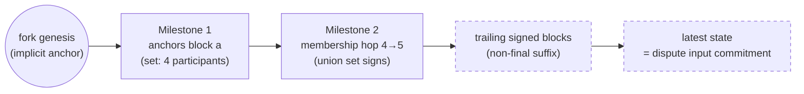

# State Proofs & Milestones

> **Agent status:** Maintained reverse-engineered draft.
> **Engineer verification:** Pending.
> **Status:** Draft; pending engineer verification.
> **Scope:** Defines the implementation-neutral state proofs & milestones behavior, assumptions, constraints, security properties, and black-box test plan.

## Contents

- [Purpose & observable contract](#1-purpose--observable-contract)
- [A milestone is a finality anchor](#2-a-milestone-is-a-finality-anchor)
- [Anchors chain to the latest state](#3-anchors-chain-to-the-latest-state)
- [Membership hops are required at participant-set changes](#4-membership-hops-are-required-at-participant-set-changes)
- [Genesis anchoring](#5-genesis-anchoring)
- [Why the non-final suffix is safe](#6-why-the-non-final-suffix-is-safe)
- [Assumptions and constraints](#assumptions-and-constraints)
- [Security considerations](#security-considerations)
- [Requirements and invariants](#requirements-and-invariants)
- [Verification and test plan](#verification-and-test-plan)
- [Future Work](#future-work)

## 1. Purpose & observable contract

A **state proof** convinces the chain — which stores only the current snapshot — that a claimed
state belongs to a fork's canonical history. It is the evidence a dispute submits with its claim
and the core of a same-fork snapshot update.

Data model:

```solidity
struct MilestoneProof { BlockConfirmation[] blockConfirmations; }
struct StateProof {
    MilestoneProof[] milestones;   // proves the last finalized block in the fork
    SignedBlock[] signedBlocks;    // links the last milestone to the claimed latest block
}
```

The heavy backing data (genesis and latest snapshots, per-milestone snapshots, message blocks) is
carried in `DisputeAuditingData` and referenced
from the dispute by hash.

**What the proof guarantees:** a path of finality anchors from the fork's genesis to the last
provable anchor, and a cryptographic link from that anchor to the claimed latest state. **What it
does not guarantee:** that the latest state is final, or that its transitions were semantically
valid — invalid transitions inside a proof are handled by the dispute fraud proofs
([fraud-proofs.md](./fraud-proofs.md)), and non-finality is resolved by reduction (§6).

## 2. A milestone is a finality anchor

**REQ-SP-1.** A milestone is not merely a list of independently threshold-signed blocks. It is a
**finality anchor**: a consecutive, hash-linked run of block confirmations whose accumulated
signatures finalize the run's **first** block. That first block's confirmation is final either
directly — it carries the required threshold signatures itself — or **virtually**, because later,
cryptographically linked confirmations inside the milestone carry their signatures back through
the ancestry ([finality.md §4](./finality.md)).

## 3. Anchors chain to the latest state

**REQ-SP-2.** A state proof establishes a path from one final anchor to the next, and finally to
the **latest state** the dispute transition operates on. The latest state itself need **not** be
final; it MUST be a cryptographically linked descendant of the last proved final anchor. That
linkage is what places it on the canonical chain before the dispute game applies its transition.

**REQ-SP-5.** The final block of the proved path supplies the state commitment
(`stateSnapshotHash` → `latestStateSnapshotHash`) that the dispute game and the reduction operate
on (`the corresponding state-proof verification operation`).



_(The dashed suffix is the intended shape; the protocol definition restricts it — see §8.)_

## 4. Membership hops are required at participant-set changes

**REQ-SP-3.** A join or removal changes the threshold set, so a proof crossing a membership change
MUST establish the old-set → new-set transition at the relevant block with a milestone hop; it
cannot simply assert the new membership. The hop's threshold is the **union** of the sets involved:
a 4→5 join is final only when the four original participants _and_ the joiner have (directly or
virtually) signed — proof that both the original set and the joiner authorized the change. A
removal requires the corresponding proof in the other direction (the pre-removal set covers the
leaving member).

Milestones entirely below the chain's current snapshot height are skipped by the verifier (they
are already settled); the last skipped milestone is still checked to link through the current
on-chain snapshot.

## 5. Genesis anchoring

**REQ-SP-4.** When a proof starts at fork genesis, genesis is the **implicit final anchor** for
that fork; no milestone is needed for it. Concretely:

- An **empty** proof (no milestones, no signed blocks) claims the fork's genesis snapshot itself
  as the latest state: `isCorrectLatestState` reconstructs the genesis `StateSnapshot` — fork id
  must equal `keccak256(abi.encode(genesisSnapshotData))` (`_isGenesisSnapshotDataLinkedToFork`),
  with the genesis timestamp derived on-chain (`getGenesisTimestamp`: the origin fork's dispute
  window kill-period end, or the stored snapshot's timestamp for the root fork) — and compares its
  hash to the claim.
- A **signed-blocks** proof provides the linked path from genesis: the first block MUST have
  `transactionCnt == 0` and each subsequent block MUST link by `previousBlockHash`
  (`_areSignedBlocksLinkedAndVerified`).
- Where milestones exist, their anchors provide the base; trailing signed blocks extend from the
  last proved milestone to the latest non-final state _(intended — restricted in the current
  code, §8)_.

## 6. Why the non-final suffix is safe

**INV-SP-6.** Extending the proved anchor with unfinalized blocks is safe because signing is a
non-equivocating commitment ([finality.md §3](./finality.md)): a participant cannot commit to
conflicting histories without exposing a slashable double-sign. Different participants MAY still
present different valid latest states during a dispute (they saw different suffix lengths). The
reduction MUST consider all validly proved views and choose the **longest valid proved history**
as canonical — this is how the latest non-final state joins canonical reality instead of being
discarded.

**Open question (shared with [finality.md §5](./finality.md)):** this safety argument currently
depends on round-robin leader election. Other policies may allow a valid suffix to be reverted and
need explicit attribution and penalty rules; long-lived channels and long-range milestone chains
need bounded proofs. Mirrored in [open-questions.md](../open-questions.md).

## Assumptions and constraints

State proofs assume authentic domain-separated signatures, collision-resistant canonical commitments,
available snapshots and auditing data, deterministic membership derivation, and bounded proof length/gas. A
proof establishes linkage and finality anchors, not semantic validity of every transition; fraud-proof and
dispute mechanisms own those checks. Membership changes require explicit hops, genesis has one canonical
anchor, and a non-final suffix is accepted only under the carry-forward rules defined here.

## Security considerations

An unsound proof can advance or dispute the wrong state and therefore endanger all channel funds. Threats
include missing/reordered milestones, skipped membership changes, wrong-genesis linkage, duplicate signatures,
threshold off-by-one errors, malformed suffixes, hash-only unavailable data, proof-size exhaustion, and
predicate drift between validation paths. Verification needs positive and negative cases at every structural
boundary plus adversarial combinations; a proof rejection must leave canonical state unchanged.

## Requirements and invariants

This table is the normative requirement index. Detailed rules and rationale are defined in the sections above.

| Requirement / invariant | Statement                                                                                                                                                          |
| ----------------------- | ------------------------------------------------------------------------------------------------------------------------------------------------------------------ |
| `REQ-SP-1`              | A milestone is a finality anchor: its first block is final directly or via virtual votes from later linked confirmations within the milestone.                     |
| `REQ-SP-2`              | Proofs chain anchor→anchor→latest state; the latest state need not be final but must be a cryptographically linked descendant of the last proved anchor.           |
| `REQ-SP-3`              | Membership changes require milestone hops proven under the old∪new (plus pending joiners) union threshold.                                                         |
| `REQ-SP-4`              | Fork genesis is the implicit final anchor: empty proofs claim the genesis snapshot; signed-block proofs must start at `transactionCnt == 0` and hash-link forward. |
| `REQ-SP-5`              | The final block of the proved path supplies the state commitment the dispute game operates on.                                                                     |
| `INV-SP-6`              | Non-final suffixes are safe: conflicting commitments expose slashable double-signs, and reduction selects the longest valid proved history.                        |
| `REQ-SP-7`              | Linkage checks: hash linkage, fork identity, authentic author signatures, threshold coverage, and latest-state commitment, exactly as listed in §7.                |

## Verification and test plan

### Requirement test matrix

Each row is a planned black-box test obligation, not an additional specification requirement. The requirement remains the authority. Execute the row through public protocol inputs from every applicable pre-state defined by this document. Every required permutation has a stable `P1`…`PN` suffix under its plan item. The list is exhaustive unless it explicitly says that boundary or pairwise representatives are sufficient; an omitted permutation needs an engineer-approved rationale.

| Plan item     | Requirements / invariants | Setup and stimulus                                                                                                                                    | Expected result                                                                                                                                                    | Required permutations                                                                                                                                                                                                                                                                                                                                                  |
| ------------- | ------------------------- | ----------------------------------------------------------------------------------------------------------------------------------------------------- | ------------------------------------------------------------------------------------------------------------------------------------------------------------------ | ---------------------------------------------------------------------------------------------------------------------------------------------------------------------------------------------------------------------------------------------------------------------------------------------------------------------------------------------------------------------- |
| `REQ-SP-1.T1` | `REQ-SP-1`                | Use the applicable black-box method in the verification strategy above; exercise the behavior through public inputs without implementation internals. | A milestone is a finality anchor: its first block is final directly or via virtual votes from later linked confirmations within the milestone.                     | `REQ-SP-1.T1.P1` — valid case and direct invalid/opposite<br>`REQ-SP-1.T1.P2` — matching/mismatched commitment, predecessor/genesis, stale and foreign fork                                                                                                                                                                                                            |
| `REQ-SP-2.T1` | `REQ-SP-2`                | Use the applicable black-box method in the verification strategy above; exercise the behavior through public inputs without implementation internals. | Proofs chain anchor→anchor→latest state; the latest state need not be final but must be a cryptographically linked descendant of the last proved anchor.           | `REQ-SP-2.T1.P1` — valid case and direct invalid/opposite<br>`REQ-SP-2.T1.P2` — matching/mismatched commitment, predecessor/genesis, stale and foreign fork                                                                                                                                                                                                            |
| `REQ-SP-3.T1` | `REQ-SP-3`                | Use the applicable black-box method in the verification strategy above; exercise the behavior through public inputs without implementation internals. | Membership changes require milestone hops proven under the old∪new (plus pending joiners) union threshold.                                                         | `REQ-SP-3.T1.P1` — valid case and direct invalid/opposite<br>`REQ-SP-3.T1.P2` — correct/wrong/missing/duplicate/forged identity or signature and membership boundary<br>`REQ-SP-3.T1.P3` — new/existing/removed/slashed participant and concurrent membership change                                                                                                   |
| `REQ-SP-4.T1` | `REQ-SP-4`                | Use the applicable black-box method in the verification strategy above; exercise the behavior through public inputs without implementation internals. | Fork genesis is the implicit final anchor: empty proofs claim the genesis snapshot; signed-block proofs must start at `transactionCnt == 0` and hash-link forward. | `REQ-SP-4.T1.P1` — valid case and direct invalid/opposite<br>`REQ-SP-4.T1.P2` — matching/mismatched commitment, predecessor/genesis, stale and foreign fork<br>`REQ-SP-4.T1.P3` — correct/wrong/missing/duplicate/forged identity or signature and membership boundary                                                                                                 |
| `REQ-SP-5.T1` | `REQ-SP-5`                | Use the applicable black-box method in the verification strategy above; exercise the behavior through public inputs without implementation internals. | The final block of the proved path supplies the state commitment the dispute game operates on.                                                                     | `REQ-SP-5.T1.P1` — valid case and direct invalid/opposite<br>`REQ-SP-5.T1.P2` — matching/mismatched commitment, predecessor/genesis, stale and foreign fork<br>`REQ-SP-5.T1.P3` — malformed and adversarial input, partial failure, retry and recovery                                                                                                                 |
| `INV-SP-6.T1` | `INV-SP-6`                | Use the applicable black-box method in the verification strategy above; exercise the behavior through public inputs without implementation internals. | Non-final suffixes are safe: conflicting commitments expose slashable double-signs, and reduction selects the longest valid proved history.                        | `INV-SP-6.T1.P1` — valid case and direct invalid/opposite<br>`INV-SP-6.T1.P2` — matching/mismatched commitment, predecessor/genesis, stale and foreign fork<br>`INV-SP-6.T1.P3` — correct/wrong/missing/duplicate/forged identity or signature and membership boundary<br>`INV-SP-6.T1.P4` — new/existing/removed/slashed participant and concurrent membership change |
| `REQ-SP-7.T1` | `REQ-SP-7`                | Use the applicable black-box method in the verification strategy above; exercise the behavior through public inputs without implementation internals. | Linkage checks: hash linkage, fork identity, authentic author signatures, threshold coverage, and latest-state commitment, exactly as listed in §7.                | `REQ-SP-7.T1.P1` — valid case and direct invalid/opposite<br>`REQ-SP-7.T1.P2` — matching/mismatched commitment, predecessor/genesis, stale and foreign fork<br>`REQ-SP-7.T1.P3` — correct/wrong/missing/duplicate/forged identity or signature and membership boundary                                                                                                 |

## Future Work

_Non-normative._

- Bound proof size and verification gas: per-call gas ceilings, proof-size limits as a function
  of participant count, or incremental verification across transactions.
- Long-range proofs for long-lived channels: checkpointing the last settled anchor on-chain so
  proofs only ever span since-last-settlement history (interacts with `verifyMilestones`'s
  skip-below-snapshot logic, which already prunes settled prefixes).
- Signature aggregation inside `MilestoneProof` to compress hops in large channels.
