# Protocol Lifecycle

> **Agent status:** Maintained reverse-engineered draft.
> **Engineer verification:** Pending.
> **Status:** Draft; pending engineer verification.
> **Scope:** Defines the implementation-neutral protocol lifecycle behavior, assumptions, constraints, security properties, and black-box test plan.

## Contents

- [Purpose & observable contract](#1-purpose--observable-contract)
- [Lifecycle at a glance](#2-lifecycle-at-a-glance)
- [Phase 1 — Opening (on-chain, tx 1)](#3-phase-1--opening-on-chain-tx-1)
- [Phase 2 — Continuous execution (off-chain)](#4-phase-2--continuous-execution-off-chain)
- [Two paths to a snapshot-updating state](#5-two-paths-to-a-snapshot-updating-state)
- [Phase 3 — Disputes (on-chain fallback)](#6-phase-3--disputes-on-chain-fallback)
- [Phase 4 — Settlement (on-chain, tx 2)](#7-phase-4--settlement-on-chain-tx-2)
- [The four timing windows](#8-the-four-timing-windows)
- [Assumptions and constraints](#assumptions-and-constraints)
- [Security considerations](#security-considerations)
- [Requirements and invariants](#requirements-and-invariants)
- [Verification and test plan](#verification-and-test-plan)
- [Future Work](#future-work)

## 1. Purpose & observable contract

The lifecycle defines when a channel touches the base layer and what each touch accomplishes.
The design goal is that everything between opening and settlement is off-chain, free, and
real-time; the chain is touched to move value across the layer boundary and to adjudicate when
peers cannot cooperate.

**[`REQ-LIF-1-A5BN02`](lifecycle.md#req-lif-1-a5bn02).** The best-case complete lifecycle needs **at least two** base-layer transactions:

1. **Open/deposit** — `StateChannelManagerProxy.open`
   verifies the unanimously signed terms, deposits the committed assets, and records the genesis
   snapshot.
2. **Settlement** — a snapshot update
   (`StateSnapshotFacet.updateStateSnapshotSameFork` / `updateStateSnapshotFork`)
   that advances the on-chain snapshot and processes the outbound message stream, releasing
   withdrawals. This is the **normal** deposits-and-withdrawals path, not a dispute-only
   exceptional path.

The earlier claim that "opening is the one unavoidable on-chain step" is wrong: a participant who
wants their value back always needs the settlement transaction too. The real lifecycle can require
more transactions — joins and top-ups
(`JoinChannelFacet`),
block-calldata posts (`postBlockCalldata`), dispute uploads, reductions, challenges, fraud proofs,
and forced inbound inclusion.

## 2. Lifecycle at a glance

```mermaid
stateDiagram-v2
    [*] --> Opening
    Opening --> Executing: open() succeeds on-chain (tx 1)
    Executing --> Executing: continuous block production;\nfinality trails via thresholds / virtual votes
    Executing --> Executing: joins, top-ups, deposits\n(extra on-chain txs → inbound stream)
    Executing --> Disputing: timeout, on-chain slashes,\nself-removal, forced inbound inclusion
    Disputing --> Executing: reduction produces the canonical successor fork;\nvalid state carried forward
    Executing --> Settling: finalized snapshot submitted on-chain (tx 2)
    Disputing --> Settling: successor-fork snapshot adopted\nafter the reduce challenge period
    Settling --> [*]: outbound stream processed incrementally;\nwithdrawals released; storage cleared at 0 participants
```



Fraud proofs run on a separate, immediate path beside this lifecycle: an objective violation seen
at any point can be proven on-chain at once and adds the offender to the on-chain slash set that
later dispute reductions consume. See [fraud-proofs.md](../disputes/fraud-proofs.md).

### Assumptions, constraints & dependencies

- The chain hosting the manager is live, honest, and final, and every participant can reach it
  through at least one honest RPC endpoint ([security/trust-model.md](../security/trust-model.md)).
- All deadlines are measured against chain-aligned time
  (`Clock`, [time.md](../protocol-model/time.md)).
- The integrator state machine is deterministic and its state serializes canonically
  ([concepts/state-machines.md](../protocol-model/state-machines.md)).

## 3. Phase 1 — Opening (on-chain, tx 1)

Participants submit a threshold-authorized open request to the base-layer adjudicator. The
application boundary accepts deposits and derives the genesis state; each off-chain participant
then observes the canonical open event and initializes the same channel and fork.

`open()` requires a non-zero channel id, no duplicate participants, a signature from **every**
listed participant over the encoded `OpenChannel`, and at least two successful deposits. Deposits
run composably through the application boundary (`depositAssetsComposable`), atomically when
`OpenChannel.isAtomic` is set. The successful joins become the first inbound message block; the
application boundary builds the genesis state; the genesis `SnapshotData` commits to the state hash,
participants, stream tips, and deposit totals; and `forkId = keccak256(abi.encode(genesisSnapshotData))`
becomes the root fork identity ([concepts/history-and-commitments.md](../protocol-model/history-and-commitments.md)).

Later joins and top-ups are additional on-chain transactions that append to the **inbound** stream
and enter channel state when a block author packages them; see
[cross-layer-messages.md](./cross-layer-messages.md).

## 4. Phase 2 — Continuous execution (off-chain)

The scheduled participant authors and validates blocks, peers exchange confirmations and
signatures, and all participants advance the same deterministic state. The base layer is absent
from the happy path; calldata publication remains the data-availability fallback.

The deterministically scheduled author (`getNextToWrite()`) executes a transaction locally, builds
the block, signs it, and broadcasts it. Peers re-execute, verify author, linkage, and timing, then
sign and return signatures. Participants **do not wait** for a block to reach threshold finality
before building the next one — finality trails behind production. The full model, including the
three finality routes and the calldata fallback, is specified in [finality.md](../protocol-model/finality.md).

**[`REQ-LIF-3-PDRTPY`](lifecycle.md#req-lif-3-pdrtpy).** A normal state transition MAY produce an outbound message — including an
`ExitChannel` — as an ordinary transition result. Exits are **not** limited to removal or
slashing, and **producing the message requires no finality**. Finality is required only when a
snapshot carrying that outbound tip is submitted on-chain.

## 5. Two paths to a snapshot-updating state

**[`REQ-LIF-2-Z3Z9Y3`](lifecycle.md#req-lif-2-z3z9y3).** Exactly two paths lead to a state that can update the on-chain snapshot and support
withdrawals:

1. **Same-fork finality.** Every required participant signed (directly or via virtual votes —
   [finality.md](../protocol-model/finality.md)); the proof of finality (milestone proofs + milestone snapshots —
   [state-proofs.md](../disputes/state-proofs.md)) is submitted with the snapshot via
   `updateStateSnapshotSameFork`. the adjudicator checks the snapshot is newer, the milestones verify
   against the current on-chain snapshot's threshold set, and all pending inbound messages were
   consumed.
2. **Dispute resolution.** A dispute window reduces deterministically to a successor fork
   ([disputes.md](../disputes/disputes.md)); after the reduce challenge period (`evidenceTime`) expires,
   `updateStateSnapshotFork` adopts the successor fork's genesis snapshot. the adjudicator walks the
   `reducedResult` chain from the current on-chain fork, so several dispute generations can be
   adopted in one call.

Both paths converge on `_updateStateSnapshot`, which processes the outbound stream (below).

## 6. Phase 3 — Disputes (on-chain fallback)

The disputing participant constructs and audits evidence while the base-layer adjudicator owns the
window lifecycle, proof validation, reduction, and successor-fork commitment.

The valid dispute inputs are participant timeout, accumulated on-chain slashes, voluntary
self-removal, and forced inclusion of newer inbound messages ([disputes.md](../disputes/disputes.md)).
Uploading a dispute opens (or joins) a `DisputeWindow` for the disputed fork and records the
disputer's commitment immediately.

**[`REQ-LIF-4-SW8GVY`](lifecycle.md#req-lif-4-sw8gvy).** Every initiated dispute runs through the dispute game and produces a **canonical
successor fork** — whether the submitted claim is ultimately accepted, rejected, or reduced away.
The reduction (`reduce` → `reduceOutputToSnapshotData`) deterministically folds the committed
disputes into a new genesis `SnapshotData`; its hash is the successor `forkId`; off-chain
execution resumes from that fork with valid non-final transitions carried forward
([finality.md §7](../protocol-model/finality.md)). An invalid committed dispute can be killed during the kill
period and its opener slashed, but the window it opened still resolves to a canonical outcome for
the fork; the exact kill semantics are specified (with their open questions) in
[disputes.md](../disputes/disputes.md).

## 7. Phase 4 — Settlement (on-chain, tx 2)

The submitting participant selects the settlement path and assembles the required proof. The
base-layer adjudicator verifies it, handles benign races such as another peer settling first,
persists the snapshot, and invokes the application withdrawal boundary.

Settlement is **incremental outbound-stream processing** during a snapshot update, not a
standalone withdrawal call. `_updateStateSnapshot`:

1. prunes outbound message blocks the chain already processed (comparing against the stored
   outbound tip),
2. verifies the supplied range links the old tip to the new snapshot's committed tip,
3. processes each message (an `EXIT` message runs `withdrawAssetsComposable` → application boundary
   `withdraw`), accumulating `totalWithdrawals`,
4. **[`INV-LIF-5-ENQB91`](lifecycle.md#inv-lif-5-enqb91):** requires `totalWithdrawals <= totalDeposits` after every message
   (`CantWithdrawMoreThanDeposits`) — settlement conserves value,
5. stores the new snapshot and advances the outbound accounting; at 0 remaining participants the
   channel's storage is cleared.

```mermaid
sequenceDiagram
    participant off-chain participant as off-chain participant (snapshot submitter)
    participant SS as StateSnapshotFacet
    participant CF as ConsumerFacet
    off-chain participant->>SS: updateStateSnapshotSameFork(milestoneProofs, milestoneSnapshots, outboundBlocks)
    SS->>SS: verify milestones vs current snapshot's threshold set
    SS->>SS: prune already-processed outbound blocks, verify linkage old tip → new tip
    loop each new outbound message
        SS->>CF: withdraw(ExitChannel)
        SS->>SS: totalWithdrawals += balance; require ≤ totalDeposits
    end
    SS->>SS: store new snapshot, advance outbound marker
    SS-->>off-chain participant: StateSnapshotUpdated / WithdrawalsUpdated
```

The same mechanism serves normal exits, dispute-derived exits, and arbitrary outbound messages;
the stream model is specified in [cross-layer-messages.md](./cross-layer-messages.md).

## 8. The four timing windows

**[`REQ-LIF-6-VG861M`](lifecycle.md#req-lif-6-vg861m).** Four protocol windows are configured on the manager at deployment
(`StateChannelManagerProxy`
deployment configuration; defaults in seconds in parentheses) and mirrored into the off-chain participant's
`timeConfig`. Each bounds a specific phase:

| Window              | Default | Bounds                                                                                                                                                                                                                                                                                                                                                                                                           |
| ------------------- | ------- | ---------------------------------------------------------------------------------------------------------------------------------------------------------------------------------------------------------------------------------------------------------------------------------------------------------------------------------------------------------------------------------------------------------------- |
| `p2pTime`           | 15      | The author's slot: the maximum block timestamp is the previous relevant timestamp + `p2pTime` (+ first-block grace). Producing later makes the slot objectively missed.                                                                                                                                                                                                                                          |
| `agreementTime`     | 5       | Signature collection: how long the author waits for the full threshold before falling back to posting block calldata on-chain (`the corresponding participant-state operation`); also the peer RPC timeout and the wait before an exiting participant escalates.                                                                                                                                                 |
| `chainFallbackTime` | 30      | Extra time to land the calldata post on-chain: the timeout clock for the next author runs for `p2pTime + agreementTime + chainFallbackTime` (+ grace) before a timeout dispute is opened (`the corresponding participant-state operation`), and `postBlockCalldata`'s `maxTimestamp` guard uses the same bound.                                                                                                  |
| `evidenceTime`      | 30      | Every on-chain dispute period: the evidence period (window creation + `evidenceTime`), the kill period (last evidence submission + `evidenceTime`), the reduce challenge period (reduction + `evidenceTime`), and the per-disputer throttle. A posted calldata commitment also extends the acceptable block-timestamp window by `evidenceTime` — the extra time the protocol grants when peers do not cooperate. |

The calldata fallback's cost and griefing exposure are a deliberate, known weakness of the current
design — see [security/data-availability.md](../security/data-availability.md). Chain-time
tracking, skew bounds, and timestamp validation rules are in [time.md](../protocol-model/time.md).

## Assumptions and constraints

The lifecycle assumes a live final chain, valid channel setup, deterministic off-chain execution, available
history/proofs, and timing windows that permit honest observation and response. Opening and settlement are
unavoidable chain boundaries; joins, top-ups, forced data publication, disputes, and fraud proofs add further
transactions as behavior requires. Phase transitions must be monotonic or explicitly recoverable, and no
failure may strand value in a state that neither execution nor adjudication can advance.

## Security considerations

Lifecycle security concerns ownership of deposits, authorization to advance state, availability during
offline periods, and atomic movement between phases. Tests must cover duplicate/reordered chain events,
partial opening, concurrent execution and joins, stale snapshot attempts, unavailable peers, dispute races,
failed settlement, retry/recovery, and all terminal states. The diagram is not sufficient evidence: every edge
and prohibited edge needs an observable oracle and must preserve value and canonical-history invariants.

## Requirements and invariants

This table is the normative requirement index. Detailed rules and rationale are defined in the sections above.

| Requirement / invariant                         | Statement                                                                                                                                             |
| ----------------------------------------------- | ----------------------------------------------------------------------------------------------------------------------------------------------------- |
| <a id="req-lif-1-a5bn02"></a>`REQ-LIF-1-A5BN02` | Best-case complete lifecycle needs at least two base-layer txs: open/deposit and settlement via a snapshot update that processes the outbound stream. |
| <a id="req-lif-2-z3z9y3"></a>`REQ-LIF-2-Z3Z9Y3` | Only two paths yield a snapshot-updating state: same-fork finality proof, or dispute reduction after the challenge window.                            |
| <a id="req-lif-3-pdrtpy"></a>`REQ-LIF-3-PDRTPY` | A normal transition may produce an outbound exit message; producing it needs no finality — finality is needed only at on-chain snapshot submission.   |
| <a id="req-lif-4-sw8gvy"></a>`REQ-LIF-4-SW8GVY` | Every initiated dispute produces a canonical successor fork; execution resumes from it.                                                               |
| <a id="inv-lif-5-enqb91"></a>`INV-LIF-5-ENQB91` | Settlement conserves value: processed withdrawals never exceed deposits.                                                                              |
| <a id="req-lif-6-vg861m"></a>`REQ-LIF-6-VG861M` | Four deployment-configured windows (`p2pTime`, `agreementTime`, `chainFallbackTime`, `evidenceTime`) bound the phases as specified in §8.             |

## Verification and test plan

### Requirement test matrix

Each row is a planned black-box test obligation, not an additional specification requirement. The requirement remains the authority. Execute the row through public protocol inputs from every applicable pre-state defined by this document. Every required permutation has a stable `P1`…`PN` suffix under its plan item. The list is exhaustive unless it explicitly says that boundary or pairwise representatives are sufficient; an omitted permutation needs an engineer-approved rationale.

| Plan item                                             | Requirements / invariants                           | Setup and stimulus                                                                                                                                    | Expected result                                                                                                                                       | Required permutations                                                                                                                                                                                                                                                                                                                                                                                                                                                                                                                                                                                                                                                                                                                                                                                                                                                                                                                                                                                                                                                                                                                                                                                                                                                                                                                                                          |
| ----------------------------------------------------- | --------------------------------------------------- | ----------------------------------------------------------------------------------------------------------------------------------------------------- | ----------------------------------------------------------------------------------------------------------------------------------------------------- | ------------------------------------------------------------------------------------------------------------------------------------------------------------------------------------------------------------------------------------------------------------------------------------------------------------------------------------------------------------------------------------------------------------------------------------------------------------------------------------------------------------------------------------------------------------------------------------------------------------------------------------------------------------------------------------------------------------------------------------------------------------------------------------------------------------------------------------------------------------------------------------------------------------------------------------------------------------------------------------------------------------------------------------------------------------------------------------------------------------------------------------------------------------------------------------------------------------------------------------------------------------------------------------------------------------------------------------------------------------------------------ |
| <a id="req-lif-1-a5bn02.t1"></a>`REQ-LIF-1-A5BN02.T1` | [`REQ-LIF-1-A5BN02`](lifecycle.md#req-lif-1-a5bn02) | Use the applicable black-box method in the verification strategy above; exercise the behavior through public inputs without implementation internals. | Best-case complete lifecycle needs at least two base-layer txs: open/deposit and settlement via a snapshot update that processes the outbound stream. | <a id="req-lif-1-a5bn02.t1.p1"></a>`REQ-LIF-1-A5BN02.T1.P1` — valid case<br><a id="req-lif-1-a5bn02.t1.p4"></a>`REQ-LIF-1-A5BN02.T1.P4` — direct invalid/opposite case<br><a id="req-lif-1-a5bn02.t1.p2"></a>`REQ-LIF-1-A5BN02.T1.P2` — matching commitment<br><a id="req-lif-1-a5bn02.t1.p5"></a>`REQ-LIF-1-A5BN02.T1.P5` — mismatched commitment<br><a id="req-lif-1-a5bn02.t1.p6"></a>`REQ-LIF-1-A5BN02.T1.P6` — predecessor snapshot<br><a id="req-lif-1-a5bn02.t1.p7"></a>`REQ-LIF-1-A5BN02.T1.P7` — genesis snapshot<br><a id="req-lif-1-a5bn02.t1.p8"></a>`REQ-LIF-1-A5BN02.T1.P8` — stale fork<br><a id="req-lif-1-a5bn02.t1.p9"></a>`REQ-LIF-1-A5BN02.T1.P9` — foreign fork<br><a id="req-lif-1-a5bn02.t1.p3"></a>`REQ-LIF-1-A5BN02.T1.P3` — zero balance<br><a id="req-lif-1-a5bn02.t1.p10"></a>`REQ-LIF-1-A5BN02.T1.P10` — exact balance boundary<br><a id="req-lif-1-a5bn02.t1.p11"></a>`REQ-LIF-1-A5BN02.T1.P11` — one beyond boundary<br><a id="req-lif-1-a5bn02.t1.p12"></a>`REQ-LIF-1-A5BN02.T1.P12` — maximum value<br><a id="req-lif-1-a5bn02.t1.p13"></a>`REQ-LIF-1-A5BN02.T1.P13` — conservation check                                                                                                                                                                                                                                                     |
| <a id="req-lif-2-z3z9y3.t1"></a>`REQ-LIF-2-Z3Z9Y3.T1` | [`REQ-LIF-2-Z3Z9Y3`](lifecycle.md#req-lif-2-z3z9y3) | Use the applicable black-box method in the verification strategy above; exercise the behavior through public inputs without implementation internals. | Only two paths yield a snapshot-updating state: same-fork finality proof, or dispute reduction after the challenge window.                            | <a id="req-lif-2-z3z9y3.t1.p1"></a>`REQ-LIF-2-Z3Z9Y3.T1.P1` — valid case<br><a id="req-lif-2-z3z9y3.t1.p5"></a>`REQ-LIF-2-Z3Z9Y3.T1.P5` — direct invalid/opposite case<br><a id="req-lif-2-z3z9y3.t1.p2"></a>`REQ-LIF-2-Z3Z9Y3.T1.P2` — matching commitment<br><a id="req-lif-2-z3z9y3.t1.p6"></a>`REQ-LIF-2-Z3Z9Y3.T1.P6` — mismatched commitment<br><a id="req-lif-2-z3z9y3.t1.p7"></a>`REQ-LIF-2-Z3Z9Y3.T1.P7` — predecessor snapshot<br><a id="req-lif-2-z3z9y3.t1.p8"></a>`REQ-LIF-2-Z3Z9Y3.T1.P8` — genesis snapshot<br><a id="req-lif-2-z3z9y3.t1.p9"></a>`REQ-LIF-2-Z3Z9Y3.T1.P9` — stale fork<br><a id="req-lif-2-z3z9y3.t1.p10"></a>`REQ-LIF-2-Z3Z9Y3.T1.P10` — foreign fork<br><a id="req-lif-2-z3z9y3.t1.p3"></a>`REQ-LIF-2-Z3Z9Y3.T1.P3` — before deadline<br><a id="req-lif-2-z3z9y3.t1.p11"></a>`REQ-LIF-2-Z3Z9Y3.T1.P11` — at deadline<br><a id="req-lif-2-z3z9y3.t1.p12"></a>`REQ-LIF-2-Z3Z9Y3.T1.P12` — after deadline<br><a id="req-lif-2-z3z9y3.t1.p13"></a>`REQ-LIF-2-Z3Z9Y3.T1.P13` — maximum honest skew<br><a id="req-lif-2-z3z9y3.t1.p4"></a>`REQ-LIF-2-Z3Z9Y3.T1.P4` — malformed input<br><a id="req-lif-2-z3z9y3.t1.p14"></a>`REQ-LIF-2-Z3Z9Y3.T1.P14` — adversarial input<br><a id="req-lif-2-z3z9y3.t1.p15"></a>`REQ-LIF-2-Z3Z9Y3.T1.P15` — partial failure<br><a id="req-lif-2-z3z9y3.t1.p16"></a>`REQ-LIF-2-Z3Z9Y3.T1.P16` — retry and recovery |
| <a id="req-lif-3-pdrtpy.t1"></a>`REQ-LIF-3-PDRTPY.T1` | [`REQ-LIF-3-PDRTPY`](lifecycle.md#req-lif-3-pdrtpy) | Use the applicable black-box method in the verification strategy above; exercise the behavior through public inputs without implementation internals. | A normal transition may produce an outbound exit message; producing it needs no finality — finality is needed only at on-chain snapshot submission.   | <a id="req-lif-3-pdrtpy.t1.p1"></a>`REQ-LIF-3-PDRTPY.T1.P1` — valid case<br><a id="req-lif-3-pdrtpy.t1.p3"></a>`REQ-LIF-3-PDRTPY.T1.P3` — direct invalid/opposite case<br><a id="req-lif-3-pdrtpy.t1.p2"></a>`REQ-LIF-3-PDRTPY.T1.P2` — matching commitment<br><a id="req-lif-3-pdrtpy.t1.p4"></a>`REQ-LIF-3-PDRTPY.T1.P4` — mismatched commitment<br><a id="req-lif-3-pdrtpy.t1.p5"></a>`REQ-LIF-3-PDRTPY.T1.P5` — predecessor snapshot<br><a id="req-lif-3-pdrtpy.t1.p6"></a>`REQ-LIF-3-PDRTPY.T1.P6` — genesis snapshot<br><a id="req-lif-3-pdrtpy.t1.p7"></a>`REQ-LIF-3-PDRTPY.T1.P7` — stale fork<br><a id="req-lif-3-pdrtpy.t1.p8"></a>`REQ-LIF-3-PDRTPY.T1.P8` — foreign fork                                                                                                                                                                                                                                                                                                                                                                                                                                                                                                                                                                                                                                                                                           |
| <a id="req-lif-4-sw8gvy.t1"></a>`REQ-LIF-4-SW8GVY.T1` | [`REQ-LIF-4-SW8GVY`](lifecycle.md#req-lif-4-sw8gvy) | Use the applicable black-box method in the verification strategy above; exercise the behavior through public inputs without implementation internals. | Every initiated dispute produces a canonical successor fork; execution resumes from it.                                                               | <a id="req-lif-4-sw8gvy.t1.p1"></a>`REQ-LIF-4-SW8GVY.T1.P1` — valid case<br><a id="req-lif-4-sw8gvy.t1.p4"></a>`REQ-LIF-4-SW8GVY.T1.P4` — direct invalid/opposite case<br><a id="req-lif-4-sw8gvy.t1.p2"></a>`REQ-LIF-4-SW8GVY.T1.P2` — matching commitment<br><a id="req-lif-4-sw8gvy.t1.p5"></a>`REQ-LIF-4-SW8GVY.T1.P5` — mismatched commitment<br><a id="req-lif-4-sw8gvy.t1.p6"></a>`REQ-LIF-4-SW8GVY.T1.P6` — predecessor snapshot<br><a id="req-lif-4-sw8gvy.t1.p7"></a>`REQ-LIF-4-SW8GVY.T1.P7` — genesis snapshot<br><a id="req-lif-4-sw8gvy.t1.p8"></a>`REQ-LIF-4-SW8GVY.T1.P8` — stale fork<br><a id="req-lif-4-sw8gvy.t1.p9"></a>`REQ-LIF-4-SW8GVY.T1.P9` — foreign fork<br><a id="req-lif-4-sw8gvy.t1.p3"></a>`REQ-LIF-4-SW8GVY.T1.P3` — malformed input<br><a id="req-lif-4-sw8gvy.t1.p10"></a>`REQ-LIF-4-SW8GVY.T1.P10` — adversarial input<br><a id="req-lif-4-sw8gvy.t1.p11"></a>`REQ-LIF-4-SW8GVY.T1.P11` — partial failure<br><a id="req-lif-4-sw8gvy.t1.p12"></a>`REQ-LIF-4-SW8GVY.T1.P12` — retry and recovery                                                                                                                                                                                                                                                                                                                                            |
| <a id="inv-lif-5-enqb91.t1"></a>`INV-LIF-5-ENQB91.T1` | [`INV-LIF-5-ENQB91`](lifecycle.md#inv-lif-5-enqb91) | Use the applicable black-box method in the verification strategy above; exercise the behavior through public inputs without implementation internals. | Settlement conserves value: processed withdrawals never exceed deposits.                                                                              | <a id="inv-lif-5-enqb91.t1.p1"></a>`INV-LIF-5-ENQB91.T1.P1` — valid case<br><a id="inv-lif-5-enqb91.t1.p3"></a>`INV-LIF-5-ENQB91.T1.P3` — direct invalid/opposite case<br><a id="inv-lif-5-enqb91.t1.p2"></a>`INV-LIF-5-ENQB91.T1.P2` — zero balance<br><a id="inv-lif-5-enqb91.t1.p4"></a>`INV-LIF-5-ENQB91.T1.P4` — exact balance boundary<br><a id="inv-lif-5-enqb91.t1.p5"></a>`INV-LIF-5-ENQB91.T1.P5` — one beyond boundary<br><a id="inv-lif-5-enqb91.t1.p6"></a>`INV-LIF-5-ENQB91.T1.P6` — maximum value<br><a id="inv-lif-5-enqb91.t1.p7"></a>`INV-LIF-5-ENQB91.T1.P7` — conservation check                                                                                                                                                                                                                                                                                                                                                                                                                                                                                                                                                                                                                                                                                                                                                                           |
| <a id="req-lif-6-vg861m.t1"></a>`REQ-LIF-6-VG861M.T1` | [`REQ-LIF-6-VG861M`](lifecycle.md#req-lif-6-vg861m) | Use the applicable black-box method in the verification strategy above; exercise the behavior through public inputs without implementation internals. | Four deployment-configured windows (`p2pTime`, `agreementTime`, `chainFallbackTime`, `evidenceTime`) bound the phases as specified in §8.             | <a id="req-lif-6-vg861m.t1.p1"></a>`REQ-LIF-6-VG861M.T1.P1` — valid case<br><a id="req-lif-6-vg861m.t1.p3"></a>`REQ-LIF-6-VG861M.T1.P3` — direct invalid/opposite case<br><a id="req-lif-6-vg861m.t1.p2"></a>`REQ-LIF-6-VG861M.T1.P2` — before deadline<br><a id="req-lif-6-vg861m.t1.p4"></a>`REQ-LIF-6-VG861M.T1.P4` — at deadline<br><a id="req-lif-6-vg861m.t1.p5"></a>`REQ-LIF-6-VG861M.T1.P5` — after deadline<br><a id="req-lif-6-vg861m.t1.p6"></a>`REQ-LIF-6-VG861M.T1.P6` — maximum honest skew                                                                                                                                                                                                                                                                                                                                                                                                                                                                                                                                                                                                                                                                                                                                                                                                                                                                      |

## Future Work

_Non-normative._

- Reduce settlement latency and cost: optimistic reduction commitments and fast-path finalization
  ideas are collected in [disputes.md](../disputes/disputes.md) Future Work.
- Alternative data-availability designs to cut the calldata fallback's fees and recovery latency;
  every candidate must state its new trust assumptions
  ([security/data-availability.md](../security/data-availability.md)).
- Define the destination of funds stranded in a channel that closes with zero participants.
- Batch settlement UX: `multicall` on the proxy already allows combining snapshot updates with
  other calls; document recommended patterns for integrators.
