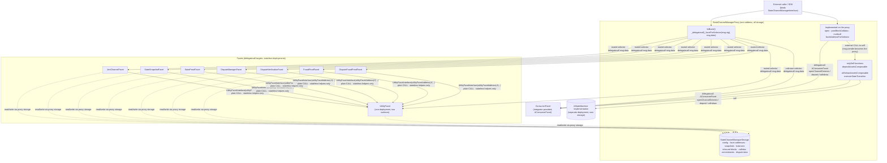

# Contract Architecture: Diamond-Style Proxy, Facets & Deployment Constraints

> **Specification subject:** [specification/architecture/contracts.md](../../../../specification/enforcement/contracts.md)

> **Status:** Draft, reverse-engineered baseline. Pending engineer review.
> **Scope:** The on-chain contract topology under [contracts/V1](../../../../../../contracts/V1): how the
> `StateChannelManagerProxy`, its facets, and shared storage fit together; the deployment size
> budget; and the remaining direction toward genuine Diamond compatibility.
> **Siblings:** [state-machine-base.md](./state-machine-base.md) (the integrator contract),
> [manager-and-facets.md](./manager-and-facets.md) (ABI-level reference). Protocol behavior lives in
> [../protocol/disputes.md](../../../../specification/disputes/disputes.md),
> [../protocol/fraud-proofs.md](../../../../specification/disputes/fraud-proofs.md),
> [../protocol/state-proofs.md](../../../../specification/disputes/state-proofs.md), and
> [../protocol/cross-layer-messages.md](../../../../specification/settlement/cross-layer-messages.md).

## 1. Purpose & observable contract

The on-chain manager is one deployed entry contract —
[`StateChannelManagerProxy`](../../../../../../contracts/V1/StateChannelDiamondProxy/StateChannelManagerProxy.sol#L25) —
that presents the whole diamond surface at a single address while the logic is split across
separately deployed **facets** reached by `delegatecall`. All state lives in the proxy's storage;
facets execute in that storage context.

[`StateChannelManagerInterface`](../../../../../../contracts/V1/StateChannelManagerInterface.sol#L15)
declares that surface — the union of what the proxy implements itself and what its fallback routes
to facets — but is a **caller-side typing artifact only**: nothing implements it, and the proxy
deliberately does not inherit it, so a routed function costs the proxy a selector comparison
instead of a forwarder body. Callers (facets doing typed self-calls, typechain consumers) bind it
to the proxy address.

What the architecture guarantees:

- One address for the whole manager ABI, including integrator-defined consumer functions.
- One storage context: every facet reads and writes the proxy's slots, never its own.
- Facet code that is not reachable except through the proxy (facets hold no state of their own and
  are never called with their own storage in a meaningful way). The one exception is
  `UtilityFacet`'s stateless helper surface, which is invoked by plain `CALL` on the facet
  deployment (§2).
- No function anywhere in the diamond is `payable`, and the fallback is non-payable, so the proxy
  never accepts value directly; assets move through the integrator's consumer facet.

What it explicitly does not guarantee (Current):

- **No upgradeability.** The selector→facet table is compiled into the proxy and facet addresses
  are set once in the constructor; there is no setter and no cut function, so facets cannot be
  replaced or added after deployment.
- **No EIP-2535 compliance.** Selector routing exists, but there is no `diamondCut` and no loupe;
  introspection is the single non-standard read-only
  [`facetAddressForSelector`](../../../../../../contracts/V1/StateChannelDiamondProxy/StateChannelManagerProxy.sol#L80).
  The Diamond resemblance is structural (proxy + selector routing + facets + shared storage), not
  standard-conformant.

## 2. Current topology

`Current:` the implemented wiring, verified against source.

The mechanics, each verified in code:

- **Shared storage by inheritance.** Every facet inherits
  [`StateChannelManagerStorage`](../../../../../../contracts/V1/StateChannelDiamondProxy/StateChannelManagerStorage.sol#L7)
  (via [`StateChannelCommon`](../../../../../../contracts/V1/StateChannelDiamondProxy/StateChannelCommon.sol#L13)),
  so proxy and facets agree on one slot layout. No production facet declares additional state
  variables; the layout is defined in exactly one place. Storage is at the default root (slot 0),
  not under namespaced Diamond-storage slots.
- **Selector routing in the fallback.** The proxy declares no forwarder bodies. `fallback()`
  ([#L67](../../../../../../contracts/V1/StateChannelDiamondProxy/StateChannelManagerProxy.sol#L67))
  resolves `msg.sig` through the internal routing table
  [`_facetForSelector`](../../../../../../contracts/V1/StateChannelDiamondProxy/StateChannelManagerProxy.sol#L286)
  and delegatecalls that facet with raw `msg.data`. Revert data still bubbles through the unchanged
  [`GeneralUtils._delegatecall`](../../../../../../contracts/V1/StateChannelDiamondProxy/utils/GeneralUtils.sol#L6).
  Table entries are written as `Facet.fn.selector`, so the compiler derives every selector from the
  facet function type — nothing is hand-hashed, and a signature change updates the routing with it.
  State-changing facets are compared first so on-chain calls pay the fewest comparisons; the
  `UtilityFacet` views, read off-chain, come last.
- **Functions implemented on the proxy itself.** Only what needs the proxy's own storage and
  composition: `postBlockCalldata`
  ([#L92](../../../../../../contracts/V1/StateChannelDiamondProxy/StateChannelManagerProxy.sol#L92)),
  `open` ([#L119](../../../../../../contracts/V1/StateChannelDiamondProxy/StateChannelManagerProxy.sol#L119)),
  `depositAssetsComposable`
  ([#L199](../../../../../../contracts/V1/StateChannelDiamondProxy/StateChannelManagerProxy.sol#L199)),
  `withdrawAssetsComposable`
  ([#L243](../../../../../../contracts/V1/StateChannelDiamondProxy/StateChannelManagerProxy.sol#L243)),
  `executeStateTransition`
  ([#L249](../../../../../../contracts/V1/StateChannelDiamondProxy/StateChannelManagerProxy.sol#L249)),
  `multicall` ([#L264](../../../../../../contracts/V1/StateChannelDiamondProxy/StateChannelManagerProxy.sol#L264)),
  and the read-only introspection `facetAddressForSelector`
  ([#L80](../../../../../../contracts/V1/StateChannelDiamondProxy/StateChannelManagerProxy.sol#L80)),
  plus the fallback and the constructor
  ([#L33](../../../../../../contracts/V1/StateChannelDiamondProxy/StateChannelManagerProxy.sol#L33)).
  A selector the proxy declares itself never reaches the fallback, so those selectors are
  deliberately absent from the routing table and `facetAddressForSelector` reports the consumer
  facet for them.
- **`onlySelf` guard.** `depositAssetsComposable`, `withdrawAssetsComposable` and
  `executeStateTransition` — all three on the proxy — require `msg.sender == address(this)`
  ([`onlySelf`](../../../../../../contracts/V1/StateChannelDiamondProxy/StateChannelManagerStorage.sol#L61)).
  They are reached by an **external CALL from the proxy to itself**, which makes `msg.sender` the
  proxy address. Facets make that call through the caller-side type,
  `StateChannelManagerInterface(address(this)).fn(...)` (e.g.
  [JoinChannelFacet#L83](../../../../../../contracts/V1/StateChannelDiamondProxy/JoinChannelFacet.sol#L83)),
  and a facet running under delegatecall shares the proxy's `address(this)`, so the pattern works
  from inside facets. The proxy's own `open` calls itself as
  `StateChannelManagerProxy(address(this)).depositAssetsComposable(...)`
  ([#L159](../../../../../../contracts/V1/StateChannelDiamondProxy/StateChannelManagerProxy.sol#L159)).
  External callers can never satisfy the guard.
- **Consumer fallback of last resort.** A selector in no routing branch resolves to
  `consumerFacetAddress`
  ([#L355](../../../../../../contracts/V1/StateChannelDiamondProxy/StateChannelManagerProxy.sol#L355)),
  so the integrator's `openChannelGenesis`, `deposit`, `withdraw`, and any custom consumer function
  are reachable at the proxy address. Note this forwards **every** unrouted selector — see the
  reachability concern in [state-machine-base.md §7](./state-machine-base.md#7-aconsumerfacet-the-integrator-consumer-contract).
- **`UtilityFacet` is both CALLed and delegatecalled.**
  [`UtilityFacet`](../../../../../../contracts/V1/StateChannelDiamondProxy/UtilityFacet.sol#L13)
  is one deployment carrying two surfaces:
  - its **stateless** pure/view helpers (signature verification, decoding, array algebra) are
    reached by plain external `CALL` from `StateChannelCommon`, typed through
    [`UtilityFacetInterface`](../../../../../../contracts/V1/StateChannelDiamondProxy/UtilityFacetInterface.sol#L10)
    ([report](../../../source/contracts/V1/StateChannelDiamondProxy/UtilityFacetInterface.sol.md));
    they need no storage context;
  - the **proxy-storage views**
    ([#L262 onward](../../../../../../contracts/V1/StateChannelDiamondProxy/UtilityFacet.sol#L262)) —
    participants, slash sets, snapshots, balances, timing config, calldata commitments, dispute
    windows and their period predicates — are routed selectors and run under `delegatecall`, so
    they read the **proxy's** storage.

  The second surface is why the facet had to gain the `StateChannelCommon` base: those wrappers
  call the shared `internal` accessors, which need the storage layout. That inheritance is also
  what forces `UtilityFacetInterface` to exist — `UtilityFacet is StateChannelCommon` while
  `StateChannelCommon` needs a type for `utilityFacetAddress`, so the abstract interface breaks the
  definition cycle, and `UtilityFacet` implements it with `override` so the compiler keeps the two
  in sync.
- **The state machine is a separate deployment.** `stateMachineImplementation` is an
  [`AStateMachine`](../../../../../../contracts/V1/AStateMachine.sol#L6) instance with its own storage; the
  manager drives it with plain calls (`setState` → execute → `getState`) during dispute
  re-execution. All channels currently share the single implementation instance
  (`executeStateTransition` ignores `channelId` for machine selection — noted in code).
- **Test-only variant.**
  [`LocalDiamond`](../../../../../../contracts/V1/StateChannelDiamondProxy/LocalDiamond.sol#L20) extends the
  proxy with storage-sync event handlers and a zero consumer facet for local testing. It also
  redeclares `isBlockAuthentic`
  ([#L442](../../../../../../contracts/V1/StateChannelDiamondProxy/LocalDiamond.sol#L442)) so local
  deployments keep reaching its debug `_isBlockAuthentic` override
  ([#L446](../../../../../../contracts/V1/StateChannelDiamondProxy/LocalDiamond.sol#L446)): a declared
  function dispatches before the fallback, whereas production routes that selector to
  `UtilityFacet`. It is not a production deployable.
- **Callers bind the routed surface separately.** Because routed selectors are not in the proxy's
  own compiled ABI, SDK callers merge them: `src/utils/localDiamond.ts`
  ([report](../../../source/src/utils/localDiamond.ts.md)) exports `LocalDiamondContract`
  (`LocalDiamond & StateChannelManagerInterface`), the de-duplicated `localDiamondAbi`, and
  `connectLocalDiamond`.

### Assumptions, constraints & dependencies

- The constructor wiring is trusted: whoever deploys chooses the facet addresses and there is no
  later verification that a facet matches its expected code.
- Facets MUST NOT declare state variables; a facet that did would silently alias the proxy layout.
  `Current:` upheld by convention only — there is no automated layout check (`none — gap`).
- The proxy inherits OpenZeppelin `ECDSA` transitively; external dependencies are limited to
  OpenZeppelin utils and (see below) `hardhat/console.sol`.

## 3. Deployment size constraint

Every deployable contract MUST stay below Ethereum mainnet's contract-code size limit of
**24,576 bytes (EIP-170)**. Initcode is additionally bounded by **49,152 bytes (EIP-3860)**; that
limit is not currently the binding one, but a contract whose runtime code already exceeds EIP-170
trends toward it too.

`Current:` every mainnet-deployable contract is **inside the budget**. Measured deployed-bytecode
sizes from the Hardhat artifacts (`solc 0.8.34`, optimizer `runs: 100`, `viaIR: true`):

| Contract                   | Deployed bytes | vs. 24,576 budget                                       |
| -------------------------- | -------------: | ------------------------------------------------------- |
| `DisputeFraudProofFacet`   |         22,716 | under — 1,860 bytes of headroom (the tightest)          |
| `DisputeVerificationFacet` |         19,945 | under — 4,631 headroom                                  |
| `UtilityFacet`             |         15,166 | under — 9,410 headroom                                  |
| `StateProofFacet`          |         14,707 | under                                                   |
| `StateChannelManagerProxy` |         13,779 | under — 10,797 headroom                                 |
| `FraudProofFacet`          |         12,998 | under                                                   |
| `StateSnapshotFacet`       |         11,806 | under                                                   |
| `DisputeManagerFacet`      |          9,558 | under                                                   |
| `JoinChannelFacet`         |          7,338 | under                                                   |
| `LocalDiamond` (test-only) |         29,292 | over — acceptable only because it never targets mainnet |

Initcode is comfortably clear of EIP-3860: proxy 14,433, `DisputeFraudProofFacet` 22,743, and even
`LocalDiamond` 29,883 — all far under 49,152.

What keeps the sizes where they are, observed in source:

- The proxy carries no forwarder bodies and no view wrappers — one selector-comparison table plus
  the seven functions it declares itself (§2). Routing is what keeps it at 13,779 bytes.
- `StateChannelCommon` compiles to 58 bytes standalone: it declares no `public` members at all, so
  its `internal` bodies are inlined only into the facets that actually call them rather than
  duplicated into every facet's ABI (the placement rule in
  [AGENTS.md](../../../../../../AGENTS.md)).
- `UtilityFacet` carries the ~28 proxy-storage views on top of its stateless helpers, which is why
  it is the third-largest deployable at 15,166 bytes.
- The two facets nearest the ceiling, `DisputeFraudProofFacet` and `DisputeVerificationFacet`, are
  large because each hosts a whole proof family in one contract.
- `StateProofFacet`, `DisputeVerificationFacet`, and `LocalDiamond` import `hardhat/console.sol`
  and contain live `console.log` calls — development tooling compiled into would-be production
  bytecode.

**Size budget (normative):**

- **`REQ-CON-1-ER48S7`.** Every contract intended for mainnet deployment (the proxy, all facets, and any
  integrator consumer facet or state machine) MUST have deployed bytecode ≤ 24,576 bytes and
  initcode ≤ 49,152 bytes. `Current:` satisfied — every production deployable fits (table above);
  the largest, `DisputeFraudProofFacet`, has 1,860 bytes of headroom, so further growth in the
  dispute-fraud-proof family is the first thing that will break the budget again. `LocalDiamond`
  (29,292) is over and stays over; it is test-only and never targets mainnet.

- **`REQ-CON-2-CBVFV9`.** The build or deployment pipeline MUST verify [`REQ-CON-1-ER48S7`](architecture.md#req-con-1-er48s7) automatically and fail on
  violation (e.g. `hardhat-contract-sizer`, `forge build --sizes` in CI).
  `Current:` **none — gap.** Neither [hardhat.config.ts](../../../../../../hardhat.config.ts#L13) nor
  [foundry.toml](../../../../../../foundry.toml#L1) contains any contract-size check; worse, the Hardhat
  test network still sets
  [`allowUnlimitedContractSize: true`](../../../../../../hardhat.config.ts#L17), so the local
  toolchain suppresses the signal. [`REQ-CON-1-ER48S7`](architecture.md#req-con-1-er48s7) currently
  holds with as little as 1,860 bytes of headroom and nothing fails the build when that is spent.
- **SHOULD:** production builds SHOULD reject any `hardhat/console.sol` import (a cheap grep-level
  gate) since it is both dead weight and a non-production dependency.

## 4. Remaining refactor direction

Two pieces of the Diamond direction are in place and documented as current behavior above:
selector routing in the fallback (§2) and an `internal`-only `StateChannelCommon` that is no longer
duplicated into every facet (§3). Free-function helpers in
[utils/](../../../../../../contracts/V1/StateChannelDiamondProxy/utils) — `GeneralUtils`,
`BlockUtils`, `DisputeUtils` — remain the pattern for behavior that needs no inherited storage.

`Intended:` the items below are **non-normative direction, not implemented behavior** — see also
Future Work.

1. **Controlled facet replacement.** The routing table is immutable and facet addresses are set
   once in the constructor, so an upgrade means redeploying the whole diamond. Routing MUST become
   replaceable per facet before upgrades are possible (governance rules for who may cut are a
   separate, undecided concern).
2. **Diamond storage with versioned namespaces.** Still inherited slot-0 layout. Move to fixed root
   slots per versioned storage namespace (`keccak`-derived slot per namespace, struct accessed
   through that slot). A migration must be able to keep reading an old namespace while introducing
   a new one, so upgrades can read, migrate, and safely coexist with prior layouts.
3. **Size headroom on the dispute facets.** [`REQ-CON-1-ER48S7`](architecture.md#req-con-1-er48s7)
   holds, but `DisputeFraudProofFacet` (22,716) and `DisputeVerificationFacet` (19,945) carry the
   least room. Splitting those two along their proof families is the remaining size work; the other
   deployables have no size pressure.

**Open question:** whether the self-call (`onlySelf`) guard remains necessary under the improved
architecture. To be resolved from first principles, not carried forward by habit. Inputs to that
decision, from the current code: the guard exists because `depositAssetsComposable` /
`withdrawAssetsComposable` / `executeStateTransition` are `public` on the proxy (so externally
visible) yet must only run as internal steps of a larger operation; the self-CALL also creates a
fresh call frame (memory/returndata isolation) that a delegatecall would not. Facets make the call
through the caller-side type `StateChannelManagerInterface(address(this))`, which is a typing
detail — the dispatch is still an external CALL to the proxy, exactly what the guard checks. These
functions could instead be internal to the proxy, be routed-but-guarded, or keep the self-call for
frame isolation. The refactor must pick one and state why.

## 5. Verification

Concrete test evidence is owned by the downstream verification layer. This section defines implementation-specific obligations only.

### Implementation test plan

These are concrete component-level tests required by the implementation obligations in this document. Exercise public boundaries with real domain values and collaborators. Every listed permutation is required unless an engineer records why it is not applicable.

| Plan item                                             | Requirement / invariant                                | Setup and stimulus                                                                                                      | Expected result                                                                                                                                                                                                                                                    | Required permutations                                                                                                                                                                                                                                                                                                                                                                                                                                                                                                                                                                                                                                                                                                                                                                                                                                                                                                                                                                                                                                       |
| ----------------------------------------------------- | ------------------------------------------------------ | ----------------------------------------------------------------------------------------------------------------------- | ------------------------------------------------------------------------------------------------------------------------------------------------------------------------------------------------------------------------------------------------------------------ | ----------------------------------------------------------------------------------------------------------------------------------------------------------------------------------------------------------------------------------------------------------------------------------------------------------------------------------------------------------------------------------------------------------------------------------------------------------------------------------------------------------------------------------------------------------------------------------------------------------------------------------------------------------------------------------------------------------------------------------------------------------------------------------------------------------------------------------------------------------------------------------------------------------------------------------------------------------------------------------------------------------------------------------------------------------- |
| `REQ-CON-1-ER48S7.T1` | [`REQ-CON-1-ER48S7`](architecture.md#req-con-1-er48s7) | Exercise the real public component or contract boundary, including rejection and failure paths without partial effects. | Every mainnet-deployable contract MUST have deployed bytecode ≤ 24,576 bytes (EIP-170) and initcode ≤ 49,152 bytes (EIP-3860). `Current:` satisfied — the largest production deployable is `DisputeFraudProofFacet` at 22,716 bytes (1,860 headroom); `StateChannelManagerProxy` is 13,779. Test-only `LocalDiamond` (29,292) is exempt. | `REQ-CON-1-ER48S7.T1.P1` — valid case `REQ-CON-1-ER48S7.T1.P2` — malformed input `REQ-CON-1-ER48S7.T1.P3` — direct invalid/opposite case `REQ-CON-1-ER48S7.T1.P4` — adversarial input `REQ-CON-1-ER48S7.T1.P5` — partial failure `REQ-CON-1-ER48S7.T1.P6` — retry and recovery                                                                                                                                                                                                                                                                                                                                                                                                                                                                                                                                             |
| `REQ-CON-2-CBVFV9.T1` | [`REQ-CON-2-CBVFV9`](architecture.md#req-con-2-cbvfv9) | Exercise the real public component or contract boundary, including rejection and failure paths without partial effects. | Build/deployment MUST verify [`REQ-CON-1-ER48S7`](architecture.md#req-con-1-er48s7) automatically and fail on violation.                                                                                                                                           | `REQ-CON-2-CBVFV9.T1.P1` — valid case `REQ-CON-2-CBVFV9.T1.P2` — malformed input `REQ-CON-2-CBVFV9.T1.P3` — direct invalid/opposite case `REQ-CON-2-CBVFV9.T1.P4` — adversarial input `REQ-CON-2-CBVFV9.T1.P5` — partial failure `REQ-CON-2-CBVFV9.T1.P6` — retry and recovery                                                                                                                                                                                                                                                                                                                                                                                                                                                                                                                                             |
| `INV-CON-3-QSMFC7.T1` | `INV-CON-3-QSMFC7`        | Exercise the real public component or contract boundary, including rejection and failure paths without partial effects. | Proxy and all facets share exactly one storage layout: facets inherit `StateChannelManagerStorage` and declare no state variables of their own.                                                                                                                    | `INV-CON-3-QSMFC7.T1.P1` — valid case `INV-CON-3-QSMFC7.T1.P2` — zero/empty/no-op case where meaningful `INV-CON-3-QSMFC7.T1.P3` — direct invalid/opposite case `INV-CON-3-QSMFC7.T1.P4` — exact boundary `INV-CON-3-QSMFC7.T1.P5` — failure/recovery `INV-CON-3-QSMFC7.T1.P6` — relevant race                                                                                                                                                                                                                                                                                                                                                                                                                                                                                                                             |
| `REQ-CON-4-H4YDV5.T1` | `REQ-CON-4-H4YDV5`        | Exercise the real public component or contract boundary, including rejection and failure paths without partial effects. | `onlySelf` functions (`depositAssetsComposable`, `withdrawAssetsComposable`, `executeStateTransition`) MUST revert for any external caller; they are reachable only through the proxy's self-CALL.                                                                | `REQ-CON-4-H4YDV5.T1.P1` — valid case `REQ-CON-4-H4YDV5.T1.P2` — zero value `REQ-CON-4-H4YDV5.T1.P3` — new participant `REQ-CON-4-H4YDV5.T1.P4` — direct invalid/opposite case `REQ-CON-4-H4YDV5.T1.P5` — exact balance/boundary `REQ-CON-4-H4YDV5.T1.P6` — one beyond the boundary `REQ-CON-4-H4YDV5.T1.P7` — maximum value `REQ-CON-4-H4YDV5.T1.P8` — value conservation `REQ-CON-4-H4YDV5.T1.P9` — existing participant `REQ-CON-4-H4YDV5.T1.P10` — removed participant `REQ-CON-4-H4YDV5.T1.P11` — slashed participant `REQ-CON-4-H4YDV5.T1.P12` — concurrent membership change |

## Future Work

_Non-normative._

- Execute the remaining direction in §4 (replaceable routing, namespaced storage, splitting the
  dispute-fraud-proof family) and re-measure against
  [`REQ-CON-1-ER48S7`](architecture.md#req-con-1-er48s7) with headroom for future growth.
- Decide the `onlySelf` question (§4) and record the rationale here.
- Strip `hardhat/console.sol` from production contracts; consider a lint/CI gate.
- Facet upgrade governance: who may replace a facet, with what delay/announcement, and how open
  channels are protected from mid-dispute logic changes.
- Consider EIP-2535 loupe compatibility for tooling interoperability; the routing exists, but
  `facetAddressForSelector` is not the standard loupe surface.
- Automated storage-layout diffing (e.g. `forge inspect storage-layout`) wired into CI.

## Implementation traceability

| Requirement / invariant                                | Statement                                                                                                                                                                                                                                                          | Implementation status | Implementation evidence                                                                                                                                                                                                                                                                                                                                                                                                                                                                                  | Gap / divergence                                                           |
| ------------------------------------------------------ | ------------------------------------------------------------------------------------------------------------------------------------------------------------------------------------------------------------------------------------------------------------------ | --------------------- | -------------------------------------------------------------------------------------------------------------------------------------------------------------------------------------------------------------------------------------------------------------------------------------------------------------------------------------------------------------------------------------------------------------------------------------------------------------------------------------------------------- | -------------------------------------------------------------------------- |
| [`REQ-CON-1-ER48S7`](architecture.md#req-con-1-er48s7) | Every mainnet-deployable contract MUST have deployed bytecode ≤ 24,576 bytes (EIP-170) and initcode ≤ 49,152 bytes (EIP-3860). `Current:` satisfied — the largest production deployable is `DisputeFraudProofFacet` at 22,716 bytes (1,860 headroom); `StateChannelManagerProxy` is 13,779. Test-only `LocalDiamond` (29,292) is exempt. | Covered               | [contracts/V1/StateChannelDiamondProxy](../../../../../../contracts/V1/StateChannelDiamondProxy) (all deployables); selector routing instead of forwarder bodies in [StateChannelManagerProxy.sol](../../../../../../contracts/V1/StateChannelDiamondProxy/StateChannelManagerProxy.sol#L286)                                                                                                                                                                                                            | None.                                                                      |
| [`REQ-CON-2-CBVFV9`](architecture.md#req-con-2-cbvfv9) | Build/deployment MUST verify [`REQ-CON-1-ER48S7`](architecture.md#req-con-1-er48s7) automatically and fail on violation.                                                                                                                                           | Missing               | none — gap ([hardhat.config.ts](../../../../../../hardhat.config.ts#L17) sets `allowUnlimitedContractSize: true`; [foundry.toml](../../../../../../foundry.toml#L1) has no size gate)                                                                                                                                                                                                                                                                                                                    | Engineer audit pending; any divergence named in the evidence remains open. |
| [`INV-CON-3-QSMFC7`](architecture.md#inv-con-3-qsmfc7) | Proxy and all facets share exactly one storage layout: facets inherit `StateChannelManagerStorage` and declare no state variables of their own.                                                                                                                    | Covered               | [StateChannelManagerStorage.sol](../../../../../../contracts/V1/StateChannelDiamondProxy/StateChannelManagerStorage.sol#L7); all facets via [StateChannelCommon.sol](../../../../../../contracts/V1/StateChannelDiamondProxy/StateChannelCommon.sol#L13), `UtilityFacet` included since it gained that base ([UtilityFacet.sol](../../../../../../contracts/V1/StateChannelDiamondProxy/UtilityFacet.sol#L13))                                                                                            | None.                                                                      |
| [`REQ-CON-4-H4YDV5`](architecture.md#req-con-4-h4ydv5) | `onlySelf` functions (`depositAssetsComposable`, `withdrawAssetsComposable`, `executeStateTransition`) MUST revert for any external caller; they are reachable only through the proxy's self-CALL.                                                                | Covered               | [StateChannelManagerStorage.sol](../../../../../../contracts/V1/StateChannelDiamondProxy/StateChannelManagerStorage.sol#L61) (`onlySelf` modifier); call sites in [StateChannelManagerProxy.sol](../../../../../../contracts/V1/StateChannelDiamondProxy/StateChannelManagerProxy.sol#L159), [JoinChannelFacet.sol](../../../../../../contracts/V1/StateChannelDiamondProxy/JoinChannelFacet.sol#L83), [FraudProofFacet.sol](../../../../../../contracts/V1/StateChannelDiamondProxy/FraudProofFacet.sol#L150) | None.                                                                      |
