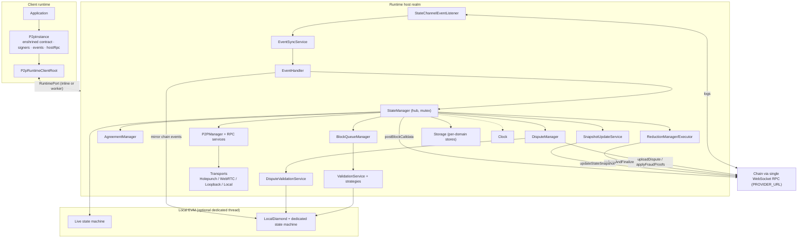

# SDK Architecture

> **Specification subject:** [specification/architecture/sdk.md](../../../../specification/runtime/sdk.md)

> **Scope:** How the TypeScript SDK is layered, how an application enters it
> (`p2pSetup`), the runtime host/client split, signer ownership, the two local
> state-machine instances, and the component map. The two core algorithms live in
> [block-confirmation-pipeline.md](./block-confirmation-pipeline.md) and
> [dispute-pipeline.md](./dispute-pipeline.md); per-component observable
> contracts live in [components.md](./components.md).

## 1. Purpose & observable contract

The SDK turns an ordinary ethers contract instance into an **enshrined** p2p
contract: calling the returned instance executes the state machine off-chain,
between peers, with the chain as fallback arbiter. One call constructs the whole
runtime:

```ts
const p2p = await EvmStateMachine.p2pSetup(scmProxy, stateMachine, deployStateMachine, options?);
```

The application never touches the internal managers directly. It observes and
drives the runtime only through the returned [`P2pInstance`](../../../../../../src/evm/P2pInstance.ts#L18)
surface: the enshrined contract, two client-side signers, the `EventBus`, and
`hostRpc`. `getStateManager()` throws by design in every mode.

### 1.1 `p2pSetup` — verified signature

Implemented by [`EvmDiamondStateMachine.p2pSetup`](../../../../../../src/evm/EvmDiamondStateMachine.ts#L441)
(the class is exported as `EvmStateMachine`).

Parameters:

| Parameter                              | Type                             | Meaning                                                                                                                                                                                                                                   |
| -------------------------------------- | -------------------------------- | ----------------------------------------------------------------------------------------------------------------------------------------------------------------------------------------------------------------------------------------- |
| `deployedStateChannelContractInstance` | `StateChannelManagerProxy`       | Connected on-chain manager proxy. MUST have a provider attached (`p2pSetup` throws otherwise); that provider is reused by the runtime client for main-thread reads.                                                                       |
| `stateMachineContractInstance`         | `T extends AStateMachine`        | Typed instance of the integrator state machine. Used only for its address + ABI (`SerializedContract`); the enshrined instance is rebuilt from these on the client side, preserving the TypeChain type.                                   |
| `deployStateMachine`                   | `LocalStateMachineDeployer`      | Async deployer `(signer) => address` that deploys one state-machine instance into the local EVM. Called **twice** (§4).                                                                                                                   |
| `options.peerId`                       | `number?`                        | Logger tag only.                                                                                                                                                                                                                          |
| `options.peerLogger`                   | `Logger?`                        | Replaces the default logger.                                                                                                                                                                                                              |
| `options.config`                       | `Partial<Config>?`               | Runtime config overrides; precedence in [`createConfig`](../../../../../../src/utils/config.ts#L147) is overrides > `process.env` > `peer3.config.ts` > defaults. See [../reference/configuration.md](../../operations/configuration.md). |
| `options.signerSecret`                 | `string?`                        | Private key (`0x` + 64 hex) or mnemonic. **A random private key is generated when omitted.**                                                                                                                                              |
| `options.customRpcManifest`            | `CustomRpcManifest?`             | Integrator RPC root, resolved on the host via [`resolveCustomRpcManifest`](../../../../../../src/rpc/network/resolveCustomRpcManifest.ts#L1) and typed through [`registry.ts`](../../../../../../src/rpc/network/registry.ts#L1).         |
| `options.customPrecompiles`            | `EvmCustomPrecompileManifest[]?` | Integrator precompiles installed into the local EVM executor.                                                                                                                                                                             |
| `options.handlerExecutionContext`      | `HostHandlerExecutionContext?`   | Wraps every inline-host handler invocation (port messages, incoming p2p RPC). Ignored in threaded mode — a worker runs exactly one peer's host.                                                                                           |

Return: `P2pInstance<T, TCustomRpc>` with members:

| Member                           | Contract                                                                                                                                                                                                |
| -------------------------------- | ------------------------------------------------------------------------------------------------------------------------------------------------------------------------------------------------------- |
| `p2pContractInstance: T`         | Enshrined contract; same interface as the original, calls execute p2p via the runtime port.                                                                                                             |
| `p2pSigner: ClientP2pSigner`     | Client-side p2p signer (block/artifact signing over the port).                                                                                                                                          |
| `chainSigner: ClientChainSigner` | Client-side signer for on-chain transactions; forwarded to the host's nonce-managed wallet.                                                                                                             |
| `stateChannelManagerContract`    | The connected manager proxy (client realm).                                                                                                                                                             |
| `events: EventBus`               | Unified event surface (§5).                                                                                                                                                                             |
| `hostRpc`                        | Typed mirror of the host's `remoteRpc`; no target = loopback to self, peer address = relay.                                                                                                             |
| `webRTCBridgePort`               | Present only when the host runs in a worker that cannot drive `RTCPeerConnection`; must be bubbled to the main thread. `installMainThreadBridgeIfOnMainThread()` is called by `p2pSetup` automatically. |
| `dispose()`                      | Tears down listeners, the runtime, and (threaded mode) the worker.                                                                                                                                      |
| `onHostError(listener)`          | Observes autonomous host-side errors; with no subscriber they re-throw as main-thread unhandled rejections.                                                                                             |
| `quiesce()`                      | Drains host-side detached async work over the port; returns collected rejections.                                                                                                                       |

**Signer ownership ([`REQ-SDK-1-JKC9W7`](architecture.md#req-sdk-1-jkc9w7)).** The runtime host owns the signing key.
`p2pSetup` accepts only `signerSecret`; injected `ethers.Signer` objects are
intentionally unsupported. The host builds its own `Wallet` on its own provider
([`RuntimeChainContext`](../../../../../../src/evm/p2pRuntime/RuntimeChainContext.ts#L4))
and wraps it in [`HostNonceManager`](../../../../../../src/evm/signer/HostNonceManager.ts#L15)
for every on-chain manager send, so concurrent async flows cannot race on the
account nonce. The client realm holds only proxy signers that forward over the
port.

## 2. Layering

Top to bottom:

1. **Application.** Holds `P2pInstance`; calls the enshrined
   contract, subscribes on `events`, uses `hostRpc` and the client signers.
2. **Runtime client.** [`P2pRuntimeClientRoot`](../../../../../../src/rpc/internal/roots/P2pRuntimeClientRoot.ts)
   owns host communication, domain adapters and cleanup. setupP2pRuntime owns configuration and the two application deployments after communication startup.
   P2pInstance holds a direct local reference to this initialized root. Its host
   connection carries RPC and mirrors bus events into the client EventBus.
3. **Runtime host.** [`startP2pRuntimeHost`](../../../../../../src/rpc/internal/roots/P2pRuntimeHostRoot.ts#L204)
   constructs the live graph: provider + wallet, `Clock` sync, time config from
   the chain (`getAllTimes` → `p2pTime`, `agreementTime`, `chainFallbackTime`,
   `evidenceTime`), the local EVM contract executor, `Storage`, `StateManager`
   and everything it owns (managers, RPC services, transports, event listener).
4. **Local EVM.** A contract executor (optionally in its own thread,
   `VM_DEDICATED_THREAD`) hosting the two deployed state-machine instances and
   the `LocalDiamond` (§4).
5. **Chain.** One WebSocket provider per host, derived from `PROVIDER_URL` (§6).

### 2.1 Host/client split — inline vs worker

`RUN_SDK_IN_THREAD` selects the mode; the port protocol is identical in both:

- **Inline (default).** `createRuntimeChannel()` makes an in-process port pair;
  the host runs on the same thread. `handlerExecutionContext`, when provided,
  wraps every host handler (port messages and `NetworkRpcRouter.onRpc`) — used by
  hosts embedding several peers in one thread.
- **Worker (`RUN_SDK_IN_THREAD=true`).** `createTransferableChannel()` +
  `createRootWorker()`; a `WorkerBootstrapMessage {type:"connect", payload, port}`
  transfers the port into the worker. `dispose()` shuts the worker down. WebRTC
  cannot run in a worker, so the host mints a bridge `MessageChannel` and posts
  the main-thread end to the client (`webRTCBridgePort`).

Client → host calls select the typed services on
[P2pRuntimeHostRoot](../../../source/src/rpc/internal/roots/P2pRuntimeHostRoot.ts.md):
`deploySigner`, `chainSigner`, `p2pSigner`, `hostRpc` and `lifecycle`. Calls choose
request or send explicitly after method arguments, with the recipient connection
already bound. The shared router correlates responses. The client SDK service
receives `busEvent` and `webRTCBridgePort`; readiness and errors use the common
lifecycle and error services. Each endpoint also exposes its logger service. Existing operation-specific timeout choices remain at
the callers.

Startup sequence: application config and signer → create client root and its
host child → host communication ready → application adapters →
`deployStateMachine` runs twice through the deployment signer →
`deployComplete` builds the peer runtime → bridge installation → `P2pInstance`
returned. Application setup owns this sequence; the root owns communication.

## 3. Assumptions, constraints & dependencies

- **RPC observation assumption ([`REQ-SDK-2-M2PGDM`](architecture.md#req-sdk-2-m2pgdm)).** _Current:_ the SDK observes the
  chain exclusively through the single configured `PROVIDER_URL`. The host
  converts `http(s)` to `ws(s)` and **requires a reachable WebSocket endpoint**
  ([`RuntimeChainContext`](../../../../../../src/evm/p2pRuntime/RuntimeChainContext.ts#L4)
  throws otherwise). `Clock`, the event listener, event recovery, all local
  validation staticCalls against the manager, and every on-chain send flow
  through this one provider. There is no redundancy and no cross-checking;
  [`ReductionExecutor`](../../../../../../src/stateManager/reduction/ReductionExecutor.ts#L52)
  documents in code that reduction treats provider failure as fatal. _Intended:_
  redundancy across independent RPC providers reduces availability failures, but
  the trust assumption remains — correct operation is not guaranteed if every
  endpoint is unavailable, dishonest, or malicious. See
  [../security/trust-model.md](../../../../specification/security/trust-model.md).
- The chain is live, honest, and eventually final; `TimeConfig` values fetched
  from the manager are consistent with the deployed contracts
  ([../protocol/time.md](../../../../specification/protocol-model/time.md)).
- The integrator state machine obeys the deterministic execution-context rules
  ([../concepts/state-machines.md](../../../../specification/protocol-model/state-machines.md)); otherwise
  local execution, replay, and fraud proofs diverge.
- One runtime host per signer identity; `createConfig` is process-global and
  intended to be called once per runtime.

## 4. The two local state-machine instances ([`INV-SDK-3-87WK8P`](architecture.md#inv-sdk-3-87wk8p))

`p2pSetup` calls `deployStateMachine` **twice**:

1. **Live instance** — drives the replicated channel state. All happy-path
   execution (`stateTransition`, `getState`/`setState`, `getNextToWrite`,
   balance algebra, `processInboundMessage`) runs against it through
   [`EvmDiamondStateMachine`](../../../../../../src/evm/EvmDiamondStateMachine.ts#L61).
2. **Diamond instance** — embedded in the locally deployed
   [`LocalDiamond`](../../../../../../src/evm/EvmDiamondStateMachine.ts#L413) (see
   `deployLocalDiamondWithStateMachineAddress`). The `LocalDiamond` is a local
   mirror of the on-chain manager's dispute/fraud-proof logic plus per-channel
   chain state, kept in sync by the
   [`EventHandler`](../../../../../../src/eventHandlers/EventHandler.ts#L50) replaying
   observed chain events (`onChannelOpened`, `onStateSnapshotUpdated`,
   `onBlockCalldataPosted`, `onDisputeCommitted`, `onOnChainSlashAdded`, ...).
   Dispute re-execution, replay positioning, and canonical validation
   predicates (`isBlockAuthentic`, `hasInvalidTimestamp`, `reduce`, ...) run
   here so they can never mutate the live replicated state.

The instances MUST stay separate: dispute replay repositions the state machine
at arbitrary historical states; doing that on the live instance would corrupt
the channel state under the working pipeline.

## 5. Event surface

[`EventBus`](../../../../../../src/events/EventBus.ts#L43) is the one event class on both
sides of the port. It carries three kinds:

| Kind             | Producer                                                                                                          | Payload typing                                                                  |
| ---------------- | ----------------------------------------------------------------------------------------------------------------- | ------------------------------------------------------------------------------- |
| `p2pEventHooks`  | Every runtime hook call, via `createBusPublishingHooks` (publish on bus first, then forward to current app hooks) | Derived from `P2pEventHooks` (void hooks only)                                  |
| `eventHandler`   | Mirrored `EventHandler` invocations (`forwardEventHandlerInvocations`)                                            | Derived from `EventHandlerHooks`                                                |
| `contractEvents` | `EvmDiamondStateMachine.processLogs` after a successful transition                                                | `unknown[]`; typing recovered by `attachContractEvents` onto an ethers instance |

Dispatch order per emission: exact-name listeners → kind-wide listeners (both
isolated; one failing listener never blocks others) → the single host-only
**bridge tap**, which posts a `busEvent` over the port and whose failure
propagates to the producer. Contract events are emitted synchronously inside
the transition success path, before the next `onTurn`, and a bridge failure is
logged without failing the transition.

## 6. Component map



Flow detail: block intake/validation in
[block-confirmation-pipeline.md](./block-confirmation-pipeline.md); dispute
construction/audit/reduction in [dispute-pipeline.md](./dispute-pipeline.md);
per-component contracts in [components.md](./components.md).

## 7. Invariants & failure behavior

<a id="inv-sdk-1-de9yed"></a>

### INV-SDK-1-DE9YED — All app-runtime interaction crosses the port

All application interaction with the runtime crosses the
`RuntimePort`; direct state-manager access is disabled in every mode.

<a id="inv-sdk-2-nh0yge"></a>

### INV-SDK-2-NH0YGE — Host-owned signing key and nonce

The runtime host owns the signing key and the chain nonce;
no injected signer exists, and every on-chain manager send goes through the
host's nonce manager.

<a id="inv-sdk-3-87wk8p"></a>

### INV-SDK-3-87WK8P — Dedicated state machine for dispute replay

Dispute re-execution never runs against the live replicated
state machine (two separate deployments; §4).

- **Failure behavior.** Host construction failures post `hostError` and close
  the port (client creation rejects). A dead client port triggers
  host self-disposal. `StateManager.abort()` (slashed/removed, unrecoverable
  sync failure, fatal reduction error) fires `onAbort`, drops status to
  `OPENED`, and disposes the owning root and its children. Final cleanup closes the runtime port; late queries reject in both placements.

<a id="req-sdk-1-jkc9w7"></a>

### REQ-SDK-1-JKC9W7 — The runtime owns its signer

The runtime owns its signer; `p2pSetup` accepts only `signerSecret` (random when omitted), never an injected `Signer`.

- [x] `REQ-SDK-1-JKC9W7.T1.P1` — valid case

<a id="req-sdk-2-m2pgdm"></a>

### REQ-SDK-2-M2PGDM — At least one honest RPC endpoint

The SDK requires at least one available honest RPC endpoint; current implementation uses exactly one WebSocket `PROVIDER_URL`.

## 8. Verification

Concrete test evidence is owned by the downstream verification layer. This section defines implementation-specific obligations only.

## Future Work

_Non-normative._

- Redundant multi-provider chain observation with cross-checking, and a defined
  degradation mode when providers disagree (see
  [../security/trust-model.md](../../../../specification/security/trust-model.md)).
- A persistence-backed `Storage` (everything is in-memory today), which would
  change restart/recovery behavior of both pipelines.
- Inject the discovery backend (Holepunch vs local discovery) behind one
  lifecycle API instead of `DEBUG_LOCAL_TRANSPORT` branching.
