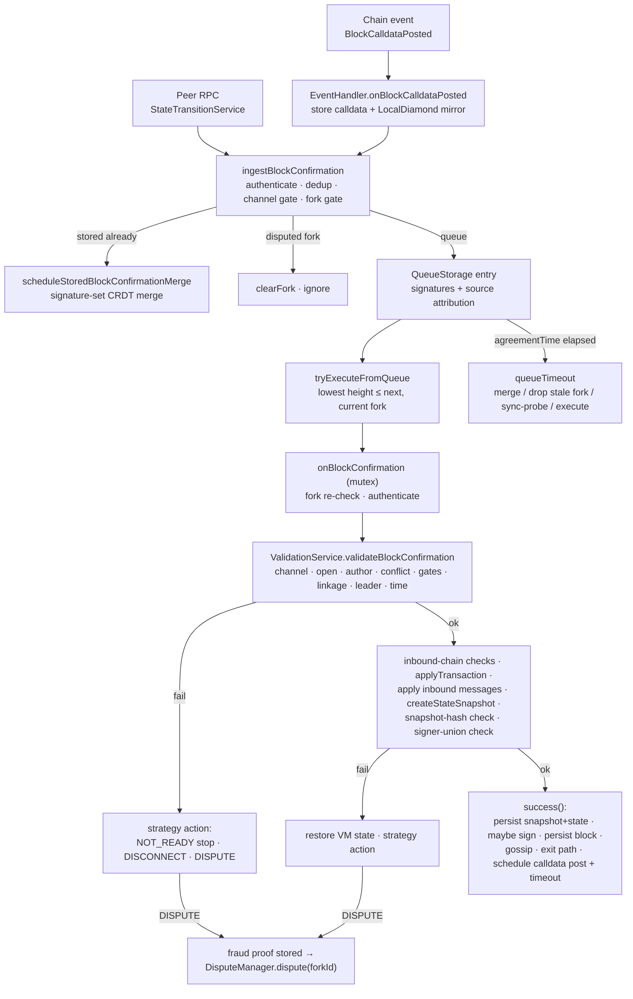

# Block-Confirmation Pipeline

> **Specification subject:** [specification/protocol/block-processing.md](../../../../specification/block-progression/block-processing.md)

> **Scope:** The end-to-end path a block confirmation takes through the SDK:
> every input path, intake, authentication, deduplication, queueing, ordering,
> validation predicates per strategy, state-machine execution, signature
> collection, milestone/agreement effects, data-availability behavior, and the
> exact conditions that escalate to the [dispute pipeline](./dispute-pipeline.md).
> Protocol-level rationale: [../protocol/finality.md](../../../../specification/protocol-model/finality.md),
> [../protocol/time.md](../../../../specification/protocol-model/time.md),
> [../protocol/fraud-proofs.md](../../../../specification/disputes/fraud-proofs.md).

## 1. Purpose & observable contract

Input: a `BlockConfirmationStruct` (`signedBlock` + confirmation `signatures[]`)
from a peer, from chain calldata, from local authoring, or from a replayed
proof. Output: either the block becomes canonical local state — persisted,
executed on the live state machine, counter-signed when appropriate, and
re-gossiped — or the pipeline takes a strategy-defined failure action:
ignore, park for later, disconnect/blacklist the supplier, or build a fraud
proof and escalate to the dispute pipeline.

Guarantees:

- A block is executed at most once, in fork order, under the `StateManager`
  mutex ([`INV-BCP-1-H2H41X`](block-confirmation-pipeline.md#inv-bcp-1-h2h41x), [`INV-BCP-3-GTHAHV`](block-confirmation-pipeline.md#inv-bcp-3-gthahv)).
- The live state machine is never left holding the effects of a block that was
  not committed ([`INV-BCP-2-BVPQF4`](block-confirmation-pipeline.md#inv-bcp-2-bvpqf4)).
- Admitted source contributions grow monotonically within each source allowance. Validation may strip bad live confirmations without refunding the source. Copies below their allowances converge with exact supplier attribution ([`INV-BCP-4-16TP2N`](block-confirmation-pipeline.md#inv-bcp-4-16tp2n)).

Non-guarantees: no persistence across process restart (storage is in-memory);
no gossip rate limiting (**Open question** in
[../security/trust-model.md](../../../../specification/security/trust-model.md), [`OQ-6-4JPNE5` (P2P gossip rate limiting)](../../../../specification/open-questions.md#oq-6-4jpne5)); no
delivery guarantee — a parked block that never becomes executable is dropped
after its queue window and re-fetched by sync if needed.

Source admission delegates to [MembershipService](../../../source/src/stateManager/membership/MembershipService.ts.md) for the inclusive-OR caches and slash precedence. [BlockQueueManager](../../../source/src/stateManager/ingest/BlockQueueManager.ts.md) awaits ordinary sync through unchanged [SpectateService](../../../source/src/rpc/network/services/spectate/SpectateService.ts.md). Intake returns after sync without inserting the triggering copy. [ValidationService](../../../source/src/stateManager/ingest/ValidationService.ts.md) catches recovery failure per confirmation and invokes the owning strategy. Participating peers relay accepted growth; pending peers and spectators persist it silently until promotion.

## 2. Input paths

Every path converges on
[`BlockQueueManager.ingestBlockConfirmation`](../../../../../../src/stateManager/ingest/BlockQueueManager.ts#L61)
or on the validation entry
[`StateManager.onBlockConfirmation`](../../../../../../src/stateManager/StateManager.ts#L493)
directly:

1. **Peer RPC gossip.**
   [`StateTransitionRpcMethods.onBlockConfirmation`](../../../../../../src/rpc/network/services/stateTransition/StateTransitionRpcMethods.ts#L13)
   (guarded by a completed handshake) calls
   `stateManager.ingestBlockConfirmation(bc, { senderAddress })`. A `false`
   result disconnects and blacklists the sending peer. `senderAddress` feeds
   source attribution (§4).
2. **Block-calldata chain events.**
   [`StateChannelEventListener`](../../../../../../src/StateChannelEventListener.ts#L8) →
   [`EventSyncService.scheduleLog`](../../../../../../src/stateManager/eventSync/EventSyncService.ts#L107) →
   [`EventHandler.onBlockCalldataPosted`](../../../../../../src/eventHandlers/EventHandler.ts#L287):
   stores the calldata record (before the first await, so recovery re-reads
   observe it), mirrors the event into the `LocalDiamond`, fires
   `onPostedCalldata`, then calls `ingestBlockConfirmation` with
   `onChainTimestamp` and a fresh
   [`CalldataCommittedStrategy`](../../../../../../src/stateManager/validationStrategy/CalldataCommittedStrategy.ts#L15).
   The same handler is also reached on demand by
   `EventSyncService.tryRecoverBlockCalldataAndScheduleValidation` (timeout
   checks and time validation query the chain for missed calldata).
3. **Local authoring.**
   [`StateManager.playTransaction`](../../../../../../src/stateManager/StateManager.ts#L493)
   executes the author's own transaction under the mutex and enters the success
   path (§7) directly — no queue, no validation strategy.
4. **Replay adapters.** Dispute state-proof replay and spectate sync call
   [`StateManager.onBlockConfirmationStruct`](../../../../../../src/stateManager/StateManager.ts#L493),
   which wraps the confirmation into a **sourceless** entry (no transport to
   punish) and may inject an explicit strategy
   ([`DisputeValidationStrategy`](../../../../../../src/stateManager/validationStrategy/DisputeValidationStrategy.ts#L20)).

## 3. Pipeline overview

### 3.1 Design decision: the pre-execution queue and the mutex boundary

The queue is not an incidental storage detail — it is a deliberate **pre-execution concurrency
layer**, and the split it creates is a design decision:

**Why it exists.** Blocks arrive from peer RPC, chain calldata, local recovery, and replay in any
order; confirmations and individual signatures arrive independently and out of order, including
late signatures for blocks already known. None of that work mutates the live state machine.
Processing every arrival under the `StateManager` mutex would serialize cheap network and merge
work behind state execution, cutting concurrency and throughput for no correctness gain. So the
pipeline splits into two regimes:

- **Outside the mutex — asynchronous, mergeable intake.** Accepting an older block, a future
  block, a duplicate copy, or additional signatures for any queued or stored block MUST NOT
  require the state-transition mutex ([`REQ-BCP-3-1GCEH9`](block-confirmation-pipeline.md#req-bcp-3-1gceh9)). This work runs as independent scheduled
  tasks, subject to storage atomicity (each merge step is synchronous within one task on the
  single-threaded runtime), bounded per-entry resources, and deterministic merge rules.
- **Inside the mutex — total-order state mutation.** The mutex is reserved for operations that
  can mutate the live state machine. Verified acquisition sites:
  [`onBlockConfirmation`](../../../../../../src/stateManager/StateManager.ts#L493) (apply the next eligible
  block), [`playTransaction`](../../../../../../src/stateManager/StateManager.ts#L493) (local authoring),
  and [`setLatestState`](../../../../../../src/stateManager/StateManager.ts#L493) (fork transition).
  Dequeue-and-execute is a total-order operation by `(forkId, height)`: only the lowest eligible
  height on the current fork is scheduled, and at most one block is in state-machine execution
  at a time ([`REQ-BCP-4-MS5VVZ`](block-confirmation-pipeline.md#req-bcp-4-ms5vvz), enforced by the mutex plus the ordering stage §5).

**Queue key and body-conflict model.** The network entry key includes the **block hash**
([`QueueStorage`](../../../../../../src/storage/QueueStorage.ts#L27) queued entries keyed by block hash),
with a secondary coordinate index `(forkId, height) → Set<Hash>`. Two competing block bodies at
the same coordinate therefore coexist as distinct entries; the queue never picks between them.
Conflicts are resolved downstream by the defined validation paths — the conflict predicate over
stored blocks, the double-sign fraud proof, or a drop — never hidden by queue arrival order
([`REQ-BCP-4-MS5VVZ`](block-confirmation-pipeline.md#req-bcp-4-ms5vvz)). Each entry accumulates its own confirmations independently until eligibility.

**Merge and attribution.** [QueueStorage](../../../source/src/storage/QueueStorage.ts.md) owns at most N source identities and N supplied values per network source, author first. The source map records admitted contributions; reverse lookup derives actual suppliers from it. Storage applies the count budget; signature checks belong to ValidationService. Rejected values remain charged. The supplied union is at most N² for one queued network entry; this is not an aggregate memory or CPU claim.

**Queue processing.** Dequeue removes the entry and passes its attribution to normal validation. Later copies follow normal intake. Restore merges queued copies under the source limits and preserves the earliest `firstSeenAt + agreementTime` deadline. Standalone proof processing uses no queue record. Chain timestamps use Block.mergeFrom.

**Same-coordinate rule (normative).** Among competing bodies at one `(forkId, height)`, the
first body to pass validation wins locally — the node signs and builds on it — while the
conflicting body triggers the conflict predicate and the double-sign fraud-proof path. Local
pick order is safe because equivocation is provable regardless and finality or dispute
resolution selects the canonical candidate. _(Decided 2026-08-10.)_

**Global boundedness (by design, pending implementation).** The queue has no cap of its own on
distinct entries; boundedness is intended to come transitively from a **single RPC-level rate
limit**: with a finite admission rate and the fixed entry lifetime, only a bounded number of
entries can coexist. That central rate limiter (one shared mechanism across all RPC services,
possibly per-peer — deliberately not per-service limits) is not implemented yet and is required
before production — tracked in [`OQ-6-4JPNE5` (P2P gossip rate limiting)](../../../../specification/open-questions.md#oq-6-4jpne5).

Current: the implementation matches the mutex boundary — signature merging into stored blocks
([`tryMergeStoredBlockConfirmation`](../../../../../../src/stateManager/StateManager.ts#L478)) and all
ingest/queue work run without the mutex; per-entry caps exist; the RPC rate limit does not.

## 4. Stage: intake, authentication, deduplication, queueing

[`BlockQueueManager.ingestBlockConfirmation`](../../../../../../src/stateManager/ingest/BlockQueueManager.ts#L61),
in order:

1. **Authenticity.** `isBlockConfirmationAuthentic` →
   `LocalDiamond.isBlockAuthentic(signedBlock)`: the encoded block must decode
   and the author signature must recover to the block header's `participant`.
   This is the canonical Solidity predicate, so off-chain and on-chain agree on
   what "authentic" means. Failure → `strategy.authenticateBlockFailed`:
    - `BlockValidationStrategy` / `SpectatingValidationStrategy`: `DISCONNECT`.
    - `CalldataCommittedStrategy`: `DISPUTE` — a participant committed junk
      calldata on-chain, an objective fault. **Open question:** the code returns
      `DISPUTE` but builds no fraud proof and initiates no dispute at this site
      (two TODOs in
      [`CalldataCommittedStrategy`](../../../../../../src/stateManager/validationStrategy/CalldataCommittedStrategy.ts#L15));
      the required proof type and escalation context are unresolved.
2. **Channel gate.** A wrong channel is rejected before source admission or stored merging.
3. **Source admission and stored duplicate.** Network copies require an authenticated transport source
   accepted by MembershipService. Sources still absent after refresh trigger ordinary sync and end intake. Eligible sources may schedule a stored confirmation merge (§4.1).
4. **Disputed-fork gate.** If the block's fork is disputed (local `didIDispute`
   flag OR the `LocalDiamond` mirror), clear that fork's queue and ignore the
   block — blocks for a dead fork are recovered from the dispute path, not
   gossip.
5. **Non-current fork.** The block still queues, and if **our own current
   fork** is disputed the manager schedules fork recovery: a coalesced,
   detached `ReductionManager.tryReduce(currentFork)` gated by the memoized
   kill-period check (a junk-fork flood costs O(1) chain reads per window).
   Recovery MUST run detached — ingest can already hold the `StateManager`
   mutex via dispute re-ingest paths, and reduction takes that mutex.
6. **Queue.** Source admission precedes both stored merging and queueing. An authenticated network copy uses the per-source map carried by the entry. The manager schedules the remaining fixed window and eligible fork work. Sources still absent after chain refresh await ordinary sync and end intake ([`REQ-GOSSIP-4-J5Z4DF` (Eligible transport contribution)](../../../../specification/peer-communication/block-gossip.md#req-gossip-4-j5z4df)). Explicit proof/calldata origins keep objective evidence separate.

### 4.1 Stored-block merge (duplicate confirmations)

[`StateManager.tryMergeStoredBlockConfirmation`](../../../../../../src/stateManager/StateManager.ts#L493):
normalize confirmations through ValidationService and the strategy malformed-signature hook, then compute `newSignatures = incoming − existing`; empty → `DUPLICATE`. Otherwise
recover each new signer and require it to be inside the block's **participant
union** (previous snapshot ∪ resulting snapshot, from storage). Strays go to
`strategy.notAllSingersAreParticipants`, which disconnects the transports that
supplied exactly those signatures (via `sourcesToSignatures`) and either strips
the strays (continue) or rejects the block. Valid new signatures are merged
into storage (`BlockStorage.storeBlock` merges signatures for an equal block
and refuses a conflicting body), the `onBlockFinalized` notification fires if
the threshold is now met, and a participating peer using live or spectating validation re-broadcasts the updated confirmation (`BROADCAST`). Synced spectators and pending joiners persist it without relaying; dispute replay remains silent.

### 4.2 Queue timeout for admitted sources

After `agreementTime`, [`queueTimeout`](../../../../../../src/stateManager/ingest/BlockQueueManager.ts#L413)
dequeues the entry first (it owns what it sees; later copies pool into a fresh
entry) and then decides:

- fork disputed → clear fork, drop;
- block became stored → stored-merge path;
- **known stale fork** (disputed, or we hold its genesis snapshot or any block
  — [`isKnownStaleFork`](../../../../../../src/stateManager/StateManager.ts#L478)) → drop
  silently (we are ahead; probing would blacklist honest stragglers);
- **unknown fork** → request spectate sync once from each source peer and the
  author (`spectateService.sync`); a failed sync punishes them. This is the admitted-source expiry probe. A still-unknown sender after refresh triggers ordinary sync and ends intake without retention;
- height ≤ next expected → schedule execution;
- still in the future → discard and request sync (junk must not accumulate; a
  block posted as calldata can always be re-read from the chain).

`restoreQueuedEntry` is the only sanctioned way to re-insert a dequeued entry
(strategy `NOT_READY` hooks use it). It runs while the caller may hold the
`StateManager` mutex, so it only mutates storage or schedules tasks — never an
inline timeout. If the lifetime already elapsed, the timeout logic runs as an
immediate task.

## 5. Stage: ordering

[`tryExecuteFromQueue`](../../../../../../src/stateManager/ingest/BlockQueueManager.ts#L214) runs
as a scheduled task after every ingest, after every mutex release of
`onBlockConfirmation`, and after every fork transition (`setLatestState`). It:

1. no-ops unless the scheduled fork is still current;
2. dequeues all entries at the **lowest queued height ≤ `getNextBlockHeight`**
   for the current fork (`tryDequeuePriority`) — execution is height-ordered,
   one coordinate at a time;
3. discards everything if the fork turned out disputed;
4. schedules each entry's execution as its own task (stored blocks go to the
   merge path; others to `onBlockConfirmation`).

[`INV-BCP-3-GTHAHV`](block-confirmation-pipeline.md#inv-bcp-3-gthahv): blocks execute in fork order; a block above the next expected height
never reaches validation on a live strategy (`blockIsNotNextAndIsInTheFuture`
restores it to the queue).

## 6. Stage: serialized validation

[`StateManager.onBlockConfirmation`](../../../../../../src/stateManager/StateManager.ts#L493)
takes the `StateManager` mutex ([`INV-BCP-1-H2H41X`](block-confirmation-pipeline.md#inv-bcp-1-h2h41x)) and selects the strategy: an
explicit override (dispute replay, calldata) or by status —
committed status (`PENDING_PARTICIPANT`, `PARTICIPATING`) → `BlockValidationStrategy`, otherwise →
`SpectatingValidationStrategy`. Proof replay always uses the spectating strategy, which delegates fraud reactions to the live strategy for a committed peer. Pending participants never counter-sign.

A disputed-fork validation result discards the entry without restoring it. NOT_READY stops the pipeline; it does not imply requeueing. Supplier acknowledgment still controls the live penalty.

Pre-checks under the mutex:

- **Fork re-check.** A fork transition can land while waiting for the mutex.
  Non-dispute strategies: a block on a known-stale fork is dropped; an
  unrecognized fork restores the entry for the queue-timeout sync probe. The
  dispute strategy is exempt — it replays disputed/other-fork blocks by design.
- **Stored block** → merge path (§4.1).
- **Authenticity** re-checked (same predicate as intake; replay adapters enter
  here without intake).

Then [`ValidationService.validateBlockConfirmation`](../../../../../../src/stateManager/ingest/ValidationService.ts#L45)
runs the ordered predicate chain. Each failure routes to a strategy hook that
returns a `BlockValidationResult`; §9 gives the per-strategy actions.

| #   | Predicate             | Definition (code)                                                                                                                                                                                                                                                                                                                       | Failure hook                                                                                                              |
| --- | --------------------- | --------------------------------------------------------------------------------------------------------------------------------------------------------------------------------------------------------------------------------------------------------------------------------------------------------------------------------------- | ------------------------------------------------------------------------------------------------------------------------- |
| 1   | Correct channel       | `block.channelId == stateManager.channelId`                                                                                                                                                                                                                                                                                             | `wrongChannel`                                                                                                            |
| 2   | Channel open          | current `forkId != ZeroHash` (genesis applied)                                                                                                                                                                                                                                                                                          | `channelNotOpened`                                                                                                        |
| 3   | Author is participant | With a local previous snapshot: `LocalDiamond.isBlockAuthorParticipant(block, previousSnapshot, declaredResultingSnapshot-or-empty)` — author in previous participants or in the block's declared resulting snapshot bound to its coordinates. Without a local anchor: fallback to on-chain `getParticipants ∪ getPendingParticipants`. | `blockAuthorIsNotParticipant`                                                                                             |
| 4   | No conflicting block  | Existing block at same `(forkId, height)`: same author → **double sign**; incoming linked to our stored predecessor → **invalid state transition** (the author extended an agreed history with a different block); stored conflict at height 0 → **wrong genesis**; else conflicting-but-not-linked (malformed, unattributable).        | `doubleSignDetected` / `invalidStateTransitionDetected` / `wrongGenesisDetected` / `conflictingButNotLinkedBlockDetected` |
| 5   | Fork not disputed     | only when `strategy.enforcesLiveForkAndOrderingGates`                                                                                                                                                                                                                                                                                   | `blockForkIsDisputed`                                                                                                     |
| 6   | Not in the future     | `height ≤ getNextBlockHeight(forkId)`; gated as #5                                                                                                                                                                                                                                                                                      | `blockIsNotNextAndIsInTheFuture`                                                                                          |
| 7   | Linked                | height 0: `previousBlockHash == genesisSnapshot.hash`; else `previousBlockHash == storedBlock(height−1).hash`                                                                                                                                                                                                                           | `wrongGenesisDetected` (h=0) / `blockIsNotLinkedAndIsNotFirstBlock`                                                       |
| 8   | Author is next leader | `strategy.prepareStateMachineForLeaderCheck` (live: no-op, VM already at predecessor; dispute replay: load previous snapshot's state first), then `getNextToWrite() == block.author`                                                                                                                                                    | `invalidStateTransitionDetected`                                                                                          |
| 9   | Time logic            | §6.1                                                                                                                                                                                                                                                                                                                                    | `objectiveInvalidTimestampDetected` / `subjectiveInvalidTimestampDetected`                                                |

### 6.1 Time validation

[`validateTimeLogic`](../../../../../../src/stateManager/ingest/ValidationService.ts#L168); the
protocol time model is specified in [../protocol/time.md](../../../../specification/protocol-model/time.md).
`previousTimestamp` is the predecessor block's _relevant_ timestamp for this
author (block timestamp if the author signed the predecessor, otherwise
`max(onChainTimestamp, timestamp)` when posted on-chain), or the genesis
snapshot timestamp; `previousOriginalTimestamp` is the predecessor's raw
timestamp.

1. **Objective timestamp rule** — evaluated by the canonical Solidity
   predicate `LocalDiamond.hasInvalidTimestamp(proof)` over the exact
   fraud-proof struct the chain would verify:
   `timestamp ≥ previousOriginalTimestamp && timestamp ≤ previousTimestamp + p2pTime (+ evidenceTime grace at height 0)`.
   On violation, if the predecessor's best (on-chain) timestamp is already
   known, the failure is final → objective invalid-timestamp fraud proof.
   Otherwise the service first tries to recover the predecessor's calldata
   timestamp from the chain (`tryRecoverBlockCalldataAndScheduleValidation`)
   and re-runs the whole time validation with the improved data — an on-chain
   post can retroactively legitimize a timestamp that looked too large.
2. **On-chain post timing.** If the block itself was posted as calldata:
   `onChainTimestamp ≤ previousTimestamp + p2pTime + agreementTime + chainFallbackTime + grace`,
   else `TOO_LATE` → objective fraud proof. An on-time post short-circuits to
   `SUCCESS` (the chain has granted the block its window).
3. **Subjective agreement window** — only `BlockValidationStrategy`:
   `|now − block.timestamp| ≤ agreementTime`, else `NOT_ENOUGH_TIME`
   (park/ignore; never slashable — a subjective judgment must not produce a
   proof).

## 7. Stage: state-machine execution and commitment

Still under the mutex, after `SUCCESS` from §6 (identical logic runs in
`playTransaction` for the author, minus strategies):

1. **VM snapshot.** `getState()` is captured; every non-success exit from here
   on restores it in the `finally` block before the mutex releases
   ([`INV-BCP-2-BVPQF4`](block-confirmation-pipeline.md#inv-bcp-2-bvpqf4)). Once `success()` stores the block, the restore is disarmed —
   post-commit side-effect failures must not rewind the VM behind storage.
2. **Inbound-chain linkage.** The block's carried `messageBlocks[]` must form a
   hash-and-height chain from the previous snapshot's inbound tip
   (`findBrokenInboundMessageChainBlock`); break → invalid state transition.
3. **Forged inbound blocks.** Each carried inbound block must exist locally or
   on-chain (`hasInboundMessageBlock`); a fabricated one →
   `forgedInboundMessageBlockDetected` (dedicated fraud proof). See
   [../protocol/cross-layer-messages.md](../../../../specification/settlement/cross-layer-messages.md).
4. **Transition.** `applyTransaction` → `diamondStateMachine.stateTransition(tx)`
   on the live EVM; returns `success`, the resulting encoded state, outbound
   `Message[]`, and a `successCallback` that publishes the contract logs.
   `success === false` → invalid state transition.
5. **Inbound application.** Each carried inbound message runs through
   `processInboundMessage`; `totalDeposits` accumulates via the state machine's
   balance algebra. Failure throws (restores VM).
6. **Snapshot construction.** [`createStateSnapshot`](../../../../../../src/stateManager/StateManager.ts#L493)
   derives the committed `SnapshotData` from the previous snapshot: state hash
   = `keccak(stateAfterInbound)`, participants = post-transition set, inbound
   tip/height and `totalDeposits` advanced by the carried inbound blocks,
   outbound tip/height and `totalWithdrawals` advanced by a newly built
   outbound `MessageBlock` when the transition emitted messages (commitment
   hierarchy: [../concepts/history-and-commitments.md](../../../../specification/protocol-model/history-and-commitments.md)).
7. **Snapshot-hash check.** `stateSnapshot.hash == block.stateSnapshotHash`,
   else invalid state transition — the author lied about the result.
8. **Signer-union check.** Every recovered signer (author + confirmations) must
   be in previous ∪ resulting participants. Strays →
   `notAllSingersAreParticipants`: supplier transports of exactly those
   signatures are cut; if the **author** is the stray, the block is garbage
   from a non-member (nobody to slash → disconnect/blacklist, or in dispute
   replay a dispute fraud proof against the submitter); otherwise the strays
   are stripped and the block continues.

## 8. Stage: success — persistence, signing, agreement, side effects

[`StateManager.success`](../../../../../../src/stateManager/StateManager.ts#L493), in code
order:

1. **Status promotion.** `SYNCED`/`PENDING_PARTICIPANT` → `PARTICIPATING` when
   the resulting participants include us (join landed); a pending participant
   not yet included checks the force-join trigger: `N+1` blocks after the
   recorded join-submission height (`N` = current participant count) fires
   `disputeManager.dispute(forkId)` exactly once
   ([../protocol/cross-layer-messages.md](../../../../specification/settlement/cross-layer-messages.md)).
2. **Persist snapshot + state first** — `shouldSignBlock` reads the resulting
   participants from storage.
3. **Sign if appropriate** (never under `DisputeValidationStrategy`):
   [`shouldSignBlock`](../../../../../../src/stateManager/StateManager.ts#L493) requires:
   author not blacklisted; status `PARTICIPATING`; we are in the block's
   participant union; and NOT (block posted on-chain AND we are next to write)
   — signing a calldata-posted block when we are next would forfeit the extra
   time the post granted us ([../protocol/time.md](../../../../specification/protocol-model/time.md)).
   Signing is the non-equivocating vote of
   [../protocol/finality.md](../../../../specification/protocol-model/finality.md).
4. **Persist the block** (`justPersist` under dispute replay: no max-height
   advance). From here the block is canonical; the VM restore is disarmed. The
   `onBlockFinalized` hook fires when the threshold is met.
5. Persist the outbound message block, record a **participant-set change
   point** when membership changed (these drive milestone construction), and —
   only when `PARTICIPATING` and not dispute replay — **gossip** the
   confirmation. Gossip strictly follows persistence so echoed copies merge as
   duplicates instead of being replayed ([`INV-BCP-5-NGASJJ`](block-confirmation-pipeline.md#inv-bcp-5-ngasjj)).
6. **Exit path.** If _we_ left the participant set, after `agreementTime`:
   everyone signed → `SnapshotUpdateService.postStateSnapshot` (N/N exit);
   otherwise set the force-exit flag and raise a self-removal dispute
   ([dispute-pipeline.md](./dispute-pipeline.md) §3).
7. `successCallback()` publishes contract events on the bus; `onTurn` fires for
   the next author.
8. **Data availability.** The block **author** schedules
   [`maybePostBlockOnChain`](../../../../../../src/stateManager/StateManager.ts#L493)
   after `agreementTime`: if the stored copy still lacks a full signature set,
   post `postBlockCalldata(signedBlock, maxTimestamp)` with
   `maxTimestamp = previousRelevantTimestamp + p2pTime + agreementTime + chainFallbackTime + grace`;
   the `RaceConditionBlockCalldataTimestampTooLate` revert is tolerated. A
   code TODO notes the author does not check whether it was itself granted
   extra time by a predecessor's post — it assumes not, which only makes its
   own deadline stricter. Cost/griefing analysis:
   [../security/data-availability.md](../../../../specification/security/data-availability.md).
9. **Timeout scheduling.** `tryTimeoutParticipant(fork, height+1, nextToWrite)`
   is scheduled at `p2pTime + agreementTime + chainFallbackTime (+ grace)`;
   its escalation logic belongs to the dispute pipeline
   ([dispute-pipeline.md](./dispute-pipeline.md) §3.1).

**Agreement tracking.** [`AgreementManager`](../../../../../../src/agreementManager/AgreementManager.ts#L20)
interprets the stored data: `didEveryoneSignBlock` checks the block's signer
set against its participant union; `getStateProof` builds milestones at each
participant-set change point plus the latest height — a milestone collects
consecutive block confirmations until the threshold set (previous milestone's
participants ∪ the lowest block's resulting participants) is covered by the
accumulated signers, which is exactly the **virtual-vote** rule: a signature on
a later block counts for every ancestor
([../protocol/state-proofs.md](../../../../specification/disputes/state-proofs.md)). When no milestone
can be built, the proof falls back to the linked `signedBlocks` suffix from the
last finality anchor.

## 9. Validation strategies and result semantics

`BlockValidationResult` values: `SUCCESS`, `NOT_READY`, `DISCONNECT`,
`DISPUTE`, `BROADCAST`, `NOT_ENOUGH_TIME`, `DUPLICATE`. The strategy's
`interpretFinalValidationResult` maps them to keep-connection: for the live and
spectating strategies only `DISCONNECT` and `DISPUTE` return `false`; the
dispute strategy treats `NOT_READY`/`NOT_ENOUGH_TIME`/`DISCONNECT`/`BROADCAST`
as impossible (throws).

| Strategy                                                                                                                    | Active when                                                      | Distinctive behavior                                                                                                                                                                                                                                                                                                                                                                                                                                                                                                                                                               |
| --------------------------------------------------------------------------------------------------------------------------- | ---------------------------------------------------------------- | ---------------------------------------------------------------------------------------------------------------------------------------------------------------------------------------------------------------------------------------------------------------------------------------------------------------------------------------------------------------------------------------------------------------------------------------------------------------------------------------------------------------------------------------------------------------------------------- |
| [`BlockValidationStrategy`](../../../../../../src/stateManager/validationStrategy/BlockValidationStrategy.ts#L23)           | Status `PENDING_PARTICIPANT` or `PARTICIPATING` (live arrivals)  | Full live gates. Objective faults (double sign, invalid transition, wrong genesis, forged inbound block, invalid timestamp) build a fraud proof via [`FraudProofService`](../../../../../../src/stateManager/utils/FraudProofService.ts#L31) and call `disputeManager.dispute(forkId)` → `DISPUTE`. Unattributable malformedness (bad linkage, unknown-genesis height-0 block, non-participant author) → disconnect/blacklist suppliers. Not-yet-ready situations (channel not open, disputed fork with a possibly-honest supplier, future block) → restore to queue, `NOT_READY`. |
| [`SpectatingValidationStrategy`](../../../../../../src/stateManager/validationStrategy/SpectatingValidationStrategy.ts#L21) | Uncommitted live arrivals and every synchronization proof replay | Historical subjective timestamps are accepted. Committed peers delegate fraud and disputed-fork reactions to the live strategy. An uncommitted spectator cannot dispute: **provable participant fraud → `stateManager.abort()`** and stop following (fail-closed spectate; see [`OQ-10-04YNC4`](../../../../specification/open-questions.md#oq-10-04ync4)); junk with nobody to slash → drop sender and keep spectating (the DoS vector must never force an abort).                                                                                                                |
| [`CalldataCommittedStrategy`](../../../../../../src/stateManager/validationStrategy/CalldataCommittedStrategy.ts#L15)       | Block entered from a `BlockCalldataPosted` event                 | Delegates everything to `BlockValidationStrategy`; only authenticity failure differs (`DISPUTE`, open question §4.1). Confirmation carries only the author's signature; hooks that presuppose extra signers throw as unreachable.                                                                                                                                                                                                                                                                                                                                                  |
| [`DisputeValidationStrategy`](../../../../../../src/stateManager/validationStrategy/DisputeValidationStrategy.ts#L20)       | Injected per replayed block of a dispute's state proof           | `enforcesLiveForkAndOrderingGates = false` (audits a fixed proof, out of live order, on a disputed fork). Deviations become **dispute fraud proofs** that kill the dispute (see [dispute-pipeline.md](./dispute-pipeline.md) §5); observations that only reflect missing local baselines return `SUCCESS` to continue replay. Double signs found during replay store an ordinary fraud proof but do **not** abort the replay (the dispute may still be honest).                                                                                                                    |

## 10. Assumptions, constraints & dependencies

- Single-threaded JS realm; concurrency is task interleaving. The
  `StateManager` mutex is the only execution serializer; queue and timeout
  work is scheduled via `TimeoutManager` tasks.
- `Clock` is initialized and tracks chain time within the configured skew
  ([../protocol/time.md](../../../../specification/protocol-model/time.md)).
- The `LocalDiamond` mirror is only as fresh as the chain events processed so
  far; predicates that must not miss on-chain facts (disputed-fork checks in
  recovery, calldata commitments in timeout logic) deliberately fall back to
  direct chain reads — inheriting the single-RPC trust assumption
  ([architecture.md](./architecture.md) §3).
- Signature recovery is memoized per `(blockHash, signature)`
  ([`src/cache`](../../../../../../src/cache)) with a bounded cache
  (`SIGNER_RECOVERY_CACHE_MAX`).

## 11. Invariants

### INV-BCP-1-H2H41X — Validation and execution under the state mutex

Block validation and execution are serialized under the
`StateManager` mutex; no two blocks interleave their VM effects.

### INV-BCP-2-BVPQF4 — Failed validation restores the VM

Any validation exit that advanced the VM without committing
the block restores the pre-transition state before the mutex releases; after
the block is stored, side-effect failures never rewind the VM behind
storage.

- [x] `INV-BCP-2-BVPQF4.T1.P1` — valid case

### INV-BCP-3-GTHAHV — In-order execution, future blocks parked

On a live strategy, blocks execute in fork order at the next
expected height; future blocks are parked, never executed early.

### INV-BCP-4-16TP2N — Monotone, attributed queue merging

Queued-entry merging is monotone below the retention cap
(signatures only grow, the fixed lifetime never extends) and attributed (each
signature maps to the transports that supplied it). Retention caps mark
each source independently; excess new sources or values are ignored without punishment, and rejected values do not refund source slots.

### INV-BCP-5-NGASJJ — Persist before gossip

A confirmation is persisted locally before it is gossiped,
so echoes merge as duplicates instead of re-entering validation.

### INV-BCP-6-1E943Z — A fraud proof is stored before every live dispute

Every `DISPUTE` outcome on the live pipeline stores a fraud
proof for the offender before `DisputeManager.dispute` is invoked, so the
resulting dispute can carry the evidence
([../protocol/fraud-proofs.md](../../../../specification/disputes/fraud-proofs.md)).

- [x] `INV-BCP-6-1E943Z.T1.P1` — valid case
- [x] `INV-BCP-6-1E943Z.T1.P3` — direct invalid/opposite case

### INV-BCP-7-ZDZ5WB — Subjective lateness never slashes

Only objective, canonically (Solidity-)checkable violations
escalate to fraud proofs; subjective lateness (`NOT_ENOUGH_TIME`) never
does.

### REQ-BCP-1-X3J4KY — Both input paths converge on one ingest

Both input paths (peer RPC and chain calldata) converge on one ingest with source attribution / on-chain timestamp respectively.

- [x] `REQ-BCP-1-X3J4KY.T1.P1` — valid case

### REQ-BCP-2-1K3HN9 — Canonical predicate for the timestamp rule

Objective timestamp rule is evaluated by the canonical Solidity predicate over the exact proof struct.

- [ ] `REQ-BCP-2-1K3HN9.T1.P3` — static review of a named alternative
- [ ] `REQ-BCP-2-1K3HN9.T1.P8` — static review of an omitted category
- [ ] `REQ-BCP-2-1K3HN9.T1.P9` — static review of a changed assumption

### REQ-BCP-3-1GCEH9 — Intake and merge never take the transition mutex

Non-state-mutating intake and merge (older/future/duplicate blocks, late signatures) never require the state-transition mutex; merge rules are deterministic, idempotent, and resource-capped per entry.

### REQ-BCP-4-MS5VVZ — Total-order state application

State application is total-order by `(forkId, height)` — at most one block in execution; same-coordinate competing bodies coexist in the queue, the first validated body wins locally (decided 2026-08-10), and the conflict is surfaced via validation/fraud-proof/drop paths, never hidden by arrival order.

- [x] `REQ-BCP-4-MS5VVZ.T1.P10` — foreign fork

## 12. Verification

Concrete test evidence is owned by the downstream verification layer. This section defines implementation-specific obligations only.

## Future Work

_Non-normative._

- Fraud proof + concrete dispute context for inauthentic on-chain calldata
  (open question §4.1).
- Persistent block/queue storage and recovery-on-restart semantics.
- Gossip rate limiting policy (unit of limiting, backpressure, prioritization)
  — required before the p2p security model is complete
  ([`OQ-6-4JPNE5` (P2P gossip rate limiting)](../../../../specification/open-questions.md#oq-6-4jpne5)).
- Move the remaining `DisputeValidationStrategy` special-casing inside
  `success()` behind a strategy hook (code TODO).
- Author-side check for granted extra time before posting calldata
  (`maybePostBlockOnChain` TODO) to avoid needless posts.

## INTEGRATION-TEST-INGEST-ADMISSION-1-EA0C8H

Source checks across actual RPC and normal processing

- Setup: Eligible/unknown peers, real sync responses, held execution, actual membership changes.
- Oracle: Exact accepted source counts, retained values, progress, supplier consequence and cleanup in each variation.

- [x] `INTEGRATION-TEST-INGEST-ADMISSION-1-EA0C8H.P3` — a real slash rejects the next supplier copy without changing held honest work
- [x] `INTEGRATION-TEST-INGEST-ADMISSION-1-EA0C8H.P6` — one supplier's valid signature variants cannot spend another participant's allowance
- [x] `INTEGRATION-TEST-INGEST-ADMISSION-1-EA0C8H.P7` — observed slash removes cached eligibility before the next stored network copy
- [x] `INTEGRATION-TEST-INGEST-ADMISSION-1-EA0C8H.P8` — an authoritative slash refresh discards a cache-miss copy without sync
- [x] `INTEGRATION-TEST-INGEST-ADMISSION-1-EA0C8H.P9` — a pending join cache miss refreshes from chain before stored-copy admission without sync
- [x] `INTEGRATION-TEST-INGEST-ADMISSION-1-EA0C8H.P10` — a delivered pending join event admits the first network copy without another read
- [x] `INTEGRATION-TEST-INGEST-ADMISSION-1-EA0C8H.P15` — stored block survives malformed confirmations from one eligible network supplier
- [x] `INTEGRATION-TEST-INGEST-ADMISSION-1-EA0C8H.P16` — malformed required signed evidence reaches objective dispute verification and kills its committed dispute without a synthetic network source
- [x] `INTEGRATION-TEST-INGEST-ADMISSION-1-EA0C8H.P17` — ingest rejects a block confirmation with a forged author signature
- [x] `INTEGRATION-TEST-INGEST-ADMISSION-1-EA0C8H.P18` — ingest cuts both an eligible relayer and the author of an outsider-authored block
- [x] `INTEGRATION-TEST-INGEST-ADMISSION-1-EA0C8H.P19` — unknown fork: both the supplier and the author are asked and both are cut
- [x] `INTEGRATION-TEST-INGEST-ADMISSION-1-EA0C8H.P20` — still recovers via local reduction when the raced block is on yet another unknown fork
- [x] `INTEGRATION-TEST-INGEST-ADMISSION-1-EA0C8H.P21` — cuts both an eligible relayer and the outsider author while the victim keeps spectating
- [x] `INTEGRATION-TEST-INGEST-ADMISSION-1-EA0C8H.P22` — each stored network copy is bounded before its ordinary merge; processing has no shared source allowance
- [x] `INTEGRATION-TEST-INGEST-ADMISSION-1-EA0C8H.P23` — junk from one queued source cannot crowd out honest signatures; ordinary validation punishes only the bad supplier and completes the block
- [x] `INTEGRATION-TEST-INGEST-ADMISSION-1-EA0C8H.P24` — an existing sync handles an unknown-source copy without another wire request
- [x] `INTEGRATION-TEST-INGEST-ADMISSION-1-EA0C8H.P25` — failed ingress sync blacklists its sender without queueing the triggering block
- [x] `INTEGRATION-TEST-INGEST-ADMISSION-1-EA0C8H.P26` — successful ingress sync ends the request without queueing the triggering copy
