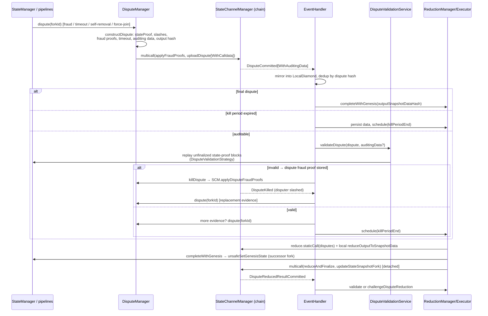

# Dispute Pipeline

> **Specification subject:** [specification/protocol/dispute-processing.md](../../../../specification/disputes/dispute-processing.md)

> **Status:** Draft, reverse-engineered baseline. Pending engineer review.
> **Scope:** The SDK side of disputes: intake from local escalation and chain
> events, dispute construction, audit (validity/authorization checks, state
> proofs, replay), dispute fraud proofs and kills, timeout and forced-inclusion
> handling, slash-set updates, reduction and successor-fork creation,
> persistence, and return to normal execution — including the algorithmic
> relationship between each SDK step and the contract facets. Protocol model:
> [../protocol/disputes.md](../../../../specification/disputes/disputes.md),
> [../protocol/fraud-proofs.md](../../../../specification/disputes/fraud-proofs.md),
> [../protocol/state-proofs.md](../../../../specification/disputes/state-proofs.md); contract side:
> [../contracts/manager-and-facets.md](../contracts/manager-and-facets.md).

## 1. Purpose & observable contract

The pipeline has three roles, all embodied by every honest participant:

- **Disputer** — constructs and uploads a dispute when off-chain cooperation
  broke (timeout, observed fraud, self-removal, forced join inclusion).
- **Auditor** — validates every dispute committed on-chain by others; an
  invalid dispute is _killed_ with a dispute fraud proof during its kill
  period; a valid one is persisted and, if the auditor holds more evidence, is
  answered with the auditor's own dispute.
- **Reducer** — after the window's kill period, deterministically reduces the
  window's disputes to one successor fork, installs its genesis locally, and
  submits `reduceAndFinalize` + the fork snapshot update on-chain.

Guarantee: every dispute path ends in a canonical successor fork adopted by
`unsafeSetGenesisState` ([`INV-DVP-5-NAJRB0`](dispute-pipeline.md#inv-dvp-5-najrb0)), with valid
carried-forward state; the reduction result is order-independent so concurrent
reducers converge ([`INV-DVP-4-Z530JD`](dispute-pipeline.md#inv-dvp-4-z530jd)).

## 2. Overview

## 3. Intake

### 3.1 Local escalation (disputer role)

Every trigger calls [`DisputeManager.dispute(forkId)`](../../../../../../src/disputeManager/DisputeManager.ts#L1),
which is mutexed and idempotent per fork (`didIDispute` flag):

| Trigger                                                                                                         | Site                                                                                                   | Dispute input it contributes                                                                                                                              |
| --------------------------------------------------------------------------------------------------------------- | ------------------------------------------------------------------------------------------------------ | --------------------------------------------------------------------------------------------------------------------------------------------------------- |
| Objective block fraud (double sign, invalid transition, wrong genesis, forged inbound block, invalid timestamp) | Block pipeline strategies ([block-confirmation-pipeline.md](./block-confirmation-pipeline.md) §9)      | Fraud proof stored in [`FraudProofStorage`](../../../../../../src/storage/FraudProofStorage.ts#L5); applied in the dispute multicall → on-chain slash set |
| Participant timeout                                                                                             | [`StateManager.tryTimeoutParticipant`](../../../../../../src/stateManager/StateManager.ts#L483) (§3.2) | `TimeoutStruct` stored in [`TimeoutStorage`](../../../../../../src/storage/TimeoutStorage.ts#L5)                                                          |
| Voluntary self-removal (exit without N/N signatures)                                                            | `startMaybeExitOnChain` slow path                                                                      | `selfRemoval = true` via [`ForceExitStorage`](../../../../../../src/storage/ForceExitStorage.ts#L1)                                                       |
| Forced inbound inclusion (join ignored for N+1 blocks)                                                          | `maybeInitiateForceJoinDispute`                                                                        | `latestInboundMessageBlockHash/Height` newer than the fork's applied tip                                                                                  |
| On-chain slash observed on an undisputed fork                                                                   | `EventHandler.onChainSlashed`                                                                          | `onChainSlashes`                                                                                                                                          |
| Dispute killed, window empty                                                                                    | `EventHandler.onDisputeKilled`                                                                         | replacement evidence (first upload wins; `RaceConditionDisputeEvidencePeriodExpired` tolerated)                                                           |
| Reduction found an empty window                                                                                 | `ReductionExecutor.tryReduceLocked`                                                                    | own view of the fork                                                                                                                                      |
| Auditor holds more evidence than a valid observed dispute                                                       | `DisputeManager.shouldAddOwnEvidence` → `canConstructMoreEvidence` (once per fork, §6)                 | merged evidence                                                                                                                                           |

### 3.2 Timeout detection detail

`tryTimeoutParticipant(forkId, height, participant)` (scheduled after every
committed block and after `setLatestState`):

1. Skip if the target is us, we are not a participant, or the block exists.
2. Compute `timeoutMinTimestamp = previousRelevantTimestamp + p2pTime + agreementTime + chainFallbackTime (+ height-0 grace)`;
   reschedule if not yet due.
3. If a dispute window already exists and opened **before** the timeout became
   valid, do not submit (the on-chain
   `RaceConditionDisputeTimeoutWindowCreatedTooEarly` guard repeats this
   authoritatively).
4. Race checks against calldata: recover the _previous_ block's on-chain post
   (it may grant the target extra time → reschedule), then check the _target_
   slot's commitment via `getBlockCallDataCommitment` (LocalDiamond, then chain
   recovery). A commitment that exists while the block pipeline did not accept
   the block yields a **forced** timeout (`isForced = true`); no commitment
   yields a normal timeout.
5. Build the `TimeoutStruct` (participant, height, `minTimeStamp`, `isForced`,
   previous producer, whether the previous producer posted calldata, and the
   target's signature on the previous block — signing it forfeits the extra
   time), persist it, and call `dispute(forkId)`.

### 3.3 Chain intake (auditor role)

Disputes never arrive over peer RPC; the chain is the source of truth. The
listener pipeline ([components.md](./components.md) §6) delivers
`DisputeCommitted` / `DisputeCommittedWithAuditingData` to
[`EventHandler.onDisputeCommitted`](../../../../../../src/eventHandlers/EventHandler.ts#L322),
deduplicated per dispute hash by an in-flight promise map. The handler first
mirrors the event into the `LocalDiamond`, then applies a relevance gate: the
dispute's fork must be the current fork, or (for final disputes) a fork with an
in-progress reduction operation — late non-final events for resolved forks are
ignored. Relevant disputes clear the fork's block queue and trigger a one-time
`IsForkDisputedService.requestDisputeAcknowledgment` round (peers that refuse
or ignore the acknowledgment are disconnected; peers later caught building on
the acknowledged dead fork are blacklisted).

## 4. Dispute construction

[`DisputeManager.constructDispute(forkId)`](../../../../../../src/disputeManager/DisputeManager.ts#L646)
assembles `ConstructDisputeResult = { dispute, disputeConfirmation, auditingData, fraudProofsToApply }`:

1. **State proof.** [`AgreementManager.getStateProof`](../../../../../../src/agreementManager/AgreementManager.ts#L67)
   for the fork's latest stored height: milestones at every participant-set
   change point plus a latest-state milestone when threshold coverage exists;
   with any linked tail inside its last milestone
   ([../protocol/state-proofs.md](../../../../specification/disputes/state-proofs.md)).
2. **Slash set.** `LocalDiamond.getOnChainSlashedParticipants ∩ participants`;
   for every participant not yet slashed on-chain that we hold a local fraud
   proof for, the proof joins `fraudProofsToApply` and the participant joins
   the dispute's `onChainSlashes` — the multicall applies the proofs first, so
   the dispute's claimed set is a subset of the on-chain set when it executes
   (separation of fraud-proof enforcement from reduction, [`INV-DVP-6-RFSBRQ`](dispute-pipeline.md#inv-dvp-6-rfsbrq)).
3. **Timeout** from storage, or the empty struct.
4. **Auditing data** (`getAuditingData`): genesis `SnapshotData`, one snapshot
   per milestone, the latest state snapshot, the latest _finalized_ state's
   encoded machine state, and the inbound/outbound message-block ranges linking
   snapshot tips. `isPartial` (anything missing locally) aborts construction.
5. **Output commitment.** `LocalDiamond.computeDisputeOutputSnapshotData.staticCall(input, latestSnapshot, latestState, inboundBlocks)`
   computes the successor-fork genesis `SnapshotData`; its hash becomes
   `outputSnapshotDataHash`. The dispute thereby pre-commits to its own
   reduction outcome.
6. **`postedAuditingData` = `!SCM.isAuditingDataOmissionAllowed(dispute)`** —
   omission is allowed for an empty genesis proof, a last milestone containing the matching
   chain anchor, or all required signatures. The required set is the chain snapshot participants
   plus pending joiners through the committed inbound head, minus committed slashes.
   A local false answer posts data; a local true answer is confirmed on chain before omission.
   Thrown local or chain errors abort construction.
7. Sign the encoded dispute (`SignatureUtils.signDispute`) →
   `DisputeConfirmation` with an empty co-signature list.

**Submission.** With fraud proofs: `SCM.multicall([applyFraudProofs, uploadDispute[WithCalldata]])`;
without: the plain or calldata upload. No upload passes a gas limit: the chain signer sends each
with its estimate plus headroom (`withGasHeadroom`), so a concurrent honest dispute that lands
between estimate and inclusion cannot push a late disputer out of gas (and past the evidence
window). Race reverts are classified:
`ErrorCantParticipateInDispute` (we are slashed — warn),
`RaceConditionDisputeTimeoutWindowCreatedTooEarly` (no-op),
`RaceConditionDisputeEvidencePeriodExpired` (rethrown — evidence window
closed), `RaceConditionDisputeInboundNotLatest` (the upload must anchor exactly at
the chain's inbound head -> load the missing inbound run up to that head and
rebuild). On failure the `didIDispute` flag is rolled back so a later attempt
can retry.

## 5. Audit: validity and authorization checks

[DisputeValidationService](../../../source/src/stateManager/dispute/DisputeValidationService.ts.md)
uses canonical counter predicates and the shared AgreementManager walk. Availability, below-anchor
and verified-final-state conflicts may reject before normal tiers. A conflict is compared exactly
at the proved final height, including an anchor-height block; it is not proof of older ancestry.
An invalid result stores one counter, while missing required evidence or thrown execution/RPC
failures propagate without an unsupported accusation.

Proof verification tries local final state, local diamond, then chain. A missing start or completed
false result advances; an exception never does. Checked malformed block bytes are invalid evidence;
wholly skipped history is ignored. The walk's successful result identifies retained start, final
snapshot and replay position. Independent latest-state binding, committed slashes, actual latest
balance, timeout, reason and output checks still apply after a successful walk.

Block-specific counters use original last-milestone-relative indices. Their canonical eligibility
protects the greater of the first block and matching anchor, with the genesis-zero exception.
Header mismatch is therefore state-dependent, not an unconditional pure scan of every block.
TimeoutThreshold remains direct threshold signatures at the target height/author;
TimeoutSupersededByFinalState accepts same-fork finality at or above the timeout height.

### 5.1 Replay of the last milestone's tail

Each tier supplies its own verified starting snapshot and full state. Replay passes an explicit
BlockPredecessor through ingest, validation and evidence construction. A stored support block does
not skip execution. A completed lower-tier replay failure moves to the next tier without creating
counter evidence; a chain-tier fault can establish the eligible counter. Required missing state
is fatal. A newer local final view can answer an older dispute with newer evidence without replaying
backward into obsolete state.

DisputeValidationStrategy does not position the VM itself; ingest uses the explicit predecessor.
Replay stores blocks, snapshots and state for reduction without moving the active view, changing
membership, advancing force-join work or signing. Double-sign evidence remains an ordinary block
fraud proof, separate from the dispute's validity. Per-step proof counters reuse common Solidity
walk checks and do not repeat the whole earlier walk.

## 6. Audit outcome handling

In [`EventHandler.handleDisputeCommitted`](../../../../../../src/eventHandlers/EventHandler.ts#L352):

- **Final dispute** (`isFinal`, i.e. the contract marked the window decided):
  no audit — persist the confirmation, load the required inbound run if not posted, compute the successor genesis via
  `computeDisputeOutputSnapshotData` + `computeDisputeOutputState`
  (staticCalls), and complete the fork's reduction operation with
  `reducedForkId = dispute.outputSnapshotDataHash`. Non-participants that
  cannot assemble the data abort (spectators fail closed).
- **Kill period expired:** committed peers still audit and replay to persist reduction data, warn on invalidity, and schedule reduction. They cannot kill after expiry. Thrown audit failures propagate; late-challenge recovery remains open.
- **Auditable**: run §5. Invalid → the stored dispute fraud proof is submitted
  by [`DisputeManager.killDispute`](../../../../../../src/disputeManager/DisputeManager.ts#L547)
  with canonical preflight. A peer that already disputed only kills; otherwise the owner sends
  kill then its own replacement in one multicall with expected-slash accounting. Known expired
  kill preflight sends nothing; a late transaction failure propagates rather than becoming a
  successful kill.
  Valid → persist the confirmation, notify (`notifyDisputeUpdate`), then
  `DisputeManager.shouldAddOwnEvidence` (its `canConstructMoreEvidence`): construct our own dispute and compare
  `reduce([theirs])` with `reduce([ours, theirs])` on the `LocalDiamond`; a
  difference means our evidence changes the outcome → upload our dispute
  (evidence accumulation). A node that already disputed the fork skips the
  comparison (checked first); otherwise it runs once per disputed fork
  (reduction merges evidence monotonically) and concurrent audits share it. A
  rejected comparison is dropped and its error propagates to the audit. Missing
  required own auditing data is fatal; it is not a "nothing to add" answer. A
  positive answer is kept so a failed upload is retried. A kill drops the
  fork's comparison (the compared dispute may be the one killed), and a
  committed reduced result prunes it (`EventHandler` calls
  `DisputeManager.forgetEvidenceComparison` for both). The memo only gates joining another
  peer's dispute; new own evidence (fraud, timeout, leave) is disputed through
  its own paths (§3.1). Reduction is scheduled at `killPeriodEnd` in every
  case.

**`DisputeKilled` event** ([`onDisputeKilled`](../../../../../../src/eventHandlers/EventHandler.ts#L821)):
drop the fork's cached evidence comparison, record the killed disputer in the local slash mirror
(`onOnChainSlashAdded` — the kill _is_ the slash), mirror `onDisputeKilled`,
disconnect/blacklist the disputer, and if the window is now empty and the fork
is current, upload replacement evidence (first honest peer wins).

**`ChainSlashed` event**: mirror the slash, blacklist the peer, and open a
dispute on the current fork if it is not yet disputed and the slashed address
is still a participant.

## 7. Reduction and successor-fork creation

[`ReductionManager`](../../../../../../src/stateManager/reduction/ReductionManager.ts#L42) /
[`ReductionExecutor`](../../../../../../src/stateManager/reduction/ReductionExecutor.ts#L52) /
[`ReductionComputationService`](../../../../../../src/stateManager/reduction/ReductionComputationService.ts#L20):

1. **Trigger.** Scheduled at `killPeriodEnd` per §6; also from the block
   pipeline's fork-recovery gate, from `onStateSnapshotUpdated` convergence,
   and from `onDisputeReducedResultCommitted`. All attempts serialize on the
   executor's attempt mutex; per fork there is exactly one shared completion
   promise (single successor-fork installation).
2. **Preconditions** (re-checked at run time): fork still current; window
   exists on-chain; kill period expired (memoized per `(channel, fork)` —
   "not expired until `killPeriodEnd`" is reused, "expired" is terminal).
3. **Dispute set.** [`EventSyncService.loadSynchronizedWindowCommitments`](../../../../../../src/stateManager/EventSyncService.ts#L268):
   the window's commitments from the chain, with any dispute whose event never
   reached us recovered by targeted log queries (3 attempts, widening span)
   — a reducer never reads a window its storage cannot back. Empty window →
   upload our own dispute instead.
4. **Compute.** `SCM.reduce.staticCall(disputes)` (order-independent
   deterministic reduction, [../protocol/disputes.md](../../../../specification/disputes/disputes.md))
   → `ReduceOutput`; `AgreementManager.getReduceData` resolves the reduced
   latest snapshot, machine state, and the inbound range consumed by the
   reduction; `LocalDiamond.reduceOutputToSnapshotData.staticCall` turns it
   into the successor genesis `SnapshotData`, encoded state, and terminal
   outbound message block. `reducedForkId = keccak(encode(reducedSnapshotData))`.
5. **Simulate then install then submit.**
   `multicall.staticCall([reduceAndFinalize, updateStateSnapshotFork])` first;
   races classify as `already-reduced` (`RaceConditionDisputeAlreadyReduced`,
   `RaceConditionBlockHeightTooOld` — deterministic reduction means another
   reducer installed the same result) or `superseded` (a final dispute's
   output won; stand down). Then
   `completeWithGenesis` installs the successor genesis under the
   `StateManager` mutex via `unsafeSetGenesisState` — the point where the fork
   transitions, queues drain, status and timeout scheduling restart — and only
   then is the transaction submitted **detached**. A completion that resolves
   to a different `reducedForkId` than expected is fatal (`abort`).
6. **Final-dispute fast path.** A final dispute completes the same per-fork
   operation directly with its pre-committed output (§6), skipping compute and
   submit.

**Reduction challenge.** On `DisputeReducedResultCommitted`
([`onDisputeReducedResultCommitted`](../../../../../../src/eventHandlers/EventHandler.ts#L699)):
drop the fork's cached evidence comparison (`DisputeManager.forgetEvidenceComparison`), mirror
into the LocalDiamond; if relevant and the challenge period expired →
`tryReduce` (adopt). Otherwise recompute the reduction on `SCM`
(`ReductionManager.computeReduction`, the chain's reducer; the LocalDiamond has no sync guarantee,
so reduced-result validation does not read it first). A mismatching
`reducedForkId` → `SCM.challengeDisputeReduction(disputes, latestSnapshot, state, inboundBlocks)`
(detached; tolerant of `ErrorCantParticipateInDispute`) and the dishonest
reducer is blacklisted. A locally unavailable dispute set means the reduction
was already consumed — treated as processed.

**Snapshot advancement.** After the successor fork is uncontestable,
[`SnapshotUpdateService`](../../../../../../src/stateManager/snapshotUpdate/SnapshotUpdateService.ts#L37)
walks the on-chain snapshot's fork through `getReducedResult` /
`isReduceChallengePeriodExpired` hops to the first undisputed fork, builds
`updateStateSnapshotFork` calldata (with the outbound message-block range the
chain has not yet processed — incremental withdrawal processing; see
[../protocol/cross-layer-messages.md](../../../../specification/settlement/cross-layer-messages.md) §2),
chains an `updateStateSnapshotSameFork` for newer finalized milestones, and
multicalls both. This is also the N/N exit path of the block pipeline.

## 8. Persistence and return to normal execution

- [`DisputeStorage`](../../../../../../src/storage/DisputeStorage.ts#L15): confirmations
  by commitment, the per-fork `didIDispute` flag.
- [`DisputeFraudProofStorage`](../../../../../../src/storage/DisputeFraudProofStorage.ts#L8):
  one dispute fraud proof per dispute (the audit stops at the first).
- Even after the kill period expires, committed participants run
  `DisputeValidationService.validateDispute` to obtain verified proof material and
  replay data for reduction. Its verdict can no longer trigger a kill. Audit
  persistence does not advance the active view; unsupported retained-block trust
  is tracked in the open findings register.
- Return to execution: `unsafeSetGenesisState` → `setLatestState` sets the new
  `forkId` (clearing queue-recovery gates), recomputes status from the new
  participant set (a removed/slashed participant drops to `SYNCED`; a snapshot
  that excludes us entirely triggers `abort` via `onStateSnapshotUpdated`),
  fires `onSetState`/`onTurn`, schedules the next author timeout, and drains
  queued blocks. Valid non-final transitions from the old fork are carried
  forward inside the reduction output, not replayed by the SDK.

## 9. Assumptions, constraints & dependencies

- Chain events are observed through the single configured provider; dispute
  audit deadlines (kill period) therefore inherit the RPC availability
  assumption ([../security/trust-model.md](../../../../specification/security/trust-model.md)). The
  executor code marks provider failure during reduction as fatal.
- Participants and pending participants require the evidence for their retained audit path.
  Missing required state is fatal; older state made obsolete by a newer verified final point need
  not be reconstructed. Uncommitted observers persist and schedule without participant audit.
- Time windows (`evidenceTime`, kill period, challenge period) come from the
  contracts; the SDK never computes its own authority over them, it reads
  `isKillPeriodExpired` / `isReduceChallengePeriodExpired`.
- All dispute-path staticCall predicates run against the `LocalDiamond`
  mirror, whose freshness depends on processed events; checks where staleness
  could cause a wrong slash re-verify against the chain (slash subset, inbound
  hash, kill-period reads).

## 10. Invariants & failure behavior

- **[`INV-DVP-1-A6BYJR`](dispute-pipeline.md#inv-dvp-1-a6byjr)** — `dispute(forkId)` is idempotent per fork per instance
  (`didIDispute`), and a failed upload rolls the flag back.

- **[`INV-DVP-2-Q13TVQ`](dispute-pipeline.md#inv-dvp-2-q13tvq)** — The auditor never submits a proof the contracts would
  reject: every kill decision is grounded in the canonical Solidity predicate
  (staticCall), and self-slashing proof types are preflighted
  (`validateTimeoutCalldataPostedProof`).

- **[`INV-DVP-3-ZMF1HA`](dispute-pipeline.md#inv-dvp-3-zmf1ha)** — An audit that returns "invalid" has stored exactly one
  dispute fraud proof; returning invalid without one is an internal error
  (throws), never a silent kill attempt.

- **[`INV-DVP-4-Z530JD`](dispute-pipeline.md#inv-dvp-4-z530jd)** — Reduction is deterministic and order-independent over the
  window's dispute set; concurrent reducers converge on one `reducedForkId`,
  and race reverts are classified as convergence, not failure.

- **[`INV-DVP-5-NAJRB0`](dispute-pipeline.md#inv-dvp-5-najrb0)** — Every initiated dispute path terminates in a successor fork
  installed via `unsafeSetGenesisState` (final dispute, own reduction, or
  adoption of another's finalized reduction).

- **[`INV-DVP-6-RFSBRQ`](dispute-pipeline.md#inv-dvp-6-rfsbrq)** — Fraud-proof enforcement is separate from reduction: proofs
  slash into the on-chain set (multicall before upload, or immediate kill);
  the dispute consumes the set, it does not re-execute proofs ([`INV-DVP-6-RFSBRQ`](dispute-pipeline.md#inv-dvp-6-rfsbrq)).
- **Failure behavior.** Fatal reduction errors, unpreparable final-dispute
  genesis as a participant, or a completed reduction that mismatches the
  expected fork call `stateManager.abort()`. Non-participants abort instead of
  throwing. Unclassified submission reverts are logged with the candidate's
  inbound chain and rethrown.

## 11. Verification

Concrete test evidence is owned by the downstream verification layer. This section defines implementation-specific obligations only.

### Implementation test plan

These are concrete component-level tests required by the implementation obligations in this document. Exercise public boundaries with real domain values and collaborators. Every listed permutation is required unless an engineer records why it is not applicable.

| Plan item                                             | Requirement / invariant                         | Setup and stimulus                                                                                                      | Expected result                                                                                             | Required permutations                                                                                                                                                                                                                                                                                                                                                                                                                                                                                                                                                                                                                                                                                                                                                                                                                                                                                                                                                                                                                                                                                                                                                                                                                                                                             |
| ----------------------------------------------------- | ----------------------------------------------- | ----------------------------------------------------------------------------------------------------------------------- | ----------------------------------------------------------------------------------------------------------- | ------------------------------------------------------------------------------------------------------------------------------------------------------------------------------------------------------------------------------------------------------------------------------------------------------------------------------------------------------------------------------------------------------------------------------------------------------------------------------------------------------------------------------------------------------------------------------------------------------------------------------------------------------------------------------------------------------------------------------------------------------------------------------------------------------------------------------------------------------------------------------------------------------------------------------------------------------------------------------------------------------------------------------------------------------------------------------------------------------------------------------------------------------------------------------------------------------------------------------------------------------------------------------------------------- |
| `INV-DVP-1-A6BYJR.T1` | `INV-DVP-1-A6BYJR` | Exercise the real public component or contract boundary, including rejection and failure paths without partial effects. | Per-fork dispute idempotence with rollback on failed upload.                                                | `INV-DVP-1-A6BYJR.T1.P1` — valid case `INV-DVP-1-A6BYJR.T1.P2` — matching commitment `INV-DVP-1-A6BYJR.T1.P3` — duplicate delivery `INV-DVP-1-A6BYJR.T1.P4` — malformed input `INV-DVP-1-A6BYJR.T1.P5` — direct invalid/opposite case `INV-DVP-1-A6BYJR.T1.P6` — mismatched commitment `INV-DVP-1-A6BYJR.T1.P7` — predecessor linkage `INV-DVP-1-A6BYJR.T1.P8` — genesis linkage `INV-DVP-1-A6BYJR.T1.P9` — stale fork `INV-DVP-1-A6BYJR.T1.P10` — foreign fork `INV-DVP-1-A6BYJR.T1.P11` — replay delivery `INV-DVP-1-A6BYJR.T1.P12` — concurrent delivery `INV-DVP-1-A6BYJR.T1.P13` — adversarial input `INV-DVP-1-A6BYJR.T1.P14` — partial failure `INV-DVP-1-A6BYJR.T1.P15` — retry and recovery |
| `INV-DVP-2-Q13TVQ.T1` | `INV-DVP-2-Q13TVQ` | Exercise the real public component or contract boundary, including rejection and failure paths without partial effects. | Kill decisions are grounded in canonical Solidity predicates; self-slashing proofs are preflighted.         | `INV-DVP-2-Q13TVQ.T1.P1` — valid case `INV-DVP-2-Q13TVQ.T1.P2` — new participant `INV-DVP-2-Q13TVQ.T1.P3` — direct invalid/opposite case `INV-DVP-2-Q13TVQ.T1.P4` — existing participant `INV-DVP-2-Q13TVQ.T1.P5` — removed participant `INV-DVP-2-Q13TVQ.T1.P6` — slashed participant `INV-DVP-2-Q13TVQ.T1.P7` — concurrent membership change                                                                                                                                                                                                                                                                                                                                                                                                                                                                                                                                                                                                                                                                             |
| `INV-DVP-3-ZMF1HA.T1` | `INV-DVP-3-ZMF1HA` | Exercise the real public component or contract boundary, including rejection and failure paths without partial effects. | Invalid audit ⇔ exactly one stored dispute fraud proof.                                                     | `INV-DVP-3-ZMF1HA.T1.P1` — valid case `INV-DVP-3-ZMF1HA.T1.P2` — malformed input `INV-DVP-3-ZMF1HA.T1.P3` — direct invalid/opposite case `INV-DVP-3-ZMF1HA.T1.P4` — adversarial input `INV-DVP-3-ZMF1HA.T1.P5` — partial failure `INV-DVP-3-ZMF1HA.T1.P6` — retry and recovery                                                                                                                                                                                                                                                                                                                                                                                                                                                                                                                                                                                                                                                                                                                                                                                   |
| `INV-DVP-4-Z530JD.T1` | `INV-DVP-4-Z530JD` | Exercise the real public component or contract boundary, including rejection and failure paths without partial effects. | Deterministic, order-independent reduction; races classified as convergence.                                | `INV-DVP-4-Z530JD.T1.P1` — valid case `INV-DVP-4-Z530JD.T1.P2` — duplicate delivery `INV-DVP-4-Z530JD.T1.P3` — direct invalid/opposite case `INV-DVP-4-Z530JD.T1.P4` — replay delivery `INV-DVP-4-Z530JD.T1.P5` — concurrent delivery                                                                                                                                                                                                                                                                                                                                                                                                                                                                                                                                                                                                                                                                                                                                                                                                                                                                  |
| `INV-DVP-5-NAJRB0.T1` | `INV-DVP-5-NAJRB0` | Exercise the real public component or contract boundary, including rejection and failure paths without partial effects. | Every dispute path installs a successor fork via `unsafeSetGenesisState`.                                   | `INV-DVP-5-NAJRB0.T1.P1` — valid case `INV-DVP-5-NAJRB0.T1.P2` — matching commitment `INV-DVP-5-NAJRB0.T1.P3` — malformed input `INV-DVP-5-NAJRB0.T1.P4` — direct invalid/opposite case `INV-DVP-5-NAJRB0.T1.P5` — mismatched commitment `INV-DVP-5-NAJRB0.T1.P6` — predecessor linkage `INV-DVP-5-NAJRB0.T1.P7` — genesis linkage `INV-DVP-5-NAJRB0.T1.P8` — stale fork `INV-DVP-5-NAJRB0.T1.P9` — foreign fork `INV-DVP-5-NAJRB0.T1.P10` — adversarial input `INV-DVP-5-NAJRB0.T1.P11` — partial failure `INV-DVP-5-NAJRB0.T1.P12` — retry and recovery                                                                                                                                                                                                                                                                 |
| `INV-DVP-6-RFSBRQ.T1` | `INV-DVP-6-RFSBRQ` | Exercise the real public component or contract boundary, including rejection and failure paths without partial effects. | Fraud proofs slash before/independently of the dispute that consumes the slash set.                         | `INV-DVP-6-RFSBRQ.T1.P1` — valid case `INV-DVP-6-RFSBRQ.T1.P2` — new participant `INV-DVP-6-RFSBRQ.T1.P3` — malformed input `INV-DVP-6-RFSBRQ.T1.P4` — direct invalid/opposite case `INV-DVP-6-RFSBRQ.T1.P5` — existing participant `INV-DVP-6-RFSBRQ.T1.P6` — removed participant `INV-DVP-6-RFSBRQ.T1.P7` — slashed participant `INV-DVP-6-RFSBRQ.T1.P8` — concurrent membership change `INV-DVP-6-RFSBRQ.T1.P9` — adversarial input `INV-DVP-6-RFSBRQ.T1.P10` — partial failure `INV-DVP-6-RFSBRQ.T1.P11` — retry and recovery                                                                                                                                                                                                                                                                                                                                |
| `REQ-DVP-1-MQJTYR.T1` | `REQ-DVP-1-MQJTYR` | Exercise the real public component or contract boundary, including rejection and failure paths without partial effects. | Timeout submission respects precedence/race guards (existing window age, calldata grants, forced timeouts). | `REQ-DVP-1-MQJTYR.T1.P1` — valid case `REQ-DVP-1-MQJTYR.T1.P2` — before deadline `REQ-DVP-1-MQJTYR.T1.P3` — direct invalid/opposite case `REQ-DVP-1-MQJTYR.T1.P4` — at deadline `REQ-DVP-1-MQJTYR.T1.P5` — after deadline `REQ-DVP-1-MQJTYR.T1.P6` — maximum honest skew                                                                                                                                                                                                                                                                                                                                                                                                                                                                                                                                                                                                                                                                                                                                                                                         |
| `REQ-DVP-2-RG8QR3.T1` | `REQ-DVP-2-RG8QR3` | Exercise the real public component or contract boundary, including rejection and failure paths without partial effects. | The reducer reads the dispute window through event-synchronized storage (never a window it cannot back).    | `REQ-DVP-2-RG8QR3.T1.P1` — valid case `REQ-DVP-2-RG8QR3.T1.P2` — before deadline `REQ-DVP-2-RG8QR3.T1.P3` — malformed input `REQ-DVP-2-RG8QR3.T1.P4` — direct invalid/opposite case `REQ-DVP-2-RG8QR3.T1.P5` — at deadline `REQ-DVP-2-RG8QR3.T1.P6` — after deadline `REQ-DVP-2-RG8QR3.T1.P7` — maximum honest skew `REQ-DVP-2-RG8QR3.T1.P8` — adversarial input `REQ-DVP-2-RG8QR3.T1.P9` — partial failure `REQ-DVP-2-RG8QR3.T1.P10` — retry and recovery                                                                                                                                                                                                                                                                                                                                                                                                                                              |
| `REQ-DVP-3-CFFAW1.T1` | `REQ-DVP-3-CFFAW1` | Exercise the real public component or contract boundary, including rejection and failure paths without partial effects. | An incorrect committed reduction is challenged within the challenge period.                                 | `REQ-DVP-3-CFFAW1.T1.P1` — valid case `REQ-DVP-3-CFFAW1.T1.P2` — matching commitment `REQ-DVP-3-CFFAW1.T1.P3` — before deadline `REQ-DVP-3-CFFAW1.T1.P4` — direct invalid/opposite case `REQ-DVP-3-CFFAW1.T1.P5` — mismatched commitment `REQ-DVP-3-CFFAW1.T1.P6` — predecessor linkage `REQ-DVP-3-CFFAW1.T1.P7` — genesis linkage `REQ-DVP-3-CFFAW1.T1.P8` — stale fork `REQ-DVP-3-CFFAW1.T1.P9` — foreign fork `REQ-DVP-3-CFFAW1.T1.P10` — at deadline `REQ-DVP-3-CFFAW1.T1.P11` — after deadline `REQ-DVP-3-CFFAW1.T1.P12` — maximum honest skew                                                                                                                                                                                                                                                                       |

## Future Work

_Non-normative._

- Apply fraud proofs discovered during replay without opening a new dispute
  (`DisputeValidationStrategy.doubleSignDetected` TODO).
- Optimistic reduction: commit only the reduced-result hash and finalize after
  a challenge period, and a fast path with threshold peer attestation
  ([`OQ-15-2J4Y1Z` (`challengeDisputeReduction` is currently unreachable)](../../../open-questions.md#oq-15-2j4y1z)).
- Re-evaluate `postedAuditingData` under early finalization, and the
  cross-audit race where calldata is posted after a kill decision (code TODOs).

## Implementation traceability

| Requirement / invariant                                    | Statement                                                                                                   | Implementation status | Implementation evidence                                                                                                                                                                                                                                  | Gap / divergence |
| ---------------------------------------------------------- | ----------------------------------------------------------------------------------------------------------- | --------------------- | -------------------------------------------------------------------------------------------------------------------------------------------------------------------------------------------------------------------------------------------------------- | ---------------- |
| [`INV-DVP-1-A6BYJR`](dispute-pipeline.md#inv-dvp-1-a6byjr) | Per-fork dispute idempotence with rollback on failed upload.                                                | Covered               | [src/disputeManager/DisputeManager.ts](../../../../../../src/disputeManager/DisputeManager.ts#L1) (`dispute`)                                                                                                                                            | None.            |
| [`INV-DVP-2-Q13TVQ`](dispute-pipeline.md#inv-dvp-2-q13tvq) | Kill decisions are grounded in canonical Solidity predicates; self-slashing proofs are preflighted.         | Covered               | [src/stateManager/dispute/DisputeValidationService.ts](../../../../../../src/stateManager/dispute/DisputeValidationService.ts#L26) (staticCalls, `validateTimeoutCalldataPostedProof`)                                                                   | None.            |
| [`INV-DVP-3-ZMF1HA`](dispute-pipeline.md#inv-dvp-3-zmf1ha) | Invalid audit ⇔ exactly one stored dispute fraud proof.                                                     | Covered               | `validateDispute` + `hasStoredDisputeFraudProof` throw paths                                                                                                                                                                                             | None.            |
| [`INV-DVP-4-Z530JD`](dispute-pipeline.md#inv-dvp-4-z530jd) | Deterministic, order-independent reduction; races classified as convergence.                                | Covered               | [src/stateManager/reduction](../../../../../../src/stateManager/reduction) (`classifyReductionRace`, `compute`)                                                                                                                                          | None.            |
| [`INV-DVP-5-NAJRB0`](dispute-pipeline.md#inv-dvp-5-najrb0) | Every dispute path installs a successor fork via `unsafeSetGenesisState`.                                   | Covered               | [src/stateManager/reduction/ReductionManager.ts](../../../../../../src/stateManager/reduction/ReductionManager.ts#L52) (`completeWithGenesis`), [src/eventHandlers/EventHandler.ts](../../../../../../src/eventHandlers/EventHandler.ts#L1) (final path) | None.            |
| [`INV-DVP-6-RFSBRQ`](dispute-pipeline.md#inv-dvp-6-rfsbrq) | Fraud proofs slash before/independently of the dispute that consumes the slash set.                         | Covered               | `constructDispute` multicall ordering; `killDispute`                                                                                                                                                                                                     | None.            |
| [`REQ-DVP-1-MQJTYR`](dispute-pipeline.md#req-dvp-1-mqjtyr) | Timeout submission respects precedence/race guards (existing window age, calldata grants, forced timeouts). | Covered               | [src/stateManager/StateManager.ts](../../../../../../src/stateManager/StateManager.ts#L1) (`tryTimeoutParticipant`)                                                                                                                                      | None.            |
| [`REQ-DVP-2-RG8QR3`](dispute-pipeline.md#req-dvp-2-rg8qr3) | The reducer reads the dispute window through event-synchronized storage (never a window it cannot back).    | Covered               | [src/stateManager/EventSyncService.ts](../../../../../../src/stateManager/EventSyncService.ts#L1) (`loadSynchronizedWindowCommitments`, `ensureDisputesProcessed`)                                                                                       | None.            |
| [`REQ-DVP-3-CFFAW1`](dispute-pipeline.md#req-dvp-3-cffaw1) | An incorrect committed reduction is challenged within the challenge period.                                 | Covered               | [src/eventHandlers/EventHandler.ts](../../../../../../src/eventHandlers/EventHandler.ts#L1) (`validateDisputeReductionAndChallenge`)                                                                                                                     | None.            |

## Dispute admission and state contributions

The [DisputeManager source report](../../../source/src/disputeManager/DisputeManager.ts.md) owns the
single marker and its rollback. It enters the [StateManager boundary](../../../source/src/stateManager/StateManager.ts.md)
after admitted signing/storage finishes, then releases it before construction and submission. Block-bound
callers request observed detached dispute work so they do not reacquire a mutex they already hold.

Conditional state contributions follow [the submission facet](../../../source/contracts/V1/StateChannelDiamondProxy/DisputeManagerFacet.sol.md)
and [canonical reason validator](../../../source/contracts/V1/StateChannelDiamondProxy/utils/DisputeUtils.sol.md).
A specific closed-window refusal refreshes slashes through [EventSyncService](../../../source/src/stateManager/eventSync/EventSyncService.ts.md)
and re-enters normal construction only for observation changed since construction. The flag supplies a
reason after acceptance even if the opener is later killed; it never bypasses the remaining audit checks.
