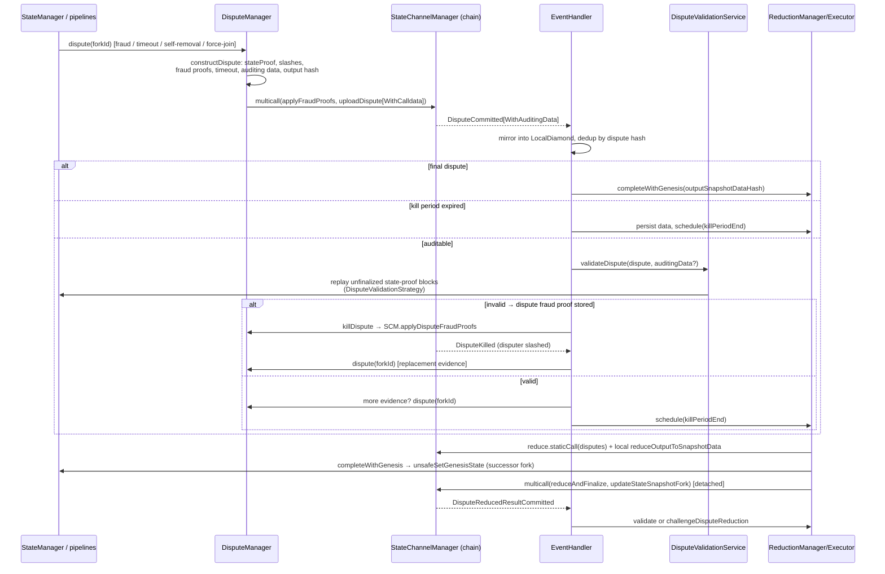

# Dispute Pipeline

> **Specification subject:** [specification/protocol/dispute-processing.md](../../../../specification/disputes/dispute-processing.md)

> **Status:** Draft, reverse-engineered baseline. Pending engineer review.
> **Scope:** The SDK side of disputes: intake from local escalation and chain
> events, dispute construction, audit (validity/authorization checks, state
> proofs, replay), dispute fraud proofs and kills, timeout and forced-inclusion
> handling, slash-set updates, reduction and successor-fork creation,
> persistence, and return to normal execution — including the algorithmic
> relationship between each SDK step and the contract facets. Protocol model:
> [../protocol/disputes.md](../../../../specification/disputes/disputes.md),
> [../protocol/fraud-proofs.md](../../../../specification/disputes/fraud-proofs.md),
> [../protocol/state-proofs.md](../../../../specification/disputes/state-proofs.md); contract side:
> [../contracts/manager-and-facets.md](../contracts/manager-and-facets.md).

## 1. Purpose & observable contract

The pipeline has three roles, all embodied by every honest participant:

- **Disputer** — constructs and uploads a dispute when off-chain cooperation
  broke (timeout, observed fraud, self-removal, forced join inclusion).
- **Auditor** — validates every dispute committed on-chain by others; an
  invalid dispute is _killed_ with a dispute fraud proof during its kill
  period; a valid one is persisted and, if the auditor holds more evidence, is
  answered with the auditor's own dispute.
- **Reducer** — after the window's kill period, deterministically reduces the
  window's disputes to one successor fork, installs its genesis locally, and
  submits `reduceAndFinalize` + the fork snapshot update on-chain.

Guarantee: every dispute path ends in a canonical successor fork adopted by
`unsafeSetGenesisState` ([`INV-DVP-5-NAJRB0`](dispute-pipeline.md#inv-dvp-5-najrb0)), with valid
carried-forward state; the reduction result is order-independent so concurrent
reducers converge ([`INV-DVP-4-Z530JD`](dispute-pipeline.md#inv-dvp-4-z530jd)).

## 2. Overview

## 3. Intake

### 3.1 Local escalation (disputer role)

Every trigger calls [`DisputeManager.dispute(forkId)`](../../../../../../src/disputeManager/DisputeManager.ts#L1),
which is mutexed and idempotent per fork (`didIDispute` flag):

| Trigger                                                                                                                | Site                                                                                                   | Dispute input it contributes                                                                                                                              |
| ---------------------------------------------------------------------------------------------------------------------- | ------------------------------------------------------------------------------------------------------ | --------------------------------------------------------------------------------------------------------------------------------------------------------- |
| Objective block fraud (double sign, invalid transition, wrong genesis, forged inbound block, invalid timestamp)        | Block pipeline strategies ([block-confirmation-pipeline.md](./block-confirmation-pipeline.md) §9)      | Fraud proof stored in [`FraudProofStorage`](../../../../../../src/storage/FraudProofStorage.ts#L5); applied in the dispute multicall → on-chain slash set |
| Participant timeout                                                                                                    | [`StateManager.tryTimeoutParticipant`](../../../../../../src/stateManager/StateManager.ts#L483) (§3.2) | `TimeoutStruct` stored in [`TimeoutStorage`](../../../../../../src/storage/TimeoutStorage.ts#L5)                                                          |
| Voluntary self-removal (exit without N/N signatures)                                                                   | `startMaybeExitOnChain` slow path                                                                      | `selfRemoval = true` via [`ForceExitStorage`](../../../../../../src/storage/ForceExitStorage.ts#L1)                                                       |
| Forced inbound inclusion (join ignored for N+1 blocks counted after the `agreementTime` grace, or N full turn windows) | `maybeInitiateForceJoinDispute` or the force-join deadline                                             | `latestInboundMessageBlockHash/Height` newer than the fork's applied tip                                                                                  |
| On-chain slash observed on an undisputed fork                                                                          | `EventHandler.onChainSlashed`                                                                          | `onChainSlashes`                                                                                                                                          |
| Dispute killed, window empty                                                                                           | `EventHandler.onDisputeKilled`                                                                         | replacement evidence (first upload wins; `RaceConditionDisputeEvidencePeriodExpired` tolerated)                                                           |
| Reduction found an empty window                                                                                        | `ReductionExecutor.tryReduceLocked`                                                                    | own view of the fork                                                                                                                                      |
| Auditor holds more evidence than a valid observed dispute                                                              | `DisputeManager.shouldAddOwnEvidence` → `canConstructMoreEvidence` (once per fork, §6)                 | merged evidence                                                                                                                                           |

### 3.2 Timeout detection detail

`tryTimeoutParticipant(forkId, height, participant)` (scheduled after every
committed block and after `setLatestState`):

1. Skip if the target is us, we are not a participant, or the block exists.
2. Compute `timeoutMinTimestamp = previousRelevantTimestamp + p2pTime + agreementTime + chainFallbackTime (+ height-0 grace)`;
   reschedule if not yet due.
3. If a dispute window already exists and opened **before** the timeout became
   valid, do not submit (the on-chain
   `RaceConditionDisputeTimeoutWindowCreatedTooEarly` guard repeats this
   authoritatively).
4. Race checks against calldata: recover the _previous_ block's on-chain post
   (it may grant the target extra time → reschedule), then check the _target_
   slot's commitment via `getBlockCallDataCommitment` (LocalDiamond, then chain
   recovery). A commitment that exists while the block pipeline did not accept
   the block yields a **forced** timeout (`isForced = true`); no commitment
   yields a normal timeout.
5. Build the `TimeoutStruct` (participant, height, `minTimeStamp`, `isForced`,
   previous producer, whether the previous producer posted calldata, and the
   target's signature on the previous block — signing it forfeits the extra
   time), persist it, and call `dispute(forkId)`.

### 3.3 Chain intake (auditor role)

Disputes never arrive over peer RPC; the chain is the source of truth. The
listener pipeline ([components.md](./components.md) §6) delivers
`DisputeCommitted` / `DisputeCommittedWithAuditingData` to
[`EventHandler.onDisputeCommitted`](../../../../../../src/eventHandlers/EventHandler.ts#L321),
deduplicated per dispute hash by an in-flight promise map. The handler first
mirrors the event into the `LocalDiamond`, then applies a relevance gate: the
dispute's fork must be the current fork, or (for final disputes) a fork with an
in-progress reduction operation — late non-final events for resolved forks are
ignored. Relevant disputes clear the fork's block queue and trigger a one-time
`IsForkDisputedService.requestDisputeAcknowledgment` round (peers that refuse
or ignore the acknowledgment are disconnected; peers later caught building on
the acknowledged dead fork are blacklisted).

## 4. Dispute construction

[`DisputeManager.constructDispute(forkId)`](../../../../../../src/disputeManager/DisputeManager.ts#L552)
assembles `ConstructDisputeResult = { dispute, disputeConfirmation, auditingData, fraudProofsToApply }`
([DisputeManager report](../../../source/src/disputeManager/DisputeManager.ts.md)). One built proof
carries its start, its milestone snapshots and its walked final state into the auditing data:

1. **State proof.** [`AgreementManager.buildStateProof`](../../../../../../src/agreementManager/AgreementManager.ts#L112)
   for the fork's latest stored height ([#L564](../../../../../../src/disputeManager/DisputeManager.ts#L564)): from the local proof start (the
   same-fork non-genesis on-chain snapshot the local diamond reports, else the fork genesis), one
   milestone per participant change above the start, the latest threshold milestone, then the
   unfinal tail up to the latest height appended to the last milestone (or one run from the start
   block without a milestone). A height below the start or missing/unlinked required history
   throws; the throw ends the attempt. The builder walks its own proof once on the local diamond
   (`verifyMilestonesFromTrustedStart`) to get the finalized snapshot
   ([AgreementManager report](../../../source/src/agreementManager/AgreementManager.ts.md))
   ([state-proofs](../../../../specification/disputes/state-proofs.md)).
2. **Slash set.** `LocalDiamond.getOnChainSlashedParticipants ∩ participants`;
   for every participant not yet slashed on-chain that we hold a local fraud
   proof for, the proof joins `fraudProofsToApply` and the participant joins
   the dispute's `onChainSlashes` — the multicall applies the proofs first, so
   the dispute's claimed set is a subset of the on-chain set when it executes
   (separation of fraud-proof enforcement from reduction, [`INV-DVP-6-RFSBRQ`](dispute-pipeline.md#inv-dvp-6-rfsbrq)).
3. **Timeout** from storage, or the empty struct.
4. **Auditing data** ([`getAuditingData`](../../../../../../src/disputeManager/DisputeManager.ts#L779)): genesis `SnapshotData`, one snapshot
   per milestone as the walk reads it, the latest state snapshot, the finalized state's encoded
   machine state, and the inbound/outbound message-block ranges linking snapshot tips; the outbound
   range starts at the proof start's outbound tip ([#L876](../../../../../../src/disputeManager/DisputeManager.ts#L876)–[#L886](../../../../../../src/disputeManager/DisputeManager.ts#L886)). The finalized snapshot
   comes from the chain's own walk (`verifyMilestones` staticCall on the chain manager), so the
   posted finalized state is the one the chain's `verifyStateProof` binds (D1) even when the local
   mirror lags the chain's start; `"0x"` when that walk rejects ([#L810](../../../../../../src/disputeManager/DisputeManager.ts#L810)–[#L826](../../../../../../src/disputeManager/DisputeManager.ts#L826)). A proof given as
   a plain struct is described with `describeStateProof`. The inbound run comes from
   `EventSyncService.loadSynchronizedInboundRun`. `isPartial` (anything missing locally) aborts
   construction.
5. **Output commitment.** `LocalDiamond.computeDisputeOutputSnapshotData.staticCall(input, latestSnapshot, latestState, inboundBlocks)`
   computes the successor-fork genesis `SnapshotData`; its hash becomes
   `outputSnapshotDataHash`. The dispute thereby pre-commits to its own
   reduction outcome.
6. **`postedAuditingData` = `!SCM.isLastMilestoneFinalByEveryone(dispute)`** —
   auditing data is posted as calldata only when the proof's last milestone is
   not already known-final to everyone (data availability for auditors).
   The chain judges it against the dispute's historic threshold: its snapshot participants (no adoption onto
   the fork while a proof can land), joiners at or below the dispute's inbound anchor, minus the dispute's own
   `onChainSlashes` only, so the same verdict holds for every later read of the committed dispute.
   A code TODO flags re-evaluating this under early finalization. The probe runs on the
   LocalDiamond first (`preferLocal`, [#L728](../../../../../../src/disputeManager/DisputeManager.ts#L728)–[#L739](../../../../../../src/disputeManager/DisputeManager.ts#L739)): a local "not final" posts the data without a chain read —
   posting is never wrong, only costlier — while a local "final", whose omitted data is slashable
   if the mirror lagged, is confirmed by `SCM` ([`REQ-MIRROR-4-H9C4YS` (Local-first evaluation, adverse answer confirmed)](../../../../specification/enforcement/local-mirror.md#req-mirror-4-h9c4ys)).
7. Sign the encoded dispute (`SignatureUtils.signDispute`) →
   `DisputeConfirmation` with an empty co-signature list.

There is no on-chain check of the finished proof before upload and no second build: the proof is
built once from the local start, and the chain walk drops milestones below its own start
([`REQ-DISPUTE-PIPE-13-W73B2F` (Proof construction from the local start)](../../../../specification/disputes/dispute-processing.md#req-dispute-pipe-13-w73b2f)).

**Submission.** With fraud proofs: `SCM.multicall([applyFraudProofs, uploadDispute[WithCalldata]])`;
without: the plain or calldata upload. Without fraud proofs no gas limit is passed: the chain
signer sends each upload with its estimate plus headroom (`GAS_ESTIMATE_HEADROOM_PERCENT`), so a
concurrent honest dispute that lands between estimate and inclusion cannot push a late disputer out
of gas (and past the evidence window). The multicall, which may replay a transition, passes the
estimate plus the manager's replay requirement (`replayGasLimit`). Race reverts are classified:
`ErrorCantParticipateInDispute` (we are slashed — warn),
`RaceConditionDisputeTimeoutWindowCreatedTooEarly` (no-op),
`RaceConditionDisputeEvidencePeriodExpired` (rethrown — evidence window
closed), `RaceConditionDisputeInboundNotLatest` (the upload must anchor exactly at
the chain's inbound head; it has no handler, so it ends the attempt like any
other unhandled revert). A throw from construction ends the attempt the same way. On failure the
`didIDispute` flag is rolled back so a later attempt can retry.

## 5. Audit: validity and authorization checks

[`DisputeValidationService.validateDispute`](../../../../../../src/stateManager/dispute/DisputeValidationService.ts#L47)
returns `false` iff a [`DisputeFraudProof`](../../../../../../src/stateManager/dispute/DisputeFraudProofService.ts#L49)
was stored — the caller then kills the dispute. Checks run in order; every
predicate that also exists in Solidity is evaluated by `staticCall` against the
canonical implementation so the off-chain auditor can never disagree with the
on-chain apply-handler ([`INV-DVP-2-Q13TVQ`](dispute-pipeline.md#inv-dvp-2-q13tvq)). "Local-first" below means the call goes to the
LocalDiamond through `preferLocal`: the answer that clears the dispute is accepted locally, and the
answer that would produce a fraud proof (or a local revert) is re-asked of `SCM` before the proof is
stored ([`REQ-MIRROR-4-H9C4YS` (Local-first evaluation, adverse answer confirmed)](../../../../specification/enforcement/local-mirror.md#req-mirror-4-h9c4ys)). The header and block-structure
predicates do not use `preferLocal`: they read only the proof, so they run on the LocalDiamond only.
Posted auditing data is judged by the chain alone: one `SCM.verifyStateProof` staticCall (the
commitment, the walk, the latest state, and D1: the posted finalized state is the state of the
walk's finalized snapshot). Its `false` stores `DisputeInvalidStateProof`; a read error throws out
of the audit with no proof. This is a flagged design deviation from local-first (one chain read
per posted audit), recorded in the [DisputeValidationService report](../../../source/src/stateManager/dispute/DisputeValidationService.ts.md).
Only after the chain accepted the proof does `AgreementManager.verifyStateProof` run its walk, to
decide what to persist ([`REQ-DISPUTE-PIPE-5-RZZB48` (Mirrored canonical audit)](../../../../specification/disputes/dispute-processing.md#req-dispute-pipe-5-rzzb48);
[AgreementManager report](../../../source/src/agreementManager/AgreementManager.ts.md)).

**No abstention.** Every audit ends in `true`, `false` with exactly one stored proof, or a thrown
internal failure (no verdict, no proof). There is no "skipped as valid" path: the auditor
replays and persists the tail material it lacks, recovers missing chain events through
`EventSyncService.loadSynchronizedInboundRun`, and throws when data is still missing after that
(no fork genesis, replay base not held, latest snapshot or state not held, inbound run not
recoverable).

| #   | Check                                                                                               | Canonical predicate                                                                                                                                                                                                                                                                                                                                                                                                                                                                                                                                                                                                                                                                                                                                                                                                                                                                                                                                                          | Fraud proof on failure                          |
| --- | --------------------------------------------------------------------------------------------------- | ---------------------------------------------------------------------------------------------------------------------------------------------------------------------------------------------------------------------------------------------------------------------------------------------------------------------------------------------------------------------------------------------------------------------------------------------------------------------------------------------------------------------------------------------------------------------------------------------------------------------------------------------------------------------------------------------------------------------------------------------------------------------------------------------------------------------------------------------------------------------------------------------------------------------------------------------------------------------------- | ----------------------------------------------- |
| 1   | Inbound hash is a real on-chain inbound tip                                                         | `isDisputeInboundHashValid` (LocalDiamond, then chain re-check); unreachable for a committed dispute, which upload anchors at the inbound head — kept as defence in depth                                                                                                                                                                                                                                                                                                                                                                                                                                                                                                                                                                                                                                                                                                                                                                                                    | `DisputeInboundHashNotInChain`                  |
| 2   | Proof header matches input                                                                          | `LocalDiamond.hasStateProofHeaderMismatch` only — pure, so the mirror computes exactly what the chain would; an undecodable block answers no mismatch and the structure check judges that block ([#L61](../../../../../../src/stateManager/dispute/DisputeValidationService.ts#L61)–[#L76](../../../../../../src/stateManager/dispute/DisputeValidationService.ts#L76))                                                                                                                                                                                                                                                                                                                                                                                                                                                                                                                                                                                                      | `DisputeStateProofHeaderMismatch`               |
| 3   | Block structure in the last milestone                                                               | `LocalDiamond.findFirstInvalidBlockStructureInStateProof` only; it scans only the last milestone and names the block by its `blockIndex` there ([#L78](../../../../../../src/stateManager/dispute/DisputeValidationService.ts#L78)–[#L92](../../../../../../src/stateManager/dispute/DisputeValidationService.ts#L92))                                                                                                                                                                                                                                                                                                                                                                                                                                                                                                                                                                                                                                                       | `DisputeInvalidBlockStructure(blockIndex)`      |
| 4   | No posted data: last milestone final by everyone (data availability, before any proof verification) | `isLastMilestoneFinalByEveryone`, local-first (snapshot participants ∪ joiners at or below the inbound anchor − `input.onChainSlashes`); posted flag without data throws ([#L94](../../../../../../src/stateManager/dispute/DisputeValidationService.ts#L94)–[#L101](../../../../../../src/stateManager/dispute/DisputeValidationService.ts#L101))                                                                                                                                                                                                                                                                                                                                                                                                                                                                                                                                                                                                                           | `DisputeLastMilestoneNotFinalAndNoAuditingData` |
| 5a  | Latest claimed block not below the chain's same-fork non-genesis snapshot                           | `SCM.getAnchorSnapshot` (chain, never the mirror); an empty proof claims the genesis and is below such a snapshot ([#L103](../../../../../../src/stateManager/dispute/DisputeValidationService.ts#L103), [#L257](../../../../../../src/stateManager/dispute/DisputeValidationService.ts#L257)–[#L280](../../../../../../src/stateManager/dispute/DisputeValidationService.ts#L280))                                                                                                                                                                                                                                                                                                                                                                                                                                                                                                                                                                                          | `DisputeStateProofBelowOnChainAnchor`           |
| 5b  | Posted auditing data: the chain verifies the proof                                                  | the walk evidence needs the fork genesis (missing → throw, [#L301](../../../../../../src/stateManager/dispute/DisputeValidationService.ts#L301)–[#L332](../../../../../../src/stateManager/dispute/DisputeValidationService.ts#L332)); `SCM.verifyStateProof` alone, including D1 ([#L106](../../../../../../src/stateManager/dispute/DisputeValidationService.ts#L106)–[#L108](../../../../../../src/stateManager/dispute/DisputeValidationService.ts#L108), [#L339](../../../../../../src/stateManager/dispute/DisputeValidationService.ts#L339)–[#L347](../../../../../../src/stateManager/dispute/DisputeValidationService.ts#L347)); `false` → reject; a read error throws; then the verified material at or above the walk's start is persisted, the last milestone's replay tail excluded ([#L164](../../../../../../src/stateManager/dispute/DisputeValidationService.ts#L164)–[#L240](../../../../../../src/stateManager/dispute/DisputeValidationService.ts#L240)) | `DisputeInvalidStateProof`                      |
| 5c  | No posted data: latest state correct and proof linked                                               | evidence from storage (genesis fills missing snapshots); `isCorrectLatestState` and `isStateProofLinked`, local-first; no walk ([#L110](../../../../../../src/stateManager/dispute/DisputeValidationService.ts#L110)–[#L133](../../../../../../src/stateManager/dispute/DisputeValidationService.ts#L133))                                                                                                                                                                                                                                                                                                                                                                                                                                                                                                                                                                                                                                                                   | `DisputeInvalidStateProof`                      |
| 6   | Claimed slashes ⊆ on-chain slash set (before the replay)                                            | `getOnChainSlashedParticipants`, local-first, re-checked against the chain before proving ([#L135](../../../../../../src/stateManager/dispute/DisputeValidationService.ts#L135)–[#L136](../../../../../../src/stateManager/dispute/DisputeValidationService.ts#L136), [#L535](../../../../../../src/stateManager/dispute/DisputeValidationService.ts#L535)–[#L553](../../../../../../src/stateManager/dispute/DisputeValidationService.ts#L553))                                                                                                                                                                                                                                                                                                                                                                                                                                                                                                                             | `DisputeOnChainSlashesNotSubset`                |
| 7   | Replay                                                                                              | §5.1 ([#L138](../../../../../../src/stateManager/dispute/DisputeValidationService.ts#L138))                                                                                                                                                                                                                                                                                                                                                                                                                                                                                                                                                                                                                                                                                                                                                                                                                                                                                  | per-block proofs                                |
| 8   | Inbound anchor not behind the latest snapshot                                                       | the latest snapshot by hash from the proof's latest block (missing → throw); `LocalDiamond.isDisputeInboundAnchorBehindLatestState` ([#L140](../../../../../../src/stateManager/dispute/DisputeValidationService.ts#L140)–[#L152](../../../../../../src/stateManager/dispute/DisputeValidationService.ts#L152), [#L479](../../../../../../src/stateManager/dispute/DisputeValidationService.ts#L479)–[#L502](../../../../../../src/stateManager/dispute/DisputeValidationService.ts#L502))                                                                                                                                                                                                                                                                                                                                                                                                                                                                                   | `DisputeInboundAnchorBehindLatestState`         |
| 9   | Audit inputs                                                                                        | the latest snapshot and its state by hash (missing → throw); the inbound run the dispute names through `EventSyncService.loadSynchronizedInboundRun`, which recovers missed chain logs; still unavailable → throw ([#L508](../../../../../../src/stateManager/dispute/DisputeValidationService.ts#L508)–[#L532](../../../../../../src/stateManager/dispute/DisputeValidationService.ts#L532))                                                                                                                                                                                                                                                                                                                                                                                                                                                                                                                                                                                | — (internal failure)                            |
| 10  | Balance invariant on the dispute's latest state                                                     | `verifyBalanceInvariantCheckSnapshot`, one local-first read, on the latest snapshot and its state; no walk, no finalized-snapshot selection ([#L566](../../../../../../src/stateManager/dispute/DisputeValidationService.ts#L566)–[#L573](../../../../../../src/stateManager/dispute/DisputeValidationService.ts#L573), [#L839](../../../../../../src/stateManager/dispute/DisputeValidationService.ts#L839)–[#L875](../../../../../../src/stateManager/dispute/DisputeValidationService.ts#L875); [cross-layer messages](../../../../specification/settlement/cross-layer-messages.md))                                                                                                                                                                                                                                                                                                                                                                                     | `DisputeInvalidBalanceInvariant`                |
| 11  | Disputer used its latest state                                                                      | disputer's latest signed block (local storage) vs the latest snapshot's height                                                                                                                                                                                                                                                                                                                                                                                                                                                                                                                                                                                                                                                                                                                                                                                                                                                                                               | `DisputeNotLatestState(block, signature)`       |
| 12  | Timeout block: linked to proof tip                                                                  | `LocalDiamond.getLatestBlockFromStateProof` height + 1                                                                                                                                                                                                                                                                                                                                                                                                                                                                                                                                                                                                                                                                                                                                                                                                                                                                                                                       | `TimeoutNotLinkedToLatestState`                 |
| 13  | Timeout: target is next leader                                                                      | `peekNextToWrite(latestState)` on the dispute state machine                                                                                                                                                                                                                                                                                                                                                                                                                                                                                                                                                                                                                                                                                                                                                                                                                                                                                                                  | `TimeoutParticipantNotNext`                     |
| 14  | Timeout: not too early                                                                              | window creation timestamp `<` previous relevant timestamp + wait time (strict `<`, mirroring `DisputeFraudProofFacet._handleTimeoutTooEarly`; equality accepts) — extra time is forfeited only if the target's posted signature on the previous block verifies                                                                                                                                                                                                                                                                                                                                                                                                                                                                                                                                                                                                                                                                                                               | `TimeoutTooEarly`                               |
| 15  | Timeout: target not already N/N-signed                                                              | `block.didEveryoneSign(participantsUnion)`                                                                                                                                                                                                                                                                                                                                                                                                                                                                                                                                                                                                                                                                                                                                                                                                                                                                                                                                   | `TimeoutThreshold`                              |
| 16  | Timeout: target posted the block as calldata                                                        | build `TimeoutCalldataPosted` and **preflight** with `validateTimeoutCalldataPostedProof` — an auditor must never submit a proof that would slash itself; a local "invalid" drops the proof, a local "valid" is confirmed by `SCM` before the proof is stored ([#L700](../../../../../../src/stateManager/dispute/DisputeValidationService.ts#L700)–[#L736](../../../../../../src/stateManager/dispute/DisputeValidationService.ts#L736))                                                                                                                                                                                                                                                                                                                                                                                                                                                                                                                                    | `TimeoutCalldataPosted`                         |
| 17  | Dispute states a reason (timeout, slashes, self-removal, forced inbound, existing window)           | `LocalDiamond.hasDisputeReason` ([../protocol/disputes.md](../../../../specification/disputes/disputes.md) §3)                                                                                                                                                                                                                                                                                                                                                                                                                                                                                                                                                                                                                                                                                                                                                                                                                                                               | `InvalidDisputeReason`                          |
| 18  | Output correct                                                                                      | `LocalDiamond.isDisputeOutputCorrect` on the audit inputs (latest snapshot, latest state, recovered inbound run) ([#L761](../../../../../../src/stateManager/dispute/DisputeValidationService.ts#L761)–[#L778](../../../../../../src/stateManager/dispute/DisputeValidationService.ts#L778))                                                                                                                                                                                                                                                                                                                                                                                                                                                                                                                                                                                                                                                                                 | `DisputeInvalidOutputState`                     |

### 5.1 Replay of the unfinalized proof suffix

`replayLastMilestoneTail` ([#L368](../../../../../../src/stateManager/dispute/DisputeValidationService.ts#L368)–[#L440](../../../../../../src/stateManager/dispute/DisputeValidationService.ts#L440)) replays only the last milestone's unfinal tail, on the
dispute's own chain:

- **Tail start.** `findTailStart` ([#L443](../../../../../../src/stateManager/dispute/DisputeValidationService.ts#L443)–[#L456](../../../../../../src/stateManager/dispute/DisputeValidationService.ts#L456)) binary-searches the first block index the chain's
  `isBlockChallengeEligible` admits (eligibility is monotone in the index). No walk is needed, and
  the replay never judges a block the chain treats as final, also when the mirror's start lags the
  chain's.
- **Base.** `Storage.getPredecessor(forkId, tail[start - 1])` — that block (or the fork genesis
  for start 0) with its snapshot and state, read by hash; not held → throw ([#L379](../../../../../../src/stateManager/dispute/DisputeValidationService.ts#L379)–[#L387](../../../../../../src/stateManager/dispute/DisputeValidationService.ts#L387)).
- **Fast-forward.** Tail blocks already stored by hash with a held snapshot and state are skipped;
  the last of them becomes the base ([#L388](../../../../../../src/stateManager/dispute/DisputeValidationService.ts#L388)–[#L395](../../../../../../src/stateManager/dispute/DisputeValidationService.ts#L395)).
- **Explicit predecessor.** Each remaining block runs through the **block-confirmation pipeline**
  (`BlockIngestService.onBlockConfirmationStruct`) with a per-block
  [`DisputeValidationStrategy`](../../../../../../src/stateManager/validationStrategy/DisputeValidationStrategy.ts#L22) (addressed by the block's `blockIndex` in the last
  milestone) and the explicit predecessor `{block, snapshot, state}`: the ingest positions the
  state machine on the predecessor's state, and the author, linkage and time checks read the
  predecessor instead of the auditor's own history at that height ([#L396](../../../../../../src/stateManager/dispute/DisputeValidationService.ts#L396)–[#L411](../../../../../../src/stateManager/dispute/DisputeValidationService.ts#L411)). After a
  success the replayed block's snapshot and state are read back by hash as the next predecessor;
  missing → throw ([#L426](../../../../../../src/stateManager/dispute/DisputeValidationService.ts#L426)–[#L434](../../../../../../src/stateManager/dispute/DisputeValidationService.ts#L434)).

Live fork/ordering gates are off. Deviations map to dispute fraud proofs —
`DisputeInvalidBlockInStateProofApplyFraudProof` (wrapping the ordinary block fraud proof, built
from the predecessor, for invalid transitions, wrong genesis, forged inbound blocks, invalid
timestamps) and `DisputeBlockAuthorNotParticipant` (previous block and snapshot from the
predecessor). An authentication failure during replay is not alleged: the canonical structure
scan of the last milestone (check 3) already passed ([#L110](../../../../../../src/stateManager/validationStrategy/DisputeValidationStrategy.ts#L110)–[#L115](../../../../../../src/stateManager/validationStrategy/DisputeValidationStrategy.ts#L115)). Right before a block
allegation is stored, the strategy asks `isBlockChallengeEligible` again (one chain read of the
contract's `isBlockChallengeEligible(dispute, blockIndex)`, [#L350](../../../../../../src/stateManager/dispute/DisputeValidationService.ts#L350)–[#L358](../../../../../../src/stateManager/dispute/DisputeValidationService.ts#L358)); an ineligible
allegation throws ([#L62](../../../../../../src/stateManager/validationStrategy/DisputeValidationStrategy.ts#L62)–[#L74](../../../../../../src/stateManager/validationStrategy/DisputeValidationStrategy.ts#L74)) and is unreachable because the replay starts at the
chain's tail start. A double sign discovered during replay stores an ordinary fraud proof and
**continues** (the dispute may still be honest; a code TODO notes the proof should be applied
without opening a new dispute). A block of another history that conflicts with a stored block but
is not linked to it is judged normally (SUCCESS for the conflict check). A replay that returns
`false` without a stored dispute fraud proof is an internal error and throws
([#L412](../../../../../../src/stateManager/dispute/DisputeValidationService.ts#L412)–[#L425](../../../../../../src/stateManager/dispute/DisputeValidationService.ts#L425)). Every replayed snapshot and state stays stored by hash, so a dispute head on an
alternate history is reducible later
([DisputeValidationStrategy report](../../../source/src/stateManager/validationStrategy/DisputeValidationStrategy.ts.md),
[FraudProofService report](../../../source/src/stateManager/utils/FraudProofService.ts.md),
[BlockIngestService report](../../../source/src/stateManager/ingest/BlockIngestService.ts.md)).
During a dispute replay `BlockCommitService` skips its membership step (pending → participating,
force-join dispute).

## 6. Audit outcome handling

In [`EventHandler.handleDisputeCommitted`](../../../../../../src/eventHandlers/EventHandler.ts#L351):

- **Non-participant** (status neither participating nor pending participant):
  aborts its runtime on every dispute event of its fork before any branch
  below ([#L397-L409](../../../../../../src/eventHandlers/EventHandler.ts#L397-L409)); only participants and pending participants handle disputes.
- **Final dispute** (`isFinal`, i.e. the contract marked the window decided):
  no audit — persist the confirmation, derive auditing data locally if not
  posted, compute the successor genesis via
  `computeDisputeOutputSnapshotData` + `computeDisputeOutputState`
  (staticCalls), and complete the fork's reduction operation with
  `reducedForkId = dispute.outputSnapshotDataHash`.
- **Kill period expired** (window exists, `isKillPeriodExpired`): challenging
  is forbidden, but the node still runs the full audit (§5): its replay
  persists every block, snapshot and state the reduction reads. An invalid
  verdict is only logged (no kill). Then persist the confirmation and schedule
  reduction at `killPeriodEnd`.
- **Auditable**: run §5. Invalid → the stored dispute fraud proof is submitted
  by [`DisputeManager.killDispute`](../../../../../../src/disputeManager/DisputeManager.ts#L491)
  via `SCM.applyDisputeFraudProofs([proof])`, guarded by a fresh
  `isKillPeriodExpired` read and tolerant of the kill races
  (`RaceConditionDisputeKillPeriodExpired`, `RaceConditionOnChainSlashes`,
  `RaceConditionGenesisTimestampNotAvailable`,
  `RaceConditionUnexpectedBlockCalldataPosted`). The kill is deliberately
  sequential: it must mine before any counter-dispute so the killed disputer
  appears in `onChainSlashes` and the counter-dispute has a stated reason
  (code TODO: fold into one multicall). **Open question:** the counter-dispute
  after a kill is currently disabled in code (commented out) in favor of
  reacting to the `DisputeKilled` event; whether kill+re-dispute should be one
  atomic multicall is unresolved.
  Valid → persist the confirmation, notify (`notifyDisputeUpdate`), then
  `DisputeManager.shouldAddOwnEvidence` (its `canConstructMoreEvidence`): construct our own dispute and compare
  `reduce([theirs])` with `reduce([ours, theirs])` on the `LocalDiamond`; a
  difference means our evidence changes the outcome → upload our dispute
  (evidence accumulation). A node that already disputed the fork skips the
  comparison (checked first); otherwise it runs once per disputed fork
  (reduction merges evidence monotonically) and concurrent audits share it. A
  rejected comparison is dropped and the next audit retries it. A comparison
  that ends on partial own auditing data (`PartialAuditingDataError`) is no
  answer: it is dropped and counts as "nothing to add" for this audit only. A
  positive answer is kept so a failed upload is retried. A kill drops the
  fork's comparison (the compared dispute may be the one killed), and a
  committed reduced result prunes it (`EventHandler` calls
  `DisputeManager.forgetEvidenceComparison` for both). The memo only gates joining another
  peer's dispute; new own evidence (fraud, timeout, leave) is disputed through
  its own paths (§3.1). Reduction is scheduled at `killPeriodEnd` in every
  case.

**`DisputeKilled` event** ([`onDisputeKilled`](../../../../../../src/eventHandlers/EventHandler.ts#L824)):
drop the fork's cached evidence comparison, record the killed disputer in the local slash mirror
(`onOnChainSlashAdded` — the kill _is_ the slash), mirror `onDisputeKilled`,
disconnect/blacklist the disputer, and if the window is now empty and the fork
is current, upload replacement evidence (first honest peer wins).

**`ChainSlashed` event**: mirror the slash, blacklist the peer, and open a
dispute on the current fork if it is not yet disputed and the slashed address
is still a participant.

## 7. Reduction and successor-fork creation

[`ReductionManager`](../../../../../../src/stateManager/reduction/ReductionManager.ts#L42) /
[`ReductionExecutor`](../../../../../../src/stateManager/reduction/ReductionExecutor.ts#L52) /
[`ReductionComputationService`](../../../../../../src/stateManager/reduction/ReductionComputationService.ts#L20):

1. **Trigger.** Scheduled at `killPeriodEnd` per §6; also from the block
   pipeline's fork-recovery gate, from `onStateSnapshotUpdated` convergence,
   and from `onDisputeReducedResultCommitted`. All attempts serialize on the
   executor's attempt mutex; per fork there is exactly one shared completion
   promise (single successor-fork installation).
2. **Preconditions** (re-checked at run time): fork still current; window
   exists on-chain; kill period expired (memoized per `(channel, fork)` —
   "not expired until `killPeriodEnd`" is reused, "expired" is terminal).
3. **Dispute set.** [`EventSyncService.loadSynchronizedWindowCommitments`](../../../../../../src/stateManager/eventSync/EventSyncService.ts#L215):
   the window's commitments from the chain, with any dispute whose event never
   reached us recovered by targeted log queries (3 attempts, widening span)
   — a reducer never reads a window its storage cannot back. Empty window →
   upload our own dispute instead.
4. **Compute.** `SCM.reduce.staticCall(disputes)` (order-independent
   deterministic reduction, [../protocol/disputes.md](../../../../specification/disputes/disputes.md))
   → `ReduceOutput`; `AgreementManager.getReduceData` resolves the reduced
   latest snapshot, machine state, and the inbound range consumed by the
   reduction; `LocalDiamond.reduceOutputToSnapshotData.staticCall` turns it
   into the successor genesis `SnapshotData`, encoded state, and terminal
   outbound message block. `reducedForkId = keccak(encode(reducedSnapshotData))`.
5. **Simulate then install then submit.**
   `multicall.staticCall([reduceAndFinalize, updateStateSnapshotFork])` first;
   races classify as `already-reduced` (`RaceConditionDisputeAlreadyReduced`,
   `RaceConditionBlockHeightTooOld` — deterministic reduction means another
   reducer installed the same result) or `superseded` (a final dispute's
   output won; stand down). Then
   `completeWithGenesis` installs the successor genesis under the
   `StateManager` mutex via `unsafeSetGenesisState` — the point where the fork
   transitions, queues drain, status and timeout scheduling restart — and only
   then is the transaction submitted **detached**. A completion that resolves
   to a different `reducedForkId` than expected is fatal (`abort`).
6. **Final-dispute fast path.** A final dispute completes the same per-fork
   operation directly with its pre-committed output (§6), skipping compute and
   submit.

**Reduction challenge.** On `DisputeReducedResultCommitted`
([`onDisputeReducedResultCommitted`](../../../../../../src/eventHandlers/EventHandler.ts#L702)):
drop the fork's cached evidence comparison (`DisputeManager.forgetEvidenceComparison`), mirror
into the LocalDiamond; if relevant and the challenge period expired →
`tryReduce` (adopt). Otherwise recompute the reduction on `SCM`
(`ReductionManager.computeReduction`, the chain's reducer; the LocalDiamond has no sync guarantee,
so reduced-result validation does not read it first). A mismatching
`reducedForkId` → `SCM.challengeDisputeReduction(disputes, latestSnapshot, state, inboundBlocks)`
(detached; tolerant of `ErrorCantParticipateInDispute`) and the dishonest
reducer is blacklisted. A locally unavailable dispute set means the reduction
was already consumed — treated as processed.

**Snapshot advancement.** After the successor fork is uncontestable,
[`SnapshotUpdateService`](../../../../../../src/stateManager/snapshotUpdate/SnapshotUpdateService.ts#L54)
walks the on-chain snapshot's fork through `getReducedResult` /
`isReduceChallengePeriodExpired` hops to the first undisputed fork, builds
`updateStateSnapshotFork` calldata (with the outbound message-block range the
chain has not yet processed — incremental withdrawal processing; see
[../protocol/cross-layer-messages.md](../../../../specification/settlement/cross-layer-messages.md) §2),
chains an `updateStateSnapshotSameFork` for newer finalized milestones, and
multicalls both. This is also the N/N exit path of the block pipeline.

## 8. Persistence and return to normal execution

- [`DisputeStorage`](../../../../../../src/storage/DisputeStorage.ts#L15): confirmations
  by commitment, the per-fork `didIDispute` flag.
- [`DisputeFraudProofStorage`](../../../../../../src/storage/DisputeFraudProofStorage.ts#L8):
  one dispute fraud proof per dispute (the audit stops at the first).
- The audit persists verified posted material (finalized state, message
  blocks, blocks and committed snapshots at or above the walk start) with
  `justPersist` — persistence without advancing the fork's max height, so
  imported history never masquerades as live progress — and its replay
  stores every replayed snapshot and state by hash.
- Return to execution: `unsafeSetGenesisState` → `setLatestState` sets the new
  `forkId` (clearing queue-recovery gates), recomputes status from the new
  participant set (a removed/slashed participant drops to `SYNCED`; a snapshot
  that excludes us entirely triggers `abort` via `onStateSnapshotUpdated`),
  fires `onSetState`/`onTurn`, schedules the next author timeout, and drains
  queued blocks. Valid non-final transitions from the old fork are carried
  forward inside the reduction output, not replayed by the SDK.

## 9. Assumptions, constraints & dependencies

- Chain events are observed through the single configured provider; dispute
  audit deadlines (kill period) therefore inherit the RPC availability
  assumption ([../security/trust-model.md](../../../../specification/security/trust-model.md)). The
  executor code marks provider failure during reduction as fatal.
- Only participants and pending participants audit, and data availability is
  guaranteed to them
  ([../security/data-availability.md](../../../../specification/security/data-availability.md)):
  the auditor audits every dispute in full, recovers missing chain events
  through the event service, and treats data still missing after recovery
  as an internal failure (throw, no verdict) — never as a reason to skip or
  to kill.
- Time windows (`evidenceTime`, kill period, challenge period) come from the
  contracts; the SDK never computes its own authority over them, it reads
  `isKillPeriodExpired` / `isReduceChallengePeriodExpired`.
- All dispute-path staticCall predicates run against the `LocalDiamond`
  mirror, whose freshness depends on processed events; checks where staleness
  could cause a wrong slash re-verify against the chain (slash subset, inbound
  hash, kill-period reads).

## 10. Invariants & failure behavior

- **[`INV-DVP-1-A6BYJR`](dispute-pipeline.md#inv-dvp-1-a6byjr)** — `dispute(forkId)` is idempotent per fork per instance
  (`didIDispute`), and a failed upload rolls the flag back.

- **[`INV-DVP-2-Q13TVQ`](dispute-pipeline.md#inv-dvp-2-q13tvq)** — The auditor never submits a proof the contracts would
  reject: every kill decision is grounded in the canonical Solidity predicate
  (staticCall), and self-slashing proof types are preflighted
  (`validateTimeoutCalldataPostedProof`).

- **[`INV-DVP-3-ZMF1HA`](dispute-pipeline.md#inv-dvp-3-zmf1ha)** — An audit that returns "invalid" has stored exactly one
  dispute fraud proof; returning invalid without one is an internal error
  (throws), never a silent kill attempt.

- **[`INV-DVP-4-Z530JD`](dispute-pipeline.md#inv-dvp-4-z530jd)** — Reduction is deterministic and order-independent over the
  window's dispute set; concurrent reducers converge on one `reducedForkId`,
  and race reverts are classified as convergence, not failure.

- **[`INV-DVP-5-NAJRB0`](dispute-pipeline.md#inv-dvp-5-najrb0)** — Every initiated dispute path terminates in a successor fork
  installed via `unsafeSetGenesisState` (final dispute, own reduction, or
  adoption of another's finalized reduction).

- **[`INV-DVP-6-RFSBRQ`](dispute-pipeline.md#inv-dvp-6-rfsbrq)** — Fraud-proof enforcement is separate from reduction: proofs
  slash into the on-chain set (multicall before upload, or immediate kill);
  the dispute consumes the set, it does not re-execute proofs ([`INV-DVP-6-RFSBRQ`](dispute-pipeline.md#inv-dvp-6-rfsbrq)).
- **Failure behavior.** Fatal reduction errors, unpreparable final-dispute
  genesis as a participant, or a completed reduction that mismatches the
  expected fork call `stateManager.abort()`. Non-participants abort instead of
  throwing. Unclassified submission reverts are logged with the candidate's
  inbound chain and rethrown.

## 11. Verification

Concrete test evidence is owned by the downstream verification layer. This section defines implementation-specific obligations only.

### Implementation test plan

These are concrete component-level tests required by the implementation obligations in this document. Exercise public boundaries with real domain values and collaborators. Every listed permutation is required unless an engineer records why it is not applicable.

| Plan item                                             | Requirement / invariant                         | Setup and stimulus                                                                                                      | Expected result                                                                                             | Required permutations                                                                                                                                                                                                                                                                                                                                                                                                                                                                                                                                                                                                                                                                                                                                                                                                                                                                                                                                                                                                                                                                                                                                                                                                                                                                             |
| ----------------------------------------------------- | ----------------------------------------------- | ----------------------------------------------------------------------------------------------------------------------- | ----------------------------------------------------------------------------------------------------------- | ------------------------------------------------------------------------------------------------------------------------------------------------------------------------------------------------------------------------------------------------------------------------------------------------------------------------------------------------------------------------------------------------------------------------------------------------------------------------------------------------------------------------------------------------------------------------------------------------------------------------------------------------------------------------------------------------------------------------------------------------------------------------------------------------------------------------------------------------------------------------------------------------------------------------------------------------------------------------------------------------------------------------------------------------------------------------------------------------------------------------------------------------------------------------------------------------------------------------------------------------------------------------------------------------- |
| `INV-DVP-1-A6BYJR.T1` | `INV-DVP-1-A6BYJR` | Exercise the real public component or contract boundary, including rejection and failure paths without partial effects. | Per-fork dispute idempotence with rollback on failed upload.                                                | `INV-DVP-1-A6BYJR.T1.P1` — valid case `INV-DVP-1-A6BYJR.T1.P2` — matching commitment `INV-DVP-1-A6BYJR.T1.P3` — duplicate delivery `INV-DVP-1-A6BYJR.T1.P4` — malformed input `INV-DVP-1-A6BYJR.T1.P5` — direct invalid/opposite case `INV-DVP-1-A6BYJR.T1.P6` — mismatched commitment `INV-DVP-1-A6BYJR.T1.P7` — predecessor linkage `INV-DVP-1-A6BYJR.T1.P8` — genesis linkage `INV-DVP-1-A6BYJR.T1.P9` — stale fork `INV-DVP-1-A6BYJR.T1.P10` — foreign fork `INV-DVP-1-A6BYJR.T1.P11` — replay delivery `INV-DVP-1-A6BYJR.T1.P12` — concurrent delivery `INV-DVP-1-A6BYJR.T1.P13` — adversarial input `INV-DVP-1-A6BYJR.T1.P14` — partial failure `INV-DVP-1-A6BYJR.T1.P15` — retry and recovery |
| `INV-DVP-2-Q13TVQ.T1` | `INV-DVP-2-Q13TVQ` | Exercise the real public component or contract boundary, including rejection and failure paths without partial effects. | Kill decisions are grounded in canonical Solidity predicates; self-slashing proofs are preflighted.         | `INV-DVP-2-Q13TVQ.T1.P1` — valid case `INV-DVP-2-Q13TVQ.T1.P2` — new participant `INV-DVP-2-Q13TVQ.T1.P3` — direct invalid/opposite case `INV-DVP-2-Q13TVQ.T1.P4` — existing participant `INV-DVP-2-Q13TVQ.T1.P5` — removed participant `INV-DVP-2-Q13TVQ.T1.P6` — slashed participant `INV-DVP-2-Q13TVQ.T1.P7` — concurrent membership change                                                                                                                                                                                                                                                                                                                                                                                                                                                                                                                                                                                                                                                                             |
| `INV-DVP-3-ZMF1HA.T1` | `INV-DVP-3-ZMF1HA` | Exercise the real public component or contract boundary, including rejection and failure paths without partial effects. | Invalid audit ⇔ exactly one stored dispute fraud proof.                                                     | `INV-DVP-3-ZMF1HA.T1.P1` — valid case `INV-DVP-3-ZMF1HA.T1.P2` — malformed input `INV-DVP-3-ZMF1HA.T1.P3` — direct invalid/opposite case `INV-DVP-3-ZMF1HA.T1.P4` — adversarial input `INV-DVP-3-ZMF1HA.T1.P5` — partial failure `INV-DVP-3-ZMF1HA.T1.P6` — retry and recovery                                                                                                                                                                                                                                                                                                                                                                                                                                                                                                                                                                                                                                                                                                                                                                                   |
| `INV-DVP-4-Z530JD.T1` | `INV-DVP-4-Z530JD` | Exercise the real public component or contract boundary, including rejection and failure paths without partial effects. | Deterministic, order-independent reduction; races classified as convergence.                                | `INV-DVP-4-Z530JD.T1.P1` — valid case `INV-DVP-4-Z530JD.T1.P2` — duplicate delivery `INV-DVP-4-Z530JD.T1.P3` — direct invalid/opposite case `INV-DVP-4-Z530JD.T1.P4` — replay delivery `INV-DVP-4-Z530JD.T1.P5` — concurrent delivery                                                                                                                                                                                                                                                                                                                                                                                                                                                                                                                                                                                                                                                                                                                                                                                                                                                                  |
| `INV-DVP-5-NAJRB0.T1` | `INV-DVP-5-NAJRB0` | Exercise the real public component or contract boundary, including rejection and failure paths without partial effects. | Every dispute path installs a successor fork via `unsafeSetGenesisState`.                                   | `INV-DVP-5-NAJRB0.T1.P1` — valid case `INV-DVP-5-NAJRB0.T1.P2` — matching commitment `INV-DVP-5-NAJRB0.T1.P3` — malformed input `INV-DVP-5-NAJRB0.T1.P4` — direct invalid/opposite case `INV-DVP-5-NAJRB0.T1.P5` — mismatched commitment `INV-DVP-5-NAJRB0.T1.P6` — predecessor linkage `INV-DVP-5-NAJRB0.T1.P7` — genesis linkage `INV-DVP-5-NAJRB0.T1.P8` — stale fork `INV-DVP-5-NAJRB0.T1.P9` — foreign fork `INV-DVP-5-NAJRB0.T1.P10` — adversarial input `INV-DVP-5-NAJRB0.T1.P11` — partial failure `INV-DVP-5-NAJRB0.T1.P12` — retry and recovery                                                                                                                                                                                                                                                                 |
| `INV-DVP-6-RFSBRQ.T1` | `INV-DVP-6-RFSBRQ` | Exercise the real public component or contract boundary, including rejection and failure paths without partial effects. | Fraud proofs slash before/independently of the dispute that consumes the slash set.                         | `INV-DVP-6-RFSBRQ.T1.P1` — valid case `INV-DVP-6-RFSBRQ.T1.P2` — new participant `INV-DVP-6-RFSBRQ.T1.P3` — malformed input `INV-DVP-6-RFSBRQ.T1.P4` — direct invalid/opposite case `INV-DVP-6-RFSBRQ.T1.P5` — existing participant `INV-DVP-6-RFSBRQ.T1.P6` — removed participant `INV-DVP-6-RFSBRQ.T1.P7` — slashed participant `INV-DVP-6-RFSBRQ.T1.P8` — concurrent membership change `INV-DVP-6-RFSBRQ.T1.P9` — adversarial input `INV-DVP-6-RFSBRQ.T1.P10` — partial failure `INV-DVP-6-RFSBRQ.T1.P11` — retry and recovery                                                                                                                                                                                                                                                                                                                                |
| `REQ-DVP-1-MQJTYR.T1` | `REQ-DVP-1-MQJTYR` | Exercise the real public component or contract boundary, including rejection and failure paths without partial effects. | Timeout submission respects precedence/race guards (existing window age, calldata grants, forced timeouts). | `REQ-DVP-1-MQJTYR.T1.P1` — valid case `REQ-DVP-1-MQJTYR.T1.P2` — before deadline `REQ-DVP-1-MQJTYR.T1.P3` — direct invalid/opposite case `REQ-DVP-1-MQJTYR.T1.P4` — at deadline `REQ-DVP-1-MQJTYR.T1.P5` — after deadline `REQ-DVP-1-MQJTYR.T1.P6` — maximum honest skew                                                                                                                                                                                                                                                                                                                                                                                                                                                                                                                                                                                                                                                                                                                                                                                         |
| `REQ-DVP-2-RG8QR3.T1` | `REQ-DVP-2-RG8QR3` | Exercise the real public component or contract boundary, including rejection and failure paths without partial effects. | The reducer reads the dispute window through event-synchronized storage (never a window it cannot back).    | `REQ-DVP-2-RG8QR3.T1.P1` — valid case `REQ-DVP-2-RG8QR3.T1.P2` — before deadline `REQ-DVP-2-RG8QR3.T1.P3` — malformed input `REQ-DVP-2-RG8QR3.T1.P4` — direct invalid/opposite case `REQ-DVP-2-RG8QR3.T1.P5` — at deadline `REQ-DVP-2-RG8QR3.T1.P6` — after deadline `REQ-DVP-2-RG8QR3.T1.P7` — maximum honest skew `REQ-DVP-2-RG8QR3.T1.P8` — adversarial input `REQ-DVP-2-RG8QR3.T1.P9` — partial failure `REQ-DVP-2-RG8QR3.T1.P10` — retry and recovery                                                                                                                                                                                                                                                                                                                                                                                                                                              |
| `REQ-DVP-3-CFFAW1.T1` | `REQ-DVP-3-CFFAW1` | Exercise the real public component or contract boundary, including rejection and failure paths without partial effects. | An incorrect committed reduction is challenged within the challenge period.                                 | `REQ-DVP-3-CFFAW1.T1.P1` — valid case `REQ-DVP-3-CFFAW1.T1.P2` — matching commitment `REQ-DVP-3-CFFAW1.T1.P3` — before deadline `REQ-DVP-3-CFFAW1.T1.P4` — direct invalid/opposite case `REQ-DVP-3-CFFAW1.T1.P5` — mismatched commitment `REQ-DVP-3-CFFAW1.T1.P6` — predecessor linkage `REQ-DVP-3-CFFAW1.T1.P7` — genesis linkage `REQ-DVP-3-CFFAW1.T1.P8` — stale fork `REQ-DVP-3-CFFAW1.T1.P9` — foreign fork `REQ-DVP-3-CFFAW1.T1.P10` — at deadline `REQ-DVP-3-CFFAW1.T1.P11` — after deadline `REQ-DVP-3-CFFAW1.T1.P12` — maximum honest skew                                                                                                                                                                                                                                                                       |

## Future Work

_Non-normative._

- Atomic kill + replacement dispute in one multicall, carrying the expected
  slash so the counter-dispute cannot be constructed empty (code TODOs in
  `EventHandler.handleDisputeCommitted`).
- Apply fraud proofs discovered during replay without opening a new dispute
  (`DisputeValidationStrategy.doubleSignDetected` TODO).
- Optimistic reduction: commit only the reduced-result hash and finalize after
  a challenge period, and a fast path with threshold peer attestation
  ([`OQ-15-2J4Y1Z` (`challengeDisputeReduction` is currently unreachable)](../../../open-questions.md#oq-15-2j4y1z)).
- Re-evaluate `postedAuditingData` under early finalization, and the
  cross-audit race where calldata is posted after a kill decision (code TODOs).

## Implementation traceability

| Requirement / invariant                                    | Statement                                                                                                   | Implementation status | Implementation evidence                                                                                                                                                                                                                                  | Gap / divergence |
| ---------------------------------------------------------- | ----------------------------------------------------------------------------------------------------------- | --------------------- | -------------------------------------------------------------------------------------------------------------------------------------------------------------------------------------------------------------------------------------------------------- | ---------------- |
| [`INV-DVP-1-A6BYJR`](dispute-pipeline.md#inv-dvp-1-a6byjr) | Per-fork dispute idempotence with rollback on failed upload.                                                | Covered               | [src/disputeManager/DisputeManager.ts](../../../../../../src/disputeManager/DisputeManager.ts#L1) (`dispute`)                                                                                                                                            | None.            |
| [`INV-DVP-2-Q13TVQ`](dispute-pipeline.md#inv-dvp-2-q13tvq) | Kill decisions are grounded in canonical Solidity predicates; self-slashing proofs are preflighted.         | Covered               | [src/stateManager/dispute/DisputeValidationService.ts](../../../../../../src/stateManager/dispute/DisputeValidationService.ts#L25) (staticCalls, `validateTimeoutCalldataPostedProof`)                                                                   | None.            |
| [`INV-DVP-3-ZMF1HA`](dispute-pipeline.md#inv-dvp-3-zmf1ha) | Invalid audit ⇔ exactly one stored dispute fraud proof.                                                     | Covered               | `validateDispute` + `hasStoredDisputeFraudProof` throw paths                                                                                                                                                                                             | None.            |
| [`INV-DVP-4-Z530JD`](dispute-pipeline.md#inv-dvp-4-z530jd) | Deterministic, order-independent reduction; races classified as convergence.                                | Covered               | [src/stateManager/reduction](../../../../../../src/stateManager/reduction) (`classifyReductionRace`, `compute`)                                                                                                                                          | None.            |
| [`INV-DVP-5-NAJRB0`](dispute-pipeline.md#inv-dvp-5-najrb0) | Every dispute path installs a successor fork via `unsafeSetGenesisState`.                                   | Covered               | [src/stateManager/reduction/ReductionManager.ts](../../../../../../src/stateManager/reduction/ReductionManager.ts#L52) (`completeWithGenesis`), [src/eventHandlers/EventHandler.ts](../../../../../../src/eventHandlers/EventHandler.ts#L1) (final path) | None.            |
| [`INV-DVP-6-RFSBRQ`](dispute-pipeline.md#inv-dvp-6-rfsbrq) | Fraud proofs slash before/independently of the dispute that consumes the slash set.                         | Covered               | `constructDispute` multicall ordering; `killDispute`                                                                                                                                                                                                     | None.            |
| [`REQ-DVP-1-MQJTYR`](dispute-pipeline.md#req-dvp-1-mqjtyr) | Timeout submission respects precedence/race guards (existing window age, calldata grants, forced timeouts). | Covered               | [src/stateManager/StateManager.ts](../../../../../../src/stateManager/StateManager.ts#L1) (`tryTimeoutParticipant`)                                                                                                                                      | None.            |
| [`REQ-DVP-2-RG8QR3`](dispute-pipeline.md#req-dvp-2-rg8qr3) | The reducer reads the dispute window through event-synchronized storage (never a window it cannot back).    | Covered               | [src/stateManager/eventSync/EventSyncService.ts](../../../../../../src/stateManager/eventSync/EventSyncService.ts#L1) (`loadSynchronizedWindowCommitments`, `ensureDisputesProcessed`)                                                                   | None.            |
| [`REQ-DVP-3-CFFAW1`](dispute-pipeline.md#req-dvp-3-cffaw1) | An incorrect committed reduction is challenged within the challenge period.                                 | Covered               | [src/eventHandlers/EventHandler.ts](../../../../../../src/eventHandlers/EventHandler.ts#L1) (`validateDisputeReductionAndChallenge`)                                                                                                                     | None.            |

## Dispute admission and state contributions

The [DisputeManager source report](../../../source/src/disputeManager/DisputeManager.ts.md) owns the
single marker and its rollback. It enters the [StateManager boundary](../../../source/src/stateManager/StateManager.ts.md)
after admitted signing/storage finishes, then releases it before construction and submission. Block-bound
callers request observed detached dispute work so they do not reacquire a mutex they already hold.

Conditional state contributions follow [the submission facet](../../../source/contracts/V1/StateChannelDiamondProxy/DisputeManagerFacet.sol.md)
and [canonical reason validator](../../../source/contracts/V1/StateChannelDiamondProxy/utils/DisputeUtils.sol.md).
A specific closed-window refusal refreshes slashes through [EventSyncService](../../../source/src/stateManager/eventSync/EventSyncService.ts.md)
and re-enters normal construction only for observation changed since construction. The flag supplies a
reason after acceptance even if the opener is later killed; it never bypasses the remaining audit checks.
