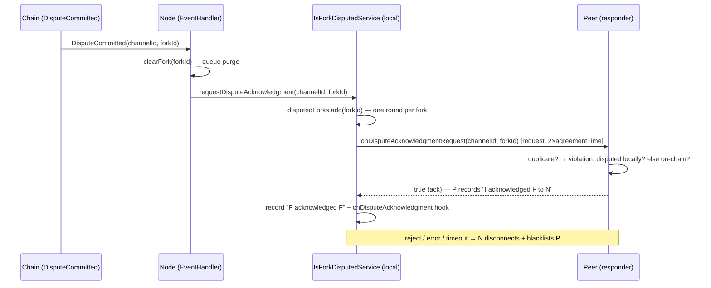

# IsForkDisputedService — Dispute Acknowledgment Round

> **Specification subject:** [specification/architecture/rpc.md](../../../../../specification/peer-communication/rpc.md)

> **Status:** Draft, reverse-engineered baseline. Pending engineer review.
> **Scope:** The `isForkDisputedService` peer-RPC service: the one-round dispute acknowledgment
> protocol run when a dispute window opens on-chain, its acknowledgment bookkeeping, and how the
> recorded acks turn later building on a dead fork into attributable Byzantine behavior. Shared
> RPC mechanics (envelope, guards, correlation, outcome table): [./README.md](./README.md).
> On-chain dispute-window semantics: [../../protocol/disputes.md](../../../../../specification/disputes/disputes.md) §4.
> The off-chain dispute flow around it: [../dispute-pipeline.md](../dispute-pipeline.md).

Implementation:
[`IsForkDisputedService`](../../../../../../../src/rpc/services/isForkDisputedService/IsForkDisputedService.ts#L8),
[`IsForkDisputedRpcMethods`](../../../../../../../src/rpc/services/isForkDisputedService/IsForkDisputedRpcMethods.ts#L6).
Trigger: [`EventHandler.handleDisputeCommitted`](../../../../../../../src/eventHandlers/EventHandler.ts#L300).
Evidence consumer:
[`BlockValidationStrategy.blockForkIsDisputed`](../../../../../../../src/stateManager/validationStrategy/BlockValidationStrategy.ts#L220).

## 1. Purpose & position in the protocol

When a dispute is committed on-chain against fork `F`
([../../protocol/disputes.md](../../../../../specification/disputes/disputes.md) §4.1), every honest node observing the
`DisputeCommitted` event stops treating `F` as live: it clears `F`'s queued blocks and expects
the channel to resume on the reduced successor fork. The remaining ambiguity is _peer knowledge_:
a peer later gossiping a block on `F` might be an honest straggler that has not seen the dispute
yet — or a Byzantine actor deliberately extending a dead fork.

The dispute acknowledgment round removes that ambiguity per peer. On the dispute event, each
node asks every currently connected peer, once per fork, over request/response: _do you
acknowledge that `(channelId, forkId)` is disputed?_ A peer that confirms is **recorded as
knowing**. From then on, a recorded peer that supplies blocks on `F` is treated as knowingly
building on an acknowledged dead fork and is cut
([state-transition.md](./state-transition.md) §4.6 hands off to this evidence chain); an
unrecorded supplier keeps the honest-straggler tolerance (`NOT_READY` restore). A peer that
rejects, errors, or stays silent for the window is disconnected and blacklisted — refusing to
acknowledge an objectively verifiable on-chain fact is itself treated as misbehavior (§4.4
examines how safe that is).

Position in the flow:

The round is **relevance-gated**: it fires only when the disputed fork is the node's current
fork, or the dispute is final and the node has a pending reduction operation for that fork
([`handleDisputeCommitted`](../../../../../../../src/eventHandlers/EventHandler.ts#L300)); late non-final
events for already-resolved forks do not restart it. Dispute-event ordering and
kill/counter-dispute sequencing around this trigger have known lifecycle races —
[`OQ-25-E09XFR`](../../../../open-questions.md#oq-25-e09xfr).

## 2. Owned state

All on the service singleton, keyed by EVM address (deliberately not by transport — state must
survive the WebRTC transport upgrade, [./README.md](./README.md) §6.8):

| Field                                                      | Meaning                                                   | Written by                                       | Read by                                                                                                                                                               |
| ---------------------------------------------------------- | --------------------------------------------------------- | ------------------------------------------------ | --------------------------------------------------------------------------------------------------------------------------------------------------------------------- |
| `disputedForks: Set<ForkId>`                               | Forks for which this node already ran its outgoing round. | `requestDisputeAcknowledgment` (add-only)        | same method (dedup of the whole round)                                                                                                                                |
| `myAcknowledgementsByAddress: Map<address, Set<ForkId>>`   | Forks **I acknowledged to** each peer (responder side).   | `IAcknowledgeDisputedFork` via the handler       | handler duplicate check                                                                                                                                               |
| `peerAcknowledgementsByAddress: Map<address, Set<ForkId>>` | Forks **each peer acknowledged to me** (requester side).  | `peerAcknowledgesDisputedFork` on a `true` reply | [`BlockValidationStrategy.blockForkIsDisputed`](../../../../../../../src/stateManager/validationStrategy/BlockValidationStrategy.ts#L220) — the Byzantine-build check |

**Lifetime and cleanup: none.** All three structures are add-only for the life of the process;
nothing prunes entries on fork resolution, channel close, peer blacklisting, or disposal.
Growth is bounded by the number of _on-chain disputed forks_ a peer can name (each entry
requires a fork that really is disputed somewhere — §4.1), so honest-operation growth is
negligible; the attacker-influenceable corner is the missing channel binding (§4.6). `Current:`
no cleanup. `Intended:` undecided — **Open question:** whether ack state should be pruned once a
fork's successor is finalized on-chain, and whether it must survive longer as evidence input
(divergence class: decision pending).

The recorded double-entry (`my…` on the responder, `peer…` on the requester) is deliberately
asymmetric bookkeeping of the same event: each side records what _it_ can later act on — the
responder to detect duplicate requests, the requester to convict a builder on a dead fork.

## 3. Public method: `onDisputeAcknowledgmentRequest(channelId, forkId)` — responder

Request/response (returns `Promise<boolean>` → `RequestRpcHandler`). Behind
`HandshakeCompletedGuard`. Ordered stages — this service, unlike
[state-transition](./state-transition.md), performs its checks **at the RPC layer**; nothing is
delegated to a downstream pipeline:

1. **Dispatch preconditions** _(dispatcher + guard, [./README.md](./README.md) §6.4/§5)_.
2. **Sender attribution**: `senderTransport.peerAddress`; missing (unreachable behind the
   guard) → disconnect + blacklist of the addressless transport profile + throw (the requester's promise rejects).
3. **Duplicate check** _(replay-rejecting, [`REQ-RPC-6-E60S4J`](../../../../../specification/peer-communication/rpc.md#req-rpc-6-e60s4j) pattern 2)_:
   `didIAcknowledgeDisputedFork(peerAddress, forkId)` — a second request for a fork already
   acknowledged **to this peer** is a protocol violation → disconnect + blacklist by address +
   throw. Note the key is `(peerAddress, forkId)` only; `channelId` does not participate (§4.6).
4. **Dispute verification** — the objective predicate, checked cheap-first:
    1. local mirror: `localDiamondContract.isForkDisputed(channelId, forkId)` (in-process EVM,
       no network);
    2. fallback on miss: `stateChannelManagerContract.isForkDisputed(channelId, forkId)` — a
       **real chain read**, covering the race where the requester saw the `DisputeCommitted`
       event before our mirror processed it.
       Not disputed by either → the claim is false → disconnect + blacklist by address + throw.
5. **Record + ack**: `IAcknowledgeDisputedFork(peerAddress, forkId)` (first-write; the
   internal re-record guard is defensively unreachable here because stage 3 already filtered),
   then return `true`.

No stage validates the _shape_ of `channelId`/`forkId` before they reach the ethers contract
calls: a malformed value throws inside stage 4 and takes the generic request-error path —
connection kept (§4.1, §5).

## 4. Local API: `requestDisputeAcknowledgment(channelId, forkId)` — requester

Not remotely callable (lives on the service, not the RpcMethods class — [`REQ-RPC-1-FF89Z0`](../../../../../specification/peer-communication/rpc.md#req-rpc-1-ff89z0)); invoked by
the dispute event handler. Algorithm:

1. **Round dedup**: `disputedForks.has(forkId)` → return `false` (round already ran; the event
   handler uses this to fire `onDisputeStarted` hooks only once). Add-only set → exactly one
   round per fork per process.
2. **Peer snapshot**: `getConnectedPeers()` (EVM addresses) is captured **at round start**.
   Addresses, not transports, so the WebRTC upgrade cannot orphan the round; snapshot, so peers
   connecting _after_ the round are neither asked nor punished (deliberate — a new peer never
   saw the request).
3. **Fan-out**, detached (`void Promise.all`): per peer, one
   `onDisputeAcknowledgmentRequest(channelId, forkId).request(peerAddress, { timeoutMs: 2 × agreementTime × 1000 })`.
    - reply `true` → `peerAcknowledgesDisputedFork(peer, forkId)` recorded;
      `onDisputeAcknowledgment` hook fires.
    - reply `false`, rejection (guard error, handler throw), transport error, or timeout →
      `disconnectAndBlacklistPeerByEvmAddress(peer)`.
4. Returns `true` (first occurrence) synchronously; outcomes land asynchronously.

Response authenticity rests entirely on the correlation layer: only the addressed peer can
settle the request ([`REQ-RPC-2-SZDTTM`](../../../../../specification/peer-communication/rpc.md#req-rpc-2-szdttm), [./README.md](./README.md) §6.5). The reply payload is untrusted
JSON — the code checks `!acknowledged`, so any truthy junk counts as an ack (accepted residual:
its only effect is the same record a truthful `true` produces).

## 5. The evidence chain: what an ack buys

The point of the bookkeeping is stage-gating the punishment for dead-fork gossip. In
[`BlockValidationStrategy.blockForkIsDisputed`](../../../../../../../src/stateManager/validationStrategy/BlockValidationStrategy.ts#L220):
for a block arriving on a disputed fork, every source peer with a recorded
`didPeerAcknowledgeDisputedFork(peer, forkId)` is disconnected + blacklisted; if **all**
suppliers had acknowledged, the block is judged `DISCONNECT` (nothing honest to wait for),
otherwise it is restored to the queue as `NOT_READY` for the honest stragglers.

**Open question (documentation debt / decision pending):** the model doc calls a recorded ack
the basis for "provably Byzantine" building — but the ack is an **unsigned RPC reply**. It is
binding only inside the requester's own process: it cannot be shown to a third party, cannot
back a fraud proof, and does not survive restart (in-memory). The actual mechanism is _locally
attributable_ misbehavior → local disconnect/blacklist, one tier below the protocol's signed
fraud-proof evidence ([../../protocol/fraud-proofs.md](../../../../../specification/disputes/fraud-proofs.md)).
Whether acknowledgments should be signed statements (making dead-fork building slashable
evidence rather than a local opinion) is an engineer decision; until then the wording
"provable" overstates. (Observed: [`IsForkDisputedRpcMethods`](../../../../../../../src/rpc/services/isForkDisputedService/IsForkDisputedRpcMethods.ts#L6)
returns a bare boolean.)

## 6. Byzantine assessment

Adversary model: any handshake-authenticated identity; additionally, for round-triggering
attacks, an adversary that is dispute-eligible on-chain in _some_ channel
([../../protocol/disputes.md](../../../../../specification/disputes/disputes.md) §4.1 upload rules).

### 6.1 Malformed payloads

`channelId`/`forkId` are spread raw. A value that fails ethers ABI encoding (wrong type, bad
hex) throws inside the stage-4 contract call, **after** the duplicate check but before any
record. The throw takes the generic request path: `{ok: false, error}` to the caller,
**connection kept** ([./README.md](./README.md) §6.4 step 7). Consequence: malformed-payload
probing of this endpoint is penalty-free and infinitely repeatable, while a _well-formed but
false_ claim is an instant blacklist — an inverted severity ordering. This is an instance of
the endpoint-inconsistent failure-outcome policy already tracked in
[`OQ-34-FY08V2`](../../../../../specification/open-questions.md#oq-34-fy08v2) (failure-outcome policy consistency); classified there as
decision pending. **Handled** in the sense that nothing corrupts state (no record is written on
the throw path); **unhandled** as a policy gap.

### 6.2 Flooding

The endpoint's replay-rejection gives it an unusually good structural bound: per connection, an
attacker gets **at most one request per genuinely disputed fork plus one** — the first
non-disputed claim or first duplicate is a blacklist. The residual costs before that cut:

- **Chain-read amplification.** Every request naming a not-yet-acknowledged `(peer, fork)` pair
  costs the responder a local-mirror read and, on miss, **one real chain RPC read** — the
  responder pays an external I/O for a peer-chosen input. A burst of N concurrent requests
  (fired before the first verdict's disconnect lands) schedules N handler tasks and up to N
  chain reads; the disconnect only stops _subsequent_ frames. Bounded per identity, but
  identities are free. No rate limiter exists at this boundary — the missing central RPC
  limiter ([`OQ-6-4JPNE5`](../../../../../specification/open-questions.md#oq-6-4jpne5), [./README.md](./README.md) §9) is the intended fix;
  unlike [state-transition](./state-transition.md) §4.2 this surface is low-volume by protocol
  design, so it rides on the same decision rather than driving it.
- **Malformed-payload spam** (§6.1) is the only penalty-free repeatable shape; its per-frame
  cost is one thrown ABI encode — cheap, but unmetered until [`OQ-6-4JPNE5`](../../../../../specification/open-questions.md#oq-6-4jpne5).

Note the responder-side queue caps of
[../block-confirmation-pipeline.md](../block-confirmation-pipeline.md) §3.1 do not apply here —
this service has no queue; its state growth is bounded by stage 3/4 as above.

### 6.3 Replay / duplicate delivery

### 6.4 Withheld acks — is disconnecting non-ackers abusable to partition honest peers?

The design intent: an honest node can always answer, because the question is an on-chain fact
it can verify via the chain fallback even before its own event processing catches up. Refusal
is therefore treated as Byzantine. The abuse analysis:

- **Can an adversary _cause_ honest peers to withhold?** Not directly — the response requires
  no cooperation from the adversary. The failure modes that convert an honest peer into a
  "non-acker" are environmental: being offline/partitioned for the full `2 × agreementTime`
  window, or its chain provider failing during stage 4 (the handler's chain-read throw becomes
  a request error → the requester blacklists it). Both conflate **unavailability with
  Byzantine behavior** — the same fault-taxonomy violation as [`DEF-5-E8TP9N`](../../../../../audit/open-findings.md#def-5-e8tp9n)
  ([../../open-questions.md](../../../../../specification/open-questions.md)); classified decision pending under the
  [`OQ-34-FY08V2`](../../../../../specification/open-questions.md#oq-34-fy08v2) failure-outcome policy.
- **Can an adversary _time_ the round to hit a known-offline victim?** Partially. Round timing
  is controlled by whoever uploads a dispute, and any dispute-eligible participant can open one
  (throttled to one per `evidenceTime` per channel, [`REQ-DIS-2-PKVZ7E`](../../../../../specification/disputes/disputes.md#req-dis-2-pkvz7e) —
  [../../protocol/disputes.md](../../../../../specification/disputes/disputes.md) §4.1). An adversarial participant
  who observes a victim's transient outage can upload a (even honest-content) dispute then,
  causing **every** peer to blacklist the victim when its window lapses. The blacklist is
  profile-based and in-memory: the victim is locked out of the mesh for the survivors' process
  lifetimes and must fall back to chain-derived recovery (dispute/reduction data is on-chain,
  so _safety_ is unaffected; the victim loses gossip liveness). **Open question:** whether a
  missed acknowledgment window should be a soft consequence (disconnect without durable
  blacklist, allowing re-handshake + late acknowledgment) instead of a permanent in-session
  ban — the partition cost falls on honest-but-offline peers while a real Byzantine peer loses
  nothing it needed (divergence class: decision pending).
- **Symmetric griefing:** the requester needs no evidence to blacklist (its own timeout
  suffices), but this is purely local state — a Byzantine requester "blacklisting" honest
  peers only isolates itself. Not a vector.

### 6.5 False dispute claims and ack forgery

- **False claim** (`forkId` not disputed anywhere): stage 4 disproves it against the chain →
  disconnect + blacklist the claimant. **Handled**; evidence: E2E-IsForkDisputed
  ("non-disputed fork" case).
- **Ack forgery** (settling someone else's pending request): impossible below the handler —
  only the addressed peer settles a request; a response from any other peer blacklists the
  responder ([`REQ-RPC-2-SZDTTM`](../../../../../specification/peer-communication/rpc.md#req-rpc-2-szdttm), [./README.md](./README.md) §6.5). **Handled.**
- **Forged ack content**: any truthy reply records an ack — but only _against the responder
  itself_, which is exactly what a truthful ack does. No third-party attribution exists to
  corrupt (§5). **Accepted residual.**
- **Replaying acks across forks**: an ack is not a portable object — it exists only as the
  settlement of one correlated request for one `(channelId, forkId)`, and the requester records
  it under the `forkId` _it asked about_, not anything the responder sent. Cross-fork replay
  has no carrier. **Handled by construction.**

### 6.6 Wrong-channel / wrong-fork traffic — the missing channel binding

**Defect candidate (classified: bug; engineer confirmation needed).** The handler never checks
`channelId` against `stateManager.channelId`, and both dispute-verification reads pass the
peer-chosen pair straight through — the chain fallback queries the **shared**
`StateChannelManager` contract, which answers for _any_ channel. Verified consequences:

1. **Cross-channel oracle + ack pollution.** An attacker who opens its own throwaway channel
   `C2` and legitimately disputes fork `F2` there can ask a victim to acknowledge `(C2, F2)`;
   the victim's chain fallback finds it disputed and the victim **acks and records** `F2` into
   `myAcknowledgementsByAddress` — state about a channel it does not participate in. Each such
   entry costs the attacker real on-chain dispute work (upload + throttle), so growth is
   expensive but attacker-driven and never cleaned (§2).
2. **Duplicate key ignores channel.** Stage 3 keys on `(peerAddress, forkId)` alone, which is
   consistent with (1) only by accident. Fork IDs are hashes of genesis snapshot data, so
   cross-channel forkId collision is negligible in practice — the check's _effect_ is correct,
   but its correctness rests on hash uniqueness rather than an explicit binding.
3. The symmetric requester-side record (`peerAcknowledgementsByAddress`) is keyed by fork only
   as well; its consumer (`blockForkIsDisputed`) also matches on fork only. Same
   hash-uniqueness argument.

Proposed direction: require `channelId == stateManager.channelId` before stage 4 (violation →
same disconnect+blacklist as a false claim). **Open question:** confirm the check and whether
rejecting foreign-channel queries breaks any intended multi-channel future.

## 7. Failure outcomes

Against the model doc's table ([./README.md](./README.md) §8):

| Failure                                                           | Consequence                                                | Model-doc row                                       | Match                                                                                                                                                                                                                                                     |
| ----------------------------------------------------------------- | ---------------------------------------------------------- | --------------------------------------------------- | --------------------------------------------------------------------------------------------------------------------------------------------------------------------------------------------------------------------------------------------------------- |
| Duplicate ack request (responder)                                 | Disconnect + blacklist + request error                     | "Fork-not-disputed / duplicate dispute-ack request" | yes                                                                                                                                                                                                                                                       |
| Fork not disputed (responder)                                     | Disconnect + blacklist + request error                     | same row                                            | yes                                                                                                                                                                                                                                                       |
| Missing `peerAddress` (responder)                                 | Disconnect + addressless-profile blacklist + request error | service bullet §7                                   | yes                                                                                                                                                                                                                                                       |
| **Malformed `channelId`/`forkId` / responder chain-read failure** | Request error only, **connection kept**                    | falls under generic "Request handler throws"        | **flag: the per-service row reads as if every responder failure blacklists; this path does not (§6.1) — and on the requester side the same error _does_ blacklist the responder (row below), so one fault produces asymmetric penalties on the two ends** |
| Peer replies `false` / rejects / errors / times out (requester)   | Disconnect + blacklist by address                          | "Dispute-ack rejection/error/timeout (outgoing)"    | yes                                                                                                                                                                                                                                                       |
| Response from non-addressed peer                                  | Disconnect + blacklist responder                           | correlation row                                     | yes (inherited)                                                                                                                                                                                                                                           |

## 8. Assumptions, constraints & dependencies

- The dispute predicate is objective and chain-verifiable at all times: the single-RPC-provider
  trust assumption ([../architecture.md](../architecture.md) §3) extends to stage 4's fallback
  read — a lying provider can make an honest node reject true claims (and get blacklisted by
  peers, §6.4) or ack false ones.
- Timeout denominated in `agreementTime` ([../../protocol/time.md](../../../../../specification/protocol-model/time.md));
  the ack window `2 × agreementTime` must exceed honest event-propagation + chain-read latency,
  or §6.4's conflation bites in normal operation.
- Peer identity/blacklist state per `ProfileManager`; ack state deliberately address-keyed to
  survive transport churn ([./README.md](./README.md) §6.8).
- The round trigger depends on dispute-event delivery and ordering
  ([`OQ-25-E09XFR`](../../../../open-questions.md#oq-25-e09xfr), [`OQ-30-2G0Q5M`](../../../../open-questions.md#oq-30-2g0q5m)); a node that never
  observes `DisputeCommitted` never asks — its protection then degrades to the disputed-fork
  intake gate alone.

## 9. Invariants

| ID                                              | Invariant                                                                                                                                                                                                     |
| ----------------------------------------------- | ------------------------------------------------------------------------------------------------------------------------------------------------------------------------------------------------------------- |
| `INV-IFD-1-HBJR2P` | Per direction and per `(peerAddress, forkId)`, at most one acknowledgment is ever recorded; a second incoming request for a recorded pair is a violation with a defined consequence (disconnect + blacklist). |
| `INV-IFD-2-6N9G29` | A `true` acknowledgment is returned only after the fork was verified disputed against the local mirror or the chain; the record is written before the reply is sent.                                          |
| `INV-IFD-3-DZ83BB` | The outgoing round runs at most once per fork per process, against the peer set snapshot taken at round start; peers connecting later are neither asked nor punished for that fork.                           |
| `INV-IFD-4-5J5W3T` | Acknowledgment state is keyed by EVM address, never by transport, and survives transport replacement.                                                                                                         |

## 10. Verification

Concrete test evidence is owned by the downstream verification layer. This section defines implementation-specific obligations only.

### Implementation test plan

These are concrete component-level tests required by the implementation obligations in this document. Exercise public boundaries with real domain values and collaborators. Every listed permutation is required unless an engineer records why it is not applicable.

| Plan item                                             | Requirement / invariant                                    | Setup and stimulus                                                                                                      | Expected result                                                                                                                                                                           | Required permutations                                                                                                                                                                                                                                                                                                                                                                                                                                                                                                                                                                                                                                                                                                                                                                                                                                                                                                                                                                                                                                                                                                                                                                                                                                                                                                                                                                                                                                                                                                                                                                                                                                                                                                                                                                                                                                                                                                                                                                                                                                                                                                                                                                                                                                                                      |
| ----------------------------------------------------- | ---------------------------------------------------------- | ----------------------------------------------------------------------------------------------------------------------- | ----------------------------------------------------------------------------------------------------------------------------------------------------------------------------------------- | ------------------------------------------------------------------------------------------------------------------------------------------------------------------------------------------------------------------------------------------------------------------------------------------------------------------------------------------------------------------------------------------------------------------------------------------------------------------------------------------------------------------------------------------------------------------------------------------------------------------------------------------------------------------------------------------------------------------------------------------------------------------------------------------------------------------------------------------------------------------------------------------------------------------------------------------------------------------------------------------------------------------------------------------------------------------------------------------------------------------------------------------------------------------------------------------------------------------------------------------------------------------------------------------------------------------------------------------------------------------------------------------------------------------------------------------------------------------------------------------------------------------------------------------------------------------------------------------------------------------------------------------------------------------------------------------------------------------------------------------------------------------------------------------------------------------------------------------------------------------------------------------------------------------------------------------------------------------------------------------------------------------------------------------------------------------------------------------------------------------------------------------------------------------------------------------------------------------------------------------------------------------------------------------ |
| `REQ-IFD-1-X2VCJW.T1` | `REQ-IFD-1-X2VCJW`            | Exercise the real public component or contract boundary, including rejection and failure paths without partial effects. | On a relevant `DisputeCommitted` event, the node requests acknowledgment from every connected peer exactly once per fork, with a `2 × agreementTime` reply window.                        | `REQ-IFD-1-X2VCJW.T1.P1` — valid case `REQ-IFD-1-X2VCJW.T1.P2` — matching commitment `REQ-IFD-1-X2VCJW.T1.P3` — correct identity/signature `REQ-IFD-1-X2VCJW.T1.P4` — before deadline `REQ-IFD-1-X2VCJW.T1.P5` — duplicate delivery `REQ-IFD-1-X2VCJW.T1.P6` — malformed input `REQ-IFD-1-X2VCJW.T1.P7` — direct invalid/opposite `REQ-IFD-1-X2VCJW.T1.P8` — mismatched commitment `REQ-IFD-1-X2VCJW.T1.P9` — predecessor case `REQ-IFD-1-X2VCJW.T1.P10` — genesis case `REQ-IFD-1-X2VCJW.T1.P11` — stale fork `REQ-IFD-1-X2VCJW.T1.P12` — foreign fork `REQ-IFD-1-X2VCJW.T1.P13` — wrong identity/signature `REQ-IFD-1-X2VCJW.T1.P14` — missing identity/signature `REQ-IFD-1-X2VCJW.T1.P15` — duplicate identity/signature `REQ-IFD-1-X2VCJW.T1.P16` — forged identity/signature `REQ-IFD-1-X2VCJW.T1.P17` — membership boundary `REQ-IFD-1-X2VCJW.T1.P18` — at deadline `REQ-IFD-1-X2VCJW.T1.P19` — after deadline `REQ-IFD-1-X2VCJW.T1.P20` — maximum honest skew `REQ-IFD-1-X2VCJW.T1.P21` — replay `REQ-IFD-1-X2VCJW.T1.P22` — reordered delivery `REQ-IFD-1-X2VCJW.T1.P23` — concurrent delivery `REQ-IFD-1-X2VCJW.T1.P24` — adversarial input `REQ-IFD-1-X2VCJW.T1.P25` — partial failure `REQ-IFD-1-X2VCJW.T1.P26` — retry and recovery |
| `REQ-IFD-2-13862Z.T1` | `REQ-IFD-2-13862Z`            | Exercise the real public component or contract boundary, including rejection and failure paths without partial effects. | A responder acknowledges only a fork verified disputed (local mirror, then chain); a false claim, duplicate request, or missing sender identity disconnects and blacklists the requester. | `REQ-IFD-2-13862Z.T1.P1` — valid case `REQ-IFD-2-13862Z.T1.P2` — matching commitment `REQ-IFD-2-13862Z.T1.P3` — correct identity/signature `REQ-IFD-2-13862Z.T1.P4` — duplicate delivery `REQ-IFD-2-13862Z.T1.P5` — malformed input `REQ-IFD-2-13862Z.T1.P6` — direct invalid/opposite `REQ-IFD-2-13862Z.T1.P7` — mismatched commitment `REQ-IFD-2-13862Z.T1.P8` — predecessor case `REQ-IFD-2-13862Z.T1.P9` — genesis case `REQ-IFD-2-13862Z.T1.P10` — stale fork `REQ-IFD-2-13862Z.T1.P11` — foreign fork `REQ-IFD-2-13862Z.T1.P12` — wrong identity/signature `REQ-IFD-2-13862Z.T1.P13` — missing identity/signature `REQ-IFD-2-13862Z.T1.P14` — duplicate identity/signature `REQ-IFD-2-13862Z.T1.P15` — forged identity/signature `REQ-IFD-2-13862Z.T1.P16` — membership boundary `REQ-IFD-2-13862Z.T1.P17` — replay `REQ-IFD-2-13862Z.T1.P18` — reordered delivery `REQ-IFD-2-13862Z.T1.P19` — concurrent delivery `REQ-IFD-2-13862Z.T1.P20` — adversarial input `REQ-IFD-2-13862Z.T1.P21` — partial failure `REQ-IFD-2-13862Z.T1.P22` — retry and recovery                                                                                                                                                                                                                                                                                                                                            |
| `REQ-IFD-3-QXNCN9.T1` | `REQ-IFD-3-QXNCN9`            | Exercise the real public component or contract boundary, including rejection and failure paths without partial effects. | A peer that rejects, errors, replies `false`, or exceeds the window is disconnected and blacklisted by the requester.                                                                     | `REQ-IFD-3-QXNCN9.T1.P1` — valid case `REQ-IFD-3-QXNCN9.T1.P2` — correct identity/signature `REQ-IFD-3-QXNCN9.T1.P3` — before deadline `REQ-IFD-3-QXNCN9.T1.P4` — malformed input `REQ-IFD-3-QXNCN9.T1.P5` — direct invalid/opposite `REQ-IFD-3-QXNCN9.T1.P6` — wrong identity/signature `REQ-IFD-3-QXNCN9.T1.P7` — missing identity/signature `REQ-IFD-3-QXNCN9.T1.P8` — duplicate identity/signature `REQ-IFD-3-QXNCN9.T1.P9` — forged identity/signature `REQ-IFD-3-QXNCN9.T1.P10` — membership boundary `REQ-IFD-3-QXNCN9.T1.P11` — at deadline `REQ-IFD-3-QXNCN9.T1.P12` — after deadline `REQ-IFD-3-QXNCN9.T1.P13` — maximum honest skew `REQ-IFD-3-QXNCN9.T1.P14` — adversarial input `REQ-IFD-3-QXNCN9.T1.P15` — partial failure `REQ-IFD-3-QXNCN9.T1.P16` — retry and recovery                                                                                                                                                                                                                                                                                                                                                                                                                                                                                                                                                                                                                                                                                                                                                                                                                                                                |
| `REQ-IFD-4-26FWYZ.T1` | `REQ-IFD-4-26FWYZ`            | Exercise the real public component or contract boundary, including rejection and failure paths without partial effects. | Recorded peer acknowledgments gate the dead-fork punishment: acknowledged suppliers of disputed-fork blocks are cut; unacknowledged suppliers retain straggler tolerance.                 | `REQ-IFD-4-26FWYZ.T1.P1` — valid case `REQ-IFD-4-26FWYZ.T1.P2` — matching commitment `REQ-IFD-4-26FWYZ.T1.P3` — correct identity/signature `REQ-IFD-4-26FWYZ.T1.P4` — malformed input `REQ-IFD-4-26FWYZ.T1.P5` — direct invalid/opposite `REQ-IFD-4-26FWYZ.T1.P6` — mismatched commitment `REQ-IFD-4-26FWYZ.T1.P7` — predecessor case `REQ-IFD-4-26FWYZ.T1.P8` — genesis case `REQ-IFD-4-26FWYZ.T1.P9` — stale fork `REQ-IFD-4-26FWYZ.T1.P10` — foreign fork `REQ-IFD-4-26FWYZ.T1.P11` — wrong identity/signature `REQ-IFD-4-26FWYZ.T1.P12` — missing identity/signature `REQ-IFD-4-26FWYZ.T1.P13` — duplicate identity/signature `REQ-IFD-4-26FWYZ.T1.P14` — forged identity/signature `REQ-IFD-4-26FWYZ.T1.P15` — membership boundary `REQ-IFD-4-26FWYZ.T1.P16` — adversarial input `REQ-IFD-4-26FWYZ.T1.P17` — partial failure `REQ-IFD-4-26FWYZ.T1.P18` — retry and recovery                                                                                                                                                                                                                                                                                                                                                                                                                                                                                                                                                                                                                                                                                         |
| `INV-IFD-1-HBJR2P.T1` | [`INV-IFD-1-HBJR2P`](is-fork-disputed.md#inv-ifd-1-hbjr2p) | Exercise the real public component or contract boundary, including rejection and failure paths without partial effects. | One recorded ack per direction per `(peer, fork)`; replays are violations.                                                                                                                | `INV-IFD-1-HBJR2P.T1.P1` — valid case `INV-IFD-1-HBJR2P.T1.P2` — matching commitment `INV-IFD-1-HBJR2P.T1.P3` — correct identity/signature `INV-IFD-1-HBJR2P.T1.P4` — duplicate delivery `INV-IFD-1-HBJR2P.T1.P5` — direct invalid/opposite `INV-IFD-1-HBJR2P.T1.P6` — mismatched commitment `INV-IFD-1-HBJR2P.T1.P7` — predecessor case `INV-IFD-1-HBJR2P.T1.P8` — genesis case `INV-IFD-1-HBJR2P.T1.P9` — stale fork `INV-IFD-1-HBJR2P.T1.P10` — foreign fork `INV-IFD-1-HBJR2P.T1.P11` — wrong identity/signature `INV-IFD-1-HBJR2P.T1.P12` — missing identity/signature `INV-IFD-1-HBJR2P.T1.P13` — duplicate identity/signature `INV-IFD-1-HBJR2P.T1.P14` — forged identity/signature `INV-IFD-1-HBJR2P.T1.P15` — membership boundary `INV-IFD-1-HBJR2P.T1.P16` — replay `INV-IFD-1-HBJR2P.T1.P17` — reordered delivery `INV-IFD-1-HBJR2P.T1.P18` — concurrent delivery                                                                                                                                                                                                                                                                                                                                                                                                                                                                                                                                                                                                                                                                                             |
| `INV-IFD-2-6N9G29.T1` | [`INV-IFD-2-6N9G29`](is-fork-disputed.md#inv-ifd-2-6n9g29) | Exercise the real public component or contract boundary, including rejection and failure paths without partial effects. | Verify-then-record-then-reply ordering on the responder.                                                                                                                                  | `INV-IFD-2-6N9G29.T1.P1` — valid case `INV-IFD-2-6N9G29.T1.P2` — duplicate delivery `INV-IFD-2-6N9G29.T1.P3` — direct invalid/opposite `INV-IFD-2-6N9G29.T1.P4` — replay `INV-IFD-2-6N9G29.T1.P5` — reordered delivery `INV-IFD-2-6N9G29.T1.P6` — concurrent delivery                                                                                                                                                                                                                                                                                                                                                                                                                                                                                                                                                                                                                                                                                                                                                                                                                                                                                                                                                                                                                                                                                                                                                                                                                                                                                                                                                                                                                                                                                                                                                                                                                                                                                                                                                                                     |
| `INV-IFD-3-DZ83BB.T1` | [`INV-IFD-3-DZ83BB`](is-fork-disputed.md#inv-ifd-3-dz83bb) | Exercise the real public component or contract boundary, including rejection and failure paths without partial effects. | One outgoing round per fork; snapshot peer set.                                                                                                                                           | `INV-IFD-3-DZ83BB.T1.P1` — valid case `INV-IFD-3-DZ83BB.T1.P2` — matching commitment `INV-IFD-3-DZ83BB.T1.P3` — correct identity/signature `INV-IFD-3-DZ83BB.T1.P4` — direct invalid/opposite `INV-IFD-3-DZ83BB.T1.P5` — mismatched commitment `INV-IFD-3-DZ83BB.T1.P6` — predecessor case `INV-IFD-3-DZ83BB.T1.P7` — genesis case `INV-IFD-3-DZ83BB.T1.P8` — stale fork `INV-IFD-3-DZ83BB.T1.P9` — foreign fork `INV-IFD-3-DZ83BB.T1.P10` — wrong identity/signature `INV-IFD-3-DZ83BB.T1.P11` — missing identity/signature `INV-IFD-3-DZ83BB.T1.P12` — duplicate identity/signature `INV-IFD-3-DZ83BB.T1.P13` — forged identity/signature `INV-IFD-3-DZ83BB.T1.P14` — membership boundary                                                                                                                                                                                                                                                                                                                                                                                                                                                                                                                                                                                                                                                                                                                                                                                                                                                                                                                                                                                                                                          |
| `INV-IFD-4-5J5W3T.T1` | [`INV-IFD-4-5J5W3T`](is-fork-disputed.md#inv-ifd-4-5j5w3t) | Exercise the real public component or contract boundary, including rejection and failure paths without partial effects. | Address-keyed ack state survives transport churn.                                                                                                                                         | `INV-IFD-4-5J5W3T.T1.P1` — valid case `INV-IFD-4-5J5W3T.T1.P2` — zero/empty/no-op where meaningful `INV-IFD-4-5J5W3T.T1.P3` — direct invalid/opposite `INV-IFD-4-5J5W3T.T1.P4` — exact boundary `INV-IFD-4-5J5W3T.T1.P5` — failure/recovery `INV-IFD-4-5J5W3T.T1.P6` — relevant race                                                                                                                                                                                                                                                                                                                                                                                                                                                                                                                                                                                                                                                                                                                                                                                                                                                                                                                                                                                                                                                                                                                                                                                                                                                                                                                                                                                                                                                                                                                                                                                                                                                                                                                                                                      |

## Future Work

_Non-normative._

- Signed acknowledgments, upgrading the recorded ack from local opinion to portable evidence
  (§5) — would connect dead-fork building to the fraud-proof layer.
- Channel binding on the request (§6.6) and an explicit `(channelId, forkId)` record key.
- Soft consequence for missed ack windows (re-handshake + late ack) instead of in-session
  permanent blacklist (§6.4), aligned with the [`OQ-34-FY08V2`](../../../../../specification/open-questions.md#oq-34-fy08v2) failure-outcome policy decision.
- Ack-state pruning once a fork's successor finalizes (§2).
- Rate/burst metering under the central limiter ([`OQ-6-4JPNE5`](../../../../../specification/open-questions.md#oq-6-4jpne5)), including a
  cost weight for the chain-read fallback (§6.2).

## Implementation traceability

| Requirement / invariant                                    | Statement                                                                                                                                                                                 | Implementation status | Implementation evidence                                                                                                                                                                                                                                                               | Gap / divergence |
| ---------------------------------------------------------- | ----------------------------------------------------------------------------------------------------------------------------------------------------------------------------------------- | --------------------- | ------------------------------------------------------------------------------------------------------------------------------------------------------------------------------------------------------------------------------------------------------------------------------------- | ---------------- |
| [`REQ-IFD-1-X2VCJW`](is-fork-disputed.md#req-ifd-1-x2vcjw) | On a relevant `DisputeCommitted` event, the node requests acknowledgment from every connected peer exactly once per fork, with a `2 × agreementTime` reply window.                        | Covered               | [src/eventHandlers/EventHandler.ts](../../../../../../../src/eventHandlers/EventHandler.ts#L1) (`handleDisputeCommitted`), [src/rpc/services/isForkDisputedService/IsForkDisputedService.ts](../../../../../../../src/rpc/services/isForkDisputedService/IsForkDisputedService.ts#L1) | None.            |
| [`REQ-IFD-2-13862Z`](is-fork-disputed.md#req-ifd-2-13862z) | A responder acknowledges only a fork verified disputed (local mirror, then chain); a false claim, duplicate request, or missing sender identity disconnects and blacklists the requester. | Covered               | [src/rpc/services/isForkDisputedService/IsForkDisputedRpcMethods.ts](../../../../../../../src/rpc/services/isForkDisputedService/IsForkDisputedRpcMethods.ts#L1)                                                                                                                      | None.            |
| [`REQ-IFD-3-QXNCN9`](is-fork-disputed.md#req-ifd-3-qxncn9) | A peer that rejects, errors, replies `false`, or exceeds the window is disconnected and blacklisted by the requester.                                                                     | Covered               | [src/rpc/services/isForkDisputedService/IsForkDisputedService.ts](../../../../../../../src/rpc/services/isForkDisputedService/IsForkDisputedService.ts#L1) (`requestDisputeAcknowledgment`)                                                                                           | None.            |
| [`REQ-IFD-4-26FWYZ`](is-fork-disputed.md#req-ifd-4-26fwyz) | Recorded peer acknowledgments gate the dead-fork punishment: acknowledged suppliers of disputed-fork blocks are cut; unacknowledged suppliers retain straggler tolerance.                 | Covered               | [src/stateManager/validationStrategy/BlockValidationStrategy.ts](../../../../../../../src/stateManager/validationStrategy/BlockValidationStrategy.ts#L1) (`blockForkIsDisputed`)                                                                                                      | None.            |
| [`INV-IFD-1-HBJR2P`](is-fork-disputed.md#inv-ifd-1-hbjr2p) | One recorded ack per direction per `(peer, fork)`; replays are violations.                                                                                                                | Covered               | [src/rpc/services/isForkDisputedService](../../../../../../../src/rpc/services/isForkDisputedService)                                                                                                                                                                                 | None.            |
| [`INV-IFD-2-6N9G29`](is-fork-disputed.md#inv-ifd-2-6n9g29) | Verify-then-record-then-reply ordering on the responder.                                                                                                                                  | Covered               | [src/rpc/services/isForkDisputedService/IsForkDisputedRpcMethods.ts](../../../../../../../src/rpc/services/isForkDisputedService/IsForkDisputedRpcMethods.ts#L1)                                                                                                                      | None.            |
| [`INV-IFD-3-DZ83BB`](is-fork-disputed.md#inv-ifd-3-dz83bb) | One outgoing round per fork; snapshot peer set.                                                                                                                                           | Covered               | [src/rpc/services/isForkDisputedService/IsForkDisputedService.ts](../../../../../../../src/rpc/services/isForkDisputedService/IsForkDisputedService.ts#L1)                                                                                                                            | None.            |
| [`INV-IFD-4-5J5W3T`](is-fork-disputed.md#inv-ifd-4-5j5w3t) | Address-keyed ack state survives transport churn.                                                                                                                                         | Covered               | [src/rpc/services/isForkDisputedService/IsForkDisputedService.ts](../../../../../../../src/rpc/services/isForkDisputedService/IsForkDisputedService.ts#L1)                                                                                                                            | None.            |
