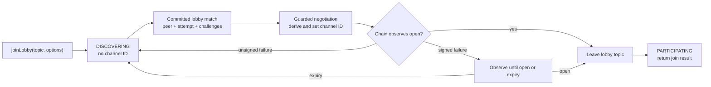

# Lobby-to-Channel Negotiation

> **Status:** Authored — engineer verification pending.
> **Specifications:** [lobby matching](../../../../../specification/peer-communication/lobby-matching.md), [channel negotiation](../../../../../specification/peer-communication/channel-negotiation.md)

## Purpose

The public `joinLobby(lobbyTopic, options)` operation is one host-owned workflow. The client sends a
serializable 32-byte topic and opening options. The runtime host joins the rendezvous, authenticates
peers, selects one exclusive pair, negotiates the opening, observes the chain, leaves the topic, and
returns the opened channel ID and peer address. Internal matching transcripts, transports, profiles,
timers, and service references never cross the runtime port.

Lobby matching and open-channel negotiation have separate ownership:

- `LobbyMatchingService` owns topic admission, its session-local authenticated transports,
  availability, roles, selection, reservation, commitment, matching cancellation, optional match
  timeout, selected-only promotion, and complete lobby cleanup.
- `OpenChannelNegotiationService` owns the committed attempt, term exchange, channel-ID derivation,
  proposal validation, signatures, deterministic submission, and chain-or-expiry observation.
- `LocalP2pSigner` composes both services into the public host workflow. It retries an unsigned failed
  attempt by freshly rejoining the same topic after the old session closes, and returns only after
  opening, matching cancellation, or disposal.

## Lifecycle

`DISCOVERING` always has no selected channel ID. Authenticated lobby transports stay outside ordinary
connection tracking and broadcasts. Commitment stops availability and matching, closes every
non-selected lobby transport, promotes only the selected profile, and keeps the caller topic joined.
Negotiation sets the channel ID only after it validates the committed
transcript and exchanged terms. A successful opening leaves the topic before returning the result.
Matching is indefinite unless the caller supplies a finite timeout. `leaveLobby` returns true only
before commitment; after handoff it returns false and cannot cancel negotiation. Direct
`connectToChannel(channelId)` stays separate and rejects while a lobby is active.

## Matching handoff

Availability is the only one-way lobby message. Pick and commit use correlated request-response.
Commitment binds one peer pair, one attempt nonce, and both fresh challenges; it contains no channel
ID. The host passes this transcript directly into negotiation. There is no client-side call chaining
and no runtime-port message that carries a live match object back into the host.

Role epochs remain monotonic across fresh same-topic retries. Before retry, the unsigned attempt releases
its selected transport, leaves discovery, and clears every candidate and reservation. A selector holds one outgoing request, and an
advertiser holds one reservation. Once a peer stops matching, a later correlated pick for the active
topic returns `rejected`; silence is reserved for an unreachable peer and is the only outcome that
triggers timeout punishment.

## Negotiation and identity

Both peers derive the same nonzero ID from a domain-separated hash of canonical addresses and the
challenges owned by those addresses. No remote-supplied channel ID is accepted. The lower canonical
address initiates, builds, and first-signs the proposal. The higher address reconstructs the expected
opening from local state, signs only an exact match, and directly submits that exact payload with both
signatures. There is no submission-acknowledgement RPC; both sides wait for chain observation.

The negotiation guard is installed at RPC startup. It may queue a correctly authenticated early
request for at most two agreement windows while the local host records the already committed attempt.
It does not run a second selection phase.

Channel-open observation reuses the runtime's existing chain-event pipeline. `StateChannelEventListener`
owns the ethers provider filter, `EventSyncService` owns replay, deduplication, and ordering, and
`EventHandler` updates the mirror and runtime state. Only after that handler completes does the runtime
publish a typed internal event to the active negotiation attempt. Negotiation therefore does not add
another ethers listener with separate filter lifetime, replay, ordering, or cleanup races. Its internal
subscription is attempt-scoped and is removed on failure cleanup or successful opening.

## Failure ownership

- Busy and rejected candidates are retried without punishment.
- Pick or commit silence blacklists the silent peer and releases the lease.
- Final profile loss before signing is neutral; a healthy transport replacement keeps the attempt.
- Wrong peer, attempt, transcript, malformed input, guard expiry, and unsigned protocol failure clear
  the attempt, blacklist where required, and return the host workflow to matching.
- After a local opening signature exists, abandonment blacklists immediately but retains the attempt
  and selected ID until the chain opens or the payload expires.
- An already-open derived ID is a failed new attempt, never false success.

## Verification boundary

The focused component tests exercise exclusive matching, late-pick rejection, monotonic retry epochs,
role-timer leases, deferred admission, derived-ID equality, proposal validation, deterministic
submission, signed-attempt retention, and cleanup. Worker-host E2E tests call only the public signer
operation and cover topic isolation, multi-peer convergence without honest-peer blacklists, timeout
recovery, final profile loss, transport upgrade, channel opening, and automatic topic leave.
