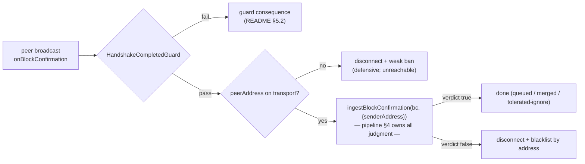

# StateTransitionService — Block-Confirmation Gossip Ingress

> **Specification subject:** [specification/architecture/rpc.md](../../../../../specification/peer-communication/rpc.md)

> **Status:** Draft, reverse-engineered baseline. Pending engineer review.
> **Scope:** The `stateTransitionService` peer-RPC service: the happy-path gossip channel for
> block confirmations and the **sole peer entry point** into the block-confirmation pipeline.
> This document owns the ingress contract — what the RPC layer itself checks, attributes, and
> punishes. Everything downstream of `ingestBlockConfirmation` (authentication, dedup, queueing,
> validation, execution) is owned by
> [../block-confirmation-pipeline.md](../block-confirmation-pipeline.md) and is referenced, not
> restated. Shared RPC mechanics (envelope, guards, delivery modes, outcome table): [./README.md](./README.md).

Implementation:
[`StateTransitionService`](../../../../../../../src/rpc/services/stateTransition/StateTransitionService.ts#L7),
[`StateTransitionRpcMethods`](../../../../../../../src/rpc/services/stateTransition/StateTransitionRpcMethods.ts#L6).
Primary consumer: [`BlockQueueManager.ingestBlockConfirmation`](../../../../../../../src/stateManager/BlockQueueManager.ts#L56)
via [`StateManager.ingestBlockConfirmation`](../../../../../../../src/stateManager/StateManager.ts#L720).

## 1. Purpose & position in the protocol

Block confirmations (`BlockConfirmationStruct` = signed block + confirmation signatures) spread
between peers by gossip: every node that authors, counter-signs, or learns new signatures for a
block re-broadcasts the updated confirmation to every open connection. `stateTransitionService`
is the receiving end of that gossip — the single method `onBlockConfirmation` is how a
confirmation sent by a peer enters the local node
([../block-confirmation-pipeline.md](../block-confirmation-pipeline.md) §2, input path 1).

Position in the flow:

- **Sending side** (local, typed proxy — never through this service's handler): the success path
  gossips after persistence
  ([`StateManager.success`](../../../../../../../src/stateManager/StateManager.ts#L918) step 7, only when
  `PARTICIPATING` and not dispute replay), the stored-merge path re-broadcasts grown signature
  sets ([`tryMergeStoredBlockConfirmation`](../../../../../../../src/stateManager/StateManager.ts#L769) →
  `BROADCAST`), and the strategies re-broadcast on `goodNewSignaturesOnExistingBlock`
  ([`BlockValidationStrategy`](../../../../../../../src/stateManager/validationStrategy/BlockValidationStrategy.ts#L22)).
  All use `.broadcast()` — fire-and-forget to every open connection, no delivery receipt.
- **Receiving side**: this service. It performs _no protocol validation of the payload itself_;
  it is deliberately a thin attribution-and-penalty shim in front of the pipeline. The
  contract split is: **the RPC layer owns caller admission (guard), sender attribution, and the
  verdict-to-penalty mapping; the pipeline owns every judgment about the bytes.**

This is the highest-volume ingress surface of the node: during normal operation every block
produces at least one broadcast per participant (author gossip + counter-signature re-gossip),
and it is the surface a flooding adversary targets (§4.2).

## 2. Owned state

The service owns **no state**. `StateTransitionService` holds only its guard array
(`[HandshakeCompletedGuard]`) and the logger; `StateTransitionRpcMethods` instances are created
per dispatched frame and hold only `senderTransport` ([./README.md](./README.md) §2.1, §6.8).

All state a frame touches lives downstream and is specified there:

| State                                                              | Owner                                                                  | Written by                     | Spec                                                                            |
| ------------------------------------------------------------------ | ---------------------------------------------------------------------- | ------------------------------ | ------------------------------------------------------------------------------- |
| Queued entries, signature sets, source attribution, 128-source cap | [`QueueStorage`](../../../../../../../src/storage/QueueStorage.ts#L26) | pipeline intake                | [../block-confirmation-pipeline.md](../block-confirmation-pipeline.md) §3.1, §4 |
| Stored blocks / merged signatures                                  | [`BlockStorage`](../../../../../../../src/storage/BlockStorage.ts#L16) | pipeline merge/success         | ibid. §4.1, §8                                                                  |
| Peer profiles, blacklist                                           | [`ProfileManager`](../../../../../../../src/ProfileManager.ts#L7)      | this service's penalty mapping | [./README.md](./README.md) §8                                                   |

Statelessness is load-bearing: the handler runs without the `StateManager` mutex
([./README.md](./README.md) §6.6, [`INV-RPC-5-BCEZVC`](README.md#inv-rpc-5-bcezvc)) and can be dispatched concurrently for many frames;
all merge atomicity is the queue's responsibility ([`REQ-BCP-3-1GCEH9`](../block-confirmation-pipeline.md#req-bcp-3-1gceh9)).

## 3. Public method: `onBlockConfirmation(blockConfirmation)`

Fire-and-forget (declared `Promise<void>` → `FireAndForgetRpcHandler`; peers deliver it with
`.broadcast()`). One method — the service's whole remote surface.

Ordered stages, with the RPC-layer / pipeline split marked:

1. **Dispatch preconditions** _(dispatcher + guard, [./README.md](./README.md) §6.4/§5)_: frame-size
   cap, envelope shape, service/method existence, and `HandshakeCompletedGuard` — only a peer
   whose EVM identity was proven by the handshake reaches the handler. No participant-status
   guard exists: **any** handshake-authenticated identity, participant or not, may invoke this
   method (see §4.2, §4.7).
2. **Sender attribution** _(RPC layer,
   [`StateTransitionRpcMethods`](../../../../../../../src/rpc/services/stateTransition/StateTransitionRpcMethods.ts#L6))_:
   read `senderTransport.peerAddress` (written onto the transport by handshake completion). If
   absent — unreachable behind the guard, kept as a defensive check — `disconnectAndBlacklistPeer(transport)`
   and return. Note this is the weak pre-profile ban: without a profile, "blacklist" degrades to
   disconnect-only ([./README.md](./README.md) §8 open question, [`OQ-34-FY08V2`](../../../../../specification/open-questions.md#oq-34-fy08v2)).
3. **Delegation** _(pipeline)_:
   `stateManager.ingestBlockConfirmation(blockConfirmation, { senderAddress: peerAddress })`.
   The struct is passed **raw** — no Codec decode, no shape check at the RPC layer. Everything
   [`REQ-RPC-2-SZDTTM`](../../../../../specification/peer-communication/rpc.md#req-rpc-2-szdttm) demands is discharged inside intake
   ([../block-confirmation-pipeline.md](../block-confirmation-pipeline.md) §4): authenticity via
   the canonical Solidity predicate (`LocalDiamond.isBlockAuthentic`), dedup → stored-merge,
   channel gate, disputed-fork gate, non-current-fork recovery scheduling, queueing with the
   fixed `firstSeenAt + agreementTime` lifetime and per-entry structural caps. Intake wraps all
   of this in a try/catch: any exception becomes a `false` verdict
   ([`BlockQueueManager.ingestBlockConfirmation`](../../../../../../../src/stateManager/BlockQueueManager.ts#L56),
   catch block) — decode failure is a handled protocol failure, never an escaping rejection.
4. **Verdict-to-penalty mapping** _(RPC layer)_: the boolean keep-connection verdict is the
   pipeline's entire answer to the RPC layer.
    - `true` → no side effect. The handler returns; the frame is done.
    - `false` → `disconnectAndBlacklistPeerByEvmAddress(peerAddress)` — a durable, profile-backed
      ban that survives transport churn.

**Which failures yield `false`** is strategy policy, specified in
[../block-confirmation-pipeline.md](../block-confirmation-pipeline.md) §9: inauthentic block
(live/spectating strategies → `DISCONNECT`), and wrong-channel with an attributable sender
(intake returns `!senderAddress`, always `false` on this path since the RPC path always
attributes). Tolerated-`true` cases include duplicates, disputed-fork blocks, and unknown-fork
blocks (queued for the timeout sync probe). The catch-all also yields `false` — see the defect
candidate in §4.1.

**Delivery-mode safety.** The method is `void`-typed, so its type admits broadcast, sendOne, and
sendMultiple; it is safe under all of them because it is idempotent under re-delivery (§4.3) and
takes no reply-dependent action.

## 4. Byzantine assessment

Adversary model: any handshake-authenticated EVM identity — participant or stranger — with an
open connection, sending arbitrary frames at arbitrary rate ([./README.md](./README.md) §4).

### 4.1 Malformed payloads

**Handled, with one defect candidate.** `params` is spread raw into the handler; the struct can
be any JSON shape. Every malformation path converges on a `false` verdict → disconnect +
blacklist:

- ABI/shape garbage throws inside `Block.fromBlockConfirmation` or the `isBlockAuthentic` call;
  intake's catch converts it to `false`.
- Structurally valid but inauthentic (author signature does not recover to the declared
  participant) → `authenticateBlockFailed` → `DISCONNECT`
  ([../block-confirmation-pipeline.md](../block-confirmation-pipeline.md) §4 step 1).

**Defect candidate (classified: bug).** The same catch-all attributes **local** failures to the
remote sender. `ingestBlockConfirmation` awaits `maybeScheduleForkRecovery`, whose
`isKillPeriodExpiredCached` can perform a chain read on cache miss; a provider outage or any
internal bug inside the try block throws, becomes `false`, and the honest sender is disconnected
and blacklisted for our infrastructure failure. The fault taxonomy
([../../security/trust-model.md](../../../../../specification/security/trust-model.md)) requires separating local
failure from peer misbehavior. **Open question:** intake should distinguish "input judged bad"
from "ingest itself failed" (e.g. rethrow or return a third outcome for non-input errors) —
engineer decision on the error partition. Same family as [`DEF-5-E8TP9N`](../../../../../audit/open-findings.md#def-5-e8tp9n)
([../../open-questions.md](../../../../../specification/open-questions.md)).

### 4.2 Flooding

**Unhandled — the canonical [`OQ-6-4JPNE5`](../../../../../specification/open-questions.md#oq-6-4jpne5) surface.** This is the highest-volume method on the node and
there is no rate limiting anywhere in the RPC layer ([./README.md](./README.md) §9). Per-frame
attacker-imposed cost: JSON parse (bounded by the 16 MiB frame cap), guard lookup, one ECDSA
recovery inside `isBlockAuthentic` (memoized per `(blockHash, signature)` with a bounded cache —
distinct junk always misses), and queue-entry creation plus two scheduled tasks (timeout +
execution attempt).

The attack shapes and their current bounds:

- **Inauthentic junk** → first frame gets the sender blacklisted. Self-limiting per identity;
  identities are free (any keypair can handshake), so this recycles into connection churn rather
  than sustained load.
- **Authentic junk at scale.** Authenticity only binds the author signature to the _declared_
  participant field — any keypair can author unlimited "authentic" blocks naming itself. On the
  correct channel and an unknown fork these **queue**: each distinct block hash is a fresh entry
  that lives the full `agreementTime` window before the timeout probes/drops it
  ([../block-confirmation-pipeline.md](../block-confirmation-pipeline.md) §4.2). The queue has
  deliberately **no cap on distinct entries** — boundedness is designed to come transitively
  from the central RPC rate limiter, which does not exist yet
  ([../block-confirmation-pipeline.md](../block-confirmation-pipeline.md) §3.1,
  [`OQ-6-4JPNE5`](../../../../../specification/open-questions.md#oq-6-4jpne5)). Until then, memory and task-queue growth during one
  `agreementTime` window is bounded only by link bandwidth. The per-entry caps (128 tracked
  sources, [`INV-BCP-4-16TP2N`](../block-confirmation-pipeline.md#inv-bcp-4-16tp2n)) bound _each entry_, not the entry count. Mitigations that do exist: the
  fork-recovery gate memoizes kill-period chain reads (a junk-fork flood costs O(1) chain reads
  per window), and the unknown-fork sync probe eventually blacklists the supplier when its sync
  fails.
- **Duplicate replay of a valid confirmation** — penalty-free by design (§4.3); infinite
  replays are a pure flooding vector with zero per-frame penalty, again deferred to [`OQ-6-4JPNE5`](../../../../../specification/open-questions.md#oq-6-4jpne5).

Verdict: **accepted-missing** with a decided direction — the single central limiter at
`P2PManager.onRpc` (engineer direction 2026-08-10, [`OQ-6-4JPNE5`](../../../../../specification/open-questions.md#oq-6-4jpne5)); required
before production. No flood test exists (gap, §7).

### 4.3 Replay / duplicate delivery

**Handled — idempotent-by-merge** ([`REQ-RPC-6-E60S4J`](../../../../../specification/peer-communication/rpc.md#req-rpc-6-e60s4j) pattern 1, [./README.md](./README.md) §6.7).
Re-delivery of a known confirmation merges signature sets (set union; `incoming − existing`
empty → `DUPLICATE` no-op); duplicates never extend the queue entry's fixed lifetime
([`INV-BCP-4-16TP2N`](../block-confirmation-pipeline.md#inv-bcp-4-16tp2n)). Persist-before-gossip ([`INV-BCP-5-NGASJJ`](../block-confirmation-pipeline.md#inv-bcp-5-ngasjj)) makes the node's own echoes merge as duplicates
instead of re-entering validation. A replayed confirmation therefore has no state effect and no
penalty — the residual is only the flooding cost above.

### 4.4 Equivocation delivery

**Handled downstream; the RPC layer's contribution is attribution.** An author sending
_different_ blocks at the same `(forkId, height)` to different peers is not detectable at this
ingress — each victim sees one internally consistent confirmation. Surfacing relies on the
gossip mesh: honest peers re-broadcast what they accept, so both bodies reach some node, coexist
as distinct hash-keyed queue entries (the queue never picks between bodies), and the conflict
predicate fires — same author at one coordinate → **double-sign fraud proof** →
`DISPUTE` ([../block-confirmation-pipeline.md](../block-confirmation-pipeline.md) §3.1
same-coordinate rule, §6 predicate 4; [`REQ-BCP-4-MS5VVZ`](../block-confirmation-pipeline.md#req-bcp-4-ms5vvz)). What the RPC layer must (and does) preserve
for this to work: per-copy source attribution (`senderAddress` on every ingest), so relayers of
a conflicting body are distinguishable from its author. Residual: equivocation toward a peer
that is _partitioned_ from honest re-gossip persists until finality/dispute resolution — a
protocol-level property ([../../protocol/finality.md](../../../../../specification/protocol-model/finality.md)), not fixable
at this ingress.

### 4.5 Junk-signature flooding (the 128-source story)

### 4.6 Wrong-channel / wrong-fork traffic

- **Wrong channel:** intake's channel gate. With an attributable sender (always, on this path)
  the verdict is `false` → disconnect + blacklist. Deliberate severity: a handshake-completed
  peer addressing the wrong channel is misdirected software or probing, and either way not a
  useful peer. Evidence: E2E-BlockQueueManager ("wrong-channel block … cuts the transport").
- **Disputed fork:** tolerated-ignore at intake (fork queue cleared, connection kept) — the
  supplier may be an honest straggler that has not yet observed the dispute. Escalation to
  punishment is **acknowledgment-aware** and happens at validation, not ingress: suppliers who
  previously acknowledged the dispute are **knowingly** building/relaying on a dead fork and
  are cut ([`BlockValidationStrategy.blockForkIsDisputed`](../../../../../../../src/stateManager/validationStrategy/BlockValidationStrategy.ts#L220));
  see [./is-fork-disputed.md](./is-fork-disputed.md) §5 for that evidence chain.
- **Unknown fork:** queued; the queue timeout is the sole sync probe; a failed sync punishes the
  suppliers ([../block-confirmation-pipeline.md](../block-confirmation-pipeline.md) §4.2 — note
  the sync failure path inherits [`DEF-5-E8TP9N`](../../../../../audit/open-findings.md#def-5-e8tp9n)'s availability/Byzantine conflation).

All three: **handled**, with the [`DEF-5-E8TP9N`](../../../../../audit/open-findings.md#def-5-e8tp9n) caveat on the sync probe.

### 4.7 Non-participant senders

Accepted residual, worth stating: the guard proves _identity_, not _membership_. A stranger
keypair can complete a handshake and gossip freely; the pipeline rejects non-participant-authored
blocks (`blockAuthorIsNotParticipant` → cut author and suppliers, evidence:
E2E-BlockQueueManager "outsider-authored block") and the signer-union check strips stranger
signatures. A participant-authorization guard is future work under [`REQ-RPC-5-CV1R1Y`](../../../../../specification/peer-communication/rpc.md#req-rpc-5-cv1r1y)
([./README.md](./README.md) §5.3); until then the cost of stranger traffic is the flooding
budget of §4.2.

## 5. Failure outcomes

Consistency check against the model doc's outcome table ([./README.md](./README.md) §8):

| Failure                                        | Consequence                                         | Model-doc row                                                    | Match                                                                                                      |
| ---------------------------------------------- | --------------------------------------------------- | ---------------------------------------------------------------- | ---------------------------------------------------------------------------------------------------------- |
| Malformed / inauthentic confirmation           | Disconnect + blacklist by address (verdict `false`) | "Block confirmation judged Byzantine (strategy verdict `false`)" | yes                                                                                                        |
| Wrong-channel block (attributed sender)        | Disconnect + blacklist                              | same row (verdict `false`)                                       | yes                                                                                                        |
| Duplicate / disputed-fork / unknown-fork block | Ignore or queue; connection kept                    | "invalid but tolerated" row                                      | yes                                                                                                        |
| Missing `peerAddress` behind guard             | Disconnect + weak (pre-profile) ban                 | listed under the service bullet §7                               | yes                                                                                                        |
| **Ingest-internal error (chain read, bug)**    | Disconnect + blacklist of the sender                | **not represented**                                              | **mismatch — the model table has no row attributing local failure to the peer; see §4.1 defect candidate** |
| Handler throw escaping the method              | Fire-and-forget path → disconnect, no blacklist     | "Fire-and-forget handler rejects/throws"                         | yes (in practice unreachable: intake catches everything, and the two disconnect calls do not throw)        |

## 6. Invariants

| ID                                              | Invariant                                                                                                                                                                                                                                                                                                                 |
| ----------------------------------------------- | ------------------------------------------------------------------------------------------------------------------------------------------------------------------------------------------------------------------------------------------------------------------------------------------------------------------------- |
| `INV-STS-1-8R3GC1` | `onBlockConfirmation` never mutates live channel state inline and never takes the `StateManager` mutex; its only state effects are pipeline delegation and the penalty mapping (specializes [`INV-RPC-5-BCEZVC`](README.md#inv-rpc-5-bcezvc) / [`REQ-BCP-3-1GCEH9`](../block-confirmation-pipeline.md#req-bcp-3-1gceh9)). |
| `INV-STS-2-D88T1S` | Every confirmation entering the pipeline through this service carries the handshake-verified sender address; the peer-RPC path never produces a sourceless entry (sourceless ingest is reserved for replay adapters — [../block-confirmation-pipeline.md](../block-confirmation-pipeline.md) §2 path 4).                  |
| `INV-STS-3-GMDEY8` | A `false` ingest verdict always maps to disconnect + blacklist by EVM address; a `true` verdict produces no RPC-layer side effect.                                                                                                                                                                                        |

## 7. Verification

Concrete test evidence is owned by the downstream verification layer. This section defines implementation-specific obligations only.

### Implementation test plan

These are concrete component-level tests required by the implementation obligations in this document. Exercise public boundaries with real domain values and collaborators. Every listed permutation is required unless an engineer records why it is not applicable.

| Plan item                                             | Requirement / invariant                                    | Setup and stimulus                                                                                                      | Expected result                                                                                                                                                                                            | Required permutations                                                                                                                                                                                                                                                                                                                                                                                                                                                                                                                                                                                                                                                                                                             |
| ----------------------------------------------------- | ---------------------------------------------------------- | ----------------------------------------------------------------------------------------------------------------------- | ---------------------------------------------------------------------------------------------------------------------------------------------------------------------------------------------------------- | --------------------------------------------------------------------------------------------------------------------------------------------------------------------------------------------------------------------------------------------------------------------------------------------------------------------------------------------------------------------------------------------------------------------------------------------------------------------------------------------------------------------------------------------------------------------------------------------------------------------------------------------------------------------------------------------------------------------------------- |
| `REQ-STS-1-15EQRF.T1` | `REQ-STS-1-15EQRF`            | Exercise the real public component or contract boundary, including rejection and failure paths without partial effects. | `onBlockConfirmation` delegates all payload judgment to `ingestBlockConfirmation`, passing the handshake-verified sender address for attribution; the RPC layer performs no payload validation of its own. | `REQ-STS-1-15EQRF.T1.P1` — valid case `REQ-STS-1-15EQRF.T1.P2` — zero/empty/no-op where meaningful `REQ-STS-1-15EQRF.T1.P3` — direct invalid/opposite `REQ-STS-1-15EQRF.T1.P4` — exact boundary `REQ-STS-1-15EQRF.T1.P5` — failure/recovery `REQ-STS-1-15EQRF.T1.P6` — relevant race                                                                                                                                                                                                             |
| `REQ-STS-2-XNG7BN.T1` | `REQ-STS-2-XNG7BN`            | Exercise the real public component or contract boundary, including rejection and failure paths without partial effects. | A `false` keep-connection verdict disconnects and blacklists the sender by EVM address; `true` has no RPC-layer side effect.                                                                               | `REQ-STS-2-XNG7BN.T1.P1` — valid case `REQ-STS-2-XNG7BN.T1.P2` — zero/empty/no-op where meaningful `REQ-STS-2-XNG7BN.T1.P3` — direct invalid/opposite `REQ-STS-2-XNG7BN.T1.P4` — exact boundary `REQ-STS-2-XNG7BN.T1.P5` — failure/recovery `REQ-STS-2-XNG7BN.T1.P6` — relevant race                                                                                                                                                                                                             |
| `INV-STS-1-8R3GC1.T1` | [`INV-STS-1-8R3GC1`](state-transition.md#inv-sts-1-8r3gc1) | Exercise the real public component or contract boundary, including rejection and failure paths without partial effects. | Handler holds no mutex and mutates no live state inline.                                                                                                                                                   | `INV-STS-1-8R3GC1.T1.P1` — valid case `INV-STS-1-8R3GC1.T1.P2` — zero/empty/no-op where meaningful `INV-STS-1-8R3GC1.T1.P3` — direct invalid/opposite `INV-STS-1-8R3GC1.T1.P4` — exact boundary `INV-STS-1-8R3GC1.T1.P5` — failure/recovery `INV-STS-1-8R3GC1.T1.P6` — relevant race                                                                                                                                                                                                             |
| `INV-STS-2-D88T1S.T1` | [`INV-STS-2-D88T1S`](state-transition.md#inv-sts-2-d88t1s) | Exercise the real public component or contract boundary, including rejection and failure paths without partial effects. | Peer-RPC ingest is always source-attributed.                                                                                                                                                               | `INV-STS-2-D88T1S.T1.P1` — valid case `INV-STS-2-D88T1S.T1.P2` — correct identity/signature `INV-STS-2-D88T1S.T1.P3` — direct invalid/opposite `INV-STS-2-D88T1S.T1.P4` — wrong identity/signature `INV-STS-2-D88T1S.T1.P5` — missing identity/signature `INV-STS-2-D88T1S.T1.P6` — duplicate identity/signature `INV-STS-2-D88T1S.T1.P7` — forged identity/signature `INV-STS-2-D88T1S.T1.P8` — membership boundary |
| `INV-STS-3-GMDEY8.T1` | [`INV-STS-3-GMDEY8`](state-transition.md#inv-sts-3-gmdey8) | Exercise the real public component or contract boundary, including rejection and failure paths without partial effects. | Verdict-to-penalty mapping as stated.                                                                                                                                                                      | `INV-STS-3-GMDEY8.T1.P1` — valid case `INV-STS-3-GMDEY8.T1.P2` — static review of named alternatives `INV-STS-3-GMDEY8.T1.P3` — direct invalid/opposite `INV-STS-3-GMDEY8.T1.P4` — omitted category `INV-STS-3-GMDEY8.T1.P5` — changed assumption                                                                                                                                                                                                                                                                                      |

## Future Work

_Non-normative._

- Central RPC rate limiter ([`OQ-6-4JPNE5`](../../../../../specification/open-questions.md#oq-6-4jpne5)) — this endpoint is its primary beneficiary and the block
  queue's boundedness argument depends on it.
- Participant/membership guard ([`REQ-RPC-5-CV1R1Y`](../../../../../specification/peer-communication/rpc.md#req-rpc-5-cv1r1y)) to shrink the stranger-traffic surface of §4.7.
- Split intake's catch-all into input-fault vs. local-fault outcomes (§4.1).
- Direct unit coverage of the RpcMethods shim (§7 gaps).

## Implementation traceability

| Requirement / invariant                                    | Statement                                                                                                                                                                                                  | Implementation status | Implementation evidence                                                                                                                                                                                                                                         | Gap / divergence |
| ---------------------------------------------------------- | ---------------------------------------------------------------------------------------------------------------------------------------------------------------------------------------------------------- | --------------------- | --------------------------------------------------------------------------------------------------------------------------------------------------------------------------------------------------------------------------------------------------------------- | ---------------- |
| [`REQ-STS-1-15EQRF`](state-transition.md#req-sts-1-15eqrf) | `onBlockConfirmation` delegates all payload judgment to `ingestBlockConfirmation`, passing the handshake-verified sender address for attribution; the RPC layer performs no payload validation of its own. | Covered               | [src/rpc/services/stateTransition/StateTransitionRpcMethods.ts](../../../../../../../src/rpc/services/stateTransition/StateTransitionRpcMethods.ts#L1), [src/stateManager/BlockQueueManager.ts](../../../../../../../src/stateManager/BlockQueueManager.ts#L48) | None.            |
| [`REQ-STS-2-XNG7BN`](state-transition.md#req-sts-2-xng7bn) | A `false` keep-connection verdict disconnects and blacklists the sender by EVM address; `true` has no RPC-layer side effect.                                                                               | Covered               | [src/rpc/services/stateTransition/StateTransitionRpcMethods.ts](../../../../../../../src/rpc/services/stateTransition/StateTransitionRpcMethods.ts#L1)                                                                                                          | None.            |
| [`INV-STS-1-8R3GC1`](state-transition.md#inv-sts-1-8r3gc1) | Handler holds no mutex and mutates no live state inline.                                                                                                                                                   | Covered               | [src/rpc/services/stateTransition](../../../../../../../src/rpc/services/stateTransition), pipeline mutex sites in [src/stateManager/StateManager.ts](../../../../../../../src/stateManager/StateManager.ts#L1)                                                 | None.            |
| [`INV-STS-2-D88T1S`](state-transition.md#inv-sts-2-d88t1s) | Peer-RPC ingest is always source-attributed.                                                                                                                                                               | Covered               | [src/rpc/services/stateTransition/StateTransitionRpcMethods.ts](../../../../../../../src/rpc/services/stateTransition/StateTransitionRpcMethods.ts#L1)                                                                                                          | None.            |
| [`INV-STS-3-GMDEY8`](state-transition.md#inv-sts-3-gmdey8) | Verdict-to-penalty mapping as stated.                                                                                                                                                                      | Covered               | [src/rpc/services/stateTransition/StateTransitionRpcMethods.ts](../../../../../../../src/rpc/services/stateTransition/StateTransitionRpcMethods.ts#L1)                                                                                                          | None.            |
