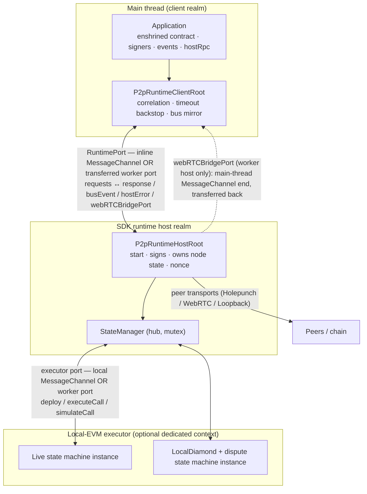

# Runtime & Concurrency — Transport-Neutral Workers

> **Specification subject:** [specification/runtime/execution.md](../../../../specification/runtime/execution.md)

> **Scope:** The design decision behind the SDK's execution architecture:
> **transport neutrality between inline and worker deployment**. Communication
> between the main thread, the SDK runtime host, and the optional local-EVM
> executor is defined as serialized bidirectional messages over paired ports;
> the same protocol and observable behavior hold whether both endpoints share
> one context or one is transferred to a worker. This document owns the
> port/worker abstractions, the normative cross-boundary correctness rules, the
> concurrency model _between_ contexts, and the client-performance strategy.
> The request-type enumeration and the host/client startup sequence are
> summarized in [architecture.md](./architecture.md) §2.1 and are **not**
> repeated here — this is the deep treatment of the boundary those requests
> cross. The concurrency model _inside_ the host (the `StateManager` mutex) is
> owned by [block-confirmation-pipeline.md](./block-confirmation-pipeline.md)
> §3.1 and only related to here.

## RPC ownership

Internal roots and service pairs are centralized under `src/rpc/internal`. `AInternalRpcRoot` owns one runtime router and its connections; each service retains its domain dependencies. All routers live under `src/rpc/router`. Each peer manager owns a separate NetworkRpcRouter; the manager itself owns connections, discovery, profiles and peer penalties. Both categories use shared dispatch and pending settlement, with typed category-specific transports.

## 1. Purpose & observable contract

The SDK is client-side blockchain-node software running in TypeScript/V8
environments (Node.js or a browser). Real parallelism there comes from
**workers** plus **message passing**. V8 _can_ expose shared mutable memory
across contexts (`SharedArrayBuffer` + `Atomics`, under each platform's
conditions), but this is a deliberate **SDK design constraint, not a platform
limitation**: the protocol MUST NOT depend on shared mutable memory between the
main thread, the SDK runtime host, or the local-EVM executor. Every
inter-context interaction is a serialized message. This keeps a component's
communication contract identical whether it runs inline or in a worker
([`REQ-RUN-1-FSV0SH`](runtime-and-concurrency.md#req-run-1-fsv0sh)), which is the property the whole architecture rests on.

The root owns parent/child relationships and recursive disposal. Every concrete root implements local cleanup; the shared operation stops dependent work where needed, awaits children, then completes local cleanup. Callers retain one typed remote handle. Built-in worker URLs are internal platform assets.

The WebRTC ownership tree is host root → worker-side bridge root → main-thread broker root. SDK service messages forward the port upward through nesting. Broker installation stays outside readiness, while negotiation waits for attachment. Native data channels transfer downward when supported; otherwise the broker proxies traffic.

### 1.1 The core design decision ([`REQ-RUN-1-FSV0SH`](runtime-and-concurrency.md#req-run-1-fsv0sh))

**Transport neutrality between inline and worker deployment.** Communication
across a context boundary is defined once, as serialized bidirectional messages
over a **paired port** ([`RuntimePort`](../../../../../../src/transport/RuntimePort.ts#L9)
/ [`RuntimeChannel`](../../../../../../src/transport/RuntimePort.ts#L26)). The two
endpoints of a pair may:

- both live in one execution context — an **in-process** `MessageChannel` pair
  ([`createRuntimeChannel`](../../../../../../src/transport/node/RuntimeChannel.ts#L1)),
  or
- have one endpoint **transferred to a worker** — a transferable port
  ([`createTransferableChannel`](../../../../../../src/transport/node/RuntimeChannel.ts#L1)
  plus [`createRootWorker`](../../../../../../src/rpc/internal/node/RootWorkerRuntime.ts)).

The message protocol and the observable behavior are **identical in both
cases**. The consequences are the whole point of the design:

- Callers keep **no separate inline and worker implementations**. The same
  [`P2pRuntimeClientRoot`](../../../../../../src/rpc/internal/roots/P2pRuntimeClientRoot.ts) drives
  the host over whichever port it is handed; the same
  [`P2pRuntimeHostRoot.start`](../../../../../../src/rpc/internal/roots/P2pRuntimeHostRoot.ts#L204) runs
  the graph regardless of which side of the boundary it is on.
- A component **can move into a worker when profiling shows a real limit**,
  without changing its higher-level communication contract. The move is a
  configuration flag (§5), not a rewrite.

This is a **normative design decision**, not an incidental factoring. The
rationale is the SDK's no-shared-mutable-memory constraint ([`REQ-RUN-2-GBCZ5B`](runtime-and-concurrency.md#req-run-2-gbcz5b)): because
the design forgoes shared memory, isolation is _free of aliasing hazards_ but
_costs a serialization hop_; defining the boundary as message passing from the start
means the isolation decision can be deferred to where measurement justifies its
cost, instead of being baked into the type graph.

### 1.2 Observable contract of a port

[`RuntimePort`](../../../../../../src/transport/RuntimePort.ts#L9) is the minimal surface
that both a Node `worker_threads` `MessagePort` and a browser `MessagePort`
satisfy through a thin adapter (`adaptPort`):

| Member                     | Contract                                                                                                                              |
| -------------------------- | ------------------------------------------------------------------------------------------------------------------------------------- |
| `post(message, transfer?)` | Send one structured-clone-serializable message; optionally transfer ownership of transferables (a nested port).                       |
| `onMessage(handler)`       | Register the **single** inbound-message handler and begin dispatch.                                                                   |
| `start()`                  | Begin dispatching (no-op where implicit).                                                                                             |
| `onClose(handler)`         | Fire when the other end goes away. **Reliable on Node; best-effort in the browser** — callers keep a request timeout as the backstop. |
| `close()`                  | Tear down the port.                                                                                                                   |

`RuntimeChannel` is a linked pair `{port1, port2}`: `port1` stays local, `port2`
may be transferred. What each endpoint means is fixed by role, not by whether a
transfer happened — that invariance is exactly transport neutrality.

## 2. The three contexts and who owns what

Three execution contexts, connected only by serialized ports:

1. **Main thread (client realm).** Holds the application and
   [`P2pRuntimeClientRoot`](../../../../../../src/rpc/internal/roots/P2pRuntimeClientRoot.ts). It
   **sends requests** (enshrined-contract calls, signer calls, channel
   lifecycle, `hostRpc`, `quiesce`, `dispose`) and **receives** responses, bus
   events, host errors, and — in worker mode — the WebRTC bridge port. It owns
   only client-realm proxy objects: the two client signers, a main-thread
   contract mirror, and the client `EventBus`. It owns **no node state**.
2. **SDK runtime host.** Built by
   [`P2pRuntimeHostRoot.start`](../../../../../../src/rpc/internal/roots/P2pRuntimeHostRoot.ts#L204). It
   **owns the node state** (`StateManager` and everything it owns — managers,
   storage, RPC services, transports, event listener), **owns the signing key**,
   and **owns the chain nonce** (built on its own provider/wallet in
   [`RuntimeChainContext`](../../../../../../src/evm/p2pRuntime/RuntimeChainContext.ts#L4),
   wrapped in `HostNonceManager`; cross-ref [architecture.md](./architecture.md)
   [`REQ-SDK-1-JKC9W7` (The runtime owns its signer)](architecture.md#req-sdk-1-jkc9w7) / [`INV-SDK-2-NH0YGE` (Host-owned signing key and nonce)](architecture.md#inv-sdk-2-nh0yge)). The client realm holds only proxy signers that forward
   over the port — **the private key never crosses a boundary** ([`INV-RUN-4-4M27AP`](runtime-and-concurrency.md#inv-run-4-4m27ap)).
3. **Local-EVM executor.** The SDK host owns a typed executor connection and
   the common [RpcContractExecutor adapter](../../../source/src/evm/contractExecutor/RpcContractExecutor.ts.md).
   Both placements use port RPC: inline creates a local MessageChannel and a
   receiving executor root in the host context; dedicated mode creates that root
   in a worker. The [executor service](../../../source/src/rpc/internal/services/contractExecutor/ContractExecutorService.ts.md)
   owns the canonical EVM engine and its initialization. The engine retains its
   existing mutex and deployed state-machine instances plus LocalDiamond.

**Ownership rule ([`REQ-RUN-3-60N6VR`](runtime-and-concurrency.md#req-run-3-60n6vr)).** Internal state is owned by the component that
**receives** the message defining it. The main thread cannot reach node state
except by sending a request; the host cannot reach EVM state except by calling
the executor; neither can observe the other's internals directly.
`P2pInstance.getStateManager()` throws in every mode precisely to keep this
boundary honest ([architecture.md](./architecture.md) [`INV-SDK-1-DE9YED` (All app-runtime interaction crosses the port)](architecture.md#inv-sdk-1-de9yed)).

The manager binding follows one ABI rule in both the main thread and host. The SDK manager ABI is
installed first, then the application ABI serialized as `scm.abiJson` is appended. SDK definitions
win duplicate signatures; consumer-only functions, events, and errors remain available. This lets
host-side custom RPC code call consumer-facet extensions without dropping SDK error decoding.

Discovery uses the same ownership boundary. `joinLobby` and `leaveLobby` cross the runtime port
with one structured-clone-safe 32-byte topic and serializable opening options. The host owns matching,
negotiation, retries, timers, peer profiles, transports, reputation policy, and cleanup; the client sends
no callback, transport, abort signal, or live manager object. Matching has no implicit deadline; an optional
finite timeout crosses with the options. Replacing a join settles an earlier active match as `undefined`.
`leaveLobby` returns the host's phase decision: true during cancellable matching and false after handoff.
Lobby-authenticated transports remain host-side and outside ordinary connection tracking until one selected
profile is promoted at commitment. Every non-success cleanup closes the session set, and unsigned retry
leaves and freshly rejoins the topic. The internal match transcript never crosses the port.
The host derives the channel ID during negotiation, observes the opening on-chain, leaves the topic, and
returns the opened channel ID and selected peer address for the client to observe.

Both worker boundaries are independent flags, so all four combinations exist and
are exercised together (§6): inline-host/inline-vm, inline-host/dedicated-vm,
worker-host/inline-vm, worker-host/dedicated-vm.

### 2.2 The two state-machine instances vs. the executor boundary

[architecture.md](./architecture.md) §4 ([`INV-SDK-3-87WK8P` (Dedicated state machine for dispute replay)](architecture.md#inv-sdk-3-87wk8p)) defines two deployed
state-machine instances: the **live** instance driving replicated channel state,
and the **diamond** instance embedded in the `LocalDiamond` for dispute replay.
That split is a _logical_ separation to keep dispute replay from corrupting live
state. It is **orthogonal to the thread boundary**: both instances and the
`LocalDiamond` live behind the _same_ contract executor
([`buildRuntime`](../../../../../../src/rpc/internal/roots/P2pRuntimeHostRoot.ts#L299) passes one
`contractExecutor` and both addresses to
`createStandaloneFromLocalStateMachineWithExecutor`). `VM_DEDICATED_THREAD` moves
the **whole EVM** — both instances — behind the executor worker; it never moves
one instance and leaves the other. Inside the host, the live instance is driven
under the `StateManager` mutex and the diamond instance during dispute replay;
to the executor these are just `executeCall`/`simulateCall` requests
distinguished by contract address.

## 3. Cross-boundary correctness rules (normative core)

§44 requires these rules to be **explicit before any component is moved into a
worker** ([`REQ-RUN-4-NK15QS`](runtime-and-concurrency.md#req-run-4-nk15qs)): a boundary that is correct inline but underspecified is a
latent bug the day it becomes a real thread. For each dimension below, the
**current, as-implemented rule** is stated; unresolved points are marked
`**Open question:**` rather than guessed.

### 3.1 Ownership

State is owned by the receiving component ([`REQ-RUN-3-60N6VR`](runtime-and-concurrency.md#req-run-3-60n6vr), §2). The private key and
nonce counter never leave the host ([`INV-RUN-4-4M27AP`](runtime-and-concurrency.md#inv-run-4-4m27ap)). Config is **snapshotted and
shipped**, not re-derived across the boundary: `p2pSetup` resolves the config
once (precedence: overrides > `process.env` > `peer3.config.ts` > defaults,
[../reference/configuration.md](../../operations/configuration.md)) into the
`SetupPayload`, and the worker re-establishes the identical singleton via
`createConfig(payload.config)`
([host root](../../../../../../src/rpc/internal/roots/P2pRuntimeHostRoot.ts#L152)).
A worker that re-read `process.env` could diverge from the main thread; it
deliberately does not.

### 3.2 Ordering & correlation ([`INV-RUN-2-AF430Q`](runtime-and-concurrency.md#inv-run-2-af430q), [`REQ-RUN-5-DC7M8E`](runtime-and-concurrency.md#req-run-5-dc7m8e))

- **One router ingress per connection.** [InternalTransport](../../../source/src/transport/InternalTransport.ts.md)
  installs the receiving listener and passes logical RPC objects to the root's
  [InternalRpcRouter](../../../source/src/rpc/router/InternalRpcRouter.ts.md). Connection
  cleanup unsubscribes that listener.
- **Correlation IDs.** [ARpcRouter](../../../source/src/rpc/router/ARpcRouter.ts.md)
  owns request IDs, register-before-send, timers, response correlation and
  settlement-once. Each endpoint router has its own pending map. SDK, executor,
  WebRTC and logger calls all use this implementation. Timeout defaults remain
  with their callers: SDK/WebRTC 30 seconds, executor unbounded, and the existing
  unbounded SDK operations retain that choice.
- **Response admission.** Internal responses must arrive on the exact connection
  that owns the pending call. Network responses retain authenticated same-peer
  replacement admission and foreign-peer penalties in P2PManager. Admission runs
  before consuming the pending entry.
- **Message order.** A `MessagePort` delivers messages to its single handler in
  send order (FIFO per port). The protocol relies on this for bus events, which
  are forwarded in emission order through the single bridge tap
  (`stateManager.events.setBridgeTap`, [architecture.md](./architecture.md) §5).
  **Open question:** no rule states the _relative_ ordering guarantee between a
  request's `response` and interleaved `busEvent`/`hostError` messages beyond
  per-port FIFO; consumers today do not depend on cross-kind ordering, but the
  guarantee is not written down. (Divergence class: documentation debt.)

### 3.3 Lifecycle

The lifecycle coverage uses [ReadyLifecycleRpcManifest.ts](../../../../../../test/fixtures/customRpc/ReadyLifecycleRpcManifest.ts), [PeerTestHarness.ts](../../../../../../test/fixtures/PeerTestHarness.ts), [workerAnswerPrecompile.ts](../../../../../../test/fixtures/workerAnswerPrecompile.ts), and [harness core types](../../../../../../test/harness/core/types.ts). These are test-only inputs for delayed application readiness, delayed precompile initialization, and bounded peer setup; they do not define production protocol behavior.

The production lifecycle crosses [EvmDiamondStateMachine.ts](../../../../../../src/evm/EvmDiamondStateMachine.ts), [P2pRuntimeHostRoot.ts](../../../../../../src/rpc/internal/roots/P2pRuntimeHostRoot.ts), [MainRpcService.ts](../../../../../../src/rpc/network/MainRpcService.ts), and the contract executor's [worker host](../../../../../../src/rpc/internal/services/contractExecutor/ContractExecutorService.ts).

Startup begins with common `createRoot` for the inline client root. Its initialization creates the host child and waits for host initialization. Application setup then deploys two separate contracts through the host-backed signer. `deployComplete` builds the peer runtime and awaits its custom root readiness hook. Application adapters and required bridge setup finish before application setup returns the instance. `P2pInstance` holds that root directly. A startup failure rejects root creation; a later application setup failure cleans the ready root and application objects while preserving the original error. Each isolated context starts its own event-loop monitor after its local
ready work completes and uses the configured delay guard. A trip, like any error caught outside a
request in the sdk or contract-executor worker, is reported to the application as one detached
runtime error (`hostError`) and the worker keeps serving; an exit the runtime did not request is
fatal for that worker. The test harness starts its main-thread monitor after all
initial peer setup calls finish. A peer added later starts independently and
does not change existing peers' monitors.
In worker mode a single
`WorkerBootstrapMessage {type:"connect", payload, port}` transfers the port into
the worker before the request protocol begins
([`onRootBootstrap`](../../../../../../src/rpc/internal/node/RootWorkerRuntime.ts)).

### 3.4 Error semantics ([`INV-RUN-3-1AKG2E`](runtime-and-concurrency.md#inv-run-3-1akg2e))

- **Request failures** return `{type:"response", ok:false, error}`. Errors are
  serialized by `serializeError` — `message`/`name`/`stack`, a contract revert's
  ABI `data` (recovered by `extractRevertData` so custom errors decode
  client-side), ethers metadata (`code`, `shortMessage`, `reason`,
  `transaction`, `receipt`, `info`), and an originating-peer stamp — and
  restored to a real `Error` by `deserializeError` on the client. The
  in-process peer-address stamp is carried explicitly because the non-enumerable
  property does not survive structured clone.
- **Host construction failure** posts a `hostError` and closes the port; the
  client creation rejects and all pending requests reject
  (`dispatchHostError`). A provider-creation failure before the graph exists is
  handled the same way ([`P2pRuntimeHostRoot.start`](../../../../../../src/rpc/internal/roots/P2pRuntimeHostRoot.ts#L204)
  early `catch`).
- **Autonomous host errors** (a worker `unhandledRejection`/`uncaughtException`
  not tied to a request) are funnelled over the port as `hostError`
  ([`onUnhandledWorkerError`](../../../../../../src/rpc/internal/node/RootWorkerRuntime.ts)).
  After `ready`, they go to `onHostError` listeners; with **no** listener they
  re-throw as a main-thread unhandled rejection, so a worker fault surfaces the
  same way an inline host's would.
- **Dead client port** triggers host self-disposal via `port.onClose`.

### 3.5 Disposal

- **Graceful:** `P2pInstance.dispose()` → `client.dispose()` sends a `dispose`
  request with **no timeout** (`timeoutMs: null`), lets the host tear down its
  graph and reply, then closes the port and (worker mode) awaits
  `worker.shutdown()`. Disposal owns its own bounds because the generic 30 s
  request timeout could otherwise force shutdown while provider/transport
  handles are still closing.
- **Worker drain, never force-stop.** A worker is _never_ terminated: after
  replying to `dispose` it closes its remaining handles
  ([`closeRootWorker`](../../../../../../src/rpc/internal/node/RootWorkerRuntime.ts))
  and the thread ends when the loop drains
  ([`createWorkerShutdown`](../../../../../../src/evm/node/workerShutdown.ts#L14) waits on
  `exit` with no timeout). The recorded reason: `terminate()`,
  worker-side `process.exit()`, or exiting the process with a live worker all
  abort the whole process with `uv_loop_close() while having open handles` when
  close callbacks are pending (observed on Node 22.12/22.17 under parallel-test
  load). A stuck drain is deliberately surfaced as a visible hang that names the
  leaking teardown rather than converted into a process abort.
- **`StateManager.abort()`** disposes its owning root and descendants, then closes the control connection. Late queries reject in both placements; another SDK root remains independent.

### 3.6 Serialization limits

Messages cross by **structured clone** (`postMessage`), with two protocol-level
encodings layered on top for values structured clone handles poorly or that must
be canonical:

- **Bigints.** ethers transaction fields cross as decimal/quantity strings
  ([`chainSignerSerialization`](../../../../../../src/rpc/internal/services/chainSigner/chainSignerSerialization.ts#L1):
  `toQuantity`/`getBigInt` over the `BIGINT_FIELDS` set). Protocol structs cross
  as canonical `Codec.encode` strings and are decoded inside the host endpoint
  (`joinChannel`/`topUpBalance`/`collectJoinChannelConfirmation` use
  `Codec.decode`/`encode` with `Type.*`), the same discipline the peer-RPC
  boundary enforces ([rpc/README.md](./rpc/README.md) §6.3, [`REQ-RPC-4-9VX0B9` (Replay and concurrency)](../../../../specification/peer-communication/rpc.md#req-rpc-4-9vx0b9)).
- **What cannot cross.** Custom transaction data (`tx.customData`) and KZG
  functions (`tx.kzg`) are rejected with an explicit
  `UNSUPPORTED_OPERATION` assert before the hop. Class instances cannot be
  transferred, which is why the **custom RPC root** and **custom precompiles**
  cross as _manifests_ (module specifier + export name), resolved inside the
  host realm ([rpc/README.md](./rpc/README.md) §2.5), not as constructed
  objects. `ethers.Signer` objects are intentionally unsupported for the same
  reason ([architecture.md](./architecture.md) [`REQ-SDK-1-JKC9W7` (The runtime owns its signer)](architecture.md#req-sdk-1-jkc9w7)).
- **Transferables.** Bound calls accept an explicit transfer list on request or
  send. InternalTransport passes it to postMessage once. Bootstrap ports, bridge
  ports, supported data channels and explicit binary buffers retain host transfer
  semantics; invalid lists and uncloneable values fail at the producer.
- **Application event names.** The hook-publishing proxy accepts every string
  property name and emits `{kind: "p2pEventHooks", eventName, args}` before
  calling the current application hook target. Cloneable application payloads
  therefore cross the same worker-to-client bridge without adding their names
  to the SDK's base hook type.
- **Event clone failures.** Event forwarding uses synchronous sends. An
  uncloneable argument throws at the producer after the existing local listener
  order; the bridge does not silently replace arguments with an empty array.
  Main-thread indexed contract filters still have the existing limitation because
  the forwarded event has name and arguments rather than original topics.

### 3.7 Trust of the boundary itself

The client↔host and host↔executor ports connect SDK-owned endpoints. Their
runtime domain services use common descriptor-safe dispatch without peer guards.
[NetworkTransport](../../../source/src/transport/NetworkTransport.ts.md) alone
carries peer identity, profile admission and network lifecycle policy.
Loopback remains a network transport with JSON serialization and its trusted peer
guard bypass. It is not an internal worker connection. Structural recognition
classifies the transport or service surface; it does not authenticate a sender.

## 4. Browser vs. Node divergence: the WebRTC bridge

The port abstraction is uniform, but one host capability is not portable: an
`RTCPeerConnection` cannot be driven from inside a worker. When the host runs in
a worker that cannot negotiate WebRTC itself
([`doesWorkerNeedMainThreadBridge`](../../../../../../src/rpc/network/services/WebRTCSetup/connection/WebRTCProvider.ts#L31)),
the host mints a second `MessageChannel`, **transfers its main-thread end back to
the client** as a `webRTCBridgePort` message, and registers the worker end with
[`WorkerBridgeWebRTCConnectionFactory`](../../../../../../src/rpc/network/services/WebRTCSetup/connection/WorkerBridgeWebRTCConnectionFactory.ts#L209).
The client surfaces it on `P2pInstance.webRTCBridgePort`;
`installMainThreadBridgeIfOnMainThread()` (called automatically by `p2pSetup`)
wires it to the real `RTCPeerConnection`
([`WebRTCMainThreadBridge`](../../../../../../src/rpc/internal/roots/WebRTCMainThreadBridge.ts#L1)),
or, under further worker nesting, leaves it for the consumer to bubble up. This
is the one place the "identical observable behavior" contract needs a
platform-specific side channel, and it is handled by adding _another_ transferred
port rather than by branching the request protocol — transport neutrality all
the way down.

The `Node` adapter (`onClose` on a real `close` event) and the `browser` adapter
(`onClose` best-effort, since `close` is not universally supported) differ only
in `onClose` reliability, which is why the client keeps the request timeout as a
backstop (§3.5, §5).

## 5. Concurrency model

Two orthogonal mechanisms, and the specification is precise about which does
what:

- **Ports parallelize across contexts.** Message passing over the runtime and
  executor ports is how independent contexts run concurrently. Requests are
  async and correlated; nothing blocks a context while another works. This is
  the _only_ source of true parallelism (no shared memory).
- **The mutex serializes state mutation within the host.** Inside the host
  realm — which is single-threaded JS, concurrency being task interleaving — the
  `StateManager` mutex gives **total-order state application**: at most the next
  eligible block enters state-machine execution at a time, on the current fork,
  by `(forkId, height)`. This boundary is owned by
  [block-confirmation-pipeline.md](./block-confirmation-pipeline.md) §3.1
  ([`INV-BCP-1-H2H41X` (Validation and execution under the state mutex)](block-confirmation-pipeline.md#inv-bcp-1-h2h41x), [`REQ-BCP-3-1GCEH9` (Intake and merge never take the transition mutex)](block-confirmation-pipeline.md#req-bcp-3-1gceh9)/4) and **not restated here**.

**How they relate ([`INV-RUN-1-JM2D9F`](runtime-and-concurrency.md#inv-run-1-jm2d9f)).** Ports move work _between_ contexts in parallel;
the mutex serializes the one operation that mutates live state _within_ the host.
Peer-RPC ingest and port requests are the cheap, mergeable, out-of-order regime
and hold **no** lock ([rpc/README.md](./rpc/README.md) §6.6, [`REQ-BLOCK-PIPE-5-WJ31RG` (Pre-execution merge layer)](../../../../specification/block-progression/block-processing.md#req-block-pipe-5-wj31rg)); only the
downstream dequeue-and-execute path takes the mutex. Moving the EVM into a
dedicated worker does not change this: `executeCall`/`simulateCall` are awaited
_under_ the host mutex, so total order is preserved across the executor boundary
— the worker adds latency and isolation, not concurrency of state mutation.

## 6. Performance strategy & device assumptions

§44 is emphatic that this is a **client** performance strategy, **not** server
vertical scaling ([`REQ-RUN-7-XV1FDR`](runtime-and-concurrency.md#req-run-7-xv1fdr)). The SDK must remain usable on constrained laptops,
phones, and tablets as well as powerful devices; correctness comes first, and
components are isolated or parallelized **incrementally, where measurement
justifies the cost**.

### 6.1 Decision record — worker placement and device floor

> **Provenance.** [`REQ-RUN-13-27YE2T`](runtime-and-concurrency.md#req-run-13-27ye2t), [`REQ-RUN-14-YAHYR4`](runtime-and-concurrency.md#req-run-14-yahyr4), and [`REQ-RUN-15-8CBVKB`](runtime-and-concurrency.md#req-run-15-8cbvkb) are **engineer decisions taken on
> 2026-08-10** in response to explicit questions raised by this specification; they are not
> inferred from code. The
> parallel-runner defaults are _corroborating evidence_, never the basis. Recorded per
> [governance.md §1.3](../../../../governance.md). Anything below marked `Open question:` remains
> undecided.

| Field                     | Content                                                                                                                                                                                                                                                                                                                                 |
| ------------------------- | --------------------------------------------------------------------------------------------------------------------------------------------------------------------------------------------------------------------------------------------------------------------------------------------------------------------------------------- |
| **Decision**              | Both worker boundaries (runtime host, EVM executor) are the intended defaults, uniformly, with **no per-environment profile branching**. The supported device floor is a mid-range mobile browser, and that envelope is a **hard budget the implementation must meet** — not a reason to vary placement.                                |
| **Status**                | Accepted (engineer, 2026-08-10)                                                                                                                                                                                                                                                                                                         |
| **Rejected alternatives** | _Per-environment profiles_ (capable environments default both on, mobile decides by measurement) — rejected: profile branching multiplies the configuration matrix the equivalence criterion must cover. _Inline stays default until measured_ — rejected: it treats the target architecture as speculative when the intent is settled. |
| **Consequence**           | Three V8 contexts per peer on a few-hundred-MB heap. The 1024 MB per-worker cap, the import-graph load cost, and the aggregate footprint must all come **down** to fit the floor; that work is a prerequisite for flipping the defaults, not an afterthought.                                                                           |
| **Affected layers**       | SDK runtime, configuration defaults, build/bundle size, tests (equivalence matrix), operations                                                                                                                                                                                                                                          |

- **Worker boundaries: both default-on, uniformly ([`REQ-RUN-13-27YE2T`](runtime-and-concurrency.md#req-run-13-27ye2t)).** The target architecture
  places the runtime host **and** the local EVM executor each in their own worker, leaving
  the application thread free. _Current:_ `VM_DEDICATED_THREAD` and `RUN_SDK_IN_THREAD` both
  default to `false` ([`config.ts`](../../../../../../src/utils/config.ts#L1);
  [../reference/configuration.md](../../operations/configuration.md)), so the inline path is what
  ships. Divergence class: **missing** — the intent is settled; flipping the defaults is
  unfinished work, gated on the budgets of §6.2 and on the equivalence criterion (§11.6)
  holding across the matrix. Corroborating signal: the canonical parallel gate already runs
  with both flags on (`resolveThreadModes` defaults both true), so worker mode is the
  better-exercised configuration.
  Inline remains the **fallback for runtimes without usable workers** — but it is a _static
  config choice_, not feature detection: nothing probes for worker availability and
  auto-falls-back. **Open question:** flipping the defaults requires runtime capability
  detection with automatic inline fallback (browsers that deny workers, restrictive CSP);
  the detection mechanism and its failure behavior are undesigned. This is a fallback path,
  not a profile — placement itself does not vary by environment.
- **Worker startup/transfer cost is instrumented but unquantified in-tree.**
  [`workerStartupTiming.ts`](../../../../../../src/evm/node/workerStartupTiming.ts#L1)
  measures each worker's boot as `online` (Node init + `execArgv` preload) +
  `load` (the SDK import-graph transpile+load) and emits an `##E2E_TIMING##`
  marker, but only under the test-only `EVENT_LOOP_DELAY_ERROR_THRESHOLD_SECONDS`
  guard; production worker creation is silent and no target numbers are recorded.
  Workers are spawned transpile-only (swc) precisely because full ts-node
  type-checking cost seconds per worker
  ([`RootWorkerRuntime`](../../../../../../src/rpc/internal/node/RootWorkerRuntime.ts)
  comment).
- **Memory limits are set, with a stated purpose.** Each Node worker gets
  `maxOldGenerationSizeMb` = **1024 MB** by default
  ([`workerResourceLimits.ts`](../../../../../../src/evm/node/workerResourceLimits.ts#L1)),
  overridable through `SCP_WORKER_MAX_OLD_SPACE_MB`, disabled by a
  value ≤ 0. The documented rationale is **OOM containment under parallel test
  load** (each of N test processes spawns an SDK and a VM worker; uncapped V8
  old-space auto-sizes off total system RAM), turning a runaway worker into a
  clean per-worker crash. This is a CI-safety cap, **not** a device-support
  budget.
- **Supported-device envelope: a mid-range phone ([`REQ-RUN-14-YAHYR4`](runtime-and-concurrency.md#req-run-14-yahyr4)).** _Decided
  2026-08-10._ The SDK MUST run a typical channel (about six participants,
  [../security/trust-model.md](../../../../specification/security/trust-model.md) [`REQ-TRUST-5-NDVRW8` (The design targets many SMALL channels, not large ones)](../../../../specification/security/trust-model.md#req-trust-5-ndvrw8)) on a
  **mid-range mobile browser** — on the order of 4 GB device RAM, a few hundred
  MB of usable JS heap for the whole application, and a mobile-class CPU.
  Anything more capable (laptop, desktop, server-side Node) is above the floor.
  This envelope, not a laptop's, is what any optimization or added worker
  boundary must fit within.

    **The envelope is a hard budget, not a placement variable ([`REQ-RUN-13-27YE2T`](runtime-and-concurrency.md#req-run-13-27ye2t) ×
    [`REQ-RUN-14-YAHYR4`](runtime-and-concurrency.md#req-run-14-yahyr4)).** Default-on workers mean **three execution contexts per peer**
    (application thread, runtime host, EVM executor), each with its own V8 heap and
    import-graph load cost, on a device whose _total_ usable heap is a few hundred
    MB. The engineer decision (§6.1) is that placement does **not** bend to fit the
    device — the implementation does: per-worker heap caps, the SDK import graph
    crossing into each worker, and the aggregate per-peer footprint must all be
    reduced until three contexts fit the floor. The current 1024 MB
    `maxOldGenerationSizeMb` is explicitly a CI OOM-containment value and **MUST
    NOT** be read as a device budget; under this envelope it is far too high and
    needs re-deriving downward. **Open question ([`OQ-38-EY27T5` (Runtime budgets, scheduling determinism, and test isolation)](../../../../specification/open-questions.md#oq-38-ey27t5)):** the concrete per-context
    budget and the aggregate per-peer ceiling, and the measurement showing three
    contexts fit. Until those exist, flipping the defaults ([`REQ-RUN-13-27YE2T`](runtime-and-concurrency.md#req-run-13-27ye2t)) is blocked —
    the decision is settled, its precondition is not.

- **Throughput/latency targets: `none — gap`.** The repo states no target and
  none was set with the device decision. **Open question:** the concrete
  client-visible targets (block-confirmation round-trip, dispute-path latency,
  sustained blocks/second at six participants) that the envelope above must be
  measured against. Without them [`REQ-RUN-14-YAHYR4`](runtime-and-concurrency.md#req-run-14-yahyr4) is a memory envelope only, and the
  measurement §44 asks for cannot be defined.

## 7. Future Work

_Non-normative._

- **Runtime worker feature-detection and auto-fallback**, so worker mode
  degrades to inline where workers are unavailable instead of requiring a static
  flag (§6).
- **A measurement harness that gates each worker boundary** (§6): turn the
  existing startup/timing instrumentation into a benchmark that justifies
  `RUN_SDK_IN_THREAD` / `VM_DEDICATED_THREAD` per target device, and record the
  performance target and device envelope the gaps in §6 flag.
- **A written cross-kind ordering guarantee** for responses vs. bus events over
  the port (§3.2), and an explicit contract for bus-event arg serialization loss
  and indexed-filter matching (§3.6).
- **A trusted-transport guard for the harness-control root** and exclusion of the
  fixture tree from the published build (§11.4), so a privileged test surface
  cannot be dispatched from a network transport or shipped to consumers by
  default.
- **A cross-peer scheduling mechanism** if deterministic multi-peer interleaving
  is wanted (§11.5) — today only the per-peer cooperative hold/release stubs
  exist, and coordination is polling-based.

## 8. Assumptions, constraints & dependencies

- Single-threaded JS realm per context; parallelism is inter-context message
  passing only. No shared mutable memory is assumed anywhere ([`REQ-RUN-2-GBCZ5B`](runtime-and-concurrency.md#req-run-2-gbcz5b)).
- One runtime host per signer identity; `createConfig` is process-global and
  called once per runtime, and the same resolved config is shipped to the worker
  ([architecture.md](./architecture.md) §3, §3.1 here).
- `onClose` is reliable on Node, best-effort in the browser; correctness under a
  missed close depends on the request timeout backstop (default 30 s;
  `dispose`/`quiesce` opt out with `timeoutMs: null`).
- The chain provider, signer ownership, and nonce discipline are the host's
  ([architecture.md](./architecture.md) [`REQ-SDK-1-JKC9W7` (The runtime owns its signer)](architecture.md#req-sdk-1-jkc9w7)/2, [`INV-SDK-2-NH0YGE` (Host-owned signing key and nonce)](architecture.md#inv-sdk-2-nh0yge)); this document
  assumes them and does not restate them.
- Depends on: [architecture.md](./architecture.md) (host/client split, two SM
  instances), [block-confirmation-pipeline.md](./block-confirmation-pipeline.md)
  §3.1 (host-internal mutex), [rpc/README.md](./rpc/README.md) (peer boundary and
  loopback), [../reference/configuration.md](../../operations/configuration.md)
  (flags, worker env vars, test runners).

## 9. Invariants

### INV-RUN-1-JM2D9F — Ports parallelize, the state mutex serializes

Ports parallelize work across contexts; the host-internal
`StateManager` mutex serializes live-state mutation. Moving the EVM behind a
worker preserves total-order application because executor calls are awaited
under that mutex.

### INV-RUN-2-AF430Q — One-to-one channels and single port ownership

A runtime channel is a 1:1 pair; a transferred port is owned by
exactly one context; each port has exactly one message handler. Correlation by
`requestId` needs no authenticity check because the paired context is the only
writer.

### INV-RUN-3-1AKG2E — Host construction failure closes the port

A host construction failure posts `hostError` and closes the
port so the client creation rejects and pending requests reject; a dead client
port triggers host self-disposal.

- [x] `INV-RUN-3-1AKG2E.T1.P1` — valid case

### INV-RUN-4-4M27AP — Key and nonce never cross a boundary

The signing key and chain nonce never cross a boundary; only
the host signs, and the client realm holds proxy signers that forward requests
(cross-ref [architecture.md](./architecture.md) [`INV-SDK-2-NH0YGE` (Host-owned signing key and nonce)](architecture.md#inv-sdk-2-nh0yge)).

### INV-RUN-5-ATVKZ4 — Harness control runs in the host realm

A harness-control operation executes in the host realm on the
live objects and returns only serializable projections; no live `Block`,
transport, profile, or `StateManager` reference crosses the port (§11.2).

### INV-RUN-6-YKK493 — Per-peer harness stub state

Harness stub state is scoped to one peer's host service
instance, so co-located inline hosts do not leak an installed fault between
peers (§11.4).

### REQ-RUN-1-FSV0SH — Serialized messages over paired ports

Communication is serialized messages over paired ports; the protocol and observable behavior are identical inline or worker, so callers keep no separate implementations and a component can move to a worker without changing its contract.

- [x] `REQ-RUN-1-FSV0SH.T1.P7` — inline SDK-owned executor normalizes manifest addresses and clones mutable options at initialization; later caller mutation cannot alter precompile results, including binary, BigInt, false, zero and empty values

### REQ-RUN-2-GBCZ5B — No shared mutable memory across contexts

No shared mutable memory between main thread, host, and executor; all inter-context interaction is a serialized message.

### REQ-RUN-3-60N6VR — State owned by the receiving component

Internal state is owned by the receiving component; the app cannot reach node state, the host cannot reach EVM state, except by a request.

### REQ-RUN-4-NK15QS — Explicit cross-boundary rules before a move

Ownership, ordering, lifecycle, error, disposal, and serialization rules for a cross-boundary message are explicit before a component moves to a worker.

### REQ-RUN-5-DC7M8E — Client-local request correlation

Every client→host request carries a client-local `requestId`; a single handler per port correlates the one matching response; only the paired context can settle it.

### REQ-RUN-6-MTBT2H — Structured-clone limits on boundary values

Cross-boundary values obey structured-clone limits: bigints as quantity/Codec strings, manifests not class instances, only ports transferred; `customData`/`kzg` rejected; non-serializable bus args drop.

- [x] `REQ-RUN-6-MTBT2H.T1.P1` — valid case
- [x] `REQ-RUN-6-MTBT2H.T1.P3` — malformed input
- [x] `REQ-RUN-6-MTBT2H.T1.P4` — direct invalid/opposite case
- [x] `REQ-RUN-6-MTBT2H.T1.P10` — partial failure

### REQ-RUN-7-XV1FDR — Workers as a client performance strategy

Worker isolation is a client performance strategy (not server scaling), applied incrementally where measurement justifies it; each boundary should be measurement-justified.

### REQ-RUN-8-A4B4SA — Harness control is a custom-RPC root

Harness control is a custom-RPC root over the same serialized surfaces; a controller drives a peer only through `hostRpc` (loopback to that peer's host, or a typed relay to a peer address), never by in-process reference.

- [x] `REQ-RUN-8-A4B4SA.T1.P1` — valid case

### REQ-RUN-9-7ZWAGJ — Serializable harness-control projections

Every harness-control operation returns structured-clone-serializable projections; bigint-bearing structs cross `Codec.encode`d and are decoded in the host endpoint.

### REQ-RUN-10-FSD184 — Harness control unreachable by network peers

The harness-control root is not reachable by a network peer and is not present in a production artifact.

### REQ-RUN-11-5YYV48 — Isolated concurrent peers and test processes

Concurrently executing peers and test processes are isolated: per-peer host realm and service state, disjoint account partitions per process, per-test channel id, per-slot chain/discovery/cache.

### REQ-RUN-12-AYGVM7 — Stated inline-worker equivalence criterion

The inline-vs-worker equivalence criterion states which observations must be identical across `RUN_SDK_IN_THREAD × VM_DEDICATED_THREAD`, and the matrix test is that criterion's oracle.

### REQ-RUN-13-27YE2T — Worker boundaries are the defaults

Both worker boundaries (runtime host, EVM executor) are the intended defaults, uniformly — no per-environment profile branching; today's off-by-default state is a maturity gap. Engineer decision 2026-08-10 (§6.1).

### REQ-RUN-14-YAHYR4 — Six participants on a mid-range mobile browser

A ~6-participant channel must run within a mid-range mobile browser envelope (~4 GB device RAM, few-hundred-MB usable heap, mobile CPU). The envelope is a hard implementation budget: three contexts must be made to fit it. The 1024 MB worker cap is CI containment and is too high for this floor. Engineer decision 2026-08-10 (§6.1).

### REQ-RUN-15-8CBVKB — Inline and worker equivalence

Inline and worker mode are equivalent when observable protocol behavior matches: blocks/signatures/state roots, on-chain actions, emitted events and payloads, and error identity. Timing and internal interleaving are out of scope.

## 10. Verification

Concrete test evidence is owned by the downstream verification layer. This section defines implementation-specific obligations only.

## 11. Harness control — the test-control contract

### 11.1 Purpose

**[`REQ-RUN-8-A4B4SA`](runtime-and-concurrency.md#req-run-8-a4b4sa) (normative).** Harness control is expressed as an ordinary
**custom-RPC root** over the same surfaces peers and applications use
([rpc/README.md](./rpc/README.md) §2.5, [`REQ-RPC-3-ZM9WR5` (Service authorization)](../../../../specification/peer-communication/rpc.md#req-rpc-3-zm9wr5)), not as a side channel. A
controller drives a peer only through `hostRpc` — loopback into that peer's own
host, or a typed relay addressed to another peer
([rpc/README.md](./rpc/README.md) §3) — and never by in-process reference. Two
port-level primitives complete the surface: `quiesce()` settles a host's
detached async work uniformly in every deployment mode
([`P2pRuntimeClientRoot`](../../../../../../src/rpc/internal/roots/P2pRuntimeClientRoot.ts)), and
`onHostError` delivers autonomous host faults to the controller (§3.4).

### 11.2 Registration and addressing

### 11.3 The control services

### 11.4 Trust and isolation

Harness control is a **privileged surface**: it signs with the host key, mutates
storage, installs faults, imports other peers' private keys, and executes
arbitrary supplied code in the host realm. The specification states plainly what
protects it today.

**Current — nothing does.** Verified in code:

What limits the blast radius is only that production `p2pSetup` does not
register it: a peer built without a `customRpcManifest` runs `MainRpcService`
and has no harness services. Nothing else — no build flag, no `NODE_ENV` check,
no guard, no transport restriction — stands between a connected peer and this
surface once it _is_ registered.

**Intended ([`REQ-RUN-10-FSD184`](runtime-and-concurrency.md#req-run-10-fsd184)).** The harness-control root MUST NOT be reachable by a
network peer, and MUST NOT be present in a production artifact. Two mechanisms
would express this within the existing model: a guard that fails for every
non-`isTrusted` transport (so harness endpoints are loopback/controller-only —
the guard mechanism is already the designated seat for caller-scoped admission,
[rpc/README.md](./rpc/README.md) [`REQ-RPC-5-CV1R1Y` (Resource bounds)](../../../../specification/peer-communication/rpc.md#req-rpc-5-cv1r1y)), and exclusion of the fixture tree
from the published build. Divergence class: **decision pending** —
security-relevant, and the "no guards" comment shows the current state is a
deliberate convenience whose consequence has not been decided.

**Open question:** should harness-control services be restricted to the trusted
loopback (and the harness's own controller path) and excluded from the shipped
package, or is "test peers only ever run on a closed local network" an accepted
assumption? As written today, `scenario.exec`, `signer.registerPeerSigners`,
`handshake.signMessage`, and the whole `stub`/`byzantine` surface are open to any
peer that completes a transport connection to a harness-built node — including a
Byzantine peer inside a test scenario, which is exactly the population these
tests deliberately create.

**Isolation that does hold ([`INV-RUN-6-YKK493`](runtime-and-concurrency.md#inv-run-6-ykk493)).** Harness state is per-peer, not global:
each service instance belongs to one `P2PManager`, the stub registry
(`stubOriginals`) and the peer-key map live on those instances, and every stub
assigns to an **instance** member — no `prototype` assignment exists anywhere in
the fixture tree. Co-locating N inline hosts in one process therefore does not
leak a fault installed on peer A into peer B. This is a convention held by
construction, not an enforced one; nothing prevents a future stub from patching a
prototype or a module-level singleton, and `Clock`/`config` are process-global by
design (§8).

### 11.5 Lifecycle, runners, and scheduling

**Runner topology.** Three levels of concurrency, and only the first two exist
for peers:

**Remote _peers_ are a capability, not a runner.** §11.1's claim that the design
allows peers on remote machines is a property of the port abstraction; **no
in-repo runner spreads a single test's peers across machines** — distribution is
per whole test. Evidence for the remote-peer claim is therefore structural, and
that gap is recorded rather than papered over.

### 11.6 The inline-vs-worker equivalence criterion

The four explicit placement cases execute the same real two-peer workflow.
They assert committed state projections, application event sets and payloads,
request/error identities and causal order. Producer state changes precede their
events, and root initialization completes before deployment; domain readiness still gates deployment-dependent operations. Random peer identities,
wall-clock timestamps and unrelated task scheduling are not compared.

The [placement fixture](../../../../../../test/fixtures/RuntimePlacementWorkflowFixture.ts)
uses SDK-owned services in all four modes. The canonical distributed runner still
selects worker defaults for tests without explicit placement; these four cases
select each combination themselves.

**[`REQ-RUN-15-8CBVKB`](runtime-and-concurrency.md#req-run-15-8cbvkb) — the normative criterion (engineer decision, 2026-08-10; provenance and
rejected alternatives in [§6.1](#61-decision-record--worker-placement-and-device-floor)).**
Inline and worker
mode are equivalent when **observable protocol behavior** is identical. In scope:

- the blocks, signatures, and state roots the peer produces and accepts;
- the on-chain actions it takes (calls, their arguments, and their ordering
  relative to protocol events);
- the events it emits to the application — same set, same payloads;
- the error identity of a failing request (name, code, revert data) per §3.4.

Explicitly **out of scope**: timing, wall-clock latency, worker-startup
instrumentation, log output, and the internal interleaving of tasks on either
side of the port. The serialization hop MAY reorder internal work as long as the
observations above are unchanged.

The placement cases enforce these observations against the same domain scenario.
Strict equality of unrelated callback scheduling remains outside this refactor.
The approved causal ordering assertions cover deployment/readiness and producer
effect/event order.

### 11.7 Verification

## Shared operation ownership

The runtime host shares the signer readiness check while keeping hostRpc and deployment dispatch separate. Performance reporting is shared; Node and browser retain their own sample sources, timer lifetime and throw/stop order.

[P2pRuntimeHostRoot.ts.md](../../../source/src/rpc/internal/roots/P2pRuntimeHostRoot.ts.md), [performanceMonitorInternal.ts.md](../../../source/src/utils/logging/performanceMonitorInternal.ts.md).

Common lifecycle composition: every internal endpoint owns readiness waits and child-first disposal/quiescence through its lifecycle service. SDK deployment completion remains separate. Repeated cleanup shares completion, and domain readiness points stay unchanged. Forced port removal remains distinct from graceful request/acknowledgement cleanup.

## Common root creation

[createRoot](../../../../../../src/rpc/internal/createRoot.ts) connects an existing parent to the selected root entry using a local channel or transferred worker port. Both modes await initialization and return the same concrete remote service surface. Lifecycle owns recursive readiness and child cleanup. Top-level creation is inline and returns the root directly. Worker creation requires a parent. Client creation establishes communication with its host child. setupP2pRuntime then performs application deployments and invokes deployComplete; executor initialization precedes communication readiness.

Root files export their receiving start operations and remain inert when imported. Thin worker entry files set the diagnostic thread name and call the common bootstrap with the root class. Internal browser URL modules resolve the bundled entries; Node launches those entries with compiled/ts-node selection. All worker roots share memory-limit and graceful-shutdown policy. An explicit threadName worker option overrides the entry default before root initialization.

Existing WebRTC ports still attach through the common root connection method. The factory does not create an extra broker or move main-thread negotiation. Inline child links record the exact two endpoints; logger traversal keeps its physical-realm behavior.

## INTEGRATION-TEST-BROWSER-P2P-RUNTIME-1-E8W0M2

Browser worker signer results and WebRTC traffic

- Setup: Run the browser package script against a real chain, discovery relay, Vite host, main-thread SDK path, and app-worker SDK path
- Oracle: Existing-channel connect returns `true` at `SYNCED`; targeted auto-open and join returns `true` at pending or participating; upgraded traffic succeeds

- [x] `INTEGRATION-TEST-BROWSER-P2P-RUNTIME-1-E8W0M2.P1` — the complete browser package-script flow reports both Boolean/status boundaries and successful upgraded traffic

## INTEGRATION-TEST-RUNTIME-RPC-1-3J92X6

SDK parent/child connection controls across local and worker placement.

- Setup: Actual SDK-owned roots and connected domain services; narrow controls act on those connections.
- Oracle: The typed host control holds only the selected real executor reply, independent SDK calls complete, release settles the correct result and leaves no owned pending request.

- [x] `INTEGRATION-TEST-RUNTIME-RPC-1-3J92X6.P1` — Controls the actual executor connection through the host harness service
- [x] `INTEGRATION-TEST-RUNTIME-RPC-1-3J92X6.P2` — Controls an SDK worker's executor connection through the same harness service
