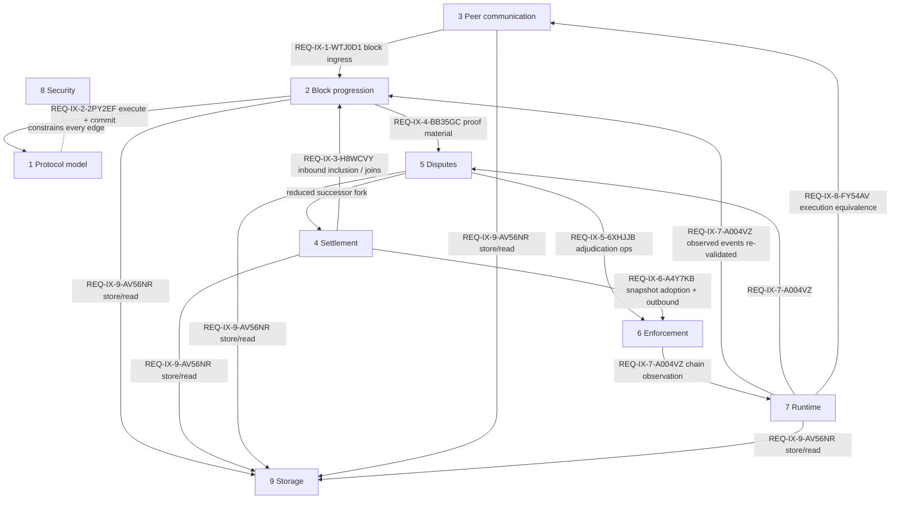

# Protocol Specification

> **Agent status:** Maintained.
> **Engineer verification:** Pending.

This layer defines implementation-neutral protocol behavior. It states what independently written
implementations must agree on: actors, wire/domain concepts, assumptions, constraints, invariants,
failure behavior, ordering, recovery, concurrency, and externally observable results.

The tree is organized by **protocol system** — an ownership boundary with its own state, algorithms,
trust assumptions, failure modes, and verification obligations — not by source-code package. Each
system directory begins with a README stating the system contract: owned state, public inputs and
outputs, called and calling systems, trust and availability assumptions, ordering and concurrency
rules, owned invariants, failure/recovery outcomes, resource bounds, and verification evidence.
Cross-system boundaries are normative contracts in [interactions.md](./interactions.md).

## Contents

- [Required document shape](#required-document-shape)
- [Protocol systems](#protocol-systems)
- [System dependency map](#system-dependency-map)
- [Restructure mapping](#restructure-mapping)
- [System assumptions and constraints](#system-assumptions-and-constraints)
- [System security considerations](#system-security-considerations)
- [System verification and test plan](#system-verification-and-test-plan)

## Required document shape

Every normative document contains:

1. a compact contents menu linking every top-level section;
2. purpose and externally observable model;
3. terminology and normative `REQ-*` / `INV-*` statements;
4. a dedicated **Assumptions and constraints** section covering dependencies, limits, boundaries,
   and conditions under which guarantees hold;
5. a dedicated **Security considerations** section covering protected assets, trust boundaries,
   threats, defenses, abuse cases, and residual risks;
6. a dedicated **Verification and test plan** section defining every black-box test obligation,
   including setup, stimulus, expected result, required permutations, boundary combinations,
   failure/recovery/race/adversarial cases, and the coverage rule for each list; give every
   permutation a stable child ID such as [`REQ-SM-1-Y72CKX.T1.P1`](protocol-model/state-machines.md#req-sm-1-y72ckx.t1.p1);
7. failure, ordering, recovery, concurrency, and adversarial behavior;
8. a normative **Requirements and invariants** section of prose entries — each entry is the
   canonical definition of its ID (explicit anchor plus unlinked inline-code ID, then the full
   normative statement); no separate index table duplicates these entries; and
9. non-normative future work that changes protocol behavior, without describing repository tasks.

System READMEs are navigational system contracts: they cite the owned documents' IDs and mint none of
their own. Concrete TypeScript classes, Solidity facets, storage layout, package configuration, and
current repository defects do not define normative behavior here. Unresolved protocol decisions
belong in [open-questions.md](./open-questions.md).

## Protocol systems

| # | System | Owns |
| --- | --- | --- |
| 1 | [Protocol model and commitments](./protocol-model/README.md) | Participants, channel/fork identity, snapshots, blocks, signatures, canonical encoding, finality, virtual voting, message-stream heads, chain time. |
| 2 | [Off-chain execution and block progression](./block-progression/README.md) | Author selection, transitions, block construction, the pre-execution intake queue, confirmation collection, ordered execution, milestones, persistence, normal-path recovery. |
| 3 | [Peer communication and node services](./peer-communication/README.md) | Transport lifecycle, handshake, RPC services and guards, wire framing, request lifecycle, gossip, synchronization, rate limits, untrusted-ingress vs trusted-loopback. |
| 4 | [Cross-layer messaging and settlement](./settlement/README.md) | Deposits, joins, top-ups, inbound inclusion, outbound effects, exits, snapshot adoption, range proofs, consumer asset accounting, lifecycle. |
| 5 | [Objective fault handling and dispute resolution](./disputes/README.md) | Fraud-proof algorithms, slash-set lifecycle, dispute inputs, state proofs, window lifecycle, timeout precedence, reduction, successor forks, resumption. |
| 6 | [On-chain enforcement](./enforcement/README.md) | The manager decomposed into modules (admission/funds, snapshot adoption, proof verification, dispute windows, fraud slashing, execution/consumer), composition and storage domains, events, upgrade and code-size constraints — plus the dual-execution local mirror the client uses as check engine and cache. |
| 7 | [Runtime and operations](./runtime/README.md) | Client-node process model, worker/inline equivalence, chain observation, restart sync, selected watchtowers and delegated availability evidence ([runtime/watchtowers.md](./runtime/watchtowers.md)), harness control, configuration. |
| 8 | [Security, limits, and verification](./security/README.md) | Threat model, trust assumptions, adversary actions, resource limits, accepted v1 limitations, completeness review, test strategy. |
| 9 | [Storage](./storage/README.md) | The node's local protocol knowledge behind module boundaries: blocks, queue, streams, snapshots/states, change points, evidence, calldata, timeouts, markers — shared durability/recovery rules plus one spec per module. |

Cross-system boundary contracts: [interactions.md](./interactions.md). Open decisions:
[open-questions.md](./open-questions.md).

## System dependency map

Every labeled edge is a normative contract in [interactions.md](./interactions.md): producer,
consumer, data schema/commitment, validity rules, timing and ordering assumptions, trust boundary,
failure/retry behavior, and the test that proves it.

## Restructure mapping

The tree was reorganized from topic directories to protocol systems. Stable IDs did not change. Old →
new paths (for updating the implementation and verification mirrors):

| Old path | New path |
| --- | --- |
| `concepts/history-and-commitments.md` | `protocol-model/history-and-commitments.md` |
| `concepts/state-machines.md` | `protocol-model/state-machines.md` |
| `reference/data-types.md` | `protocol-model/data-types.md` |
| `protocol/finality.md` | `protocol-model/finality.md` |
| `protocol/time.md` | `protocol-model/time.md` |
| `protocol/block-processing.md` | `block-progression/block-processing.md` |
| `architecture/rpc.md` | `peer-communication/rpc.md` |
| `protocol/cross-layer-messages.md` | `settlement/cross-layer-messages.md` |
| `protocol/lifecycle.md` | `settlement/lifecycle.md` |
| `protocol/disputes.md` | `disputes/disputes.md` |
| `protocol/fraud-proofs.md` | `disputes/fraud-proofs.md` |
| `protocol/state-proofs.md` | `disputes/state-proofs.md` |
| `protocol/dispute-processing.md` | `disputes/dispute-processing.md` |
| `architecture/contracts.md` | `enforcement/contracts.md` |
| `operations/configuration.md` | `runtime/configuration.md` |
| `architecture/sdk.md` | `runtime/sdk.md` |

New documents: [interactions.md](./interactions.md); the nine system READMEs; the storage system
(shared [durability.md](./storage/durability.md) plus one specification per storage module); and one
specification per peer-communication service family (handshake, block gossip, join authorization,
dispute acknowledgment, synchronization, channel negotiation, transport upgrade).

The local requirement and black-box test-plan tables are authoritative. For every subject `A`, read
`specification/A`, then `implementation/A`, then `verification/A`. Knowledge flows only in that
direction: a specification never links source, implementation documentation, concrete tests, or
audit state. Static analysis compares this layer's requirement and invariant IDs with its test plans.
The generated index lists only IDs that do not appear in any specification test.

## System assumptions and constraints

The complete system assumes a live, final base chain; at least one threshold-required participant
whose full chosen authority path is honest (the participant alone when towerless, the participant
plus its selected watchtower when it delegates), with an honest chain view; deterministic state-machine replay; available proof and block data;
unforgeable signatures; collision-resistant commitments; and configuration windows large enough for the
deployment's chain and network conditions. Participant count, proof size, gas, latency, storage, topology,
and availability limits must be explicit in the owning documents. A guarantee does not apply outside its
stated assumptions, and an implementation must not silently introduce a stronger assumption.

The normative owner of system-wide trust assumptions and deployment limits is
[security/trust-model.md](./security/trust-model.md). Mechanism-specific documents refine those constraints
without weakening or contradicting them.

A system-wide portability commitment applies to every client capability: a conforming client runs in
both browser and Node.js host environments with identical observable protocol behavior — normative
owner [`REQ-RUNTIME-5-WJ1XKK`](runtime/execution.md#req-runtime-5-wj1xkk). Every mechanism document's behavior is implicitly
required on both hosts; none may assume a host-specific facility above the runtime system's
equivalence boundary.

## System security considerations

The protected properties are channel funds, state integrity, finality, participant authorization, data
availability, censorship resistance within the stated timing model, and deterministic adjudication. The
primary threat classes are Byzantine participants, equivocation, invalid transitions and proofs, unavailable
data, delayed or censored messages, dishonest or lagging RPC views, replay/environment divergence, griefing,
resource exhaustion, and incorrect integration state machines.

Every mechanism document must state which assets it protects, which trust boundary it crosses, how failure
is detected and contained, and which residual risks remain. The downstream audit layer evaluates this
specification but does not redefine it.

## System verification and test plan

Verification proceeds from neutral black-box behavior to implementation-specific unit/property tests and then
to cross-component and end-to-end workflows. At system level, the required plan covers:

| Level | Required evidence |
| --- | --- |
| Interoperability | Two independent implementations given the same state, messages, signatures, chain observations, and timing inputs produce the same accepted/rejected results and commitments. |
| Component/property | Every requirement boundary, valid/invalid input, no-op, arithmetic edge, serialization property, failure, retry, and relevant interleaving is exercised through a public boundary. |
| Integration | Contract/SDK, peer/peer, RPC/chain, state-machine/protocol, persistence/recovery, and worker/runtime boundaries use real encodings and observable outcomes. |
| Interaction contracts | Every edge in [interactions.md](./interactions.md) is exercised across its real boundary with the stimulus on the producer side and the oracle on the consumer side. |
| End to end | Opening, continuous execution, joins/top-ups, finality, snapshot advancement, withdrawal/exit, data recovery, disputes, fraud proofs, reduction, successor forks, and settlement cover success, failure, recovery, race, and adversarial paths. |
| Security | Forgery, equivocation, replay divergence, unavailable data, invalid proofs, timing edges, resource bounds, and griefing attempts fail without violating safety or corrupting durable state. |

Each owning document refines this matrix into protocol-level black-box permutations. Concrete source
conformance belongs in the matching implementation document. Exact test evidence and runtime coverage
belong in the matching verification document.
