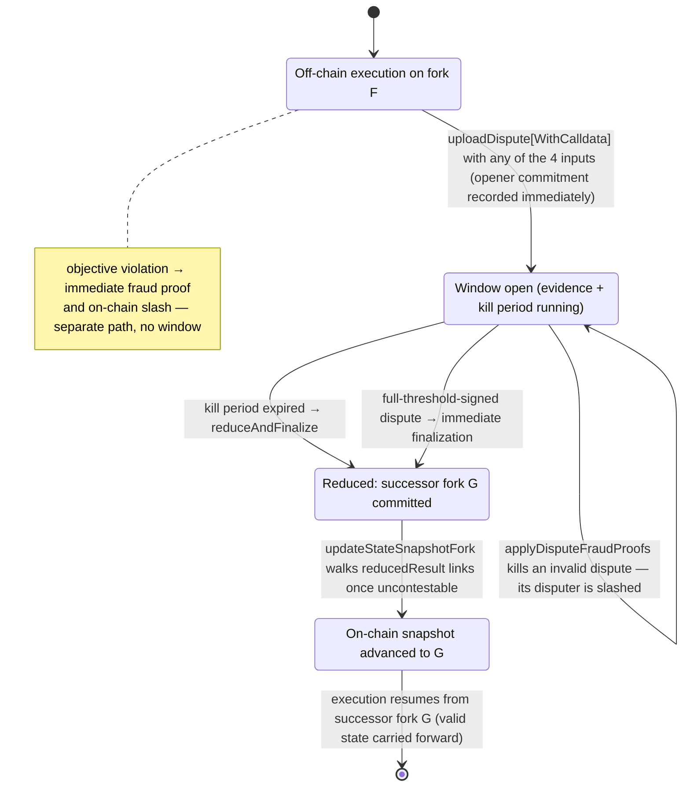

# Disputes

> **Agent status:** Maintained reverse-engineered draft.
> **Engineer verification:** Pending.
> **Status:** Draft; pending engineer verification.
> **Scope:** Defines the implementation-neutral disputes behavior, assumptions, constraints, security properties, and black-box test plan.

---

## Contents

- [Purpose & observable contract](#1-purpose--observable-contract)
- [Valid dispute inputs](#2-valid-dispute-inputs)
- [On-chain data model](#3-on-chain-data-model)
- [Dispute-window lifecycle](#4-dispute-window-lifecycle)
- [Reduction rules and order-independence](#5-reduction-rules-and-order-independence)
- [Timeout precedence, ordering, and information disclosure](#6-timeout-precedence-ordering-and-information-disclosure)
- [Anti-griefing](#7-anti-griefing)
- [Assumptions and constraints](#assumptions-and-constraints)
- [Security considerations](#security-considerations)
- [Requirements and invariants](#requirements-and-invariants)
- [Verification and test plan](#verification-and-test-plan)
- [Future Work](#future-work)

## 1. Purpose & observable contract

The dispute game is the on-chain fallback when off-chain cooperation stops. It consumes a fixed
set of objective inputs, reduces them deterministically to a single canonical result, and produces
a **successor fork** from which off-chain execution resumes. Its observable contract:

- **Input.** One or more signed `Dispute` claims for a fork, each carrying a
  [state proof](./state-proofs.md) of the claimed latest state plus the dispute inputs of §2.
- **Output.** Exactly one reduced result per disputed fork: a new fork id (the hash of the
  successor fork's genesis `SnapshotData`) recorded in the fork's `DisputeWindow`. Every initiated
  dispute window MUST end in such a result — whether the individual claims were accepted, killed,
  or superseded ([`REQ-DIS-6-Y92H1M`](disputes.md#req-dis-6-y92h1m)).
- **Guarantee.** Valid transitions proven by the winning state proof are carried forward into the
  successor fork; they are not reverted because they lacked finality when the dispute began (see
  [finality.md](../protocol-model/finality.md) and [state-proofs.md](./state-proofs.md)).
- **Not guaranteed.** The game does not adjudicate subjective behavior, does not execute block
  fraud proofs as part of reduction (see [fraud-proofs.md](./fraud-proofs.md)), and does not bound
  wall-clock latency below the configured evidence/kill periods.

## 2. Valid dispute inputs

The complete set of valid dispute inputs is exactly:

1. **Participant timeout** — the deterministically scheduled next author failed to produce its
   block in time (`DisputeInput.timeout`, §6).
2. **Accumulated valid on-chain slashes** — participants already recorded in the on-chain slash
   set (`DisputeInput.onChainSlashes`). The dispute _references_ recorded slashes; it does not
   prove violations itself.
3. **Voluntary self-removal** — the disputer elects to exit through the dispute path
   (`DisputeInput.selfRemoval`).
4. **Forced inclusion of a newer inbound message** — the on-chain inbound stream has advanced past
   the channel's applied inbound tip and peers did not include it
   (`DisputeInput.latestInboundMessageBlockHash` / `lastInboundMessageBlockHeight` newer than the
   latest state's inbound tip; see [cross-layer-messages.md](../settlement/cross-layer-messages.md)).

Fraud proofs are **not** a dispute input mechanism. An objective violation is proven on the
separate immediate path in [fraud-proofs.md](./fraud-proofs.md); a successful proof adds the
offender to the on-chain slash set, and the slash set is what disputes consume (input 2). The
dispute game never re-executes the underlying violation evidence.

A dispute stating none of the four inputs is itself objectively invalid. The
`InvalidDisputeReason` dispute fraud proof kills such a
dispute and slashes its disputer ([`REQ-DIS-1-XAJ1VA`](disputes.md#req-dis-1-xaj1va)). A listed on-chain slash counts as a reason only
while every listed participant is still in the latest state's participant set — already-removed
participants cannot justify a new dispute.

**Assumptions & dependencies.** Chain liveness and at least one honest, chain-connected
participant or watchtower per [trust-model.md](../security/trust-model.md); correct
[chain-time tracking](../protocol-model/time.md) for all period arithmetic; the state-proof verification rules of
[state-proofs.md](./state-proofs.md).

## 3. On-chain data model

Field-level detail: [../reference/data-types.md](../protocol-model/data-types.md).

| Type                                                                         | Role                                                                                                                                                                                                                                                                                                       |
| ---------------------------------------------------------------------------- | ---------------------------------------------------------------------------------------------------------------------------------------------------------------------------------------------------------------------------------------------------------------------------------------------------------- |
| `Dispute` = `DisputeInput` + `postedAuditingData` + `outputSnapshotDataHash` | The claim: channel, `forkId` (hash of the disputed fork's genesis `SnapshotData`), latest state snapshot hash, inbound tip, `StateProof`, listed on-chain slashes, auditing-data hash, disputer, optional `Timeout`, optional `selfRemoval`, plus the disputer-computed hash of the output `SnapshotData`. |
| `SignedDispute` / `DisputeConfirmation`                                      | The encoded dispute signed by the disputer, plus co-signatures. A full-threshold confirmation finalizes immediately (§4.3).                                                                                                                                                                                |
| `DisputeWindow`                                                              | Per-fork window: `evidence` (creation timestamp, last-evidence timestamp, dispute commitments, who has posted) and `reducedResult` (successor `forkId`, reduction timestamp, reducer).                                                                                                                     |
| `DisputeAuditingData`                                                        | The heavy audit payload (genesis snapshot data, latest and milestone snapshots, latest finalized state-machine state, inbound/outbound message blocks). Committed by hash in the dispute; posted as calldata only when required (§4.1).                                                                    |
| `ReduceOutput`                                                               | The folded result of all committed disputes: latest block, slashed participants, inbound tip, the single surviving `Timeout`, self-removals.                                                                                                                                                               |
| `DisputeData`                                                                | Per-channel storage: the on-chain slash set (owned by the fraud-proof path — see [fraud-proofs.md §4](./fraud-proofs.md)), the per-fork `DisputeWindow` map, and the disputed-fork list.                                                                                                                   |

## 4. Dispute-window lifecycle

An uploaded dispute records the opener's commitment **immediately**, and the kill period is the
interval in which an invalid _committed_ dispute can be challenged with a dispute fraud proof and
killed.

The fraud-proof path (the note on the first state) runs beside the game at all times: a slash
recorded before a window's expiry becomes reduction input for that window; a slash recorded later
feeds the next dispute.

### 4.1 Upload

`uploadDispute` / `uploadDisputeWithCalldata`
(`DisputeManagerFacet`):

- The named `disputer` is the logical submission actor and MUST be dispute-eligible
  (`canParticipateInDisputes`: in the snapshot-or-pending participant union and not in the
  on-chain slash set). A transaction is **direct** when `msg.sender` is the named disputer, and
  **delegated** when `msg.sender` is that disputer's frozen selected tower with a verifying tower
  signature ([`REQ-DIS-15-GH01J0`](disputes.md#req-dis-15-gh01j0)); the tower is only the
  transport sender, never the accounting actor. Excluding
  on-chain-slashed participants is a current-eligibility rule for point-in-time chain decisions
  only — it never applies to historical proof thresholds
  ([finality.md §6](../protocol-model/finality.md)).
- If the dispute's last milestone is not provably final on its own, the full
  `DisputeAuditingData` MUST be posted as calldata (`postedAuditingData = true`,
  hash-checked against `disputeAuditingDataHash`); otherwise the cheap no-calldata variant is
  allowed. The off-chain deployment configuration decides this via `isLastMilestoneFinalByEveryone`
  (`the corresponding dispute-coordination operation`).
- Timeout race-condition checks run before acceptance (§6.3).
- **Throttle:** a named disputer gets at most one upload per `evidenceTime` per channel
  (`disputerThrottle`), and at most one dispute per window (`hasPosted`) — both keyed by the named
  disputer, whether the transaction was direct or delegated, so one shared tower can submit once
  for each of its represented participants but never twice for the same one
  ([`REQ-DIS-2-PKVZ7E`](disputes.md#req-dis-2-pkvz7e)).
- The first upload for a fork creates the `DisputeWindow`: `creationTimestamp = now` starts the
  **evidence period**; `lastEvidenceSubmissionTimestamp = now` starts the **kill period**. The
  opener's dispute commitment (`keccak256(abi.encode(dispute))`) is pushed immediately.
- Later uploads are accepted while the evidence period (`creationTimestamp + evidenceTime`) has
  not expired — or, as a special case, whenever the window has zero commitments (every prior
  commitment was killed), so a fully-killed window reopens for new evidence. Each accepted upload
  resets the kill period.

### 4.3 Reduction and finalization

Reduction requires the kill period to be expired (enforced in `_commitToDisputeReducedResult`)
and consumes **the exact committed dispute set** (`areDisputesCommitted` matches the provided
array one-to-one against the stored commitments, in commitment order) ([`REQ-DIS-4-6J6YYG`](disputes.md#req-dis-4-6j6yyg)). Entry points
on `dispute reducer/verifier`:

- `reduce(disputes)` — folds the committed set to a `ReduceOutput` (§5; not a pure fold today —
  two fields read chain state, and whether they should is the open decision
  [`OQ-39-C3EAMN`](../open-questions.md#oq-39-c3eamn)).
- `reduceOutputToSnapshotData(...)` — verifies the claimed latest snapshot, state-machine state,
  and inbound message blocks against the reduce output, applies slashes/removals/inbound messages
  through the state machine, and produces the successor fork's genesis `SnapshotData`
  (`computeDisputeOutputSnapshotData` / `generateDisputeOutputState` are the per-dispute
  equivalents used to forge and audit `outputSnapshotDataHash`).
- `reduceAndFinalize(disputes, ..., expectedReducedForkId)` — recomputes the reduction, requires
  it to match the caller's expectation, and commits `winningForkId =
keccak256(abi.encode(outputSnapshotData))` as the window's `reducedResult`. Idempotent: if a
  result is already committed it succeeds only when the expectation matches.
- Threshold shortcut: a dispute confirmed by the full on-chain threshold set finalizes at upload —
  both window timestamps are back-dated by `evidenceTime` (forcing evidence and kill periods
  expired), prior commitments are deleted, and the dispute's own `outputSnapshotDataHash` is
  committed as the reduced result. A timeout dispute against an offline target can reach this
  shortcut without the target: a valid `WatchtowerDisputeApproval` from the target's selected
  tower counts as the target's signature for that exact signed dispute (§6.4,
  [`REQ-DIS-14-032T4M`](disputes.md#req-dis-14-032t4m)).

`For this protocol version:` every commit path passes `reductionTimestamp = now − evidenceTime`, so the
reduce-challenge period (`_isReduceChallengePeriodExpired`:
`now >= reducedResult.timestamp + evidenceTime`) is already expired at commit time. Because the
reduction is recomputed on-chain from the committed set, the result is objectively correct at
commit and finalization is immediate — gas is traded for latency. Consequently
`challengeDisputeReduction` (which requires a _non-expired_ challenge period, and on a successful
challenge slashes the previous reducer and re-commits, or slashes the challenger on a failed one)
is unreachable from any current commit path.

**Open question:** whether `challengeDisputeReduction` is intentionally dormant scaffolding for
the optimistic-reduction design (Future Work, review item on optimistic commitment) or dead code
to remove. `Intended:` under the optimistic design the reduced result would be committed as a bare
hash with a real challenge period; the current immediate-finalization behavior would become the
fast path. Tracked as [`OQ-40-M12S72`](../open-questions.md#oq-40-m12s72).

### 4.4 Successor fork and snapshot advancement

Every reduction produces the canonical successor fork ([`REQ-DIS-6-Y92H1M`](disputes.md#req-dis-6-y92h1m)):

- The successor fork's identity is the hash of its genesis `SnapshotData` — the reduced output
  snapshot. Its genesis timestamp is defined as the origin window's kill-period end
  (`getGenesisTimestamp` in
  `common adjudication logic`).
- The output carries forward the latest valid proved state: the winning latest block's state, plus
  deterministically applied slashes, removals (timeout/self-removal), and pending inbound
  messages. Rejected claims do not prevent the fork — a killed dispute simply contributes nothing
  except its disputer's slash, which the reduction then consumes.
- Off-chain execution resumes from the successor fork's genesis
  (`ReductionManager` schedules the
  reduction attempt at kill-period end and restarts the channel on the reduced fork).
- The on-chain snapshot advances by `updateStateSnapshotFork`
  (`StateSnapshotFacet`):
  starting at the current snapshot's fork, it follows the chain of `reducedResult.forkId` links,
  requiring each link's reduce-challenge period to be expired (i.e. the result is no longer
  contestable), verifies the target genesis snapshot and its genesis timestamp, then processes the
  proven outbound message-block range incrementally (withdrawals released; see
  [cross-layer-messages.md](../settlement/cross-layer-messages.md)) ([`REQ-DIS-9-64WHCD`](disputes.md#req-dis-9-64whcd)). Multiple dispute
  generations can therefore be crossed in one snapshot update.

## 5. Reduction rules and order-independence

`reduce(disputes)` folds the committed set into one `ReduceOutput`. Exact per-field rules
(`For this protocol version:`):

| Field                                  | Rule                                                                                                                                                                                                                                                                                                                                                                                                           |
| -------------------------------------- | -------------------------------------------------------------------------------------------------------------------------------------------------------------------------------------------------------------------------------------------------------------------------------------------------------------------------------------------------------------------------------------------------------------- |
| `latestBlock`                          | The block with the highest `transactionCnt` among each dispute's state-proof latest block; ties broken by the smaller block hash. Disputes with empty state proofs (genesis claims) contribute no block. This selects the longest valid proved history — the mechanism that carries non-final valid transitions into canonical reality (see [state-proofs.md](./state-proofs.md)).                             |
| `slashedParticipants`                  | Set union (deduplicated, capacity = snapshot ∪ pending participant count) of: (a) the channel's on-chain slash set filtered to entries with `timestamp ≤` window expiry and to members of the snapshot ∪ pending union; (b) every dispute's listed `onChainSlashes`. Subset-listing per dispute is safe because (a) independently injects the authoritative set (see [fraud-proofs.md §4](./fraud-proofs.md)). |
| `latestInboundMessageBlockHash/Height` | Taken from the chain itself, not from any dispute: the on-chain inbound tip walked back until its timestamp `≤` window expiry. This is what makes forced inbound inclusion effective.                                                                                                                                                                                                                          |
| `timeout`                              | The single timeout with the lowest `blockHeight` across disputes (§6.1).                                                                                                                                                                                                                                                                                                                                       |
| `selfRemovals`                         | The disputers of all disputes with `selfRemoval` set.                                                                                                                                                                                                                                                                                                                                                          |

Note the fold is stateful in exactly two fields — `slashedParticipants` injects the channel's
authoritative on-chain slash set, and `latestInboundMessageBlockHash/Height` is read from the
chain itself; every other field reduces the committed dispute inputs alone. Whether reduction
should stay stateful against on-chain state or become a stateless fold over the committed inputs
(with the slash-completeness and forced-inclusion guarantees re-established elsewhere) is an open
engineer decision ([`OQ-39-C3EAMN`](../open-questions.md#oq-39-c3eamn)).

`reduceOutputToSnapshotData` then applies, in order: pending inbound messages (joins etc.),
slashes, removals — where the timeout target is added to removals **only if the slash set is
empty** (§6.1) — and emits one outbound message block containing the resulting `ExitChannel`s
with a zero timestamp for determinism.

**Convergence requirement ([`INV-DIS-5-J1QZ92`](disputes.md#inv-dis-5-j1qz92)).** `Intended:` the dispute process MUST converge to the
same successor fork regardless of the order in which valid dispute inputs are applied, even though
the chain serializes transactions. The implemented fold is built from operators that are
order-insensitive in isolation — max-with-deterministic-tie-break, set union, min, and a
chain-derived inbound tip — but the committed set's order is **not** fixed: killing a commitment
removes it by swapping the last entry into its slot
(`_killDispute`),
and `DisputeUtils.areDisputesCommitted`
matches the reducer's input array positionally against that post-kill order. Order-sensitive
consumers exist: slash entries are appended and applied to the state machine in array order
(`_applySlashesToStateMachine`), so application order can change the serialized output state and
therefore the successor `forkId`; and the implemented timeout fold's empty-timeout cancellation
(below — a defect against the resolved timeout rule; the decided fold, a min over real timeout
claims only, is order-insensitive) makes the _last_ alternation win. So the ordering freedom is not limited to which disputes are
committed before the window closes — kills perturb the canonical order itself. Candidate
directions: canonicalize (sort) the survivor set before reduction, or prove and permutation-test
order independence including slash-application order. This specification does not call the
mechanism CRDT-like: that label would require stating and proving the convergence properties.
Neither a proof nor permutation tests exist. Verification: required downstream coverage (permutation,
adversarial-interleaving with kills, and on-chain integration tests required before this
invariant can be marked verified). Tracked as [`OQ-4-JGDCNX`](../../verification/open-questions.md#oq-4-jgdcnx).

**Observed divergence (partially resolved).** In `reduce`, the timeout fold replaces the current
candidate whenever `dispute.input.timeout.blockHeight < reducedOutput.timeout.blockHeight`
without checking that the candidate's `participant` is set. An empty timeout has
`blockHeight = 0`, so any committed dispute _without_ a timeout resets the fold's timeout to
empty, suppressing a real timeout carried by another dispute (except at genesis height 0).
**Resolved (2026-08-14, engineer decision):** only a slash cancels a proposed timeout. A
reduction that slashes someone applies no timeout — for a slash-carrying dispute the suppression
is intended, and the fold's reset is immaterial to the applied removals because slash precedence
([`INV-DIS-7-9GGZSD`](disputes.md#inv-dis-7-9ggzsd), §6.1) already withholds the timeout removal
at output. A dispute with _no_ slashes and no timeout claim (a self-removal-only dispute, or the
timed-out participant's own counter-dispute proving liveness) does **not** cancel the proposed
timeout: such inputs leak no information the timed-out participant could not already have known
or that is relevant to it, so they cannot legitimize ignoring the missed slot — the
lowest-real-height rule of §6.1 stands, and empty timeout structs do not participate in the
fold. The implemented fold's empty-timeout reset is therefore a defect in the slash-free case;
the fix (skip candidates with an unset `participant`) and its permutation tests are tracked
implementation-side ([`OQ-14-5C8KV7`](../../implementation/open-questions.md#oq-14-5c8kv7)).

## 6. Timeout precedence, ordering, and information disclosure

A timeout removes the scheduled author that failed to act — deterministic authoring means the
schedule identifies exactly one accountable party per height (see [finality.md](../protocol-model/finality.md)).
`Timeout` fields: target `participant`, `blockHeight` (the missed slot; removal takes effect
there), `minTimeStamp`, `isForced`, and optional previous-block-producer context.

### 6.1 Precedence rules

- **Slashes suppress timeouts ([`INV-DIS-7-9GGZSD`](disputes.md#inv-dis-7-9ggzsd)).** In a fork whose reduction contains any slashes,
  timeout removal is not applied, even if the target really missed its slot
  (`reduceOutputToSnapshotData`: timeout added to removals only when
  `slashedParticipants.length == 0`; mirrored per-dispute in `_calculateRemovals`). Rationale:
  if the timeout still applied, an attacker could remove an honest participant at the cost of a
  slash — buying an eviction with a slashable dispute. With suppression the attacker is simply
  slashed and no timeout applies.
- **At most one timeout per fork, at the lowest timed-out height ([`INV-DIS-8-1GY6Q5`](disputes.md#inv-dis-8-1gy6q5)).** The protocol is
  totally ordered: a later author may be unable to act only because an earlier author never
  produced its block, so a timeout may not skip ahead and penalize the later participant. Multiple
  apparent missed slots reduce to the earliest one. Only real timeout claims (a set
  `participant`) participate in the selection: a slash-free dispute with no timeout claim does
  **not** cancel a proposed timeout, because it leaks no information relevant to the timed-out
  participant (resolved 2026-08-14, [`OQ-9-XR1MFS`](../open-questions.md#oq-9-xr1mfs)).
  `For this protocol version:` implemented as the min-`blockHeight` fold of §5; the implemented
  fold's empty-timeout reset violates the slash-free rule and its fix is tracked in
  [`OQ-14-5C8KV7`](../../implementation/open-questions.md#oq-14-5c8kv7).
- Self-removals always apply; they are independent of timeout precedence.

### 6.2 Information-disclosure safety

Submitting a timeout dispute forces the submitter to make its view available on-chain (the
dispute, its state proof, and — when the last milestone is not self-evidently final — the full
auditing data as calldata; the target's watchtower reads it from chain events). This converts
incomplete-information attacks into evidence against the attacker:

- If the revealed data exposes a double-sign or another objective violation by the submitting
  group, the resulting fraud proof produces a slash — and by [`INV-DIS-7-9GGZSD`](disputes.md#inv-dis-7-9ggzsd) the slash suppresses the
  proposed timeout.
- If the revealed data shows an earlier missed slot on the canonical history, the reduction
  selects that earlier timeout instead ([`INV-DIS-8-1GY6Q5`](disputes.md#inv-dis-8-1gy6q5)).
- If the "timed-out" block actually exists — signed by threshold, posted as calldata in time, or
  acknowledged by the disputer's own side through a `BlockConfirmationReceipt` (§6.4) — the dispute
  is killed and its disputer slashed via the `Timeout*` dispute fraud proofs
  ([fraud-proofs.md §3](./fraud-proofs.md)).

**Cross-view semantics (resolved 2026-08-14, engineer decision, [`OQ-9-XR1MFS`](../open-questions.md#oq-9-xr1mfs)):**

- **"Fork" means a `forkId`** — a reality that prevails out of the dispute game after a genesis —
  never divergent block histories inside one `forkId`. Leader election is deterministic as a
  function of state, so exactly one block can be produced for a given state: divergent histories
  of one `forkId` imply a double-sign by construction.
- **Fork choice inside a `forkId` is longest-chain:** the reduction's `latestBlock` rule (§5)
  selects the longest proved history. A submitter who brings a divergent history to the dispute
  game thereby discloses the double-sign; the resulting fraud-proof slash suppresses any timeout
  ([`INV-DIS-7-9GGZSD`](disputes.md#inv-dis-7-9ggzsd)), making the cross-history comparison moot. Comparing raw
  `transactionCnt`/`blockHeight` values is therefore sound: candidates either lie on one chain,
  where the comparison is meaningful, or their conflict is slashable double-sign evidence.
- **Evidence availability needs no finer definition.** Evidence changes an already-proposed
  timeout only through the two existing mechanisms — the slash set consumed at reduction time, or
  killing the dispute during the kill period — and that is intended. Non-slash inputs leak
  nothing the timed-out participant could not already have known or that is relevant to it, so
  the moment they become observable is immaterial to the timeout.

### 6.3 Timeout validity conditions

A timeout claim is objectively falsifiable; the checks live at upload
(`_disputeRaceConditionCheck`) and in the `Timeout*` dispute fraud proofs
(`DisputeFraudProofFacet`):

- **Upload-time race checks** (skipped when `isForced` — used when the target committed to a
  block not linked to the latest state but deviation cannot be directly proven): reverts if the
  target already posted calldata for the timed-out height, if the stated previous-producer
  calldata expectation mismatches chain state, if `now < minTimeStamp`, or if the dispute window
  was created before `minTimeStamp` ([`REQ-DIS-10-SAHJBN`](disputes.md#req-dis-10-sahjbn)). A
  timeout carrying a valid `AfkAttestation` is exempt from the already-posted-calldata revert
  (§6.4, [`REQ-DIS-13-1WWHS0`](disputes.md#req-dis-13-1wwhs0)).
- **Deadline (`TimeoutTooEarly`):** the window creation timestamp MUST be `≥ previousTimestamp +
firstBlockGrace + p2pTime + agreementTime + chainFallbackTime`, where `previousTimestamp` is
  the latest proved block's timestamp (or the fork's genesis timestamp, adding
  `firstBlockGrace = evidenceTime` for the first block), replaced by the on-chain posting
  timestamp when the previous block was posted as calldata — unless the target itself signed the
  previous block, which forfeits the extra on-chain time. A valid `BlockConfirmationReceipt` from a
  receiving side forfeits that side's extra time the same way its own confirmation would (§6.4).
  A timeout carrying a valid `AfkAttestation` from the target's selected tower drops the
  `chainFallbackTime` term (§6.4, [`REQ-DIS-13-1WWHS0`](disputes.md#req-dis-13-1wwhs0)). See
  [time.md](../protocol-model/time.md) for the time model.
- **Linkage (`TimeoutNotLinkedToLatestState`):** the timeout height MUST be exactly the latest
  proved block's height + 1 (or 0 at genesis).
- **Schedule (`TimeoutParticipantNotNext`):** the target MUST be `getNextToWrite` of the latest
  proved state.
- **Existence (`TimeoutThreshold`, `TimeoutCalldataPosted`):** the block MUST NOT exist as a
  threshold-signed block, nor as timely-posted, valid on-chain calldata by the target, nor as a
  block the disputer's own side acknowledged through a valid `BlockConfirmationReceipt` (§6.4,
  [`REQ-DIS-11-JJ9FG3`](disputes.md#req-dis-11-jj9fg3)). `TimeoutCalldataPosted` is not a valid
  kill for a timeout admitted with a valid `AfkAttestation`
  ([`REQ-DIS-13-1WWHS0`](disputes.md#req-dis-13-1wwhs0)).

A validated timeout feeds `removeParticipant` on the state machine during output generation,
producing an `ExitChannel` on the outbound stream.

### 6.4 Delegated watchtower evidence

A participant may delegate availability evidence and dispute-finality approval to one selected,
staked watchtower; the tower model, artifact bindings, duties, and misconduct boundary are owned by
[runtime/watchtowers.md](../runtime/watchtowers.md)
([`REQ-WT-3-DT0GDX`](../runtime/watchtowers.md#req-wt-3-dt0gdx)). The dispute-side rules are:

- **Receipt as a third timeout defense ([`REQ-DIS-11-JJ9FG3`](disputes.md#req-dis-11-jj9fg3)).** A
  valid `BlockConfirmationReceipt` crediting the timeout disputer — signed by the disputer itself,
  or by the disputer's frozen selected tower over the exact block — proves the disputer's own side
  received the block, so its timeout is objectively wrong: the dispute is killed and the disputer
  bears the existing penalty, exactly as with a threshold signature or timely calldata. Any holder
  of the receipt may submit it while the dispute runs. For availability only, a receipt credit is
  equivalent to that participant having acknowledged the exact block: it forfeits that
  participant's additional chain-fallback time and does not create a new timestamp anchor. A
  malformed, wrong-signer, wrong-tower, wrong-epoch, wrong-slot, or unavailable receipt proves
  nothing and leaves the existing calldata and ordinary timeout route intact. If the disputer's
  tower received the block but failed to relay it locally
  ([`REQ-WT-6-B6TJXS`](../runtime/watchtowers.md#req-wt-6-b6tjxs)), the disputer bears its own
  tower choice; that service failure is subjective. Whether a disputer should first obtain its own
  tower's signed non-receipt is [`OQ-48-CS3JNE`](../open-questions.md#oq-48-cs3jne).
- **Receipts can replace calldata at the existing confirmation threshold
  ([`REQ-DIS-12-1ZN453`](disputes.md#req-dis-12-1zn453)).** The author applies the existing
  off-chain block-confirmation threshold over the union of the block's previous and resulting
  participant sets, with the established on-chain eligibility adjustments. Threshold accounting is
  by participant credit: a participant's own confirmation or receipt credits only that
  participant, while one tower signature over the exact block credits every eligible participant in
  the union whose frozen selected tower is the signer — the verifier derives those credits
  deterministically from the frozen assignments and deduplicates them against direct
  confirmations, so a single tower signature can satisfy the full threshold when every eligible
  participant delegated to it. At the threshold the author may skip calldata, and the next
  author's deadline stays anchored to the timestamp from which this author produced the block.
  Credits race the author's own calldata submission, not a deadline comparator: the author may
  count any credit that arrives before it submits calldata; once calldata is posted, the ordinary
  fallback and its anchor stand — the safe route for an unavailable, refusing, or late
  receiver-side tower — and a later-arriving signature forfeits the additional chain-fallback time
  of every participant it credits (its own for a participant signature, every credited eligible
  assigned participant for a tower signature) while still-unconfirmed, uncredited sides keep their
  extra time. A late tower signature alone is a service defect, never objectively contradictory
  fraud.
- **An AFK attestation admits an early timeout and waives the target's calldata grace
  ([`REQ-DIS-13-1WWHS0`](disputes.md#req-dis-13-1wwhs0)).** A valid `AfkAttestation` from the
  target's assignment-epoch tower, carried in the committed timeout input and validated on-chain
  (tower binding, participant, channel, fork, height, epoch, signature), makes the timeout
  submittable after the deadline without the `chainFallbackTime` term. The valid attestation
  delegates and waives the target's calldata grace for that slot: the verifier ignores calldata
  already posted for the target slot (the upload-time already-posted-calldata revert is exempt),
  and a `TimeoutCalldataPosted` proof is not a valid kill for that timeout — whether the calldata
  was posted before or after the upload, and whether or not the tower later approves immediate
  finality. The protocol cannot objectively order an off-chain attestation against calldata, so
  this is an intentional selected-tower trust boundary
  ([`REQ-WT-4-PNMYMP`](../runtime/watchtowers.md#req-wt-4-pnmymp)). Invalid-attestation rejection,
  threshold confirmation (`TimeoutThreshold`), and a valid acknowledgement crediting the disputer
  remain available defenses; invalidity means a binding defect — an absent, forged, stale, or
  wrong-binding attestation leaves the full ordinary `TimeoutTooEarly` deadline in force — while a
  contradictory receipt from the target's own tower, signed before or after the attestation, never
  strips the attestation's dispute role: that contradiction is external bond-slashing evidence only
  ([`INV-WT-1-ST9SHX`](../runtime/watchtowers.md#inv-wt-1-st9shx)). Without any delegated evidence
  the ordinary timeout procedure applies unchanged.
- **A selected tower may submit its unavailable participant's dispute
  ([`REQ-DIS-15-GH01J0`](disputes.md#req-dis-15-gh01j0)).** The chain accepts a dispute or
  counter-dispute upload whose sender is the named disputer's frozen selected tower, signed over
  the exact encoded dispute with the registered tower key; the represented participant remains the
  disputer for eligibility, throttling, `hasPosted`, stake, slashing, and outcome purposes. A
  delegated submission MUST NOT carry `selfRemoval` or another participant-owned voluntary effect.
  Exactly one dispute per participant per disputed fork: the first-ordered valid transaction from
  the participant or its tower consumes the slot and the later duplicate reverts with a clear
  already-submitted error. The tower-side duties, abstention policy, and liability boundary are
  [`REQ-WT-9-GKFQXZ`](../runtime/watchtowers.md#req-wt-9-gkfqxz); the
  kill-versus-counter-dispute ordering of [`OQ-1-NTJBA1`](../open-questions.md#oq-1-ntjba1)
  applies unchanged.
- **A tower approval reaches immediate finality for one audited dispute
  ([`REQ-DIS-14-032T4M`](disputes.md#req-dis-14-032t4m)).** A valid `WatchtowerDisputeApproval`
  counts only as its offline participant's signature for that exact signed dispute; the remaining
  participants plus the approval reach the §4.3 immediate threshold-finality shortcut. The
  approval cannot be reused for normal blocks, another fork, another dispute, or an application
  transition. The tower's audit MUST reject a timeout dispute that is invalid, not the earliest
  eligible timeout, based on an incorrect state proof or outcome, defeated by threshold
  confirmation or a valid acknowledgement crediting the disputer, or signed by an invalid
  participant set. A valid approval
  immediately finalizes the complete output of that exact timeout dispute, including the successor
  state and balances; the offline participant has deliberately delegated this audit and has no
  later kill-period challenge, even against colluding remaining peers and a malicious selected
  tower. If the tower refuses a valid dispute, the dispute follows the ordinary lifecycle to
  expiry and settlement; the refusal is subjective non-cooperation. A missing or invalid approval
  does not restore the waived calldata grace.

## 7. Anti-griefing

Objectively invalid dispute behavior is deterred by the kill period plus slashing: an invalid
committed dispute loses its opener's stake (§4.2), an invalid dispute fraud proof self-slashes an
eligible submitter, and the upload throttle (`disputerThrottle`, one dispute per `evidenceTime`
per named disputer per channel, counting direct and delegated uploads alike) plus the
one-dispute-per-window rule bound spam from any single identity
([`REQ-DIS-2-PKVZ7E`](disputes.md#req-dis-2-pkvz7e)). The off-chain auditor preflights every dispute fraud proof (e.g.
`validateTimeoutCalldataPostedProof.staticCall` in
`DisputeValidationService`) so an
honest node never submits a self-slashing proof.

What slashing cannot deter is the _cost_ of the honest response: forcing peers to post block
calldata and dispute data on-chain has an intrinsic fee and latency price even when every actor is
punished correctly. That griefing exposure is quantified in
[../security/data-availability.md](../security/data-availability.md) and is not restated here.

## Assumptions and constraints

Dispute safety assumes an honest final chain view, available and correctly encoded proof/auditing data,
unforgeable signatures, deterministic state-machine replay, and timing windows long enough for observation and
submission. Reduction inputs are finite and bounded by deployable gas and storage limits. All participants must
derive the same validity, precedence, and canonical-successor result from the same submitted inputs regardless
of upload or processing order. Outside those assumptions the protocol cannot promise liveness, and it must fail
closed rather than advance an ambiguous snapshot.

## Security considerations

Disputes protect funds and canonical history when cooperation fails. Threats include forged or incomplete
claims, withheld auditing data, conflicting windows, timeout races, order-dependent reduction, invalid proof
submissions, griefing through large inputs, and information disclosure that changes later eligibility. Tests
must show that invalid inputs cannot mutate canonical state, a failed/aborted window leaves recoverable state,
and every accepted outcome is deterministic. Unresolved size bounds, timeout edges, and reducer eligibility are
security gaps tracked by the linked questions and audit findings.

## Requirements and invariants

**`REQ-DIS-1-XAJ1VA`.** A dispute MUST state at least one of the four valid inputs (timeout, valid on-chain slashes, self-removal, forced inbound inclusion); fraud proofs are not a dispute input.

**`REQ-DIS-2-PKVZ7E`.** Upload is limited to eligible named disputers — the named `disputer` is the logical submission actor for eligibility, `hasPosted`, `disputerThrottle`, slot, stake, slashing, and outcome; `msg.sender` is the disputer itself (direct) or its frozen selected tower (delegated). ≤1 dispute per window and one upload per `evidenceTime` are keyed per named disputer.

**`REQ-DIS-3-C4KYSF`.** An uploaded dispute records its commitment immediately; while the kill period runs, an invalid committed dispute can be killed via dispute fraud proof, slashing its disputer. (Intended rule: open question §4.2.)

**`REQ-DIS-4-6J6YYG`.** Reduction runs only after the kill period expires and consumes exactly the committed dispute set.

**`INV-DIS-5-J1QZ92`.** The reduced result is independent of the order in which valid dispute inputs are applied.

**`REQ-DIS-6-Y92H1M`.** Every initiated dispute window MUST end in a canonical successor fork (`forkId = keccak256(output SnapshotData)`, genesis timestamp = kill-period end), whether individual claims are accepted or rejected; valid state is carried forward.

**`INV-DIS-7-9GGZSD`.** In a fork whose reduction contains any on-chain slashes, timeout removal is not applied — slashes take precedence.

**`INV-DIS-8-1GY6Q5`.** A fork applies at most one timeout, targeting the participant at the lowest timed-out block height; no skipping ahead past an earlier missed slot. Only real timeout claims participate in the selection: a dispute carrying no slashes and no timeout claim MUST NOT cancel a proposed timeout.

**`REQ-DIS-9-64WHCD`.** The on-chain snapshot advances to a successor fork only along committed `reducedResult` links whose challenge periods have expired, verifying genesis identity/timestamp and processing the proven outbound range incrementally.

**`REQ-DIS-10-SAHJBN`.** Timeout claims MUST satisfy the deadline, linkage, schedule, and existence conditions of §6.3; violations are falsifiable via the `Timeout*` dispute fraud proofs and upload race checks.

**`REQ-DIS-11-JJ9FG3`.** A valid `BlockConfirmationReceipt` crediting the timeout disputer — signed by the disputer or by the disputer's frozen selected tower over the exact block — is a third timeout defense beside threshold confirmation and timely calldata: submitted by any holder while the dispute runs, it kills the dispute and the disputer bears the existing penalty. A receipt credit forfeits that participant's additional chain-fallback time and creates no new timestamp anchor; every malformed, wrong-signer, wrong-tower, wrong-epoch, wrong-slot, or unavailable receipt proves nothing.

**`REQ-DIS-12-1ZN453`.** An author meeting the existing off-chain block-confirmation threshold — over the union of the block's previous and resulting participant sets, with the established on-chain eligibility adjustments, accounted by deduplicated participant credits where a participant's own signature credits only itself and one tower signature over the exact block credits every eligible participant whose frozen selected tower is the signer — MAY skip calldata; the next author's deadline stays anchored to the block's own timestamp. Credits count if they arrive before the author submits calldata; once calldata is posted within the existing chain-fallback window it supplies the normal new anchor, and a later-arriving signature forfeits the additional chain-fallback time of every participant it credits (its own for a participant signature, every credited eligible assigned participant for a tower signature) while uncredited participants keep theirs.

**`REQ-DIS-13-1WWHS0`.** A timeout carrying a valid `AfkAttestation` from the target's assignment-epoch tower, validated on-chain for tower binding, participant, channel, fork, height, epoch, and signature, is submittable after the §6.3 deadline without the `chainFallbackTime` term, and the attestation waives the target's calldata grace for that slot: the already-posted-calldata upload revert is exempt and `TimeoutCalldataPosted` is not a valid kill, regardless of calldata order and of later approval. Invalid-attestation rejection, `TimeoutThreshold`, and the disputer's own valid receipt remain available defenses; an absent or invalid attestation leaves the full ordinary deadline in force.

**`REQ-DIS-15-GH01J0`.** A dispute or counter-dispute upload is also accepted when its sender is the named disputer's frozen selected tower, signed over the exact encoded dispute with the registered tower key; the represented participant remains the disputer for eligibility, throttling, `hasPosted`, stake, slashing, and outcome purposes, and the submission MUST NOT carry a participant-owned voluntary effect such as `selfRemoval`. Exactly one dispute per participant per disputed fork: the first-ordered valid transaction from the participant or its selected tower consumes the slot, and the later duplicate MUST revert with a clear already-submitted error.

**`REQ-DIS-14-032T4M`.** A valid `WatchtowerDisputeApproval` counts only as its offline participant's signature for that exact signed dispute and, with the remaining participants' signatures, reaches the §4.3 immediate threshold-finality shortcut, finalizing the complete dispute output with no later kill-period challenge. The tower's audit MUST reject invalid, non-earliest, wrong-output, disputer-credit-defeated, or wrongly-signed disputes; refusal leaves the ordinary lifecycle; a missing or invalid approval changes nothing and does not restore the waived calldata grace.

## Verification and test plan

Strategy per the [governance verification model](../../governance.md): the facets are exercised as
black boxes at their external entry points, the off-chain participant auditor against a live chain, and the whole
game end-to-end including adversarial cases.

### Requirement test matrix

Each row is a planned black-box test obligation, not an additional specification requirement. The requirement remains the authority. Execute the row through public protocol inputs from every applicable pre-state defined by this document. Every required permutation has a stable `P1`…`PN` suffix under its plan item. The list is exhaustive unless it explicitly says that boundary or pairwise representatives are sufficient; an omitted permutation needs an engineer-approved rationale.

| Plan item                                               | Requirements / invariants                            | Setup and stimulus                                                                                                                                                                                                                                  | Expected result                                                                                                                                                                                                                                                                                                                                                                                                                | Required permutations                                                                                                                                                                                                                                                                                                                                                                                                                                                                                                                                                                                                                                                                                                                                                                                                                                                                                                                                                                                                                                                                                                                                                                                                                                                                                                                                                                                                                                                                                                                                                                                                                                                                                                                                                                                                                                                                                                                                          |
| ------------------------------------------------------- | ---------------------------------------------------- | --------------------------------------------------------------------------------------------------------------------------------------------------------------------------------------------------------------------------------------------------- | ------------------------------------------------------------------------------------------------------------------------------------------------------------------------------------------------------------------------------------------------------------------------------------------------------------------------------------------------------------------------------------------------------------------------------ | -------------------------------------------------------------------------------------------------------------------------------------------------------------------------------------------------------------------------------------------------------------------------------------------------------------------------------------------------------------------------------------------------------------------------------------------------------------------------------------------------------------------------------------------------------------------------------------------------------------------------------------------------------------------------------------------------------------------------------------------------------------------------------------------------------------------------------------------------------------------------------------------------------------------------------------------------------------------------------------------------------------------------------------------------------------------------------------------------------------------------------------------------------------------------------------------------------------------------------------------------------------------------------------------------------------------------------------------------------------------------------------------------------------------------------------------------------------------------------------------------------------------------------------------------------------------------------------------------------------------------------------------------------------------------------------------------------------------------------------------------------------------------------------------------------------------------------------------------------------------------------------------------------------------------------------------------------------- |
| `REQ-DIS-1-XAJ1VA.T1`   | [`REQ-DIS-1-XAJ1VA`](disputes.md#req-dis-1-xaj1va)   | Use the applicable black-box method in the verification strategy above; exercise the behavior through public inputs without implementation internals.                                                                                               | A dispute MUST state at least one of the four valid inputs (timeout, valid on-chain slashes, self-removal, forced inbound inclusion); fraud proofs are not a dispute input.                                                                                                                                                                                                                                                    | `REQ-DIS-1-XAJ1VA.T1.P1` — valid case `REQ-DIS-1-XAJ1VA.T1.P2` — before deadline `REQ-DIS-1-XAJ1VA.T1.P3` — new participant `REQ-DIS-1-XAJ1VA.T1.P4` — malformed input `REQ-DIS-1-XAJ1VA.T1.P5` — direct invalid/opposite case `REQ-DIS-1-XAJ1VA.T1.P6` — at deadline `REQ-DIS-1-XAJ1VA.T1.P7` — after deadline `REQ-DIS-1-XAJ1VA.T1.P8` — maximum honest skew `REQ-DIS-1-XAJ1VA.T1.P9` — existing participant `REQ-DIS-1-XAJ1VA.T1.P10` — removed participant `REQ-DIS-1-XAJ1VA.T1.P11` — slashed participant `REQ-DIS-1-XAJ1VA.T1.P12` — concurrent membership change `REQ-DIS-1-XAJ1VA.T1.P13` — adversarial input `REQ-DIS-1-XAJ1VA.T1.P14` — partial failure `REQ-DIS-1-XAJ1VA.T1.P15` — retry and recovery                                                                                                                                                                                                                                                                                                                                                                                                                                                                                                                                                                                                                                                  |
| `REQ-DIS-2-PKVZ7E.T1`   | [`REQ-DIS-2-PKVZ7E`](disputes.md#req-dis-2-pkvz7e)   | Use the applicable black-box method in the verification strategy above; exercise the behavior through public inputs without implementation internals.                                                                                               | Upload is limited to eligible named disputers — the named `disputer` is the logical submission actor for eligibility, `hasPosted`, `disputerThrottle`, slot, stake, slashing, and outcome; `msg.sender` is the disputer itself (direct) or its frozen selected tower (delegated). ≤1 dispute per window and one upload per `evidenceTime` are keyed per named disputer.                                                        | `REQ-DIS-2-PKVZ7E.T1.P1` — valid case `REQ-DIS-2-PKVZ7E.T1.P2` — correct identity/signature `REQ-DIS-2-PKVZ7E.T1.P3` — before deadline `REQ-DIS-2-PKVZ7E.T1.P4` — malformed input `REQ-DIS-2-PKVZ7E.T1.P5` — direct invalid/opposite case `REQ-DIS-2-PKVZ7E.T1.P6` — wrong identity/signature `REQ-DIS-2-PKVZ7E.T1.P7` — missing identity/signature `REQ-DIS-2-PKVZ7E.T1.P8` — duplicate identity/signature `REQ-DIS-2-PKVZ7E.T1.P9` — forged identity/signature `REQ-DIS-2-PKVZ7E.T1.P10` — membership boundary `REQ-DIS-2-PKVZ7E.T1.P11` — at deadline `REQ-DIS-2-PKVZ7E.T1.P12` — after deadline `REQ-DIS-2-PKVZ7E.T1.P13` — maximum honest skew `REQ-DIS-2-PKVZ7E.T1.P14` — adversarial input `REQ-DIS-2-PKVZ7E.T1.P15` — partial failure `REQ-DIS-2-PKVZ7E.T1.P16` — retry and recovery                                                                                                                                                                                                                                                                                                                                                                                                                                                                                                                               |
| `REQ-DIS-3-C4KYSF.T1`   | [`REQ-DIS-3-C4KYSF`](disputes.md#req-dis-3-c4kysf)   | Use the applicable black-box method in the verification strategy above; exercise the behavior through public inputs without implementation internals.                                                                                               | An uploaded dispute records its commitment immediately; while the kill period runs, an invalid committed dispute can be killed via dispute fraud proof, slashing its disputer. (Intended rule: open question §4.2.)                                                                                                                                                                                                            | `REQ-DIS-3-C4KYSF.T1.P1` — valid case `REQ-DIS-3-C4KYSF.T1.P2` — matching commitment `REQ-DIS-3-C4KYSF.T1.P3` — before deadline `REQ-DIS-3-C4KYSF.T1.P4` — new participant `REQ-DIS-3-C4KYSF.T1.P5` — malformed input `REQ-DIS-3-C4KYSF.T1.P6` — direct invalid/opposite case `REQ-DIS-3-C4KYSF.T1.P7` — mismatched commitment `REQ-DIS-3-C4KYSF.T1.P8` — predecessor case `REQ-DIS-3-C4KYSF.T1.P9` — genesis case `REQ-DIS-3-C4KYSF.T1.P10` — stale fork `REQ-DIS-3-C4KYSF.T1.P11` — foreign fork `REQ-DIS-3-C4KYSF.T1.P12` — at deadline `REQ-DIS-3-C4KYSF.T1.P13` — after deadline `REQ-DIS-3-C4KYSF.T1.P14` — maximum honest skew `REQ-DIS-3-C4KYSF.T1.P15` — existing participant `REQ-DIS-3-C4KYSF.T1.P16` — removed participant `REQ-DIS-3-C4KYSF.T1.P17` — slashed participant `REQ-DIS-3-C4KYSF.T1.P18` — concurrent membership change `REQ-DIS-3-C4KYSF.T1.P19` — adversarial input `REQ-DIS-3-C4KYSF.T1.P20` — partial failure `REQ-DIS-3-C4KYSF.T1.P21` — retry and recovery                                                                                                                                |
| `REQ-DIS-4-6J6YYG.T1`   | [`REQ-DIS-4-6J6YYG`](disputes.md#req-dis-4-6j6yyg)   | Use the applicable black-box method in the verification strategy above; exercise the behavior through public inputs without implementation internals.                                                                                               | Reduction runs only after the kill period expires and consumes exactly the committed dispute set.                                                                                                                                                                                                                                                                                                                              | `REQ-DIS-4-6J6YYG.T1.P1` — valid case `REQ-DIS-4-6J6YYG.T1.P2` — matching commitment `REQ-DIS-4-6J6YYG.T1.P3` — before deadline `REQ-DIS-4-6J6YYG.T1.P4` — malformed input `REQ-DIS-4-6J6YYG.T1.P5` — direct invalid/opposite case `REQ-DIS-4-6J6YYG.T1.P6` — mismatched commitment `REQ-DIS-4-6J6YYG.T1.P7` — predecessor case `REQ-DIS-4-6J6YYG.T1.P8` — genesis case `REQ-DIS-4-6J6YYG.T1.P9` — stale fork `REQ-DIS-4-6J6YYG.T1.P10` — foreign fork `REQ-DIS-4-6J6YYG.T1.P11` — at deadline `REQ-DIS-4-6J6YYG.T1.P12` — after deadline `REQ-DIS-4-6J6YYG.T1.P13` — maximum honest skew `REQ-DIS-4-6J6YYG.T1.P14` — adversarial input `REQ-DIS-4-6J6YYG.T1.P15` — partial failure `REQ-DIS-4-6J6YYG.T1.P16` — retry and recovery                                                                                                                                                                                                                                                                                                                                                                                                                                                                                                                                                                                         |
| `INV-DIS-5-J1QZ92.T1`   | [`INV-DIS-5-J1QZ92`](disputes.md#inv-dis-5-j1qz92)   | Use the applicable black-box method in the verification strategy above; exercise the behavior through public inputs without implementation internals.                                                                                               | The reduced result is independent of the order in which valid dispute inputs are applied.                                                                                                                                                                                                                                                                                                                                      | `INV-DIS-5-J1QZ92.T1.P1` — valid case `INV-DIS-5-J1QZ92.T1.P2` — matching commitment `INV-DIS-5-J1QZ92.T1.P3` — new participant `INV-DIS-5-J1QZ92.T1.P4` — duplicate delivery `INV-DIS-5-J1QZ92.T1.P5` — malformed input `INV-DIS-5-J1QZ92.T1.P6` — direct invalid/opposite case `INV-DIS-5-J1QZ92.T1.P7` — mismatched commitment `INV-DIS-5-J1QZ92.T1.P8` — predecessor case `INV-DIS-5-J1QZ92.T1.P9` — genesis case `INV-DIS-5-J1QZ92.T1.P10` — stale fork `INV-DIS-5-J1QZ92.T1.P11` — foreign fork `INV-DIS-5-J1QZ92.T1.P12` — existing participant `INV-DIS-5-J1QZ92.T1.P13` — removed participant `INV-DIS-5-J1QZ92.T1.P14` — slashed participant `INV-DIS-5-J1QZ92.T1.P15` — concurrent membership change `INV-DIS-5-J1QZ92.T1.P16` — replayed delivery `INV-DIS-5-J1QZ92.T1.P17` — permuted delivery order `INV-DIS-5-J1QZ92.T1.P18` — concurrent delivery `INV-DIS-5-J1QZ92.T1.P19` — adversarial input `INV-DIS-5-J1QZ92.T1.P20` — partial failure `INV-DIS-5-J1QZ92.T1.P21` — retry and recovery                                                                                                              |
| `REQ-DIS-6-Y92H1M.T1`   | [`REQ-DIS-6-Y92H1M`](disputes.md#req-dis-6-y92h1m)   | Use the applicable black-box method in the verification strategy above; exercise the behavior through public inputs without implementation internals.                                                                                               | Every initiated dispute window MUST end in a canonical successor fork (`forkId = keccak256(output SnapshotData)`, genesis timestamp = kill-period end), whether individual claims are accepted or rejected; valid state is carried forward.                                                                                                                                                                                    | `REQ-DIS-6-Y92H1M.T1.P1` — valid case `REQ-DIS-6-Y92H1M.T1.P2` — matching commitment `REQ-DIS-6-Y92H1M.T1.P3` — before deadline `REQ-DIS-6-Y92H1M.T1.P4` — malformed input `REQ-DIS-6-Y92H1M.T1.P5` — direct invalid/opposite case `REQ-DIS-6-Y92H1M.T1.P6` — mismatched commitment `REQ-DIS-6-Y92H1M.T1.P7` — predecessor case `REQ-DIS-6-Y92H1M.T1.P8` — genesis case `REQ-DIS-6-Y92H1M.T1.P9` — stale fork `REQ-DIS-6-Y92H1M.T1.P10` — foreign fork `REQ-DIS-6-Y92H1M.T1.P11` — at deadline `REQ-DIS-6-Y92H1M.T1.P12` — after deadline `REQ-DIS-6-Y92H1M.T1.P13` — maximum honest skew `REQ-DIS-6-Y92H1M.T1.P14` — adversarial input `REQ-DIS-6-Y92H1M.T1.P15` — partial failure `REQ-DIS-6-Y92H1M.T1.P16` — retry and recovery                                                                                                                                                                                                                                                                                                                                                                                                                                                                                                                                                                                         |
| `INV-DIS-7-9GGZSD.T1`   | [`INV-DIS-7-9GGZSD`](disputes.md#inv-dis-7-9ggzsd)   | Use the applicable black-box method in the verification strategy above; exercise the behavior through public inputs without implementation internals.                                                                                               | In a fork whose reduction contains any on-chain slashes, timeout removal is not applied — slashes take precedence.                                                                                                                                                                                                                                                                                                             | `INV-DIS-7-9GGZSD.T1.P1` — valid case `INV-DIS-7-9GGZSD.T1.P2` — matching commitment `INV-DIS-7-9GGZSD.T1.P3` — before deadline `INV-DIS-7-9GGZSD.T1.P4` — new participant `INV-DIS-7-9GGZSD.T1.P5` — direct invalid/opposite case `INV-DIS-7-9GGZSD.T1.P6` — mismatched commitment `INV-DIS-7-9GGZSD.T1.P7` — predecessor case `INV-DIS-7-9GGZSD.T1.P8` — genesis case `INV-DIS-7-9GGZSD.T1.P9` — stale fork `INV-DIS-7-9GGZSD.T1.P10` — foreign fork `INV-DIS-7-9GGZSD.T1.P11` — at deadline `INV-DIS-7-9GGZSD.T1.P12` — after deadline `INV-DIS-7-9GGZSD.T1.P13` — maximum honest skew `INV-DIS-7-9GGZSD.T1.P14` — existing participant `INV-DIS-7-9GGZSD.T1.P15` — removed participant `INV-DIS-7-9GGZSD.T1.P16` — slashed participant `INV-DIS-7-9GGZSD.T1.P17` — concurrent membership change                                                                                                                                                                                                                                                                                                                                                                                                                                                                                 |
| `INV-DIS-8-1GY6Q5.T1`   | [`INV-DIS-8-1GY6Q5`](disputes.md#inv-dis-8-1gy6q5)   | Use the applicable black-box method in the verification strategy above; exercise the behavior through public inputs without implementation internals.                                                                                               | A fork applies at most one timeout, targeting the participant at the lowest timed-out block height; no skipping ahead past an earlier missed slot.                                                                                                                                                                                                                                                                             | `INV-DIS-8-1GY6Q5.T1.P1` — valid case `INV-DIS-8-1GY6Q5.T1.P2` — matching commitment `INV-DIS-8-1GY6Q5.T1.P3` — correct identity/signature `INV-DIS-8-1GY6Q5.T1.P4` — before deadline `INV-DIS-8-1GY6Q5.T1.P5` — direct invalid/opposite case `INV-DIS-8-1GY6Q5.T1.P6` — mismatched commitment `INV-DIS-8-1GY6Q5.T1.P7` — predecessor case `INV-DIS-8-1GY6Q5.T1.P8` — genesis case `INV-DIS-8-1GY6Q5.T1.P9` — stale fork `INV-DIS-8-1GY6Q5.T1.P10` — foreign fork `INV-DIS-8-1GY6Q5.T1.P11` — wrong identity/signature `INV-DIS-8-1GY6Q5.T1.P12` — missing identity/signature `INV-DIS-8-1GY6Q5.T1.P13` — duplicate identity/signature `INV-DIS-8-1GY6Q5.T1.P14` — forged identity/signature `INV-DIS-8-1GY6Q5.T1.P15` — membership boundary `INV-DIS-8-1GY6Q5.T1.P16` — at deadline `INV-DIS-8-1GY6Q5.T1.P17` — after deadline `INV-DIS-8-1GY6Q5.T1.P18` — maximum honest skew `INV-DIS-8-1GY6Q5.T1.P19` — slash-free dispute without a timeout claim leaves the lowest real timeout applied                                                                                                                                                                                                         |
| `REQ-DIS-9-64WHCD.T1`   | [`REQ-DIS-9-64WHCD`](disputes.md#req-dis-9-64whcd)   | Use the applicable black-box method in the verification strategy above; exercise the behavior through public inputs without implementation internals.                                                                                               | The on-chain snapshot advances to a successor fork only along committed `reducedResult` links whose challenge periods have expired, verifying genesis identity/timestamp and processing the proven outbound range incrementally.                                                                                                                                                                                               | `REQ-DIS-9-64WHCD.T1.P1` — valid case `REQ-DIS-9-64WHCD.T1.P2` — matching commitment `REQ-DIS-9-64WHCD.T1.P3` — correct identity/signature `REQ-DIS-9-64WHCD.T1.P4` — before deadline `REQ-DIS-9-64WHCD.T1.P5` — duplicate delivery `REQ-DIS-9-64WHCD.T1.P6` — direct invalid/opposite case `REQ-DIS-9-64WHCD.T1.P7` — mismatched commitment `REQ-DIS-9-64WHCD.T1.P8` — predecessor case `REQ-DIS-9-64WHCD.T1.P9` — genesis case `REQ-DIS-9-64WHCD.T1.P10` — stale fork `REQ-DIS-9-64WHCD.T1.P11` — foreign fork `REQ-DIS-9-64WHCD.T1.P12` — wrong identity/signature `REQ-DIS-9-64WHCD.T1.P13` — missing identity/signature `REQ-DIS-9-64WHCD.T1.P14` — duplicate identity/signature `REQ-DIS-9-64WHCD.T1.P15` — forged identity/signature `REQ-DIS-9-64WHCD.T1.P16` — membership boundary `REQ-DIS-9-64WHCD.T1.P17` — at deadline `REQ-DIS-9-64WHCD.T1.P18` — after deadline `REQ-DIS-9-64WHCD.T1.P19` — maximum honest skew `REQ-DIS-9-64WHCD.T1.P20` — replayed delivery `REQ-DIS-9-64WHCD.T1.P21` — permuted delivery order `REQ-DIS-9-64WHCD.T1.P22` — concurrent delivery |
| `REQ-DIS-10-SAHJBN.T1` | [`REQ-DIS-10-SAHJBN`](disputes.md#req-dis-10-sahjbn) | Use the applicable black-box method in the verification strategy above; exercise the behavior through public inputs without implementation internals.                                                                                               | Timeout claims MUST satisfy the deadline, linkage, schedule, and existence conditions of §6.3; violations are falsifiable via the `Timeout*` dispute fraud proofs and upload race checks.                                                                                                                                                                                                                                      | `REQ-DIS-10-SAHJBN.T1.P1` — valid case `REQ-DIS-10-SAHJBN.T1.P2` — matching commitment `REQ-DIS-10-SAHJBN.T1.P3` — before deadline `REQ-DIS-10-SAHJBN.T1.P4` — malformed input `REQ-DIS-10-SAHJBN.T1.P5` — direct invalid/opposite case `REQ-DIS-10-SAHJBN.T1.P6` — mismatched commitment `REQ-DIS-10-SAHJBN.T1.P7` — predecessor case `REQ-DIS-10-SAHJBN.T1.P8` — genesis case `REQ-DIS-10-SAHJBN.T1.P9` — stale fork `REQ-DIS-10-SAHJBN.T1.P10` — foreign fork `REQ-DIS-10-SAHJBN.T1.P11` — at deadline `REQ-DIS-10-SAHJBN.T1.P12` — after deadline `REQ-DIS-10-SAHJBN.T1.P13` — maximum honest skew `REQ-DIS-10-SAHJBN.T1.P14` — adversarial input `REQ-DIS-10-SAHJBN.T1.P15` — partial failure `REQ-DIS-10-SAHJBN.T1.P16` — retry and recovery                                                                                                                                                                                                                                                                                                                                                                                                                                                                                                                                                         |
| `REQ-DIS-11-JJ9FG3.T1` | [`REQ-DIS-11-JJ9FG3`](disputes.md#req-dis-11-jj9fg3) | A peer or its selected tower receives an author block, then that peer submits a timeout; vary the receipt's bindings and availability.                                                                                                              | The receiving side's receipt kills and penalizes its own timeout; an author-side-only receipt does not defend against another peer; every invalid receipt proves nothing and leaves the ordinary route intact.                                                                                                                                                                                                                 | `REQ-DIS-11-JJ9FG3.T1.P1` — disputer's own receipt kills its timeout and applies the disputer penalty `REQ-DIS-11-JJ9FG3.T1.P2` — disputer's tower receipt kills the same way `REQ-DIS-11-JJ9FG3.T1.P3` — a receipt crediting only other participants defends against none of the rest `REQ-DIS-11-JJ9FG3.T1.P4` — malformed or wrong-signer receipt proves nothing `REQ-DIS-11-JJ9FG3.T1.P5` — wrong-tower, wrong-epoch, or wrong-slot receipt proves nothing `REQ-DIS-11-JJ9FG3.T1.P6` — unavailable receipt leaves calldata and ordinary timeout intact `REQ-DIS-11-JJ9FG3.T1.P7` — a credit forfeits only that participant's chain-fallback time and adds no timestamp anchor `REQ-DIS-11-JJ9FG3.T1.P8` — tower received but failed to relay: disputer bears the existing outcome `REQ-DIS-11-JJ9FG3.T1.P9` — any holder submits the receipt during the running dispute and it kills                                                                                                                                                                                                                                                                                                                                                                                                                                                                                                                                                                                                                                                                                                           |
| `REQ-DIS-12-1ZN453.T1` | [`REQ-DIS-12-1ZN453`](disputes.md#req-dis-12-1zn453) | The author gathers participant confirmations and tower receipt credits against the block's previous-plus-resulting participant union, runs a below-threshold variant, and races late credits against its own calldata submission.                   | At threshold the author skips calldata and the next deadline derives from the block's own anchor; below threshold the author posts calldata in the chain-fallback window and the posting timestamp governs the next deadline.                                                                                                                                                                                                  | `REQ-DIS-12-1ZN453.T1.P1` — threshold met by confirmations plus tower receipts: calldata skipped, anchor carried forward `REQ-DIS-12-1ZN453.T1.P2` — below threshold: calldata posted, new anchor from the posting timestamp `REQ-DIS-12-1ZN453.T1.P3` — incomplete credits when the author decides: calldata posted within the existing window `REQ-DIS-12-1ZN453.T1.P4` — a participant credit comes from its own signature or from its frozen selected tower's signature, never from another tower `REQ-DIS-12-1ZN453.T1.P5` — membership-change union: previous and resulting sets both required `REQ-DIS-12-1ZN453.T1.P6` — established on-chain eligibility adjustments applied to the union `REQ-DIS-12-1ZN453.T1.P7` — one shared-tower signature credits several delegated participants and deduplicates against direct confirmations `REQ-DIS-12-1ZN453.T1.P8` — credit arriving before calldata submission counts toward skipping it `REQ-DIS-12-1ZN453.T1.P9` — signature arriving after calldata submission: anchor stands, every credited participant forfeits only its extra chain-fallback time `REQ-DIS-12-1ZN453.T1.P10` — one late shared-tower signature credits two assigned participants after calldata: both lose only their extra chain-fallback time, an uncredited participant keeps its own, and the late signature alone slashes nothing                                                                                                                                                                                       |
| `REQ-DIS-13-1WWHS0.T1` | [`REQ-DIS-13-1WWHS0`](disputes.md#req-dis-13-1wwhs0) | Compare attested and ordinary submissions before, at, and after their respective deadlines, including calldata posted before and after a valid attestation; then vary threshold confirmation, the disputer's own receipt, and invalid attestations. | The matching attested timeout is eligible after peer-to-peer plus agreement; the upload-time already-posted-calldata rejection and `TimeoutCalldataPosted` do not apply regardless of calldata order; threshold confirmation, the disputer's own valid receipt, and invalid-attestation rejection still apply; every absent, forged, stale, or wrong-binding attestation retains the full ordinary `TimeoutTooEarly` deadline. | `REQ-DIS-13-1WWHS0.T1.P1` — valid attestation: eligible at the reduced deadline, ineligible before it `REQ-DIS-13-1WWHS0.T1.P2` — calldata posted before upload: admission not reverted `REQ-DIS-13-1WWHS0.T1.P3` — calldata posted after upload: `TimeoutCalldataPosted` is no kill `REQ-DIS-13-1WWHS0.T1.P4` — threshold-signed block still kills the attested timeout `REQ-DIS-13-1WWHS0.T1.P5` — disputer's own valid receipt still defeats the attested timeout `REQ-DIS-13-1WWHS0.T1.P6` — forged or wrong-binding attestation: full ordinary deadline retained `REQ-DIS-13-1WWHS0.T1.P7` — stale-epoch attestation: full ordinary deadline retained `REQ-DIS-13-1WWHS0.T1.P8` — absent attestation: ordinary rules unchanged `REQ-DIS-13-1WWHS0.T1.P9` — failed author-to-tower delivery despite the author's calldata: eviction stands, remedy subjective (delegated boundary)                                                                                                                                                                                                                                                                                                                                                                                                                                                                                                                                                                                                                                                                                                             |
| `REQ-DIS-14-032T4M.T1` | [`REQ-DIS-14-032T4M`](disputes.md#req-dis-14-032t4m) | The selected tower audits and approves the exact early or ordinary timeout dispute for its offline participant; vary collusion, refusal, invalid approvals, and reuse.                                                                              | The remaining participants plus the approval reach immediate threshold finality only for that dispute; the complete output including balances is final with no kill-period remedy; refusal or an invalid approval leaves the ordinary lifecycle and does not restore the waived calldata grace.                                                                                                                                | `REQ-DIS-14-032T4M.T1.P1` — audited approval plus remaining signatures: immediate finality for that exact dispute only `REQ-DIS-14-032T4M.T1.P2` — complete output including successor state and balances is final under collusion, no kill-period remedy `REQ-DIS-14-032T4M.T1.P3` — tower attests then refuses approval: ordinary lifecycle, waiver persists `REQ-DIS-14-032T4M.T1.P4` — missing or invalid approval: current behavior preserved, invalid dispute still challengeable `REQ-DIS-14-032T4M.T1.P5` — approval not reusable for another dispute, fork, block, or application transition `REQ-DIS-14-032T4M.T1.P6` — audit rejects non-earliest, wrong-output, defeated, or wrongly-signed disputes                                                                                                                                                                                                                                                                                                                                                                                                                                                                                                                                                                                                                                                                                                                                                                                                                                                                                                                                                                                                        |
| `REQ-DIS-15-GH01J0.T1` | [`REQ-DIS-15-GH01J0`](disputes.md#req-dis-15-gh01j0) | Upload disputes and counter-disputes through the disputer's frozen selected tower, race them against the participant's own upload, and vary signer, content, and inputs.                                                                            | The accepted delegated upload is the participant's submission with all participant effects; the first-ordered valid transaction consumes the one slot and the duplicate reverts with the already-submitted error; wrong signers and participant-owned voluntary effects are rejected.                                                                                                                                          | `REQ-DIS-15-GH01J0.T1.P1` — delegated dispute accepted with participant as disputer and all participant effects; `REQ-DIS-15-GH01J0.T1.P2` — delegated counter-dispute accepted the same way; `REQ-DIS-15-GH01J0.T1.P3` — duplicate after either first-ordered submission reverts with the already-submitted error; `REQ-DIS-15-GH01J0.T1.P4` — sender that is not the disputer's frozen selected tower is rejected; `REQ-DIS-15-GH01J0.T1.P5` — delegated `selfRemoval` or other participant-owned voluntary effect is rejected; `REQ-DIS-15-GH01J0.T1.P6` — delegated submissions obey the existing windows; the kill-versus-counter ordering question stays undecided; `REQ-DIS-15-GH01J0.T1.P7` — one shared tower submits valid disputes for two represented participants inside one `evidenceTime`: both succeed on their own named-disputer accounting, while a second direct or delegated upload for either same participant reverts without touching the other's slot.                                                                                                                                                                                                                                                                                                                                                                                                                                                                                                                                                                                                                                                                                                                    |

## Future Work

_Non-normative._

- **Optimistic dispute reduction.** When the snapshot does not need to advance immediately, commit
  only a hash of the proposed reduced result, let available participants audit it off-chain, and
  finalize after a real challenge period if unchallenged. Persisting a commitment is far cheaper
  than computing the full reduction on-chain; the trade is time for gas. The dormant
  `challengeDisputeReduction` path (§4.3) would become live in this design.
- **Fast-path finalization with threshold evidence.** Available peers exchange the needed data
  over RPC, agree on the dispute result, and supply threshold signatures to finalize without
  waiting out the challenge periods — most straightforward when a slashable violation supplies
  decisive evidence (the on-chain threshold shortcut of §4.3 is the seed of this path).
- **Cheaper ordinary-unavailability handling.** The common dispute cause is a peer disconnecting,
  not Byzantine behavior. Avoid uploading the full dispute data when available honest participants
  can attest to the result, while preserving a challenge route for the absent participant — in
  particular, let a timed-out participant defeat and slash an invalid timeout dispute by proving
  from canonical-chain calldata it had posted that the timeout claim was invalid, keeping full
  data off-chain unless a challenge forces publication.
- **The wider optimistic-commitment model.** Exchange and validate data asynchronously off-chain,
  use small on-chain commitments as the normal path, and publish full data only to resolve a
  challenge. Any such design must define its required signatures, commitment contents, challenge
  evidence, data-availability guarantees, timing rules, and trust assumptions; it must stay safe
  with offline participants and must not assume all faults are Byzantine.
