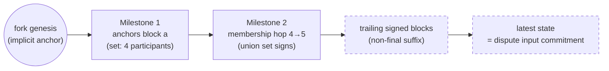

# State Proofs & Milestones

> **Agent status:** Maintained reverse-engineered draft.
> **Engineer verification:** Pending.
> **Status:** Draft; pending engineer verification.
> **Scope:** Defines the implementation-neutral state proofs & milestones behavior, assumptions, constraints, security properties, and black-box test plan.

## Contents

- [Purpose & observable contract](#1-purpose--observable-contract)
- [A milestone is a finality anchor](#2-a-milestone-is-a-finality-anchor)
- [Anchors chain to the latest state](#3-anchors-chain-to-the-latest-state)
- [Membership hops are required at participant-set changes](#4-membership-hops-are-required-at-participant-set-changes)
- [Genesis anchoring](#5-genesis-anchoring)
- [Why the non-final suffix is safe](#6-why-the-non-final-suffix-is-safe)
- [Assumptions and constraints](#assumptions-and-constraints)
- [Security considerations](#security-considerations)
- [Requirements and invariants](#requirements-and-invariants)
- [Verification and test plan](#verification-and-test-plan)
- [Future Work](#future-work)

## 1. Purpose & observable contract

A **state proof** convinces the chain — which stores only the current snapshot — that a claimed
state belongs to a fork's canonical history. It is the evidence a dispute submits with its claim
and the core of a same-fork snapshot update.

Data model:

```solidity
struct MilestoneProof { BlockConfirmation[] blockConfirmations; }
struct StateProof {
    MilestoneProof[] milestones;   // proves the last finalized block in the fork
    SignedBlock[] signedBlocks;    // links the last milestone to the claimed latest block
}
```

The two arrays are **mutually exclusive carrier forms**: either a linked `signedBlocks` sequence
from the trusted base with no milestones, or `milestones` whose **last** milestone carries the
unfinalized tail after its first finalized block — later blocks within that last run need not
each reach threshold. Populating both top-level arrays is invalid. An empty proof claims its
**trusted base** — the current chain record's checkpoint or fork genesis
([data-types.md §7.3](../protocol-model/data-types.md#73-state-proofs)) — not always the old
fork genesis. The heavy backing data (genesis and latest snapshots, per-milestone snapshots,
message blocks) is carried in `DisputeAuditingData` and referenced from the dispute by hash.

**What the proof guarantees:** a path of finality anchors from the fork's genesis to the last
provable anchor, and a cryptographic link from that anchor to the claimed latest state. **What it
does not guarantee:** that the latest state is final, or that its transitions were semantically
valid — invalid transitions inside a proof are handled by the dispute fraud proofs
([fraud-proofs.md](./fraud-proofs.md)), and non-finality is resolved by reduction (§6).

## 2. A milestone is a finality anchor

**<a id="req-sp-1-9yaby1"></a>`REQ-SP-1-9YABY1`.** A milestone is not merely a list of independently threshold-signed blocks. It is a
**finality anchor**: a consecutive, hash-linked run of block confirmations whose accumulated
**actual participant votes** finalize the run's **first** block. That first block's confirmation
is final either directly, or **virtually**, because later, cryptographically linked
confirmations inside the milestone carry their participants' votes back through the ancestry
([finality.md §4](../protocol-model/finality.md)). Tower-derived authority supplies no assigned
peer's milestone finality vote, while a recovered signer that is itself a participant keeps its
own vote (central key policy,
[identity.md](../protocol-model/identity.md#identity)); the single exception is the AFK target's
own credit when the exact restricted AFK block is
the anchor being finalized — that substitute votes for no different earlier anchor, later block,
or unrelated branch, and actual participant descendant votes may complete the other votes needed
to finalize that AFK anchor ([`REQ-FIN-7-RTZWQZ`](../protocol-model/finality.md#req-fin-7-rtzwqz)).
An unfinalized AFK block in a tail needs no finality credit at all; its inclusion is never
reinterpreted as a finalized hop. Every signature artifact stays in the proof; a tower signature
is validated against the historical frozen selected-tower binding established by the credited
participant's membership-interval join.

## 3. Anchors chain to the latest state

**<a id="req-sp-2-st4jj4"></a>`REQ-SP-2-ST4JJ4`.** A state proof establishes a path from one final anchor to the next, and finally to
the **latest state** the dispute transition operates on. The latest state itself need **not** be
final; it MUST be a cryptographically linked descendant of the last proved final anchor. That
linkage is what places it on the canonical chain before the dispute game applies its transition.

**<a id="req-sp-5-mte4rv"></a>`REQ-SP-5-MTE4RV`.** The final block of the proved path supplies the state commitment
(`stateSnapshotHash` → `latestStateSnapshotHash`) that the dispute game and the reduction operate
on (`the corresponding state-proof verification operation`).



_(The dashed suffix is the intended shape; the protocol definition restricts it — see §8.)_

## 4. Membership hops are required at participant-set changes

**<a id="req-sp-3-sp1jg4"></a>`REQ-SP-3-SP1JG4`.** A join or removal changes the threshold set, so a membership change used to advance the
**finalized anchor** across old and new sets MUST have its milestone hop proven under the
**union** of the sets involved; it cannot be skipped to certify a later anchor under only the
smaller set. A 4→5 join is final only when the four original participants _and_ the joiner have
supplied their own direct or virtual votes
([`REQ-FIN-7-RTZWQZ`](../protocol-model/finality.md#req-fin-7-rtzwqz)) — proof that both the
original set and the joiner authorized the change; a removal requires the corresponding proof in
the other direction (the pre-removal set covers the leaving member, with the AFK target's credit
suppliable only by the target-only exception on the exact AFK anchor). A contiguous
**unfinalized tail** after genesis, the checkpoint, or the last finalized anchor MAY contain the
AFK removal and later valid blocks without finalizing that removal: replay verifies each
transition, the current scheduled author, and the membership change, and an offline leaver is
never required to sign merely so the latest state can enter a dispute.

The hop threshold is historical evidence of the one peer-to-peer agreement threshold
([finality.md §6](../protocol-model/finality.md)), with two consequences:

- **Pending joiners come from the committed inbound interval.** The joiners added to the union
  are those whose `JOIN` messages lie in the inbound-message interval committed between the hop's
  two snapshots — not the chain's live pending set. In an honest transition they already appear
  in the resulting set; the explicit derivation lets the verifier reject a proof that consumes a
  recorded join while omitting the joiner from its participant snapshot.
- **On-chain slashes are never subtracted.** The threshold binds the signatures the past
  transition required, so a proof MUST keep the same validity before and after any later slash.
  Excluding slashed signers here would make historical proof validity depend on later
  adjudication; slash-based exclusion exists only for current dispute eligibility
  ([finality.md §6](../protocol-model/finality.md)).

Settled prefixes are pruned by **exact checkpoint rebasing**, never by skip-by-height. For
genesis→10→20→30 with settled checkpoint 15, the obsolete proof prefix is pruned only after
proving exact 15→16→…→20→…→30: the milestone 20/30 certificates and every missing bridge block
needed to connect them are kept, and signed bytes are never rewritten. With unchanged membership
between 10 and 20 the threshold set may be reused while the missing hash chain is still proven;
finalized hops after the checkpoint are rebuilt with their historical unions when membership
changed — a join or removal cannot disappear behind endpoint equality. A bounded
continuation-witness segment in the trusted base context can bridge to the first retained
milestone without pretending those blocks are new finality anchors and without populating both
top-level proof arrays ([history-and-commitments.md §3.2](../protocol-model/history-and-commitments.md#32-hash-linking)).

## 5. Genesis anchoring

**<a id="req-sp-4-ncsex4"></a>`REQ-SP-4-NCSEX4`.** When a proof starts at fork genesis, genesis is the **implicit final anchor** for
that fork; no milestone is needed for it. Concretely:

- An **empty** proof (no milestones, no signed blocks) claims its **trusted base** as the latest
  state — the settled block checkpoint when one exists, else the fork's genesis snapshot; the old
  fork genesis data stays fork-identity provenance, never permission to discard the newer base.
  For the genesis-base case: `isCorrectLatestState` reconstructs the genesis `StateSnapshot` — fork id
  must equal `keccak256(abi.encode(genesisSnapshotData))` (`_isGenesisSnapshotDataLinkedToFork`),
  with the genesis timestamp derived on-chain (`getGenesisTimestamp`: the origin fork's dispute
  window kill-period end, or the stored snapshot's timestamp for the root fork) — and compares its
  hash to the claim.
- A **signed-blocks** proof provides the linked path from genesis: the first block MUST have
  `transactionCnt == 0` and each subsequent block MUST link by `previousBlockHash`
  (`_areSignedBlocksLinkedAndVerified`).
- Where milestones exist, their anchors provide the base; trailing signed blocks extend from the
  last proved milestone to the latest non-final state _(intended — restricted in the current
  code, §8)_.

## 6. Why the non-final suffix is safe

**<a id="inv-sp-6-gnw74h"></a>`INV-SP-6-GNW74H`.** Extending the proved anchor with unfinalized blocks is safe because of three real
guarantees, not a blanket fraud claim. Honest participants obey the no-switch rule
([finality.md §3](../protocol-model/finality.md)); a participant that explicitly signs two
distinct same-height blocks — in any author or confirmation role — exposes the qualifying
same-key pair and the full-stake `BlockDoubleSign` slash
([`REQ-FP-2-CH4DA1`](fraud-proofs.md#req-fp-2-ch4da1)); and valid competing proofs — the legal
normal/AFK split included ([`REQ-WT-3-DT0GDX`](../runtime/watchtowers.md#req-wt-3-dt0gdx)) —
are resolved by checkpoint-compatible reduction. Conflicting commitments without a qualifying
explicit same-height pair are the bounded enforcement residual
[`OQ-49-2Z3FAS`](../open-questions.md#oq-49-2z3fas), not a claimed slash. Different participants
MAY still present different valid latest states during a dispute (they saw different suffix
lengths or branches). The reduction MUST consider all validly proved views and choose the
**longest valid proved history among continuations compatible with the current settled
checkpoint** as canonical; valid transitions of the selected proved history survive, and a
losing unfinalized branch is not carried into the successor
([disputes.md §5](disputes.md#5-reduction-rules-and-order-independence)).

**Open question (shared with [finality.md §5](../protocol-model/finality.md)):** this safety argument currently
depends on round-robin leader election. Other policies may allow a valid suffix to be reverted and
need explicit attribution and penalty rules; long-lived channels and long-range milestone chains
need bounded proofs. Mirrored in [open-questions.md](../open-questions.md).

## Assumptions and constraints

State proofs assume authentic domain-separated signatures, collision-resistant canonical commitments,
available snapshots and auditing data, deterministic membership derivation, and bounded proof length/gas. A
proof establishes linkage and finality anchors, not semantic validity of every transition; fraud-proof and
dispute mechanisms own those checks. Membership changes require explicit hops, genesis has one canonical
anchor, and a non-final suffix is accepted only under the carry-forward rules defined here.

## Security considerations

An unsound proof can advance or dispute the wrong state and therefore endanger all channel funds. Threats
include missing/reordered milestones, skipped membership changes, wrong-genesis linkage, duplicate signatures,
threshold off-by-one errors, malformed suffixes, hash-only unavailable data, proof-size exhaustion, and
predicate drift between validation paths. Verification needs positive and negative cases at every structural
boundary plus adversarial combinations; a proof rejection must leave canonical state unchanged.

## Requirements and invariants

**[`REQ-SP-1-9YABY1`](state-proofs.md#req-sp-1-9yaby1).** A milestone is a finality anchor in actual participant votes (target-only AFK credit excepted): its first block is final directly or via virtual votes from later linked confirmations within the milestone.

**[`REQ-SP-2-ST4JJ4`](state-proofs.md#req-sp-2-st4jj4).** Proofs chain anchor→anchor→latest state; the latest state need not be final but must be a cryptographically linked descendant of the last proved anchor.

**[`REQ-SP-3-SP1JG4`](state-proofs.md#req-sp-3-sp1jg4).** Finalized-anchor membership hops are proven under the old∪new (plus pending joiners) union threshold; an unfinalized tail may carry the AFK removal without a finalized hop.

**[`REQ-SP-4-NCSEX4`](state-proofs.md#req-sp-4-ncsex4).** The trusted base (settled checkpoint, else fork genesis) is the implicit final anchor: empty proofs claim it; signed-block proofs hash-link forward from it.

**[`REQ-SP-5-MTE4RV`](state-proofs.md#req-sp-5-mte4rv).** The final block of the proved path supplies the state commitment the dispute game operates on.

**[`INV-SP-6-GNW74H`](state-proofs.md#inv-sp-6-gnw74h).** Non-final suffixes are safe: explicit same-key same-height signature pairs (any role) are fully slashable, legal normal/AFK splits are evidence, unpaired conflicting commitments are the bounded residual of [`OQ-49-2Z3FAS`](../open-questions.md#oq-49-2z3fas), and reduction selects the longest checkpoint-compatible valid proved history.

**<a id="req-sp-7-70emat"></a>`REQ-SP-7-70EMAT`.** Linkage checks: hash linkage, fork identity, authentic author signatures, threshold coverage, and latest-state commitment, exactly as listed in §7. Author authenticity uses the two-case predicate — each carrying block's author signature recovers to its declared participant, or, for the exact restricted AFK block, to the target's historically frozen selected tower with the canonical body, coordinate, and restricted window reconstructed from the applicable membership-interval binding (the accepted join); wrong, missing, changed, unrelated, or unprovable bindings fail authenticity ([`REQ-SM-5-3GS7A7`](../protocol-model/state-machines.md#req-sm-5-3gs7a7)). Threshold coverage is counted in actual participant votes with the target-only AFK credit ([`REQ-FIN-7-RTZWQZ`](../protocol-model/finality.md#req-fin-7-rtzwqz)); availability acknowledgements derive separately for ordinary-timeout defense. Every empty, raw-block, milestone, last-tail, and malformed-proof branch is judged against the trusted-base checkpoint predicate: the first retained block's channel, fork, height, exact parent, and author are validated, then every continuation link — no fast path validates only one skipped crossing or the last milestone's finality, missing bridge bytes require recovery, and a different committed checkpoint or broken link is invalid. The latest state may be non-final but must extend the trusted base.

## Verification and test plan

### Requirement test matrix

Each row is a planned black-box test obligation, not an additional specification requirement. The requirement remains the authority. Execute the row through public protocol inputs from every applicable pre-state defined by this document. Every required permutation has a stable `P1`…`PN` suffix under its plan item. The list is exhaustive unless it explicitly says that boundary or pairwise representatives are sufficient; an omitted permutation needs an engineer-approved rationale.

| Plan item                                           | Requirements / invariants                            | Setup and stimulus                                                                                                                                    | Expected result                                                                                                                                                                                                                                                                                                                                                                                                                                                             | Required permutations                                                                                                                                                                                                                                                                                                                                                                                                                                                                                                                                                                                                                                                                                                                                                                                                                                                                                                                                                                                                                                                                                                                                                                                                                                                                                                                                                                                                                                                                                                                                                                                                                                                                                                                                                                                                                                                                                                                                                                                                                                                                                                                                                                                                                                                                                                                                                                                                                                                                                                                                                                                                                                                                                                                                   |
| --------------------------------------------------- | ---------------------------------------------------- | ----------------------------------------------------------------------------------------------------------------------------------------------------- | --------------------------------------------------------------------------------------------------------------------------------------------------------------------------------------------------------------------------------------------------------------------------------------------------------------------------------------------------------------------------------------------------------------------------------------------------------------------------- | ------------------------------------------------------------------------------------------------------------------------------------------------------------------------------------------------------------------------------------------------------------------------------------------------------------------------------------------------------------------------------------------------------------------------------------------------------------------------------------------------------------------------------------------------------------------------------------------------------------------------------------------------------------------------------------------------------------------------------------------------------------------------------------------------------------------------------------------------------------------------------------------------------------------------------------------------------------------------------------------------------------------------------------------------------------------------------------------------------------------------------------------------------------------------------------------------------------------------------------------------------------------------------------------------------------------------------------------------------------------------------------------------------------------------------------------------------------------------------------------------------------------------------------------------------------------------------------------------------------------------------------------------------------------------------------------------------------------------------------------------------------------------------------------------------------------------------------------------------------------------------------------------------------------------------------------------------------------------------------------------------------------------------------------------------------------------------------------------------------------------------------------------------------------------------------------------------------------------------------------------------------------------------------------------------------------------------------------------------------------------------------------------------------------------------------------------------------------------------------------------------------------------------------------------------------------------------------------------------------------------------------------------------------------------------------------------------------------------------------------------------- |
| <a id="req-sp-1-9yaby1.t1"></a>`REQ-SP-1-9YABY1.T1` | [`REQ-SP-1-9YABY1`](state-proofs.md#req-sp-1-9yaby1) | Use the applicable black-box method in the verification strategy above; exercise the behavior through public inputs without implementation internals. | A milestone is a finality anchor: its first block is final directly or via virtual votes from later linked confirmations within the milestone.                                                                                                                                                                                                                                                                                                                              | <a id="req-sp-1-9yaby1.t1.p1"></a>`REQ-SP-1-9YABY1.T1.P1` — valid case<br><a id="req-sp-1-9yaby1.t1.p2"></a>`REQ-SP-1-9YABY1.T1.P2` — matching commitment<br><a id="req-sp-1-9yaby1.t1.p3"></a>`REQ-SP-1-9YABY1.T1.P3` — direct invalid/opposite case<br><a id="req-sp-1-9yaby1.t1.p4"></a>`REQ-SP-1-9YABY1.T1.P4` — mismatched commitment<br><a id="req-sp-1-9yaby1.t1.p5"></a>`REQ-SP-1-9YABY1.T1.P5` — predecessor case<br><a id="req-sp-1-9yaby1.t1.p6"></a>`REQ-SP-1-9YABY1.T1.P6` — genesis case<br><a id="req-sp-1-9yaby1.t1.p7"></a>`REQ-SP-1-9YABY1.T1.P7` — stale fork<br><a id="req-sp-1-9yaby1.t1.p8"></a>`REQ-SP-1-9YABY1.T1.P8` — foreign fork<br><a id="req-sp-1-9yaby1.t1.p9"></a>`REQ-SP-1-9YABY1.T1.P9` — no tower-credit anchor: with recovered tower signers that are not themselves channel participants, frozen selected-tower confirmations alone never finalize an anchor — a milestone missing actual participant votes stays non-final regardless of receipts<br><a id="req-sp-1-9yaby1.t1.p10"></a>`REQ-SP-1-9YABY1.T1.P10` — AFK anchor finality: the exact restricted AFK block as the finality target takes the target's tower-supplied credit plus every other required participant's own direct or descendant vote, and finalizes<br><a id="req-sp-1-9yaby1.t1.p11"></a>`REQ-SP-1-9YABY1.T1.P11` — direct-plus-tower duplicate: with a recovered tower signer that is not itself a channel participant, both artifacts stay in the proof, one availability credit and at most one participant vote derive<br><a id="req-sp-1-9yaby1.t1.p12"></a>`REQ-SP-1-9YABY1.T1.P12` — no virtual tower finality: with a recovered tower signer that is not itself a channel participant, a tower confirmation on a later linked block carries no participant finality vote back to the anchor; the anchor stays non-final without the participants' own votes<br><a id="req-sp-1-9yaby1.t1.p13"></a>`REQ-SP-1-9YABY1.T1.P13` — unfinalized AFK tail: the AFK removal and later linked blocks ride the last milestone's tail without a finality credit, and the tail is never reinterpreted as a finalized hop                                                                                                                                                                                                                                                                                                                                                                                                                                                                                                                                                                                                                      |
| <a id="req-sp-2-st4jj4.t1"></a>`REQ-SP-2-ST4JJ4.T1` | [`REQ-SP-2-ST4JJ4`](state-proofs.md#req-sp-2-st4jj4) | Use the applicable black-box method in the verification strategy above; exercise the behavior through public inputs without implementation internals. | Proofs chain anchor→anchor→latest state; the latest state need not be final but must be a cryptographically linked descendant of the last proved anchor.                                                                                                                                                                                                                                                                                                                    | <a id="req-sp-2-st4jj4.t1.p1"></a>`REQ-SP-2-ST4JJ4.T1.P1` — valid case<br><a id="req-sp-2-st4jj4.t1.p2"></a>`REQ-SP-2-ST4JJ4.T1.P2` — matching commitment<br><a id="req-sp-2-st4jj4.t1.p3"></a>`REQ-SP-2-ST4JJ4.T1.P3` — direct invalid/opposite case<br><a id="req-sp-2-st4jj4.t1.p4"></a>`REQ-SP-2-ST4JJ4.T1.P4` — mismatched commitment<br><a id="req-sp-2-st4jj4.t1.p5"></a>`REQ-SP-2-ST4JJ4.T1.P5` — predecessor case<br><a id="req-sp-2-st4jj4.t1.p6"></a>`REQ-SP-2-ST4JJ4.T1.P6` — genesis case<br><a id="req-sp-2-st4jj4.t1.p7"></a>`REQ-SP-2-ST4JJ4.T1.P7` — stale fork<br><a id="req-sp-2-st4jj4.t1.p8"></a>`REQ-SP-2-ST4JJ4.T1.P8` — foreign fork<br><a id="req-sp-2-st4jj4.t1.p9"></a>`REQ-SP-2-ST4JJ4.T1.P9` — checkpoint base: a proof extends the settled block checkpoint through the authentic bridge block and continuation links; a foreign checkpoint block, equal participant set, equal height, or bare state root cannot substitute<br><a id="req-sp-2-st4jj4.t1.p10"></a>`REQ-SP-2-ST4JJ4.T1.P10` — both carrier arrays populated is rejected                                                                                                                                                                                                                                                                                                                                                                                                                                                                                                                                                                                                                                                                                                                                                                                                                                                                                                                                                                                                                                                                                                                                                                                                                                                                                                                                                                                                                                                                                                                                                                                                                                                                                   |
| <a id="req-sp-3-sp1jg4.t1"></a>`REQ-SP-3-SP1JG4.T1` | [`REQ-SP-3-SP1JG4`](state-proofs.md#req-sp-3-sp1jg4) | Use the applicable black-box method in the verification strategy above; exercise the behavior through public inputs without implementation internals. | Membership changes require milestone hops proven under the old∪new (plus pending joiners) union threshold.                                                                                                                                                                                                                                                                                                                                                                  | <a id="req-sp-3-sp1jg4.t1.p1"></a>`REQ-SP-3-SP1JG4.T1.P1` — valid case<br><a id="req-sp-3-sp1jg4.t1.p2"></a>`REQ-SP-3-SP1JG4.T1.P2` — correct identity/signature<br><a id="req-sp-3-sp1jg4.t1.p3"></a>`REQ-SP-3-SP1JG4.T1.P3` — new participant<br><a id="req-sp-3-sp1jg4.t1.p4"></a>`REQ-SP-3-SP1JG4.T1.P4` — direct invalid/opposite case<br><a id="req-sp-3-sp1jg4.t1.p5"></a>`REQ-SP-3-SP1JG4.T1.P5` — wrong identity/signature<br><a id="req-sp-3-sp1jg4.t1.p6"></a>`REQ-SP-3-SP1JG4.T1.P6` — missing identity/signature<br><a id="req-sp-3-sp1jg4.t1.p7"></a>`REQ-SP-3-SP1JG4.T1.P7` — duplicate identity/signature<br><a id="req-sp-3-sp1jg4.t1.p8"></a>`REQ-SP-3-SP1JG4.T1.P8` — forged identity/signature<br><a id="req-sp-3-sp1jg4.t1.p9"></a>`REQ-SP-3-SP1JG4.T1.P9` — membership boundary<br><a id="req-sp-3-sp1jg4.t1.p10"></a>`REQ-SP-3-SP1JG4.T1.P10` — existing participant<br><a id="req-sp-3-sp1jg4.t1.p11"></a>`REQ-SP-3-SP1JG4.T1.P11` — removed participant<br><a id="req-sp-3-sp1jg4.t1.p12"></a>`REQ-SP-3-SP1JG4.T1.P12` — slashed participant<br><a id="req-sp-3-sp1jg4.t1.p13"></a>`REQ-SP-3-SP1JG4.T1.P13` — concurrent membership change<br><a id="req-sp-3-sp1jg4.t1.p14"></a>`REQ-SP-3-SP1JG4.T1.P14` — unfinalized removal tail versus finalized hop: the AFK removal rides a valid unfinalized tail without a hop, while a later anchor certified past that membership change requires the full historical union hop — skipping it fails                                                                                                                                                                                                                                                                                                                                                                                                                                                                                                                                                                                                                                                                                                                                                                                                                                                                                                                                                                                                                                                                                                                                                                                                                                                                                 |
| <a id="req-sp-4-ncsex4.t1"></a>`REQ-SP-4-NCSEX4.T1` | [`REQ-SP-4-NCSEX4`](state-proofs.md#req-sp-4-ncsex4) | Use the applicable black-box method in the verification strategy above; exercise the behavior through public inputs without implementation internals. | Fork genesis is the implicit final anchor: empty proofs claim the genesis snapshot; signed-block proofs must start at `transactionCnt == 0` and hash-link forward.                                                                                                                                                                                                                                                                                                          | <a id="req-sp-4-ncsex4.t1.p1"></a>`REQ-SP-4-NCSEX4.T1.P1` — valid case<br><a id="req-sp-4-ncsex4.t1.p2"></a>`REQ-SP-4-NCSEX4.T1.P2` — matching commitment<br><a id="req-sp-4-ncsex4.t1.p3"></a>`REQ-SP-4-NCSEX4.T1.P3` — correct identity/signature<br><a id="req-sp-4-ncsex4.t1.p4"></a>`REQ-SP-4-NCSEX4.T1.P4` — direct invalid/opposite case<br><a id="req-sp-4-ncsex4.t1.p5"></a>`REQ-SP-4-NCSEX4.T1.P5` — mismatched commitment<br><a id="req-sp-4-ncsex4.t1.p6"></a>`REQ-SP-4-NCSEX4.T1.P6` — predecessor case<br><a id="req-sp-4-ncsex4.t1.p7"></a>`REQ-SP-4-NCSEX4.T1.P7` — genesis case<br><a id="req-sp-4-ncsex4.t1.p8"></a>`REQ-SP-4-NCSEX4.T1.P8` — stale fork<br><a id="req-sp-4-ncsex4.t1.p9"></a>`REQ-SP-4-NCSEX4.T1.P9` — foreign fork<br><a id="req-sp-4-ncsex4.t1.p10"></a>`REQ-SP-4-NCSEX4.T1.P10` — wrong identity/signature<br><a id="req-sp-4-ncsex4.t1.p11"></a>`REQ-SP-4-NCSEX4.T1.P11` — missing identity/signature<br><a id="req-sp-4-ncsex4.t1.p12"></a>`REQ-SP-4-NCSEX4.T1.P12` — duplicate identity/signature<br><a id="req-sp-4-ncsex4.t1.p13"></a>`REQ-SP-4-NCSEX4.T1.P13` — forged identity/signature<br><a id="req-sp-4-ncsex4.t1.p14"></a>`REQ-SP-4-NCSEX4.T1.P14` — membership boundary                                                                                                                                                                                                                                                                                                                                                                                                                                                                                                                                                                                                                                                                                                                                                                                                                                                                                                                                                                                                                                                                                                                                                                                                                                                                                                                                                                                                                                                                                                                              |
| <a id="req-sp-5-mte4rv.t1"></a>`REQ-SP-5-MTE4RV.T1` | [`REQ-SP-5-MTE4RV`](state-proofs.md#req-sp-5-mte4rv) | Use the applicable black-box method in the verification strategy above; exercise the behavior through public inputs without implementation internals. | The final block of the proved path supplies the state commitment the dispute game operates on.                                                                                                                                                                                                                                                                                                                                                                              | <a id="req-sp-5-mte4rv.t1.p1"></a>`REQ-SP-5-MTE4RV.T1.P1` — valid case<br><a id="req-sp-5-mte4rv.t1.p2"></a>`REQ-SP-5-MTE4RV.T1.P2` — matching commitment<br><a id="req-sp-5-mte4rv.t1.p3"></a>`REQ-SP-5-MTE4RV.T1.P3` — malformed input<br><a id="req-sp-5-mte4rv.t1.p4"></a>`REQ-SP-5-MTE4RV.T1.P4` — direct invalid/opposite case<br><a id="req-sp-5-mte4rv.t1.p5"></a>`REQ-SP-5-MTE4RV.T1.P5` — mismatched commitment<br><a id="req-sp-5-mte4rv.t1.p6"></a>`REQ-SP-5-MTE4RV.T1.P6` — predecessor case<br><a id="req-sp-5-mte4rv.t1.p7"></a>`REQ-SP-5-MTE4RV.T1.P7` — genesis case<br><a id="req-sp-5-mte4rv.t1.p8"></a>`REQ-SP-5-MTE4RV.T1.P8` — stale fork<br><a id="req-sp-5-mte4rv.t1.p9"></a>`REQ-SP-5-MTE4RV.T1.P9` — foreign fork<br><a id="req-sp-5-mte4rv.t1.p10"></a>`REQ-SP-5-MTE4RV.T1.P10` — adversarial input<br><a id="req-sp-5-mte4rv.t1.p11"></a>`REQ-SP-5-MTE4RV.T1.P11` — partial failure<br><a id="req-sp-5-mte4rv.t1.p12"></a>`REQ-SP-5-MTE4RV.T1.P12` — retry and recovery                                                                                                                                                                                                                                                                                                                                                                                                                                                                                                                                                                                                                                                                                                                                                                                                                                                                                                                                                                                                                                                                                                                                                                                                                                                                                                                                                                                                                                                                                                                                                                                                                                                                                                                                                     |
| <a id="inv-sp-6-gnw74h.t1"></a>`INV-SP-6-GNW74H.T1` | [`INV-SP-6-GNW74H`](state-proofs.md#inv-sp-6-gnw74h) | Use the applicable black-box method in the verification strategy above; exercise the behavior through public inputs without implementation internals. | Non-final suffixes separate three cases: an explicit same-key same-height signature pair (any author or confirmation role) is fully slashable via `BlockDoubleSign`; the legal normal/AFK split stays admissible evidence with no participant slash; conflicting commitments without a qualifying pair route to the bounded residual of [`OQ-49-2Z3FAS`](../open-questions.md#oq-49-2z3fas) — and reduction selects the longest checkpoint-compatible valid proved history. | <a id="inv-sp-6-gnw74h.t1.p1"></a>`INV-SP-6-GNW74H.T1.P1` — valid case<br><a id="inv-sp-6-gnw74h.t1.p2"></a>`INV-SP-6-GNW74H.T1.P2` — matching commitment<br><a id="inv-sp-6-gnw74h.t1.p3"></a>`INV-SP-6-GNW74H.T1.P3` — correct identity/signature<br><a id="inv-sp-6-gnw74h.t1.p4"></a>`INV-SP-6-GNW74H.T1.P4` — new participant<br><a id="inv-sp-6-gnw74h.t1.p5"></a>`INV-SP-6-GNW74H.T1.P5` — direct invalid/opposite case<br><a id="inv-sp-6-gnw74h.t1.p6"></a>`INV-SP-6-GNW74H.T1.P6` — mismatched commitment<br><a id="inv-sp-6-gnw74h.t1.p7"></a>`INV-SP-6-GNW74H.T1.P7` — predecessor case<br><a id="inv-sp-6-gnw74h.t1.p8"></a>`INV-SP-6-GNW74H.T1.P8` — genesis case<br><a id="inv-sp-6-gnw74h.t1.p9"></a>`INV-SP-6-GNW74H.T1.P9` — stale fork<br><a id="inv-sp-6-gnw74h.t1.p10"></a>`INV-SP-6-GNW74H.T1.P10` — foreign fork<br><a id="inv-sp-6-gnw74h.t1.p11"></a>`INV-SP-6-GNW74H.T1.P11` — wrong identity/signature<br><a id="inv-sp-6-gnw74h.t1.p12"></a>`INV-SP-6-GNW74H.T1.P12` — missing identity/signature<br><a id="inv-sp-6-gnw74h.t1.p13"></a>`INV-SP-6-GNW74H.T1.P13` — duplicate identity/signature<br><a id="inv-sp-6-gnw74h.t1.p14"></a>`INV-SP-6-GNW74H.T1.P14` — forged identity/signature<br><a id="inv-sp-6-gnw74h.t1.p15"></a>`INV-SP-6-GNW74H.T1.P15` — membership boundary<br><a id="inv-sp-6-gnw74h.t1.p16"></a>`INV-SP-6-GNW74H.T1.P16` — existing participant<br><a id="inv-sp-6-gnw74h.t1.p17"></a>`INV-SP-6-GNW74H.T1.P17` — removed participant<br><a id="inv-sp-6-gnw74h.t1.p18"></a>`INV-SP-6-GNW74H.T1.P18` — slashed participant<br><a id="inv-sp-6-gnw74h.t1.p19"></a>`INV-SP-6-GNW74H.T1.P19` — concurrent membership change<br><a id="inv-sp-6-gnw74h.t1.p20"></a>`INV-SP-6-GNW74H.T1.P20` — legal split in the suffix: normal and AFK branches diverge with no qualifying same-key signature pair; both proofs are admissible, reduction selects the checkpoint-compatible longest history, and the losing branch's transitions are not carried into the successor                                                                                                                                                                                                                                                                                                                                                                                                                                                                                                                                                                                                                                                                                                                                       |
| <a id="req-sp-7-70emat.t1"></a>`REQ-SP-7-70EMAT.T1` | [`REQ-SP-7-70EMAT`](state-proofs.md#req-sp-7-70emat) | Use the applicable black-box method in the verification strategy above; exercise the behavior through public inputs without implementation internals. | Linkage checks: hash linkage, fork identity, authentic author signatures, threshold coverage, and latest-state commitment, exactly as listed in §7.                                                                                                                                                                                                                                                                                                                         | <a id="req-sp-7-70emat.t1.p1"></a>`REQ-SP-7-70EMAT.T1.P1` — valid case<br><a id="req-sp-7-70emat.t1.p2"></a>`REQ-SP-7-70EMAT.T1.P2` — matching commitment<br><a id="req-sp-7-70emat.t1.p3"></a>`REQ-SP-7-70EMAT.T1.P3` — correct identity/signature<br><a id="req-sp-7-70emat.t1.p4"></a>`REQ-SP-7-70EMAT.T1.P4` — direct invalid/opposite case<br><a id="req-sp-7-70emat.t1.p5"></a>`REQ-SP-7-70EMAT.T1.P5` — mismatched commitment<br><a id="req-sp-7-70emat.t1.p6"></a>`REQ-SP-7-70EMAT.T1.P6` — predecessor case<br><a id="req-sp-7-70emat.t1.p7"></a>`REQ-SP-7-70EMAT.T1.P7` — genesis case<br><a id="req-sp-7-70emat.t1.p8"></a>`REQ-SP-7-70EMAT.T1.P8` — stale fork<br><a id="req-sp-7-70emat.t1.p9"></a>`REQ-SP-7-70EMAT.T1.P9` — foreign fork<br><a id="req-sp-7-70emat.t1.p10"></a>`REQ-SP-7-70EMAT.T1.P10` — wrong identity/signature<br><a id="req-sp-7-70emat.t1.p11"></a>`REQ-SP-7-70EMAT.T1.P11` — missing identity/signature<br><a id="req-sp-7-70emat.t1.p12"></a>`REQ-SP-7-70EMAT.T1.P12` — duplicate identity/signature<br><a id="req-sp-7-70emat.t1.p13"></a>`REQ-SP-7-70EMAT.T1.P13` — forged identity/signature<br><a id="req-sp-7-70emat.t1.p14"></a>`REQ-SP-7-70EMAT.T1.P14` — membership boundary<br><a id="req-sp-7-70emat.t1.p15"></a>`REQ-SP-7-70EMAT.T1.P15` — wrong or unrelated tower signer: a confirmation from a tower not historically frozen for any union participant supplies no credit and fails threshold coverage<br><a id="req-sp-7-70emat.t1.p16"></a>`REQ-SP-7-70EMAT.T1.P16` — barred-but-frozen tower: a tower later barred from future selection still supplies valid availability credits and its target-only AFK authority for the membership interval where its binding was frozen<br><a id="req-sp-7-70emat.t1.p17"></a>`REQ-SP-7-70EMAT.T1.P17` — restricted AFK author authenticity: the AFK block's author signature verifies against the reconstructed historical membership-interval binding with the canonical body, coordinate, and window; wrong, missing, changed, unrelated, or unprovable bindings fail<br><a id="req-sp-7-70emat.t1.p18"></a>`REQ-SP-7-70EMAT.T1.P18` — exact checkpoint15 rebase: genesis→10→20→30 rebased onto settled 15 passes with the authentic block 15 and complete 15→16…→30 links; foreign 15, same-set different history, missing 15/16, wrong raw hash, height gap, timestamp/genesis confusion, and a skipped post-15 hop each fail<br><a id="req-sp-7-70emat.t1.p19"></a>`REQ-SP-7-70EMAT.T1.P19` — every proof branch uses the checkpoint predicate: empty, raw-block, milestone, last-tail, and malformed branches all validate the first retained block and every continuation link, with missing bridge bytes routed to recovery rather than a verdict |

## Future Work

_Non-normative._

- Bound proof size and verification gas: per-call gas ceilings, proof-size limits as a function
  of participant count, or incremental verification across transactions.
- Long-range proofs for long-lived channels: checkpointing the last settled anchor on-chain so
  proofs only ever span since-last-settlement history (interacts with `verifyMilestones`'s
  skip-below-snapshot logic, which already prunes settled prefixes).
- Signature aggregation inside `MilestoneProof` to compress hops in large channels.
