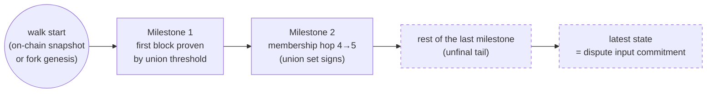

# State Proofs & Milestones

> **Agent status:** Maintained reverse-engineered draft.
> **Engineer verification:** Pending.
> **Status:** Draft; pending engineer verification.
> **Scope:** Defines the implementation-neutral state proofs & milestones behavior, assumptions, constraints, security properties, and black-box test plan.

## Contents

- [Purpose & observable contract](#1-purpose--observable-contract)
- [A milestone is a finality anchor](#2-a-milestone-is-a-finality-anchor)
- [Anchors chain to the latest state](#3-anchors-chain-to-the-latest-state)
- [The walk start and the walk](#4-the-walk-start-and-the-walk)
- [Membership hops are required at participant-set changes](#5-membership-hops-are-required-at-participant-set-changes)
- [Genesis start](#6-genesis-start)
- [Claims below the on-chain snapshot](#7-claims-below-the-on-chain-snapshot)
- [Verification by a node](#8-verification-by-a-node)
- [Challenge region and finalized state](#9-challenge-region-and-finalized-state)
- [Why the non-final suffix is safe](#10-why-the-non-final-suffix-is-safe)
- [Assumptions and constraints](#assumptions-and-constraints)
- [Security considerations](#security-considerations)
- [Requirements and invariants](#requirements-and-invariants)
- [Verification and test plan](#verification-and-test-plan)
- [Future Work](#future-work)

## 1. Purpose & observable contract

A **state proof** convinces the chain — which stores only the current snapshot — that a claimed
state belongs to a fork's canonical history. It is the evidence a dispute submits with its claim
and the core of a same-fork snapshot update.

Data model:

```solidity
struct MilestoneProof { BlockConfirmation[] blockConfirmations; }
struct StateProof { MilestoneProof[] milestones; }
```

A proof is only milestones. The claimed latest block is the last block of the last milestone. An
**empty** proof (no milestones) claims the fork genesis. The heavy backing data (genesis snapshot
data, one snapshot per milestone, latest snapshot, message blocks) is carried in
`DisputeAuditingData` and referenced from the dispute by hash.

**What the proof guarantees:** a path from the proof's **walk start** — the same-fork on-chain
snapshot, or the fork genesis (§4) — through threshold-proven milestones to the last proven
point, and a cryptographic link from that point, inside the last milestone, to the claimed latest
block. **What it does not guarantee:** that the latest state is final, or that its transitions
were semantically valid — invalid transitions inside a proof are handled by the dispute fraud
proofs ([fraud-proofs.md](./fraud-proofs.md)), and non-finality is resolved by reduction (§10).

## 2. A milestone is a finality anchor

**<a id="req-sp-1-9yaby1"></a>`REQ-SP-1-9YABY1`.** A milestone is not merely a list of independently threshold-signed blocks. It is a
**finality anchor**: a consecutive, hash-linked run of block confirmations whose accumulated
signatures finalize the run's **first** block. That first block's confirmation is final either
directly — it carries the required threshold signatures itself — or **virtually**, because later,
cryptographically linked confirmations inside the milestone carry their signatures back through
the ancestry ([finality.md §4](../protocol-model/finality.md)).

## 3. Anchors chain to the latest state

**<a id="req-sp-2-st4jj4"></a>`REQ-SP-2-ST4JJ4`.** A state proof establishes a path from one final point to the next, and finally to
the **latest state** the dispute transition operates on. Milestones are ordered by nondecreasing
first-block height; milestones may overlap and may repeat a block, and two consecutive milestones
need no hash link between them, because each later milestone proves its own first block by
threshold (§5). The latest state itself need **not** be final; it MUST be a cryptographically
linked descendant, inside the last milestone, of the last proven point. That linkage is what
places it on the canonical chain before the dispute game applies its transition. The blocks of the
last milestone after its last proven point form the **unfinal tail**.

**<a id="req-sp-5-mte4rv"></a>`REQ-SP-5-MTE4RV`.** The final block of the proved path supplies the state commitment
(`stateSnapshotHash` → `latestStateSnapshotHash`) that the dispute game and the reduction operate
on (`the corresponding state-proof verification operation`).


```mermaid
flowchart LR
    S(("walk start<br/>(on-chain snapshot<br/>or fork genesis)")) --> M1["Milestone 1<br/>first block proven<br/>by union threshold"]
    M1 --> M2["Milestone 2<br/>membership hop 4→5<br/>(union set signs)"]
    M2 --> T["rest of the last milestone<br/>(unfinal tail)"]
    T --> L["latest state<br/>= dispute input commitment"]
    style T stroke-dasharray: 5 5
    style L stroke-dasharray: 5 5
```

## 4. The walk start and the walk

**[`REQ-SP-8-9PK9TS`](dispute-processing.md#req-sp-8-9pk9ts).** Every state proof is checked by one canonical walk from one start.

- **Walk start.** The chain's current snapshot is final. When it lies on the proof's fork and is
  not that fork's genesis, it is the walk start. Otherwise — it lies on another fork, or it is the
  fork genesis — the fork genesis is the walk start (§6). The genesis MUST be recognized by its
  data — the fork ID is the hash of the genesis snapshot data — not by its height: the genesis and
  a snapshot that block 0 commits both have height 0, and only the second is a normal start. A
  peer that installed the fork from the on-chain snapshot holds no history below it and MUST still
  be able to prove and dispute.
- **Dropped milestones.** A milestone whose last block is below the start height lies wholly
  below the start. The walk drops it: it reads only its first and last block heights, checks
  nothing else in it, reads no snapshot entry for it, and awards it no finality. A proof whose
  every milestone is dropped is valid and proves only the start.
- **The run that holds the start.** When the start is the on-chain snapshot, a kept milestone
  whose first block is at or below the start height holds the start. Its block at exactly the start
  height MUST exist, MUST have that height, and MUST commit the start: its state commitment equals
  the start snapshot's hash. From that block on, the run's blocks MUST be linked, height + 1 and
  author-signed. The run needs no threshold: the start is already final and supplies its own
  participant set. Blocks of that run below the start height are not checked. The rule binds the
  state after that block, not the block's identity: enforcement stores no hash of the block that
  committed the start, so any block at that height that commits the start passes. This is
  sufficient because the state after such a block is the on-chain snapshot itself, so the next
  block is judged from on-chain truth.
- **Threshold milestones.** Every other kept milestone MUST prove its first block by the union
  threshold of the last verified set (§5), and its first block MUST commit the snapshot supplied
  for that milestone. A proven milestone advances the finalized snapshot and the verified set to
  that snapshot. Within the milestone, every block MUST be linked by hash, height + 1, and signed
  by its declared author. A milestone that fails its threshold makes the whole proof invalid,
  except the single genesis case of §6.
- **Every kept block** MUST decode and MUST name the proof's channel and fork.
- **Result.** The walk returns whether the proof is valid; the finalized snapshot (the start, the
  last threshold-proven snapshot, or the fork genesis for an empty proof); and the block index in
  the last milestone where its unfinal tail starts. An index equal to the last milestone's length
  means the proof has no tail. When the walk is invalid, no other result is usable.
- **Linkage-only walk.** The same walk MAY run without finality: it then reads no milestone
  snapshot and checks the start commitment, the genesis link, and the linkage of every kept run.
  Only its valid/invalid answer is usable.
- **One owner.** Dispute verification, snapshot advance, and spectator synchronization MUST use
  this one walk and the same start rule. Block-challenge eligibility uses the same start rule
  without the walk (§9).
- **Fixed during a dispute.** The on-chain snapshot cannot change on a disputed fork
  ([`REQ-ENFSNAP-4-ESP98F` (Disputed-fork advance rule)](../enforcement/snapshot-adoption.md#req-enfsnap-4-esp98f)), so the start stays fixed for
  the whole dispute game.

The start is derived from the dispute's channel and fork. A proof block whose header names a
different channel or fork than the dispute is already a slashable header mismatch, so it cannot
choose a more convenient start.

Whether a peer that has moved ahead on a fork still needs that fork's genesis snapshot at all is open
([`OQ-SPEC-GENESIS-1-TKNMPM` (Fork genesis dependency after a peer moves ahead)](../open-questions.md#oq-spec-genesis-1-tknmpm)).

**Construction.** A prover builds a compact proof from its own local view of the walk start: one
milestone at each participant-set change point above the start, the latest threshold-proven
milestone, and the unfinal tail; or, without any threshold point above the start, one run from the
block at the start height (block 0 for a genesis start) to the requested height. History between
two threshold points with an unchanged set is not needed. The construction rules and their error
outcomes are owned by [`REQ-DISPUTE-PIPE-13-W73B2F` (Proof construction from the local start)](dispute-processing.md#req-dispute-pipe-13-w73b2f).

## 5. Membership hops are required at participant-set changes

**<a id="req-sp-3-sp1jg4"></a>`REQ-SP-3-SP1JG4`.** A join or removal changes the threshold set, so a proof crossing a membership change
MUST establish the old-set → new-set transition at the relevant block with a milestone hop; it
cannot simply assert the new membership. The hop's threshold is the **union** of the last verified
set (the start's set, or the resulting set of the last proven milestone), the milestone's resulting
set, and the pending joiners: a 4→5 join is final only when the four original participants _and_
the joiner have (directly or virtually) signed — proof that both the original set and the joiner
authorized the change. A removal requires the corresponding proof in the other direction (the
pre-removal set covers the leaving member). Only a proven hop advances the verified set used by
the next milestone. Each signer counts once, and only signers in the union count.

The hop threshold is historical evidence of the one peer-to-peer agreement threshold
([finality.md §6](../protocol-model/finality.md)), with two consequences:

- **Pending joiners come from the committed inbound interval.** The joiners added to the union
  are those whose `JOIN` messages lie in the inbound-message interval committed between the last
  verified snapshot and the milestone's resulting snapshot — not the chain's live pending set. In
  an honest transition they already appear in the resulting set; the explicit derivation lets the
  verifier reject a proof that consumes a recorded join while omitting the joiner from its
  participant snapshot.
- **On-chain slashes are never subtracted.** The threshold binds the signatures the past
  transition required, so a proof MUST keep the same validity before and after any later slash.
  Excluding slashed signers here would make historical proof validity depend on later
  adjudication; slash-based exclusion exists only for current dispute eligibility
  ([finality.md §6](../protocol-model/finality.md)).

Between two hops with an unchanged set, the threshold evidence may jump over any length of
history: the later milestone needs no link to the earlier one.

## 6. Genesis start

**<a id="req-sp-4-ncsex4"></a>`REQ-SP-4-NCSEX4`.** When the walk start is the fork genesis, the genesis is the **implicit final
anchor** for that fork; no milestone is needed for it. The genesis has no block of its own.
Concretely:

- An **empty** proof is the fork genesis, whatever the on-chain snapshot is. The latest-state
  check reconstructs the genesis snapshot — the fork ID must equal the hash of the supplied genesis
  snapshot data, with the genesis timestamp derived on-chain (the origin fork's dispute-window
  kill-period end, or the stored snapshot's timestamp when the stored snapshot is the genesis) —
  and compares its hash to the claim.
- **Genesis data.** When the on-chain snapshot is the fork genesis, the walk takes the genesis from
  the chain and reads no supplied genesis data. Supplied genesis data is needed only when the fork
  genesis is not on chain (the on-chain snapshot lies on another fork, or an empty proof is walked
  while a normal start is on chain), and then it MUST hash to the fork ID. Dispute verification
  needs no genesis data beyond what the walk and the latest-state check of an empty proof use.
- **Block 0** links to the genesis through its previous-block hash, which MUST equal the genesis
  snapshot's hash. That link alone does not finalize it: block 0 is final only with the union
  threshold of the genesis set and block 0's resulting set (§5).
- An **unfinal block 0** is allowed only when its milestone is the proof's only milestone. The
  whole run is then the unfinal tail, replayed from block 0, and the finalized state is the
  genesis. An unfinal block 0 beside any other milestone makes the proof invalid.
- A first milestone that starts above height 0 needs no link to the genesis: it proves its first
  block by the union threshold of the genesis set.
- A fork reached by a reduction that the chain has not adopted yet dates its genesis through its
  authenticated origin fork's dispute window.

## 7. Claims below the on-chain snapshot

A proof whose milestones all end below the walk start passes dispute verification: the walk drops
them and proves only the start, and the latest-state check binds the claim to the last block of
the proof. Such a claim is obsolete, because the on-chain snapshot is final and newer. A dedicated
dispute fraud proof answers it (part of [`REQ-SP-8-9PK9TS`](dispute-processing.md#req-sp-8-9pk9ts)):

- It holds when the chain's snapshot is on the dispute's fork, is not that fork's genesis, and the
  dispute's latest claimed block height is **strictly below** that snapshot's height. An empty
  proof claims the genesis and is therefore also below such a snapshot.
- It does not hold when the claimed height equals or exceeds the snapshot height, when the chain's
  snapshot lies on another fork, or when it is the fork's genesis.
- It needs no payload beyond the dispute, slashes the disputer, and kills the dispute like every
  dispute fraud proof ([fraud-proofs.md §3](./fraud-proofs.md)). No separate admission rule
  rejects such a claim at upload.

## 8. Verification by a node

**<a id="req-sp-9-7mwky8"></a>`REQ-SP-9-7MWKY8`.** Any node that verifies a state proof (an auditor, a
synchronizing spectator, a prover checking its own proof) MUST use the same walk, tried from up to
three starts in this order:

1. its latest local threshold-final point of the fork — a state every required participant
   signed, which the node holds;
2. the start its local copy of the chain state reports;
3. the start the chain reports.

A valid walk at any tier is final: the node accepts the proof and does not re-check it at a later
tier or against a newer chain read. A local tier that answers invalid falls through to the next
tier. Only the chain tier can answer invalid. Verification has no "unavailable" result: a tier
that fails — the local execution reverts or fails, the worker connection fails, another internal
component fails, or the chain read fails — does not fall through and is not retried; the error
propagates to the caller. An error is never a verdict: no node builds a counter, kills a dispute,
or penalizes a peer on an error.

## 9. Challenge region and finalized state

**<a id="req-sp-10-am67r2"></a>`REQ-SP-10-AM67R2`.** A dispute submitter is liable only for the
blocks it adds after the last proven point; finalized history and dropped material stay with their
original signers.

- **Coordinates.** Only the last milestone is challengeable. A block challenge against a dispute
  names the block by its index in the last milestone of the submitted proof, and the challenged
  block MUST be the block at that index.
- **Region.** A transition, timestamp, genesis, or forged-message challenge and an
  author-not-participant challenge are eligible when the proof has a milestone, the index lies in
  the last milestone, the last milestone's first block and the challenged block decode, the index is
  at or after the tail start, and — when the walk can start from the on-chain snapshot — the
  challenged block's height is above that snapshot's height. Eligibility needs no walk: the
  validity of earlier milestones is the subject of the invalid-state-proof counter, not of a block
  challenge.
- **Tail start.** When the walk can start from the on-chain snapshot and the last milestone's first
  block is at or below its height, the tail starts right after the block at the on-chain height.
  Otherwise, when the proof has one milestone and it starts at block 0, the tail starts at block 0.
  Otherwise the tail starts at the last milestone's second block: its first block is
  threshold-final. A block before the tail start and an out-of-range index are not eligible.
- **Structure.** A structure challenge is input-only and needs no valid walk: a malformed block is
  never honest history. It is limited to the last milestone. A block is structurally invalid when it
  does not decode or its author signature is not authentic, or — after the run's first block — when
  it does not link to its predecessor in the same run by hash and height + 1. The first block of a
  run has no predecessor offense.
- **Balance state.** The balance-invariant check of a dispute judges the dispute's latest state:
  the snapshot whose hash the dispute commits as its latest state, with state bytes that match that
  snapshot's state-machine-state hash, linked to the proof's latest block. It needs no walk. A
  challenge that supplies another snapshot, or state bytes that do not match it, is rejected. The
  latest state is never below the on-chain snapshot, because a claim below it is killed by the
  below-anchor counter (§7); the disputer answers for the unfinal tail, and a finalized state
  carries the signatures of every participant, the disputer's included.
- **Posted finalized state.** A dispute that posts auditing data also posts the state bytes of its
  finalized state, the state from which every auditor replays the unfinal tail. Those bytes MUST hash
  to the state-machine-state commitment of the walk's finalized snapshot: the snapshot where the walk
  from the chain's own start ends (§4), that is the on-chain snapshot when no milestone above it is
  proven, else the last threshold-proven snapshot, or the fork genesis. The bytes of any other state,
  an earlier proven state of the same fork included, and empty bytes make the state proof invalid:
  the invalid-state-proof counter kills the dispute and slashes its disputer. A counter against a
  dispute whose posted bytes are the walk's finalized state is an invalid submission. An honest posting
  built before a same-fork snapshot lands inside the last milestone can stop matching; this race is the
  deferred [`OQ-SPEC-POSTED-STATE-RACE-1-1ZM6XN`](../open-questions.md#oq-spec-posted-state-race-1-1zm6xn).

## 10. Why the non-final suffix is safe

**<a id="inv-sp-6-gnw74h"></a>`INV-SP-6-GNW74H`.** Extending the proved anchor with unfinalized blocks is safe because signing is a
non-equivocating commitment ([finality.md §3](../protocol-model/finality.md)): a participant cannot commit to
conflicting histories without exposing a slashable double-sign. Different participants MAY still
present different valid latest states during a dispute (they saw different suffix lengths). The
reduction MUST consider all validly proved views and choose the **longest valid proved history**
as canonical — this is how the latest non-final state joins canonical reality instead of being
discarded. A double sign alone does not make a dispute invalid: a dispute whose proof and balance
are valid survives the kill period although its blocks prove a double sign, and the reduction
compares it with the other committed disputes. The choice is made among the disputes committed
while the window is open: a threshold-final dispute ends the window at once
([finality.md](../protocol-model/finality.md)), and its own latest state is then the result, also
when a posted alternate history is longer.

**Open question (shared with [finality.md §5](../protocol-model/finality.md)):** this safety argument currently
depends on round-robin leader election. Other policies may allow a valid suffix to be reverted and
need explicit attribution and penalty rules; long-lived channels and long-range milestone chains
need bounded proofs. Mirrored in [open-questions.md](../open-questions.md).

## Assumptions and constraints

State proofs assume authentic domain-separated signatures, collision-resistant canonical commitments,
available snapshots and auditing data, deterministic membership derivation, and bounded proof length/gas. A
proof establishes linkage and finality anchors, not semantic validity of every transition; fraud-proof and
dispute mechanisms own those checks. Membership changes require explicit hops, the genesis has one canonical
link from block 0, and an unfinal tail is accepted only inside the last milestone.

With a normal walk start ([`REQ-SP-8-9PK9TS`](dispute-processing.md#req-sp-8-9pk9ts)) the walk relies on the
chain's current snapshot being final and unchanged while a dispute on its fork runs. A node's local
copy of the on-chain snapshot can lag the chain; a prover builds from its local view, and the chain
walks the same proof from its own start: milestones that the newer chain start makes wholly lower
are dropped, and a run that holds the newer start passes when its block at that height commits it.

The genesis is recognized by its snapshot data, which the fork ID hashes. A later snapshot of the
same fork whose data equals the genesis data is not a practical case: every snapshot advance needs
a valid state proof, so no one can post arbitrary snapshot data, and the inbound and outbound message
heads and heights that the snapshot data carries never go back along a fork; equal hashes for
different snapshot data are negligible.

Local success is final ([`REQ-SP-9-7MWKY8`](state-proofs.md#req-sp-9-7mwky8)) under the premise that a
local threshold-final point carries the signature of every required participant, including the
node's own. Because signing does not equivocate, no other final state of the same fork can exist at
that height unless a participant double-signed, which is slashable. Verification gas is not bounded
by the protocol yet (Future Work).

## Security considerations

An unsound proof can advance or dispute the wrong state and therefore endanger all channel funds. Threats
include missing/reordered milestones, skipped membership changes, wrong-genesis linkage, duplicate signatures,
threshold off-by-one errors, malformed tails, hash-only unavailable data, proof-size exhaustion, and
predicate drift between validation paths. Verification needs positive and negative cases at every structural
boundary plus adversarial combinations; a proof rejection must leave canonical state unchanged.

The walk start adds these threats. A block at the start height that commits a different state would
graft a different history onto the final snapshot: the start-commitment rule rejects it. A Byzantine
disputer can put a run into its proof that starts below the start height with blocks that link to
nothing, or a self-signed block at the start height that commits the start but is not the block the
participants signed: the walk accepts both, because the blocks below the start are not checked and
enforcement stores no identity of the block that committed the start. It gains nothing: no
transition challenge reaches those blocks, a malformed one in the last milestone is itself a
structure offense of the disputer ([`REQ-SP-10-AM67R2`](state-proofs.md#req-sp-10-am67r2)), and the
first block above the start is judged from the start state. Dropped milestones award no finality and
their snapshot entries are never read, so forged material below the start cannot install a state.
A claim that ends below the start, including an empty proof after a same-fork advance, is killed by
the dedicated below-anchor counter (§7), not by a counter-dispute on a newer state.

A threshold jump skips unchanged-set history; a proof cannot skip a set change, because the next hop
is checked against the union of the last verified set and the resulting set, and the departed or
joining participant's signature is then missing. An unfinal block 0 is refused beside any other
milestone, so a weakly signed genesis block cannot hide in front of a stronger one.

Block-challenge eligibility does not walk the proof. A tail block of a proof whose earlier
milestones are invalid is still eligible: the disputer submitted both, and the invalid-state-proof
counter answers the earlier milestones. With one milestone that starts at genesis block 0, block 0 is
eligible even when it is threshold-final, so a disputer that puts a fraudulent block 0 into such a
proof answers for it although every participant signed it. A threshold-final first block of any other
last milestone and every block at or below the on-chain snapshot stay out of reach.

The posted finalized state is the base from which every auditor replays the unfinal tail. Because it
must be the state that the walk's finalized snapshot commits, a disputer cannot make the auditors
replay from a state of its choice, and the same posting is judged the same way by every auditor and
by the chain. The rule follows the chain's start at verification time, not the start the prover saw.

The balance check judges the dispute's latest state, not a finalized state. That state is never
below the on-chain snapshot (a lower claim is killed by the below-anchor counter), and the disputer
answers for its own unfinal tail, so an old snapshot cannot be used to fake a balance violation.

Residual risks: local success is final, so a node that holds a forged local threshold-final point
(only possible after a slashable double-sign) accepts what the chain would refuse; a node whose
verification fails with an error leaves the dispute to other nodes; the below-anchor counter depends on one honest
participant observing the dispute within the kill period.

## Requirements and invariants

**[`REQ-SP-1-9YABY1`](state-proofs.md#req-sp-1-9yaby1).** A milestone is a finality anchor: its first block is final directly or via virtual votes from later linked confirmations within the milestone.

**[`REQ-SP-2-ST4JJ4`](state-proofs.md#req-sp-2-st4jj4).** Milestones are ordered by nondecreasing first-block height, may overlap, and need no link between them; the latest state need not be final but must be a linked descendant, inside the last milestone, of the last proven point.

**[`REQ-SP-3-SP1JG4`](state-proofs.md#req-sp-3-sp1jg4).** Membership changes require milestone hops proven under the union of the last verified set, the resulting set, and the pending inbound joiners; only a proven hop advances the verified set.

**[`REQ-SP-4-NCSEX4`](state-proofs.md#req-sp-4-ncsex4).** With a genesis walk start the genesis is the implicit final anchor: an empty proof is the genesis; block 0 links to it by its previous-block hash and is final only by the union threshold; an unfinal block 0 is allowed only as the sole milestone; supplied genesis data is needed, and authenticated, only when the fork genesis is not on chain.

**[`REQ-SP-5-MTE4RV`](state-proofs.md#req-sp-5-mte4rv).** The final block of the proved path supplies the state commitment the dispute game operates on.

**[`REQ-SP-8-9PK9TS`](dispute-processing.md#req-sp-8-9pk9ts).** One walk from one start: the same-fork non-genesis on-chain snapshot (recognized by data), else the fork genesis; milestones wholly below the start are dropped; the run holding the start commits it at its height with no threshold; every other kept milestone proves its first block by the union threshold and advances the finalized set; a claim strictly below the same-fork non-genesis on-chain snapshot (an empty proof included) is killed by a dedicated dispute fraud proof.

**[`INV-SP-6-GNW74H`](state-proofs.md#inv-sp-6-gnw74h).** Non-final suffixes are safe: conflicting commitments expose slashable double-signs, and reduction selects the longest valid proved history.

**<a id="req-sp-7-70emat"></a>`REQ-SP-7-70EMAT`.** Linkage checks: every kept block decodes, names the proof's channel and fork, links to its predecessor by hash and height + 1 within its run, carries its author's authentic signature, and the threshold milestones and latest-state commitment hold, exactly as listed in §4–§6.

**[`REQ-SP-9-7MWKY8`](state-proofs.md#req-sp-9-7mwky8).** A node verifies a proof from its latest local threshold-final point, then its local copy's start, then the chain's start; a valid walk at any tier is final, only the chain answers invalid, tiers fall through only on an invalid answer, and every error propagates with no verdict.

**[`REQ-SP-10-AM67R2`](state-proofs.md#req-sp-10-am67r2).** Block challenges name a block index of the last milestone and reach only its unfinal tail, decided without a walk; structure challenges are input-only and limited to the last milestone; the balance check judges the dispute's latest state; posted auditing data's finalized state must be the state the walk's finalized snapshot commits, else the state proof is invalid.

## Verification and test plan

### Requirement test matrix

Each row is a planned black-box test obligation, not an additional specification requirement. The requirement remains the authority. Execute the row through public protocol inputs from every applicable pre-state defined by this document. Every required permutation has a stable `P1`…`PN` suffix under its plan item. The list is exhaustive unless it explicitly says that boundary or pairwise representatives are sufficient; an omitted permutation needs an engineer-approved rationale.

| Plan item                                             | Requirements / invariants                                  | Setup and stimulus                                                                                                                                                                                                                                                                                                                                                                                                                                                                                                                                                                                                                                                                                               | Expected result                                                                                                                                                                                                                                                                                                                                                                                                                                                                 | Required permutations                                                                                                                                                                                                                                                                                                                                                                                                                                                                                                                                                                                                                                                                                                                                                                                                                                                                                                                                                                                                                                                                                                                                                                                                                                                                                                                                                                                                                                                                                                                                                                                                                                                                                                                                                                                                                                                                                                                                                                                                                                                                                                                                                                                                                                                                                                                                                                                                                                                                                                                                                                                                                                                                                                                                                                                                                                                                                                                                                                                                                                                                                                                                                                                                                                                                                                                                                                                                                                                                                                                                                                                                                                                                                                                                                                                                                                                                                                                                                                                                                                                                                                                                                                                                                                                                                                                                                                                                                                                                                                                                                                                                                                                                                                                                                                                                                                                                                                                                                                                                                                                                                                                                                                                                                                                                                                                                                                                                                                                                      |
| ----------------------------------------------------- | ---------------------------------------------------------- | ---------------------------------------------------------------------------------------------------------------------------------------------------------------------------------------------------------------------------------------------------------------------------------------------------------------------------------------------------------------------------------------------------------------------------------------------------------------------------------------------------------------------------------------------------------------------------------------------------------------------------------------------------------------------------------------------------------------- | ------------------------------------------------------------------------------------------------------------------------------------------------------------------------------------------------------------------------------------------------------------------------------------------------------------------------------------------------------------------------------------------------------------------------------------------------------------------------------- | ------------------------------------------------------------------------------------------------------------------------------------------------------------------------------------------------------------------------------------------------------------------------------------------------------------------------------------------------------------------------------------------------------------------------------------------------------------------------------------------------------------------------------------------------------------------------------------------------------------------------------------------------------------------------------------------------------------------------------------------------------------------------------------------------------------------------------------------------------------------------------------------------------------------------------------------------------------------------------------------------------------------------------------------------------------------------------------------------------------------------------------------------------------------------------------------------------------------------------------------------------------------------------------------------------------------------------------------------------------------------------------------------------------------------------------------------------------------------------------------------------------------------------------------------------------------------------------------------------------------------------------------------------------------------------------------------------------------------------------------------------------------------------------------------------------------------------------------------------------------------------------------------------------------------------------------------------------------------------------------------------------------------------------------------------------------------------------------------------------------------------------------------------------------------------------------------------------------------------------------------------------------------------------------------------------------------------------------------------------------------------------------------------------------------------------------------------------------------------------------------------------------------------------------------------------------------------------------------------------------------------------------------------------------------------------------------------------------------------------------------------------------------------------------------------------------------------------------------------------------------------------------------------------------------------------------------------------------------------------------------------------------------------------------------------------------------------------------------------------------------------------------------------------------------------------------------------------------------------------------------------------------------------------------------------------------------------------------------------------------------------------------------------------------------------------------------------------------------------------------------------------------------------------------------------------------------------------------------------------------------------------------------------------------------------------------------------------------------------------------------------------------------------------------------------------------------------------------------------------------------------------------------------------------------------------------------------------------------------------------------------------------------------------------------------------------------------------------------------------------------------------------------------------------------------------------------------------------------------------------------------------------------------------------------------------------------------------------------------------------------------------------------------------------------------------------------------------------------------------------------------------------------------------------------------------------------------------------------------------------------------------------------------------------------------------------------------------------------------------------------------------------------------------------------------------------------------------------------------------------------------------------------------------------------------------------------------------------------------------------------------------------------------------------------------------------------------------------------------------------------------------------------------------------------------------------------------------------------------------------------------------------------------------------------------------------------------------------------------------------------------------------------------------------------------------------------------------------------------------------ |
| <a id="req-sp-1-9yaby1.t1"></a>`REQ-SP-1-9YABY1.T1`   | [`REQ-SP-1-9YABY1`](state-proofs.md#req-sp-1-9yaby1)       | Use the applicable black-box method in the verification strategy above; exercise the behavior through public inputs without implementation internals.                                                                                                                                                                                                                                                                                                                                                                                                                                                                                                                                                            | A milestone is a finality anchor: its first block is final directly or via virtual votes from later linked confirmations within the milestone.                                                                                                                                                                                                                                                                                                                                  | <a id="req-sp-1-9yaby1.t1.p1"></a>`REQ-SP-1-9YABY1.T1.P1` — valid case<br><a id="req-sp-1-9yaby1.t1.p2"></a>`REQ-SP-1-9YABY1.T1.P2` — matching commitment<br><a id="req-sp-1-9yaby1.t1.p3"></a>`REQ-SP-1-9YABY1.T1.P3` — direct invalid/opposite case<br><a id="req-sp-1-9yaby1.t1.p4"></a>`REQ-SP-1-9YABY1.T1.P4` — mismatched commitment                                                                                                                                                                                                                                                                                                                                                                                                                                                                                                                                                                                                                                                                                                                                                                                                                                                                                                                                                                                                                                                                                                                                                                                                                                                                                                                                                                                                                                                                                                                                                                                                                                                                                                                                                                                                                                                                                                                                                                                                                                                                                                                                                                                                                                                                                                                                                                                                                                                                                                                                                                                                                                                                                                                                                                                                                                                                                                                                                                                                                                                                                                                                                                                                                                                                                                                                                                                                                                                                                                                                                                                                                                                                                                                                                                                                                                                                                                                                                                                                                                                                                                                                                                                                                                                                                                                                                                                                                                                                                                                                                                                                                                                                                                                                                                                                                                                                                                                                                                                                                                                                                                                                                 |
| <a id="req-sp-2-st4jj4.t1"></a>`REQ-SP-2-ST4JJ4.T1`   | [`REQ-SP-2-ST4JJ4`](state-proofs.md#req-sp-2-st4jj4)       | Use the applicable black-box method in the verification strategy above; exercise the behavior through public inputs without implementation internals.                                                                                                                                                                                                                                                                                                                                                                                                                                                                                                                                                            | Milestones are ordered by nondecreasing first-block height, may overlap, and need no link between them; the latest state need not be final but must be a linked descendant, inside the last milestone, of the last proven point.                                                                                                                                                                                                                                                | <a id="req-sp-2-st4jj4.t1.p1"></a>`REQ-SP-2-ST4JJ4.T1.P1` — valid case<br><a id="req-sp-2-st4jj4.t1.p2"></a>`REQ-SP-2-ST4JJ4.T1.P2` — matching commitment<br><a id="req-sp-2-st4jj4.t1.p3"></a>`REQ-SP-2-ST4JJ4.T1.P3` — direct invalid/opposite case<br><a id="req-sp-2-st4jj4.t1.p4"></a>`REQ-SP-2-ST4JJ4.T1.P4` — mismatched commitment<br><a id="req-sp-2-st4jj4.t1.p9"></a>`REQ-SP-2-ST4JJ4.T1.P9` — milestones whose first-block heights decrease make the walk invalid; the same milestones in ascending order are valid<br><a id="req-sp-2-st4jj4.t1.p10"></a>`REQ-SP-2-ST4JJ4.T1.P10` — two overlapping milestones each prove their own first block by threshold: the walk is valid, the later milestone's snapshot is the finalized state, and the tail of the last milestone is replayed after its first block                                                                                                                                                                                                                                                                                                                                                                                                                                                                                                                                                                                                                                                                                                                                                                                                                                                                                                                                                                                                                                                                                                                                                                                                                                                                                                                                                                                                                                                                                                                                                                                                                                                                                                                                                                                                                                                                                                                                                                                                                                                                                                                                                                                                                                                                                                                                                                                                                                                                                                                                                                                                                                                                                                                                                                                                                                                                                                                                                                                                                                                                                                                                                                                                                                                                                                                                                                                                                                                                                                                                                                                                                                                                                                                                                                                                                                                                                                                                                                                                                                                                                                                                                                                                                                                                                                                                                                                                                                                                                                                                                                                                                                                                  |
| <a id="req-sp-3-sp1jg4.t1"></a>`REQ-SP-3-SP1JG4.T1`   | [`REQ-SP-3-SP1JG4`](state-proofs.md#req-sp-3-sp1jg4)       | Use the applicable black-box method in the verification strategy above; exercise the behavior through public inputs without implementation internals.                                                                                                                                                                                                                                                                                                                                                                                                                                                                                                                                                            | Membership changes require milestone hops proven under the union of the last verified set, the resulting set, and the pending inbound joiners; only a proven hop advances the verified set.                                                                                                                                                                                                                                                                                     | <a id="req-sp-3-sp1jg4.t1.p1"></a>`REQ-SP-3-SP1JG4.T1.P1` — valid case<br><a id="req-sp-3-sp1jg4.t1.p2"></a>`REQ-SP-3-SP1JG4.T1.P2` — correct identity/signature<br><a id="req-sp-3-sp1jg4.t1.p3"></a>`REQ-SP-3-SP1JG4.T1.P3` — new participant<br><a id="req-sp-3-sp1jg4.t1.p4"></a>`REQ-SP-3-SP1JG4.T1.P4` — direct invalid/opposite case<br><a id="req-sp-3-sp1jg4.t1.p5"></a>`REQ-SP-3-SP1JG4.T1.P5` — wrong identity/signature<br><a id="req-sp-3-sp1jg4.t1.p6"></a>`REQ-SP-3-SP1JG4.T1.P6` — missing identity/signature<br><a id="req-sp-3-sp1jg4.t1.p7"></a>`REQ-SP-3-SP1JG4.T1.P7` — duplicate identity/signature<br><a id="req-sp-3-sp1jg4.t1.p9"></a>`REQ-SP-3-SP1JG4.T1.P9` — membership boundary<br><a id="req-sp-3-sp1jg4.t1.p10"></a>`REQ-SP-3-SP1JG4.T1.P10` — existing participant<br><a id="req-sp-3-sp1jg4.t1.p11"></a>`REQ-SP-3-SP1JG4.T1.P11` — removed participant<br><a id="req-sp-3-sp1jg4.t1.p12"></a>`REQ-SP-3-SP1JG4.T1.P12` — slashed participant<br><a id="req-sp-3-sp1jg4.t1.p14"></a>`REQ-SP-3-SP1JG4.T1.P14` — a later milestone signed only by its author, without the union threshold, makes the walk invalid<br><a id="req-sp-3-sp1jg4.t1.p15"></a>`REQ-SP-3-SP1JG4.T1.P15` — a join recorded in the inbound interval between the last verified snapshot and the milestone snapshot makes the joiner required: without its signature the walk is invalid, with it the walk is valid<br><a id="req-sp-3-sp1jg4.t1.p16"></a>`REQ-SP-3-SP1JG4.T1.P16` — only distinct expected signers count: an outsider signing in place of a member, or a member signing twice, does not complete the threshold<br><a id="req-sp-3-sp1jg4.t1.p17"></a>`REQ-SP-3-SP1JG4.T1.P17` — a proven block-0 join advances the verified set: the joiner is then part of the next hop's old set, and that hop without the joiner's signature makes the walk invalid<br><a id="req-sp-3-sp1jg4.t1.p18"></a>`REQ-SP-3-SP1JG4.T1.P18` — a participant change cannot be omitted: a join hop proven without the exit hop before it is invalid because the departed participant's signature is missing; with the exit hop first the walk is valid                                                                                                                                                                                                                                                                                                                                                                                                                                                                                                                                                                                                                                                                                                                                                                                                                                                                                                                                                                                                                                                                                                                                                                                                                                                                                                                                                                                                                                                                                                                                                                                                                                                                                                                                                                                                                                                                                                                                                                                                                                                                                                                                                                                                                                                                                                                                                                                                                                                                                                                                                                                                                                                                                                                                                                                                                                                                                                                                                                                                                                                                                                                                                                                                                                                                                                                                          |
| <a id="req-sp-4-ncsex4.t1"></a>`REQ-SP-4-NCSEX4.T1`   | [`REQ-SP-4-NCSEX4`](state-proofs.md#req-sp-4-ncsex4)       | Use the applicable black-box method in the verification strategy above; exercise the behavior through public inputs without implementation internals.                                                                                                                                                                                                                                                                                                                                                                                                                                                                                                                                                            | With a genesis walk start the genesis is the implicit final anchor: an empty proof is the genesis; block 0 links to it by its previous-block hash and is final only by the union threshold; an unfinal block 0 is allowed only as the sole milestone.                                                                                                                                                                                                                           | <a id="req-sp-4-ncsex4.t1.p1"></a>`REQ-SP-4-NCSEX4.T1.P1` — valid case<br><a id="req-sp-4-ncsex4.t1.p2"></a>`REQ-SP-4-NCSEX4.T1.P2` — matching commitment<br><a id="req-sp-4-ncsex4.t1.p3"></a>`REQ-SP-4-NCSEX4.T1.P3` — correct identity/signature<br><a id="req-sp-4-ncsex4.t1.p4"></a>`REQ-SP-4-NCSEX4.T1.P4` — direct invalid/opposite case<br><a id="req-sp-4-ncsex4.t1.p5"></a>`REQ-SP-4-NCSEX4.T1.P5` — mismatched commitment<br><a id="req-sp-4-ncsex4.t1.p7"></a>`REQ-SP-4-NCSEX4.T1.P7` — genesis case<br><a id="req-sp-4-ncsex4.t1.p9"></a>`REQ-SP-4-NCSEX4.T1.P9` — foreign fork<br><a id="req-sp-4-ncsex4.t1.p11"></a>`REQ-SP-4-NCSEX4.T1.P11` — missing identity/signature<br><a id="req-sp-4-ncsex4.t1.p14"></a>`REQ-SP-4-NCSEX4.T1.P14` — membership boundary<br><a id="req-sp-4-ncsex4.t1.p15"></a>`REQ-SP-4-NCSEX4.T1.P15` — an empty proof is the fork genesis: the walk is valid with no tail and the genesis as its finalized state, also while a normal start is on chain<br><a id="req-sp-4-ncsex4.t1.p16"></a>`REQ-SP-4-NCSEX4.T1.P16` — a block 0 whose previous-block hash is not the genesis snapshot hash makes the linkage walk and the full walk invalid, also with full threshold signatures<br><a id="req-sp-4-ncsex4.t1.p17"></a>`REQ-SP-4-NCSEX4.T1.P17` — genesis snapshot data that does not hash to the fork ID makes the linkage walk and the full walk invalid when the walk needs it (the fork genesis is not on chain)<br><a id="req-sp-4-ncsex4.t1.p18"></a>`REQ-SP-4-NCSEX4.T1.P18` — an unfinal block 0 as the only milestone is valid: the genesis is the finalized state and the tail is replayed from block 0<br><a id="req-sp-4-ncsex4.t1.p19"></a>`REQ-SP-4-NCSEX4.T1.P19` — an unfinal block 0 beside another milestone, before or after it, makes the walk invalid<br><a id="req-sp-4-ncsex4.t1.p20"></a>`REQ-SP-4-NCSEX4.T1.P20` — a block 0 with the union threshold is final: its snapshot is the finalized state and the tail is replayed after block 0<br><a id="req-sp-4-ncsex4.t1.p21"></a>`REQ-SP-4-NCSEX4.T1.P21` — a block-0 join missing the signature of an old-set member leaves block 0 unfinal: the sole-milestone run is replayed from block 0 and the genesis stays the finalized state<br><a id="req-sp-4-ncsex4.t1.p22"></a>`REQ-SP-4-NCSEX4.T1.P22` — a block-0 join missing the joiner's signature leaves block 0 unfinal<br><a id="req-sp-4-ncsex4.t1.p23"></a>`REQ-SP-4-NCSEX4.T1.P23` — a fork reached by a reduction the chain has not adopted yet authenticates its genesis through its origin fork: a block 0 linked to that genesis passes the linkage walk and the full walk<br><a id="req-sp-4-ncsex4.t1.p24"></a>`REQ-SP-4-NCSEX4.T1.P24` — a dispute whose height-0 block names a wrong genesis link is killed by the invalid-state-proof counter<br><a id="req-sp-4-ncsex4.t1.p25"></a>`REQ-SP-4-NCSEX4.T1.P25` — while the on-chain snapshot is the fork genesis, a same-fork snapshot advance to block 0's snapshot is refused when only the author signed block 0 and accepted with the union threshold<br><a id="req-sp-4-ncsex4.t1.p26"></a>`REQ-SP-4-NCSEX4.T1.P26` — while the on-chain snapshot is the fork genesis, the walk reads the genesis from the chain: a genesis-linked run and an empty proof are valid with no supplied genesis data, and the genesis is the finalized state<br><a id="req-sp-4-ncsex4.t1.p27"></a>`REQ-SP-4-NCSEX4.T1.P27` — a timeout dispute on a fork where no block was ever authored carries the empty proof of the normal construction: the chain commits it, the fork resolves without the timed-out participant, and no honest disputer is slashed                                                                                                                                                                                                                                                                                                                                                                                                                                                                                                                                                                                                                                                                                                                                                                                                                                                                                                                                                                                                                                                                                                                                                                                                                                                                                                                                                                                                                                                                                                                                                                                                                                                                                                                                                                                                         |
| <a id="req-sp-5-mte4rv.t1"></a>`REQ-SP-5-MTE4RV.T1`   | [`REQ-SP-5-MTE4RV`](state-proofs.md#req-sp-5-mte4rv)       | Use the applicable black-box method in the verification strategy above; exercise the behavior through public inputs without implementation internals.                                                                                                                                                                                                                                                                                                                                                                                                                                                                                                                                                            | The final block of the proved path supplies the state commitment the dispute game operates on.                                                                                                                                                                                                                                                                                                                                                                                  | <a id="req-sp-5-mte4rv.t1.p1"></a>`REQ-SP-5-MTE4RV.T1.P1` — valid case<br><a id="req-sp-5-mte4rv.t1.p2"></a>`REQ-SP-5-MTE4RV.T1.P2` — matching commitment<br><a id="req-sp-5-mte4rv.t1.p3"></a>`REQ-SP-5-MTE4RV.T1.P3` — malformed input<br><a id="req-sp-5-mte4rv.t1.p4"></a>`REQ-SP-5-MTE4RV.T1.P4` — direct invalid/opposite case<br><a id="req-sp-5-mte4rv.t1.p5"></a>`REQ-SP-5-MTE4RV.T1.P5` — mismatched commitment<br><a id="req-sp-5-mte4rv.t1.p7"></a>`REQ-SP-5-MTE4RV.T1.P7` — genesis case                                                                                                                                                                                                                                                                                                                                                                                                                                                                                                                                                                                                                                                                                                                                                                                                                                                                                                                                                                                                                                                                                                                                                                                                                                                                                                                                                                                                                                                                                                                                                                                                                                                                                                                                                                                                                                                                                                                                                                                                                                                                                                                                                                                                                                                                                                                                                                                                                                                                                                                                                                                                                                                                                                                                                                                                                                                                                                                                                                                                                                                                                                                                                                                                                                                                                                                                                                                                                                                                                                                                                                                                                                                                                                                                                                                                                                                                                                                                                                                                                                                                                                                                                                                                                                                                                                                                                                                                                                                                                                                                                                                                                                                                                                                                                                                                                                                                                                                                                                                      |
| <a id="inv-sp-6-gnw74h.t1"></a>`INV-SP-6-GNW74H.T1`   | [`INV-SP-6-GNW74H`](state-proofs.md#inv-sp-6-gnw74h)       | Use the applicable black-box method in the verification strategy above; exercise the behavior through public inputs without implementation internals.                                                                                                                                                                                                                                                                                                                                                                                                                                                                                                                                                            | Non-final suffixes are safe: conflicting commitments expose slashable double-signs, and reduction selects the longest valid proved history.                                                                                                                                                                                                                                                                                                                                     | <a id="inv-sp-6-gnw74h.t1.p1"></a>`INV-SP-6-GNW74H.T1.P1` — valid case<br><a id="inv-sp-6-gnw74h.t1.p2"></a>`INV-SP-6-GNW74H.T1.P2` — matching commitment<br><a id="inv-sp-6-gnw74h.t1.p3"></a>`INV-SP-6-GNW74H.T1.P3` — correct identity/signature<br><a id="inv-sp-6-gnw74h.t1.p5"></a>`INV-SP-6-GNW74H.T1.P5` — direct invalid/opposite case<br><a id="inv-sp-6-gnw74h.t1.p6"></a>`INV-SP-6-GNW74H.T1.P6` — mismatched commitment<br><a id="inv-sp-6-gnw74h.t1.p7"></a>`INV-SP-6-GNW74H.T1.P7` — predecessor case<br><a id="inv-sp-6-gnw74h.t1.p8"></a>`INV-SP-6-GNW74H.T1.P8` — genesis case<br><a id="inv-sp-6-gnw74h.t1.p11"></a>`INV-SP-6-GNW74H.T1.P11` — wrong identity/signature<br><a id="inv-sp-6-gnw74h.t1.p13"></a>`INV-SP-6-GNW74H.T1.P13` — duplicate identity/signature<br><a id="inv-sp-6-gnw74h.t1.p22"></a>`INV-SP-6-GNW74H.T1.P22` — two participants double-sign an alternate history that omits the recorded joins of two pending participants; the honest history seats both and runs longer; a dispute posting alternate blocks with auditing data and a valid balance invariant, ending below the honest head, lets an excluded participant prove both double signs from the posted blocks while it holds every posted alternate state, and its dispute applies them: both double signers are slashed, the excluded participant's dispute is not threshold-final, and the fork reduces from the longer honest head with the two excluded participants as the participants holding their deposits<br><a id="inv-sp-6-gnw74h.t1.p23"></a>`INV-SP-6-GNW74H.T1.P23` — in the setting of P22, the alternate head re-signed by the double signers over a snapshot that breaks the balance invariant is killed by the balance counter an excluded participant stores; the longest valid proved history is then the honest one: both double signers are slashed and the fork reduces from the honest head with the two excluded participants holding their deposits<br><a id="inv-sp-6-gnw74h.t1.p20"></a>`INV-SP-6-GNW74H.T1.P20` — in the setting of P22, a dispute posting the whole alternate history, longer than the honest head, with a valid balance invariant: an excluded participant proves both double signs and holds every alternate state, no honest participant kills the dispute because a double sign alone does not make it invalid, both double signers are slashed, and after the kill period the fork reduces from the longer alternate head with the two excluded participants holding their deposits; every honest participant moves to the reduced fork the chain records<br><a id="inv-sp-6-gnw74h.t1.p21"></a>`INV-SP-6-GNW74H.T1.P21` — with one excluded participant only, a dispute posting the whole alternate history, longer than its honest head: once the double signers are slashed the excluded participant alone is the threshold set, so its own dispute is threshold-final and ends the window; the fork reduces from its honest head with it as the sole participant holding its deposit, although the alternate history is longer, and it still holds the alternate head's state, so a reduction over the alternate dispute alone resolves the alternate head                                                                                                                                                                                                                                                                                                                                                                                                                                                                                                                                                                                                                                                                                                                                                                                                                                                                                                                                                                                                                                                                                                                                                                                                                                                                                                                                                                                                                                                                                                                                                                                                                                                                                                                                                                                                                                                                                                                                                                                                                                                                                                                                                                                                                                                                  |
| <a id="req-sp-7-70emat.t1"></a>`REQ-SP-7-70EMAT.T1`   | [`REQ-SP-7-70EMAT`](state-proofs.md#req-sp-7-70emat)       | Use the applicable black-box method in the verification strategy above; exercise the behavior through public inputs without implementation internals.                                                                                                                                                                                                                                                                                                                                                                                                                                                                                                                                                            | Every kept block decodes, names the proof's channel and fork, links by hash and height + 1 within its run, and carries its author's authentic signature; the threshold milestones and the latest-state commitment hold.                                                                                                                                                                                                                                                         | <a id="req-sp-7-70emat.t1.p1"></a>`REQ-SP-7-70EMAT.T1.P1` — valid case<br><a id="req-sp-7-70emat.t1.p2"></a>`REQ-SP-7-70EMAT.T1.P2` — matching commitment<br><a id="req-sp-7-70emat.t1.p3"></a>`REQ-SP-7-70EMAT.T1.P3` — correct identity/signature<br><a id="req-sp-7-70emat.t1.p4"></a>`REQ-SP-7-70EMAT.T1.P4` — direct invalid/opposite case<br><a id="req-sp-7-70emat.t1.p5"></a>`REQ-SP-7-70EMAT.T1.P5` — mismatched commitment<br><a id="req-sp-7-70emat.t1.p6"></a>`REQ-SP-7-70EMAT.T1.P6` — predecessor case<br><a id="req-sp-7-70emat.t1.p7"></a>`REQ-SP-7-70EMAT.T1.P7` — genesis case<br><a id="req-sp-7-70emat.t1.p9"></a>`REQ-SP-7-70EMAT.T1.P9` — foreign fork<br><a id="req-sp-7-70emat.t1.p10"></a>`REQ-SP-7-70EMAT.T1.P10` — wrong identity/signature<br><a id="req-sp-7-70emat.t1.p13"></a>`REQ-SP-7-70EMAT.T1.P13` — forged identity/signature<br><a id="req-sp-7-70emat.t1.p15"></a>`REQ-SP-7-70EMAT.T1.P15` — malformed walk input is invalid: an empty milestone, an undecodable first, interior or last block (also failing the linkage walk and flagged by the structure scan at its position), a missing or extra snapshot entry, a malformed or unrecoverable confirmation signature, a later hop whose entry is not its first block's commitment, a height that wraps at the maximum, and an interior block on another fork<br><a id="req-sp-7-70emat.t1.p16"></a>`REQ-SP-7-70EMAT.T1.P16` — a kept block after the start with a broken hash link, a skipped height, or a wrong author signature makes the full walk and the linkage walk invalid<br><a id="req-sp-7-70emat.t1.p17"></a>`REQ-SP-7-70EMAT.T1.P17` — a dispute with posted auditing data whose first milestone holds no block is killed by the invalid-state-proof counter an honest auditor stores; its disputer is removed and the window resolves                                                                                                                                                                                                                                                                                                                                                                                                                                                                                                                                                                                                                                                                                                                                                                                                                                                                                                                                                                                                                                                                                                                                                                                                                                                                                                                                                                                                                                                                                                                                                                                                                                                                                                                                                                                                                                                                                                                                                                                                                                                                                                                                                                                                                                                                                                                                                                                                                                                                                                                                                                                                                                                                                                                                                                                                                                                                                                                                                                                                                                                                                                                                                                                                                                                                                                                                                                                                                                                                                                                                                                                                                                              |
| <a id="req-sp-8-9pk9ts.t1"></a>`REQ-SP-8-9PK9TS.T1`   | [`REQ-SP-8-9PK9TS`](dispute-processing.md#req-sp-8-9pk9ts) | Place the on-chain snapshot on the proof's fork above height 0, on another fork, as the fork genesis, and as the height-0 snapshot that block 0 commits; walk proofs whose milestones lie wholly below the start, span it, hold it at their first, interior, or last block, start above it, or carry forged or broken material below it; run dispute verification and the same-fork snapshot advance on the same proofs.                                                                                                                                                                                                                                                                                         | The start is the on-chain snapshot only on its own fork when it is not the fork genesis. Milestones wholly below the start are dropped unchecked and award no finality; the run holding the start is valid with no threshold when its block at the start height commits the start; every other kept milestone needs the union threshold. Dispute verification accepts a proof that ends below the start, while the same-fork snapshot advance needs a threshold point above it. | <a id="req-sp-8-9pk9ts.t1.p1"></a>`REQ-SP-8-9PK9TS.T1.P1` — the on-chain snapshot on the proof's fork above height 0 is the walk start; <a id="req-sp-8-9pk9ts.t1.p2"></a>`REQ-SP-8-9PK9TS.T1.P2` — with the on-chain snapshot on another fork the walk start is the fork genesis; <a id="req-sp-8-9pk9ts.t1.p4"></a>`REQ-SP-8-9PK9TS.T1.P4` — a run whose first block is at the start height and commits the start needs no predecessor link: the walk is valid, the start is the finalized state, and the tail is replayed after the start block; <a id="req-sp-8-9pk9ts.t1.p5"></a>`REQ-SP-8-9PK9TS.T1.P5` — a run that starts below the start height and ends at the start block is valid: the start is the finalized state and there is no tail; <a id="req-sp-8-9pk9ts.t1.p8"></a>`REQ-SP-8-9PK9TS.T1.P8` — a block at the start height that does not commit the start makes the walk invalid; <a id="req-sp-8-9pk9ts.t1.p11"></a>`REQ-SP-8-9PK9TS.T1.P11` — an on-chain snapshot that is the fork genesis, recognized by its data hashing to the fork ID, gives a genesis walk start; <a id="req-sp-8-9pk9ts.t1.p12"></a>`REQ-SP-8-9PK9TS.T1.P12` — a height-0 snapshot that block 0 committed is a normal start, distinct from the genesis: a run from block 0 that commits it is valid without a genesis link, and a genesis-linked block 0 that does not commit it is invalid; <a id="req-sp-8-9pk9ts.t1.p14"></a>`REQ-SP-8-9PK9TS.T1.P14` — dispute verification accepts a milestone proof built from the fork genesis whose every milestone ends below a newer start; <a id="req-sp-8-9pk9ts.t1.p15"></a>`REQ-SP-8-9PK9TS.T1.P15` — a milestone proof spanning the start: the milestone below it is dropped, the milestone above it is proven from the start's set, and dispute verification accepts the proof; <a id="req-sp-8-9pk9ts.t1.p16"></a>`REQ-SP-8-9PK9TS.T1.P16` — a milestone proof spanning the start whose milestone above it misses one required signature fails dispute verification; <a id="req-sp-8-9pk9ts.t1.p17"></a>`REQ-SP-8-9PK9TS.T1.P17` — a proof whose milestones are all dropped is refused as a same-fork snapshot advance, also when its snapshot entry names a forged newer snapshot; <a id="req-sp-8-9pk9ts.t1.p18"></a>`REQ-SP-8-9PK9TS.T1.P18` — the first hop above the start takes its old set from the start's participant set: with exits settled into the start and joins above it, a proof with one milestone per change point above the start plus the latest passes dispute verification although the genesis participant set differs; <a id="req-sp-8-9pk9ts.t1.p23"></a>`REQ-SP-8-9PK9TS.T1.P23` — a proof whose every milestone is wholly below the start is valid and proves only the start: the start is the finalized state and there is no tail; <a id="req-sp-8-9pk9ts.t1.p24"></a>`REQ-SP-8-9PK9TS.T1.P24` — a forged snapshot entry for a dropped milestone is never read and cannot become the finalized state; <a id="req-sp-8-9pk9ts.t1.p25"></a>`REQ-SP-8-9PK9TS.T1.P25` — an undecodable block inside a dropped milestone and a broken link below the start inside the run that holds the start are not checked; the tail is replayed after the start block; <a id="req-sp-8-9pk9ts.t1.p26"></a>`REQ-SP-8-9PK9TS.T1.P26` — the run that holds the start needs no threshold: signed only by its authors it is valid, the start is the finalized state, and the tail starts right after the start block; <a id="req-sp-8-9pk9ts.t1.p27"></a>`REQ-SP-8-9PK9TS.T1.P27` — a run that holds the start but is too short to reach the start height, or whose block at the start offset has another height, makes the walk invalid; <a id="req-sp-8-9pk9ts.t1.p28"></a>`REQ-SP-8-9PK9TS.T1.P28` — a proof that only reaches the start, without a threshold point above it, is refused as a same-fork snapshot advance; <a id="req-sp-8-9pk9ts.t1.p29"></a>`REQ-SP-8-9PK9TS.T1.P29` — dispute verification of a proof from the on-chain start needs no genesis data: supplied genesis data that does not hash to the fork ID does not fail it                                                                                                                                                                                                                                                                                                                                                                                                                                                                                                                                                                                                                                                                                                                                                                                                                                                                                                                                                                                                                                                                                                                                                                                                                                                                                                                                                                                   |
| <a id="req-sp-8-9pk9ts.t2"></a>`REQ-SP-8-9PK9TS.T2`   | [`REQ-SP-8-9PK9TS`](dispute-processing.md#req-sp-8-9pk9ts) | Run a channel past a participant change and a same-fork snapshot, sync a new peer from that snapshot, and have it dispute; submit disputes whose claims end below the start (a forged block, an empty proof, an all-dropped claim without posted data); let a prover's local snapshot copy lag; sync a spectator on a fork with a normal start.                                                                                                                                                                                                                                                                                                                                                                  | The synced peer's dispute carries a proof from the start that the chain accepts and its dispute is not killed; every claim below the start is killed by the below-anchor counter with no honest slash; a lagging prover's proof is still accepted; sync and dispute verification use the same walk.                                                                                                                                                                             | <a id="req-sp-8-9pk9ts.t2.p1"></a>`REQ-SP-8-9PK9TS.T2.P1` — a joiner that synced past a participant change forces its omitted join by dispute with a state proof from the start, and the reduction seats it; <a id="req-sp-8-9pk9ts.t2.p3"></a>`REQ-SP-8-9PK9TS.T2.P3` — spectator sync on a fork with a normal start accepts a proof through the same walk and stores no block of a dropped milestone; <a id="req-sp-8-9pk9ts.t2.p4"></a>`REQ-SP-8-9PK9TS.T2.P4` — a Byzantine dispute whose only proof block is an unlinked self-signed block below the start, with posted auditing data, is killed by the below-anchor counter: the forger is removed, no honest peer is slashed, and the dispute resolves; <a id="req-sp-8-9pk9ts.t2.p5"></a>`REQ-SP-8-9PK9TS.T2.P5` — an empty-proof dispute after a same-fork snapshot advance is killed by the below-anchor counter and no honest peer is slashed; <a id="req-sp-8-9pk9ts.t2.p6"></a>`REQ-SP-8-9PK9TS.T2.P6` — an auditor counters an all-dropped claim without posted data with the below-anchor counter, without holding the dropped snapshots, and names the disputer; <a id="req-sp-8-9pk9ts.t2.p7"></a>`REQ-SP-8-9PK9TS.T2.P7` — a prover whose local copy of the on-chain snapshot missed an advance builds a proof that starts below the on-chain snapshot; the chain accepts the proof, the dispute resolves, and the prover is not slashed; <a id="req-sp-8-9pk9ts.t2.p8"></a>`REQ-SP-8-9PK9TS.T2.P8` — a posted proof with an undecodable block in a milestone below the start passes the audit, and that position yields no structure allegation                                                                                                                                                                                                                                                                                                                                                                                                                                                                                                                                                                                                                                                                                                                                                                                                                                                                                                                                                                                                                                                                                                                                                                                                                                                                                                                                                                                                                                                                                                                                                                                                                                                                                                                                                                                                                                                                                                                                                                                                                                                                                                                                                                                                                                                                                                                                                                                                                                                                                                                                                                                                                                                                                                                                                                                                                                                                                                                                                                                                                                                                                                                                                                                                                                                                                                                                                                                                                                                                                                                                                                                                                                                                                                                                                                                                                                                                         |
| <a id="req-sp-8-9pk9ts.t3"></a>`REQ-SP-8-9PK9TS.T3`   | [`REQ-SP-8-9PK9TS`](dispute-processing.md#req-sp-8-9pk9ts) | Commit disputes and apply the below-anchor dispute fraud proof while the on-chain snapshot is a normal same-fork snapshot above the claim, at the claim height, below it, at height 0, on another fork, and the fork genesis; use proofs with milestones and empty proofs.                                                                                                                                                                                                                                                                                                                                                                                                                                       | The counter kills the dispute and slashes the disputer exactly when the on-chain snapshot is a same-fork non-genesis snapshot strictly above the claimed latest height; an empty proof counts as below such a snapshot; every other case is rejected with no slash.                                                                                                                                                                                                             | <a id="req-sp-8-9pk9ts.t3.p1"></a>`REQ-SP-8-9PK9TS.T3.P1` — a same-fork claim whose latest block is strictly below the non-genesis on-chain snapshot is killed and its disputer slashed; <a id="req-sp-8-9pk9ts.t3.p2"></a>`REQ-SP-8-9PK9TS.T3.P2` — a claim whose latest block is at the snapshot height is not countered: the proof is rejected and nobody is slashed; <a id="req-sp-8-9pk9ts.t3.p3"></a>`REQ-SP-8-9PK9TS.T3.P3` — an empty proof while the on-chain snapshot is still the fork genesis is not countered; <a id="req-sp-8-9pk9ts.t3.p4"></a>`REQ-SP-8-9PK9TS.T3.P4` — an empty proof while a normal snapshot at height 0 is on chain is killed; <a id="req-sp-8-9pk9ts.t3.p5"></a>`REQ-SP-8-9PK9TS.T3.P5` — a claim below an on-chain snapshot that lies on another fork is not countered; <a id="req-sp-8-9pk9ts.t3.p6"></a>`REQ-SP-8-9PK9TS.T3.P6` — a claim whose latest block is above the snapshot height is not countered                                                                                                                                                                                                                                                                                                                                                                                                                                                                                                                                                                                                                                                                                                                                                                                                                                                                                                                                                                                                                                                                                                                                                                                                                                                                                                                                                                                                                                                                                                                                                                                                                                                                                                                                                                                                                                                                                                                                                                                                                                                                                                                                                                                                                                                                                                                                                                                                                                                                                                                                                                                                                                                                                                                                                                                                                                                                                                                                                                                                                                                                                                                                                                                                                                                                                                                                                                                                                                                                                                                                                                                                                                                                                                                                                                                                                                                                                                                                                                                                                                                                                                                                                                                                                                                                                                                                                                                                                                                                                                                                          |
| <a id="req-sp-9-7mwky8.t1"></a>`REQ-SP-9-7MWKY8.T1`   | [`REQ-SP-9-7MWKY8`](state-proofs.md#req-sp-9-7mwky8)       | Verify honest and forged proofs while each tier answers valid, answers invalid, or fails (local revert, local execution or worker failure, chain transport failure); vary the node's local threshold-final point and its local snapshot copy against the chain.                                                                                                                                                                                                                                                                                                                                                                                                                                                  | The first tier that answers valid decides; only the chain answers invalid; a tier falls through only on an invalid answer; any tier failure propagates as an error with no adverse effect.                                                                                                                                                                                                                                                                                      | <a id="req-sp-9-7mwky8.t1.p1"></a>`REQ-SP-9-7MWKY8.T1.P1` — a valid walk from the latest local threshold-final point is final: no walk from the local start and no chain walk follow; <a id="req-sp-9-7mwky8.t1.p3"></a>`REQ-SP-9-7MWKY8.T1.P3` — local tiers that answer invalid fall through; the chain answers invalid, and an auditor stores the invalid-state-proof counter; <a id="req-sp-9-7mwky8.t1.p7"></a>`REQ-SP-9-7MWKY8.T1.P7` — a local tier fails (the local execution reverts or fails, or the worker connection fails): the error propagates, no later tier is tried, and no counter is stored; <a id="req-sp-9-7mwky8.t1.p8"></a>`REQ-SP-9-7MWKY8.T1.P8` — the local tiers answer invalid and the chain read fails: the error propagates and no counter is stored                                                                                                                                                                                                                                                                                                                                                                                                                                                                                                                                                                                                                                                                                                                                                                                                                                                                                                                                                                                                                                                                                                                                                                                                                                                                                                                                                                                                                                                                                                                                                                                                                                                                                                                                                                                                                                                                                                                                                                                                                                                                                                                                                                                                                                                                                                                                                                                                                                                                                                                                                                                                                                                                                                                                                                                                                                                                                                                                                                                                                                                                                                                                                                                                                                                                                                                                                                                                                                                                                                                                                                                                                                                                                                                                                                                                                                                                                                                                                                                                                                                                                                                                                                                                                                                                                                                                                                                                                                                                                                                                                                                                                                                                                                        |
| <a id="req-sp-10-am67r2.t1"></a>`REQ-SP-10-AM67R2.T1` | [`REQ-SP-10-AM67R2`](state-proofs.md#req-sp-10-am67r2)     | Commit disputes whose proofs carry faulty blocks at final, tail, and out-of-range positions of the last milestone, with one or several milestones, from block 0 or above it, with the on-chain snapshot inside the last milestone, below it, on another fork, or the fork genesis, with and without posted data and with failing required hops; apply block, structure, and balance challenges at each position and with the latest and other candidate balance snapshots; post auditing data whose finalized state is the walk's finalized state, another state of the fork, or empty, from a genesis start and from an on-chain snapshot inside the last milestone, and apply the invalid-state-proof counter. | Only tail positions of the last milestone above the on-chain snapshot are challengeable, decided without a walk, and only the block at the named index counts; structure challenges reach every position of the last milestone without a walk; the balance challenge judges exactly the dispute's latest state; a posted finalized state other than the walk's finalized state makes the state proof invalid and the counter kills the dispute.                                 | <a id="req-sp-10-am67r2.t1.p4"></a>`REQ-SP-10-AM67R2.T1.P4` — an unfinal genesis block 0 as the sole milestone is eligible and a valid challenge against it kills the dispute; <a id="req-sp-10-am67r2.t1.p5"></a>`REQ-SP-10-AM67R2.T1.P5` — an index past the last block of the last milestone, or any index of an empty proof, is not eligible; <a id="req-sp-10-am67r2.t1.p6"></a>`REQ-SP-10-AM67R2.T1.P6` — a challenge whose embedded block is not the block at the named position is rejected even when that other block is faulty; <a id="req-sp-10-am67r2.t1.p7"></a>`REQ-SP-10-AM67R2.T1.P7` — a structure allegation in the last milestone kills the dispute although the whole walk is invalid; <a id="req-sp-10-am67r2.t1.p8"></a>`REQ-SP-10-AM67R2.T1.P8` — with posted data and every required hop valid, a challenge against a faulty tail block kills the dispute; <a id="req-sp-10-am67r2.t1.p9"></a>`REQ-SP-10-AM67R2.T1.P9` — with posted data and a required hop that fails its threshold, the invalid-state-proof counter kills the dispute; <a id="req-sp-10-am67r2.t1.p10"></a>`REQ-SP-10-AM67R2.T1.P10` — the first block of a threshold milestone is no structure offense and not eligible for a block challenge; <a id="req-sp-10-am67r2.t1.p11"></a>`REQ-SP-10-AM67R2.T1.P11` — an undecodable first block or a first block with a wrong author signature is a structure offense; <a id="req-sp-10-am67r2.t1.p12"></a>`REQ-SP-10-AM67R2.T1.P12` — a balance challenge on a snapshot that is not the dispute's latest state is rejected; <a id="req-sp-10-am67r2.t1.p13"></a>`REQ-SP-10-AM67R2.T1.P13` — a balance challenge on the dispute's latest state that satisfies the invariant is rejected; <a id="req-sp-10-am67r2.t1.p14"></a>`REQ-SP-10-AM67R2.T1.P14` — a balance challenge whose state bytes do not match the latest state's state-machine-state hash is rejected; <a id="req-sp-10-am67r2.t1.p17"></a>`REQ-SP-10-AM67R2.T1.P17` — a balance challenge on an unfinal latest state that violates the invariant kills the dispute; <a id="req-sp-10-am67r2.t1.p18"></a>`REQ-SP-10-AM67R2.T1.P18` — the on-chain snapshot lies inside the last milestone: the block at its height is not eligible and the next block is; <a id="req-sp-10-am67r2.t1.p19"></a>`REQ-SP-10-AM67R2.T1.P19` — a sole milestone that starts at genesis block 0: block 0 is eligible, both when it is unfinal and when it is threshold-final; <a id="req-sp-10-am67r2.t1.p20"></a>`REQ-SP-10-AM67R2.T1.P20` — a last milestone after an earlier milestone: its threshold-final first block is not eligible and its second block is; <a id="req-sp-10-am67r2.t1.p21"></a>`REQ-SP-10-AM67R2.T1.P21` — a sole milestone that starts above block 0 with no on-chain snapshot inside it: its first block is not eligible and its second block is; <a id="req-sp-10-am67r2.t1.p22"></a>`REQ-SP-10-AM67R2.T1.P22` — a block at or after the tail start whose height is not above the on-chain snapshot's height is not eligible; <a id="req-sp-10-am67r2.t1.p23"></a>`REQ-SP-10-AM67R2.T1.P23` — an on-chain snapshot on another fork does not bound the tail: the second block of the last milestone is eligible above its height; <a id="req-sp-10-am67r2.t1.p24"></a>`REQ-SP-10-AM67R2.T1.P24` — an auditor whose local copy of the on-chain snapshot missed a same-fork advance audits a dispute with posted data whose proof holds a milestone wholly below that snapshot ahead of the kept milestones and a forged block at the end of the last milestone: its block challenge names the forged block by its index in the last milestone of the submitted proof and kills the dispute; the disputer is slashed, the auditor is not, and the window resolves; <a id="req-sp-10-am67r2.t1.p25"></a>`REQ-SP-10-AM67R2.T1.P25` — a dispute with posted data whose sole milestone runs from block 0, branches below the on-chain snapshot's height into blocks forged by the disputer, commits that snapshot at its height and goes on above it: an auditor whose local copy missed the snapshot and an auditor with the current copy both challenge the same block, the first one above the snapshot's height; the lagging auditor's challenge kills the dispute, the disputer is slashed and neither auditor is; <a id="req-sp-10-am67r2.t1.p26"></a>`REQ-SP-10-AM67R2.T1.P26` — dispute verification with posted data accepts a posted finalized state equal to the state the walk's last threshold-proven snapshot commits, and rejects the state of an earlier proven milestone of the same fork and empty state bytes; <a id="req-sp-10-am67r2.t1.p27"></a>`REQ-SP-10-AM67R2.T1.P27` — with the on-chain snapshot inside the last milestone's run, the walk's finalized state is the on-chain snapshot's: a posting of that state passes dispute verification, and a posting of the state the run's first block commits fails it; <a id="req-sp-10-am67r2.t1.p28"></a>`REQ-SP-10-AM67R2.T1.P28` — the invalid-state-proof counter against a dispute whose posted finalized state is the state of another snapshot than the walk's finalized one kills the dispute and slashes its disputer; <a id="req-sp-10-am67r2.t1.p29"></a>`REQ-SP-10-AM67R2.T1.P29` — the invalid-state-proof counter against a dispute whose posted finalized state is the walk's finalized state is rejected: the dispute stays committed, its disputer is not slashed, and the submitter is slashed |

## Future Work

_Non-normative._

- Bound proof size and verification gas: per-call gas ceilings, proof-size limits as a function
  of participant count, or incremental verification across transactions.
- Long-range proofs for long-lived channels: the on-chain snapshot already bounds a proof from below
  on its own fork ([`REQ-SP-8-9PK9TS`](dispute-processing.md#req-sp-8-9pk9ts)); a fork reached through disputes still proves from its
  genesis until a snapshot lands on it.
- Signature aggregation inside `MilestoneProof` to compress hops in large channels.
