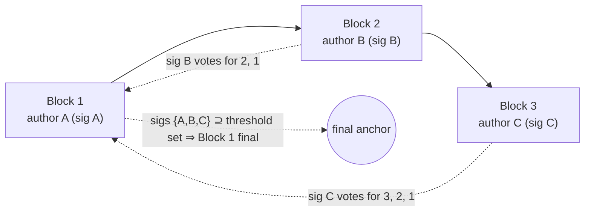

# Finality

> **Agent status:** Maintained reverse-engineered draft.
> **Engineer verification:** Pending.
> **Status:** Draft; pending engineer verification.
> **Scope:** Defines the implementation-neutral finality behavior, assumptions, constraints, security properties, and black-box test plan.

## Contents

- [Purpose & observable contract](#1-purpose--observable-contract)
- [Continuous execution](#2-continuous-execution)
- [Signing is a non-equivocating vote](#3-signing-is-a-non-equivocating-vote)
- [Virtual voting](#4-virtual-voting)
- [Leader election](#5-leader-election)
- [The three finality routes and the exact threshold](#6-the-three-finality-routes-and-the-exact-threshold)
- [Non-final transitions are carried forward](#7-non-final-transitions-are-carried-forward)
- [On-chain fallback when threshold finality is not reached](#8-on-chain-fallback-when-threshold-finality-is-not-reached)
- [Assumptions and constraints](#assumptions-and-constraints)
- [Security considerations](#security-considerations)
- [Requirements and invariants](#requirements-and-invariants)
- [Verification and test plan](#verification-and-test-plan)
- [Future Work](#future-work)

## 1. Purpose & observable contract

A block is **final** when the protocol can prove to the chain that no competing history over that
block can win. Finality is what a snapshot update needs ([lifecycle.md §5](../settlement/lifecycle.md)); it is
deliberately **decoupled from progress** — execution never stops to wait for it.

## 2. Continuous execution

**`REQ-FIN-1-SP669G`.** Participants MUST NOT be required to wait for explicit threshold finality before
building the next block. The scheduled author builds on the latest valid state immediately, even
when that state's block has not yet collected all signatures. Requiring agreement before progress
contradicts the liveness model: one slow or absent signer would stall the channel even though the
dispute path can already prove and carry the unagreed suffix forward.

This corrects the old specification's §5.4, which required an instance not to build on unagreed
blocks. The correction is the intended design, and it is also what the required behavior provides.

## 3. Signing is a non-equivocating vote

**`INV-FIN-2-MK27J6`.** Signing a block is a binding, non-equivocating vote for that block **and the
history it links to**. A participant MUST NOT sign two different blocks at the same
`(forkId, height)` or otherwise commit to conflicting histories — the **no-switch rule**: it
applies before any automatic acceptance or additive signing, direct and descendant votes are
commitments, and a conflicting tower receipt keeps its availability and evidence meaning without
becoming the peer's finality vote. Divergent same-fork histories do not by themselves expose a
double-sign: the represented participant's normal block beside their tower's valid restricted AFK
block is a legal split ([`REQ-WT-3-DT0GDX`](../runtime/watchtowers.md#req-wt-3-dt0gdx)). An
explicit pair of signatures recovering to the same participant key over two distinct same-height
blocks — in any author or confirmation role, including confirming both sides of the legal split —
is provable participant fraud, slashed with the full channel stake by the same-key
`BlockDoubleSign` proof ([`REQ-FP-2-CH4DA1`](../disputes/fraud-proofs.md#req-fp-2-ch4da1)).
Conflicting history commitments without such a qualifying explicit pair — indirect or
descendant-inferred conflicts — remain prohibited behavior whose enforcement is the bounded
residual [`OQ-49-2Z3FAS`](../open-questions.md#oq-49-2z3fas); no proof is widened to cover them. A frozen selected tower's confirmations carry their own non-equivocation classes and burn
the tower's permanent bond ([`INV-WT-1-ST9SHX`](../runtime/watchtowers.md#inv-wt-1-st9shx)).
Neither punishment resolves a conflicting same-fork split: for the normal-versus-AFK pair, an
honest non-target participant required on both certificates supplies its own vote on at most one
history — its tower cannot replace it — so once it commits, the competing certificate cannot
complete without a no-switch violation; where no such honest required non-target exists, the
accepted pre-publication race applies and every later accepted history preserves the exact latest
settled checkpoint ([`REQ-LIF-2-Z3Z9Y3`](../settlement/lifecycle.md#req-lif-2-z3z9y3)). Local
refusal to switch signatures never prevents adopting the dispute game's new fork; that
successor-adoption rule is not a permission to adopt or sign a competing same-fork checkpoint.

This invariant is what makes the rest of this document safe: votes can be counted across blocks
(§4) because no participant can validly vote for two competing histories, and a non-final suffix
can be carried forward (§7, [state-proofs.md §6](../disputes/state-proofs.md)) because extending it never
requires trusting an unbacked claim.

## 4. Virtual voting

**`REQ-FIN-3-9P9J4Q`.** A signature on block _B_ is also an indirect vote for every ancestor of _B_ on the
same hash-linked chain. Finality votes are **cumulative across ancestry in actual participant
votes**: a direct participant author or confirmation signature votes for its block and every
linked ancestor, the votes for a block are the union of the direct votes on it and on its linked
descendants, and each participant deduplicates to one vote while every signature artifact stays
retained. Selected-tower receipts and tower-authored descendants generate no assigned peer's
virtual participant finality — tower-derived authority supplies **availability credit** only,
while a recovered signer that is itself a participant keeps that identity's own direct and
virtual vote (central key policy, [identity.md](./identity.md#identity))
([`REQ-FIN-7-RTZWQZ`](finality.md#req-fin-7-rtzwqz)), with the single target-only AFK exception
there; verified descendant evidence may likewise carry a participant's or its frozen tower's
**acknowledgement** to the exact normal ancestor for ordinary-timeout defense, without turning it
into a finality vote.

**`REQ-FIN-4-ZFDDS6`.** Consequently, in a channel with _N_ participants, _N_ consecutive blocks authored
by the complete participant set finalize the **first** block of the sequence, even if no
participant other than its author ever signed that first block directly: each author's signature
on their own block is a vote for all its ancestors, and the _N_ authors together cover the
threshold set.

## 5. Leader election

**`REQ-FIN-5-DH29VZ`.** Block authoring is deterministic: `getNextToWrite()` — a pure function of the

**[`REQ-FIN-6-YZWJX2`](finality.md#req-fin-6-yzwjx2) (SHOULD).** The recommended policy is **round-robin** over the participant set, as a
function of channel state (e.g.
`the illustrative round-robin rule`:
`participants[currentTurnIndex % participants.length]`). The safety argument for carrying
non-final suffixes forward (§7) **depends on** round-robin; see the open question below.

Authoring is time-slotted: the author has `p2pTime` from the previous relevant timestamp to
produce the block ([lifecycle.md §8](../settlement/lifecycle.md), [time.md](./time.md)). A missed slot is
objectively disputable: peers schedule a timeout check for
`p2pTime + agreementTime + chainFallbackTime` (+ first-block grace)
(`the corresponding participant-state operation`) and
then open a timeout dispute against the scheduled author
([disputes.md](../disputes/disputes.md)).

**Open question (leader election beyond round-robin):** under a different leader-election policy a
valid non-final suffix may become revertible, changing the safety, liveness, and accountability
analysis. Any objectively provable violation that a revert implies should have a clearly
attributable, slashable party, but the attribution and penalty rules are unresolved. Long-lived
channels and long-range milestone chains also need an argument that proofs stay bounded and that
long-range conflicting histories are prevented or recoverable. Before another policy is supported,
its schedule, its interaction with virtual voting and longest-valid-chain reduction, the exact
revert conditions, and the accountable party for each violation must be specified. Mirrored in
[open-questions.md](../open-questions.md) and cross-referenced from
[state-proofs.md](../disputes/state-proofs.md).

## 6. The three finality routes and the exact threshold

Finality arrives by exactly one of three routes:

1. **Explicit threshold finality.** Every required participant supplied its own vote — a direct
   author or confirmation signature — so the `BlockConfirmation` carries a full participant vote
   set; the single exception is the AFK target's credit on the exact restricted AFK block below.
2. **Virtual finality.** Later cryptographically linked blocks supply the missing votes (§4).
3. **Dispute resolution.** No threshold was reached in time; a participant submits the latest
   available (possibly non-final) proved state to the dispute game, and after reduction and the
   challenge period the result is canonical ([disputes.md](../disputes/disputes.md)).

**`REQ-FIN-7-RTZWQZ`.** The threshold is **unanimous** over the _relevant participant set_:

- Off-chain: `the corresponding agreement-tracking operation`
  requires signatures from the union of the block's previous and resulting participant sets, so a
  membership-changing block needs both the old set and the joiner/leaver where applicable
  ([state-proofs.md §5](../disputes/state-proofs.md)).
- On-chain (milestones): `_isMilestoneFinalWithExpectedParticipants` requires
  `thresholdCount == expectedParticipants.length`, where the expected set is the union of the
  previous snapshot's participants, the resulting snapshot's participants, and joiners derived
  from the inbound-message interval committed between the two snapshots' inbound hashes — not the
  chain's live pending set
  (`the corresponding state-proof verification operation`).
- On-chain (disputes): a threshold-final dispute confirmation requires signatures from
  `getOnChainThresholdSet` = (snapshot participants ∪ pending participants) − on-chain-slashed
  (`common adjudication logic`),
  and finalizes the dispute window immediately
  (`DisputeManagerFacet._isDisputeThresholdFinal`).
- **Availability credits are separate from finality votes.** A tower receipt credits
  **availability** for every historically eligible participant assigned to that tower,
  deduplicated against direct acknowledgements; the availability threshold gates calldata
  skipping and ordinary-timeout acknowledgement only
  ([`REQ-DIS-12-1ZN453`](../disputes/disputes.md#req-dis-12-1zn453),
  [`REQ-WT-4-PNMYMP`](../runtime/watchtowers.md#req-wt-4-pnmymp)). Ordinary block, milestone, and
  virtual **finality** count actual participants' direct author and confirmation votes and their
  verified descendant votes; a recovered signer that is itself a participant keeps its own
  participant-vote effect even when the same signature also derives assigned peers' availability
  credits, and tower-derived credit never substitutes for an assigned peer's ordinary finality
  vote (the overlap rule of the central key policy,
  [identity.md](./identity.md#identity)) — with exactly one exception: a valid signature by the AFK target's
  frozen authoring tower on the exact valid target-removal AFK block supplies **that target's one
  finality credit on that block only** — validated against channel, fork, slot, the target
  scheduled in its proved pre-state, frozen epoch, restricted window, canonical body, and
  resulting removal; author and same-block confirmation carriers deduplicate to one target
  credit, and neither supplies another represented peer's credit. Every other required
  participant must vote itself, directly or through its own signed descendant; the same tower
  representing several peers still supplies only its AFK target's credit. Later slashes and tower
  bars never rewrite historical thresholds; historical unions use historical membership, and
  same participant sets permit reuse of a threshold set, never proof of ancestry.
  Dispute-confirmation thresholds are separate: substitution there remains limited to the exact
  signed-dispute `WatchtowerDisputeApproval` of
  [`REQ-DIS-14-032T4M`](../disputes/disputes.md#req-dis-14-032t4m) — no block receipt supplies a
  dispute-confirmation vote, and availability completion never creates a final snapshot,
  milestone, settlement right, or dispute-confirmation vote.

Sub-unanimous thresholds are not supported anywhere in the protocol definition.

**One agreement threshold; the chain verifies views of it.** The three formulas above are not
three independent threshold designs. The protocol has exactly one agreement threshold: the
peer-to-peer union of a block's previous and resulting participant sets. Every honest transition
is authorized by that union — the existing set admits a joiner and the joiner consents to enter;
the remaining set agrees to a removal and the leaving participant consents to leave. In an honest
execution, verifying that one threshold across every transition is sufficient; pending joiners
become part of the resulting set when their inbound messages are consumed.

The chain is a third-party verifier over a different memory space: it holds a stale snapshot plus
the inbound messages, slashes, and other facts it has recorded — never the live peer-to-peer
state. It does not replay the off-chain history or re-establish that every transition followed
the protocol; it checks the invariants it can verify from a submitted proof and its own records.
The two on-chain formulas are its acceptance rules for such proofs, not additional agreement
thresholds:

- **Pending joiners in the milestone set are evidence, not a second threshold.** If the chain has
  recorded an inbound join that its snapshot does not yet include, a proof advancing the snapshot
  must show that the joiner was part of the agreement. The verifier therefore derives joiners
  from the inbound interval committed between the proof's two snapshots; in an honest transition
  those joiners already appear in the resulting set, and the milestone set reduces to the plain
  previous∪resulting union. The explicit derivation exists so the chain can reject a proof that
  consumes a recorded join while omitting the joiner. The same goal drives the same-fork
  inbound-consumption rule ([cross-layer-messages.md §2](../settlement/cross-layer-messages.md)):
  a snapshot update must consume the chain's complete inbound head, so a proof cannot advance the
  chain while leaving a recorded join or deposit behind.
- **Slash subtraction is a current-eligibility rule, never a historical one.** Subtracting the
  on-chain slash set is an explicit adjudication decision: after a fraud proof, the chain has
  decided the slashed participant forfeited the right to block threshold resolution, so the
  remaining participants may finalize without that signature. The rule applies only to
  point-in-time chain decisions — dispute participation and threshold-final dispute confirmation
  — that ask who is eligible _now_ and do not replay a linked history. Historical, replayable
  evidence (milestones, state proofs) always requires the complete normal threshold: a proof MUST
  have the same validity before and after any later slash, so later adjudication can never relax
  or invalidate the signatures a past transition required
  ([state-proofs.md §4](../disputes/state-proofs.md)). Join admission is likewise a
  point-in-time chain decision and uses the same slash-excluding eligibility set — a slashed
  participant cannot veto later admissions
  ([cross-layer-messages.md §4](../settlement/cross-layer-messages.md)).

**Implicit attestation — exact conditions.** A signature counts as an implicit finality vote for
an earlier block if and only if: both blocks are on the same `forkId`; the chain between them is
hash-linked (`previousBlockHash == keccak256(previous encodedBlock)` at every step); the author
signature on each carrying block is authentic and matches the block's declared author under the
two-case predicate; the signer is an actual participant (tower-derived authority supplies no
assigned peer's implicit finality vote, while a recovered signer that is itself a participant
keeps its own — the target-only AFK credit applies to the exact AFK block itself, never to a
different earlier anchor, later block, or unrelated branch); and each participant's vote counts
at most once per threshold set. Acknowledgement derivation is separate: direct participant
signatures and frozen selected-tower receipts supply **availability credit** under historical
eligibility and assignment, and verified descendant evidence may carry that acknowledgement to
the exact normal ancestor for ordinary-timeout defense — shared-tower availability credits derive
and deduplicate the same way, without ever becoming finality votes. These are exactly the checks
the milestone verifier applies ([state-proofs.md §7](../disputes/state-proofs.md)).

## 7. Non-final transitions are carried forward

**`INV-FIN-8-G6V1M1`.** Valid transitions of the **selected proved history** that lacked finality when a
dispute began are **not reverted**. The dispute reduction selects the _longest valid proved
history_ **among continuations compatible with the current settled checkpoint** — `the
corresponding dispute-verification operation` keeps the candidate latest block with the highest
`transactionCnt` (ties broken deterministically by lower block hash) — and the successor fork's
genesis state is derived from that latest state. A losing unfinalized branch is not carried into
the successor: legal normal/AFK alternatives make a divergent suffix possible without any
double-sign, and only the selected branch's valid transitions survive; a surviving AFK-evidence
timeout is carried independently of the winning branch
([disputes.md §5](../disputes/disputes.md#5-reduction-rules-and-order-independence)). Local
refusal to switch signatures does not prevent adopting the dispute game's new fork. (With the
round-robin caveat of §5's open question.)

## 8. On-chain fallback when threshold finality is not reached

When the author does not see the full threshold within `agreementTime`, it posts the signed block
as calldata on-chain
(`the corresponding participant-state operation` →
`StateChannelManagerProxy.postBlockCalldata`):

- **Data availability.** The chain itself becomes the guarantor that the block data is available:
  peers ingest `BlockCalldataPosted` events, so an uncooperative peer cannot claim it never saw
  the block. No separate data-availability trust assumption is added. Costs and griefing exposure:
  [security/data-availability.md](../security/data-availability.md).
- **Cheap commitment, slashable junk.** The contract stores a single hash
  `keccak256(signedBlock, block.timestamp)`, never overwritable, and requires
  `msg.sender == block author`. It does **not** validate the block; posting junk is provable
  against the commitment and slashable against the poster.
- **Race-condition guard.** The post carries `maxTimestamp` = previous relevant timestamp +
  `p2pTime + agreementTime + chainFallbackTime` (+ grace); the chain rejects later posts, which
  bounds how late a block can be forced into the record.
- **Extra time granted — ordinary mode only.** A posted commitment changes the timing rules: the
  acceptable block-timestamp window extends by `evidenceTime` for calldata-committed blocks
  (`block-validation service`,
  `CalldataCommittedStrategy`),
  and an **ordinary** timeout dispute against an author who posted calldata for the claimed
  height is rejected on-chain (`RaceConditionDisputeTimeoutCalldataPosted`,
  `DisputeManagerFacet._disputeRaceConditionCheck`). Calldata is publication and ordinary
  defense, never global branch priority: it does not defeat a timeout carried by a valid
  restricted AFK block, whose target-slot upload rejection and calldata kill are waived in either
  posting order ([`REQ-DIS-13-1WWHS0`](../disputes/disputes.md#req-dis-13-1wwhs0)). Author-bound,
  immutable first-post commitments are preserved; if the restricted AFK block is published
  through ordinary block calldata, the poster is its tower author, the bound bytes and restricted
  window still apply, and this neither uses the represented participant's author-key posting slot
  nor authorizes general tower transactions — and an on-chain timeout submission carries the
  complete artifact even without a prior AFK calldata post. When peers do not cooperate, this
  extra on-chain time is a deliberate UX and fee cost of the protocol design.

If the threshold still never arrives, route 3 applies: any eligible participant disputes with the
latest proved state ([state-proofs.md](../disputes/state-proofs.md)), and the reduction carries the valid
suffix forward (§7).

## Assumptions and constraints

Finality assumes unforgeable, domain-separated signatures; a known participant set at each membership point;
deterministic block and snapshot commitments; at least one path to the base chain; and a leader schedule whose
safety properties match the dispute carry-forward argument. Progress may continue without threshold finality,
but settlement cannot claim a finality route whose exact signer/virtual-vote conditions are unmet. Participant,
signature, proof-size, and timing bounds must remain compatible with on-chain verification.

## Security considerations

The protected property is that two conflicting histories cannot both become final or settle the same funds.
Threats include equivocation, signature replay across domains, incorrect thresholds, stale membership,
double-counted virtual votes, wrong-leader blocks, non-final suffix truncation, and unavailable calldata during
fallback. Verification must test both sides of every threshold and membership transition, competing forks,
duplicate/reordered signatures, delayed votes, and recovery through the chain. Leader-election and signature
domain-separation questions are security blockers, not optimization details.

## Requirements and invariants

**[`REQ-FIN-1-SP669G`](finality.md#req-fin-1-sp669g).** Participants build on the latest valid state immediately; explicit threshold finality is never a precondition for producing the next block.

**[`INV-FIN-2-MK27J6`](finality.md#inv-fin-2-mk27j6).** Signing is a non-equivocating vote (no-switching); an explicit same-key same-height signature pair in any role is fully slashable participant fraud, while legal normal/AFK splits are not equivocation.

**[`REQ-FIN-3-9P9J4Q`](finality.md#req-fin-3-9p9j4q).** Actual participant votes accumulate across hash-linked ancestry (virtual voting); tower-derived credit carries availability, never an assigned peer's finality vote — a recovered signer that is itself a participant keeps its own vote.

**[`REQ-FIN-4-ZFDDS6`](finality.md#req-fin-4-zfdds6).** N consecutive blocks authored by the complete participant set finalize the sequence's first block.

**[`REQ-FIN-5-DH29VZ`](finality.md#req-fin-5-dh29vz).** Deterministic block-level authoring via `getNextToWrite`; a missed slot is timeout-disputable.

**`REQ-FIN-6-YZWJX2`.** Recommended leader-election policy is round-robin as a function of channel state.

**[`REQ-FIN-7-RTZWQZ`](finality.md#req-fin-7-rtzwqz).** The finality threshold is unanimous in actual participant votes over the relevant union set (minus on-chain-slashed, for disputes), with the single target-only AFK credit; availability credits are a separate count.

**[`INV-FIN-8-G6V1M1`](finality.md#inv-fin-8-g6v1m1).** Valid non-final transitions are carried into the canonical successor fork, not reverted (longest valid proved history wins).

## Verification and test plan

### Requirement test matrix

Each row is a planned black-box test obligation, not an additional specification requirement. The requirement remains the authority. Execute the row through public protocol inputs from every applicable pre-state defined by this document. Every required permutation has a stable `P1`…`PN` suffix under its plan item. The list is exhaustive unless it explicitly says that boundary or pairwise representatives are sufficient; an omitted permutation needs an engineer-approved rationale.

| Plan item                                             | Requirements / invariants                          | Setup and stimulus                                                                                                                                    | Expected result                                                                                                                             | Required permutations                                                                                                                                                                                                                                                                                                                                                                                                                                                                                                                                                                                                                                                                                                                                                                                                                                                                                                                                                                                                                                                                                                                                                                                                                                                                                                                                                                                                                                                                                                                                                                                                                                                                                                                                                                                                                                                                                                                                                                                                                                                                                                                                                                                                                                                                                                                                                                                                                                                                                                                                                                                                                                                                                                                                                                                                                                                                                                                                                                                                                                                                                                                                                                                                                                                                                                                                                                                                                                                                                                                                                                                                                                                                                                                                                     |
| ----------------------------------------------------- | -------------------------------------------------- | ----------------------------------------------------------------------------------------------------------------------------------------------------- | ------------------------------------------------------------------------------------------------------------------------------------------- | ------------------------------------------------------------------------------------------------------------------------------------------------------------------------------------------------------------------------------------------------------------------------------------------------------------------------------------------------------------------------------------------------------------------------------------------------------------------------------------------------------------------------------------------------------------------------------------------------------------------------------------------------------------------------------------------------------------------------------------------------------------------------------------------------------------------------------------------------------------------------------------------------------------------------------------------------------------------------------------------------------------------------------------------------------------------------------------------------------------------------------------------------------------------------------------------------------------------------------------------------------------------------------------------------------------------------------------------------------------------------------------------------------------------------------------------------------------------------------------------------------------------------------------------------------------------------------------------------------------------------------------------------------------------------------------------------------------------------------------------------------------------------------------------------------------------------------------------------------------------------------------------------------------------------------------------------------------------------------------------------------------------------------------------------------------------------------------------------------------------------------------------------------------------------------------------------------------------------------------------------------------------------------------------------------------------------------------------------------------------------------------------------------------------------------------------------------------------------------------------------------------------------------------------------------------------------------------------------------------------------------------------------------------------------------------------------------------------------------------------------------------------------------------------------------------------------------------------------------------------------------------------------------------------------------------------------------------------------------------------------------------------------------------------------------------------------------------------------------------------------------------------------------------------------------------------------------------------------------------------------------------------------------------------------------------------------------------------------------------------------------------------------------------------------------------------------------------------------------------------------------------------------------------------------------------------------------------------------------------------------------------------------------------------------------------------------------------------------------------------------------------------------- |
| `REQ-FIN-1-SP669G.T1` | [`REQ-FIN-1-SP669G`](finality.md#req-fin-1-sp669g) | Use the applicable black-box method in the verification strategy above; exercise the behavior through public inputs without implementation internals. | Participants build on the latest valid state immediately; explicit threshold finality is never a precondition for producing the next block. | `REQ-FIN-1-SP669G.T1.P1` — valid case `REQ-FIN-1-SP669G.T1.P2` — correct identity and signature `REQ-FIN-1-SP669G.T1.P3` — direct invalid/opposite case `REQ-FIN-1-SP669G.T1.P4` — wrong-identity signature `REQ-FIN-1-SP669G.T1.P5` — missing signature `REQ-FIN-1-SP669G.T1.P6` — duplicate signature `REQ-FIN-1-SP669G.T1.P7` — forged signature `REQ-FIN-1-SP669G.T1.P8` — membership-boundary signer                                                                                                                                                                                                                                                                                                                                                                                                                                                                                                                                                                                                                                                                                                                                                                                                                                                                                                                                                                                                                                                                                                                                                                                                                                                                                                                                                                                                                                                                                                                                                                                                                                                                                                                                                                                                                                                                                                                                                                                                                                                                                                                                                                                                                                                                                                                                                                                                                                                                                                                                                                                                                                                                                                                                                                                                                                                                                                                                                                                                                                                    |
| `INV-FIN-2-MK27J6.T1` | [`INV-FIN-2-MK27J6`](finality.md#inv-fin-2-mk27j6) | Use the applicable black-box method in the verification strategy above; exercise the behavior through public inputs without implementation internals. | Signing is a non-equivocating vote; provable equivocation is slashable.                                                                     | `INV-FIN-2-MK27J6.T1.P1` — valid case `INV-FIN-2-MK27J6.T1.P2` — correct identity and signature `INV-FIN-2-MK27J6.T1.P3` — new participant `INV-FIN-2-MK27J6.T1.P4` — direct invalid/opposite case `INV-FIN-2-MK27J6.T1.P5` — wrong-identity signature `INV-FIN-2-MK27J6.T1.P6` — missing signature `INV-FIN-2-MK27J6.T1.P7` — duplicate signature `INV-FIN-2-MK27J6.T1.P8` — forged signature `INV-FIN-2-MK27J6.T1.P9` — membership-boundary signer `INV-FIN-2-MK27J6.T1.P10` — existing participant `INV-FIN-2-MK27J6.T1.P11` — removed participant `INV-FIN-2-MK27J6.T1.P12` — slashed participant `INV-FIN-2-MK27J6.T1.P13` — concurrent membership change `INV-FIN-2-MK27J6.T1.P14` — tower double-sign, both delivery orders: one frozen tower confirms two distinct blocks at the same channel, fork, and height — objective tower equivocation in either order `INV-FIN-2-MK27J6.T1.P15` — shared-tower double availability: one shared tower completes both competing availability thresholds; both signatures are punishable tower fraud, neither history gains finality votes from them, and the settled history follows checkpoint-preserving settlement — punishment never reopens it `INV-FIN-2-MK27J6.T1.P16` — non-contradictions: tower confirmations at different heights or different forks contradict nothing `INV-FIN-2-MK27J6.T1.P17` — duplicate delivery of the same block's tower confirmation: no contradiction, no penalty `INV-FIN-2-MK27J6.T1.P18` — no-switch under the legal split: normal-first, AFK-first, concurrent arrival, restart, and descendant commitments never produce a conflicting participant vote — the committed branch is kept in every ordering `INV-FIN-2-MK27J6.T1.P19` — evidence without adoption: a normal-history signer submits the valid AFK artifact as timeout evidence, and an own-tower conflicting receipt is stored as availability evidence, with no conflicting block vote in either case `INV-FIN-2-MK27J6.T1.P20` — honest required non-target: Bob, required on both certificates and not the AFK target, commits to one history directly or through a descendant — the competing certificate cannot complete because their tower cannot supply their vote                                                                                                                                                                                                                                                                                                                                                                                                                                                                                                                                                                                                                                                                                                                                           |
| `REQ-FIN-3-9P9J4Q.T1` | [`REQ-FIN-3-9P9J4Q`](finality.md#req-fin-3-9p9j4q) | Use the applicable black-box method in the verification strategy above; exercise the behavior through public inputs without implementation internals. | Signatures accumulate across hash-linked ancestry (virtual voting).                                                                         | `REQ-FIN-3-9P9J4Q.T1.P1` — valid case `REQ-FIN-3-9P9J4Q.T1.P2` — matching commitment `REQ-FIN-3-9P9J4Q.T1.P3` — correct identity and signature `REQ-FIN-3-9P9J4Q.T1.P4` — direct invalid/opposite case `REQ-FIN-3-9P9J4Q.T1.P5` — mismatched commitment `REQ-FIN-3-9P9J4Q.T1.P6` — predecessor link `REQ-FIN-3-9P9J4Q.T1.P7` — genesis link `REQ-FIN-3-9P9J4Q.T1.P8` — stale fork `REQ-FIN-3-9P9J4Q.T1.P9` — foreign fork `REQ-FIN-3-9P9J4Q.T1.P10` — wrong-identity signature `REQ-FIN-3-9P9J4Q.T1.P11` — missing signature `REQ-FIN-3-9P9J4Q.T1.P12` — duplicate signature `REQ-FIN-3-9P9J4Q.T1.P13` — forged signature `REQ-FIN-3-9P9J4Q.T1.P14` — membership-boundary signer `REQ-FIN-3-9P9J4Q.T1.P15` — no virtual tower finality: with a recovered tower signer that is not itself a channel participant, the frozen tower confirms a linked descendant while the assigned participant never signs — the ancestor gains **no** finality vote from it, while the descendant-carried acknowledgement still defends the participant against an ordinary timeout on the exact ancestor `REQ-FIN-3-9P9J4Q.T1.P16` — direct-plus-tower across different blocks: with a recovered tower signer that is not itself a channel participant, the participant's direct descendant signature supplies the ancestor's finality vote, its tower's confirmation supplies availability acknowledgement only, and the two deduplicate to one credit in each separate count `REQ-FIN-3-9P9J4Q.T1.P17` — wrong assignment: a descendant confirmation from a tower not frozen for the participant derives no availability acknowledgement and no vote of any kind                                                                                                                                                                                                                                                                                                                                                                                                                                                                                                                                                                                                                                                                                                                                                                                                                                                                                                                                                                                                                                                                                                                                                                                                                                                                                                                                                                                                                                             |
| `REQ-FIN-4-ZFDDS6.T1` | [`REQ-FIN-4-ZFDDS6`](finality.md#req-fin-4-zfdds6) | Use the applicable black-box method in the verification strategy above; exercise the behavior through public inputs without implementation internals. | N consecutive blocks authored by the complete participant set finalize the sequence's first block.                                          | `REQ-FIN-4-ZFDDS6.T1.P1` — valid case `REQ-FIN-4-ZFDDS6.T1.P2` — correct identity and signature `REQ-FIN-4-ZFDDS6.T1.P3` — direct invalid/opposite case `REQ-FIN-4-ZFDDS6.T1.P4` — wrong-identity signature `REQ-FIN-4-ZFDDS6.T1.P5` — missing signature `REQ-FIN-4-ZFDDS6.T1.P6` — duplicate signature `REQ-FIN-4-ZFDDS6.T1.P7` — forged signature `REQ-FIN-4-ZFDDS6.T1.P8` — membership-boundary signer                                                                                                                                                                                                                                                                                                                                                                                                                                                                                                                                                                                                                                                                                                                                                                                                                                                                                                                                                                                                                                                                                                                                                                                                                                                                                                                                                                                                                                                                                                                                                                                                                                                                                                                                                                                                                                                                                                                                                                                                                                                                                                                                                                                                                                                                                                                                                                                                                                                                                                                                                                                                                                                                                                                                                                                                                                                                                                                                                                                                                                                    |
| `REQ-FIN-5-DH29VZ.T1` | [`REQ-FIN-5-DH29VZ`](finality.md#req-fin-5-dh29vz) | Use the applicable black-box method in the verification strategy above; exercise the behavior through public inputs without implementation internals. | Deterministic block-level authoring via `getNextToWrite`; a missed slot is timeout-disputable.                                              | `REQ-FIN-5-DH29VZ.T1.P1` — valid case `REQ-FIN-5-DH29VZ.T1.P2` — correct identity and signature `REQ-FIN-5-DH29VZ.T1.P3` — before deadline `REQ-FIN-5-DH29VZ.T1.P4` — direct invalid/opposite case `REQ-FIN-5-DH29VZ.T1.P5` — wrong-identity signature `REQ-FIN-5-DH29VZ.T1.P6` — missing signature `REQ-FIN-5-DH29VZ.T1.P7` — duplicate signature `REQ-FIN-5-DH29VZ.T1.P8` — forged signature `REQ-FIN-5-DH29VZ.T1.P9` — membership-boundary signer `REQ-FIN-5-DH29VZ.T1.P10` — at deadline `REQ-FIN-5-DH29VZ.T1.P11` — after deadline `REQ-FIN-5-DH29VZ.T1.P12` — maximum honest skew                                                                                                                                                                                                                                                                                                                                                                                                                                                                                                                                                                                                                                                                                                                                                                                                                                                                                                                                                                                                                                                                                                                                                                                                                                                                                                                                                                                                                                                                                                                                                                                                                                                                                                                                                                                                                                                                                                                                                                                                                                                                                                                                                                                                                                                                                                                                                                                                                                                                                                                                                                                                                                                                                                           |
| `REQ-FIN-6-YZWJX2.T1` | [`REQ-FIN-6-YZWJX2`](finality.md#req-fin-6-yzwjx2) | Use the applicable black-box method in the verification strategy above; exercise the behavior through public inputs without implementation internals. | Recommended leader-election policy is round-robin as a function of channel state.                                                           | `REQ-FIN-6-YZWJX2.T1.P1` — valid case `REQ-FIN-6-YZWJX2.T1.P2` — zero case where meaningful `REQ-FIN-6-YZWJX2.T1.P3` — direct invalid/opposite case `REQ-FIN-6-YZWJX2.T1.P4` — empty case where meaningful `REQ-FIN-6-YZWJX2.T1.P5` — no-op case where meaningful `REQ-FIN-6-YZWJX2.T1.P6` — exact boundary `REQ-FIN-6-YZWJX2.T1.P7` — failure and recovery `REQ-FIN-6-YZWJX2.T1.P8` — relevant race                                                                                                                                                                                                                                                                                                                                                                                                                                                                                                                                                                                                                                                                                                                                                                                                                                                                                                                                                                                                                                                                                                                                                                                                                                                                                                                                                                                                                                                                                                                                                                                                                                                                                                                                                                                                                                                                                                                                                                                                                                                                                                                                                                                                                                                                                                                                                                                                                                                                                                                                                                                                                                                                                                                                                                                                                                                                                                                                                                                                                                                         |
| `REQ-FIN-7-RTZWQZ.T1` | [`REQ-FIN-7-RTZWQZ`](finality.md#req-fin-7-rtzwqz) | Use the applicable black-box method in the verification strategy above; exercise the behavior through public inputs without implementation internals. | The finality threshold is unanimous over the relevant union participant set (minus on-chain-slashed, for disputes).                         | `REQ-FIN-7-RTZWQZ.T1.P1` — valid case `REQ-FIN-7-RTZWQZ.T1.P2` — correct identity and signature `REQ-FIN-7-RTZWQZ.T1.P3` — new participant `REQ-FIN-7-RTZWQZ.T1.P4` — malformed input `REQ-FIN-7-RTZWQZ.T1.P5` — direct invalid/opposite case `REQ-FIN-7-RTZWQZ.T1.P6` — wrong-identity signature `REQ-FIN-7-RTZWQZ.T1.P7` — missing signature `REQ-FIN-7-RTZWQZ.T1.P8` — duplicate signature `REQ-FIN-7-RTZWQZ.T1.P9` — forged signature `REQ-FIN-7-RTZWQZ.T1.P10` — membership-boundary signer `REQ-FIN-7-RTZWQZ.T1.P11` — existing participant `REQ-FIN-7-RTZWQZ.T1.P12` — removed participant `REQ-FIN-7-RTZWQZ.T1.P13` — slashed participant `REQ-FIN-7-RTZWQZ.T1.P14` — concurrent membership change `REQ-FIN-7-RTZWQZ.T1.P15` — adversarial input `REQ-FIN-7-RTZWQZ.T1.P16` — partial failure `REQ-FIN-7-RTZWQZ.T1.P17` — retry and recovery `REQ-FIN-7-RTZWQZ.T1.P18` — receipts are not votes: with a recovered tower signer that is not itself a channel participant, an assigned peer's finality vote is never supplied by an ordinary tower receipt, and a block with full availability but missing participant votes stays unfinalized `REQ-FIN-7-RTZWQZ.T1.P19` — shared-tower full availability: with a recovered tower signer that is not itself a channel participant, one tower signature credits every assigned participant's availability and completes the availability threshold alone, skipping calldata while finality stays false `REQ-FIN-7-RTZWQZ.T1.P20` — direct-plus-tower deduplication: with a recovered tower signer that is not itself a channel participant, both artifacts retained, one availability credit and at most one participant vote `REQ-FIN-7-RTZWQZ.T1.P21` — wrong or unassigned tower: no availability credit and no vote derived, both thresholds unmet `REQ-FIN-7-RTZWQZ.T1.P22` — block-versus-dispute separation: an ordinary tower block confirmation offered as a dispute-confirmation vote is rejected `REQ-FIN-7-RTZWQZ.T1.P23` — target-only AFK credit: the tower representing Alice, Bob, and Carol supplies exactly Alice's one finality credit on the exact valid Alice-removal AFK block; Bob and Carol must vote themselves, wrong target/epoch/body/window presentations are rejected, and author-plus-confirmation carriers deduplicate to one Alice credit `REQ-FIN-7-RTZWQZ.T1.P24` — the exception does not travel: the same tower's receipt on a normal block, its receipt on a descendant, or an AFK descendant substitutes for no other participant and no other anchor `REQ-FIN-7-RTZWQZ.T1.P25` — historical thresholds are stable: later slashes or tower bars subtract nothing from historical unions, and identical participant sets permit threshold-set reuse without proving ancestry |
| `INV-FIN-8-G6V1M1.T1` | [`INV-FIN-8-G6V1M1`](finality.md#inv-fin-8-g6v1m1) | Use the applicable black-box method in the verification strategy above; exercise the behavior through public inputs without implementation internals. | Valid non-final transitions are carried into the canonical successor fork, not reverted (longest valid proved history wins).                | `INV-FIN-8-G6V1M1.T1.P1` — valid case `INV-FIN-8-G6V1M1.T1.P2` — matching commitment `INV-FIN-8-G6V1M1.T1.P3` — direct invalid/opposite case `INV-FIN-8-G6V1M1.T1.P4` — mismatched commitment `INV-FIN-8-G6V1M1.T1.P5` — predecessor link `INV-FIN-8-G6V1M1.T1.P6` — genesis link `INV-FIN-8-G6V1M1.T1.P7` — stale fork `INV-FIN-8-G6V1M1.T1.P8` — foreign fork                                                                                                                                                                                                                                                                                                                                                                                                                                                                                                                                                                                                                                                                                                                                                                                                                                                                                                                                                                                                                                                                                                                                                                                                                                                                                                                                                                                                                                                                                                                                                                                                                                                                                                                                                                                                                                                                                                                                                                                                                                                                                                                                                                                                                                                                                                                                                                                                                                                                                                                                                                                                                                                                                                                                                                                                                                                                                                                                                                                                                                                                                              |

## Future Work

_Non-normative._

- Sub-unanimous or weighted thresholds: would change every union-set computation, the milestone
  verifier, and the dispute threshold; requires a fresh safety analysis against [`INV-FIN-2-MK27J6`](finality.md#inv-fin-2-mk27j6).
- Alternative leader-election policies (see the open question in §5) — including
  availability-aware schedules that skip repeatedly absent authors without a dispute.
- Signature aggregation (e.g. BLS) to shrink `BlockConfirmation`s and milestone proofs.
- Explicit finality gadgets/checkpointing for very long-lived channels so proofs stay bounded
  without trusting the whole suffix chain.
