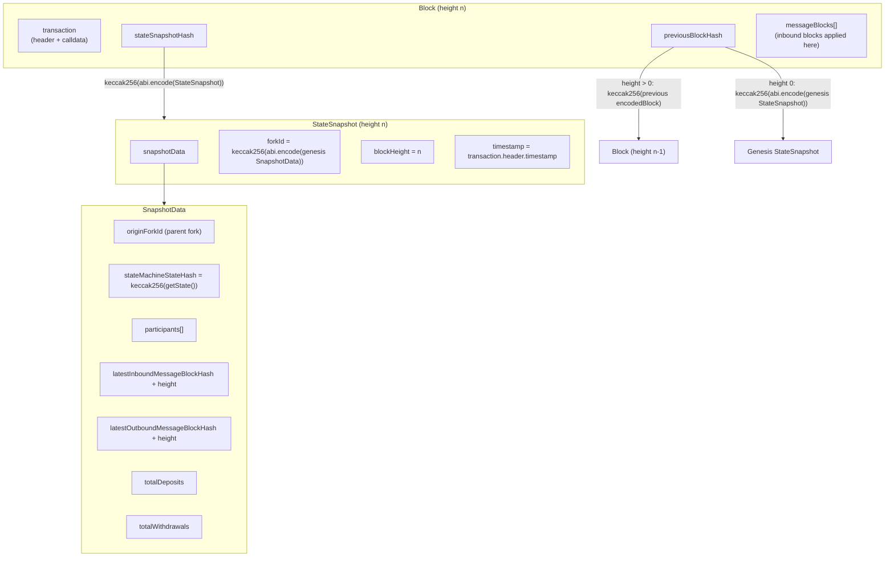

# History and Commitments

> **Agent status:** Maintained reverse-engineered draft.
> **Engineer verification:** Pending.
> **Status:** Draft; pending engineer verification.
> **Scope:** Defines the implementation-neutral history and commitments behavior, assumptions, constraints, security properties, and black-box test plan.
> **Related:** [state-machines.md](./state-machines.md) (what `stateMachineStateHash` covers),
> [../protocol/finality.md](./finality.md) (how signatures over this history finalize),
> [../protocol/state-proofs.md](../disputes/state-proofs.md) (how the history is proven),
> [../protocol/cross-layer-messages.md](../settlement/cross-layer-messages.md) (the message streams
> the snapshot commits to), [../protocol/time.md](./time.md) (timestamp rules).

## Contents

- [Purpose & observable contract](#1-purpose--observable-contract)
- [Transactions](#2-transactions)
- [Blocks and the commitment hierarchy](#3-blocks-and-the-commitment-hierarchy)
- [Forks](#4-forks)
- [Snapshots as the on-chain interface](#5-snapshots-as-the-on-chain-interface)
- [Assumptions and constraints](#assumptions-and-constraints)
- [Security considerations](#security-considerations)
- [Requirements and invariants](#requirements-and-invariants)
- [Verification and test plan](#verification-and-test-plan)
- [Future Work](#future-work)

## 1. Purpose & observable contract

Off-chain progress is a hash-linked chain of **blocks**, each committing to the complete channel
state after its transition through a **state snapshot**. The design goal is that any point in
history can be (a) referenced by a single 32-byte hash, (b) reconstructed from the data behind
that hash, and (c) adjudicated on-chain without the chain storing the history itself — the chain
stores only the current canonical snapshot and compact commitments.

What this model guarantees: given a valid hash-linked path from a trusted anchor (fork genesis or
a proven milestone), every field of every committed state along that path is bound by collision
resistance of keccak256. What it does not guarantee: availability of the pre-image data — that is
a separate concern (see [../security/data-availability.md](../security/data-availability.md)).

## 2. Transactions

A **transaction** is a single proposed state transition:

| Struct              | Field                 | Meaning                                                                                                                                                                 |
| ------------------- | --------------------- | ----------------------------------------------------------------------------------------------------------------------------------------------------------------------- |
| `TransactionHeader` | `channelId`           | The channel this transition belongs to.                                                                                                                                 |
|                     | `participant`         | The logical author (see [state-machines.md](./state-machines.md) §2).                                                                                                   |
|                     | `forkId`              | The fork this transition extends (§4).                                                                                                                                  |
|                     | `transactionCnt`      | The height on that fork. For this protocol version: one transaction per block, so this is also the block height (the off-chain participant reads it as `Block.height`). |
|                     | `timestamp`           | Protocol time of authorship; validated per [../protocol/time.md](./time.md).                                                                                            |
| `TransactionBody`   | `encodedData`, `data` | The EVM calldata to execute. For this protocol version: both fields carry the same calldata; the split is a placeholder for a polymorphic encoding.                     |
| `Transaction`       | `header`, `body`      | The proposed transition.                                                                                                                                                |

## 3. Blocks and the commitment hierarchy

A **block** is a committed transition:

```solidity
struct Block {
    Transaction transaction;
    bytes32 stateSnapshotHash;   // commitment to the post-state SNAPSHOT (not the raw state)
    bytes32 previousBlockHash;   // hash link to the predecessor
    MessageBlock[] messageBlocks; // inbound (chain -> channel) message blocks applied by this block
}
```

### 3.1 What a block commits to

A block does **not** commit directly to the serialized state-machine state. It commits to a
**state snapshot hash**, and the snapshot contains the state-machine state hash among other
required fields. The full hierarchy, as specified:



- **[`INV-HIST-1-5N44K9`](history-and-commitments.md#inv-hist-1-5n44k9)** — A block's `stateSnapshotHash` MUST equal
  `keccak256(abi.encode(StateSnapshot))` of the snapshot describing the channel immediately after
  this block's transition and inbound messages are applied. The serialized state-machine state is
  committed indirectly: `SnapshotData.stateMachineStateHash = keccak256(getState())`. Agreement
  and dispute verification MUST compare states at the snapshot level, never by re-hashing raw
  state alone, because participants, stream tips, and deposit/withdrawal totals are part of what
  is agreed.

The snapshot's non-state fields exist because state bytes alone are not enough to adjudicate:
`participants` fixes the signer set the next block needs, the inbound/outbound tips fix which
cross-layer messages are already accounted for, and `totalDeposits`/`totalWithdrawals` carry the
aggregate accounting the channel-balance invariant checks
([../protocol/cross-layer-messages.md](../settlement/cross-layer-messages.md)).

Construction lives in
the corresponding participant-state operation (builds
`SnapshotData` from the previous snapshot plus this block's effects) and
the corresponding participant-state operation (assembles the block).
The hash implementations are
StateSnapshot.hash (`keccak256` of the ABI-encoded
struct) and, on-chain, `keccak256(abi.encode(...))` of the same struct
(e.g. fraud-proof verifier).

### 3.2 Hash-linking

- **[`INV-HIST-2-27M8VA`](history-and-commitments.md#inv-hist-2-27m8va)** — Blocks MUST be hash-linked: for height > 0, `previousBlockHash` is
  `keccak256(encodedBlock)` of the predecessor block; for height 0 (the first block of a fork),
  `previousBlockHash` is `keccak256(abi.encode(StateSnapshot))` of the fork's genesis snapshot.
  A block whose link does not verify is not part of the history.

the corresponding participant-state operation uses
the previous block's hash or, when none exists on the fork, the previous snapshot's hash; the
on-chain check for height 0 compares against `keccak256(abi.encode(proof.previousStateSnapshot))`
(fraud-proof verifier.\_hasInvalidTimestamp).

### 3.3 Signatures over blocks

The block identity is `blockHash = keccak256(encodedBlock)` (ABI encoding of the `Block` struct).
Signing is an EIP-191 personal-message signature over the 32 raw bytes of `blockHash`
(Block.sign).

| Struct              | Meaning                                                                                                                                                                                                                                                                                        |
| ------------------- | ---------------------------------------------------------------------------------------------------------------------------------------------------------------------------------------------------------------------------------------------------------------------------------------------- |
| `SignedBlock`       | `encodedBlock` + the author's signature.                                                                                                                                                                                                                                                       |
| `BlockConfirmation` | A `SignedBlock` plus additional confirmation signatures over the same hash — direct participant signatures and valid frozen selected-tower confirmations, each a distinct retained artifact ([`REQ-BLOCK-PIPE-11-DCHAJ2`](../block-progression/block-processing.md#req-block-pipe-11-dchaj2)). |

Signing a block is a non-equivocating commitment to the block **and its entire ancestry** (the
hash links make the ancestry part of what is signed). How signatures accumulate into finality —
thresholds and virtual voting — is specified in
[../protocol/finality.md](./finality.md); provable double-signing is handled in
[../protocol/fraud-proofs.md](../disputes/fraud-proofs.md).

### 3.4 Message blocks inside blocks

`Block.messageBlocks` carries the **inbound** message blocks (chain → channel batches, e.g.
joins) that this block's author packaged and applied. Applying them advances
`SnapshotData.latestInboundMessageBlockHash/Height` and `totalDeposits` in the committed
snapshot. Referencing an inbound message block that was never persisted on-chain is fraud
(`ForgedInboundMessageBlock`; detection in
the corresponding participant-state operation).

**Outbound** message blocks are not embedded in the block struct. When a transition produces
outbound messages (exits, withdrawals), the off-chain participant builds the next block of the hash-linked outbound
stream (`MessageBlock { previousBlockHash, blockHeight, messages, totalBalance, timestamp }`) and
commits to its tip in the snapshot
(the corresponding participant-state operation). Both streams
and their incremental on-chain processing are specified in
[../protocol/cross-layer-messages.md](../settlement/cross-layer-messages.md).

- **[`INV-HIST-3-T17T78`](history-and-commitments.md#inv-hist-3-t17t78)** — Each snapshot MUST commit to the tips (hash and height) of both message streams as
  they stand after the block's effects; stream contents are bound through the streams' own
  hash-linking, mirroring HIST-2.

## 4. Forks

A **fork** is one branch of channel history.

- **[`INV-HIST-4-DSMGGT`](history-and-commitments.md#inv-hist-4-dsmggt)** — `forkId = keccak256(abi.encode(genesisSnapshotData))`: the fork identifier is the
  hash of the fork's genesis `SnapshotData`. Verified:
  StateChannelManagerProxy
  computes it exactly this way when building a genesis, and the off-chain participant's genesis test is
  `forkId == keccak256(abi.encode(snapshotData))`
  (StateSnapshot.isGenesis).

Note the level: the hash is over the genesis `SnapshotData` (the inner struct), not the full
`StateSnapshot`. Since `SnapshotData.originForkId` names the parent fork, a fork's identity
transitively commits to its entire fork ancestry back to the channel-opening genesis.

Forks arise at channel opening (the first fork's genesis is produced by `openChannelGenesis`) and
at dispute resolution: every completed dispute produces a canonical successor fork whose genesis
snapshot is derived from the dispute's reduced result, with `originForkId` pointing at the
disputed fork ([../protocol/disputes.md](../disputes/disputes.md)). Execution resumes from the
successor fork at height 0. Within one fork, height and hash-linking make history linear;
conflicting blocks at the same `(forkId, height)` are equivocation or invalid-transition
evidence, not a fork.

## 5. Snapshots as the on-chain interface

The chain stores one canonical `StateSnapshot` per channel and advances it when shown either
finality on the same fork or a finished dispute's successor fork
([../protocol/lifecycle.md](../settlement/lifecycle.md),
[../protocol/disputes.md](../disputes/disputes.md)). On every advance, the chain compares its
processed outbound-stream tip with the new snapshot's committed tip and processes the proven
difference incrementally — this is how ordinary withdrawals and exits happen
([../protocol/cross-layer-messages.md](../settlement/cross-layer-messages.md)).

Related chain-side commitment: `postBlockCalldata` persists
`keccak256(abi.encode(signedBlock, block.timestamp))` keyed by channel, signer, fork, and height
(StateChannelManagerProxy).
It binds a block's author to the block data and to an on-chain observation time without storing
the block; the timestamp half of that commitment feeds the time rules in
[../protocol/time.md](./time.md), and the data-availability role is covered in
[../security/data-availability.md](../security/data-availability.md).

## Assumptions and constraints

- **Hash function.** All commitments assume collision-resistant keccak256 over canonical ABI
  encodings. Any non-canonical encoding at any level (see
  [state-machines.md](./state-machines.md) [`REQ-SM-2-PHCRFR`](state-machines.md#req-sm-2-phcrfr)) breaks hash equality between honest peers.
- **Availability.** A hash commitment proves integrity, not availability. Whoever must verify a
  path needs the pre-images; the protocol design makes the chain the fallback availability layer
  via posted calldata, at real cost
  ([../security/data-availability.md](../security/data-availability.md)).
- **Failure behavior.** A block that fails any commitment check (bad link, wrong snapshot hash,
  forged inbound reference) is rejected by validation and, where the failure is objectively
  provable, becomes fraud-proof material rather than merely being dropped
  ([../protocol/fraud-proofs.md](../disputes/fraud-proofs.md)).

## Security considerations

Commitments protect history integrity, ordering, authorship, and the snapshot state that controls funds. Their
security assumes collision-resistant hashing, unforgeable signatures, canonical encoding, correct domain
separation, and availability of every committed pre-image needed for verification. A hash proves integrity,
not availability or semantic validity. Ambiguous encoding, replay across channels/forks, malformed linkage,
or accepting a commitment without its required data can create an unverifiable or falsely attributable
history. Resource limits for blocks, message blocks, snapshots, and proof paths remain security-relevant gaps
because an otherwise valid commitment can still be too expensive to inspect on-chain.

## Requirements and invariants

**<a id="inv-hist-1-5n44k9"></a>`INV-HIST-1-5N44K9`.** Block commits to the state snapshot hash; serialized state committed indirectly via `SnapshotData.stateMachineStateHash`

**<a id="inv-hist-2-27m8va"></a>`INV-HIST-2-27M8VA`.** Hash-linking: height>0 links to previous block hash; height 0 links to genesis snapshot hash

**<a id="inv-hist-3-t17t78"></a>`INV-HIST-3-T17T78`.** Snapshots commit to inbound and outbound message-stream tips (hash + height)

**<a id="inv-hist-4-dsmggt"></a>`INV-HIST-4-DSMGGT`.** `forkId = keccak256(abi.encode(genesis SnapshotData))`; `originForkId` chains fork ancestry

## Verification and test plan

### Requirement test matrix

Each row is a planned black-box test obligation, not an additional specification requirement. The requirement remains the authority. Execute the row through public protocol inputs from every applicable pre-state defined by this document. Every required permutation has a stable `P1`…`PN` suffix under its plan item. The list is exhaustive unless it explicitly says that boundary or pairwise representatives are sufficient; an omitted permutation needs an engineer-approved rationale.

| Plan item                                               | Requirements / invariants                                           | Setup and stimulus                                                                                                                                    | Expected result                                                                                                          | Required permutations                                                                                                                                                                                                                                                                                                                                                                                                                                                                                                                                                                                                                                                                        |
| ------------------------------------------------------- | ------------------------------------------------------------------- | ----------------------------------------------------------------------------------------------------------------------------------------------------- | ------------------------------------------------------------------------------------------------------------------------ | -------------------------------------------------------------------------------------------------------------------------------------------------------------------------------------------------------------------------------------------------------------------------------------------------------------------------------------------------------------------------------------------------------------------------------------------------------------------------------------------------------------------------------------------------------------------------------------------------------------------------------------------------------------------------------------------- |
| <a id="inv-hist-1-5n44k9.t1"></a>`INV-HIST-1-5N44K9.T1` | [`INV-HIST-1-5N44K9`](history-and-commitments.md#inv-hist-1-5n44k9) | Use the applicable black-box method in the verification strategy above; exercise the behavior through public inputs without implementation internals. | Block commits to the state snapshot hash; serialized state committed indirectly via `SnapshotData.stateMachineStateHash` | <a id="inv-hist-1-5n44k9.t1.p1"></a>`INV-HIST-1-5N44K9.T1.P1` — valid case<br><a id="inv-hist-1-5n44k9.t1.p2"></a>`INV-HIST-1-5N44K9.T1.P2` — matching commitment<br><a id="inv-hist-1-5n44k9.t1.p3"></a>`INV-HIST-1-5N44K9.T1.P3` — direct invalid/opposite case<br><a id="inv-hist-1-5n44k9.t1.p4"></a>`INV-HIST-1-5N44K9.T1.P4` — mismatched commitment<br><a id="inv-hist-1-5n44k9.t1.p5"></a>`INV-HIST-1-5N44K9.T1.P5` — predecessor link<br><a id="inv-hist-1-5n44k9.t1.p6"></a>`INV-HIST-1-5N44K9.T1.P6` — genesis link<br><a id="inv-hist-1-5n44k9.t1.p7"></a>`INV-HIST-1-5N44K9.T1.P7` — stale fork<br><a id="inv-hist-1-5n44k9.t1.p8"></a>`INV-HIST-1-5N44K9.T1.P8` — foreign fork |
| <a id="inv-hist-2-27m8va.t1"></a>`INV-HIST-2-27M8VA.T1` | [`INV-HIST-2-27M8VA`](history-and-commitments.md#inv-hist-2-27m8va) | Use the applicable black-box method in the verification strategy above; exercise the behavior through public inputs without implementation internals. | Hash-linking: height>0 links to previous block hash; height 0 links to genesis snapshot hash                             | <a id="inv-hist-2-27m8va.t1.p1"></a>`INV-HIST-2-27M8VA.T1.P1` — valid case<br><a id="inv-hist-2-27m8va.t1.p2"></a>`INV-HIST-2-27M8VA.T1.P2` — matching commitment<br><a id="inv-hist-2-27m8va.t1.p3"></a>`INV-HIST-2-27M8VA.T1.P3` — direct invalid/opposite case<br><a id="inv-hist-2-27m8va.t1.p4"></a>`INV-HIST-2-27M8VA.T1.P4` — mismatched commitment<br><a id="inv-hist-2-27m8va.t1.p5"></a>`INV-HIST-2-27M8VA.T1.P5` — predecessor link<br><a id="inv-hist-2-27m8va.t1.p6"></a>`INV-HIST-2-27M8VA.T1.P6` — genesis link<br><a id="inv-hist-2-27m8va.t1.p7"></a>`INV-HIST-2-27M8VA.T1.P7` — stale fork<br><a id="inv-hist-2-27m8va.t1.p8"></a>`INV-HIST-2-27M8VA.T1.P8` — foreign fork |
| <a id="inv-hist-3-t17t78.t1"></a>`INV-HIST-3-T17T78.T1` | [`INV-HIST-3-T17T78`](history-and-commitments.md#inv-hist-3-t17t78) | Use the applicable black-box method in the verification strategy above; exercise the behavior through public inputs without implementation internals. | Snapshots commit to inbound and outbound message-stream tips (hash + height)                                             | <a id="inv-hist-3-t17t78.t1.p1"></a>`INV-HIST-3-T17T78.T1.P1` — valid case<br><a id="inv-hist-3-t17t78.t1.p2"></a>`INV-HIST-3-T17T78.T1.P2` — matching commitment<br><a id="inv-hist-3-t17t78.t1.p3"></a>`INV-HIST-3-T17T78.T1.P3` — direct invalid/opposite case<br><a id="inv-hist-3-t17t78.t1.p4"></a>`INV-HIST-3-T17T78.T1.P4` — mismatched commitment<br><a id="inv-hist-3-t17t78.t1.p5"></a>`INV-HIST-3-T17T78.T1.P5` — predecessor link<br><a id="inv-hist-3-t17t78.t1.p6"></a>`INV-HIST-3-T17T78.T1.P6` — genesis link<br><a id="inv-hist-3-t17t78.t1.p7"></a>`INV-HIST-3-T17T78.T1.P7` — stale fork<br><a id="inv-hist-3-t17t78.t1.p8"></a>`INV-HIST-3-T17T78.T1.P8` — foreign fork |
| <a id="inv-hist-4-dsmggt.t1"></a>`INV-HIST-4-DSMGGT.T1` | [`INV-HIST-4-DSMGGT`](history-and-commitments.md#inv-hist-4-dsmggt) | Use the applicable black-box method in the verification strategy above; exercise the behavior through public inputs without implementation internals. | `forkId = keccak256(abi.encode(genesis SnapshotData))`; `originForkId` chains fork ancestry                              | <a id="inv-hist-4-dsmggt.t1.p1"></a>`INV-HIST-4-DSMGGT.T1.P1` — valid case<br><a id="inv-hist-4-dsmggt.t1.p2"></a>`INV-HIST-4-DSMGGT.T1.P2` — matching commitment<br><a id="inv-hist-4-dsmggt.t1.p3"></a>`INV-HIST-4-DSMGGT.T1.P3` — direct invalid/opposite case<br><a id="inv-hist-4-dsmggt.t1.p4"></a>`INV-HIST-4-DSMGGT.T1.P4` — mismatched commitment<br><a id="inv-hist-4-dsmggt.t1.p5"></a>`INV-HIST-4-DSMGGT.T1.P5` — predecessor link<br><a id="inv-hist-4-dsmggt.t1.p6"></a>`INV-HIST-4-DSMGGT.T1.P6` — genesis link<br><a id="inv-hist-4-dsmggt.t1.p7"></a>`INV-HIST-4-DSMGGT.T1.P7` — stale fork<br><a id="inv-hist-4-dsmggt.t1.p8"></a>`INV-HIST-4-DSMGGT.T1.P8` — foreign fork |

## Future Work

_Non-normative._

- Multi-transaction blocks: `transactionCnt` doubling as block height and the one-transaction
  invariant are load-bearing in several places (leader checks, timestamp rules); if block
  contents evolve, this document and [state-machines.md](./state-machines.md) [`REQ-SM-5-3GS7A7`](state-machines.md#req-sm-5-3gs7a7) define the
  block-level rules that must survive.
- Consider committing an explicit encoding-version marker inside `SnapshotData` so future struct
  evolution can coexist with old snapshots.
