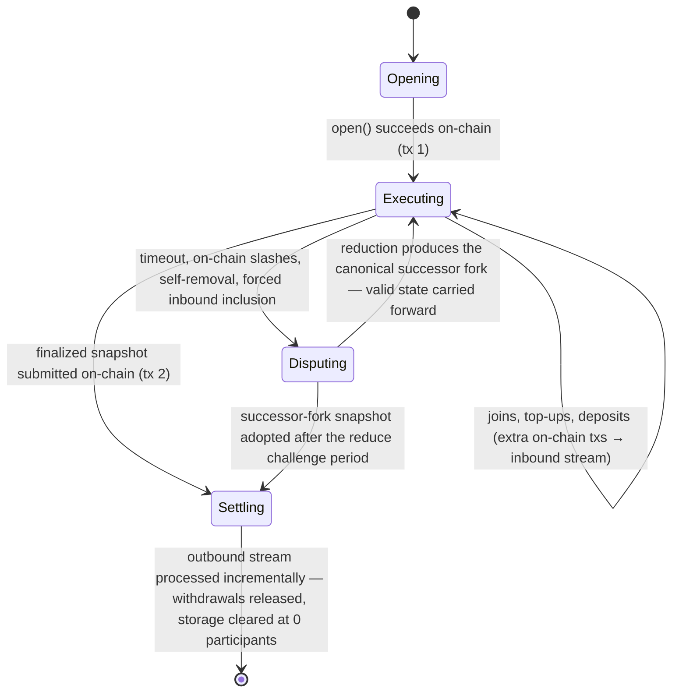
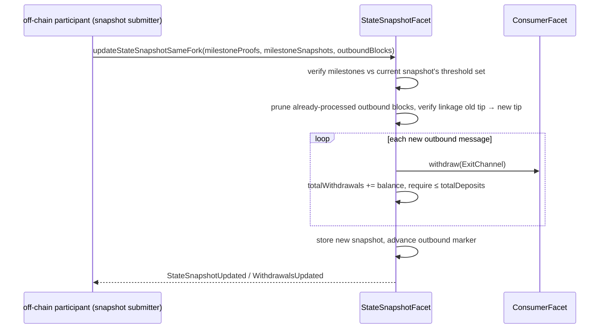

# Protocol Lifecycle

> **Agent status:** Maintained reverse-engineered draft.
> **Engineer verification:** Pending.
> **Status:** Draft; pending engineer verification.
> **Scope:** Defines the implementation-neutral protocol lifecycle behavior, assumptions, constraints, security properties, and black-box test plan.

## Contents

- [Purpose & observable contract](#1-purpose--observable-contract)
- [Lifecycle at a glance](#2-lifecycle-at-a-glance)
- [Phase 1 — Opening (on-chain, tx 1)](#3-phase-1--opening-on-chain-tx-1)
- [Phase 2 — Continuous execution (off-chain)](#4-phase-2--continuous-execution-off-chain)
- [Two paths to a snapshot-updating state](#5-two-paths-to-a-snapshot-updating-state)
- [Phase 3 — Disputes (on-chain fallback)](#6-phase-3--disputes-on-chain-fallback)
- [Phase 4 — Settlement (on-chain, tx 2)](#7-phase-4--settlement-on-chain-tx-2)
- [The four timing windows](#8-the-four-timing-windows)
- [Assumptions and constraints](#assumptions-and-constraints)
- [Security considerations](#security-considerations)
- [Requirements and invariants](#requirements-and-invariants)
- [Verification and test plan](#verification-and-test-plan)
- [Future Work](#future-work)

## 1. Purpose & observable contract

The lifecycle defines when a channel touches the base layer and what each touch accomplishes.
The design goal is that everything between opening and settlement is off-chain, free, and
real-time; the chain is touched to move value across the layer boundary and to adjudicate when
peers cannot cooperate.

**`REQ-LIF-1-A5BN02`.** The best-case complete lifecycle needs **at least two** base-layer transactions:

1. **Open/deposit** — `StateChannelManagerProxy.open`
   verifies the unanimously signed terms, deposits the committed assets, and records the genesis
   snapshot.
2. **Settlement** — a snapshot update
   (`StateSnapshotFacet.updateStateSnapshotSameFork` / `updateStateSnapshotFork`)
   that advances the on-chain snapshot and processes the outbound message stream, releasing
   withdrawals. This is the **normal** deposits-and-withdrawals path, not a dispute-only
   exceptional path.

The earlier claim that "opening is the one unavoidable on-chain step" is wrong: a participant who
wants their value back always needs the settlement transaction too. The real lifecycle can require
more transactions — joins and top-ups
(`JoinChannelFacet`),
block-calldata posts (`postBlockCalldata`), dispute uploads, reductions, challenges, fraud proofs,
and forced inbound inclusion.

## 2. Lifecycle at a glance

Fraud proofs run on a separate, immediate path beside this lifecycle: an objective violation seen
at any point can be proven on-chain at once and adds the offender to the on-chain slash set that
later dispute reductions consume. See [fraud-proofs.md](../disputes/fraud-proofs.md).

### Assumptions, constraints & dependencies

- The chain hosting the manager is live, honest, and final, and every participant can reach it
  through at least one honest RPC endpoint ([security/trust-model.md](../security/trust-model.md)).
- All deadlines are measured against chain-aligned time
  (`Clock`, [time.md](../protocol-model/time.md)).
- The integrator state machine is deterministic and its state serializes canonically
  ([concepts/state-machines.md](../protocol-model/state-machines.md)).

## 3. Phase 1 — Opening (on-chain, tx 1)

Participants submit a threshold-authorized open request to the base-layer adjudicator. The
application boundary accepts deposits and derives the genesis state; each off-chain participant
then observes the canonical open event and initializes the same channel and fork.

`open()` requires a non-zero channel id, no duplicate participants, a signature from **every**
listed participant over the encoded `OpenChannel`, and at least two successful deposits. Deposits
run composably through the application boundary (`depositAssetsComposable`), atomically when
`OpenChannel.isAtomic` is set. The successful joins become the first inbound message block; the
application boundary builds the genesis state; the genesis `SnapshotData` commits to the state hash,
participants, stream tips, and deposit totals; and `forkId = keccak256(abi.encode(genesisSnapshotData))`
becomes the root fork identity ([concepts/history-and-commitments.md](../protocol-model/history-and-commitments.md)).

Later joins and top-ups are additional on-chain transactions that append to the **inbound** stream
and enter channel state when a block author packages them; see
[cross-layer-messages.md](./cross-layer-messages.md).

**`REQ-LIF-8-2HDG3A` — Enumerable open-channel lifecycle.** A successful opening
adds its channel ID exactly once to an enumerable manager-owned set after the genesis snapshot exists.
A failed or duplicate opening does not change that set. The final valid snapshot update that leaves zero
participants removes the ID while deleting the snapshot. Removal preserves every other member and permits
the fully closed ID to be opened and appended again later. Paged reads return the current set without
asserting participant availability or caller eligibility.

## 4. Phase 2 — Continuous execution (off-chain)

The scheduled participant authors and validates blocks, peers exchange confirmations and
signatures, and all participants advance the same deterministic state. The base layer is absent
from the happy path; calldata publication remains the data-availability fallback.

The deterministically scheduled author (`getNextToWrite()`) executes a transaction locally, builds
the block, signs it, and broadcasts it. Peers re-execute, verify author, linkage, and timing, then
sign and return signatures. Participants **do not wait** for a block to reach threshold finality
before building the next one — finality trails behind production. The full model, including the
three finality routes and the calldata fallback, is specified in [finality.md](../protocol-model/finality.md).

**`REQ-LIF-3-PDRTPY`.** A normal state transition MAY produce an outbound message — including an
`ExitChannel` — as an ordinary transition result. Exits are **not** limited to removal or
slashing, and **producing the message requires no finality**. Finality is required only when a
snapshot carrying that outbound tip is submitted on-chain.

## 5. Two paths to a snapshot-updating state

**`REQ-LIF-2-Z3Z9Y3`.** Exactly two paths lead to a state that can update the on-chain snapshot and support
withdrawals:

1. **Same-fork finality.** Every required participant signed (directly or via virtual votes —
   [finality.md](../protocol-model/finality.md)); the proof of finality (milestone proofs + milestone snapshots —
   [state-proofs.md](../disputes/state-proofs.md)) is submitted with the snapshot via
   `updateStateSnapshotSameFork`. the adjudicator checks the snapshot is newer, the milestones verify
   against the current on-chain snapshot's threshold set, and all pending inbound messages were
   consumed.
2. **Dispute resolution.** A dispute window reduces deterministically to a successor fork
   ([disputes.md](../disputes/disputes.md)); after the reduce challenge period (`evidenceTime`) expires,
   `updateStateSnapshotFork` adopts the successor fork's genesis snapshot. the adjudicator walks the
   `reducedResult` chain from the current on-chain fork, so several dispute generations can be
   adopted in one call. **For this protocol version:** when the reduction is computed and finalized
   on-chain, its result is recorded with the challenge period already elapsed, so adoption is not
   delayed — the deployment pays in gas instead of time. A challenge period that has still to run
   is the cost of the alternative, gas-saving path of committing to a reduction outcome.

Both paths converge on `_updateStateSnapshot`, which processes the outbound stream (below).

## 6. Phase 3 — Disputes (on-chain fallback)

The disputing participant constructs and audits evidence while the base-layer adjudicator owns the
window lifecycle, proof validation, reduction, and successor-fork commitment.

The valid dispute inputs are participant timeout, accumulated on-chain slashes, voluntary
self-removal, and forced inclusion of newer inbound messages ([disputes.md](../disputes/disputes.md)).
Uploading a dispute opens (or joins) a `DisputeWindow` for the disputed fork and records the
disputer's commitment immediately.

**`REQ-LIF-4-SW8GVY`.** Every initiated dispute runs through the dispute game and produces a **canonical
successor fork** — whether the submitted claim is ultimately accepted, rejected, or reduced away.
The reduction (`reduce` → `reduceOutputToSnapshotData`) deterministically folds the committed
disputes into a new genesis `SnapshotData`; its hash is the successor `forkId`; off-chain
execution resumes from that fork with valid non-final transitions carried forward
([finality.md §7](../protocol-model/finality.md)). An invalid committed dispute can be killed during the kill
period and its opener slashed, but the window it opened still resolves to a canonical outcome for
the fork; the exact kill semantics are specified (with their open questions) in
[disputes.md](../disputes/disputes.md).

**`REQ-LIF-7-0XZBDM`.** A committed dispute suspends off-chain execution on the disputed
fork. From the moment a participant observes a dispute committed against its current fork, it
MUST stop advancing that fork: blocks already queued for the fork are discarded, and newly
received blocks on the fork are rejected instead of validated. Execution resumes only on the
canonical successor fork ([`REQ-LIF-4-SW8GVY`](lifecycle.md#req-lif-4-sw8gvy)), with valid
non-final work carried forward — the pause costs time, not progress. A dispute against a fork
that is not the participant's current fork MUST NOT suspend execution on the current fork.
**For this protocol version:** the pause is bounded by the evidence and kill periods, i.e.
approximately `2 × evidenceTime` (§8) in the worst case where evidence arrives at the end of the
evidence period. The reduce challenge period does **not** extend it: the reduction is computed
on-chain from the complete committed dispute set, so every participant can derive the same
winning successor fork as soon as reduction is finalized and resume building on it immediately.
A pending reduce challenge period delays only on-chain snapshot adoption — that is, an immediate
withdrawal — never the resumption of off-chain execution. The runtime surfaces the pause and its
expected duration to the integrating application when the first dispute against the fork is
observed.

## 7. Phase 4 — Settlement (on-chain, tx 2)

The submitting participant selects the settlement path and assembles the required proof. The
base-layer adjudicator verifies it, handles benign races such as another peer settling first,
persists the snapshot, and invokes the application withdrawal boundary.

Settlement is **incremental outbound-stream processing** during a snapshot update, not a
standalone withdrawal call. `_updateStateSnapshot`:

1. prunes outbound message blocks the chain already processed (comparing against the stored
   outbound tip),
2. verifies the supplied range links the old tip to the new snapshot's committed tip,
3. processes each message (an `EXIT` message runs `withdrawAssetsComposable` → application boundary
   `withdraw`), accumulating `totalWithdrawals`,
4. **[`INV-LIF-5-ENQB91`](lifecycle.md#inv-lif-5-enqb91):** requires `totalWithdrawals <= totalDeposits` after every message
   (`CantWithdrawMoreThanDeposits`) — settlement conserves value,
5. stores the new snapshot and advances the outbound accounting; at 0 remaining participants the
   channel's storage is cleared and its ID is removed from the enumerable open-channel set.

The same mechanism serves normal exits, dispute-derived exits, and arbitrary outbound messages;
the stream model is specified in [cross-layer-messages.md](./cross-layer-messages.md).

## 8. The four timing windows

**`REQ-LIF-6-VG861M`.** Four protocol windows are configured on the manager at deployment
(`StateChannelManagerProxy`
deployment configuration; defaults in seconds in parentheses) and mirrored into the off-chain participant's
`timeConfig`. Each bounds a specific phase:

| Window              | Default | Bounds                                                                                                                                                                                                                                                                                                                                                                                                           |
| ------------------- | ------- | ---------------------------------------------------------------------------------------------------------------------------------------------------------------------------------------------------------------------------------------------------------------------------------------------------------------------------------------------------------------------------------------------------------------- |
| `p2pTime`           | 15      | The author's slot: the maximum block timestamp is the previous relevant timestamp + `p2pTime` (+ first-block grace). Producing later makes the slot objectively missed.                                                                                                                                                                                                                                          |
| `agreementTime`     | 5       | Signature collection: how long the author waits for the full threshold before falling back to posting block calldata on-chain (`the corresponding participant-state operation`); also the peer RPC timeout and the wait before an exiting participant escalates.                                                                                                                                                 |
| `chainFallbackTime` | 30      | Extra time to land the calldata post on-chain: the timeout clock for the next author runs for `p2pTime + agreementTime + chainFallbackTime` (+ grace) before a timeout dispute is opened (`the corresponding participant-state operation`), and `postBlockCalldata`'s `maxTimestamp` guard uses the same bound.                                                                                                  |
| `evidenceTime`      | 30      | Every on-chain dispute period: the evidence period (window creation + `evidenceTime`), the kill period (last evidence submission + `evidenceTime`), the reduce challenge period (reduction + `evidenceTime`), and the per-disputer throttle. A posted calldata commitment also extends the acceptable block-timestamp window by `evidenceTime` — the extra time the protocol grants when peers do not cooperate. |

The calldata fallback's cost and griefing exposure are a deliberate, known weakness of the current
design — see [security/data-availability.md](../security/data-availability.md). Chain-time
tracking, skew bounds, and timestamp validation rules are in [time.md](../protocol-model/time.md).

## Assumptions and constraints

The lifecycle assumes a live final chain, valid channel setup, deterministic off-chain execution, available
history/proofs, and timing windows that permit honest observation and response. Opening and settlement are
unavoidable chain boundaries; joins, top-ups, forced data publication, disputes, and fraud proofs add further
transactions as behavior requires. Phase transitions must be monotonic or explicitly recoverable, and no
failure may strand value in a state that neither execution nor adjudication can advance.

## Security considerations

Lifecycle security concerns ownership of deposits, authorization to advance state, availability during
offline periods, and atomic movement between phases. Tests must cover duplicate/reordered chain events,
partial opening, concurrent execution and joins, stale snapshot attempts, unavailable peers, dispute races,
failed settlement, retry/recovery, and all terminal states. The diagram is not sufficient evidence: every edge
and prohibited edge needs an observable oracle and must preserve value and canonical-history invariants.

The execution pause of [`REQ-LIF-7-0XZBDM`](lifecycle.md#req-lif-7-0xzbdm) is a bounded griefing surface: a
dispute-eligible participant can suspend the fork's off-chain execution for up to `2 × evidenceTime` by
committing a dispute. The bound on abuse is accountability rather than rate: a dispute must carry a valid
reason, and one that does not is killed during the kill period with its opener slashed — so an unfounded
suspension can be inflicted at most once per participant, at the cost of their stake. Sizing `evidenceTime`
therefore trades this pause length against the evidence and kill periods' own response budgets.

Runtime reuse under [`REQ-LIF-10-QR8NQ9`](lifecycle.md#req-lif-10-qr8nq9) makes channel-scoped work a
cross-channel hazard: a leave from a runtime with nothing to settle returns it at once, possibly while a
synchronization for the old channel is still waiting on a peer. If that late result could write into the
returned runtime or complete the next channel's initial synchronization, the next channel would start from
foreign state or skip its own synchronization. Such late work is therefore discarded before its first write, not merely
before its last one, and it is not held against the peer that answered it, since the peer answered a request
that was valid when it was made. The same hazard reaches the chain and the peer registry, not only local
state. An admission whose authorization was collected while the channel was still held would, if submitted
after the leave, put the departed signer back into the channel it just left; it is abandoned instead. And an
exclusion recorded while the return is running would be a verdict about no channel at all — the peers of the
channel being given up are all departing with it — that nevertheless follows the identity into the next
channel, because exclusions are identity-scoped; the return therefore records none, and disconnects only. For the same
reason the fork being left is retired first: work for it that is still running while the runtime is returned
could otherwise start new fork-scoped work, such as a reduction, that the return then strands.

Two further edges of the same hazard are load-bearing rather than incidental. A return that cannot complete
would otherwise hand the next channel a runtime whose old-channel work is still live, so the runtime is
retired instead and the leave rejects: availability of the instance is traded for the guarantee that no
channel is ever served by a half-returned runtime. And releasing the channel's scheduled work would otherwise
strand any operation whose only remaining completion was a timer that release cancels; those operations are
failed, because an operation that can never complete is worse for the application than one that fails.
Exclusions are the deliberate exception to releasing peer state: they are identity-scoped for the runtime's
lifetime
([`REQ-AUTH-4-JWCF71` (Penalty requires proof)](../peer-communication/handshake.md#req-auth-4-jwcf71)), so a
proven cheater cannot earn a clean slate by waiting for its victim to change channel. The residual exposure is
the mirror image: an identity proven faulty in one channel is refused in the next channel the same runtime
serves even where that channel's participants saw nothing wrong, and no exclusion survives a restart.

## Requirements and invariants

Targeted connection follows [`REQ-TJOIN-1-5VGR1F` (Independent public options)](../peer-communication/targeted-channel-join.md#req-tjoin-1-5vgr1f),
[`REQ-TJOIN-3-DCZKS6` (Verified synchronization and membership)](../peer-communication/targeted-channel-join.md#req-tjoin-3-dczks6), and
[`REQ-TJOIN-5-Q795M7` (Phase-specific failure)](../peer-communication/targeted-channel-join.md#req-tjoin-5-q795m7).
Submitted first joins use the local pending protection in
[`INV-MEMBERSHIP-PENDING-1-2H1T75` (Submitted joins are locally)](../peer-communication/join-authorization.md#inv-membership-pending-1-2h1t75).

**[`REQ-LIF-1-A5BN02`](lifecycle.md#req-lif-1-a5bn02).** Best-case complete lifecycle needs at least two base-layer txs: open/deposit and settlement via a snapshot update that processes the outbound stream.

**[`REQ-LIF-2-Z3Z9Y3`](lifecycle.md#req-lif-2-z3z9y3).** Only two paths yield a snapshot-updating state: same-fork finality proof, or dispute reduction after the challenge window.

**[`REQ-LIF-3-PDRTPY`](lifecycle.md#req-lif-3-pdrtpy).** A normal transition may produce an outbound exit message; producing it needs no finality — finality is needed only at on-chain snapshot submission.

**[`REQ-LIF-4-SW8GVY`](lifecycle.md#req-lif-4-sw8gvy).** Every initiated dispute produces a canonical successor fork; execution resumes from it.

**`INV-LIF-5-ENQB91`.** Settlement conserves value: processed withdrawals never exceed deposits.

**[`REQ-LIF-6-VG861M`](lifecycle.md#req-lif-6-vg861m).** Four deployment-configured windows (`p2pTime`, `agreementTime`, `chainFallbackTime`, `evidenceTime`) bound the phases as specified in §8.

**[`REQ-LIF-7-0XZBDM`](lifecycle.md#req-lif-7-0xzbdm).** A committed dispute suspends off-chain execution on the disputed fork (queued blocks discarded, new blocks rejected) until execution resumes on the canonical successor fork; other forks are unaffected.

**[`REQ-LIF-8-2HDG3A`](lifecycle.md#req-lif-8-2hdg3a).** Successful open appends one current channel ID; final
zero-participant close removes it without corrupting the remaining set; failed operations are inert and a
fully closed ID may be opened again.

**`REQ-LIF-10-QR8NQ9` — Runtime departure and channel reuse.** An
application-facing leave ends one channel membership; it does not end the runtime. A committed participant
first reaches either a fully signed snapshot update or the normal self-removal dispute fallback, then waits
for settled removal and local `SYNCED` (reached only once the chain lists the signer neither as a participant
nor as a pending participant). If posting any fully signed application-authored exit snapshot fails, the same
self-removal dispute fallback applies, whether or not the exit came from the application-facing leave
operation. An observer owes no departure and completes at once. Once departure is observed the runtime returns
to its pre-channel state — no selected channel or fork, no channel-scoped retained state, no channel peer set,
and no channel-scoped scheduled work — while the signing identity, the transport substrate, and the execution
facilities survive, so the same runtime may then select another channel and may repeat the cycle. Peer state
goes with the channel with one exception: an exclusion earned by proof of an attributable fault is scoped to
that identity for the runtime's lifetime
([`REQ-AUTH-4-JWCF71` (Penalty requires proof)](../peer-communication/handshake.md#req-auth-4-jwcf71)), so it
survives the return and still refuses that identity in the next channel. Releasing the channel's scheduled
work settles every pending operation whose only remaining completion was that work: such an operation fails
rather than waiting indefinitely. Work begun for a channel the runtime has since left — including a synchronization still in
flight when a leave returned the runtime to its pre-channel state — neither changes the runtime's state nor
completes the next channel's initial synchronization, which must be reached by that channel's own
synchronization. It performs none of its writes, including any write it would make before its own result is
verified, and it does not re-establish the departed runtime's membership: an admission or balance increase
whose authorization was assembled while the channel was still held MUST be abandoned rather than submitted
once the leave has settled, so a departed signer is never put back into that channel's on-chain sets.
Neither is such work held against the peer that served it: a request that was valid when
it was made earns its responder no disconnection and no exclusion from an outcome observed after the channel
it belonged to was left, whether that outcome is the peer's answer, its refusal, or the failure of the
request itself. While the return to the pre-channel state is in progress the runtime records no exclusion at
all: every peer of the channel being given up is departing with it, so an outcome that would otherwise
exclude a peer only closes its connection. Because an exclusion is scoped to the identity and outlives the
return ([`REQ-AUTH-4-JWCF71` (Penalty requires proof)](../peer-communication/handshake.md#req-auth-4-jwcf71)),
one recorded during the return would follow that identity into the next channel while belonging to no
channel the runtime served. The fork of the channel being left stops being active as soon as the return to the
pre-channel state begins, so work for it that is still running during the return can start nothing new for
that fork. The writer role is application-owned: the application that assigned it is its single writer,
and the return to the pre-channel state neither reads nor changes it. Explicit shutdown and abort remain
separate terminal operations. If an
authored exit cannot settle by snapshot and its dispute fallback fails, the pending leave rejects and the
runtime stays bound to the channel it could not leave: repeated leave calls observe the same failure, and
concurrent channel work stays rejected rather than starting against a half-left channel. A delayed failure
from an older fork must not reject a leave on the current fork. A failure of the return itself, after
departure has already settled, is the opposite case and MUST NOT leave a partly returned runtime available:
the runtime shuts down, exactly as a leave did before runtimes were reusable, and the leave rejects, so no
other channel is ever served on it.

## Verification and test plan

### Requirement test matrix

Each row is a planned black-box test obligation, not an additional specification requirement. The requirement remains the authority. Execute the row through public protocol inputs from every applicable pre-state defined by this document. Every required permutation has a stable `P1`…`PN` suffix under its plan item. The list is exhaustive unless it explicitly says that boundary or pairwise representatives are sufficient; an omitted permutation needs an engineer-approved rationale.

| Plan item                                               | Requirements / invariants                             | Setup and stimulus                                                                                                                                                                                                                                                                                                                                                                                                                                                                                                                                                                                                                                                                                              | Expected result                                                                                                                                                                                                                                                                                                                                                                                                                                                                                                                                                                                                                                                                                                              | Required permutations                                                                                                                                                                                                                                                                                                                                                                                                                                                                                                                                                                                                                                                                                                                                                                                                                                                                                                                                                                                                                                                                                                                                                                                                                                                                                                                                                                                                                                                                                                                                                                                                                                                                                                                                                                                                                                                                                                                                                                                                                                                                                                                                                                                                                                                                                                                                                                                                                                                                                                                                                                                                                                                                                                                                                                                                                                                                                                                                                                                                                                                                                                                                                                                                                                                                                                                                                                                                                                                                                                                                                                                                                                                                                                                                                                                                                                                                                                                                                                                                                                                                                                                                                                                                                                                                                                                                                                                                                                                                                                                                                                                                                                                                                                                                                                                                                                                                                                                                                                                                                                                                                                                                             |
| ------------------------------------------------------- | ----------------------------------------------------- | --------------------------------------------------------------------------------------------------------------------------------------------------------------------------------------------------------------------------------------------------------------------------------------------------------------------------------------------------------------------------------------------------------------------------------------------------------------------------------------------------------------------------------------------------------------------------------------------------------------------------------------------------------------------------------------------------------------- | ---------------------------------------------------------------------------------------------------------------------------------------------------------------------------------------------------------------------------------------------------------------------------------------------------------------------------------------------------------------------------------------------------------------------------------------------------------------------------------------------------------------------------------------------------------------------------------------------------------------------------------------------------------------------------------------------------------------------------- | ----------------------------------------------------------------------------------------------------------------------------------------------------------------------------------------------------------------------------------------------------------------------------------------------------------------------------------------------------------------------------------------------------------------------------------------------------------------------------------------------------------------------------------------------------------------------------------------------------------------------------------------------------------------------------------------------------------------------------------------------------------------------------------------------------------------------------------------------------------------------------------------------------------------------------------------------------------------------------------------------------------------------------------------------------------------------------------------------------------------------------------------------------------------------------------------------------------------------------------------------------------------------------------------------------------------------------------------------------------------------------------------------------------------------------------------------------------------------------------------------------------------------------------------------------------------------------------------------------------------------------------------------------------------------------------------------------------------------------------------------------------------------------------------------------------------------------------------------------------------------------------------------------------------------------------------------------------------------------------------------------------------------------------------------------------------------------------------------------------------------------------------------------------------------------------------------------------------------------------------------------------------------------------------------------------------------------------------------------------------------------------------------------------------------------------------------------------------------------------------------------------------------------------------------------------------------------------------------------------------------------------------------------------------------------------------------------------------------------------------------------------------------------------------------------------------------------------------------------------------------------------------------------------------------------------------------------------------------------------------------------------------------------------------------------------------------------------------------------------------------------------------------------------------------------------------------------------------------------------------------------------------------------------------------------------------------------------------------------------------------------------------------------------------------------------------------------------------------------------------------------------------------------------------------------------------------------------------------------------------------------------------------------------------------------------------------------------------------------------------------------------------------------------------------------------------------------------------------------------------------------------------------------------------------------------------------------------------------------------------------------------------------------------------------------------------------------------------------------------------------------------------------------------------------------------------------------------------------------------------------------------------------------------------------------------------------------------------------------------------------------------------------------------------------------------------------------------------------------------------------------------------------------------------------------------------------------------------------------------------------------------------------------------------------------------------------------------------------------------------------------------------------------------------------------------------------------------------------------------------------------------------------------------------------------------------------------------------------------------------------------------------------------------------------------------------------------------------------------------------------------------------------------------------- |
| `REQ-LIF-1-A5BN02.T1`   | [`REQ-LIF-1-A5BN02`](lifecycle.md#req-lif-1-a5bn02)   | Use the applicable black-box method in the verification strategy above; exercise the behavior through public inputs without implementation internals.                                                                                                                                                                                                                                                                                                                                                                                                                                                                                                                                                           | Best-case complete lifecycle needs at least two base-layer txs: open/deposit and settlement via a snapshot update that processes the outbound stream.                                                                                                                                                                                                                                                                                                                                                                                                                                                                                                                                                                        | `REQ-LIF-1-A5BN02.T1.P1` — valid case `REQ-LIF-1-A5BN02.T1.P4` — direct invalid/opposite case `REQ-LIF-1-A5BN02.T1.P2` — matching commitment `REQ-LIF-1-A5BN02.T1.P5` — mismatched commitment `REQ-LIF-1-A5BN02.T1.P6` — predecessor snapshot `REQ-LIF-1-A5BN02.T1.P7` — genesis snapshot `REQ-LIF-1-A5BN02.T1.P8` — stale fork `REQ-LIF-1-A5BN02.T1.P9` — foreign fork `REQ-LIF-1-A5BN02.T1.P3` — zero balance `REQ-LIF-1-A5BN02.T1.P10` — exact balance boundary `REQ-LIF-1-A5BN02.T1.P11` — one beyond boundary `REQ-LIF-1-A5BN02.T1.P12` — maximum value `REQ-LIF-1-A5BN02.T1.P13` — conservation check                                                                                                                                                                                                                                                                                                                                                                                                                                                                                                                                                                                                                                                                                                                                                                                                                                                                                                                                                                                                                                                                                                                                                                                                                                                                                                                                                                                                                                                                                                                                                                                                                                                                                                                                                                                                                                                                                                                                                                                                                                                                                                                                                                                                                                                                                                                                                                                                                                                                                                                                                                                                                                                                                                                                                                                                                                                                                                                                                                                                                                                                                                                                                                                                                                                                                                                                                                                                                                                                                                                                                                                                                                                                                                                                                                                                                                                                                                                                                                                                                                        |
| `REQ-LIF-2-Z3Z9Y3.T1`   | [`REQ-LIF-2-Z3Z9Y3`](lifecycle.md#req-lif-2-z3z9y3)   | Use the applicable black-box method in the verification strategy above; exercise the behavior through public inputs without implementation internals.                                                                                                                                                                                                                                                                                                                                                                                                                                                                                                                                                           | Only two paths yield a snapshot-updating state: same-fork finality proof, or dispute reduction after the challenge window.                                                                                                                                                                                                                                                                                                                                                                                                                                                                                                                                                                                                   | `REQ-LIF-2-Z3Z9Y3.T1.P1` — valid case `REQ-LIF-2-Z3Z9Y3.T1.P5` — direct invalid/opposite case `REQ-LIF-2-Z3Z9Y3.T1.P2` — matching commitment `REQ-LIF-2-Z3Z9Y3.T1.P6` — mismatched commitment `REQ-LIF-2-Z3Z9Y3.T1.P7` — predecessor snapshot `REQ-LIF-2-Z3Z9Y3.T1.P8` — genesis snapshot `REQ-LIF-2-Z3Z9Y3.T1.P9` — stale fork `REQ-LIF-2-Z3Z9Y3.T1.P10` — foreign fork `REQ-LIF-2-Z3Z9Y3.T1.P3` — before deadline `REQ-LIF-2-Z3Z9Y3.T1.P11` — at deadline `REQ-LIF-2-Z3Z9Y3.T1.P12` — after deadline `REQ-LIF-2-Z3Z9Y3.T1.P13` — maximum honest skew `REQ-LIF-2-Z3Z9Y3.T1.P4` — malformed input `REQ-LIF-2-Z3Z9Y3.T1.P14` — adversarial input `REQ-LIF-2-Z3Z9Y3.T1.P15` — partial failure `REQ-LIF-2-Z3Z9Y3.T1.P16` — retry and recovery                                                                                                                                                                                                                                                                                                                                                                                                                                                                                                                                                                                                                                                                                                                                                                                                                                                                                                                                                                                                                                                                                                                                                                                                                                                                                                                                                                                                                                                                                                                                                                                                                                                                                                                                                                                                                                                                                                                                                                                                                                                                                                                                                                                                                                                                                                                                                                                                                                                                                                                                                                                                                                                                                                                                                                                                                                                                                                                                                                                                                                                                                                                                                                                                                                                                                                                                                                                                                                                                                                                                                                                                                                                                                                                                                                                    |
| `REQ-LIF-3-PDRTPY.T1`   | [`REQ-LIF-3-PDRTPY`](lifecycle.md#req-lif-3-pdrtpy)   | Use the applicable black-box method in the verification strategy above; exercise the behavior through public inputs without implementation internals.                                                                                                                                                                                                                                                                                                                                                                                                                                                                                                                                                           | A normal transition may produce an outbound exit message; producing it needs no finality — finality is needed only at on-chain snapshot submission.                                                                                                                                                                                                                                                                                                                                                                                                                                                                                                                                                                          | `REQ-LIF-3-PDRTPY.T1.P1` — valid case `REQ-LIF-3-PDRTPY.T1.P3` — direct invalid/opposite case `REQ-LIF-3-PDRTPY.T1.P2` — matching commitment `REQ-LIF-3-PDRTPY.T1.P4` — mismatched commitment `REQ-LIF-3-PDRTPY.T1.P5` — predecessor snapshot `REQ-LIF-3-PDRTPY.T1.P6` — genesis snapshot `REQ-LIF-3-PDRTPY.T1.P7` — stale fork `REQ-LIF-3-PDRTPY.T1.P8` — foreign fork                                                                                                                                                                                                                                                                                                                                                                                                                                                                                                                                                                                                                                                                                                                                                                                                                                                                                                                                                                                                                                                                                                                                                                                                                                                                                                                                                                                                                                                                                                                                                                                                                                                                                                                                                                                                                                                                                                                                                                                                                                                                                                                                                                                                                                                                                                                                                                                                                                                                                                                                                                                                                                                                                                                                                                                                                                                                                                                                                                                                                                                                                                                                                                                                                                                                                                                                                                                                                                                                                                                                                                                                                                                                                                                                                                                                                                                                                                                                                                                                                                                                                                                                                                                                                                                                                                                                                                                                                                                                              |
| `REQ-LIF-4-SW8GVY.T1`   | [`REQ-LIF-4-SW8GVY`](lifecycle.md#req-lif-4-sw8gvy)   | Use the applicable black-box method in the verification strategy above; exercise the behavior through public inputs without implementation internals.                                                                                                                                                                                                                                                                                                                                                                                                                                                                                                                                                           | Every initiated dispute produces a canonical successor fork; execution resumes from it.                                                                                                                                                                                                                                                                                                                                                                                                                                                                                                                                                                                                                                      | `REQ-LIF-4-SW8GVY.T1.P1` — valid case `REQ-LIF-4-SW8GVY.T1.P4` — direct invalid/opposite case `REQ-LIF-4-SW8GVY.T1.P2` — matching commitment `REQ-LIF-4-SW8GVY.T1.P5` — mismatched commitment `REQ-LIF-4-SW8GVY.T1.P6` — predecessor snapshot `REQ-LIF-4-SW8GVY.T1.P7` — genesis snapshot `REQ-LIF-4-SW8GVY.T1.P8` — stale fork `REQ-LIF-4-SW8GVY.T1.P9` — foreign fork `REQ-LIF-4-SW8GVY.T1.P3` — malformed input `REQ-LIF-4-SW8GVY.T1.P10` — adversarial input `REQ-LIF-4-SW8GVY.T1.P11` — partial failure `REQ-LIF-4-SW8GVY.T1.P12` — retry and recovery                                                                                                                                                                                                                                                                                                                                                                                                                                                                                                                                                                                                                                                                                                                                                                                                                                                                                                                                                                                                                                                                                                                                                                                                                                                                                                                                                                                                                                                                                                                                                                                                                                                                                                                                                                                                                                                                                                                                                                                                                                                                                                                                                                                                                                                                                                                                                                                                                                                                                                                                                                                                                                                                                                                                                                                                                                                                                                                                                                                                                                                                                                                                                                                                                                                                                                                                                                                                                                                                                                                                                                                                                                                                                                                                                                                                                                                                                                                                                                                                                                                                                                                               |
| `INV-LIF-5-ENQB91.T1`   | [`INV-LIF-5-ENQB91`](lifecycle.md#inv-lif-5-enqb91)   | Use the applicable black-box method in the verification strategy above; exercise the behavior through public inputs without implementation internals.                                                                                                                                                                                                                                                                                                                                                                                                                                                                                                                                                           | Settlement conserves value: processed withdrawals never exceed deposits.                                                                                                                                                                                                                                                                                                                                                                                                                                                                                                                                                                                                                                                     | `INV-LIF-5-ENQB91.T1.P1` — valid case `INV-LIF-5-ENQB91.T1.P3` — direct invalid/opposite case `INV-LIF-5-ENQB91.T1.P2` — zero balance `INV-LIF-5-ENQB91.T1.P4` — exact balance boundary `INV-LIF-5-ENQB91.T1.P5` — one beyond boundary `INV-LIF-5-ENQB91.T1.P6` — maximum value `INV-LIF-5-ENQB91.T1.P7` — conservation check                                                                                                                                                                                                                                                                                                                                                                                                                                                                                                                                                                                                                                                                                                                                                                                                                                                                                                                                                                                                                                                                                                                                                                                                                                                                                                                                                                                                                                                                                                                                                                                                                                                                                                                                                                                                                                                                                                                                                                                                                                                                                                                                                                                                                                                                                                                                                                                                                                                                                                                                                                                                                                                                                                                                                                                                                                                                                                                                                                                                                                                                                                                                                                                                                                                                                                                                                                                                                                                                                                                                                                                                                                                                                                                                                                                                                                                                                                                                                                                                                                                                                                                                                                                                                                                                                                                                                                                                                                                                                                                                                              |
| `REQ-LIF-6-VG861M.T1`   | [`REQ-LIF-6-VG861M`](lifecycle.md#req-lif-6-vg861m)   | Use the applicable black-box method in the verification strategy above; exercise the behavior through public inputs without implementation internals.                                                                                                                                                                                                                                                                                                                                                                                                                                                                                                                                                           | Four deployment-configured windows (`p2pTime`, `agreementTime`, `chainFallbackTime`, `evidenceTime`) bound the phases as specified in §8.                                                                                                                                                                                                                                                                                                                                                                                                                                                                                                                                                                                    | `REQ-LIF-6-VG861M.T1.P1` — valid case `REQ-LIF-6-VG861M.T1.P3` — direct invalid/opposite case `REQ-LIF-6-VG861M.T1.P2` — before deadline `REQ-LIF-6-VG861M.T1.P4` — at deadline `REQ-LIF-6-VG861M.T1.P5` — after deadline `REQ-LIF-6-VG861M.T1.P6` — maximum honest skew                                                                                                                                                                                                                                                                                                                                                                                                                                                                                                                                                                                                                                                                                                                                                                                                                                                                                                                                                                                                                                                                                                                                                                                                                                                                                                                                                                                                                                                                                                                                                                                                                                                                                                                                                                                                                                                                                                                                                                                                                                                                                                                                                                                                                                                                                                                                                                                                                                                                                                                                                                                                                                                                                                                                                                                                                                                                                                                                                                                                                                                                                                                                                                                                                                                                                                                                                                                                                                                                                                                                                                                                                                                                                                                                                                                                                                                                                                                                                                                                                                                                                                                                                                                                                                                                                                                                                                                                                                                                                                                                                                                                                                                         |
| `REQ-LIF-7-0XZBDM.T1`   | [`REQ-LIF-7-0XZBDM`](lifecycle.md#req-lif-7-0xzbdm)   | Open a channel and advance several blocks; commit a dispute through a public dispute input against the current fork; deliver further blocks on the disputed fork and on an undisputed control channel; complete reduction and observe the successor fork.                                                                                                                                                                                                                                                                                                                                                                                                                                                       | Execution on the disputed fork suspends (no state advance from queued or newly delivered blocks) and resumes only on the successor fork with valid non-final work carried forward; undisputed forks are unaffected.                                                                                                                                                                                                                                                                                                                                                                                                                                                                                                          | `REQ-LIF-7-0XZBDM.T1.P1` — block delivered on the disputed fork after dispute commitment is rejected (no state advance) `REQ-LIF-7-0XZBDM.T1.P2` — blocks queued before dispute commitment are discarded, not executed `REQ-LIF-7-0XZBDM.T1.P3` — dispute against a non-current fork leaves current-fork execution running `REQ-LIF-7-0XZBDM.T1.P4` — execution resumes on the successor fork; valid non-final blocks are carried forward `REQ-LIF-7-0XZBDM.T1.P5` — pause is observable to the integrating application with the expected duration on the first committed dispute `REQ-LIF-7-0XZBDM.T1.P6` — duplicate dispute commitment on the same fork does not restart or extend the surfaced pause                                                                                                                                                                                                                                                                                                                                                                                                                                                                                                                                                                                                                                                                                                                                                                                                                                                                                                                                                                                                                                                                                                                                                                                                                                                                                                                                                                                                                                                                                                                                                                                                                                                                                                                                                                                                                                                                                                                                                                                                                                                                                                                                                                                                                                                                                                                                                                                                                                                                                                                                                                                                                                                                                                                                                                                                                                                                                                                                                                                                                                                                                                                                                                                                                                                                                                                                                                                                                                                                                                                                                                                                                                                                                                                                                                                                                                                                                                                                                                                                                                                                                                                                                                                                                         |
| `REQ-LIF-8-2HDG3A.T1`   | [`REQ-LIF-8-2HDG3A`](lifecycle.md#req-lif-8-2hdg3a)   | Open one and several channels; read count and pages at all boundaries; attempt failed and duplicate opens; close first, middle, and last members through valid final zero-participant snapshots; repeat close; reopen a fully closed ID; reconstruct the live set from lifecycle events.                                                                                                                                                                                                                                                                                                                                                                                                                        | The enumerable set matches snapshot existence, preserves unaffected members through removal, remains inert on failure, pages safely, and agrees with the event-derived live set.                                                                                                                                                                                                                                                                                                                                                                                                                                                                                                                                             | `REQ-LIF-8-2HDG3A.T1.P1` — first and multiple append order; `REQ-LIF-8-2HDG3A.T1.P2` — duplicate/failed open inert; `REQ-LIF-8-2HDG3A.T1.P3` — zero/offset/past-end/truncated pages; `REQ-LIF-8-2HDG3A.T1.P4` — first removal; `REQ-LIF-8-2HDG3A.T1.P5` — middle swap-and-pop and reverse-index repair; `REQ-LIF-8-2HDG3A.T1.P6` — last removal; `REQ-LIF-8-2HDG3A.T1.P7` — repeated removal no-op; `REQ-LIF-8-2HDG3A.T1.P8` — reopen appends once; `REQ-LIF-8-2HDG3A.T1.P9` — indexer event set equals paged registry.                                                                                                                                                                                                                                                                                                                                                                                                                                                                                                                                                                                                                                                                                                                                                                                                                                                                                                                                                                                                                                                                                                                                                                                                                                                                                                                                                                                                                                                                                                                                                                                                                                                                                                                                                                                                                                                                                                                                                                                                                                                                                                                                                                                                                                                                                                                                                                                                                                                                                                                                                                                                                                                                                                                                                                                                                                                                                                                                                                                                                                                                                                                                                                                                                                                                                                                                                                                                                                                                                                                                                                                                                                                                                                                                                                                                                                                                                                                                                                                                                                                                                                                                                                                                                                                                                                                |
| `REQ-LIF-10-QR8NQ9.T1` | [`REQ-LIF-10-QR8NQ9`](lifecycle.md#req-lif-10-qr8nq9) | Leave through the public runtime API from observer and participant states; drive fast settlement and dispute fallback; then select another channel on the same runtime and repeat the cycle; also drive a leave whose fallback cannot settle, and a leave while the channel's initial synchronization is still in flight, a leave whose return to the pre-channel state cannot complete, and a leave observed from the peer that answered the in-flight synchronization; also drive an admission whose authorization round completes only after the leave settled, an acknowledgment round whose peers are still to answer when the leave begins, and a peer fault observed while the return itself is running. | The promise resolves only after removal is settled and observed, and the runtime is then back in its pre-channel state and able to select another channel; an observer completes at once. A rejected leave leaves the runtime bound to the channel it could not leave. Work still in flight for the channel left changes nothing in the returned runtime, writes nothing at all, starts nothing new for the fork left, does not complete the next channel's initial synchronization, does not put the departed signer back into that channel's membership, and costs its responder nothing. While the return is running no peer is excluded at all. A return that cannot complete retires the runtime and rejects the leave. | `REQ-LIF-10-QR8NQ9.T1.P1` — fast fully signed snapshot; `REQ-LIF-10-QR8NQ9.T1.P2` — self-removal dispute; `REQ-LIF-10-QR8NQ9.T1.P3` — observer completes at once and returns to its pre-channel state; `REQ-LIF-10-QR8NQ9.T1.P4` — the same runtime selects and reaches another channel once its leave settled; `REQ-LIF-10-QR8NQ9.T1.P5` — a departed leaver cannot sign a later block and remaining honest peers do not blacklist each other; `REQ-LIF-10-QR8NQ9.T1.P6` — a locally reduced fork that drops the leaver keeps its status and its leave pending until the chain's snapshot records the removal. A posted snapshot that drops a leaver cannot leave that leaver's JOIN pending: a JOIN is refused while the fork carries a dispute window, a same-fork post must consume every pending JOIN, and a reduction consumes the JOINs up to its window's expiry, so the removal alone proves the signer is in neither on-chain set.; `REQ-LIF-10-QR8NQ9.T1.P7` — fully signed exit: snapshot failure and a failed dispute submission reject leave; `REQ-LIF-10-QR8NQ9.T1.P8` — fully signed exit: snapshot failure and an evidence-expired fallback error reject leave; `REQ-LIF-10-QR8NQ9.T1.P9` — unsigned exit: a failed dispute submission rejects leave; `REQ-LIF-10-QR8NQ9.T1.P10` — unsigned exit: an evidence-expired fallback error rejects leave; `REQ-LIF-10-QR8NQ9.T1.P11` — unsigned exit: one self-removal dispute settles departure; `REQ-LIF-10-QR8NQ9.T1.P12` — repeated cycle: the runtime leaves the channel it reused, so a second departure settles and a third channel is selectable on the same instance; `REQ-LIF-10-QR8NQ9.T1.P13` — a rejected leave keeps the runtime bound: the repeated call observes the same failure and channel work stays rejected; `REQ-LIF-10-QR8NQ9.T1.P14` — non-committed reuse: a runtime that left as an observer selects, opens, and reaches another channel on the same instance; `REQ-LIF-10-QR8NQ9.T1.P15` — channel isolation after reuse: the reused runtime tracks only its new channel, and the peers of the old channel neither list it nor change their own channel; `REQ-LIF-10-QR8NQ9.T1.P16` — shutdown stays terminal after a reuse: an explicit shutdown of a reused runtime retires it and later calls fail; `REQ-LIF-10-QR8NQ9.T1.P17` — work outliving its channel: a synchronization still in flight when the runtime left completes afterwards without moving the returned runtime out of its pre-channel state or completing the next initial synchronization, so the next selection of a channel synchronizes on its own; `REQ-LIF-10-QR8NQ9.T1.P18` — fork retired first: from the moment the return to the pre-channel state begins, the fork being left is no longer active and a reduction requested for it starts no work; `REQ-LIF-10-QR8NQ9.T1.P19` — the return itself fails after a settled departure: the runtime shuts down rather than staying available, and the leave rejects with that failure; `REQ-LIF-10-QR8NQ9.T1.P20` — no penalty for work outliving its channel: a synchronization that ran for the channel left earns its responder neither a disconnection nor an exclusion, observed while the return is still in progress and the responder is still reachable; `REQ-LIF-10-QR8NQ9.T1.P21` — no write from work that outlived its channel: a synchronization resuming while the return is in progress performs none of its writes, including the first one it would make before its payload is fully verified; `REQ-LIF-10-QR8NQ9.T1.P22` — no membership from work that outlived its channel: an admission whose authorization round completes only after the leave settled is abandoned, so the departed signer is not put back into the channel it left and the operation reports failure; `REQ-LIF-10-QR8NQ9.T1.P23` — no exclusion during the return: a peer fault observed while the runtime is returning to its pre-channel state records no exclusion, so the identity is still admissible in the next channel; `REQ-LIF-10-QR8NQ9.T1.P24` — no penalty for a request round that outlived its channel: peers still to answer when the return began earn no exclusion, whether their request ends unanswered or in failure |

## Future Work

_Non-normative._

- Reduce settlement latency and cost: optimistic reduction commitments and fast-path finalization
  ideas are collected in [disputes.md](../disputes/disputes.md) Future Work.
- Alternative data-availability designs to cut the calldata fallback's fees and recovery latency;
  every candidate must state its new trust assumptions
  ([security/data-availability.md](../security/data-availability.md)).
- Define the destination of funds stranded in a channel that closes with zero participants.
- Batch settlement UX: `multicall` on the proxy already allows combining snapshot updates with
  other calls; document recommended patterns for integrators.
